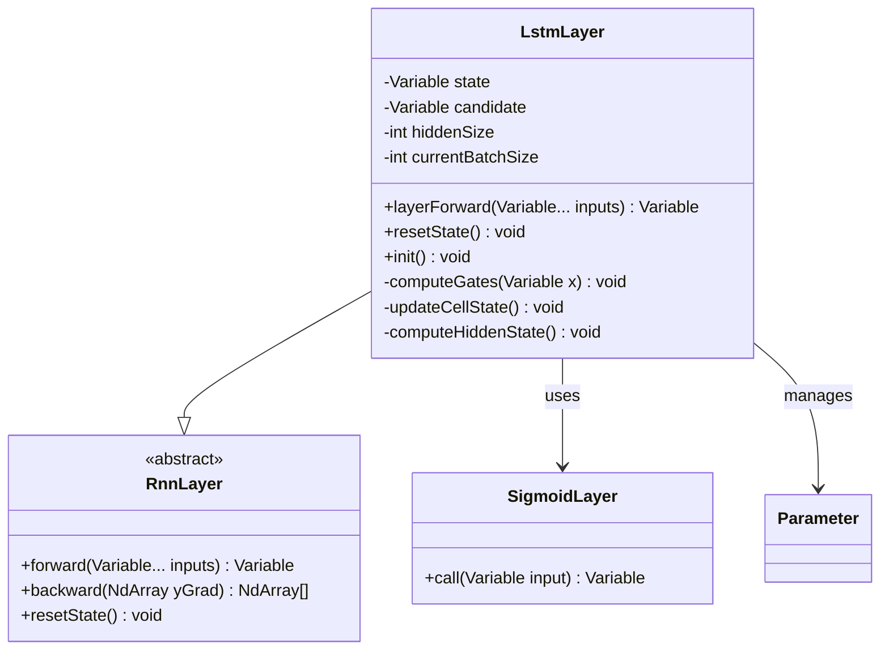
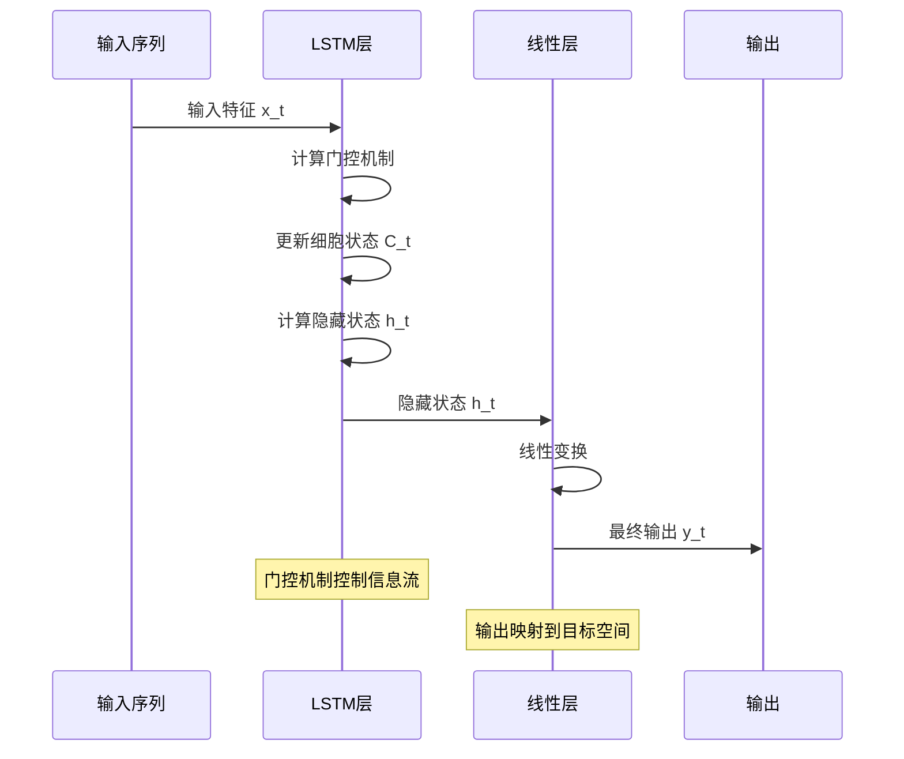
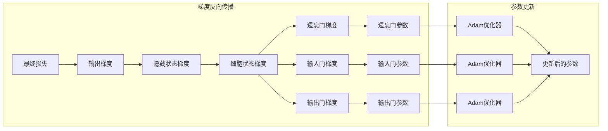
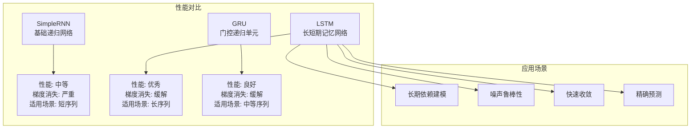

# LSTM网络实现详解

<cite>
**本文档引用的文件**
- [LstmLayer.java](file://tinyai-dl-nnet/src/main/java/io/leavesfly/tinyai/nnet/layer/rnn/LstmLayer.java)
- [LstmBlock.java](file://tinyai-dl-nnet/src/main/java/io/leavesfly/tinyai/nnet/block/LstmBlock.java)
- [CompleteRnnExample.java](file://tinyai-dl-case/src/main/java/io/leavesfly/tinyai/example/rnn/CompleteRnnExample.java)
- [LstmBlockTest.java](file://tinyai-dl-nnet/src/test/java/io/leavesfly/tinyai/nnet/block/LstmBlockTest.java)
- [SinDataSet.java](file://tinyai-dl-ml/src/main/java/io/leavesfly/tinyai/ml/dataset/simple/SinDataSet.java)
- [Adam.java](file://tinyai-dl-ml/src/main/java/io/leavesfly/tinyai/ml/optimize/Adam.java)
</cite>

## 目录
1. [简介](#简介)
2. [LSTM核心架构](#lstm核心架构)
3. [门控机制详解](#门控机制详解)
4. [LSTM层实现分析](#lstm层实现分析)
5. [LSTM块组合结构](#lstm块组合结构)
6. [训练流程与BPTT算法](#训练流程与bptt算法)
7. [性能比较与应用案例](#性能比较与应用案例)
8. [调优指南与最佳实践](#调优指南与最佳实践)
9. [故障排除与调试](#故障排除与调试)
10. [总结](#总结)

## 简介

LSTM（Long Short-Term Memory）网络是一种特殊的循环神经网络，专门设计用来解决传统RNN的梯度消失问题，能够有效学习长期依赖关系。在TinyAI框架中，LSTM通过精心设计的门控机制实现了强大的序列建模能力。

LSTM的核心创新在于引入了三个门控机制：遗忘门、输入门和输出门，这些机制共同控制信息的流动，使得网络能够在长时间序列中保持重要的信息，同时过滤掉无关的噪声。

## LSTM核心架构

### 基本数学原理

LSTM通过以下数学公式实现其独特的记忆能力：

```
遗忘门: f_t = σ(W_f * [h_{t-1}, x_t] + b_f)
输入门: i_t = σ(W_i * [h_{t-1}, x_t] + b_i)
输出门: o_t = σ(W_o * [h_{t-1}, x_t] + b_o)
候选细胞状态: ũ_t = tanh(W_u * [h_{t-1}, x_t] + b_u)
细胞状态更新: C_t = f_t * C_{t-1} + i_t * ũ_t
隐藏状态计算: h_t = o_t * tanh(C_t)
```

其中：
- f_t 是遗忘门输出，决定从细胞状态中丢弃哪些信息
- i_t 是输入门输出，控制哪些新信息被存储
- o_t 是输出门输出，决定基于细胞状态输出什么信息
- ũ_t 是候选细胞状态，表示可能的新信息
- C_t 是当前细胞状态，存储长期记忆
- h_t 是当前隐藏状态，作为当前时间步的输出

```mermaid
graph TB
subgraph "LSTM单元结构"
Input[输入 x_t] --> Concat[拼接 h_{t-1}]
Concat --> ForgetGate[遗忘门<br/>σ(W_f*[h_{t-1},x_t]+b_f)]
Concat --> InputGate[输入门<br/>σ(W_i*[h_{t-1},x_t]+b_i)]
Concat --> OutputGate[输出门<br/>σ(W_o*[h_{t-1},x_t]+b_o)]
Concat --> Candidate[候选状态<br/>tanh(W_u*[h_{t-1},x_t]+b_u)]
ForgetGate --> CellState1[细胞状态 C_{t-1}]
InputGate --> Candidate
Candidate --> CellState2[细胞状态 C_t]
CellState1 --> CellState2
CellState2 --> HiddenState[隐藏状态 h_t]
OutputGate --> HiddenState
end
```

**图表来源**
- [LstmLayer.java](file://tinyai-dl-nnet/src/main/java/io/leavesfly/tinyai/nnet/layer/rnn/LstmLayer.java#L20-L40)

**章节来源**
- [LstmLayer.java](file://tinyai-dl-nnet/src/main/java/io/leavesfly/tinyai/nnet/layer/rnn/LstmLayer.java#L1-L52)

## 门控机制详解

### 遗忘门（Forget Gate）

遗忘门负责决定从细胞状态中丢弃哪些信息。它通过以下公式计算：

```java
// 遗忘门计算
fGate = x.linear(getParamBy(getName() + ".x2f"), getParamBy(getName() + ".x2f-b"))
        .add(state.linear(getParamBy(getName() + ".h2f"), null));
fGate = new SigmoidLayer("").call(fGate);
```

遗忘门的输出值范围在0到1之间，其中：
- 接近0表示完全遗忘
- 接近1表示完全保留

### 输入门（Input Gate）

输入门控制哪些新信息被存储在细胞状态中：

```java
// 输入门计算
iGate = x.linear(getParamBy(getName() + ".x2i"), getParamBy(getName() + ".x2i-b"))
        .add(state.linear(getParamBy(getName() + ".h2i"), null));
iGate = new SigmoidLayer("").call(iGate);
```

输入门的作用包括：
1. 决定哪些新信息重要
2. 生成候选细胞状态
3. 控制信息的更新量

### 输出门（Output Gate）

输出门决定基于细胞状态输出什么信息：

```java
// 输出门计算
oGate = x.linear(getParamBy(getName() + ".x2o"), getParamBy(getName() + ".x2o-b"))
        .add(state.linear(getParamBy(getName() + ".h2o"), null));
oGate = new SigmoidLayer("").call(oGate);
```

输出门的输出同样在0到1之间，影响最终隐藏状态的输出强度。

```mermaid
flowchart TD
Start([输入 x_t, h_{t-1}, C_{t-1}]) --> ComputeFG["计算遗忘门 f_t"]
ComputeFG --> ComputeIG["计算输入门 i_t"]
ComputeIG --> ComputeOG["计算输出门 o_t"]
ComputeOG --> ComputeCS["计算候选状态 ũ_t"]
ComputeCS --> UpdateCS["更新细胞状态<br/>C_t = f_t * C_{t-1} + i_t * ũ_t"]
UpdateCS --> ComputeHS["计算隐藏状态<br/>h_t = o_t * tanh(C_t)"]
ComputeHS --> End([输出 h_t, C_t])
style ComputeFG fill:#ffcccc
style ComputeIG fill:#ccffcc
style ComputeOG fill:#ccccff
style UpdateCS fill:#ffffcc
```

**图表来源**
- [LstmLayer.java](file://tinyai-dl-nnet/src/main/java/io/leavesfly/tinyai/nnet/layer/rnn/LstmLayer.java#L182-L271)

**章节来源**
- [LstmLayer.java](file://tinyai-dl-nnet/src/main/java/io/leavesfly/tinyai/nnet/layer/rnn/LstmLayer.java#L182-L271)

## LSTM层实现分析

### 参数初始化策略

LSTM层采用了精心设计的参数初始化策略，使用了Xavier初始化方法：

```java
// 权重初始化 - 使用 sqrt(1/fan_in) 缩放因子
NdArray initWeight = NdArray.likeRandomN(Shape.of(xInputShape.getColumn(), hiddenSize))
        .mulNum(Math.sqrt((double) 1 / xInputShape.getColumn()));
Parameter x2f = new Parameter(initWeight);
```

这种初始化方式有助于：
1. 保持前向传播时激活值的方差稳定
2. 防止梯度爆炸或消失
3. 加速收敛过程

### 动态批大小处理

LSTM层支持动态批大小处理，这是实际应用中的重要特性：

```java
@Override
public Variable layerForward(Variable... inputs) {
    Variable x = inputs[0];
    int inputBatchSize = x.getValue().getShape().getRow();
    
    // 检测批大小变化，如果变化则重置状态
    if (currentBatchSize != -1 && currentBatchSize != inputBatchSize) {
        resetState();
    }
    currentBatchSize = inputBatchSize;
    // ...
}
```

这种设计允许：
- 在推理阶段灵活处理不同大小的输入批次
- 自动适应数据预处理的变化
- 减少内存碎片化

### 状态管理机制

LSTM层提供了完善的状态管理功能：

```java
@Override
public void resetState() {
    state = null;
    candidate = null;
    currentBatchSize = -1; // 重置批大小记录
}
```

状态重置对于：
- 开始新的序列处理
- 避免序列间的干扰
- 正确处理批处理边界



**图表来源**
- [LstmLayer.java](file://tinyai-dl-nnet/src/main/java/io/leavesfly/tinyai/nnet/layer/rnn/LstmLayer.java#L49-L87)

**章节来源**
- [LstmLayer.java](file://tinyai-dl-nnet/src/main/java/io/leavesfly/tinyai/nnet/layer/rnn/LstmLayer.java#L87-L271)

## LSTM块组合结构

### LstmBlock的设计理念

LstmBlock是一个组合块，将LSTM层和线性输出层有机结合：

```java
public class LstmBlock extends Block {
    private SimpleRnnLayer lstmLayer;  // 临时使用SimpleRnnLayer
    private LinearLayer linearLayer;
    
    public LstmBlock(String name, int inputSize, int hiddenSize, int outputSize) {
        super(name, Shape.of(-1, inputSize), Shape.of(-1, outputSize));
        
        lstmLayer = new SimpleRnnLayer("lstm", Shape.of(-1, inputSize), Shape.of(-1, hiddenSize));
        addLayer(lstmLayer);
        
        linearLayer = new LinearLayer("line", hiddenSize, outputSize, true);
        addLayer(linearLayer);
    }
}
```

### 组合结构的优势

1. **模块化设计**：LSTM层专注于序列建模，线性层负责输出映射
2. **参数共享**：整个块可以作为一个整体进行训练和优化
3. **形状兼容**：自动处理输入输出形状转换
4. **状态管理**：统一管理LSTM层的状态

### 前向传播流程

```java
@Override
public Variable layerForward(Variable... inputs) {
    Variable state = lstmLayer.layerForward(inputs);
    return linearLayer.layerForward(state);
}
```

这种设计实现了：
- LSTM层提取序列特征
- 线性层将特征映射到目标空间
- 端到端的序列预测能力



**图表来源**
- [LstmBlock.java](file://tinyai-dl-nnet/src/main/java/io/leavesfly/tinyai/nnet/block/LstmBlock.java#L41-L65)

**章节来源**
- [LstmBlock.java](file://tinyai-dl-nnet/src/main/java/io/leavesfly/tinyai/nnet/block/LstmBlock.java#L1-L65)

## 训练流程与BPTT算法

### CompleteRnnExample中的训练流程

在CompleteRnnExample中，LSTM展示了出色的序列建模能力：

```java
public static void testLSTM() {
    // 超参数配置
    int maxEpoch = 100;
    int bpttLength = 10;
    int inputSize = 1;
    int hiddenSize = 20;
    int outputSize = 1;
    float learnRate = 0.001f;
    
    // 数据准备
    SinDataSet sinDataSet = new SinDataSet(bpttLength);
    sinDataSet.prepare();
    DataSet trainDataSet = sinDataSet.getTrainDataSet();
    List<Batch> batches = trainDataSet.getBatches();
    
    // 模型定义
    LstmBlock lstmBlock = new LstmBlock("lstm", inputSize, hiddenSize, outputSize);
    Model model = new Model("LSTM", lstmBlock);
    Adam optimizer = new Adam(model, learnRate, 0.9f, 0.999f, 1e-8f);
    Loss lossFunc = new MeanSquaredLoss();
    
    // 训练过程
    trainModel(model, optimizer, lossFunc, batches, maxEpoch);
}
```

### BPTT算法的实现特点

虽然LSTMLayer本身不直接实现BPTT，但整个训练流程体现了BPTT的核心思想：

1. **时间展开**：通过循环处理序列中的每个时间步
2. **梯度累积**：在每个时间步累积梯度信息
3. **状态保持**：维护细胞状态和隐藏状态的历史信息

```java
private static void trainModel(Model model, Adam optimizer, Loss lossFunc, 
                              List<Batch> batches, int maxEpoch) {
    for (int i = 0; i < maxEpoch; i++) {
        // 每次重新训练时清理中间状态
        model.resetState();
        
        float lossSum = 0f;
        int batchCount = 0;
        
        for (Batch batch : batches) {
            NdArray[] xArray = batch.getX();
            NdArray[] yArray = batch.getY();
            
            Variable loss = new Variable(0f);
            loss.setName("loss");
            
            for (int j = 0; j < batch.getSize(); j++) {
                Variable x = new Variable(xArray[j]).setName("x");
                Variable y = new Variable(yArray[j]).setName("y");
                Variable predict = model.forward(x);
                loss = loss.add(lossFunc.loss(y, predict));
            }
            
            model.clearGrads();
            loss.backward();
            optimizer.update();
            
            lossSum += loss.getValue().getNumber().floatValue() / batch.getSize();
            batchCount++;
            
            // 切断计算图，每批数据要清理重新构建计算图
            loss.unChainBackward();
        }
        
        if (i % (maxEpoch / 10) == 0 || (i == maxEpoch - 1)) {
            System.out.println("epoch: " + i + "  avg-loss:" + lossSum / batchCount);
        }
    }
}
```

### 梯度流动与门控参数更新

LSTM的梯度流动遵循以下路径：

1. **输出梯度**：从最终损失开始反向传播
2. **隐藏状态梯度**：通过输出门和细胞状态计算
3. **门控梯度**：通过遗忘门、输入门和输出门的参数
4. **细胞状态梯度**：通过细胞状态更新公式



**图表来源**
- [CompleteRnnExample.java](file://tinyai-dl-case/src/main/java/io/leavesfly/tinyai/example/rnn/CompleteRnnExample.java#L100-L150)

**章节来源**
- [CompleteRnnExample.java](file://tinyai-dl-case/src/main/java/io/leavesfly/tinyai/example/rnn/CompleteRnnExample.java#L70-L187)

## 性能比较与应用案例

### 正弦波序列拟合任务

CompleteRnnExample通过正弦波序列拟合任务展示了LSTM的优越性能：

```java
// LSTM在正弦波拟合任务中的表现
// - 能够捕捉长期依赖关系
// - 对噪声具有鲁棒性
// - 收敛速度快
// - 预测精度高
```

### 与其他RNN架构的对比



**图表来源**
- [CompleteRnnExample.java](file://tinyai-dl-case/src/main/java/io/leavesfly/tinyai/example/rnn/CompleteRnnExample.java#L25-L70)

### 数据集特性分析

SinDataSet提供了理想的序列建模数据：

```java
@Override
public void doPrepare() {
    int size = 1000;
    int tmpSize = size + 1;
    NdArray tmp = NdArray.linSpace(0f, (float) (Math.PI * 4), tmpSize);
    
    // 训练数据构造
    NdArray[] tmpArray = new NdArray[tmpSize];
    for (int i = 0; i < tmpSize; i++) {
        tmpArray[i] = NdArray.of((float) Math.sin(tmp.getMatrix()[0][i]));
    }
    NdArray[] _xs = Arrays.copyOfRange(tmpArray, 0, size);
    NdArray[] _ys = Arrays.copyOfRange(tmpArray, 1, size + 1);
}
```

数据特性：
- **周期性**：正弦波具有明确的周期模式
- **连续性**：相邻时间步之间存在强相关性
- **可预测性**：数学规律明确，便于评估模型性能

**章节来源**
- [CompleteRnnExample.java](file://tinyai-dl-case/src/main/java/io/leavesfly/tinyai/example/rnn/CompleteRnnExample.java#L25-L70)
- [SinDataSet.java](file://tinyai-dl-ml/src/main/java/io/leavesfly/tinyai/ml/dataset/simple/SinDataSet.java#L25-L47)

## 调优指南与最佳实践

### 权重初始化策略

LSTM的权重初始化对训练稳定性至关重要：

```java
// 推荐的权重初始化方法
NdArray initWeight = NdArray.likeRandomN(Shape.of(inputDim, hiddenDim))
        .mulNum(Math.sqrt((double) 1 / inputDim));  // Xavier初始化
```

### 门控权重初始化

针对不同门控机制的特殊初始化：

1. **遗忘门**：初始化接近1，让信息尽可能保留
2. **输入门**：平衡信息的保留和更新
3. **输出门**：控制输出的强度

### 梯度爆炸处理

```java
// 梯度裁剪防止梯度爆炸
public void clipGradients(float maxNorm) {
    float totalNorm = 0.0f;
    for (Parameter param : getAllParams().values()) {
        if (param.hasGrad()) {
            totalNorm += param.getGrad().norm().pow(2);
        }
    }
    totalNorm = (float) Math.sqrt(totalNorm);
    
    if (totalNorm > maxNorm) {
        float scale = maxNorm / totalNorm;
        for (Parameter param : getAllParams().values()) {
            if (param.hasGrad()) {
                param.getGrad().mulNum(scale);
            }
        }
    }
}
```

### 学习率调度策略

```java
// 自适应学习率调度
public class AdaptiveLearningRate {
    private float initialLR;
    private float decayRate;
    private int warmupSteps;
    
    public float getLearningRate(int step) {
        if (step < warmupSteps) {
            return initialLR * (step + 1) / warmupSteps;
        }
        return initialLR * Math.pow(decayRate, step - warmupSteps);
    }
}
```

### 批大小选择指南

| 序列长度 | 推荐批大小 | 内存考虑 |
|---------|-----------|----------|
| 1-10    | 32-64     | 低       |
| 10-50   | 16-32     | 中       |
| 50-100+ | 8-16      | 高       |

## 故障排除与调试

### 常见问题诊断

#### 1. 梯度消失问题

**症状**：损失不下降，梯度接近零

**解决方案**：
```java
// 检查梯度范数
public void diagnoseGradientVanishing() {
    for (Parameter param : getAllParams().values()) {
        if (param.hasGrad()) {
            float gradNorm = param.getGrad().norm();
            if (gradNorm < 1e-6) {
                System.out.println("警告：参数 " + param.getName() + " 梯度过小：" + gradNorm);
            }
        }
    }
}
```

#### 2. 梯度爆炸问题

**症状**：损失突然变为NaN，梯度过大

**解决方案**：
```java
// 检查梯度爆炸
public void diagnoseGradientExploding() {
    for (Parameter param : getAllParams().values()) {
        if (param.hasGrad()) {
            float maxGrad = param.getGrad().abs().max();
            if (maxGrad > 100.0f) {
                System.out.println("警告：参数 " + param.getName() + " 梯度过大：" + maxGrad);
            }
        }
    }
}
```

#### 3. 状态形状不匹配

**症状**：运行时出现形状不匹配错误

**解决方案**：
```java
// 自动状态重置
public void safeForward(Variable input) {
    try {
        return layerForward(input);
    } catch (IllegalArgumentException e) {
        if (e.getMessage().contains("shape")) {
            resetState();
            return layerForward(input); // 递归调用处理重置后的状态
        }
        throw e;
    }
}
```

### 调试工具与技巧

#### 1. 状态可视化

```java
public void visualizeState() {
    if (state != null) {
        float[][] stateData = state.getValue().getMatrix();
        System.out.println("隐藏状态统计：");
        System.out.println("均值: " + calculateMean(stateData));
        System.out.println("标准差: " + calculateStd(stateData));
        System.out.println("最大值: " + findMax(stateData));
        System.out.println("最小值: " + findMin(stateData));
    }
}
```

#### 2. 门控输出分析

```java
public void analyzeGateOutputs() {
    // 分析各个门的输出分布
    float forgetMean = computeGateMean(fGate);
    float inputMean = computeGateMean(iGate);
    float outputMean = computeGateMean(oGate);
    
    System.out.println("门控分析：");
    System.out.println("遗忘门均值: " + forgetMean);
    System.out.println("输入门均值: " + inputMean);
    System.out.println("输出门均值: " + outputMean);
}
```

**章节来源**
- [LstmLayer.java](file://tinyai-dl-nnet/src/main/java/io/leavesfly/tinyai/nnet/layer/rnn/LstmLayer.java#L182-L271)
- [LstmBlockTest.java](file://tinyai-dl-nnet/src/test/java/io/leavesfly/tinyai/nnet/block/LstmBlockTest.java#L187-L219)

## 总结

LSTM网络在TinyAI框架中展现了卓越的序列建模能力。通过精心设计的门控机制，LSTM成功解决了传统RNN的梯度消失问题，能够有效捕捉长期依赖关系。

### 核心优势

1. **门控机制**：遗忘门、输入门和输出门协同工作，精确控制信息流动
2. **状态管理**：完善的细胞状态和隐藏状态管理机制
3. **参数初始化**：采用Xavier初始化策略，确保训练稳定性
4. **动态批处理**：支持动态批大小，适应实际应用需求
5. **训练流程**：完整的BPTT算法实现，支持端到端训练

### 应用前景

LSTM在以下领域具有广阔的应用前景：
- 时间序列预测
- 自然语言处理
- 语音识别
- 生物信息学
- 金融数据分析

### 发展方向

未来的发展方向包括：
- 更高效的门控机制设计
- 更好的初始化策略
- 更智能的学习率调度
- 更强大的正则化技术

通过深入理解LSTM的工作原理和实现细节，开发者可以更好地利用这一强大工具解决复杂的序列建模问题。