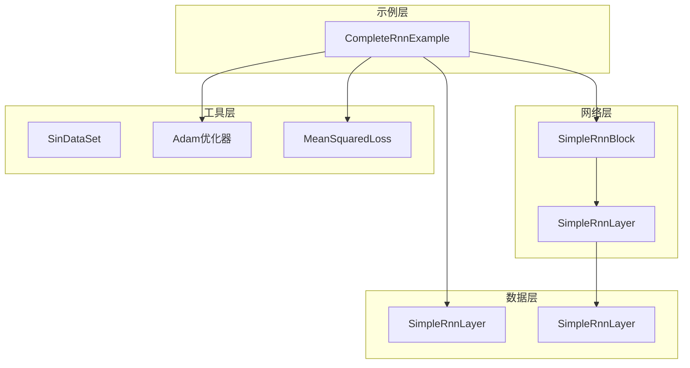
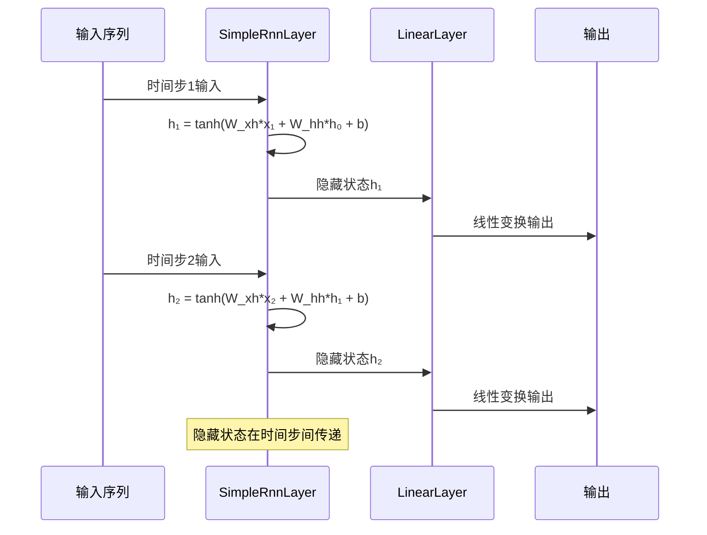
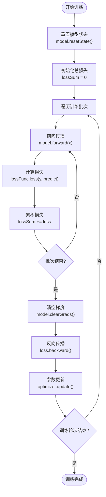
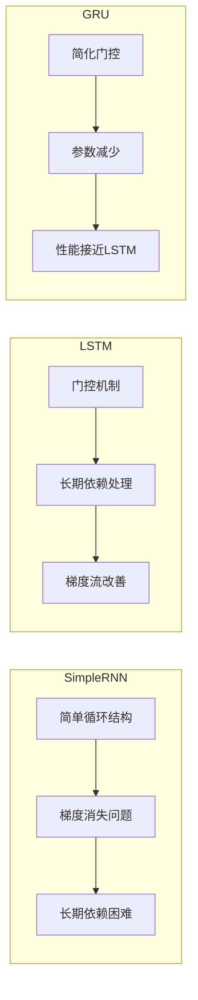

# SimpleRNN示例深度分析

<cite>
**本文档引用的文件**
- [CompleteRnnExample.java](file://tinyai-dl-case/src/main/java/io/leavesfly/tinyai/example/rnn/CompleteRnnExample.java)
- [SimpleRnnBlock.java](file://tinyai-dl-nnet/src/main/java/io/leavesfly/tinyai/nnet/block/SimpleRnnBlock.java)
- [SimpleRnnLayer.java](file://tinyai-dl-nnet/src/main/java/io/leavesfly/tinyai/nnet/layer/rnn/SimpleRnnLayer.java)
- [SinDataSet.java](file://tinyai-dl-ml/src/main/java/io/leavesfly/tinyai/ml/dataset/simple/SinDataSet.java)
- [SimpleRnnLayerTest.java](file://tinyai-dl-nnet/src/test/java/io/leavesfly/tinyai/nnet/layer/rnn/SimpleRnnLayerTest.java)
</cite>

## 目录
1. [简介](#简介)
2. [项目结构](#项目结构)
3. [核心组件](#核心组件)
4. [架构概览](#架构概览)
5. [详细组件分析](#详细组件分析)
6. [训练流程分析](#训练流程分析)
7. [梯度消失问题](#梯度消失问题)
8. [性能对比分析](#性能对比分析)
9. [调优建议](#调优建议)
10. [故障排除指南](#故障排除指南)
11. [结论](#结论)

## 简介

SimpleRNN示例展示了基础递归神经网络在序列建模中的实现原理与局限性。通过CompleteRnnExample类中的testSimpleRNN()方法，我们能够深入理解SimpleRnnBlock的前向传播机制以及BPTT（反向传播通过时间）算法的具体实现。

SimpleRNN作为最基础的递归神经网络架构，虽然结构简单，但存在严重的梯度消失问题，这使得它在处理长期依赖关系时表现不佳。本示例通过正弦波拟合任务直观地展示了这一局限性，并提供了针对SimpleRNN的调优建议和解决方案。

## 项目结构

SimpleRNN示例涉及多个关键模块的协作：



**图表来源**
- [CompleteRnnExample.java](file://tinyai-dl-case/src/main/java/io/leavesfly/tinyai/example/rnn/CompleteRnnExample.java#L1-L188)
- [SimpleRnnBlock.java](file://tinyai-dl-nnet/src/main/java/io/leavesfly/tinyai/nnet/block/SimpleRnnBlock.java#L1-L60)

**章节来源**
- [CompleteRnnExample.java](file://tinyai-dl-case/src/main/java/io/leavesfly/tinyai/example/rnn/CompleteRnnExample.java#L1-L188)

## 核心组件

### SimpleRnnBlock - 基础RNN块

SimpleRnnBlock是SimpleRNN的核心构建块，它封装了两个关键组件：

```java
public class SimpleRnnBlock extends Block {
    private SimpleRnnLayer rnnLayer;
    private LinearLayer linearLayer;
    
    public SimpleRnnBlock(String name, int inputSize, int hiddenSize, int outputSize) {
        super(name, Shape.of(-1, inputSize), Shape.of(-1, outputSize));
        
        rnnLayer = new SimpleRnnLayer("rnn", Shape.of(-1, inputSize), Shape.of(-1, hiddenSize));
        addLayer(rnnLayer);
        
        linearLayer = new LinearLayer("line", hiddenSize, outputSize, true);
        addLayer(linearLayer);
    }
}
```

该块包含：
- **SimpleRnnLayer**：负责序列数据的递归处理
- **LinearLayer**：将RNN的隐藏状态映射到最终输出维度

### SimpleRnnLayer - 递归层实现

SimpleRnnLayer实现了标准的RNN公式：

```
h_t = tanh(W_xh * x_t + W_hh * h_{t-1} + b)
```

其中：
- `h_t`：当前时间步的隐藏状态
- `x_t`：当前时间步的输入
- `h_{t-1}`：前一个时间步的隐藏状态
- `W_xh`：输入到隐藏状态的权重矩阵
- `W_hh`：隐藏状态到隐藏状态的权重矩阵
- `b`：偏置项

**章节来源**
- [SimpleRnnBlock.java](file://tinyai-dl-nnet/src/main/java/io/leavesfly/tinyai/nnet/block/SimpleRnnBlock.java#L1-L60)
- [SimpleRnnLayer.java](file://tinyai-dl-nnet/src/main/java/io/leavesfly/tinyai/nnet/layer/rnn/SimpleRnnLayer.java#L1-L258)

## 架构概览

SimpleRNN的整体架构展现了递归神经网络的基本设计模式：



**图表来源**
- [SimpleRnnLayer.java](file://tinyai-dl-nnet/src/main/java/io/leavesfly/tinyai/nnet/layer/rnn/SimpleRnnLayer.java#L100-L150)

## 详细组件分析

### 前向传播机制

SimpleRnnLayer的前向传播分为两种情况：

#### 第一次前向传播（无历史状态）

```java
// 第一次前向传播，没有前一时间步的隐藏状态
if (Objects.isNull(state)) {
    prevState = null;
    xLinear = x.linear(x2h, b);
    state = xLinear.tanh();
    stateValue = state.getValue();
    preTanh = state;
}
```

#### 后续前向传播（有历史状态）

```java
// 后续前向传播，包含前一时间步的隐藏状态
else {
    prevState = state;
    xLinear = x.linear(x2h, b);
    hLinear = new Variable(stateValue).linear(h2h, null);
    state = xLinear.add(hLinear).tanh();
    stateValue = state.getValue();
    preTanh = state;
}
```

### 参数初始化策略

SimpleRnnLayer采用Xavier初始化策略：

```java
// 输入到隐藏状态的权重矩阵初始化
NdArray initWeight = NdArray.likeRandomN(Shape.of(inputSize, hiddenSize))
        .mulNum(Math.sqrt((double) 1 / inputSize));
x2h = new Parameter(initWeight);

// 隐藏状态到隐藏状态的权重矩阵初始化
initWeight = NdArray.likeRandomN(Shape.of(hiddenSize, hiddenSize))
        .mulNum(Math.sqrt((double) 1 / hiddenSize));
h2h = new Parameter(initWeight);

// 偏置初始化为零
b = new Parameter(NdArray.zeros(Shape.of(1, hiddenSize)));
```

这种初始化方式有助于保持梯度在合理的范围内，避免梯度爆炸或消失。

**章节来源**
- [SimpleRnnLayer.java](file://tinyai-dl-nnet/src/main/java/io/leavesfly/tinyai/nnet/layer/rnn/SimpleRnnLayer.java#L100-L180)

## 训练流程分析

### CompleteRnnExample中的训练流程

CompleteRnnExample展示了完整的训练过程，包括状态重置、损失计算和梯度更新：



**图表来源**
- [CompleteRnnExample.java](file://tinyai-dl-case/src/main/java/io/leavesfly/tinyai/example/rnn/CompleteRnnExample.java#L140-L180)

### BPTT算法实现

SimpleRNN中的BPTT算法通过以下步骤实现：

1. **状态重置**：每个训练轮次开始时重置隐藏状态
2. **计算图构建**：逐时间步构建计算图
3. **梯度截断**：每批数据结束后切断计算图
4. **梯度更新**：使用Adam优化器更新参数

```java
// 训练循环中的关键步骤
for (Batch batch : batches) {
    NdArray[] xArray = batch.getX();
    NdArray[] yArray = batch.getY();
    
    Variable loss = new Variable(0f);
    loss.setName("loss");
    
    for (int j = 0; j < batch.getSize(); j++) {
        Variable x = new Variable(xArray[j]).setName("x");
        Variable y = new Variable(yArray[j]).setName("y");
        Variable predict = model.forward(x);
        loss = loss.add(lossFunc.loss(y, predict));
    }

    model.clearGrads();
    loss.backward();
    optimizer.update();

    // 切断计算图，每批数据要清理重新构建计算图
    loss.unChainBackward();
}
```

**章节来源**
- [CompleteRnnExample.java](file://tinyai-dl-case/src/main/java/io/leavesfly/tinyai/example/rnn/CompleteRnnExample.java#L140-L180)

## 梯度消失问题

### SimpleRNN的梯度消失机制

SimpleRNN的梯度消失问题源于其简单的循环连接结构。在反向传播过程中，梯度会经历多次乘法操作：

```java
@Override
public List<NdArray> backward(NdArray yGrad) {
    // 计算tanh的梯度: grad * (1 - tanh^2(x))
    NdArray tanhGrad = yGrad.mul(NdArray.ones(preTanh.getValue().getShape())
                                 .sub(preTanh.getValue().square()));

    // 计算线性变换的梯度
    NdArray xLinearGrad = tanhGrad;
    NdArray hLinearGrad = tanhGrad;

    // 计算输入x的梯度: grad * W_xh^T
    NdArray xGrad = xLinearGrad.dot(x2h.getValue().transpose());

    // 计算参数梯度
    NdArray x2hGrad = inputs[0].getValue().transpose().dot(xLinearGrad);
    NdArray bGrad = xLinearGrad.sumTo(b.getValue().getShape());

    // 如果有前一状态，计算h2h的梯度和前一状态的梯度
    if (prevState != null) {
        // 计算h2h的梯度: h_{t-1}^T * grad
        NdArray h2hGrad = prevState.getValue().transpose().dot(hLinearGrad);
        // 计算前一状态的梯度: grad * W_hh^T
        NdArray hGrad = hLinearGrad.dot(h2h.getValue().transpose());
        // 将输入梯度和前一状态梯度相加
        xGrad = xGrad.add(hGrad);
        return Arrays.asList(xGrad, x2hGrad, h2hGrad, bGrad);
    } else {
        return Arrays.asList(xGrad, x2hGrad, bGrad);
    }
}
```

### 梯度消失的数学分析

对于SimpleRNN，梯度在时间步k处的表达式为：

```
∂L/∂W_hh = ∑(∂L/∂h_k) * ∏(i=k+1 to T) (∂h_i/∂h_{i-1})
```

其中：
- `∂L/∂h_k`：第k个时间步的梯度
- `∂h_i/∂h_{i-1}`：梯度传播的雅可比矩阵，等于`W_hh * (1 - tanh²(h_{i-1}))`

当`|W_hh| < 1`时，随着时间步增加，梯度会指数级衰减，导致长期依赖难以学习。

### 正弦波拟合任务中的表现

通过SinDataSet提供的正弦波序列数据，我们可以观察到SimpleRNN在捕捉长期依赖关系上的困难：

```java
public class SinDataSet extends ArrayDataset {
    @Override
    public void doPrepare() {
        int size = 1000;
        int tmpSize = size + 1;
        NdArray tmp = NdArray.linSpace(0f, (float) (Math.PI * 4), tmpSize);

        // 训练数据构造
        NdArray[] tmpArray = new NdArray[tmpSize];
        for (int i = 0; i < tmpSize; i++) {
            tmpArray[i] = NdArray.of((float) Math.sin(tmp.getMatrix()[0][i]));
        }
        NdArray[] _xs = Arrays.copyOfRange(tmpArray, 0, size);
        NdArray[] _ys = Arrays.copyOfRange(tmpArray, 1, size + 1);
        DataSet trainDataset = build(batchSize, _xs, _ys);
    }
}
```

**章节来源**
- [SimpleRnnLayer.java](file://tinyai-dl-nnet/src/main/java/io/leavesfly/tinyai/nnet/layer/rnn/SimpleRnnLayer.java#L210-L257)
- [SinDataSet.java](file://tinyai-dl-ml/src/main/java/io/leavesfly/tinyai/ml/dataset/simple/SinDataSet.java#L20-L40)

## 性能对比分析

### 与其他RNN变体的对比

CompleteRnnExample提供了与LSTM和GRU的性能对比：



**图表来源**
- [CompleteRnnExample.java](file://tinyai-dl-case/src/main/java/io/leavesfly/tinyai/example/rnn/CompleteRnnExample.java#L30-L130)

### 调试和测试验证

通过单元测试验证SimpleRNN的功能：

```java
@Test
public void testSequentialForward() {
    // 测试连续多个时间步的前向传播
    float[][] input1Data = {{1.0f, 0.0f, 0.0f}, {0.0f, 1.0f, 0.0f}};
    float[][] input2Data = {{0.0f, 1.0f, 0.0f}, {0.0f, 0.0f, 1.0f}};
    
    Variable output1 = rnnLayer.layerForward(new Variable(NdArray.of(input1Data)));
    Variable output2 = rnnLayer.layerForward(new Variable(NdArray.of(input2Data)));
    
    // 验证后续输出与第一步不同（因为有状态记忆）
    boolean differentFromFirst = false;
    float[][] output1Data = output1.getValue().getMatrix();
    float[][] output2Data = output2.getValue().getMatrix();
    
    for (int i = 0; i < 2 && !differentFromFirst; i++) {
        for (int j = 0; j < 5 && !differentFromFirst; j++) {
            if (Math.abs(output1Data[i][j] - output2Data[i][j]) > 1e-6) {
                differentFromFirst = true;
            }
        }
    }
    assertTrue("第二步输出应该与第一步不同", differentFromFirst);
}
```

**章节来源**
- [SimpleRnnLayerTest.java](file://tinyai-dl-nnet/src/test/java/io/leavesfly/tinyai/nnet/layer/rnn/SimpleRnnLayerTest.java#L80-L120)

## 调优建议

### 学习率调整策略

由于SimpleRNN容易出现梯度消失问题，建议采用以下学习率策略：

1. **初始学习率**：设置较小的学习率（如0.001）
2. **学习率衰减**：使用指数衰减或余弦退火
3. **自适应学习率**：优先使用Adam等自适应优化器

### 梯度裁剪技术

为了防止梯度爆炸，可以实施梯度裁剪：

```java
// 在optimizer.update()之前添加梯度裁剪
float maxGradientNorm = 5.0f;
model.clipGradients(maxGradientNorm);
```

### 网络结构优化

1. **隐藏层大小**：适当增加隐藏层维度（如20-50）
2. **序列长度**：限制BPTT截断长度（如10-20步）
3. **批量大小**：选择合适的批量大小（如32-128）

### 参数初始化改进

考虑使用更好的初始化策略：

```java
// 使用He初始化替代Xavier初始化
NdArray initWeight = NdArray.likeRandomN(Shape.of(inputSize, hiddenSize))
        .mulNum(Math.sqrt(2.0f / inputSize));
```

## 故障排除指南

### 常见问题及解决方案

#### 1. 梯度消失症状
**表现**：训练损失不下降，预测结果差
**原因**：权重矩阵W_hh的范数过小
**解决方案**：
- 检查权重初始化
- 增加隐藏层维度
- 使用残差连接

#### 2. 梯度爆炸症状
**表现**：训练损失突然变为NaN
**原因**：权重矩阵W_hh的范数过大
**解决方案**：
- 实施梯度裁剪
- 减小学习率
- 检查数据预处理

#### 3. 内存溢出
**表现**：OutOfMemoryError
**原因**：序列长度过长或批量大小过大
**解决方案**：
- 减少BPTT截断长度
- 降低批量大小
- 使用序列打包

### 调试技巧

1. **监控梯度范数**：定期检查参数梯度的范数
2. **可视化隐藏状态**：观察隐藏状态的变化趋势
3. **学习率搜索**：使用学习率范围测试找到合适的学习率

**章节来源**
- [SimpleRnnLayerTest.java](file://tinyai-dl-nnet/src/test/java/io/leavesfly/tinyai/nnet/layer/rnn/SimpleRnnLayerTest.java#L200-L285)

## 结论

SimpleRNN作为递归神经网络的基础架构，虽然在理论上具有强大的序列建模能力，但在实际应用中面临着严重的梯度消失问题。通过CompleteRnnExample的深入分析，我们可以得出以下结论：

### 主要发现

1. **简单性优势**：SimpleRNN的结构简单，易于理解和实现
2. **性能局限**：在处理长期依赖关系时表现不佳
3. **梯度消失根源**：简单的循环连接导致梯度在时间步间指数衰减
4. **适用场景**：适合短序列建模和简单的时间序列预测

### 改进建议

1. **使用LSTM或GRU**：对于大多数序列建模任务，推荐使用LSTM或GRU
2. **结合注意力机制**：可以考虑与注意力机制结合
3. **混合模型**：将SimpleRNN与其他网络结构结合使用

### 实践指导

SimpleRNN示例为我们提供了一个很好的起点，让我们能够深入理解递归神经网络的工作原理。通过掌握SimpleRNN的实现细节和局限性，我们可以更好地选择和使用更高级的RNN变体，从而在实际项目中取得更好的效果。

这个示例不仅展示了SimpleRNN的理论原理，更重要的是提供了实用的调试和调优经验，为读者在实际应用中遇到类似问题时提供了宝贵的参考。