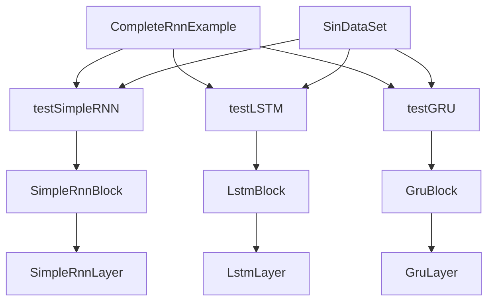
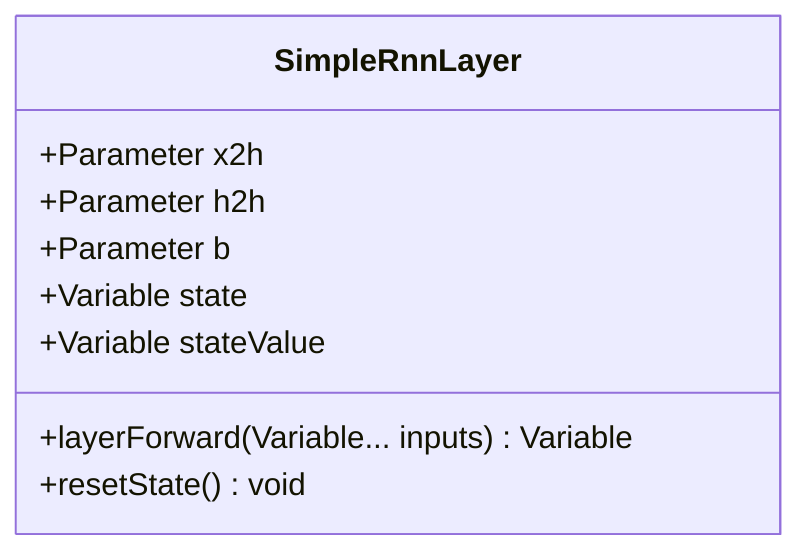
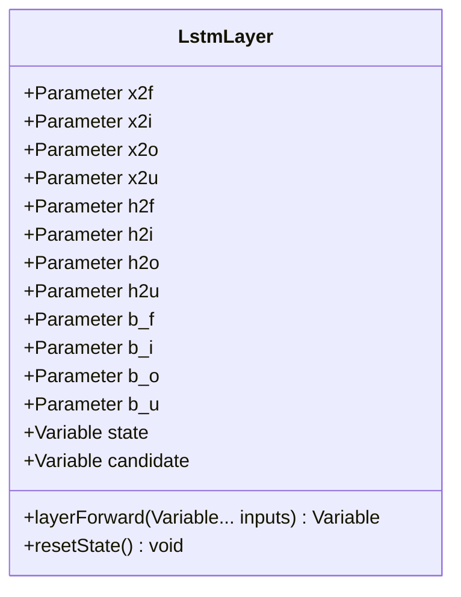
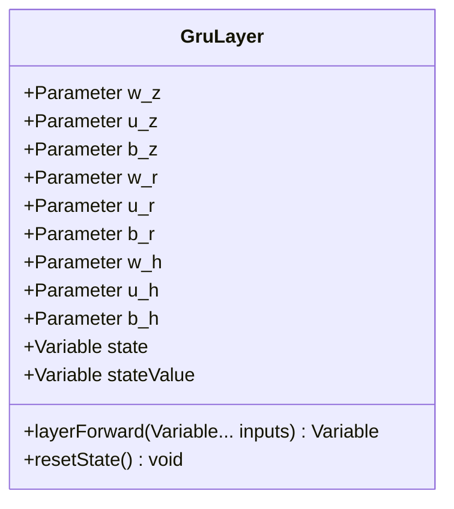
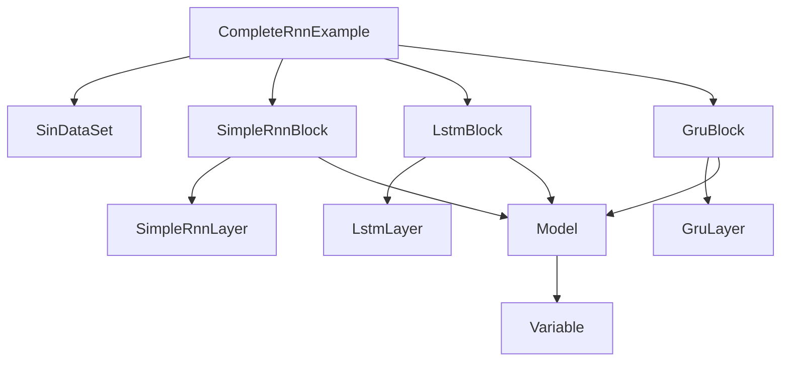

# 序列建模示例

<cite>
**本文档引用的文件**  
- [CompleteRnnExample.java](file://tinyai-dl-case/src/main/java/io/leavesfly/tinyai/example/rnn/CompleteRnnExample.java)
- [SinDataSet.java](file://tinyai-dl-ml/src/main/java/io/leavesfly/tinyai/ml/dataset/simple/SinDataSet.java)
- [SimpleRnnBlock.java](file://tinyai-dl-nnet/src/main/java/io/leavesfly/tinyai/nnet/block/SimpleRnnBlock.java)
- [LstmBlock.java](file://tinyai-dl-nnet/src/main/java/io/leavesfly/tinyai/nnet/block/LstmBlock.java)
- [GruBlock.java](file://tinyai-dl-nnet/src/main/java/io/leavesfly/tinyai/nnet/block/GruBlock.java)
- [SimpleRnnLayer.java](file://tinyai-dl-nnet/src/main/java/io/leavesfly/tinyai/nnet/layer/rnn/SimpleRnnLayer.java)
- [LstmLayer.java](file://tinyai-dl-nnet/src/main/java/io/leavesfly/tinyai/nnet/layer/rnn/LstmLayer.java)
- [GruLayer.java](file://tinyai-dl-nnet/src/main/java/io/leavesfly/tinyai/nnet/layer/rnn/GruLayer.java)
- [Model.java](file://tinyai-dl-ml/src/main/java/io/leavesfly/tinyai/ml/Model.java)
- [Variable.java](file://tinyai-dl-func/src/main/java/io/leavesfly/tinyai/func/Variable.java)
</cite>

## 目录
1. [引言](#引言)
2. [项目结构](#项目结构)
3. [核心组件](#核心组件)
4. [架构概述](#架构概述)
5. [详细组件分析](#详细组件分析)
6. [依赖分析](#依赖分析)
7. [性能考虑](#性能考虑)
8. [故障排除指南](#故障排除指南)
9. [结论](#结论)

## 引言
本文档全面分析了 `CompleteRnnExample.java` 中三种递归神经网络（SimpleRNN、LSTM、GRU）的实现与比较。通过正弦波序列拟合任务，展示了不同RNN在捕捉长期依赖关系上的性能差异。文档详细描述了每种RNN结构的工作原理，特别是LSTM的遗忘门、输入门、输出门机制和GRU的更新门、重置门设计如何缓解梯度消失问题。同时，解释了BPTT（随时间反向传播）算法的实现细节，包括状态重置、计算图截断和梯度更新策略，并提供了训练过程中的调参建议和常见问题排查方法。

## 项目结构
`CompleteRnnExample.java` 位于 `tinyai-dl-case` 模块中，是递归神经网络的完整示例。该示例通过比较 SimpleRNN、LSTM 和 GRU 三种模型在正弦波序列拟合任务上的表现，展示了它们在处理序列数据时的性能差异。项目结构清晰，各模块职责分明，便于理解和扩展。

## 核心组件
本示例的核心组件包括 `CompleteRnnExample` 类，它定义了三种RNN模型的训练和比较逻辑。`SinDataSet` 类负责生成正弦波序列数据集，用于训练和测试模型。`SimpleRnnBlock`、`LstmBlock` 和 `GruBlock` 类分别实现了三种不同的RNN块，每个块包含一个RNN层和一个线性输出层。

**核心组件**
- [CompleteRnnExample.java](file://tinyai-dl-case/src/main/java/io/leavesfly/tinyai/example/rnn/CompleteRnnExample.java#L1-L187)
- [SinDataSet.java](file://tinyai-dl-ml/src/main/java/io/leavesfly/tinyai/ml/dataset/simple/SinDataSet.java#L1-L47)
- [SimpleRnnBlock.java](file://tinyai-dl-nnet/src/main/java/io/leavesfly/tinyai/nnet/block/SimpleRnnBlock.java#L1-L59)
- [LstmBlock.java](file://tinyai-dl-nnet/src/main/java/io/leavesfly/tinyai/nnet/block/LstmBlock.java#L1-L41)
- [GruBlock.java](file://tinyai-dl-nnet/src/main/java/io/leavesfly/tinyai/nnet/block/GruBlock.java#L1-L63)

## 架构概述
该示例采用模块化设计，将数据集生成、模型定义、训练过程和评估逻辑分离。`CompleteRnnExample` 类作为入口点，调用 `testSimpleRNN`、`testLSTM` 和 `testGRU` 方法来训练和评估三种RNN模型。每种模型都使用相同的超参数和训练流程，确保了比较的公平性。

**图表来源**
- [CompleteRnnExample.java](file://tinyai-dl-case/src/main/java/io/leavesfly/tinyai/example/rnn/CompleteRnnExample.java#L1-L187)
- [SimpleRnnBlock.java](file://tinyai-dl-nnet/src/main/java/io/leavesfly/tinyai/nnet/block/SimpleRnnBlock.java#L1-L59)
- [LstmBlock.java](file://tinyai-dl-nnet/src/main/java/io/leavesfly/tinyai/nnet/block/LstmBlock.java#L1-L41)
- [GruBlock.java](file://tinyai-dl-nnet/src/main/java/io/leavesfly/tinyai/nnet/block/GruBlock.java#L1-L63)

## 详细组件分析
### SimpleRNN 分析
SimpleRNN 是最基础的递归网络结构，具有简单的循环连接。它通过一个隐藏状态来传递信息，但容易受到梯度消失问题的影响，难以捕捉长期依赖关系。

**图表来源**
- [SimpleRnnLayer.java](file://tinyai-dl-nnet/src/main/java/io/leavesfly/tinyai/nnet/layer/rnn/SimpleRnnLayer.java#L1-L113)

### LSTM 分析
LSTM（长短期记忆网络）通过门控机制解决梯度消失问题，能够学习长期依赖关系。它包含三个门：遗忘门、输入门和输出门，分别控制信息的遗忘、更新和输出。

**图表来源**
- [LstmLayer.java](file://tinyai-dl-nnet/src/main/java/io/leavesfly/tinyai/nnet/layer/rnn/LstmLayer.java#L1-L240)

### GRU 分析
GRU（门控递归单元）是LSTM的简化版本，具有更少的参数和计算复杂度。它包含两个门：更新门和重置门，分别控制前一状态信息的保留程度和对当前候选状态的影响。

**图表来源**
- [GruLayer.java](file://tinyai-dl-nnet/src/main/java/io/leavesfly/tinyai/nnet/layer/rnn/GruLayer.java#L1-L212)

## 依赖分析
各组件之间的依赖关系如下：`CompleteRnnExample` 依赖于 `SinDataSet` 生成数据，`SimpleRnnBlock`、`LstmBlock` 和 `GruBlock` 分别依赖于对应的 `SimpleRnnLayer`、`LstmLayer` 和 `GruLayer`。`Model` 类负责管理模型的状态和参数，`Variable` 类用于表示计算图中的变量。

**图表来源**
- [CompleteRnnExample.java](file://tinyai-dl-case/src/main/java/io/leavesfly/tinyai/example/rnn/CompleteRnnExample.java#L1-L187)
- [SinDataSet.java](file://tinyai-dl-ml/src/main/java/io/leavesfly/tinyai/ml/dataset/simple/SinDataSet.java#L1-L47)
- [SimpleRnnBlock.java](file://tinyai-dl-nnet/src/main/java/io/leavesfly/tinyai/nnet/block/SimpleRnnBlock.java#L1-L59)
- [LstmBlock.java](file://tinyai-dl-nnet/src/main/java/io/leavesfly/tinyai/nnet/block/LstmBlock.java#L1-L41)
- [GruBlock.java](file://tinyai-dl-nnet/src/main/java/io/leavesfly/tinyai/nnet/block/GruBlock.java#L1-L63)
- [Model.java](file://tinyai-dl-ml/src/main/java/io/leavesfly/tinyai/ml/Model.java#L1-L196)
- [Variable.java](file://tinyai-dl-func/src/main/java/io/leavesfly/tinyai/func/Variable.java#L1-L217)

## 性能考虑
在训练过程中，状态重置、计算图截断和梯度更新策略对性能有重要影响。`model.resetState()` 方法用于在每次训练前重置模型的内部状态，确保从初始状态开始。`loss.unChainBackward()` 方法用于切断计算图，防止梯度累积。`optimizer.update()` 方法用于更新模型参数。

**性能考虑**
- [CompleteRnnExample.java](file://tinyai-dl-case/src/main/java/io/leavesfly/tinyai/example/rnn/CompleteRnnExample.java#L152)
- [CompleteRnnExample.java](file://tinyai-dl-case/src/main/java/io/leavesfly/tinyai/example/rnn/CompleteRnnExample.java#L179)
- [CompleteRnnExample.java](file://tinyai-dl-case/src/main/java/io/leavesfly/tinyai/example/rnn/CompleteRnnExample.java#L173)

## 故障排除指南
梯度爆炸是训练RNN时常见的问题。可以通过梯度裁剪（Gradient Clipping）来缓解。`Variable.clip(min, max)` 方法可以将梯度限制在指定范围内，防止梯度值过大。

**故障排除指南**
- [Variable.java](file://tinyai-dl-func/src/main/java/io/leavesfly/tinyai/func/Variable.java#L481)
- [Clip.java](file://tinyai-dl-func/src/main/java/io/leavesfly/tinyai/func/math/Clip.java#L39)

## 结论
本文档详细分析了 `CompleteRnnExample.java` 中三种递归神经网络的实现与比较。通过正弦波序列拟合任务，展示了不同RNN在捕捉长期依赖关系上的性能差异。LSTM和GRU通过门控机制有效缓解了梯度消失问题，而SimpleRNN由于缺乏门控机制，难以处理长期依赖。BPTT算法的实现细节，包括状态重置、计算图截断和梯度更新策略，对训练过程的稳定性和效率至关重要。梯度裁剪是处理梯度爆炸的有效方法。