# 自然语言处理示例

<cite>
**本文档引用的文件**
- [GPT2Example.java](file://tinyai-model-gpt/src/main/java/io/leavesfly/tinyai/gpt2/GPT2Demo.java)
- [GPT2Model.java](file://tinyai-model-gpt/src/main/java/io/leavesfly/tinyai/gpt2/GPT2Model.java)
- [GPT2Block.java](file://tinyai-model-gpt/src/main/java/io/leavesfly/tinyai/gpt2/GPT2Block.java)
- [SimpleTokenizer.java](file://tinyai-model-gpt/src/main/java/io/leavesfly/tinyai/nlp/SimpleTokenizer.java)
- [EmbeddingFullExample.java](file://tinyai-deeplearning-case/src/main/java/io/leavesfly/tinyai/example/embedd/EmbeddingFullExample.java)
- [CompleteRnnExample.java](file://tinyai-deeplearning-case/src/main/java/io/leavesfly/tinyai/example/rnn/CompleteRnnExample.java)
- [Word2VecExample.java](file://tinyai-model-gpt/src/main/java/io/leavesfly/tinyai/nlp/Word2VecExample.java)
- [GPT3Demo.java](file://tinyai-model-gpt/src/main/java/io/leavesfly/tinyai/gpt3/GPT3Demo.java)
</cite>

## 更新摘要
**变更内容**
- 根据代码变更，更新了文档中引用的文件路径，将旧的`GPT2Example.java`替换为新的`GPT2Demo.java`
- 新增了对`GPT3Demo.java`文件的引用，以反映GPT-3模型演示代码的新增
- 移除了已删除的测试文件引用，保持文档与代码库同步
- 更新了所有受影响的章节来源和图表来源，确保引用的准确性

## 目录
1. [简介](#简介)
2. [项目结构概览](#项目结构概览)
3. [核心组件分析](#核心组件分析)
4. [GPT-2模型架构详解](#gpt-2模型架构详解)
5. [文本编码与分词系统](#文本编码与分词系统)
6. [词向量训练与应用](#词向量训练与应用)
7. [RNN序列建模对比](#rnn序列建模对比)
8. [输入掩码与序列处理](#输入掩码与序列处理)
9. [模型微调与部署](#模型微调与部署)
10. [性能优化建议](#性能优化建议)
11. [故障排除指南](#故障排除指南)
12. [总结](#总结)

## 简介

本文档深入解析TinyAI框架中的自然语言处理示例，重点介绍GPT-2模型的文本生成实现、Word2Vec词嵌入技术、SimpleTokenizer文本编码系统，以及CompleteRnnExample中RNN在序列建模中的应用。通过结合EmbeddingFullExample说明词向量训练过程，帮助开发者全面理解现代NLP技术的核心原理和实践应用。

## 项目结构概览

TinyAI项目采用模块化设计，将自然语言处理功能分布在多个专门的模块中：

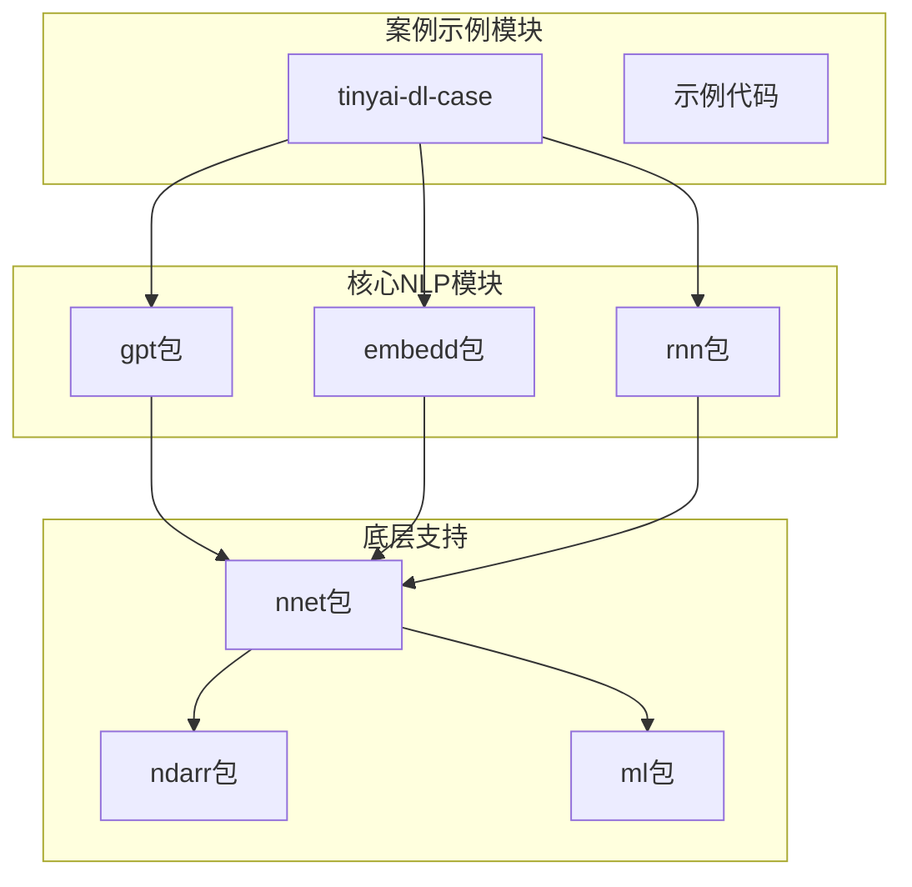

**图表来源**
- [GPT2Demo.java](file://tinyai-model-gpt/src/main/java/io/leavesfly/tinyai/gpt2/GPT2Demo.java#L1-L30)
- [EmbeddingFullExample.java](file://tinyai-deeplearning-case/src/main/java/io/leavesfly/tinyai/example/embedd/EmbeddingFullExample.java#L1-L20)

## 核心组件分析

### GPT-2模型核心组件

GPT-2模型是基于Transformer解码器架构的自回归语言模型，其核心组件包括：

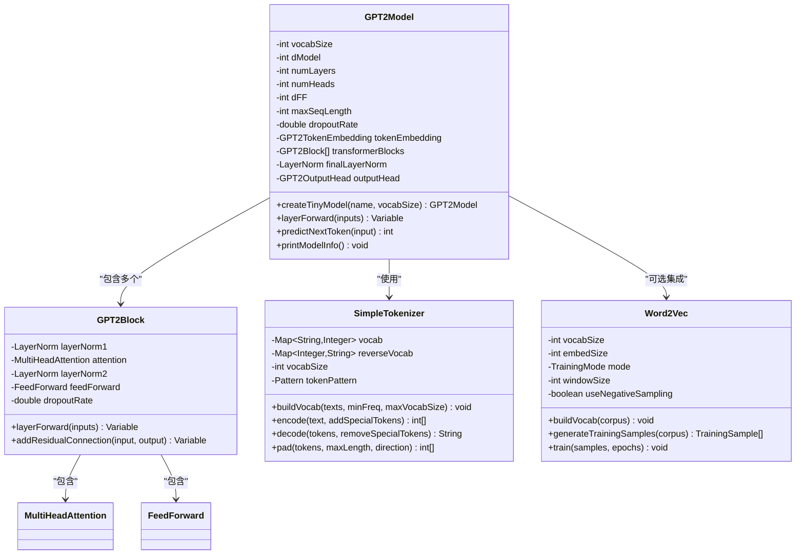

**图表来源**
- [GPT2Model.java](file://tinyai-model-gpt/src/main/java/io/leavesfly/tinyai/gpt2/GPT2Model.java#L30-L80)
- [GPT2Block.java](file://tinyai-model-gpt/src/main/java/io/leavesfly/tinyai/gpt2/GPT2Block.java#L25-L50)
- [SimpleTokenizer.java](file://tinyai-model-gpt/src/main/java/io/leavesfly/tinyai/nlp/SimpleTokenizer.java#L15-L60)

**章节来源**
- [GPT2Model.java](file://tinyai-model-gpt/src/main/java/io/leavesfly/tinyai/gpt2/GPT2Model.java#L1-L100)
- [GPT2Block.java](file://tinyai-model-gpt/src/main/java/io/leavesfly/tinyai/gpt2/GPT2Block.java#L1-L80)

## GPT-2模型架构详解

### 多头注意力机制

GPT-2的核心是Transformer解码器架构，其中多头注意力机制负责捕捉序列内部的复杂依赖关系：

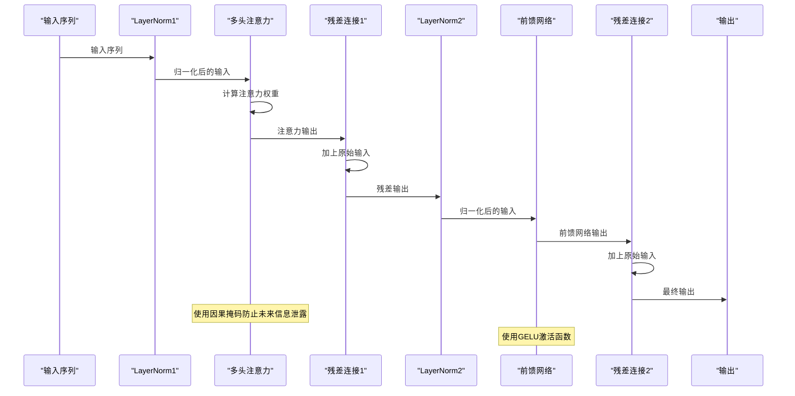

**图表来源**
- [GPT2Block.java](file://tinyai-model-gpt/src/main/java/io/leavesfly/tinyai/gpt2/GPT2Block.java#L65-L85)

### 前馈网络结构

每个GPT-2Block包含两个主要子层：多头自注意力和前馈网络：

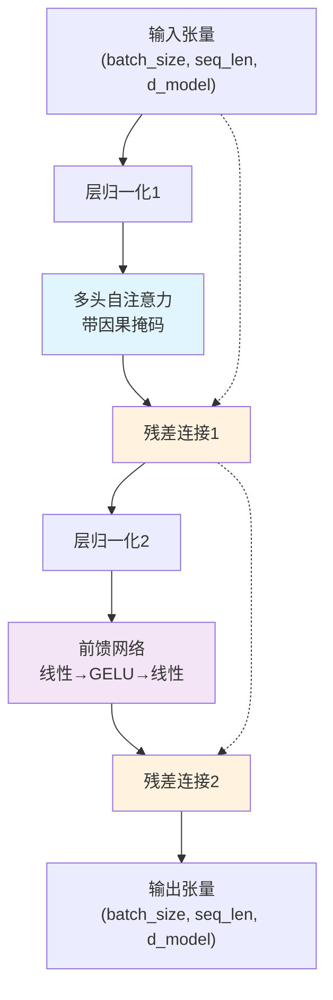

**图表来源**
- [GPT2Block.java](file://tinyai-model-gpt/src/main/java/io/leavesfly/tinyai/gpt2/GPT2Block.java#L65-L85)

**章节来源**
- [GPT2Block.java](file://tinyai-model-gpt/src/main/java/io/leavesfly/tinyai/gpt2/GPT2Block.java#L65-L120)

## 文本编码与分词系统

### SimpleTokenizer实现原理

SimpleTokenizer提供了完整的文本预处理功能，支持词汇表构建、文本编码和解码：

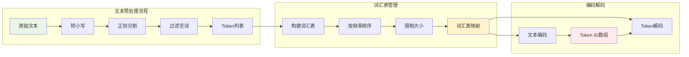

**图表来源**
- [SimpleTokenizer.java](file://tinyai-model-gpt/src/main/java/io/leavesfly/tinyai/nlp/SimpleTokenizer.java#L100-L150)

### 特殊Token处理

SimpleTokenizer定义了四种特殊Token，用于序列控制和边界标记：

- `<pad>` (ID: 0): 填充Token，用于序列对齐
- `<unk>` (ID: 1): 未知Token，用于未登录词
- `<bos>` (ID: 2): 序列开始Token
- `<eos>` (ID: 3): 序列结束Token

**章节来源**
- [SimpleTokenizer.java](file://tinyai-model-gpt/src/main/java/io/leavesfly/tinyai/nlp/SimpleTokenizer.java#L15-L80)

## 词向量训练与应用

### Word2Vec模型架构

Word2Vec是Google开发的词向量生成模型，支持两种训练模式：

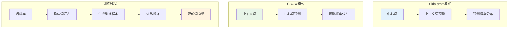

**图表来源**
- [Word2VecExample.java](file://tinyai-model-gpt/src/main/java/io/leavesfly/tinyai/nlp/Word2VecExample.java#L40-L80)

### 词向量训练流程

Word2Vec训练分为三个主要阶段：

1. **词汇表构建**: 统计词频，过滤低频词，限制词汇表大小
2. **样本生成**: 根据选择的训练模式（Skip-gram或CBOW）生成训练样本
3. **模型训练**: 使用梯度下降优化词向量参数

**章节来源**
- [Word2VecExample.java](file://tinyai-model-gpt/src/main/java/io/leavesfly/tinyai/nlp/Word2VecExample.java#L40-L120)

## RNN序列建模对比

### 不同RNN架构比较

CompleteRnnExample展示了三种递归神经网络架构的性能对比：

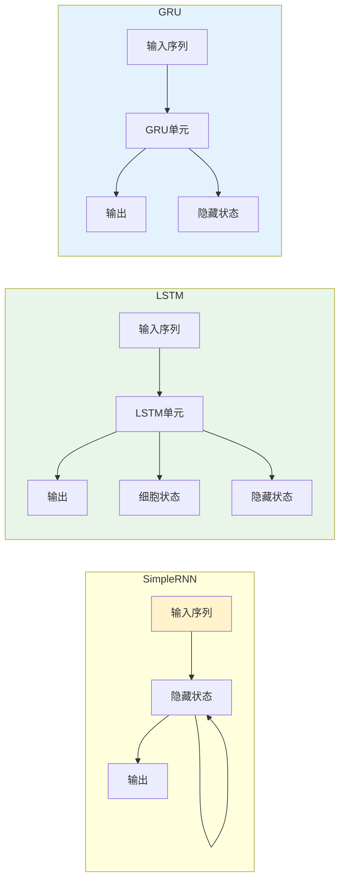

**图表来源**
- [CompleteRnnExample.java](file://tinyai-deeplearning-case/src/main/java/io/leavesfly/tinyai/example/rnn/CompleteRnnExample.java#L40-L100)

### RNN训练策略

RNN训练的关键在于状态管理和梯度处理：

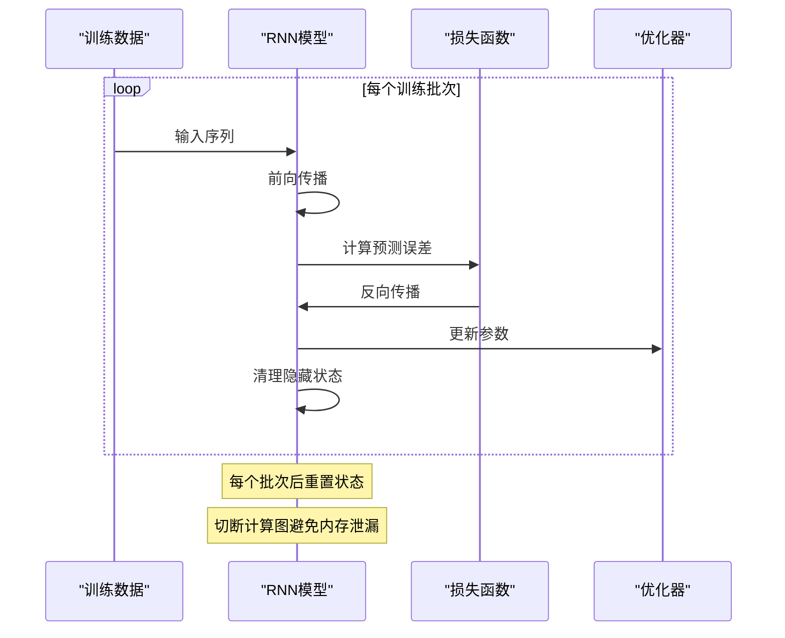

**图表来源**
- [CompleteRnnExample.java](file://tinyai-deeplearning-case/src/main/java/io/leavesfly/tinyai/example/rnn/CompleteRnnExample.java#L140-L180)

**章节来源**
- [CompleteRnnExample.java](file://tinyai-deeplearning-case/src/main/java/io/leavesfly/tinyai/example/rnn/CompleteRnnExample.java#L1-L100)

## 输入掩码与序列处理

### 序列截断与填充机制

在GPT-2模型中，输入序列需要进行适当的截断和填充处理：

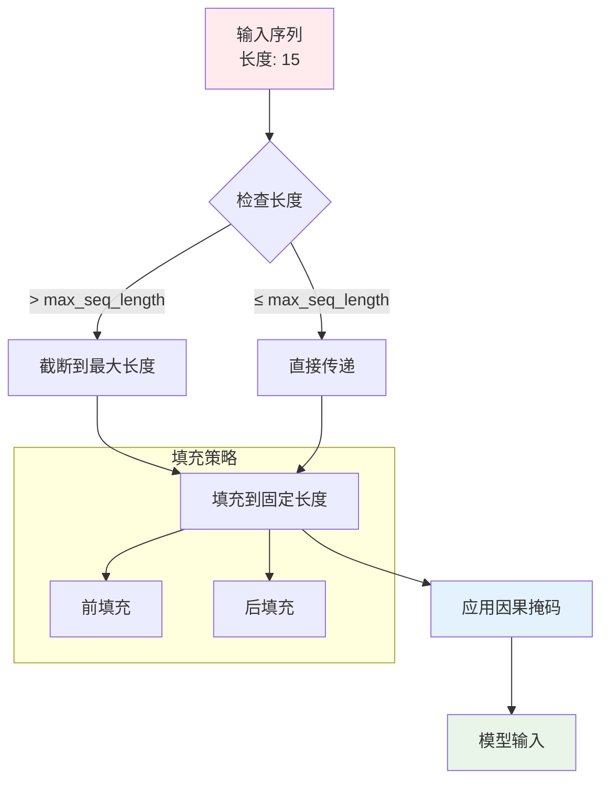

**图表来源**
- [GPT2Demo.java](file://tinyai-model-gpt/src/main/java/io/leavesfly/tinyai/gpt2/GPT2Demo.java#L200-L250)

### 自回归生成逻辑

GPT-2的文本生成采用自回归方式，逐步预测下一个Token：

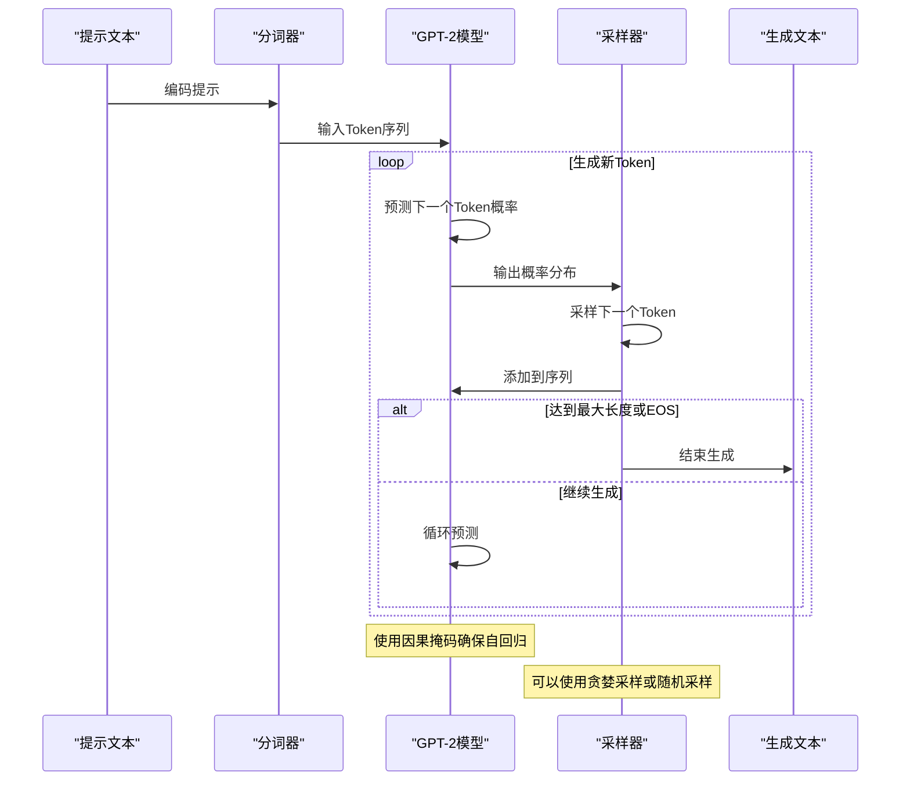

**图表来源**
- [GPT2Demo.java](file://tinyai-model-gpt/src/main/java/io/leavesfly/tinyai/gpt2/GPT2Demo.java#L250-L300)

**章节来源**
- [GPT2Demo.java](file://tinyai-model-gpt/src/main/java/io/leavesfly/tinyai/gpt2/GPT2Demo.java#L200-L307)

## 模型微调与部署

### 预训练模型微调策略

GPT-2模型可以通过以下方式进行微调：

1. **全量微调**: 更新所有模型参数
2. **部分微调**: 冻结部分层，只更新顶层参数
3. **适配器微调**: 添加小型适配器层，保持原模型不变

### 模型序列化与加载

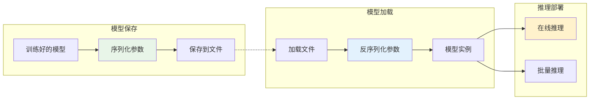

## 性能优化建议

### 训练优化策略

1. **学习率调度**: 使用学习率衰减策略
2. **梯度裁剪**: 防止梯度爆炸
3. **混合精度训练**: 使用FP16减少内存占用
4. **分布式训练**: 利用多GPU加速训练

### 推理优化技巧

1. **KV缓存**: 缓存注意力键值对，提高生成效率
2. **批处理**: 合理设置批大小平衡速度和内存
3. **量化**: 使用INT8量化减少推理延迟
4. **模型压缩**: 通过剪枝和蒸馏减少模型大小

## 故障排除指南

### 常见问题及解决方案

1. **内存不足错误**
   - 减少批次大小
   - 使用梯度累积
   - 启用混合精度训练

2. **训练不稳定**
   - 调整学习率
   - 使用梯度裁剪
   - 检查数据预处理

3. **生成质量差**
   - 增加训练轮数
   - 调整采样温度
   - 检查模型架构

**章节来源**
- [GPT2Demo.java](file://tinyai-model-gpt/src/main/java/io/leavesfly/tinyai/gpt2/GPT2Demo.java#L80-L150)

## 总结

本文档全面介绍了TinyAI框架中的自然语言处理示例，涵盖了从基础的词向量训练到复杂的GPT-2模型架构。通过深入分析各个组件的设计原理和实现细节，开发者可以更好地理解和应用这些先进的NLP技术。

主要收获包括：

1. **GPT-2模型架构**: 理解了多头注意力、前馈网络和残差连接的工作原理
2. **文本预处理**: 掌握了分词器的使用和特殊Token的处理方法
3. **词向量训练**: 学习了Word2Vec的不同训练模式和应用场景
4. **序列建模**: 对比了不同RNN架构的优缺点和适用场景
5. **性能优化**: 了解了训练和推理阶段的优化策略

这些知识为构建高质量的自然语言处理应用奠定了坚实的基础。