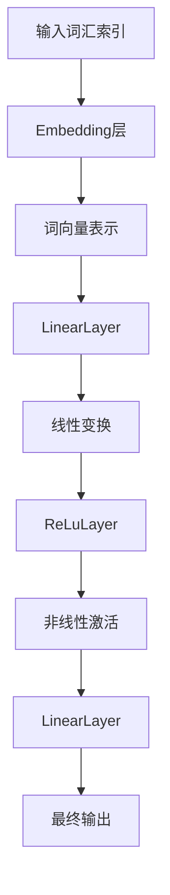
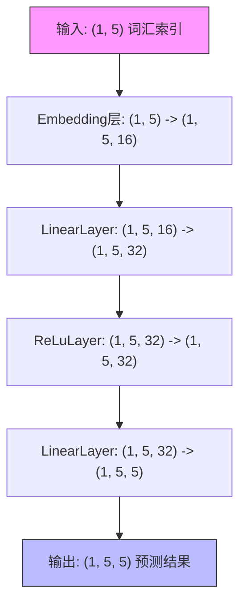
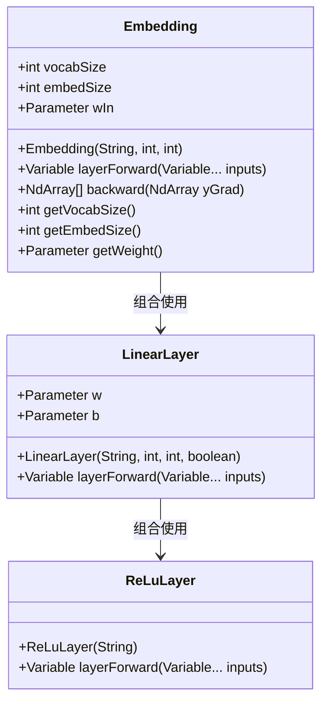

# 词嵌入示例

<cite>
**本文档引用的文件**   
- [EmbeddingFullExample.java](file://tinyai-dl-case/src/main/java/io/leavesfly/tinyai/example/embedd/EmbeddingFullExample.java)
- [Embedding.java](file://tinyai-dl-nnet/src/main/java/io/leavesfly/tinyai/nnet/layer/embedd/Embedding.java)
- [LinearLayer.java](file://tinyai-dl-nnet/src/main/java/io/leavesfly/tinyai/nnet/layer/dnn/LinearLayer.java)
- [ReLuLayer.java](file://tinyai-dl-nnet/src/main/java/io/leavesfly/tinyai/nnet/layer/activate/ReLuLayer.java)
- [NdArray.java](file://tinyai-dl-ndarr/src/main/java/io/leavesfly/tinyai/ndarr/NdArray.java)
- [Variable.java](file://tinyai-dl-func/src/main/java/io/leavesfly/tinyai/func/Variable.java)
</cite>

## 目录
1. [词嵌入层实现详解](#词嵌入层实现详解)
2. [网络结构与层组合](#网络结构与层组合)
3. [前向传播数据流分析](#前向传播数据流分析)
4. [词嵌入在NLP中的作用](#词嵌入在nlp中的作用)
5. [常见问题与解决方案](#常见问题与解决方案)
6. [性能优化建议](#性能优化建议)

## 词嵌入层实现详解

词嵌入层（Embedding Layer）是自然语言处理中将离散词汇索引转换为连续向量表示的核心组件。在本实现中，`Embedding`类继承自`Layer`基类，通过查找权重矩阵将输入的词汇索引映射为固定维度的词向量。

该层维护一个形状为（词汇表大小, 嵌入维度）的权重矩阵`wIn`，初始化时使用标准正态分布随机生成，并乘以0.01进行缩放。构造函数接受层名称、词汇表大小和嵌入维度作为参数，创建相应形状的参数对象并注册到层中。

前向传播过程中，根据输入的维度进行不同处理：一维输入（序列长度）直接通过索引查找词向量；二维输入（批量大小, 序列长度）则对每个样本逐个处理，构建三维输出（批量大小, 序列长度, 嵌入维度）。当序列长度为1时，结果会被重塑为二维形状（批量大小, 嵌入维度）。

反向传播时，由于输入是离散索引，不计算输入梯度，而是将输出梯度累积到权重矩阵的对应位置。这种设计使得词向量能够通过训练不断优化，学习到词汇间的语义关系。

**节来源**
- [Embedding.java](file://tinyai-dl-nnet/src/main/java/io/leavesfly/tinyai/nnet/layer/embedd/Embedding.java#L35-L78)
- [Embedding.java](file://tinyai-dl-nnet/src/main/java/io/leavesfly/tinyai/nnet/layer/embedd/Embedding.java#L80-L114)

## 网络结构与层组合

词嵌入层通常与其他神经网络层组合使用，形成完整的NLP模型架构。在示例中，`EmbeddingFullExample`展示了典型的层组合模式：Embedding层 → LinearLayer → ReLuLayer → LinearLayer。

`LinearLayer`（全连接层）执行线性变换`y = x * W + b`，其中`W`为权重矩阵，`b`为可选偏置项。权重初始化采用Xavier方法，即乘以`sqrt(1/input_size)`，有助于保持激活值的方差稳定。`ReLuLayer`实现ReLU激活函数`f(x) = max(0, x)`，引入非线性能力，缓解梯度消失问题。

这种组合模式体现了深度神经网络的基本构建原则：线性变换与非线性激活交替进行。词嵌入层负责将离散符号转换为连续向量，全连接层进行特征变换，激活函数引入非线性，最终通过输出层产生预测结果。各层通过`layerForward`方法串联，形成前向传播链。

**图来源**
- [EmbeddingFullExample.java](file://tinyai-dl-case/src/main/java/io/leavesfly/tinyai/example/embedd/EmbeddingFullExample.java#L0-L40)
- [LinearLayer.java](file://tinyai-dl-nnet/src/main/java/io/leavesfly/tinyai/nnet/layer/dnn/LinearLayer.java#L0-L74)
- [ReLuLayer.java](file://tinyai-dl-nnet/src/main/java/io/leavesfly/tinyai/nnet/layer/activate/ReLuLayer.java#L0-L78)

**节来源**
- [EmbeddingFullExample.java](file://tinyai-dl-case/src/main/java/io/leavesfly/tinyai/example/embedd/EmbeddingFullExample.java#L40-L68)

## 前向传播数据流分析

前向传播过程中，数据形状随着各层处理而变化，体现了信息的逐层抽象过程。以示例中的5词句子为例，输入为形状(1, 5)的词汇索引矩阵，其中1为批量大小，5为序列长度。

经过Embedding层后，数据形状变为(1, 5, 16)，即(批量大小, 序列长度, 嵌入维度)。每个词汇索引被替换为其16维的词向量表示，形成三维张量。随后通过第一个LinearLayer，将16维特征映射到32维隐藏空间，输出形状为(1, 5, 32)。

ReLuLayer作为激活函数，不改变数据形状，输出仍为(1, 5, 32)。最后通过输出层LinearLayer，将32维特征映射到5维输出空间，最终输出形状为(1, 5, 5)。这种形状变化反映了从离散符号到连续向量、从低维到高维再到任务特定维度的特征演化过程。

值得注意的是，当序列长度为1时，系统会自动将输出重塑为二维形状(批量大小, 特征维度)，便于后续处理。这种设计兼顾了灵活性和效率，适应不同应用场景的需求。

**图来源**
- [EmbeddingFullExample.java](file://tinyai-dl-case/src/main/java/io/leavesfly/tinyai/example/embedd/EmbeddingFullExample.java#L69-L91)
- [Embedding.java](file://tinyai-dl-nnet/src/main/java/io/leavesfly/tinyai/nnet/layer/embedd/Embedding.java#L80-L114)

**节来源**
- [EmbeddingFullExample.java](file://tinyai-dl-case/src/main/java/io/leavesfly/tinyai/example/embedd/EmbeddingFullExample.java#L69-L91)

## 词嵌入在NLP中的作用

词嵌入技术在自然语言处理中扮演着至关重要的角色，主要体现在语义表示学习和降维两个方面。传统的独热编码（One-Hot Encoding）将词汇表示为高维稀疏向量，无法捕捉词汇间的语义关系。而词嵌入通过低维稠密向量表示词汇，能够有效学习和表达语义相似性。

在语义表示学习方面，词嵌入层通过训练过程自动学习词汇的分布式表示。语义相近的词汇（如"猫"和"狗"）在向量空间中距离较近，而语义差异大的词汇（如"猫"和"汽车"）距离较远。这种表示方式使得模型能够理解词汇间的类比关系（如"国王-男人+女人=女王"），为下游任务提供丰富的语义信息。

在降维方面，词嵌入将庞大的词汇表（可能包含数万甚至数十万词汇）映射到相对低维的连续空间（通常为50-300维）。这不仅大幅减少了模型参数数量，提高了计算效率，还通过稠密表示避免了维度灾难问题。同时，低维连续表示便于进行数学运算和相似度计算，为文本分类、机器翻译、情感分析等任务奠定了基础。

**节来源**
- [Embedding.java](file://tinyai-dl-nnet/src/main/java/io/leavesfly/tinyai/nnet/layer/embedd/Embedding.java#L0-L43)
- [EmbeddingFullExample.java](file://tinyai-dl-case/src/main/java/io/leavesfly/tinyai/example/embedd/EmbeddingFullExample.java#L0-L40)

## 常见问题与解决方案

在使用词嵌入层时，可能会遇到输入索引越界和维度不匹配等常见问题。输入索引越界发生在词汇索引超出词汇表范围时，例如词汇表大小为100，但输入包含索引105。这通常由于训练和推理阶段词汇表不一致或预处理错误导致。

解决方案包括：在数据预处理阶段严格检查词汇索引范围，使用特殊标记（如`<UNK>`）处理未知词汇，或在Embedding层实现中添加边界检查并抛出有意义的异常信息。示例代码中虽然没有显式检查，但实际访问越界索引会导致数组访问异常。

维度不匹配问题可能出现在批量大小变化或序列长度不一致时。解决方案是确保输入数据形状与模型期望一致，或在模型中添加动态形状处理逻辑。对于变长序列，可采用填充（padding）和掩码（masking）技术，或使用支持变长输入的RNN结构。

此外，还应注意嵌入维度与后续层的兼容性，确保线性层的输入维度与嵌入输出维度匹配。通过合理的错误处理和输入验证，可以提高模型的鲁棒性和可维护性。

**节来源**
- [Embedding.java](file://tinyai-dl-nnet/src/main/java/io/leavesfly/tinyai/nnet/layer/embedd/Embedding.java#L80-L114)
- [GPT2TokenEmbeddingTest.java](file://tinyai-dl-nnet/src/test/java/io/leavesfly/tinyai/nnet/layer/transformer/GPT2TokenEmbeddingTest.java#L35-L63)

## 性能优化建议

为了提升词嵌入层的性能和效果，可采取预训练词向量初始化等优化策略。默认的随机初始化需要大量训练数据和时间才能学习到有效的词向量表示。使用预训练词向量（如Word2Vec、GloVe）进行初始化，可以显著加速收敛过程，并在小数据集上获得更好的性能。

预训练词向量是在大规模语料库上训练得到的，已经包含了丰富的语义信息。将这些向量作为初始值，相当于为模型提供了良好的起点。在实现上，可以通过加载预训练模型的权重文件，将其赋值给Embedding层的`wIn`参数。

其他优化建议包括：调整嵌入维度，在模型复杂度和表达能力间取得平衡；使用适当的初始化方法，如Xavier或He初始化；对罕见词汇采用子词（subword）或字符级表示，提高对未登录词的处理能力；在训练过程中使用学习率预热和梯度裁剪，稳定训练过程。

**图来源**
- [Embedding.java](file://tinyai-dl-nnet/src/main/java/io/leavesfly/tinyai/nnet/layer/embedd/Embedding.java#L35-L78)
- [LinearLayer.java](file://tinyai-dl-nnet/src/main/java/io/leavesfly/tinyai/nnet/layer/dnn/LinearLayer.java#L0-L74)
- [ReLuLayer.java](file://tinyai-dl-nnet/src/main/java/io/leavesfly/tinyai/nnet/layer/activate/ReLuLayer.java#L0-L78)

**节来源**
- [Embedding.java](file://tinyai-dl-nnet/src/main/java/io/leavesfly/tinyai/nnet/layer/embedd/Embedding.java#L35-L78)
- [GPT2TokenEmbedding.java](file://tinyai-model-gpt/src/main/java/io/leavesfly/tinyai/gpt/GPT2TokenEmbedding.java#L59-L91)