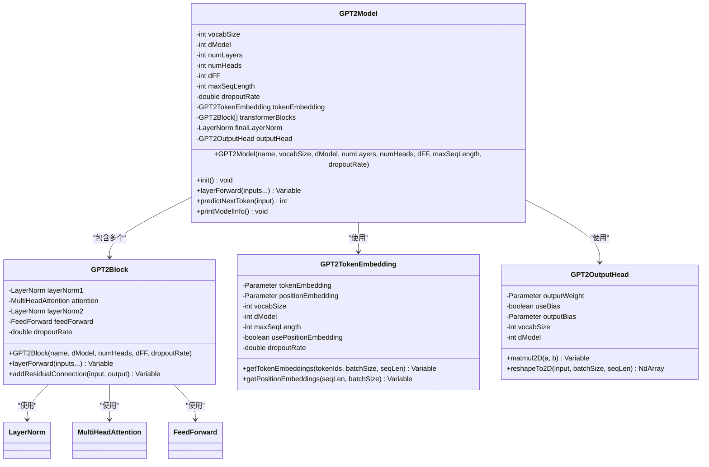

# GPT-2模型架构深度解析

<cite>
**本文档引用的文件**
- [GPT2Model.java](file://tinyai-model-gpt/src/main/java/io/leavesfly/tinyai/gpt/GPT2Model.java)
- [GPT2Block.java](file://tinyai-model-gpt/src/main/java/io/leavesfly/tinyai/gpt/GPT2Block.java)
- [GPT2TokenEmbedding.java](file://tinyai-model-gpt/src/main/java/io/leavesfly/tinyai/gpt/GPT2TokenEmbedding.java)
- [GPT2OutputHead.java](file://tinyai-model-gpt/src/main/java/io/leavesfly/tinyai/gpt/GPT2OutputHead.java)
- [LayerNorm.java](file://tinyai-dl-nnet/src/main/java/io/leavesfly/tinyai/nnet/layer/transformer/LayerNorm.java)
- [MultiHeadAttention.java](file://tinyai-dl-nnet/src/main/java/io/leavesfly/tinyai/nnet/layer/transformer/MultiHeadAttention.java)
- [GPT2Example.java](file://tinyai-model-gpt/src/main/java/io/leavesfly/tinyai/gpt/GPT2Example.java)
</cite>

## 目录
1. [简介](#简介)
2. [项目结构概览](#项目结构概览)
3. [核心组件分析](#核心组件分析)
4. [架构设计详解](#架构设计详解)
5. [数据流分析](#数据流分析)
6. [构造函数与配置灵活性](#构造函数与配置灵活性)
7. [性能考量](#性能考量)
8. [故障排除指南](#故障排除指南)
9. [结论](#结论)

## 简介

GPT-2（Generative Pre-trained Transformer 2）是一种基于Transformer解码器的自回归语言模型。本文档深入分析了TinyAI框架中GPT-2模型的实现架构，重点探讨其作为Block的继承关系、组件组合模式以及Pre-LayerNorm结构的设计理念。

GPT-2模型采用仅解码器架构，通过掩码多头自注意力机制防止未来信息泄露，并使用Pre-LayerNorm结构确保训练稳定性。该实现展现了现代Transformer架构的核心设计理念，包括残差连接、层归一化和前馈网络等关键组件。

## 项目结构概览

GPT-2模型的实现位于`tinyai-model-gpt`模块中，包含以下核心文件：


**图表来源**
- [GPT2Model.java](file://tinyai-model-gpt/src/main/java/io/leavesfly/tinyai/gpt/GPT2Model.java#L1-L50)
- [GPT2Block.java](file://tinyai-model-gpt/src/main/java/io/leavesfly/tinyai/gpt/GPT2Block.java#L1-L40)

## 核心组件分析

### GPT2Model - 主模型类

GPT2Model是整个GPT-2架构的核心控制器，继承自Block基类，负责协调各个组件的工作流程。



**图表来源**
- [GPT2Model.java](file://tinyai-model-gpt/src/main/java/io/leavesfly/tinyai/gpt/GPT2Model.java#L35-L85)
- [GPT2Block.java](file://tinyai-model-gpt/src/main/java/io/leavesfly/tinyai/gpt/GPT2Block.java#L25-L50)

**章节来源**
- [GPT2Model.java](file://tinyai-model-gpt/src/main/java/io/leavesfly/tinyai/gpt/GPT2Model.java#L1-L403)
- [GPT2Block.java](file://tinyai-model-gpt/src/main/java/io/leavesfly/tinyai/gpt/GPT2Block.java#L1-L165)

### GPT2Block - Transformer块实现

GPT2Block代表单个Transformer解码器块，实现了Pre-LayerNorm架构，这是GPT-2的核心设计特点。


**图表来源**
- [GPT2Block.java](file://tinyai-model-gpt/src/main/java/io/leavesfly/tinyai/gpt/GPT2Block.java#L65-L85)

### GPT2TokenEmbedding - 嵌入层实现

Token嵌入层负责将离散的token ID转换为连续的向量表示，同时支持位置信息编码。


**图表来源**
- [GPT2TokenEmbedding.java](file://tinyai-model-gpt/src/main/java/io/leavesfly/tinyai/gpt/GPT2TokenEmbedding.java#L75-L105)

**章节来源**
- [GPT2TokenEmbedding.java](file://tinyai-model-gpt/src/main/java/io/leavesfly/tinyai/gpt/GPT2TokenEmbedding.java#L1-L233)
- [GPT2OutputHead.java](file://tinyai-model-gpt/src/main/java/io/leavesfly/tinyai/gpt/GPT2OutputHead.java#L1-L169)

## 架构设计详解

### Pre-LayerNorm结构

GPT-2采用Pre-LayerNorm架构，与原始Transformer的Post-LayerNorm不同。这种设计的主要优势包括：

1. **训练稳定性**：Pre-LayerNorm提供了更好的梯度流动
2. **收敛速度**：更快的训练收敛
3. **梯度范数**：保持稳定的梯度范数


### 掩码多头自注意力机制

GPT-2使用带掩码的多头自注意力机制，确保解码过程中的因果性：


**图表来源**
- [MultiHeadAttention.java](file://tinyai-dl-nnet/src/main/java/io/leavesfly/tinyai/nnet/layer/transformer/MultiHeadAttention.java#L110-L141)

### 前馈网络结构

每个Transformer块包含一个前馈网络，通常采用两层线性变换加激活函数的结构：

```
FFN(x) = max(0, xW₁ + b₁)W₂ + b₂
```

其中W₁维度为(d_model, d_ff)，W₂维度为(d_ff, d_model)。

**章节来源**
- [GPT2Block.java](file://tinyai-model-gpt/src/main/java/io/leavesfly/tinyai/gpt/GPT2Block.java#L25-L165)
- [LayerNorm.java](file://tinyai-dl-nnet/src/main/java/io/leavesfly/tinyai/nnet/layer/transformer/LayerNorm.java#L1-L39)

## 数据流分析

### 完整的数据处理流程

GPT-2模型的数据流遵循严格的顺序处理模式：


**图表来源**
- [GPT2Model.java](file://tinyai-model-gpt/src/main/java/io/leavesfly/tinyai/gpt/GPT2Model.java#L155-L185)

### init()方法的组件初始化

init()方法负责按照正确的顺序初始化所有组件：

```java
// 1. Token嵌入层初始化
tokenEmbedding = new GPT2TokenEmbedding(name + "_token_embedding", vocabSize, dModel, maxSeqLength, true, dropoutRate);

// 2. Transformer块列表初始化
for (int i = 0; i < numLayers; i++) {
    GPT2Block block = new GPT2Block(name + "_block_" + i, dModel, numHeads, dFF, dropoutRate);
    transformerBlocks.add(block);
}

// 3. 最终层归一化初始化
finalLayerNorm = new LayerNorm(name + "_final_ln", dModel);

// 4. 输出头初始化
outputHead = new GPT2OutputHead(name + "_output_head", dModel, vocabSize, false);
```

### layerForward()方法的数据处理

layerForward()方法展示了完整的前向传播过程：

```java
// 1. Token嵌入 + 位置嵌入
Variable x = tokenEmbedding.layerForward(input);

// 2. 通过所有Transformer块
for (GPT2Block block : transformerBlocks) {
    x = block.layerForward(x);
}

// 3. 最终层归一化
x = finalLayerNorm.layerForward(x);

// 4. 输出头得到词汇表概率分布
Variable output = outputHead.layerForward(x);
```

**章节来源**
- [GPT2Model.java](file://tinyai-model-gpt/src/main/java/io/leavesfly/tinyai/gpt/GPT2Model.java#L105-L185)

## 构造函数与配置灵活性

### 多层次的构造函数设计

GPT2Model提供了多种构造函数，满足不同的使用场景：


**图表来源**
- [GPT2Model.java](file://tinyai-model-gpt/src/main/java/io/leavesfly/tinyai/gpt/GPT2Model.java#L55-L100)

### 默认配置参数

GPT-2模型采用了经过验证的默认参数配置：

| 参数 | 默认值 | 说明 |
|------|--------|------|
| dModel | 768 | 模型维度 |
| numHeads | 12 | 注意力头数 |
| dFF | 3072 | 前馈网络维度 |
| maxSeqLength | 1024 | 最大序列长度 |
| dropoutRate | 0.1 | Dropout比率 |

### 工厂方法createTinyModel()

为了方便用户快速开始，提供了专门的小型模型工厂方法：

```java
public static GPT2Model createTinyModel(String name, int vocabSize) {
    return new GPT2Model(
        name,
        vocabSize,
        384,      // dModel: 小型模型维度
        6,        // numLayers: 6层
        6,        // numHeads: 6个注意力头
        1536,     // dFF: 前馈网络维度
        512,      // maxSeqLength: 最大序列长度
        0.1       // dropoutRate: dropout比率
    );
}
```

**章节来源**
- [GPT2Model.java](file://tinyai-model-gpt/src/main/java/io/leavesfly/tinyai/gpt/GPT2Model.java#L55-L100)
- [GPT2Model.java](file://tinyai-model-gpt/src/main/java/io/leavesfly/tinyai/gpt/GPT2Model.java#L350-L370)

## 性能考量

### 参数统计与内存占用

GPT-2模型的参数数量可以通过以下公式估算：

```java
// Token嵌入层参数
long tokenEmbedParams = (long) vocabSize * dModel;  // 词嵌入

// 位置嵌入层参数
long posEmbedParams = (long) maxSeqLength * dModel;  // 位置嵌入

// Transformer块参数（每层）
long attnParams = (long) dModel * dModel * 4;  // Q,K,V,O矩阵
long ffnParams = (long) dModel * dFF * 2;      // 两个线性层
long lnParams = (long) dModel * 2 * 2;         // 两个LayerNorm层

// 总参数数量
long totalParams = tokenEmbedParams + posEmbedParams + 
                   (attnParams + ffnParams + lnParams) * numLayers + 
                   (long) dModel * 2 + (long) dModel * vocabSize;
```

### 计算复杂度分析

GPT-2的计算复杂度主要来自：

1. **多头注意力**：O(n²d) - n为序列长度，d为模型维度
2. **前馈网络**：O(nd²) - d为前馈网络维度
3. **总复杂度**：O(Ln²d + Ln²d²) - L为层数

### 优化建议

1. **序列长度优化**：根据实际需求调整maxSeqLength
2. **模型尺寸调节**：通过dModel、numLayers等参数平衡性能与资源消耗
3. **批处理策略**：合理设置batch_size以提高GPU利用率

## 故障排除指南

### 常见错误与解决方案

#### 1. 序列长度超限错误

```java
// 错误信息：IllegalArgumentException("输入序列长度 X 超过最大长度 Y")
if (seqLen > maxSeqLength) {
    throw new IllegalArgumentException(
        String.format("输入序列长度 %d 超过最大长度 %d", seqLen, maxSeqLength)
    );
}
```

**解决方案**：
- 检查输入序列长度是否超过maxSeqLength
- 使用padding或截断处理长序列
- 调整maxSeqLength参数

#### 2. Token ID越界错误

```java
// 错误检查：if (tokenId < 0 || tokenId >= vocabSize)
if (tokenId < 0 || tokenId >= vocabSize) {
    throw new IllegalArgumentException(
        String.format("Token ID %d is out of vocabulary range [0, %d)", tokenId, vocabSize)
    );
}
```

**解决方案**：
- 确保分词器正确构建词汇表
- 检查token ID的有效性
- 考虑使用UNK_ID处理未知token

#### 3. 内存不足问题

**解决方案**：
- 减少batch_size
- 降低maxSeqLength
- 使用梯度累积技术
- 考虑模型量化或剪枝

**章节来源**
- [GPT2Model.java](file://tinyai-model-gpt/src/main/java/io/leavesfly/tinyai/gpt/GPT2Model.java#L155-L165)
- [GPT2TokenEmbedding.java](file://tinyai-model-gpt/src/main/java/io/leavesfly/tinyai/gpt/GPT2TokenEmbedding.java#L105-L115)

## 结论

GPT-2模型的实现展现了现代Transformer架构的最佳实践。通过精心设计的组件组合模式、Pre-LayerNorm结构和多层次的配置灵活性，该实现不仅具有良好的可扩展性，还保证了训练稳定性和推理效率。

### 主要设计亮点

1. **模块化架构**：清晰的组件分离便于维护和扩展
2. **Pre-LayerNorm优势**：提升训练稳定性和收敛速度
3. **灵活的配置系统**：满足不同应用场景的需求
4. **完善的错误处理**：提供详细的错误信息和调试支持

### 应用建议

1. **研究用途**：适合学术研究和模型实验
2. **教学演示**：清晰的代码结构便于理解Transformer原理
3. **原型开发**：快速搭建基础语言模型进行功能验证
4. **性能优化**：可根据具体需求调整模型参数

通过深入理解GPT-2模型的架构设计，开发者可以更好地掌握Transformer的核心概念，并在此基础上进行创新和改进。这个实现为构建更复杂的语言模型奠定了坚实的基础。