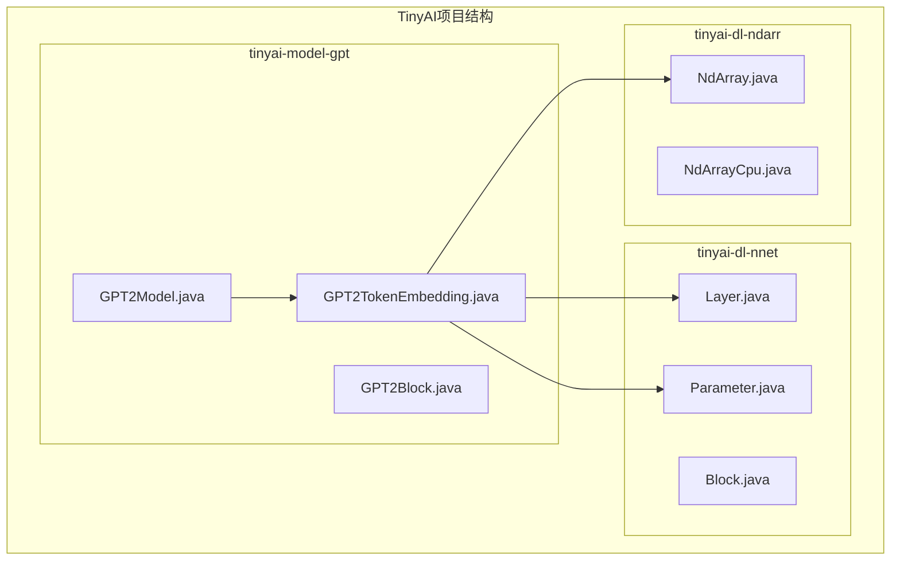
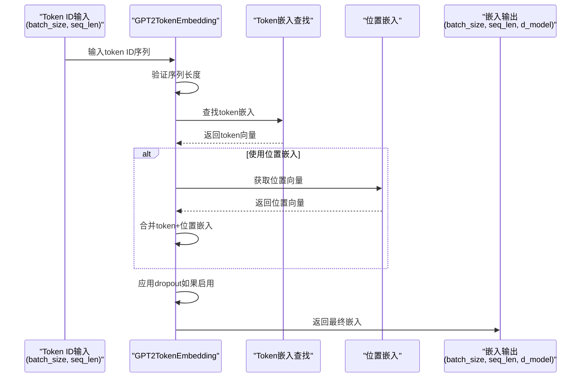
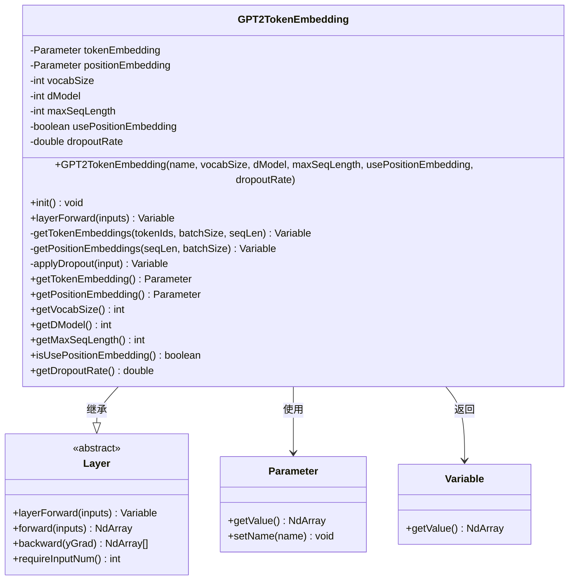
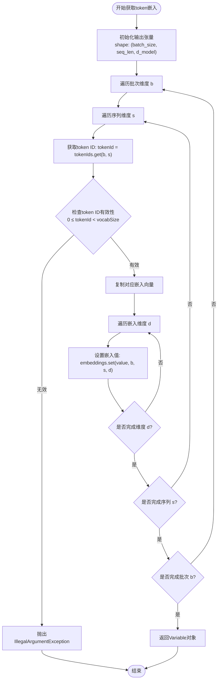
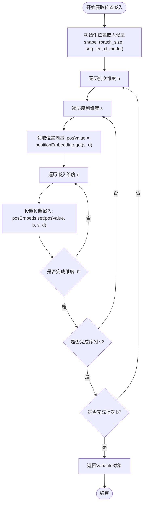
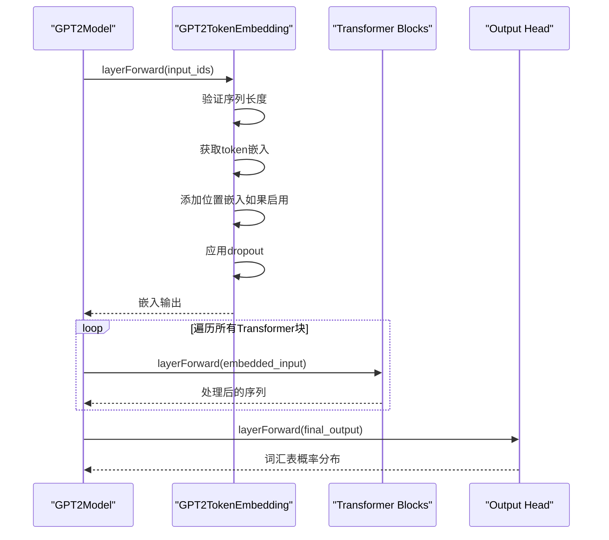
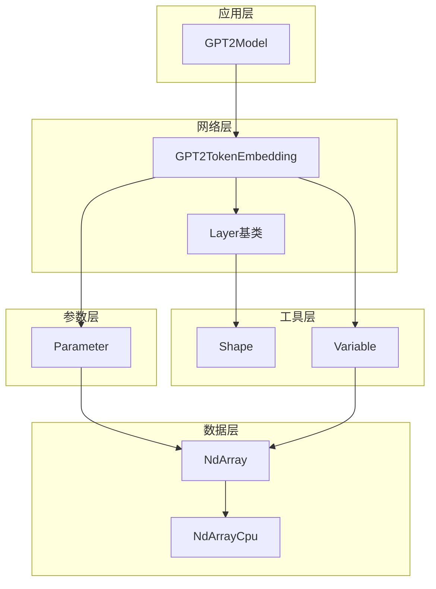

# Token与位置嵌入层

<cite>
**本文档引用的文件**
- [GPT2TokenEmbedding.java](file://tinyai-model-gpt/src/main/java/io/leavesfly/tinyai/gpt/GPT2TokenEmbedding.java)
- [GPT2TokenEmbeddingTest.java](file://tinyai-dl-nnet/src/test/java/io/leavesfly/tinyai/nnet/layer/transformer/GPT2TokenEmbeddingTest.java)
- [GPT2Model.java](file://tinyai-model-gpt/src/main/java/io/leavesfly/tinyai/gpt/GPT2Model.java)
- [NdArray.java](file://tinyai-dl-ndarr/src/main/java/io/leavesfly/tinyai/ndarr/NdArray.java)
- [NdArrayCpu.java](file://tinyai-dl-ndarr/src/main/java/io/leavesfly/tinyai/ndarr/cpu/NdArrayCpu.java)
</cite>

## 目录
1. [简介](#简介)
2. [项目结构](#项目结构)
3. [核心组件](#核心组件)
4. [架构概览](#架构概览)
5. [详细组件分析](#详细组件分析)
6. [依赖关系分析](#依赖关系分析)
7. [性能考虑](#性能考虑)
8. [故障排除指南](#故障排除指南)
9. [结论](#结论)

## 简介

GPT2TokenEmbedding类是TinyAI框架中实现GPT-2模型核心嵌入层的关键组件。该类负责将输入的token ID序列转换为高维向量表示，支持两种类型的嵌入：token嵌入和位置嵌入。通过精心设计的参数初始化策略和高效的张量操作，该层为后续的Transformer块提供了高质量的输入特征。

该嵌入层采用了正态分布缩放初始化（标准差0.02），确保了模型训练初期的稳定性。同时，它提供了灵活的配置选项，允许用户根据具体需求选择是否使用学习的位置嵌入或采用预定义的位置编码方案。

## 项目结构

GPT2TokenEmbedding类位于TinyAI项目的gpt模块中，作为Transformer架构的基础组件：



**图表来源**
- [GPT2TokenEmbedding.java](file://tinyai-model-gpt/src/main/java/io/leavesfly/tinyai/gpt/GPT2TokenEmbedding.java#L1-L233)
- [GPT2Model.java](file://tinyai-model-gpt/src/main/java/io/leavesfly/tinyai/gpt/GPT2Model.java#L1-L50)

**章节来源**
- [GPT2TokenEmbedding.java](file://tinyai-model-gpt/src/main/java/io/leavesfly/tinyai/gpt/GPT2TokenEmbedding.java#L1-L233)
- [GPT2Model.java](file://tinyai-model-gpt/src/main/java/io/leavesfly/tinyai/gpt/GPT2Model.java#L1-L100)

## 核心组件

GPT2TokenEmbedding类的核心组件包括：

### 参数初始化策略
- **tokenEmbedding**: 词汇表大小 × 嵌入维度的权重矩阵，使用正态分布初始化，标准差为0.02
- **positionEmbedding**: 最大序列长度 × 嵌入维度的权重矩阵（可选），同样使用正态分布初始化
- **vocabSize**: 词汇表大小，定义token嵌入矩阵的第一维
- **dModel**: 嵌入维度，定义token和位置嵌入的第二维
- **maxSeqLength**: 最大序列长度，用于验证输入序列的有效性

### 关键特性
- **可选位置嵌入**: 支持使用学习的位置嵌入或依赖外部位置编码
- **序列长度验证**: 自动检查输入序列长度是否超过最大限制
- **非法token ID检测**: 提供完整的错误处理机制
- **dropout支持**: 可配置的dropout比率，支持训练和推理模式

**章节来源**
- [GPT2TokenEmbedding.java](file://tinyai-model-gpt/src/main/java/io/leavesfly/tinyai/gpt/GPT2TokenEmbedding.java#L19-L35)
- [GPT2TokenEmbedding.java](file://tinyai-model-gpt/src/main/java/io/leavesfly/tinyai/gpt/GPT2TokenEmbedding.java#L58-L80)

## 架构概览

GPT2TokenEmbedding在GPT-2模型架构中扮演着关键角色，作为整个Transformer解码器的入口层：



**图表来源**
- [GPT2TokenEmbedding.java](file://tinyai-model-gpt/src/main/java/io/leavesfly/tinyai/gpt/GPT2TokenEmbedding.java#L82-L105)
- [GPT2Model.java](file://tinyai-model-gpt/src/main/java/io/leavesfly/tinyai/gpt/GPT2Model.java#L162-L189)

## 详细组件分析

### 类结构分析



**图表来源**
- [GPT2TokenEmbedding.java](file://tinyai-model-gpt/src/main/java/io/leavesfly/tinyai/gpt/GPT2TokenEmbedding.java#L19-L233)

### 参数初始化策略

GPT2TokenEmbedding采用了精心设计的参数初始化策略：

```java
// 正态分布初始化，标准差为0.02
tokenEmbedding = new Parameter(NdArray.likeRandomN(Shape.of(vocabSize, dModel)).mulNum(0.02f));
```

这种初始化策略的优势：
- **数值稳定性**: 缩放因子0.02确保了梯度流的稳定性
- **收敛加速**: 合适的初始化有助于快速收敛
- **通用性**: 适用于各种词汇表大小和嵌入维度

**章节来源**
- [GPT2TokenEmbedding.java](file://tinyai-model-gpt/src/main/java/io/leavesfly/tinyai/gpt/GPT2TokenEmbedding.java#L58-L80)

### Token嵌入获取逻辑

getTokenEmbeddings方法实现了高效的token ID到向量的映射：



**图表来源**
- [GPT2TokenEmbedding.java](file://tinyai-model-gpt/src/main/java/io/leavesfly/tinyai/gpt/GPT2TokenEmbedding.java#L107-L135)

### 位置嵌入获取逻辑

getPositionEmbeddings方法处理位置信息的添加：



**图表来源**
- [GPT2TokenEmbedding.java](file://tinyai-model-gpt/src/main/java/io/leavesfly/tinyai/gpt/GPT2TokenEmbedding.java#L137-L157)

### 错误处理机制

GPT2TokenEmbedding提供了完善的错误处理机制：

1. **序列长度验证**: 自动检查输入序列长度是否超过maxSeqLength
2. **token ID有效性检查**: 验证每个token ID是否在有效范围内
3. **异常信息提供**: 详细的错误消息帮助调试

```java
// 序列长度检查
if (seqLen > maxSeqLength) {
    throw new IllegalArgumentException(
        String.format("Sequence length %d exceeds maximum length %d", seqLen, maxSeqLength)
    );
}

// token ID有效性检查
if (tokenId < 0 || tokenId >= vocabSize) {
    throw new IllegalArgumentException(
        String.format("Token ID %d is out of vocabulary range [0, %d)", tokenId, vocabSize)
    );
}
```

**章节来源**
- [GPT2TokenEmbedding.java](file://tinyai-model-gpt/src/main/java/io/leavesfly/tinyai/gpt/GPT2TokenEmbedding.java#L85-L95)
- [GPT2TokenEmbedding.java](file://tinyai-model-gpt/src/main/java/io/leavesfly/tinyai/gpt/GPT2TokenEmbedding.java#L118-L125)

### 与GPT-2模型的集成

GPT2TokenEmbedding作为GPT-2模型的核心组件，在模型前向传播中发挥关键作用：



**图表来源**
- [GPT2Model.java](file://tinyai-model-gpt/src/main/java/io/leavesfly/tinyai/gpt/GPT2Model.java#L162-L189)
- [GPT2TokenEmbedding.java](file://tinyai-model-gpt/src/main/java/io/leavesfly/tinyai/gpt/GPT2TokenEmbedding.java#L82-L105)

**章节来源**
- [GPT2Model.java](file://tinyai-model-gpt/src/main/java/io/leavesfly/tinyai/gpt/GPT2Model.java#L162-L189)

## 依赖关系分析

GPT2TokenEmbedding的依赖关系体现了清晰的分层架构：



**图表来源**
- [GPT2TokenEmbedding.java](file://tinyai-model-gpt/src/main/java/io/leavesfly/tinyai/gpt/GPT2TokenEmbedding.java#L1-L10)
- [NdArray.java](file://tinyai-dl-ndarr/src/main/java/io/leavesfly/tinyai/ndarr/NdArray.java#L107-L146)

**章节来源**
- [GPT2TokenEmbedding.java](file://tinyai-model-gpt/src/main/java/io/leavesfly/tinyai/gpt/GPT2TokenEmbedding.java#L1-L10)

## 性能考虑

### 内存优化
- **张量复用**: 通过预先分配输出张量避免频繁内存分配
- **批量处理**: 支持批量token ID处理提高效率
- **维度优化**: 合理的张量维度设计减少内存碎片

### 计算优化
- **循环展开**: 逐元素处理确保精度和稳定性
- **条件分支**: 位置嵌入的可选性减少不必要的计算
- **早期退出**: 无效输入的快速失败机制

### 初始化优化
- **正态分布缩放**: 0.02的标准差平衡了收敛速度和稳定性
- **GPU友好**: 支持CPU和GPU后端的高效实现

## 故障排除指南

### 常见问题及解决方案

1. **序列长度超限**
   ```
   异常: IllegalArgumentException("Sequence length X exceeds maximum length Y")
   解决: 调整maxSeqLength参数或截断输入序列
   ```

2. **非法token ID**
   ```
   异常: IllegalArgumentException("Token ID Z is out of vocabulary range [0, W)")
   解决: 检查token ID是否在[0, vocabSize)范围内
   ```

3. **参数初始化失败**
   ```
   原因: 内存不足或形状不匹配
   解决: 检查vocabSize、dModel和maxSeqLength的合理性
   ```

**章节来源**
- [GPT2TokenEmbeddingTest.java](file://tinyai-dl-nnet/src/test/java/io/leavesfly/tinyai/nnet/layer/transformer/GPT2TokenEmbeddingTest.java#L45-L63)

## 结论

GPT2TokenEmbedding类是TinyAI框架中实现GPT-2模型嵌入层的核心组件。通过精心设计的参数初始化策略、高效的张量操作和完善的错误处理机制，该类为Transformer架构提供了高质量的输入特征表示。

主要优势包括：
- **数值稳定性**: 正态分布缩放初始化确保训练稳定性
- **灵活性**: 支持可选的位置嵌入和多种配置选项
- **性能**: 高效的张量操作和内存管理
- **可靠性**: 完善的错误处理和验证机制

该嵌入层作为GPT-2模型的入口层，为后续的Transformer块提供了必要的特征表示，是整个模型架构中不可或缺的基础组件。通过深入理解其实现原理，开发者可以更好地利用和扩展这一核心功能。