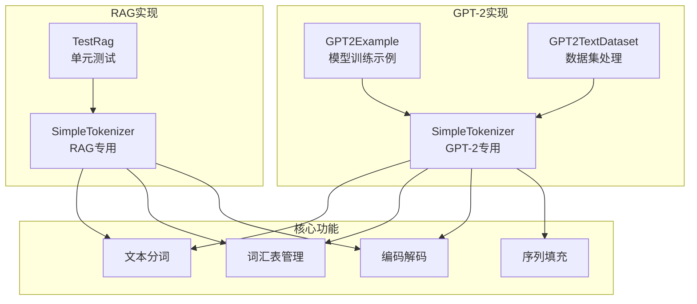
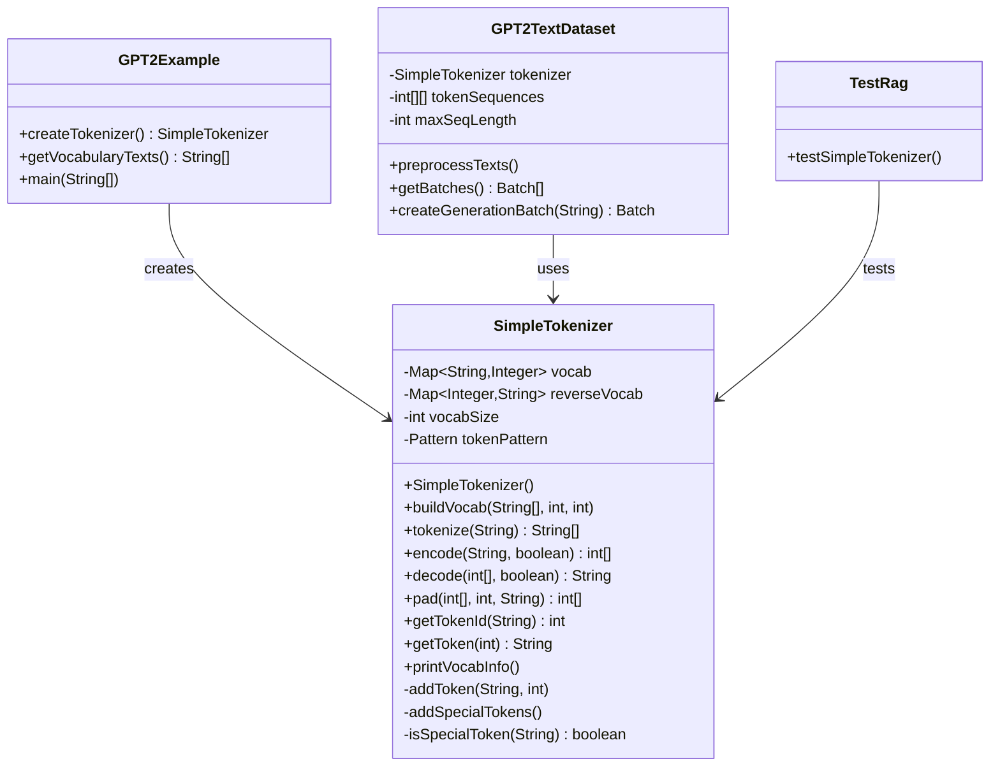
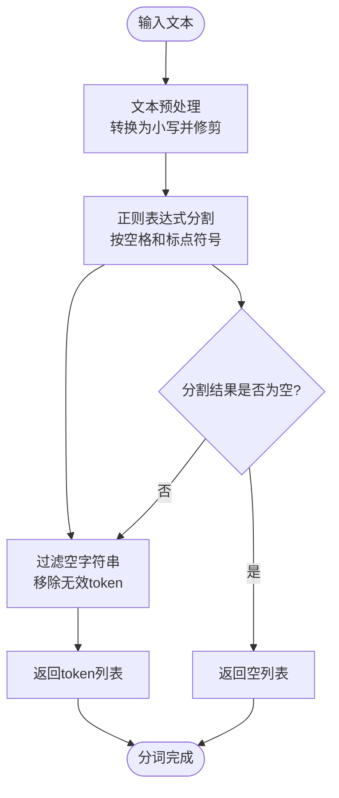
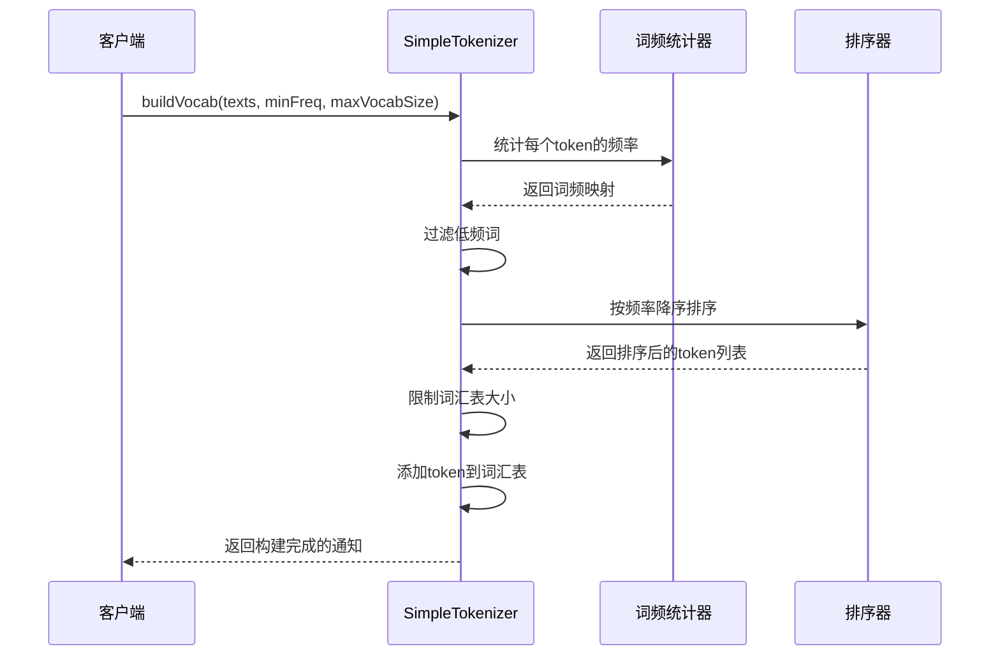
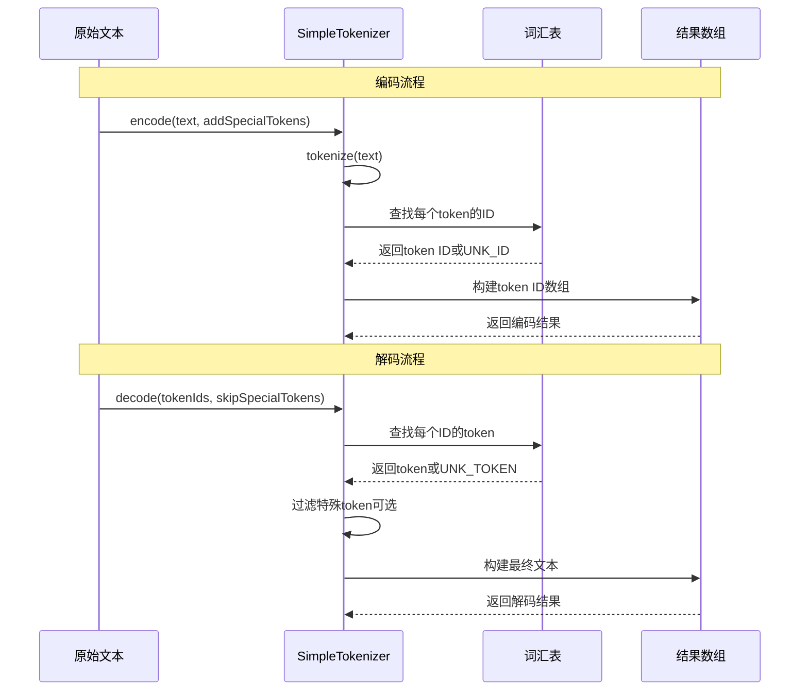
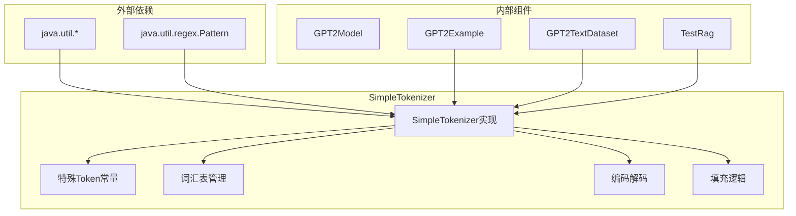

# 文本分词与词汇表管理

<cite>
**本文档引用的文件**
- [SimpleTokenizer.java](file://tinyai-model-gpt/src/main/java/io/leavesfly/tinyai/gpt/SimpleTokenizer.java)
- [GPT2Example.java](file://tinyai-model-gpt/src/main/java/io/leavesfly/tinyai/gpt/GPT2Example.java)
- [GPT2TextDataset.java](file://tinyai-model-gpt/src/main/java/io/leavesfly/tinyai/gpt/GPT2TextDataset.java)
- [SimpleTokenizer.java](file://tinyai-agent-rag/src/main/java/io/leavesfly/tinyai/agent/rag/SimpleTokenizer.java)
- [TestRag.java](file://tinyai-agent-rag/src/test/java/io/leavesfly/tinyai/agent/rag/TestRag.java)
</cite>

## 目录
1. [简介](#简介)
2. [项目结构](#项目结构)
3. [核心组件](#核心组件)
4. [架构概览](#架构概览)
5. [详细组件分析](#详细组件分析)
6. [依赖关系分析](#依赖关系分析)
7. [性能考虑](#性能考虑)
8. [故障排除指南](#故障排除指南)
9. [结论](#结论)

## 简介

SimpleTokenizer类是TinyAI框架中的核心文本处理组件，专门设计用于自然语言处理任务中的文本分词和词汇表管理。该类提供了两种不同的实现版本，分别针对GPT-2模型和RAG系统的需求，展现了灵活的文本处理能力。

SimpleTokenizer的主要功能包括：
- 基于空格和标点符号的简单文本分割策略
- 动态词汇表构建（buildVocab）
- 文本到token ID的编码（encode）与token ID到文本的解码（decode）流程
- 特殊token处理（UNK、BOS、EOS、PAD）
- 批次处理中的序列填充（pad）

## 项目结构

SimpleTokenizer类在TinyAI项目中有两个主要实现：



**图表来源**
- [SimpleTokenizer.java](file://tinyai-model-gpt/src/main/java/io/leavesfly/tinyai/gpt/SimpleTokenizer.java#L1-L366)
- [GPT2Example.java](file://tinyai-model-gpt/src/main/java/io/leavesfly/tinyai/gpt/GPT2Example.java#L1-L307)
- [GPT2TextDataset.java](file://tinyai-model-gpt/src/main/java/io/leavesfly/tinyai/gpt/GPT2TextDataset.java#L1-L233)

## 核心组件

SimpleTokenizer类的核心组件包括以下几个关键部分：

### 特殊Token定义

```java
// 填充token
public static final String PAD_TOKEN = "<pad>";
public static final int PAD_ID = 0;

// 未知token
public static final String UNK_TOKEN = "<unk>";
public static final int UNK_ID = 1;

// 序列开始token
public static final String BOS_TOKEN = "<bos>";
public static final int BOS_ID = 2;

// 序列结束token
public static final String EOS_TOKEN = "<eos>";
public static final int EOS_ID = 3;
```

这些特殊token在自然语言处理中扮演重要角色：
- **PAD_TOKEN**：用于序列填充，确保批次中所有序列具有相同长度
- **UNK_TOKEN**：表示词汇表中未出现的未知词汇
- **BOS_TOKEN**：标记序列的开始，常用于生成任务
- **EOS_TOKEN**：标记序列的结束，用于序列截断和生成控制

### 数据结构设计

```java
private Map<String, Integer> vocab;      // 词汇到ID的映射
private Map<Integer, String> reverseVocab; // ID到词汇的映射
private int vocabSize;                   // 词汇表大小
private Pattern tokenPattern;            // 分词正则表达式
```

这种双向映射设计允许高效的正向和反向查找，同时保持内存效率。

**章节来源**
- [SimpleTokenizer.java](file://tinyai-model-gpt/src/main/java/io/leavesfly/tinyai/gpt/SimpleTokenizer.java#L15-L116)

## 架构概览

SimpleTokenizer的整体架构采用分层设计，支持多种文本处理场景：



**图表来源**
- [SimpleTokenizer.java](file://tinyai-model-gpt/src/main/java/io/leavesfly/tinyai/gpt/SimpleTokenizer.java#L15-L366)
- [GPT2Example.java](file://tinyai-model-gpt/src/main/java/io/leavesfly/tinyai/gpt/GPT2Example.java#L40-L80)
- [GPT2TextDataset.java](file://tinyai-model-gpt/src/main/java/io/leavesfly/tinyai/gpt/GPT2TextDataset.java#L20-L50)

## 详细组件分析

### 分词机制分析

SimpleTokenizer采用基于正则表达式的简单分词策略：

```java
// 分词正则表达式
this.tokenPattern = Pattern.compile("\\s+|(?=[.,!?;:])|(?<=[.,!?;:])");
```

这个正则表达式的设计理念：
- `\\s+`：匹配一个或多个空白字符（空格、制表符、换行符）
- `(?=[.,!?;:])`：匹配标点符号前的位置（前瞻断言）
- `(?<=[.,!?;:])`：匹配标点符号后的位置（后瞻断言）

这种设计确保了文本能够按照空格和标点符号进行精确分割，同时保留标点符号作为独立token。



**图表来源**
- [SimpleTokenizer.java](file://tinyai-model-gpt/src/main/java/io/leavesfly/tinyai/gpt/SimpleTokenizer.java#L158-L175)

### 词汇表构建流程

词汇表构建是SimpleTokenizer的核心功能之一：

```java
public void buildVocab(List<String> texts, int minFreq, int maxVocabSize) {
    // 统计词频
    Map<String, Integer> tokenFreq = new HashMap<>();
    
    for (String text : texts) {
        List<String> tokens = tokenize(text);
        for (String token : tokens) {
            tokenFreq.put(token, tokenFreq.getOrDefault(token, 0) + 1);
        }
    }
    
    // 过滤低频词并按频率排序
    List<Map.Entry<String, Integer>> sortedTokens = new ArrayList<>();
    for (Map.Entry<String, Integer> entry : tokenFreq.entrySet()) {
        if (entry.getValue() >= minFreq) {
            sortedTokens.add(entry);
        }
    }
    
    // 按频率降序排序
    sortedTokens.sort((a, b) -> b.getValue().compareTo(a.getValue()));
    
    // 限制词汇表大小
    int actualMaxSize = Math.min(maxVocabSize - 4, sortedTokens.size());
    
    // 添加token到词汇表
    for (int i = 0; i < actualMaxSize; i++) {
        String token = sortedTokens.get(i).getKey();
        if (!vocab.containsKey(token)) {
            addToken(token, vocabSize++);
        }
    }
}
```

构建过程的关键步骤：



**图表来源**
- [SimpleTokenizer.java](file://tinyai-model-gpt/src/main/java/io/leavesfly/tinyai/gpt/SimpleTokenizer.java#L85-L120)

### 编码与解码机制

#### 编码流程

```java
public int[] encode(String text, boolean addSpecialTokens) {
    List<String> tokens = tokenize(text);
    List<Integer> tokenIds = new ArrayList<>();
    
    // 添加开始token
    if (addSpecialTokens) {
        tokenIds.add(BOS_ID);
    }
    
    // 转换token为ID
    for (String token : tokens) {
        int tokenId = vocab.getOrDefault(token, UNK_ID);
        tokenIds.add(tokenId);
    }
    
    // 添加结束token
    if (addSpecialTokens) {
        tokenIds.add(EOS_ID);
    }
    
    // 转换为数组
    return tokenIds.stream().mapToInt(Integer::intValue).toArray();
}
```

#### 解码流程

```java
public String decode(int[] tokenIds, boolean skipSpecialTokens) {
    List<String> tokens = new ArrayList<>();
    
    for (int tokenId : tokenIds) {
        String token = reverseVocab.get(tokenId);
        if (token != null) {
            // 跳过特殊token（如果需要的话）
            if (skipSpecialTokens && isSpecialToken(token)) {
                continue;
            }
            tokens.add(token);
        }
    }
    
    return String.join(" ", tokens);
}
```



**图表来源**
- [SimpleTokenizer.java](file://tinyai-model-gpt/src/main/java/io/leavesfly/tinyai/gpt/SimpleTokenizer.java#L177-L238)

### 序列填充机制

pad方法是批次处理中的关键功能：

```java
public int[] pad(int[] tokenIds, int maxLength, String padding) {
    if (tokenIds.length >= maxLength) {
        // 如果长度超过maxLength，截断
        int[] result = new int[maxLength];
        System.arraycopy(tokenIds, 0, result, 0, maxLength);
        return result;
    }
    
    int[] padded = new int[maxLength];
    int padCount = maxLength - tokenIds.length;
    
    if ("pre".equals(padding)) {
        // 前置填充
        Arrays.fill(padded, 0, padCount, PAD_ID);
        System.arraycopy(tokenIds, 0, padded, padCount, tokenIds.length);
    } else {
        // 后置填充（默认）
        Arrays.fill(padded, tokenIds.length, maxLength, PAD_ID);
        Arrays.fill(padded, 0, tokenIds.length, PAD_ID);
    }
    
    return padded;
}
```

填充策略的选择对模型性能有重要影响：
- **前置填充**：将PAD_TOKEN放在序列开头，可能更适合某些注意力机制
- **后置填充**：将PAD_TOKEN放在序列末尾，是更常见的选择

**章节来源**
- [SimpleTokenizer.java](file://tinyai-model-gpt/src/main/java/io/leavesfly/tinyai/gpt/SimpleTokenizer.java#L287-L327)

### RAG系统的分词器实现

RAG系统中的SimpleTokenizer提供了更复杂的分词功能，特别针对中英文混合文本：

```java
public List<String> tokenize(String text) {
    if (text == null || text.trim().isEmpty()) {
        return new ArrayList<>();
    }

    // 转换为小写
    text = text.toLowerCase();
    
    // 移除标点符号，保留中英文字符和数字
    text = punctuationPattern.matcher(text).replaceAll(" ");
    
    // 按空格分割
    String[] words = text.split("\\s+");
    
    List<String> result = new ArrayList<>();
    
    for (String word : words) {
        if (word.trim().isEmpty()) {
            continue;
        }
        
        // 检查是否包含中文字符
        if (chinesePattern.matcher(word).find()) {
            // 包含中文，按字符分词
            for (char c : word.toCharArray()) {
                String charStr = String.valueOf(c);
                if (!charStr.trim().isEmpty()) {
                    result.add(charStr);
                }
            }
        } else {
            // 英文单词，直接添加
            result.add(word);
        }
    }
    
    return result.stream()
            .filter(token -> !token.trim().isEmpty())
            .collect(ArrayList::new, ArrayList::add, ArrayList::addAll);
}
```

这种实现的特点：
- **中文字符处理**：将中文字符逐字分割，适合中文语境下的细粒度处理
- **标点符号清理**：移除不必要的标点符号，减少噪声
- **大小写统一**：转换为小写，提高词汇表利用率

**章节来源**
- [SimpleTokenizer.java](file://tinyai-agent-rag/src/main/java/io/leavesfly/tinyai/agent/rag/SimpleTokenizer.java#L25-L60)

## 依赖关系分析

SimpleTokenizer的依赖关系展现了清晰的层次结构：



**图表来源**
- [SimpleTokenizer.java](file://tinyai-model-gpt/src/main/java/io/leavesfly/tinyai/gpt/SimpleTokenizer.java#L1-L10)
- [GPT2Example.java](file://tinyai-model-gpt/src/main/java/io/leavesfly/tinyai/gpt/GPT2Example.java#L1-L20)

**章节来源**
- [SimpleTokenizer.java](file://tinyai-model-gpt/src/main/java/io/leavesfly/tinyai/gpt/SimpleTokenizer.java#L1-L366)
- [GPT2Example.java](file://tinyai-model-gpt/src/main/java/io/leavesfly/tinyai/gpt/GPT2Example.java#L1-L307)

## 性能考虑

### 内存优化策略

SimpleTokenizer采用了多种内存优化技术：

1. **延迟初始化**：词汇表和映射关系仅在需要时创建
2. **流式处理**：在构建词汇表时使用流式处理，避免大量中间数据结构
3. **双向映射**：同时维护正向和反向映射，平衡查询时间和内存使用

### 时间复杂度分析

- **分词操作**：O(n)，其中n是输入文本长度
- **词汇表构建**：O(m×k)，其中m是文本数量，k是平均token数量
- **编码操作**：O(k)，其中k是token数量
- **解码操作**：O(k)，其中k是token ID数量
- **填充操作**：O(maxLength)

### 批次处理优化

在GPT2TextDataset中，批次处理通过以下方式优化性能：

```java
// 预处理阶段一次性处理所有文本
private void preprocessTexts() {
    for (String text : texts) {
        if (text != null && !text.trim().isEmpty()) {
            int[] tokens = tokenizer.encode(text, true);
            
            if (tokens.length > maxSeqLength) {
                // 滑动窗口处理长序列
                int stepSize = maxSeqLength / 2;
                for (int start = 0; start < tokens.length - maxSeqLength + 1; start += stepSize) {
                    int[] sequence = new int[maxSeqLength];
                    System.arraycopy(tokens, start, sequence, 0, maxSeqLength);
                    tokenSequences.add(sequence);
                }
            } else {
                // 填充短序列
                int[] paddedTokens = tokenizer.pad(tokens, maxSeqLength, "post");
                tokenSequences.add(paddedTokens);
            }
        }
    }
}
```

这种设计的优势：
- **滑动窗口**：有效利用长文本信息，避免信息丢失
- **批量处理**：减少循环次数，提高整体效率
- **内存预分配**：预先计算序列数量，避免动态扩容

## 故障排除指南

### 常见问题及解决方案

#### 1. 词汇表构建失败

**问题症状**：buildVocab方法抛出异常或返回空词汇表

**可能原因**：
- 输入文本为空或格式不正确
- 正则表达式无法正确分割文本
- 词频阈值设置过高

**解决方案**：
```java
// 检查输入文本
if (texts == null || texts.isEmpty()) {
    throw new IllegalArgumentException("输入文本不能为空");
}

// 设置合理的最小词频
int minFreq = Math.max(1, texts.size() / 100); // 至少1%，或至少1次

// 检查分词效果
List<String> sampleTokens = tokenize(texts.get(0));
if (sampleTokens.isEmpty()) {
    System.err.println("分词失败，请检查正则表达式");
}
```

#### 2. 编码解码不一致

**问题症状**：encode后再decode得到的文本与原文本不完全相同

**可能原因**：
- 特殊token的处理不一致
- 标点符号被移除或修改
- 大小写转换导致信息丢失

**解决方案**：
```java
// 在解码时跳过特殊token
String decoded = tokenizer.decode(encoded, true);

// 或者在编码时不添加特殊token
int[] encodedWithoutSpecial = tokenizer.encode(text, false);
```

#### 3. 填充位置错误

**问题症状**：批次数据中PAD_TOKEN出现在不正确的位置

**可能原因**：
- 填充方向设置错误
- 序列长度计算不准确

**解决方案**：
```java
// 明确指定填充方向
int[] padded = tokenizer.pad(tokens, maxLength, "post"); // 或 "pre"

// 检查序列长度
assert tokens.length <= maxLength : "序列长度超过最大长度";
```

### 调试工具

SimpleTokenizer提供了内置的调试功能：

```java
public void printVocabInfo() {
    System.out.println("=== Tokenizer Information ===");
    System.out.println("Vocabulary Size: " + vocabSize);
    System.out.println("Special Tokens:");
    System.out.println("  PAD: " + PAD_TOKEN + " (" + PAD_ID + ")");
    System.out.println("  UNK: " + UNK_TOKEN + " (" + UNK_ID + ")");
    System.out.println("  BOS: " + BOS_TOKEN + " (" + BOS_ID + ")");
    System.out.println("  EOS: " + EOS_TOKEN + " (" + EOS_ID + ")");
    
    // 显示一些示例token
    System.out.println("Sample tokens:");
    int count = 0;
    for (Map.Entry<String, Integer> entry : vocab.entrySet()) {
        if (count >= 10) break;
        if (!isSpecialToken(entry.getKey())) {
            System.out.println("  " + entry.getKey() + " (" + entry.getValue() + ")");
            count++;
        }
    }
    System.out.println("=============================");
}
```

**章节来源**
- [SimpleTokenizer.java](file://tinyai-model-gpt/src/main/java/io/leavesfly/tinyai/gpt/SimpleTokenizer.java#L330-L365)

## 结论

SimpleTokenizer类展现了优秀的文本处理设计，通过以下特点实现了高效、灵活的文本分词和词汇表管理：

### 主要优势

1. **简洁而强大的设计**：基于正则表达式的分词策略既简单又有效
2. **灵活的特殊token处理**：支持UNK、BOS、EOS、PAD等多种特殊token
3. **双向映射优化**：同时维护正向和反向词汇表映射
4. **批次处理支持**：完善的序列填充机制适应深度学习需求
5. **多场景适配**：GPT-2和RAG两个不同实现满足不同应用需求

### 实际应用场景

- **语言模型训练**：GPT-2Example展示了完整的模型训练流程
- **检索增强生成**：RAG系统中的中文文本处理能力
- **文本分类**：基础的文本预处理功能
- **序列到序列任务**：支持编码-解码的完整流程

### 改进方向建议

1. **支持更多语言**：扩展对其他语言字符集的支持
2. **优化分词策略**：引入更高级的分词算法如BPE
3. **性能优化**：进一步优化大规模词汇表的处理性能
4. **扩展功能**：添加子词处理、词干提取等功能

SimpleTokenizer作为TinyAI框架的基础组件，为各种NLP任务提供了可靠的文本处理能力，其设计理念和实现方式值得深入学习和借鉴。