# GPT-2语言模型实现详解

<cite>
**本文档引用的文件**
- [GPT2Example.java](file://tinyai-model-gpt/src/main/java/io/leavesfly/tinyai/gpt/GPT2Example.java)
- [GPT2Model.java](file://tinyai-model-gpt/src/main/java/io/leavesfly/tinyai/gpt/GPT2Model.java)
- [GPT2Block.java](file://tinyai-model-gpt/src/main/java/io/leavesfly/tinyai/gpt/GPT2Block.java)
- [GPT2TokenEmbedding.java](file://tinyai-model-gpt/src/main/java/io/leavesfly/tinyai/gpt/GPT2TokenEmbedding.java)
- [GPT2OutputHead.java](file://tinyai-model-gpt/src/main/java/io/leavesfly/tinyai/gpt/GPT2OutputHead.java)
- [SimpleTokenizer.java](file://tinyai-model-gpt/src/main/java/io/leavesfly/tinyai/gpt/SimpleTokenizer.java)
- [GPT2TextDataset.java](file://tinyai-model-gpt/src/main/java/io/leavesfly/tinyai/gpt/GPT2TextDataset.java)
- [GPT2ModelDemo.java](file://tinyai-model-gpt/src/main/java/io/leavesfly/tinyai/gpt/GPT2ModelDemo.java)
- [Word2Vec.java](file://tinyai-model-gpt/src/main/java/io/leavesfly/tinyai/gpt/Word2Vec.java)
- [Word2VecExample.java](file://tinyai-model-gpt/src/main/java/io/leavesfly/tinyai/gpt/Word2VecExample.java)
- [GPT2ModelTest.java](file://tinyai-model-gpt/src/test/java/io/leavesfly/tinyai/gpt/GPT2ModelTest.java)
</cite>

## 目录
1. [项目概述](#项目概述)
2. [核心架构](#核心架构)
3. [模型组件详解](#模型组件详解)
4. [训练流程](#训练流程)
5. [文本生成机制](#文本生成机制)
6. [分词器系统](#分词器系统)
7. [数据处理管道](#数据处理管道)
8. [性能优化](#性能优化)
9. [故障排除指南](#故障排除指南)
10. [总结](#总结)

## 项目概述

GPT-2语言模型是一个基于Transformer架构的自回归语言模型，采用解码器-only的设计。该项目实现了一个完整的GPT-2模型框架，包括模型架构、训练流程、文本生成和微调功能。

### 主要特性

- **Transformer解码器架构**：仅使用解码器部分，支持多头自注意力机制
- **预层归一化结构**：在每个子层之前应用层归一化，提高训练稳定性
- **残差连接**：确保梯度流动和信息传递
- **位置编码**：支持学习的位置嵌入和可选的正弦余弦位置编码
- **自回归生成**：支持贪婪搜索和概率采样生成文本
- **灵活的模型配置**：支持从小型到大型的各种模型规模

## 核心架构

GPT-2模型采用经典的Transformer解码器架构，其整体结构如下：

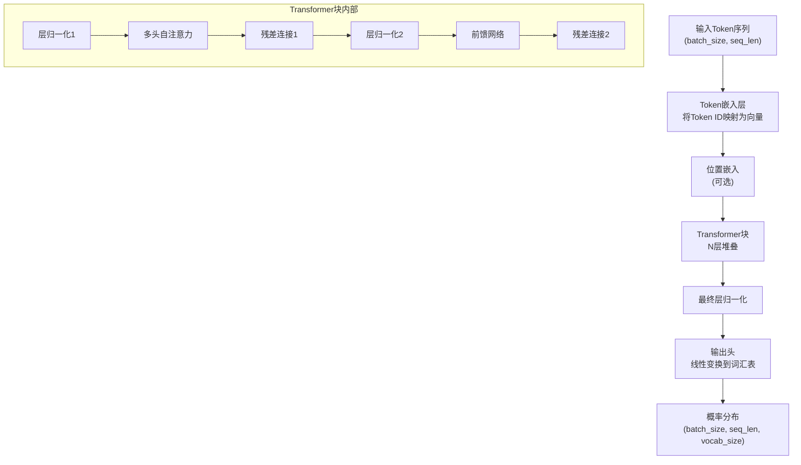

**图表来源**
- [GPT2Model.java](file://tinyai-model-gpt/src/main/java/io/leavesfly/tinyai/gpt/GPT2Model.java#L1-L403)
- [GPT2Block.java](file://tinyai-model-gpt/src/main/java/io/leavesfly/tinyai/gpt/GPT2Block.java#L1-L165)

### 模型配置参数

GPT-2模型的核心配置参数包括：

- **词汇表大小 (vocabSize)**：模型能识别的不同token数量
- **模型维度 (dModel)**：嵌入向量和隐藏层的维度
- **层数 (numLayers)**：Transformer块的数量
- **注意力头数 (numHeads)**：多头注意力机制中的头数量
- **前馈网络维度 (dFF)**：前馈网络中间层的维度
- **最大序列长度 (maxSeqLength)**：模型能处理的最大序列长度
- **Dropout率 (dropoutRate)**：防止过拟合的dropout比率

**章节来源**
- [GPT2Model.java](file://tinyai-model-gpt/src/main/java/io/leavesfly/tinyai/gpt/GPT2Model.java#L30-L60)

## 模型组件详解

### Token嵌入层

Token嵌入层负责将离散的token ID转换为连续的向量表示：

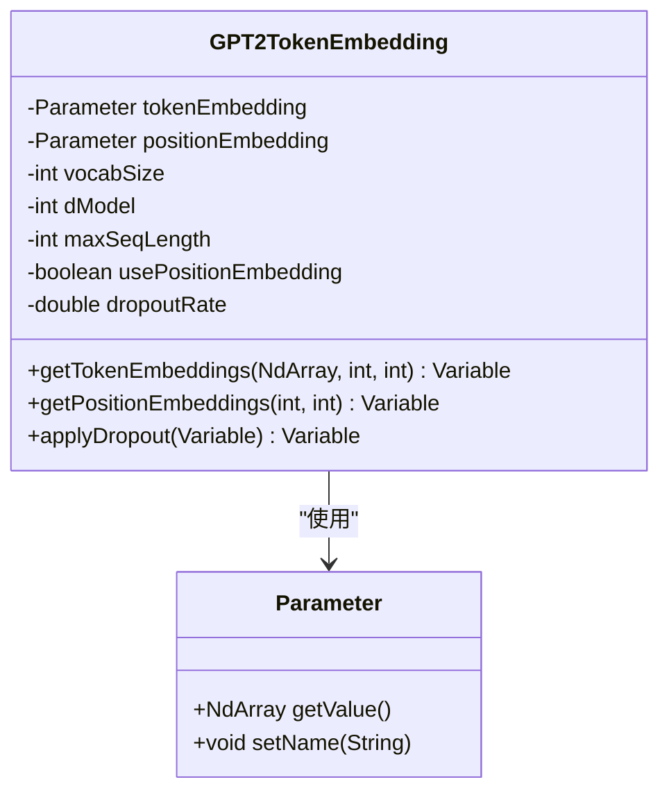

**图表来源**
- [GPT2TokenEmbedding.java](file://tinyai-model-gpt/src/main/java/io/leavesfly/tinyai/gpt/GPT2TokenEmbedding.java#L1-L233)

#### 嵌入机制

1. **Token嵌入**：将每个token ID映射到dModel维的向量
2. **位置嵌入**：为每个位置添加位置信息（可选）
3. **嵌入组合**：将token嵌入和位置嵌入相加
4. **Dropout应用**：在训练阶段应用dropout防止过拟合

### Transformer块

每个Transformer块包含以下组件：

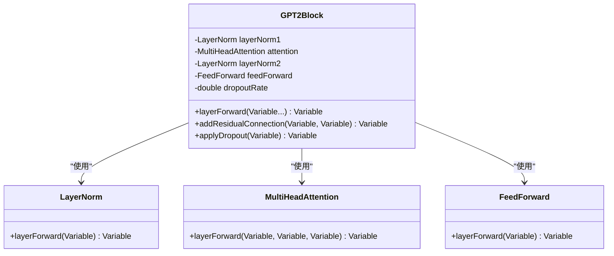

**图表来源**
- [GPT2Block.java](file://tinyai-model-gpt/src/main/java/io/leavesfly/tinyai/gpt/GPT2Block.java#L1-L165)

#### 前向传播流程

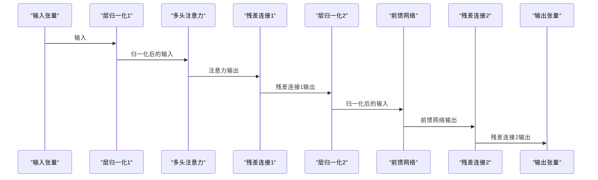

**图表来源**
- [GPT2Block.java](file://tinyai-model-gpt/src/main/java/io/leavesfly/tinyai/gpt/GPT2Block.java#L60-L80)

### 多头自注意力机制

GPT-2使用带掩码的多头自注意力机制，防止未来信息泄露：

- **查询 (Q)**、**键 (K)**、**值 (V)**：通过线性变换从输入生成
- **注意力权重**：计算为`softmax(QK^T/√d_k)`
- **掩码机制**：使用因果掩码确保只能看到当前位置之前的token
- **多头聚合**：将多个注意力头的输出拼接并通过线性变换

### 前馈网络

前馈网络采用两层线性变换结构：

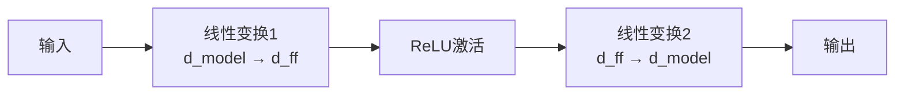

**图表来源**
- [GPT2Block.java](file://tinyai-model-gpt/src/main/java/io/leavesfly/tinyai/gpt/GPT2Block.java#L120-L140)

### 输出头

输出头将Transformer的隐藏状态映射到词汇表上的概率分布：

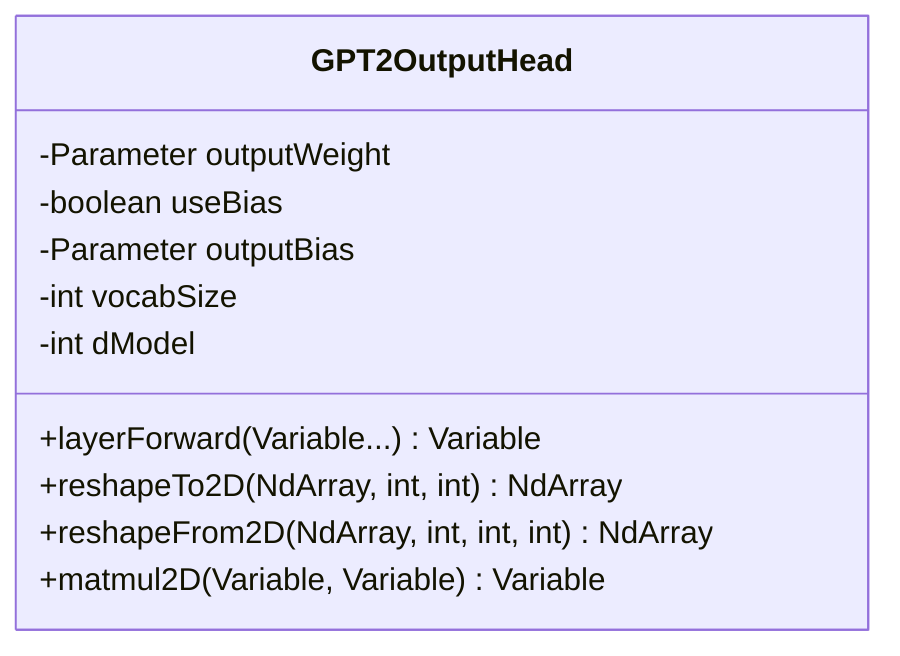

**图表来源**
- [GPT2OutputHead.java](file://tinyai-model-gpt/src/main/java/io/leavesfly/tinyai/gpt/GPT2OutputHead.java#L1-L169)

**章节来源**
- [GPT2Model.java](file://tinyai-model-gpt/src/main/java/io/leavesfly/tinyai/gpt/GPT2Model.java#L1-L403)
- [GPT2Block.java](file://tinyai-model-gpt/src/main/java/io/leavesfly/tinyai/gpt/GPT2Block.java#L1-L165)
- [GPT2TokenEmbedding.java](file://tinyai-model-gpt/src/main/java/io/leavesfly/tinyai/gpt/GPT2TokenEmbedding.java#L1-L233)
- [GPT2OutputHead.java](file://tinyai-model-gpt/src/main/java/io/leavesfly/tinyai/gpt/GPT2OutputHead.java#L1-L169)

## 训练流程

### 数据准备

训练流程从数据准备开始：

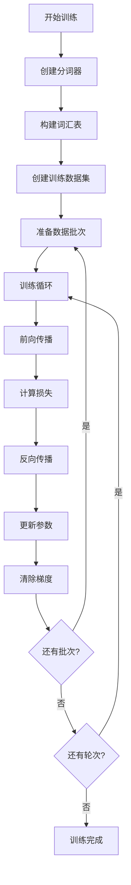

**图表来源**
- [GPT2Example.java](file://tinyai-model-gpt/src/main/java/io/leavesfly/tinyai/gpt/GPT2Example.java#L100-L200)

### 损失函数

使用交叉熵损失函数计算预测概率分布与真实标签之间的差异：

```java
// 损失计算示例
Variable predictions = model.forward(new Variable(batch.getX()[0]));
Variable targets = new Variable(batch.getY()[0]);
Variable loss = lossFunction.loss(predictions, targets);
```

### 优化器

使用Adam优化器进行参数更新：

- **学习率**：0.001
- **动量参数**：β₁=0.9, β₂=0.999
- **数值稳定常数**：ε=1e⁻⁸

### 训练监控

训练过程中会监控以下指标：

- **每批次损失**：实时跟踪模型学习进度
- **平均损失**：每轮次结束后计算
- **训练时间**：记录每个轮次的耗时

**章节来源**
- [GPT2Example.java](file://tinyai-model-gpt/src/main/java/io/leavesfly/tinyai/gpt/GPT2Example.java#L100-L200)

## 文本生成机制

### 自回归生成原理

GPT-2采用自回归方式生成文本，每次预测下一个token的概率分布：

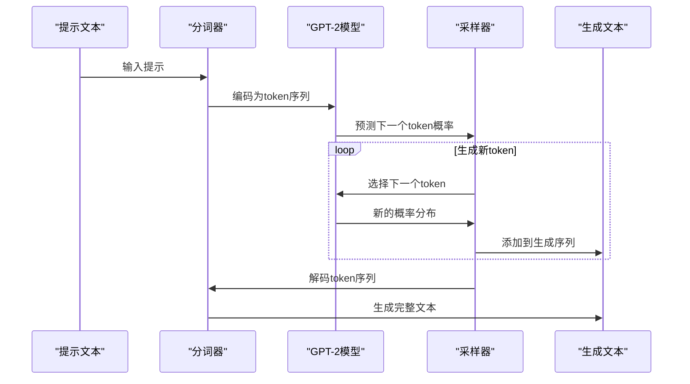

**图表来源**
- [GPT2Example.java](file://tinyai-model-gpt/src/main/java/io/leavesfly/tinyai/gpt/GPT2Example.java#L250-L307)

### 生成策略

#### 1. 贪婪搜索

每次选择概率最高的token：

```java
// 贪婪搜索实现
private NdArray applySoftmax(NdArray logits) {
    // 计算softmax概率分布
    // 选择概率最大的token
    int maxIndex = 0;
    float maxProb = probabilities.get(0);
    
    for (int i = 1; i < vocabSize; i++) {
        float prob = probabilities.get(i);
        if (prob > maxProb) {
            maxProb = prob;
            maxIndex = i;
        }
    }
    return maxIndex;
}
```

#### 2. Top-K采样

只考虑概率最高的K个候选token：

- **K值选择**：根据具体应用场景调整
- **概率重归一化**：只在Top-K候选中进行softmax
- **随机采样**：从Top-K候选中按概率采样

#### 3. Temperature控制

通过调节温度参数影响生成多样性：

- **低温度 (T < 1)**：生成更确定性的文本
- **高温度 (T > 1)**：生成更多样化的文本
- **公式**：`P'(token) = P(token)^1/T / Z`

### 序列长度处理

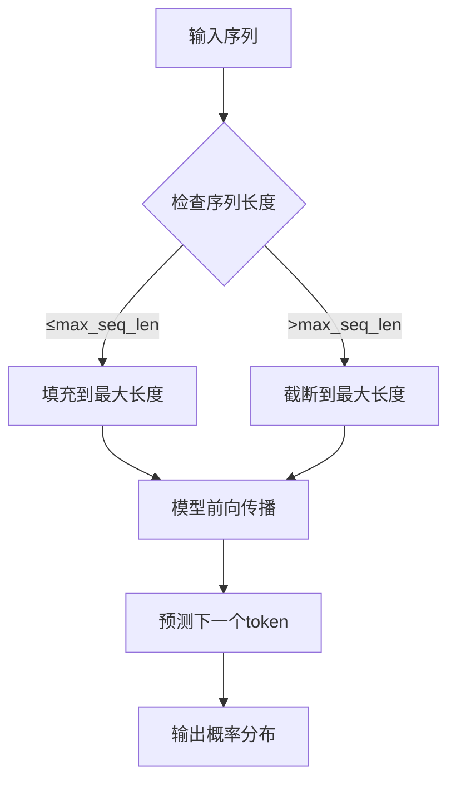

**图表来源**
- [GPT2Example.java](file://tinyai-model-gpt/src/main/java/io/leavesfly/tinyai/gpt/GPT2Example.java#L250-L307)

**章节来源**
- [GPT2Example.java](file://tinyai-model-gpt/src/main/java/io/leavesfly/tinyai/gpt/GPT2Example.java#L250-L307)
- [GPT2Model.java](file://tinyai-model-gpt/src/main/java/io/leavesfly/tinyai/gpt/GPT2Model.java#L300-L350)

## 分词器系统

### SimpleTokenizer实现

SimpleTokenizer提供基础的文本分词和编码功能：

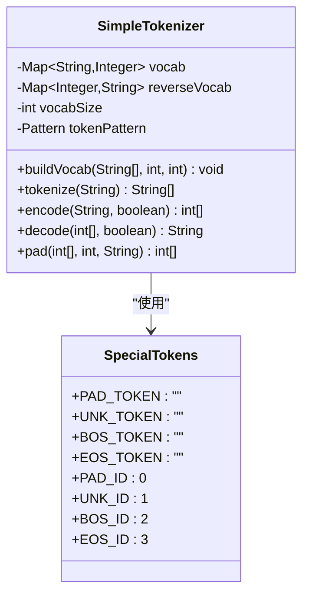

**图表来源**
- [SimpleTokenizer.java](file://tinyai-model-gpt/src/main/java/io/leavesfly/tinyai/gpt/SimpleTokenizer.java#L1-L366)

### 分词策略

#### 1. 正则表达式分词

使用预定义的正则表达式模式进行分词：

```java
this.tokenPattern = Pattern.compile("\\s+|(?=[.,!?;:])|(?<=[.,!?;:])");
```

- **空白字符**：按空格分割
- **标点符号前后**：在标点符号前后分割
- **大小写转换**：自动转换为小写

#### 2. 词汇表构建

- **最小词频**：过滤低频词
- **最大词汇表大小**：限制词汇表规模
- **特殊token优先**：保留特殊token在词汇表开头

#### 3. 编码解码

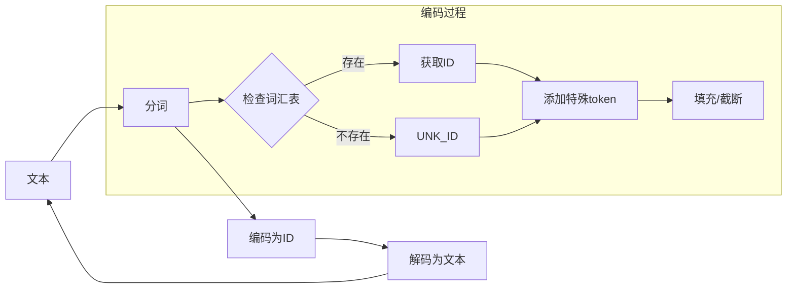

**图表来源**
- [SimpleTokenizer.java](file://tinyai-model-gpt/src/main/java/io/leavesfly/tinyai/gpt/SimpleTokenizer.java#L100-L200)

### 特殊token处理

- **PAD_TOKEN (<pad>)**：填充token，ID=0
- **UNK_TOKEN (<unk>)**：未知token，ID=1  
- **BOS_TOKEN (<bos>)**：序列开始，ID=2
- **EOS_TOKEN (<eos>)**：序列结束，ID=3

**章节来源**
- [SimpleTokenizer.java](file://tinyai-model-gpt/src/main/java/io/leavesfly/tinyai/gpt/SimpleTokenizer.java#L1-L366)

## 数据处理管道

### GPT2TextDataset设计

GPT2TextDataset专门设计用于GPT-2的自回归训练：

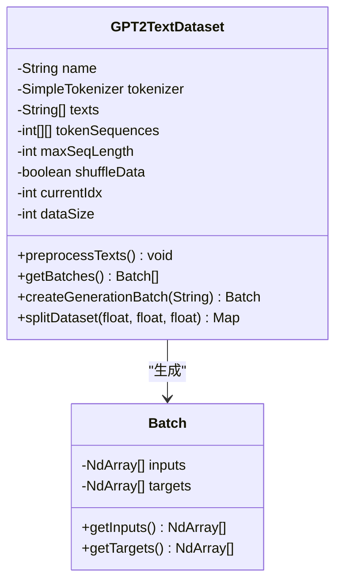

**图表来源**
- [GPT2TextDataset.java](file://tinyai-model-gpt/src/main/java/io/leavesfly/tinyai/gpt/GPT2TextDataset.java#L1-L233)

### 数据预处理流程

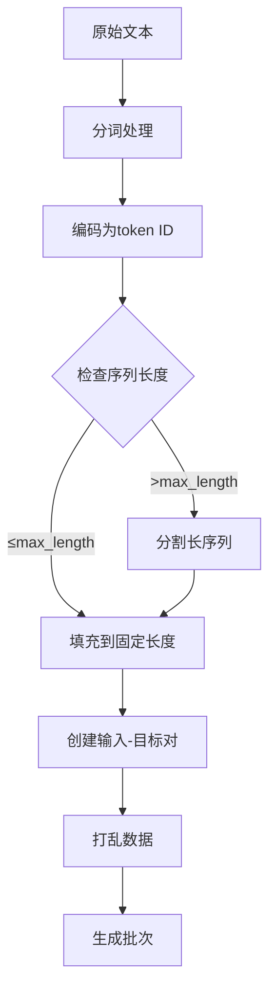

**图表来源**
- [GPT2TextDataset.java](file://tinyai-model-gpt/src/main/java/io/leavesfly/tinyai/gpt/GPT2TextDataset.java#L50-L100)

### 输入-目标对生成

对于自回归训练，每个样本包含：

- **输入序列 (X)**：t时刻的token
- **目标序列 (Y)**：t+1时刻的token

```java
// 输入-目标对生成逻辑
for (int j = 0; j < maxSeqLength; j++) {
    if (j < maxSeqLength - 1) {
        inputSequences.set(sequence[j], i, j);
        targetSequences.set(sequence[j + 1], i, j);
    } else {
        inputSequences.set(sequence[j], i, j);
        targetSequences.set(sequence[j], i, j);
    }
}
```

### 批处理机制

- **批次大小**：可配置的批次大小
- **动态批次**：支持不同长度的序列
- **内存优化**：使用稀疏表示减少内存占用

**章节来源**
- [GPT2TextDataset.java](file://tinyai-model-gpt/src/main/java/io/leavesfly/tinyai/gpt/GPT2TextDataset.java#L1-L233)

## 性能优化

### 内存优化策略

#### 1. 梯度检查点

在大型模型中使用梯度检查点技术：

- **内存节省**：将前向传播的中间结果存储改为重新计算
- **适用场景**：内存受限的训练环境
- **权衡**：增加计算开销但显著减少内存使用

#### 2. 混合精度训练

- **FP16/BF16**：使用半精度浮点数减少内存占用
- **梯度缩放**：防止梯度下溢
- **自动混合精度**：自动选择最优精度

#### 3. 序列长度优化

```java
// 动态序列长度处理
int[] inputTokens = new int[Math.min(generatedTokens.size(), gpt2Model.getMaxSeqLength())];
int startIdx = Math.max(0, generatedTokens.size() - gpt2Model.getMaxSeqLength());

for (int j = 0; j < inputTokens.length; j++) {
    inputTokens[j] = generatedTokens.get(startIdx + j);
}
```

### 推理优化

#### 1. KV缓存

在生成过程中缓存键值对以加速推理：

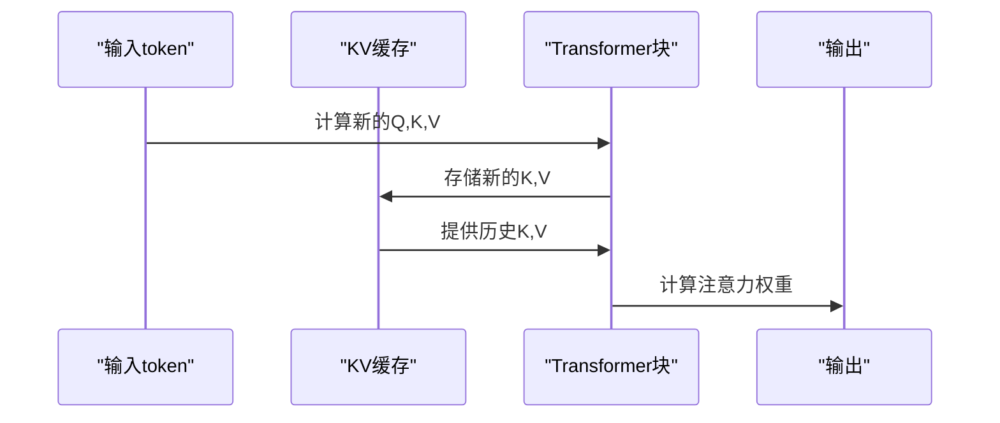

#### 2. 并行生成

- **批处理生成**：同时生成多个序列
- **流水线并行**：不同序列在不同阶段并行处理
- **GPU利用**：充分利用GPU计算能力

#### 3. 量化技术

- **INT8量化**：减少模型大小和推理时间
- **动态量化**：运行时动态选择量化级别
- **感知量化**：保持模型精度的量化方法

### 计算复杂度分析

#### 1. 模型参数量

GPT-2模型的参数量计算：

```java
// 参数统计示例
long tokenEmbedParams = (long) vocabSize * dModel;  // 词嵌入
long posEmbedParams = (long) maxSeqLength * dModel;  // 位置嵌入
long attnParams = (long) dModel * dModel * 4;  // Q,K,V,O矩阵
long ffnParams = (long) dModel * dFF * 2;      // 前馈网络
```

#### 2. 计算复杂度

- **前向传播**：O(n×d²)，其中n为序列长度，d为模型维度
- **注意力计算**：O(n²×d)，主要瓶颈
- **前馈网络**：O(n×d×d_ff)

#### 3. 内存复杂度

- **激活内存**：O(batch_size × n × d)
- **梯度内存**：与参数内存相同
- **优化器状态**：通常为参数内存的2-4倍

## 故障排除指南

### 常见问题及解决方案

#### 1. 内存不足错误

**症状**：OutOfMemoryError或CUDA out of memory

**解决方案**：
- 减少批次大小
- 使用梯度累积
- 启用梯度检查点
- 使用混合精度训练

#### 2. 梯度爆炸

**症状**：损失值突然变为NaN或无穷大

**解决方案**：
- 调整学习率
- 使用梯度裁剪
- 检查数据预处理
- 验证模型初始化

#### 3. 训练不收敛

**症状**：损失值不下降或波动很大

**解决方案**：
- 检查学习率设置
- 验证数据质量
- 调整模型架构
- 增加正则化

#### 4. 生成质量问题

**症状**：生成文本重复或无意义

**解决方案**：
- 调整temperature参数
- 修改top-k采样参数
- 增加训练数据量
- 微调模型参数

### 调试工具

#### 1. 模型可视化

```java
// 模型组件验证
public void printModelInfo() {
    System.out.println("Token Embedding: " + formatNumber(tokenEmbedParams));
    System.out.println("Transformer Blocks: " + formatNumber(transformerParams));
    System.out.println("Total Parameters: " + formatNumber(totalParams));
}
```

#### 2. 损失监控

```java
// 实时损失监控
if (batchCount % 2 == 0) {
    System.out.println("  Batch " + batchCount + ", Loss: " + 
                      String.format("%.4f", lossValue));
}
```

#### 3. 性能分析

```java
// 推理时间测量
long startTime = System.currentTimeMillis();
Variable output = smallModel.layerForward(inputVar);
long endTime = System.currentTimeMillis();
System.out.printf("Forward pass took %d ms%n", endTime - startTime);
```

**章节来源**
- [GPT2ModelDemo.java](file://tinyai-model-gpt/src/main/java/io/leavesfly/tinyai/gpt/GPT2ModelDemo.java#L1-L139)
- [GPT2ModelTest.java](file://tinyai-model-gpt/src/test/java/io/leavesfly/tinyai/gpt/GPT2ModelTest.java#L1-L252)

## 总结

GPT-2语言模型实现展示了现代深度学习框架中Transformer架构的完整实现。通过分析源代码，我们可以看到：

### 技术亮点

1. **模块化设计**：清晰的组件分离，便于维护和扩展
2. **灵活配置**：支持多种模型规模和配置选项
3. **完整生态**：从数据处理到模型训练再到文本生成的完整流程
4. **性能优化**：内置多种优化技术和调试工具

### 应用场景

- **文本生成**：创意写作、对话系统、内容创作
- **语言理解**：文本分类、情感分析、问答系统
- **代码生成**：编程助手、代码补全、自动化开发
- **多语言处理**：跨语言翻译、本地化服务

### 发展方向

1. **模型压缩**：进一步减少模型大小和推理成本
2. **多模态融合**：结合视觉和其他模态信息
3. **领域适配**：针对特定领域的微调和优化
4. **实时推理**：提升生成速度和交互体验

这个实现为理解和使用GPT-2模型提供了宝贵的参考，同时也为进一步的研究和应用奠定了坚实的基础。