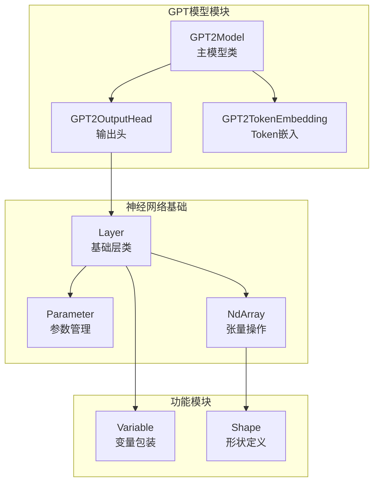
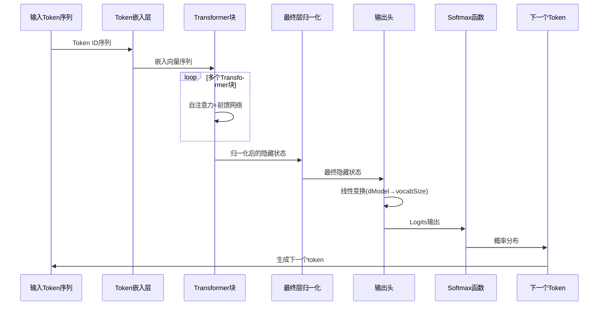
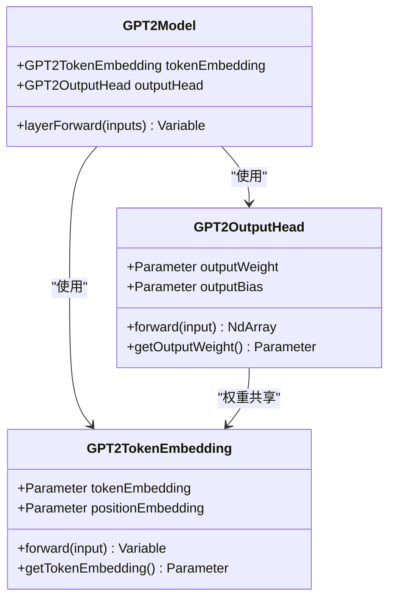
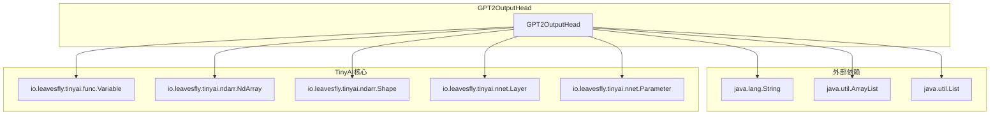

# 输出头与词汇表预测

<cite>
**本文档引用的文件**
- [GPT2OutputHead.java](file://tinyai-model-gpt/src/main/java/io/leavesfly/tinyai/gpt/GPT2OutputHead.java)
- [GPT2Model.java](file://tinyai-model-gpt/src/main/java/io/leavesfly/tinyai/gpt/GPT2Model.java)
- [GPT2TokenEmbedding.java](file://tinyai-model-gpt/src/main/java/io/leavesfly/tinyai/gpt/GPT2TokenEmbedding.java)
- [GPT2OutputHeadTest.java](file://tinyai-dl-nnet/src/test/java/io/leavesfly/tinyai/nnet/layer/transformer/GPT2OutputHeadTest.java)
- [GPT2ModelTest.java](file://tinyai-model-gpt/src/test/java/io/leavesfly/tinyai/gpt/GPT2ModelTest.java)
</cite>

## 目录
1. [简介](#简介)
2. [项目结构概览](#项目结构概览)
3. [核心组件分析](#核心组件分析)
4. [架构概览](#架构概览)
5. [详细组件分析](#详细组件分析)
6. [依赖关系分析](#依赖关系分析)
7. [性能考虑](#性能考虑)
8. [故障排除指南](#故障排除指南)
9. [结论](#结论)

## 简介

GPT2OutputHead类是TinyAI框架中GPT-2语言模型的最终分类头组件，负责将Transformer解码器输出的上下文向量映射回词汇表空间。作为整个模型的最后一层，它执行关键的线性变换操作，将隐藏状态转换为词汇表上每个单词的概率分布。

该组件采用标准的线性变换机制，通过输出权重矩阵将模型维度（dModel）映射到词汇表大小（vocabSize）。这种设计遵循了现代语言模型的标准架构模式，确保了模型能够准确预测下一个最可能出现的token。

## 项目结构概览

GPT2OutputHead类位于`tinyai-model-gpt`模块中，与其他GPT相关组件协同工作：



**图表来源**
- [GPT2Model.java](file://tinyai-model-gpt/src/main/java/io/leavesfly/tinyai/gpt/GPT2Model.java#L1-L50)
- [GPT2OutputHead.java](file://tinyai-model-gpt/src/main/java/io/leavesfly/tinyai/gpt/GPT2OutputHead.java#L1-L30)

**章节来源**
- [GPT2Model.java](file://tinyai-model-gpt/src/main/java/io/leavesfly/tinyai/gpt/GPT2Model.java#L1-L100)
- [GPT2OutputHead.java](file://tinyai-model-gpt/src/main/java/io/leavesfly/tinyai/gpt/GPT2OutputHead.java#L1-L50)

## 核心组件分析

### GPT2OutputHead类结构

GPT2OutputHead继承自Layer基类，实现了Transformer输出到词汇表概率分布的映射功能：

```java
public class GPT2OutputHead extends Layer {
    private Parameter outputWeight;  // 输出权重矩阵
    private boolean useBias;         // 是否使用偏置
    private Parameter outputBias;    // 输出偏置
    private int vocabSize;           // 词汇表大小
    private int dModel;              // 模型维度
}
```

该类的核心职责包括：
- **参数初始化**：创建并初始化输出权重矩阵
- **前向传播**：执行线性变换和维度重塑
- **权重共享**：支持与Token嵌入层的权重共享
- **概率计算**：生成词汇表上的logits输出

**章节来源**
- [GPT2OutputHead.java](file://tinyai-model-gpt/src/main/java/io/leavesfly/tinyai/gpt/GPT2OutputHead.java#L15-L30)

## 架构概览

GPT2OutputHead在整个GPT-2模型架构中扮演着最终决策者的角色：



**图表来源**
- [GPT2Model.java](file://tinyai-model-gpt/src/main/java/io/leavesfly/tinyai/gpt/GPT2Model.java#L140-L180)
- [GPT2OutputHead.java](file://tinyai-model-gpt/src/main/java/io/leavesfly/tinyai/gpt/GPT2OutputHead.java#L60-L90)

## 详细组件分析

### 参数初始化机制

GPT2OutputHead采用精心设计的参数初始化策略：

```mermaid
flowchart TD
Start([构造函数调用]) --> InitCheck{已经初始化?}
InitCheck --> |否| WeightInit[初始化输出权重<br/>Shape: (dModel, vocabSize)<br/>Scale: 0.02]
InitCheck --> |是| BiasCheck{使用偏置?}
WeightInit --> BiasCheck
BiasCheck --> |是| BiasInit[初始化输出偏置<br/>Shape: (vocabSize)]
BiasCheck --> |否| Complete[初始化完成]
BiasInit --> Complete
Complete --> End([参数就绪])
```

**图表来源**
- [GPT2OutputHead.java](file://tinyai-model-gpt/src/main/java/io/leavesfly/tinyai/gpt/GPT2OutputHead.java#L40-L55)

#### 权重初始化细节

输出权重矩阵的初始化遵循以下原则：

1. **维度设置**：权重矩阵形状为`(dModel, vocabSize)`，其中dModel是模型的隐藏维度，vocabSize是词汇表大小
2. **初始化策略**：使用标准差为0.02的正态分布随机初始化
3. **缩放因子**：通过乘以0.02控制初始权重的大小
4. **命名规范**：参数名称格式为`"{layerName}_weight"`

```java
// 初始化输出权重矩阵 (dModel, vocabSize)
outputWeight = new Parameter(NdArray.likeRandomN(Shape.of(dModel, vocabSize)).mulNum(0.02f));
outputWeight.setName(name + "_weight");
addParam(outputWeight.getName(), outputWeight);
```

**章节来源**
- [GPT2OutputHead.java](file://tinyai-model-gpt/src/main/java/io/leavesfly/tinyai/gpt/GPT2OutputHead.java#L40-L55)

### 前向传播计算流程

GPT2OutputHead的前向传播过程包含三个关键步骤：

```mermaid
flowchart TD
Input[输入张量<br/>Shape: (batch_size, seq_len, dModel)] --> Reshape[重塑为二维<br/>Shape: (batch_size*seq_len, dModel)]
Reshape --> MatMul[矩阵乘法<br/>input @ weight]
MatMul --> BiasAdd{使用偏置?}
BiasAdd --> |是| AddBias[添加偏置<br/>output + bias]
BiasAdd --> |否| NoBias[无偏置处理]
AddBias --> ReshapeBack[重塑回三维<br/>Shape: (batch_size, seq_len, vocab_size)]
NoBias --> ReshapeBack
ReshapeBack --> Output[输出logits<br/>Shape: (batch_size, seq_len, vocab_size)]
```

**图表来源**
- [GPT2OutputHead.java](file://tinyai-model-gpt/src/main/java/io/leavesfly/tinyai/gpt/GPT2OutputHead.java#L60-L90)

#### 三维到二维重塑过程

为了高效执行矩阵乘法，GPT2OutputHead将输入张量从三维重塑为二维：

```java
private NdArray reshapeTo2D(NdArray input, int batchSize, int seqLen) {
    // (batch_size, seq_len, dModel) -> (batch_size * seq_len, dModel)
    return input.reshape(Shape.of(batchSize * seqLen, dModel));
}
```

这种重塑策略的优势：
- **内存效率**：减少中间变量的内存占用
- **计算优化**：利用高效的矩阵运算库
- **批处理支持**：同时处理多个序列位置

#### 线性变换核心逻辑

线性变换是输出头的核心计算：

```java
// 执行线性变换: input @ weight
Variable output = matmul2D(new Variable(inputReshaped), outputWeight);

// 添加偏置（如果有）
if (useBias) {
    output = output.add(outputBias);
}
```

该过程的特点：
- **矩阵乘法**：执行输入特征与权重矩阵的乘积
- **偏置添加**：可选的偏置项增加模型表达能力
- **自动梯度**：支持反向传播和参数更新

**章节来源**
- [GPT2OutputHead.java](file://tinyai-model-gpt/src/main/java/io/leavesfly/tinyai/gpt/GPT2OutputHead.java#L60-L90)

### 权重共享设计考量

GPT2OutputHead支持与Token嵌入层的权重共享，这是现代语言模型的重要优化技术：



**图表来源**
- [GPT2TokenEmbedding.java](file://tinyai-model-gpt/src/main/java/io/leavesfly/tinyai/gpt/GPT2TokenEmbedding.java#L20-L40)
- [GPT2OutputHead.java](file://tinyai-model-gpt/src/main/java/io/leavesfly/tinyai/gpt/GPT2OutputHead.java#L15-L30)

#### 权重共享的优势

1. **参数效率**：减少模型参数数量，降低内存占用
2. **语义一致性**：确保嵌入空间和输出空间的语义对齐
3. **训练稳定**：通过权重约束提高训练稳定性
4. **推理加速**：减少计算开销，提升推理速度

**章节来源**
- [GPT2TokenEmbedding.java](file://tinyai-model-gpt/src/main/java/io/leavesfly/tinyai/gpt/GPT2TokenEmbedding.java#L40-L60)

### 词汇表预测机制

GPT2Model中的predictNextToken方法展示了如何从输出logits生成最终的token ID：

```mermaid
flowchart TD
Input[输入序列] --> Forward[前向传播<br/>获得logits]
Forward --> Extract[提取最后一个位置的logits<br/>Shape: (vocab_size,)]
Extract --> Softmax[应用Softmax函数<br/>获得概率分布]
Softmax --> Greedy[贪婪搜索<br/>选择最高概率token]
Greedy --> TokenID[返回token ID]
subgraph "Softmax实现"
MaxFind[找到最大值<br/>数值稳定性]
ExpCalc[计算指数<br/>exp(x - max)]
Normalize[归一化<br/>sum=1]
end
Softmax --> MaxFind --> ExpCalc --> Normalize
```

**图表来源**
- [GPT2Model.java](file://tinyai-model-gpt/src/main/java/io/leavesfly/tinyai/gpt/GPT2Model.java#L300-L350)

#### 概率计算实现

predictNextToken方法的核心逻辑：

```java
// 使用softmax获取概率分布
NdArray probabilities = applySoftmax(lastLogits);

// 使用贪婪搜索选择最高概率的token
int maxIndex = 0;
float maxProb = probabilities.get(0);

for (int i = 1; i < vocabSize; i++) {
    float prob = probabilities.get(i);
    if (prob > maxProb) {
        maxProb = prob;
        maxIndex = i;
    }
}
```

该实现的特点：
- **数值稳定性**：通过减去最大值避免指数爆炸
- **贪婪策略**：直接选择概率最高的token
- **错误处理**：提供fallback机制处理异常情况

**章节来源**
- [GPT2Model.java](file://tinyai-model-gpt/src/main/java/io/leavesfly/tinyai/gpt/GPT2Model.java#L300-L350)

## 依赖关系分析

GPT2OutputHead的依赖关系体现了清晰的层次结构：



**图表来源**
- [GPT2OutputHead.java](file://tinyai-model-gpt/src/main/java/io/leavesfly/tinyai/gpt/GPT2OutputHead.java#L1-L15)

**章节来源**
- [GPT2OutputHead.java](file://tinyai-model-gpt/src/main/java/io/leavesfly/tinyai/gpt/GPT2OutputHead.java#L1-L15)

## 性能考虑

### 内存优化策略

1. **批处理支持**：通过reshape操作支持批量处理，提高GPU利用率
2. **参数共享**：与Token嵌入层共享权重，减少内存占用
3. **数值稳定性**：在Softmax计算中使用最大值减法避免溢出

### 计算效率优化

1. **矩阵乘法**：利用高度优化的BLAS库进行线性变换
2. **维度重塑**：最小化内存拷贝操作
3. **梯度计算**：支持高效的反向传播

### 推理性能

1. **权重共享**：减少参数数量，提升推理速度
2. **数值精度**：使用float32保证计算精度
3. **错误恢复**：完善的异常处理机制

## 故障排除指南

### 常见问题及解决方案

#### 1. 内存不足错误

**症状**：运行时抛出OutOfMemoryError
**原因**：批处理大小过大或词汇表过大
**解决方案**：
- 减少batch_size参数
- 使用更小的词汇表
- 启用梯度检查点

#### 2. 数值不稳定

**症状**：输出logits包含NaN或无穷大值
**原因**：权重初始化不当或学习率过高
**解决方案**：
- 检查权重初始化参数
- 降低学习率
- 添加梯度裁剪

#### 3. 性能瓶颈

**症状**：推理速度过慢
**原因**：未充分利用硬件加速
**解决方案**：
- 确保CUDA可用
- 使用混合精度训练
- 优化批处理大小

**章节来源**
- [GPT2ModelTest.java](file://tinyai-model-gpt/src/test/java/io/leavesfly/tinyai/gpt/GPT2ModelTest.java#L200-L250)

## 结论

GPT2OutputHead作为GPT-2模型的关键组件，通过精心设计的线性变换机制实现了从隐藏状态到词汇表概率分布的有效映射。其主要优势包括：

1. **简洁高效**：采用标准的线性变换架构，计算效率高
2. **灵活配置**：支持偏置使用和权重共享等多种配置选项
3. **数值稳定**：内置多种数值稳定性保护机制
4. **易于扩展**：清晰的接口设计便于功能扩展

该组件的设计充分体现了现代深度学习框架的最佳实践，为构建高质量的语言模型提供了坚实的基础。通过合理的参数初始化、高效的计算流程和完善的错误处理，GPT2OutputHead确保了模型训练和推理的稳定性和可靠性。