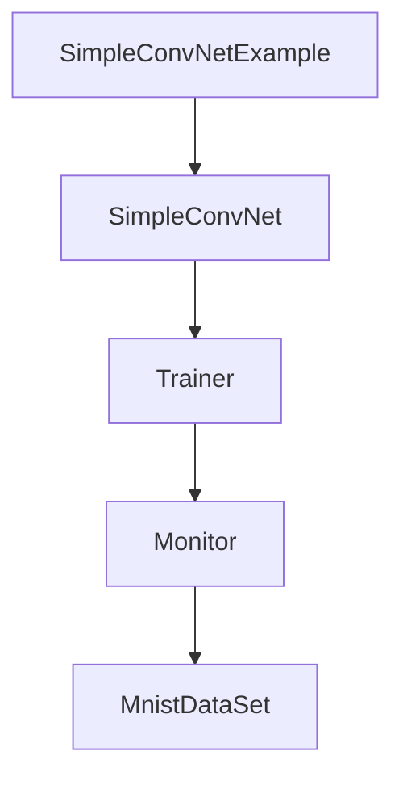
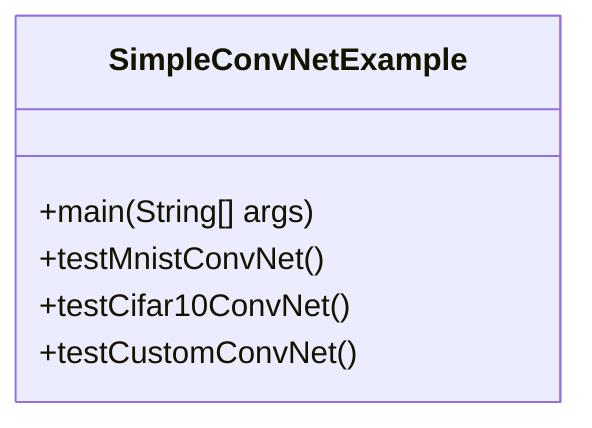
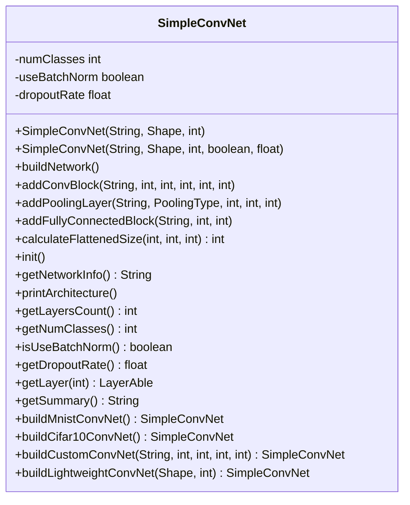
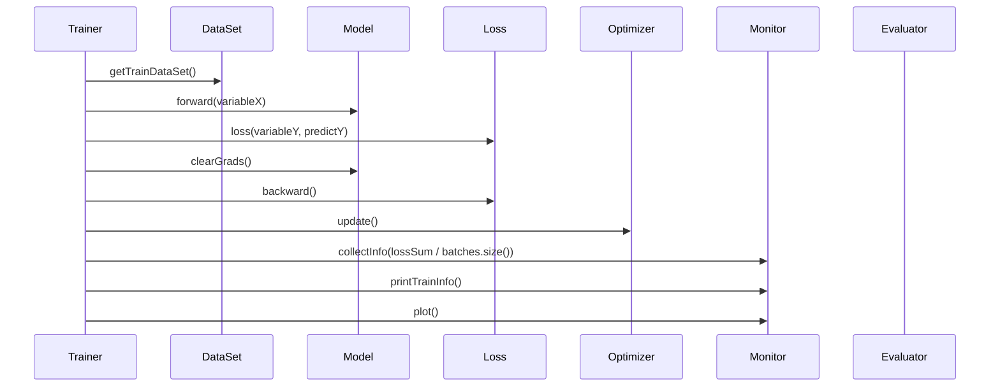
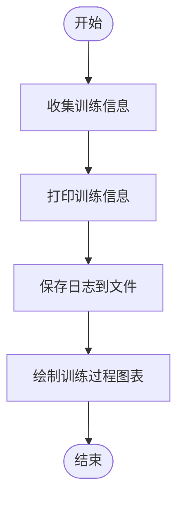
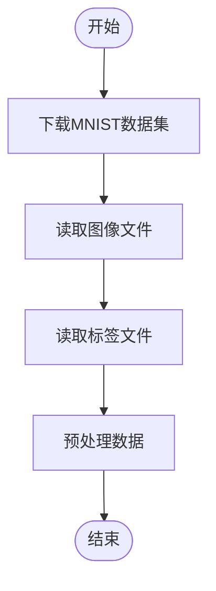

# 计算机视觉示例

<cite>
**本文档中引用的文件**   
- [SimpleConvNetExample.java](file://tinyai-dl-case/src/main/java/io/leavesfly/tinyai/example/cv/SimpleConvNetExample.java)
- [SimpleConvNet.java](file://tinyai-dl-cv/src/main/java/io/leavesfly/tinyai/cv/SimpleConvNet.java)
- [Trainer.java](file://tinyai-dl-ml/src/main/java/io/leavesfly/tinyai/ml/Trainer.java)
- [Monitor.java](file://tinyai-dl-ml/src/main/java/io/leavesfly/tinyai/ml/Monitor.java)
- [MnistDataSet.java](file://tinyai-dl-ml/src/main/java/io/leavesfly/tinyai/ml/dataset/simple/MnistDataSet.java)
- [SoftmaxCrossEntropy.java](file://tinyai-dl-ml/src/main/java/io/leavesfly/tinyai/ml/loss/SoftmaxCrossEntropy.java)
- [AccuracyEval.java](file://tinyai-dl-ml/src/main/java/io/leavesfly/tinyai/ml/evaluator/AccuracyEval.java)
- [Dropout.java](file://tinyai-dl-nnet/src/main/java/io/leavesfly/tinyai/nnet/layer/norm/Dropout.java)
- [BatchNorm.java](file://tinyai-dl-nnet/src/main/java/io/leavesfly/tinyai/nnet/layer/norm/BatchNorm.java)
</cite>

## 目录
1. [简介](#简介)
2. [项目结构](#项目结构)
3. [核心组件](#核心组件)
4. [架构概述](#架构概述)
5. [详细组件分析](#详细组件分析)
6. [依赖分析](#依赖分析)
7. [性能考虑](#性能考虑)
8. [故障排除指南](#故障排除指南)
9. [结论](#结论)

## 简介
本文档详细解析了`SimpleConvNetExample.java`中卷积神经网络的实现，涵盖了MNIST数据集的加载、预处理、模型构建（包括卷积层、池化层和全连接层的配置）、训练循环设计、损失函数选择（交叉熵）以及评估指标（准确率）的计算。同时说明了如何通过`Trainer`类执行训练过程，并使用`Monitor`类可视化训练进度。文档还提供了代码片段展示关键步骤，解释每层输出的维度变化，并指出了常见问题如过拟合的应对策略。

## 项目结构
`SimpleConvNetExample.java`位于`tinyai-dl-case/src/main/java/io/leavesfly/tinyai/example/cv`目录下，是卷积神经网络的示例实现。该文件通过调用`SimpleConvNet`类来构建和测试不同配置的卷积网络。`SimpleConvNet`类位于`tinyai-dl-cv`模块中，实现了增强的深度卷积神经网络，包含多个卷积层、池化层、全连接层和正则化层的深度架构。训练过程由`Trainer`类管理，训练进度通过`Monitor`类进行可视化。MNIST数据集的加载和预处理由`MnistDataSet`类负责。

**文档来源**
- [SimpleConvNetExample.java](file://tinyai-dl-case/src/main/java/io/leavesfly/tinyai/example/cv/SimpleConvNetExample.java)
- [SimpleConvNet.java](file://tinyai-dl-cv/src/main/java/io/leavesfly/tinyai/cv/SimpleConvNet.java)
- [Trainer.java](file://tinyai-dl-ml/src/main/java/io/leavesfly/tinyai/ml/Trainer.java)
- [Monitor.java](file://tinyai-dl-ml/src/main/java/io/leavesfly/tinyai/ml/Monitor.java)
- [MnistDataSet.java](file://tinyai-dl-ml/src/main/java/io/leavesfly/tinyai/ml/dataset/simple/MnistDataSet.java)

## 核心组件
`SimpleConvNetExample.java`是卷积神经网络的示例实现，通过调用`SimpleConvNet`类来构建和测试不同配置的卷积网络。`SimpleConvNet`类实现了增强的深度卷积神经网络，包含多个卷积层、池化层、全连接层和正则化层的深度架构。训练过程由`Trainer`类管理，训练进度通过`Monitor`类进行可视化。MNIST数据集的加载和预处理由`MnistDataSet`类负责。

**文档来源**
- [SimpleConvNetExample.java](file://tinyai-dl-case/src/main/java/io/leavesfly/tinyai/example/cv/SimpleConvNetExample.java)
- [SimpleConvNet.java](file://tinyai-dl-cv/src/main/java/io/leavesfly/tinyai/cv/SimpleConvNet.java)
- [Trainer.java](file://tinyai-dl-ml/src/main/java/io/leavesfly/tinyai/ml/Trainer.java)
- [Monitor.java](file://tinyai-dl-ml/src/main/java/io/leavesfly/tinyai/ml/Monitor.java)
- [MnistDataSet.java](file://tinyai-dl-ml/src/main/java/io/leavesfly/tinyai/ml/dataset/simple/MnistDataSet.java)

## 架构概述
`SimpleConvNetExample.java`通过调用`SimpleConvNet`类来构建和测试不同配置的卷积网络。`SimpleConvNet`类实现了增强的深度卷积神经网络，包含多个卷积层、池化层、全连接层和正则化层的深度架构。训练过程由`Trainer`类管理，训练进度通过`Monitor`类进行可视化。MNIST数据集的加载和预处理由`MnistDataSet`类负责。

**图表来源**
- [SimpleConvNetExample.java](file://tinyai-dl-case/src/main/java/io/leavesfly/tinyai/example/cv/SimpleConvNetExample.java)
- [SimpleConvNet.java](file://tinyai-dl-cv/src/main/java/io/leavesfly/tinyai/cv/SimpleConvNet.java)
- [Trainer.java](file://tinyai-dl-ml/src/main/java/io/leavesfly/tinyai/ml/Trainer.java)
- [Monitor.java](file://tinyai-dl-ml/src/main/java/io/leavesfly/tinyai/ml/Monitor.java)
- [MnistDataSet.java](file://tinyai-dl-ml/src/main/java/io/leavesfly/tinyai/ml/dataset/simple/MnistDataSet.java)

## 详细组件分析
### SimpleConvNetExample分析
`SimpleConvNetExample.java`是卷积神经网络的示例实现，通过调用`SimpleConvNet`类来构建和测试不同配置的卷积网络。该文件包含三个测试方法：`testMnistConvNet`、`testCifar10ConvNet`和`testCustomConvNet`，分别用于测试MNIST、CIFAR-10和自定义卷积网络。

#### 对象导向组件

**图表来源**
- [SimpleConvNetExample.java](file://tinyai-dl-case/src/main/java/io/leavesfly/tinyai/example/cv/SimpleConvNetExample.java)

**章节来源**
- [SimpleConvNetExample.java](file://tinyai-dl-case/src/main/java/io/leavesfly/tinyai/example/cv/SimpleConvNetExample.java)

### SimpleConvNet分析
`SimpleConvNet.java`实现了增强的深度卷积神经网络，包含多个卷积层、池化层、全连接层和正则化层的深度架构。该类支持批量归一化、残差连接和灵活配置，适用于图像分类等计算机视觉任务。

#### 对象导向组件

**图表来源**
- [SimpleConvNet.java](file://tinyai-dl-cv/src/main/java/io/leavesfly/tinyai/cv/SimpleConvNet.java)

**章节来源**
- [SimpleConvNet.java](file://tinyai-dl-cv/src/main/java/io/leavesfly/tinyai/cv/SimpleConvNet.java)

### Trainer分析
`Trainer.java`是TinyDL框架中模型训练的核心组件，提供了完整的训练流程管理功能，支持单线程和并行训练两种模式。该类负责控制训练的轮次、批次处理、训练监控、模型评估等。

#### API/服务组件

**图表来源**
- [Trainer.java](file://tinyai-dl-ml/src/main/java/io/leavesfly/tinyai/ml/Trainer.java)

**章节来源**
- [Trainer.java](file://tinyai-dl-ml/src/main/java/io/leavesfly/tinyai/ml/Trainer.java)

### Monitor分析
`Monitor.java`用于收集和可视化模型训练过程中的信息，包括训练损失值、验证集损失值、训练准确率、验证集准确率、训练时间等。该类还支持训练日志的保存。

#### 复杂逻辑组件

**图表来源**
- [Monitor.java](file://tinyai-dl-ml/src/main/java/io/leavesfly/tinyai/ml/Monitor.java)

**章节来源**
- [Monitor.java](file://tinyai-dl-ml/src/main/java/io/leavesfly/tinyai/ml/Monitor.java)

### MnistDataSet分析
`MnistDataSet.java`负责MNIST数据集的加载和预处理。该类提供了下载MNIST数据集、读取图像文件和标签文件、预处理数据等功能。

#### 复杂逻辑组件

**图表来源**
- [MnistDataSet.java](file://tinyai-dl-ml/src/main/java/io/leavesfly/tinyai/ml/dataset/simple/MnistDataSet.java)

**章节来源**
- [MnistDataSet.java](file://tinyai-dl-ml/src/main/java/io/leavesfly/tinyai/ml/dataset/simple/MnistDataSet.java)

## 依赖分析
`SimpleConvNetExample.java`依赖于`SimpleConvNet`类来构建和测试卷积网络，依赖于`Trainer`类来管理训练过程，依赖于`Monitor`类来可视化训练进度，依赖于`MnistDataSet`类来加载和预处理MNIST数据集。

**图表来源**
- [SimpleConvNetExample.java](file://tinyai-dl-case/src/main/java/io/leavesfly/tinyai/example/cv/SimpleConvNetExample.java)
- [SimpleConvNet.java](file://tinyai-dl-cv/src/main/java/io/leavesfly/tinyai/cv/SimpleConvNet.java)
- [Trainer.java](file://tinyai-dl-ml/src/main/java/io/leavesfly/tinyai/ml/Trainer.java)
- [Monitor.java](file://tinyai-dl-ml/src/main/java/io/leavesfly/tinyai/ml/Monitor.java)
- [MnistDataSet.java](file://tinyai-dl-ml/src/main/java/io/leavesfly/tinyai/ml/dataset/simple/MnistDataSet.java)

**章节来源**
- [SimpleConvNetExample.java](file://tinyai-dl-case/src/main/java/io/leavesfly/tinyai/example/cv/SimpleConvNetExample.java)
- [SimpleConvNet.java](file://tinyai-dl-cv/src/main/java/io/leavesfly/tinyai/cv/SimpleConvNet.java)
- [Trainer.java](file://tinyai-dl-ml/src/main/java/io/leavesfly/tinyai/ml/Trainer.java)
- [Monitor.java](file://tinyai-dl-ml/src/main/java/io/leavesfly/tinyai/ml/Monitor.java)
- [MnistDataSet.java](file://tinyai-dl-ml/src/main/java/io/leavesfly/tinyai/ml/dataset/simple/MnistDataSet.java)

## 性能考虑
`Trainer`类支持单线程和并行训练两种模式，可以根据实际需求选择合适的训练模式。并行训练模式可以显著提高训练速度，但需要更多的计算资源。

## 故障排除指南
在使用`SimpleConvNetExample.java`时，可能会遇到以下问题：
1. **数据集加载失败**：确保网络连接正常，能够访问MNIST数据集的下载地址。
2. **训练过程缓慢**：可以尝试使用并行训练模式，或者调整学习率等超参数。
3. **过拟合**：可以通过增加Dropout层、使用批量归一化、增加数据集等方式来缓解过拟合问题。

**章节来源**
- [SimpleConvNetExample.java](file://tinyai-dl-case/src/main/java/io/leavesfly/tinyai/example/cv/SimpleConvNetExample.java)
- [SimpleConvNet.java](file://tinyai-dl-cv/src/main/java/io/leavesfly/tinyai/cv/SimpleConvNet.java)
- [Trainer.java](file://tinyai-dl-ml/src/main/java/io/leavesfly/tinyai/ml/Trainer.java)
- [Monitor.java](file://tinyai-dl-ml/src/main/java/io/leavesfly/tinyai/ml/Monitor.java)
- [MnistDataSet.java](file://tinyai-dl-ml/src/main/java/io/leavesfly/tinyai/ml/dataset/simple/MnistDataSet.java)

## 结论
`SimpleConvNetExample.java`提供了一个完整的卷积神经网络实现示例，涵盖了数据集加载、预处理、模型构建、训练循环设计、损失函数选择、评估指标计算等关键步骤。通过`Trainer`类和`Monitor`类，可以方便地管理和可视化训练过程。该示例为理解和实现卷积神经网络提供了一个很好的起点。