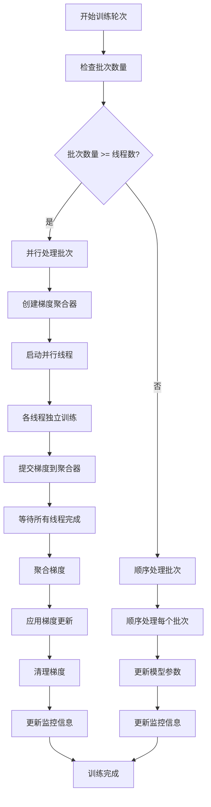
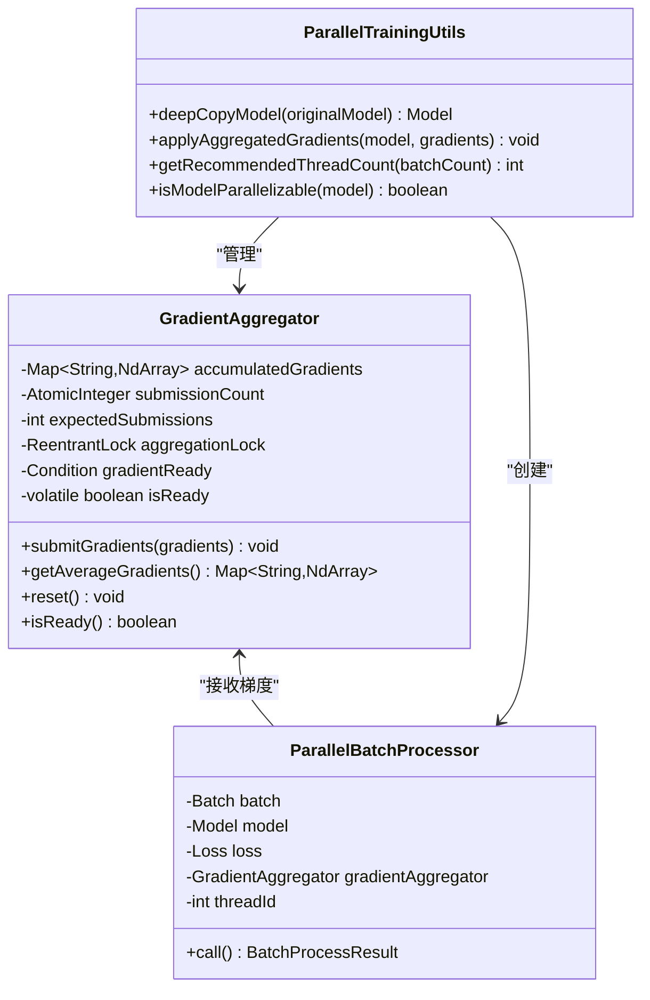
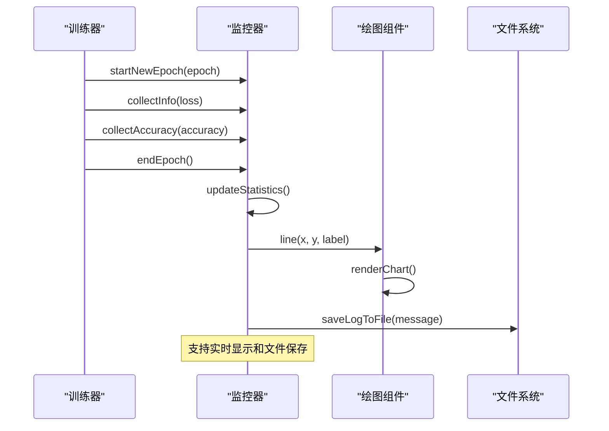
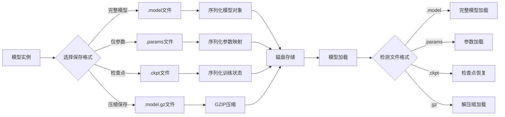
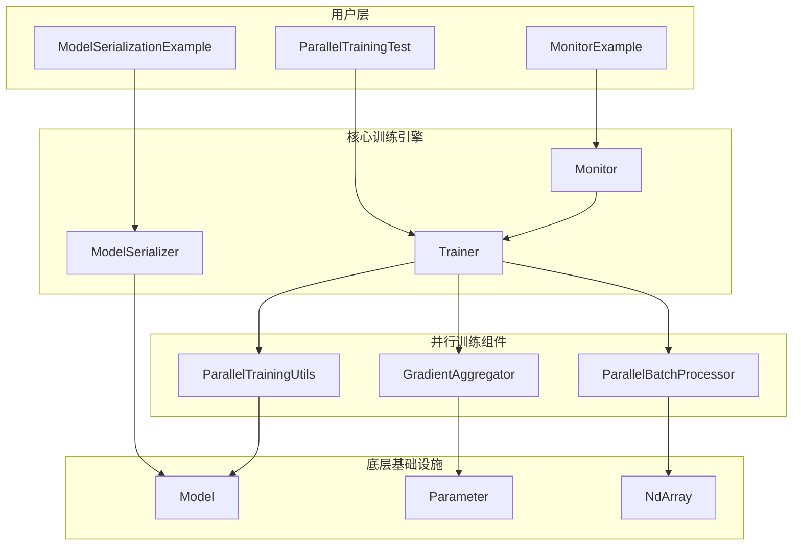

# 高级特性示例

<cite>
**本文档引用的文件**
- [ParallelTrainingTest.java](file://tinyai-dl-case/src/main/java/io/leavesfly/tinyai/example/parallel/ParallelTrainingTest.java)
- [MonitorExample.java](file://tinyai-dl-case/src/main/java/io/leavesfly/tinyai/example/MonitorExample.java)
- [ModelSerializationExample.java](file://tinyai-dl-case/src/main/java/io/leavesfly/tinyai/example/ModelSerializationExample.java)
- [Trainer.java](file://tinyai-dl-ml/src/main/java/io/leavesfly/tinyai/ml/Trainer.java)
- [GradientAggregator.java](file://tinyai-dl-ml/src/main/java/io/leavesfly/tinyai/ml/parallel/GradientAggregator.java)
- [ParallelBatchProcessor.java](file://tinyai-dl-ml/src/main/java/io/leavesfly/tinyai/ml/parallel/ParallelBatchProcessor.java)
- [ParallelTrainingUtils.java](file://tinyai-dl-ml/src/main/java/io/leavesfly/tinyai/ml/parallel/ParallelTrainingUtils.java)
- [Monitor.java](file://tinyai-dl-ml/src/main/java/io/leavesfly/tinyai/ml/Monitor.java)
- [ModelSerializer.java](file://tinyai-dl-ml/src/main/java/io/leavesfly/tinyai/ml/ModelSerializer.java)
</cite>

## 目录
1. [简介](#简介)
2. [并行训练实现机制](#并行训练实现机制)
3. [训练过程监控系统](#训练过程监控系统)
4. [模型序列化与反序列化](#模型序列化与反序列化)
5. [架构概览](#架构概览)
6. [性能考虑](#性能考虑)
7. [故障排除指南](#故障排除指南)
8. [结论](#结论)

## 简介

TinyDL深度学习框架提供了三个关键的高级特性：并行训练、训练过程监控和模型序列化。这些特性显著提升了大规模训练场景下的性能和可维护性。本文档深入分析这些特性的实现机制，并提供实际使用指导。

## 并行训练实现机制

### 数据并行策略

并行训练通过多线程技术同时处理多个批次的数据，从而提高训练效率。系统采用数据并行策略，每个线程独立处理不同的数据批次。



**图表来源**
- [Trainer.java](file://tinyai-dl-ml/src/main/java/io/leavesfly/tinyai/ml/Trainer.java#L200-L350)

### 梯度聚合机制

梯度聚合是并行训练的核心组件，负责收集和平均来自多个线程的梯度。



**图表来源**
- [GradientAggregator.java](file://tinyai-dl-ml/src/main/java/io/leavesfly/tinyai/ml/parallel/GradientAggregator.java#L1-L50)
- [ParallelBatchProcessor.java](file://tinyai-dl-ml/src/main/java/io/leavesfly/tinyai/ml/parallel/ParallelBatchProcessor.java#L1-L50)
- [ParallelTrainingUtils.java](file://tinyai-dl-ml/src/main/java/io/leavesfly/tinyai/ml/parallel/ParallelTrainingUtils.java#L1-L50)

### 同步更新机制

系统采用生产者-消费者模式确保线程安全的梯度同步：

1. **梯度收集阶段**: 每个线程独立计算梯度并提交到聚合器
2. **同步等待阶段**: 主线程等待所有梯度收集完成
3. **梯度平均阶段**: 计算所有线程梯度的平均值
4. **参数更新阶段**: 应用平均梯度更新模型参数

**章节来源**
- [Trainer.java](file://tinyai-dl-ml/src/main/java/io/leavesfly/tinyai/ml/Trainer.java#L240-L300)
- [GradientAggregator.java](file://tinyai-dl-ml/src/main/java/io/leavesfly/tinyai/ml/parallel/GradientAggregator.java#L39-L70)

## 训练过程监控系统

### 可视化功能实现

Monitor类提供了完整的训练过程监控和可视化功能，包括损失曲线、准确率曲线的绘制。



**图表来源**
- [Monitor.java](file://tinyai-dl-ml/src/main/java/io/leavesfly/tinyai/ml/Monitor.java#L150-L200)

### 监控指标收集

Monitor类收集和管理以下训练指标：

- **训练损失值**: 每个批次的损失值历史记录
- **验证集损失值**: 验证集上的损失值变化
- **训练准确率**: 训练过程中的准确率变化
- **验证集准确率**: 验证集上的准确率变化
- **训练时间**: 每轮训练的耗时统计

### 可视化图表功能

系统支持多种图表类型的绘制：

```java
// 绘制训练损失曲线
Float[] loss = lossList.toArray(new Float[0]);
plot.line(Util.toFloat(Util.getSeq(size)), Util.toFloat(loss), "train_loss");

// 绘制验证损失曲线  
Float[] valLoss = valLossList.toArray(new Float[0]);
plot.line(Util.toFloat(Util.getSeq(valLoss.length)), Util.toFloat(valLoss), "val_loss");

// 绘制准确率曲线
Float[] acc = accuracyList.toArray(new Float[0]);
plot.line(Util.toFloat(Util.getSeq(accuracyList.size())), Util.toFloat(acc), "train_acc");
```

**章节来源**
- [Monitor.java](file://tinyai-dl-ml/src/main/java/io/leavesfly/tinyai/ml/Monitor.java#L150-L200)
- [MonitorExample.java](file://tinyai-dl-case/src/main/java/io/leavesfly/tinyai/example/MonitorExample.java#L40-L90)

## 模型序列化与反序列化

### 完整流程架构

模型序列化系统提供了多种保存和加载格式，支持完整的模型生命周期管理。



**图表来源**
- [ModelSerializer.java](file://tinyai-dl-ml/src/main/java/io/leavesfly/tinyai/ml/ModelSerializer.java#L1-L100)

### ModelSerializer使用

ModelSerializer类提供了统一的序列化接口：

```java
// 保存完整模型
ModelSerializer.saveModel(model, "models/sample_model.model");

// 保存压缩模型
ModelSerializer.saveModel(model, "models/sample_model_compressed.model", true);

// 保存模型参数
ModelSerializer.saveParameters(model, "models/sample_model.params");

// 保存训练检查点
ModelSerializer.saveCheckpoint(model, 100, 0.025, "models/sample_model_epoch100.ckpt");
```

### 参数保存格式

系统支持多种参数保存格式：

1. **二进制序列化**: 使用Java标准序列化保存完整模型
2. **参数映射**: 仅保存参数值，便于参数共享和迁移
3. **压缩格式**: 使用GZIP压缩减少存储空间
4. **检查点格式**: 保存训练状态和模型参数

### 跨会话模型加载最佳实践

```java
// 自动检测文件格式
Model loadedModel = ModelSerializer.loadModel("models/sample_model.model");

// 从检查点恢复训练
Map<String, Object> checkpoint = ModelSerializer.loadCheckpoint("models/checkpoint_epoch50.ckpt");
Model restoredModel = (Model) checkpoint.get("model");

// 参数迁移和比较
boolean paramsEqual = ModelSerializer.compareModelParameters(originalModel, newModel);
int copiedCount = ParameterManager.copyParameters(sourceModel, targetModel);
```

**章节来源**
- [ModelSerializer.java](file://tinyai-dl-ml/src/main/java/io/leavesfly/tinyai/ml/ModelSerializer.java#L100-L200)
- [ModelSerializationExample.java](file://tinyai-dl-case/src/main/java/io/leavesfly/tinyai/example/ModelSerializationExample.java#L100-L200)

## 架构概览

### 整体系统架构



**图表来源**
- [Trainer.java](file://tinyai-dl-ml/src/main/java/io/leavesfly/tinyai/ml/Trainer.java#L1-L50)
- [Monitor.java](file://tinyai-dl-ml/src/main/java/io/leavesfly/tinyai/ml/Monitor.java#L1-L50)

### 组件交互关系

各组件之间通过明确定义的接口进行交互：

1. **Trainer ↔ Monitor**: 训练信息收集和可视化
2. **Trainer ↔ GradientAggregator**: 梯度管理和同步
3. **ModelSerializer ↔ Model**: 模型持久化和加载
4. **ParallelBatchProcessor ↔ Model**: 线程间模型隔离

## 性能考虑

### 并行训练性能优化

1. **线程数优化**: 基于CPU核心数和数据批次数量动态调整线程数
2. **内存管理**: 使用模型深拷贝避免参数竞争，但需注意内存开销
3. **负载均衡**: 确保批次分配均匀，避免线程空闲

### 监控系统性能

1. **实时性**: 监控数据收集对训练性能影响最小
2. **存储效率**: 支持增量日志和压缩存储
3. **可视化**: 图表渲染采用异步方式，不影响训练进程

### 序列化性能

1. **压缩比**: GZIP压缩可减少存储空间约50%
2. **加载速度**: 检查点格式提供快速恢复能力
3. **兼容性**: 支持跨版本模型迁移

## 故障排除指南

### 并行训练常见问题

1. **线程死锁**: 检查梯度聚合器的锁机制
2. **内存溢出**: 减少并行线程数或增加堆内存
3. **模型不支持**: 确保模型实现Serializable接口

### 监控系统问题

1. **图表显示异常**: 检查Plot组件依赖
2. **日志文件写入失败**: 验证文件权限和磁盘空间
3. **数据丢失**: 确保及时调用endEpoch()

### 序列化问题

1. **ClassNotFoundException**: 确保模型类在classpath中
2. **InvalidClassException**: 检查序列化版本兼容性
3. **OutOfMemoryError**: 优化参数存储格式

**章节来源**
- [Trainer.java](file://tinyai-dl-ml/src/main/java/io/leavesfly/tinyai/ml/Trainer.java#L350-L400)
- [ModelSerializer.java](file://tinyai-dl-ml/src/main/java/io/leavesfly/tinyai/ml/ModelSerializer.java#L250-L300)

## 结论

TinyDL的这三个高级特性——并行训练、训练过程监控和模型序列化，为大规模深度学习训练提供了强大的支持。并行训练显著提升了训练效率，监控系统提供了直观的训练过程可视化，而序列化功能则确保了模型的可移植性和可维护性。

这些特性不仅提高了开发效率，还为生产环境中的模型部署和维护奠定了坚实基础。通过合理使用这些高级特性，开发者可以构建更加高效和可靠的深度学习应用。