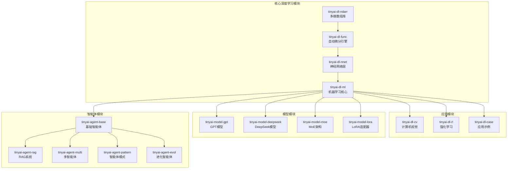
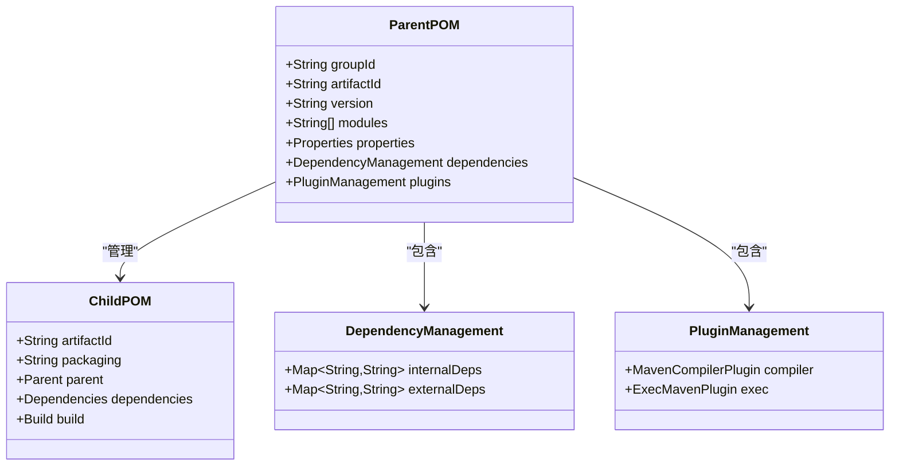
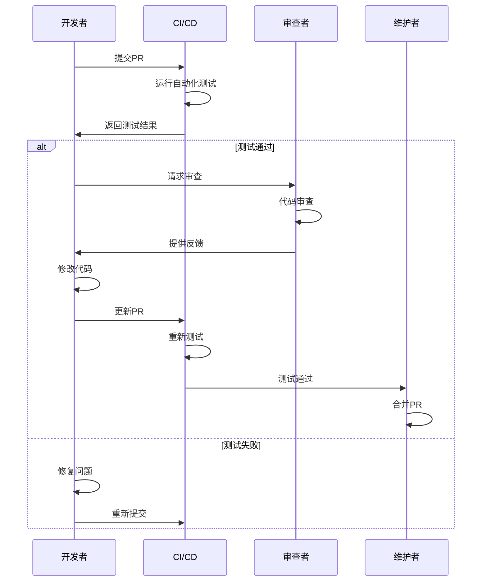

# TinyAI开发者指南

<cite>
**本文档引用的文件**
- [README.md](file://README.md)
- [pom.xml](file://pom.xml)
- [tinyai-dl-ndarr/pom.xml](file://tinyai-dl-ndarr/pom.xml)
- [tinyai-dl-func/pom.xml](file://tinyai-dl-func/pom.xml)
- [tinyai-agent-multi/src/main/java/io/leavesfly/tinyai/agent/multi/BaseAgent.java](file://tinyai-agent-multi/src/main/java/io/leavesfly/tinyai/agent/multi/BaseAgent.java)
- [tinyai-dl-func/src/test/java/io/leavesfly/tinyai/func/VariableTest.java](file://tinyai-dl-func/src/test/java/io/leavesfly/tinyai/func/VariableTest.java)
- [tinyai-dl-ml/src/main/java/io/leavesfly/tinyai/ml/Model.java](file://tinyai-dl-ml/src/main/java/io/leavesfly/tinyai/ml/Model.java)
- [tinyai-dl-rl/src/main/java/io/leavesfly/tinyai/rl/Agent.java](file://tinyai-dl-rl/src/main/java/io/leavesfly/tinyai/rl/Agent.java)
- [tinyai-dl-ml/doc/ModelSerializer_ParameterManager_实现报告.md](file://tinyai-dl-ml/doc/ModelSerializer_ParameterManager_实现报告.md)
</cite>

## 目录
1. [项目概述](#项目概述)
2. [环境配置](#环境配置)
3. [项目结构](#项目结构)
4. [构建系统](#构建系统)
5. [模块化开发](#模块化开发)
6. [单元测试策略](#单元测试策略)
7. [贡献流程](#贡献流程)
8. [技术决策说明](#技术决策说明)
9. [最佳实践](#最佳实践)
10. [故障排除](#故障排除)

## 项目概述

TinyAI是一个完全使用Java开发的现代化深度学习框架，专为教育、研究和生产环境设计。该框架提供了从底层张量运算到高级AI智能体的完整技术栈，支持传统深度学习、大语言模型、强化学习和多智能体系统等前沿AI技术。

### 核心特性

- **完整AI技术栈**：从张量运算到大模型训练的全链路支持
- **自动微分引擎**：支持动态计算图和梯度累积
- **多领域支持**：CV、NLP、RL、多智能体、推理优化
- **丰富神经网络组件**：Transformer、LSTM、CNN、MoE等
- **现代优化器**：Adam、AdamW、Lion等前沿优化算法
- **高性能训练**：并行训练、梯度累积、混合精度
- **完善序列化**：模型检查点、增量保存、压缩存储
- **智能监控**：训练可视化、性能分析、自动调优
- **AI智能体框架**：单智能体、多智能体、协作模式
- **前沿模型支持**：GPT、DeepSeek R1/V3、MoE架构

## 环境配置

### 系统要求

- **Java**: 17+ (推荐使用JDK 17或更高版本)
- **Maven**: 3.6+ (推荐使用Maven 3.8+)
- **内存**: 推荐4GB以上可用内存
- **操作系统**: Windows、macOS、Linux均可

### 开发环境设置

#### 1. 克隆项目

```bash
git clone https://github.com/your-repo/TinyAI.git
cd TinyAI
```

#### 2. 验证环境

```bash
# 检查Java版本
java -version

# 检查Maven版本
mvn -version

# 验证Git配置
git config --get user.name
git config --get user.email
```

#### 3. 编译项目

```bash
# 清理并编译所有模块
mvn clean compile

# 或者只编译特定模块
mvn compile -pl tinyai-dl-ndarr
```

#### 4. 运行测试

```bash
# 运行所有模块的测试
mvn test

# 运行特定模块的测试
mvn test -pl tinyai-dl-func

# 运行集成测试
mvn verify
```

### IDE配置建议

#### IntelliJ IDEA配置

1. **导入项目**：选择`pom.xml`文件导入Maven项目
2. **JDK配置**：设置JDK 17或更高版本
3. **编译器设置**：
   - 语言级别：17
   - 字符编码：UTF-8
   - 注解处理器：启用
4. **代码风格**：使用Google Java Style规范

#### Eclipse配置

1. **安装Maven插件**：确保安装了m2e插件
2. **JDK配置**：设置JDK 17
3. **编码设置**：全局设置UTF-8编码
4. **代码格式化**：导入Google Java Style配置

## 项目结构

TinyAI采用多模块Maven项目结构，每个模块专注于特定的功能领域：



**图表来源**
- [pom.xml](file://pom.xml#L15-L35)

### 模块组织原则

1. **功能分离**：每个模块专注于特定功能领域
2. **依赖控制**：明确的模块间依赖关系
3. **可扩展性**：易于添加新的功能模块
4. **测试隔离**：每个模块都有独立的测试套件

**章节来源**
- [README.md](file://README.md#L20-L50)
- [pom.xml](file://pom.xml#L1-L40)

## 构建系统

### Maven项目配置

TinyAI使用Maven作为构建工具，采用父-子模块结构：



**图表来源**
- [pom.xml](file://pom.xml#L1-L50)
- [tinyai-dl-ndarr/pom.xml](file://tinyai-dl-ndarr/pom.xml#L1-L30)

### 依赖管理策略

#### 1. 版本统一管理

```xml
<!-- 在父POM中统一管理版本 -->
<properties>
    <maven.compiler.source>17</maven.compiler.source>
    <maven.compiler.target>17</maven.compiler.target>
    <project.build.sourceEncoding>UTF-8</project.build.sourceEncoding>
    <jfreechart.version>1.0.7</jfreechart.version>
    <junit.version>4.13.2</junit.version>
</properties>
```

#### 2. 内部模块依赖

```xml
<!-- 子模块自动继承父版本 -->
<dependency>
    <groupId>io.leavesfly.tinyai</groupId>
    <artifactId>tinyai-dl-ndarr</artifactId>
    <version>${project.version}</version>
</dependency>
```

#### 3. 外部依赖管理

```xml
<!-- 统一管理外部依赖版本 -->
<dependency>
    <groupId>jfree</groupId>
    <artifactId>jfreechart</artifactId>
    <version>${jfreechart.version}</version>
</dependency>
```

### 构建命令

#### 基本构建命令

```bash
# 清理并编译
mvn clean compile

# 编译并跳过测试
mvn compile -DskipTests

# 仅编译特定模块
mvn compile -pl tinyai-dl-func

# 打包
mvn package

# 安装到本地仓库
mvn install
```

#### 高级构建选项

```bash
# 并行构建
mvn -T 4 compile

# 跳过文档生成
mvn compile -Dmaven.doc.skip=true

# 使用特定JDK
mvn -Djava.home=/path/to/jdk compile

# 跳过特定模块
mvn compile -pl '!tinyai-dl-case'
```

**章节来源**
- [pom.xml](file://pom.xml#L1-L148)
- [tinyai-dl-ndarr/pom.xml](file://tinyai-dl-ndarr/pom.xml#L1-L37)

## 模块化开发

### 添加新模块

#### 1. 创建模块目录

```bash
# 在项目根目录创建新模块
mkdir tinyai-new-module
cd tinyai-new-module
mkdir -p src/main/java src/test/java
```

#### 2. 创建POM文件

```xml
<?xml version="1.0" encoding="UTF-8"?>
<project xmlns="http://maven.apache.org/POM/4.0.0"
         xmlns:xsi="http://www.w3.org/2001/XMLSchema-instance"
         xsi:schemaLocation="http://maven.apache.org/POM/4.0.0 http://maven.apache.org/xsd/maven-4.0.0.xsd">
    <modelVersion>4.0.0</modelVersion>
    
    <parent>
        <groupId>io.leavesfly.tinyai</groupId>
        <artifactId>TinyAI</artifactId>
        <version>1.0-SNAPSHOT</version>
    </parent>
    
    <artifactId>tinyai-new-module</artifactId>
    <packaging>jar</packaging>
    <name>tinyai-new-module</name>
    <description>新模块描述</description>
    
    <dependencies>
        <!-- 添加必要的依赖 -->
        <dependency>
            <groupId>io.leavesfly.tinyai</groupId>
            <artifactId>tinyai-dl-func</artifactId>
        </dependency>
    </dependencies>
</project>
```

#### 3. 修改父POM

```xml
<!-- 在父POM的modules部分添加新模块 -->
<modules>
    <!-- 现有模块 -->
    <module>tinyai-new-module</module>
</modules>
```

### 模块间通信

#### 1. 接口定义

```java
// 定义公共接口
public interface ModuleInterface {
    String process(String input);
    void configure(Properties config);
}
```

#### 2. 依赖注入

```java
// 使用构造函数注入
public class ModuleA implements ModuleInterface {
    private final ModuleB moduleB;
    
    public ModuleA(ModuleB moduleB) {
        this.moduleB = moduleB;
    }
}
```

#### 3. 事件驱动通信

```java
// 使用观察者模式
public class EventManager {
    private final List<EventListener> listeners = new ArrayList<>();
    
    public void publishEvent(Event event) {
        listeners.forEach(listener -> listener.onEvent(event));
    }
}
```

### 版本管理

#### 1. 版本号规范

- **主版本号**：不兼容的API修改
- **次版本号**：向下兼容的功能性新增
- **修订号**：向下兼容的问题修正

#### 2. 版本升级策略

```bash
# 小版本升级
mvn versions:set -DnewVersion=1.1.0

# 大版本升级
mvn versions:set -DnewVersion=2.0.0

# 检查版本差异
mvn versions:display-property-updates
```

## 单元测试策略

### JUnit测试编写规范

#### 1. 测试类命名规范

```java
// 测试类命名：被测试类名 + Test
public class VariableTest {
    // 测试方法命名：test + 功能描述
    @Test
    public void testBasicArithmetic() {
        // 测试逻辑
    }
}
```

#### 2. 测试方法组织

```java
public class VariableTest {
    
    // 测试前置条件
    @Before
    public void setUp() {
        // 初始化测试数据
    }
    
    // 测试后置清理
    @After
    public void tearDown() {
        // 清理资源
    }
    
    // 正常情况测试
    @Test
    public void testNormalCase() {
        // 测试正常业务逻辑
    }
    
    // 异常情况测试
    @Test(expected = RuntimeException.class)
    public void testExceptionCase() {
        // 测试异常处理
    }
    
    // 边界条件测试
    @Test
    public void testBoundaryConditions() {
        // 测试边界值
    }
}
```

#### 3. 断言使用规范

```java
@Test
public void testAssertions() {
    // 基本断言
    assertEquals(5, result);
    assertTrue(condition);
    assertFalse(condition);
    assertNotNull(object);
    assertNull(object);
    
    // 数组断言
    assertArrayEquals(expectedArray, actualArray);
    
    // 浮点数断言（带容差）
    assertEquals(expectedValue, actualValue, 0.001);
    
    // 异常断言
    assertThrows(RuntimeException.class, () -> {
        // 触发异常的代码
    });
}
```

### 测试覆盖率要求

#### 1. 覆盖率目标

- **行覆盖率**：≥ 80%
- **分支覆盖率**：≥ 70%
- **方法覆盖率**：≥ 90%

#### 2. 测试工具配置

```xml
<!-- Maven Surefire插件配置 -->
<plugin>
    <groupId>org.apache.maven.plugins</groupId>
    <artifactId>maven-surefire-plugin</artifactId>
    <version>3.0.0-M5</version>
    <configuration>
        <includes>
            <include>**/*Test.java</include>
        </includes>
        <excludes>
            <exclude>**/*IntegrationTest.java</exclude>
        </exclude>
    </configuration>
</plugin>
```

#### 3. 代码覆盖率报告

```bash
# 生成覆盖率报告
mvn jacoco:prepare-agent test jacoco:report

# 查看覆盖率报告
open target/site/jacoco/index.html
```

### 测试数据管理

#### 1. 测试数据准备

```java
public class TestDataHelper {
    
    public static Variable createTestVariable(float value) {
        return new Variable(NdArray.of(value));
    }
    
    public static Variable createTestVariable(float[][] matrix) {
        return new Variable(NdArray.of(matrix));
    }
    
    public static NdArray createTestData(int rows, int cols) {
        float[][] data = new float[rows][cols];
        for (int i = 0; i < rows; i++) {
            for (int j = 0; j < cols; j++) {
                data[i][j] = i + j;
            }
        }
        return NdArray.of(data);
    }
}
```

#### 2. Mock对象使用

```java
@Test
public void testWithMock() {
    // 创建Mock对象
    Model mockModel = Mockito.mock(Model.class);
    
    // 配置Mock行为
    Mockito.when(mockModel.forward(Mockito.any())).thenReturn(result);
    
    // 执行测试
    Variable output = sut.process(input);
    
    // 验证Mock调用
    Mockito.verify(mockModel).forward(input);
}
```

**章节来源**
- [tinyai-dl-func/src/test/java/io/leavesfly/tinyai/func/VariableTest.java](file://tinyai-dl-func/src/test/java/io/leavesfly/tinyai/func/VariableTest.java#L1-L100)

## 贡献流程

### 1. Fork仓库

```bash
# 1. Fork项目到你的GitHub账户
# 2. 克隆你的Fork
git clone https://github.com/your-username/TinyAI.git
cd TinyAI

# 3. 添加上游远程仓库
git remote add upstream https://github.com/original-owner/TinyAI.git
```

### 2. 创建特性分支

```bash
# 1. 同步上游代码
git fetch upstream
git checkout main
git merge upstream/main

# 2. 创建特性分支
git checkout -b feature/new-feature

# 3. 开发新功能
# ... 编写代码 ...
```

### 3. 提交变更

```bash
# 1. 添加更改
git add .

# 2. 提交更改
git commit -m "feat: 添加新功能描述"

# 3. 提交规范
# feat: 新功能
# fix: 修复bug
# docs: 文档更新
# style: 代码格式调整
# refactor: 重构
# test: 测试相关
# chore: 构建过程或辅助工具的变动
```

### 4. 运行测试

```bash
# 1. 运行所有测试
mvn test

# 2. 运行特定模块测试
mvn test -pl tinyai-dl-func

# 3. 生成覆盖率报告
mvn jacoco:report
```

### 5. 推送到远程

```bash
# 1. 推送到你的Fork
git push origin feature/new-feature

# 2. 如果需要更新分支
git pull upstream main
git push origin feature/new-feature
```

### 6. 创建Pull Request

1. **访问GitHub页面**：前往你的Fork仓库
2. **创建PR**：点击"New Pull Request"
3. **填写信息**：
   - 标题：简洁明了的功能描述
   - 描述：详细说明变更内容和原因
   - 关联Issue：如果有相关Issue，进行关联
4. **等待审查**：及时响应审查意见

### 7. PR审查流程



**图表来源**
- [tinyai-dl-func/src/test/java/io/leavesfly/tinyai/func/VariableTest.java](file://tinyai-dl-func/src/test/java/io/leavesfly/tinyai/func/VariableTest.java#L1-L50)

### 8. 合并后的清理

```bash
# 1. 同步上游代码
git checkout main
git pull upstream main

# 2. 删除本地特性分支
git branch -d feature/new-feature

# 3. 删除远程特性分支
git push origin --delete feature/new-feature
```

## 技术决策说明

### 1. 模块化架构设计

**决策背景**：
- 支持不同领域的深度学习需求
- 提高代码复用性和可维护性
- 便于团队协作和独立开发

**实现细节**：
```java
// BaseAgent抽象类定义了智能体的基础行为
public abstract class BaseAgent {
    protected final String agentId;
    protected final String name;
    protected final String role;
    protected volatile AgentState state;
    
    // 核心组件
    protected final MessageBus messageBus;
    protected final LLMSimulator llm;
    
    // 任务管理
    protected volatile AgentTask currentTask;
    protected final BlockingQueue<AgentTask> taskQueue;
    
    // 性能指标
    protected final AgentMetrics metrics;
}
```

**优势**：
- **松耦合**：模块间依赖清晰
- **高内聚**：功能集中在一个模块中
- **可扩展**：易于添加新模块
- **可测试**：每个模块可独立测试

### 2. 自动微分引擎设计

**决策背景**：
- 支持复杂的计算图构建
- 实现高效的梯度计算
- 提供灵活的数学运算接口

**实现特点**：
```java
// Variable类是计算图的基本节点
public class Variable implements Serializable {
    private NdArray value;
    private NdArray grad;
    private Function creator;
    private String name;
    private boolean requireGrad;
    
    // 支持多种数学运算
    public Variable add(Variable other) { /* 实现 */ }
    public Variable mul(Variable other) { /* 实现 */ }
    public Variable matMul(Variable other) { /* 实现 */ }
    
    // 反向传播
    public void backward() { /* 实现 */ }
}
```

**技术优势**：
- **动态计算图**：运行时构建计算图
- **内存高效**：自动清理中间结果
- **类型安全**：强类型检查
- **扩展性强**：易于添加新的数学函数

### 3. 模型序列化策略

**决策背景**：
- 支持模型的持久化存储
- 实现模型的跨平台传输
- 提供增量更新能力

**实现报告要点**：
```java
// ModelSerializer类提供了完整的序列化功能
public class ModelSerializer {
    
    // 保存模型参数
    public static void saveParameters(Model model, String filePath) {
        // 实现参数保存逻辑
    }
    
    // 加载参数到模型
    public static void loadParameters(Model model, String filePath) {
        // 实现参数加载逻辑
    }
    
    // 比较两个模型的参数
    public static boolean compareModelParameters(
            Map<String, Parameter> params1, 
            Map<String, Parameter> params2) {
        // 实现参数比较逻辑
    }
}
```

**实现价值**：
- **完整性**：支持模型的所有组件
- **性能**：高效的序列化算法
- **可靠性**：完善的错误处理
- **可追溯**：详细的版本信息

**章节来源**
- [tinyai-agent-multi/src/main/java/io/leavesfly/tinyai/agent/multi/BaseAgent.java](file://tinyai-agent-multi/src/main/java/io/leavesfly/tinyai/agent/multi/BaseAgent.java#L1-L100)
- [tinyai-dl-func/src/test/java/io/leavesfly/tinyai/func/VariableTest.java](file://tinyai-dl-func/src/test/java/io/leavesfly/tinyai/func/VariableTest.java#L1-L100)
- [tinyai-dl-ml/doc/ModelSerializer_ParameterManager_实现报告.md](file://tinyai-dl-ml/doc/ModelSerializer_ParameterManager_实现报告.md#L1-L50)

## 最佳实践

### 1. 代码规范

#### 命名约定

```java
// 类名：使用PascalCase
public class NeuralNetwork {
    // 方法名：使用camelCase
    public void trainModel() {
        // 变量名：使用camelCase
        int batchSize = 32;
        float learningRate = 0.001f;
        
        // 常量名：使用UPPER_SNAKE_CASE
        private static final int MAX_ITERATIONS = 1000;
        
        // 私有字段：使用camelCase并加下划线前缀
        private String _internalState;
    }
}
```

#### 注释规范

```java
/**
 * 神经网络层的抽象基类
 * 
 * @author TinyAI团队
 * @version 1.0
 */
public abstract class Layer {
    
    /**
     * 前向传播计算
     * 
     * @param input 输入张量
     * @return 输出张量
     */
    public abstract Variable forward(Variable input);
    
    /**
     * 反向传播计算
     * 
     * @param gradOutput 梯度输出
     * @return 梯度输入
     */
    public abstract Variable backward(Variable gradOutput);
}
```

### 2. 错误处理

#### 异常类型设计

```java
// 自定义异常类
public class ModelException extends RuntimeException {
    public ModelException(String message) {
        super(message);
    }
    
    public ModelException(String message, Throwable cause) {
        super(message, cause);
    }
}

// 使用示例
public class Model {
    public void loadModel(String path) {
        if (path == null || path.isEmpty()) {
            throw new IllegalArgumentException("模型路径不能为空");
        }
        
        try {
            // 加载逻辑
        } catch (IOException e) {
            throw new ModelException("加载模型失败", e);
        }
    }
}
```

#### 日志记录

```java
import org.slf4j.Logger;
import org.slf4j.LoggerFactory;

public class TrainingManager {
    private static final Logger logger = LoggerFactory.getLogger(TrainingManager.class);
    
    public void train(Model model, DataSet dataset) {
        logger.info("开始训练模型: {}", model.getName());
        
        try {
            // 训练逻辑
            logger.debug("当前损失: {}", currentLoss);
        } catch (Exception e) {
            logger.error("训练过程中发生错误", e);
            throw e;
        }
    }
}
```

### 3. 性能优化

#### 内存管理

```java
public class MemoryManager {
    
    // 使用try-with-resources确保资源释放
    public void processData(DataSet dataset) {
        try (var iterator = dataset.iterator()) {
            while (iterator.hasNext()) {
                Batch batch = iterator.next();
                processBatch(batch);
                
                // 及时释放不需要的引用
                batch = null;
            }
        }
    }
    
    // 对象池模式减少GC压力
    private final ObjectPool<Variable> variablePool = new ObjectPool<>();
    
    public Variable acquireVariable() {
        return variablePool.acquire();
    }
    
    public void releaseVariable(Variable variable) {
        variable.clear();
        variablePool.release(variable);
    }
}
```

#### 并行处理

```java
public class ParallelTrainer {
    
    public void trainParallel(Model model, DataSet dataset, int numThreads) {
        ExecutorService executor = Executors.newFixedThreadPool(numThreads);
        
        try {
            List<CompletableFuture<Void>> futures = new ArrayList<>();
            
            for (int i = 0; i < numThreads; i++) {
                CompletableFuture<Void> future = CompletableFuture.runAsync(() -> {
                    trainChunk(model, dataset.getChunk(i));
                }, executor);
                
                futures.add(future);
            }
            
            // 等待所有任务完成
            CompletableFuture.allOf(futures.toArray(new CompletableFuture[0])).join();
            
        } finally {
            executor.shutdown();
        }
    }
}
```

### 4. 文档编写

#### Javadoc规范

```java
/**
 * 多层感知机神经网络实现
 * 
 * <p>该类实现了标准的多层感知机架构，支持任意层数和激活函数。
 * 每一层都是线性变换后接激活函数。</p>
 * 
 * <h2>使用示例</h2>
 * <pre>
 * {@code
 * // 创建MLP模型
 * Block mlp = new MlpBlock("mlp", 32, Activation.RELU, 784, 128, 64, 10);
 * Model model = new Model("MNIST_Classifier", mlp);
 * 
 * // 训练模型
 * Trainer trainer = new Trainer(100, new Monitor(), evaluator);
 * trainer.train(dataset, model, loss, optimizer);
 * }
 * </pre>
 * 
 * @see Block
 * @see Model
 * @see Trainer
 */
public class MlpBlock extends SequentialBlock {
    // 实现代码...
}
```

#### Markdown文档

```markdown
# 模型序列化指南

## 概述

TinyAI提供了完整的模型序列化功能，支持模型参数、完整模型和检查点的保存与加载。

## 使用方法

### 保存模型参数

```java
// 保存模型参数到文件
model.saveParameters("model_params.bin");

// 保存压缩的模型参数
model.saveParameters("model_params_compressed.bin");
```

### 加载模型参数

```java
// 从文件加载参数到现有模型
ModelSerializer.loadParameters(targetModel, "model_params.bin");

// 比较两个模型的参数
boolean areEqual = ParameterManager.compareParameters(model1, model2, 1e-6);
```
```

## 故障排除

### 常见问题及解决方案

#### 1. 编译错误

**问题**：Java版本不兼容
```
错误: 错误: 无效的目标发行版: 17
```

**解决方案**：
```bash
# 检查Java版本
java -version

# 设置JAVA_HOME环境变量
export JAVA_HOME=/path/to/jdk17

# 验证Maven配置
mvn -version
```

#### 2. 依赖冲突

**问题**：Maven依赖解析失败
```
[ERROR] 无法解析依赖项
```

**解决方案**：
```bash
# 清理本地仓库缓存
mvn dependency:purge-local-repository

# 强制更新依赖
mvn clean install -U

# 检查依赖树
mvn dependency:tree
```

#### 3. 内存不足

**问题**：OutOfMemoryError
```
java.lang.OutOfMemoryError: Java heap space
```

**解决方案**：
```bash
# 增加JVM堆内存
export MAVEN_OPTS="-Xmx4g -XX:MaxPermSize=512m"

# 或在IDE中配置
# VM选项：-Xmx4g -XX:+UseG1GC
```

#### 4. 测试失败

**问题**：单元测试运行失败
```
[ERROR] Tests run: 10, Failures: 2, Errors: 0, Skipped: 0
```

**解决方案**：
```bash
# 运行特定测试类
mvn test -Dtest=VariableTest

# 跳过失败的测试
mvn test -DfailIfNoTests=false

# 生成测试报告
mvn surefire-report:report
```

### 调试技巧

#### 1. 启用调试日志

```java
// 在测试中启用详细日志
@Test
public void testWithDebug() {
    System.setProperty("org.slf4j.simpleLogger.defaultLogLevel", "DEBUG");
    
    // 测试代码
}
```

#### 2. 使用断点调试

```bash
# 启动调试模式
mvnDebug test

# 在IDE中附加调试器
# localhost:8000
```

#### 3. 性能分析

```bash
# 使用JProfiler或VisualVM
jvisualvm

# 或使用命令行工具
jcmd <pid> Thread.print
jcmd <pid> GC.run
```

### 社区支持

#### 获取帮助

1. **GitHub Issues**：报告Bug和请求功能
2. **Discussions**：参与技术讨论
3. **文档**：查阅详细的技术文档
4. **示例代码**：参考项目中的示例

#### 贡献支持

- **代码贡献**：遵循贡献流程和代码规范
- **文档改进**：帮助完善文档和示例
- **测试协助**：编写和改进单元测试
- **社区建设**：帮助解答他人问题