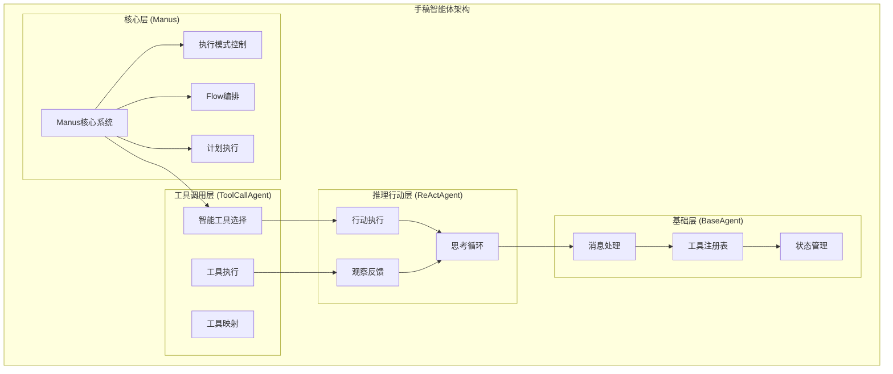
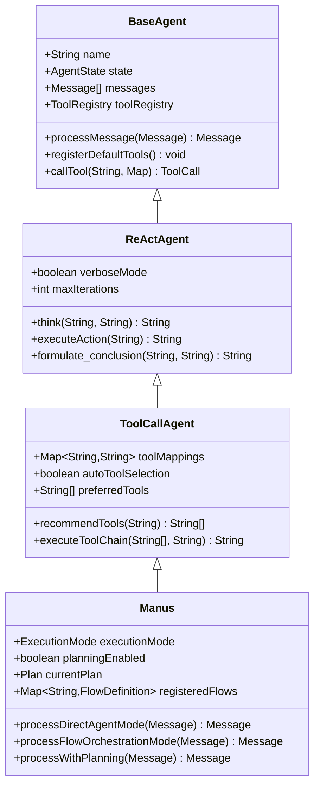
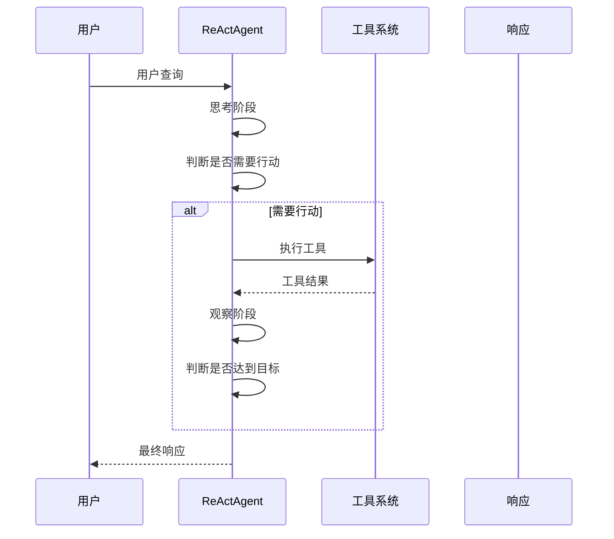
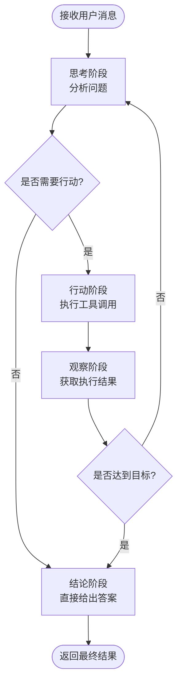
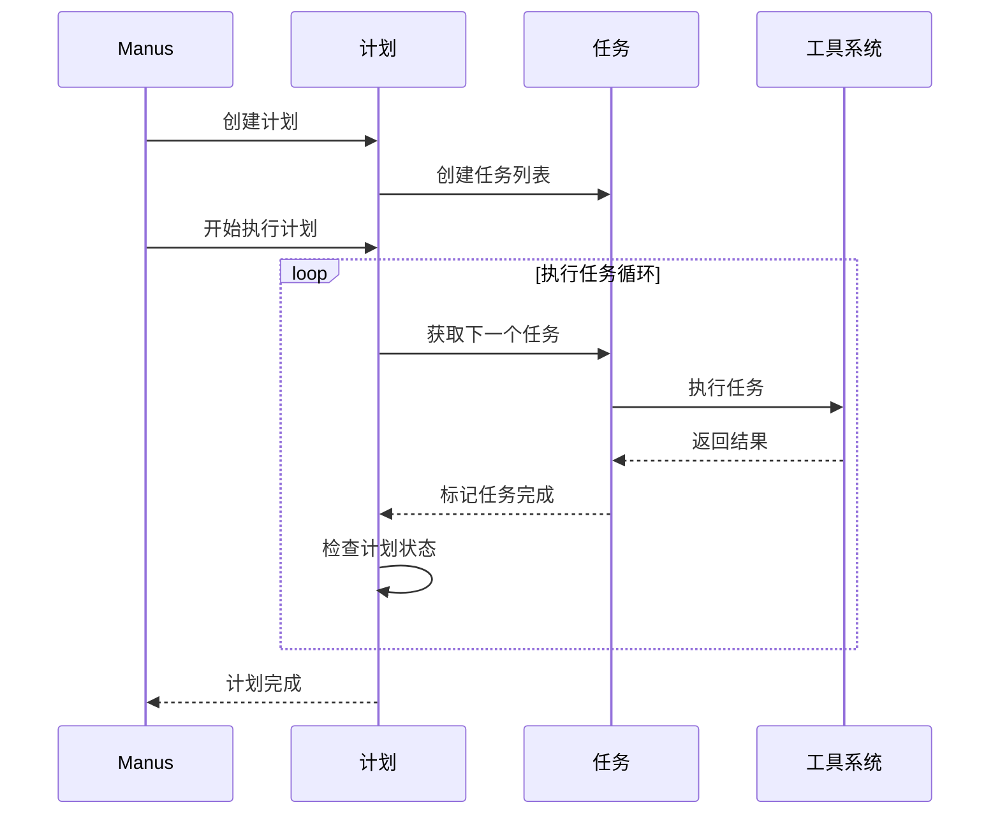
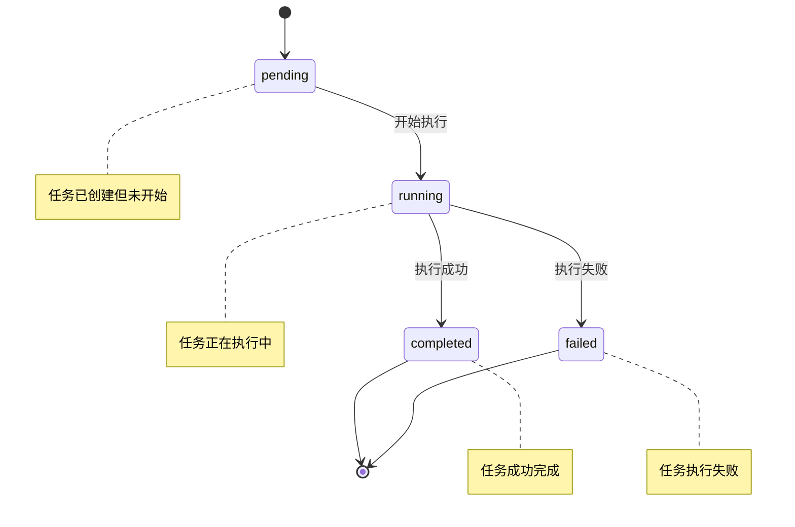
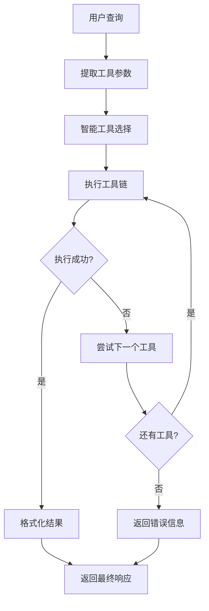
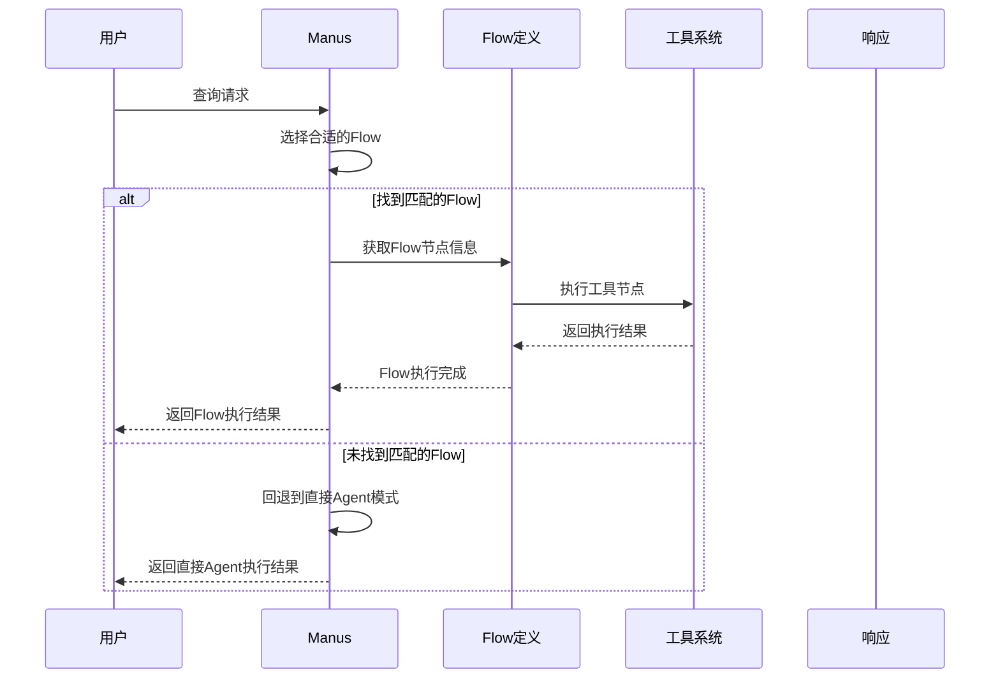
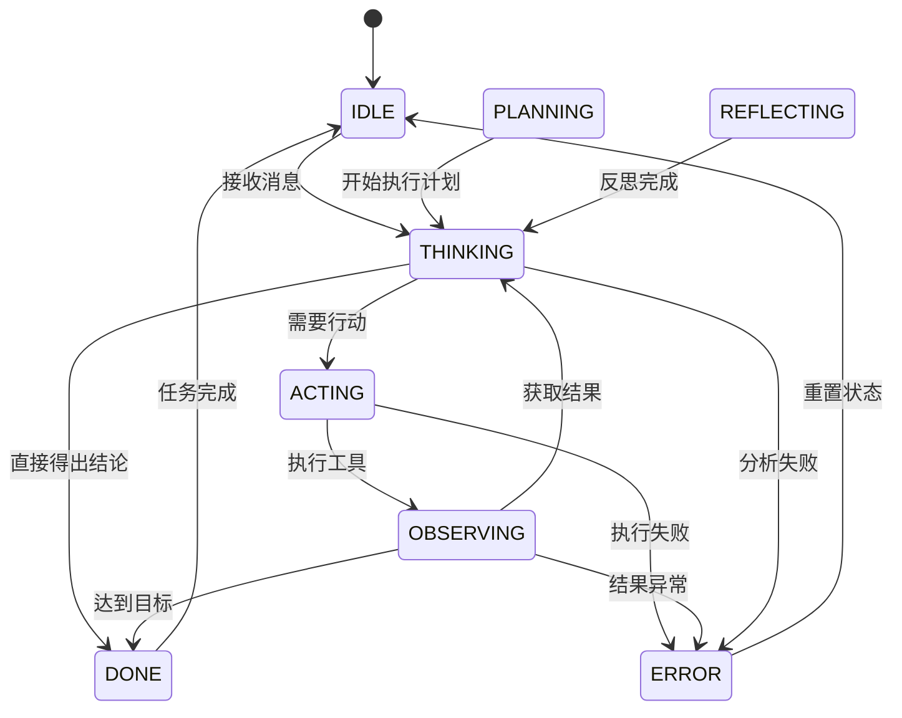

# 手稿智能体（Manus Agent）

<cite>
**本文档引用的文件**
- [Manus.java](file://tinyai-agent-manus/src/main/java/io/leavesfly/tinyai/agent/manus/Manus.java)
- [BaseAgent.java](file://tinyai-agent-manus/src/main/java/io/leavesfly/tinyai/agent/manus/BaseAgent.java)
- [ReActAgent.java](file://tinyai-agent-manus/src/main/java/io/leavesfly/tinyai/agent/manus/ReActAgent.java)
- [ToolCallAgent.java](file://tinyai-agent-manus/src/main/java/io/leavesfly/tinyai/agent/manus/ToolCallAgent.java)
- [Plan.java](file://tinyai-agent-manus/src/main/java/io/leavesfly/tinyai/agent/manus/Plan.java)
- [Task.java](file://tinyai-agent-manus/src/main/java/io/leavesfly/tinyai/agent/manus/Task.java)
- [ExecutionMode.java](file://tinyai-agent-manus/src/main/java/io/leavesfly/tinyai/agent/manus/ExecutionMode.java)
- [AgentState.java](file://tinyai-agent-manus/src/main/java/io/leavesfly/tinyai/agent/manus/AgentState.java)
- [FlowDefinition.java](file://tinyai-agent-manus/src/main/java/io/leavesfly/tinyai/agent/manus/FlowDefinition.java)
- [ManusDemo.java](file://tinyai-agent-manus/src/main/java/io/leavesfly/tinyai/agent/manus/ManusDemo.java)
- [README.md](file://tinyai-agent-manus/README.md)
</cite>

## 目录
1. [项目概述](#项目概述)
2. [核心架构](#核心架构)
3. [四大核心特征](#四大核心特征)
4. [分层架构详解](#分层架构详解)
5. [执行模式](#执行模式)
6. [任务管理系统](#任务管理系统)
7. [工具调用机制](#工具调用机制)
8. [Flow编排系统](#flow编排系统)
9. [状态管理](#状态管理)
10. [使用示例](#使用示例)
11. [系统监控](#系统监控)
12. [与其他智能体的协作](#与其他智能体的协作)
13. [最佳实践](#最佳实践)
14. [故障排除](#故障排除)
15. [总结](#总结)

## 项目概述

手稿智能体（Manus Agent）是TinyAI框架中的核心智能体系统，基于OpenManus项目的Java实现。该系统具备四大核心特征：双执行机制、分层架构、计划驱动任务分解和动态工具调用，为构建复杂的AI应用提供了坚实的基础架构。

### 主要特点

- **智能推理**：支持ReAct（推理-行动）模式的智能推理能力
- **任务分解**：能够将复杂任务自动分解为可执行的子任务
- **工具集成**：支持多种工具的动态调用和集成
- **工作流编排**：提供灵活的工作流程编排能力
- **状态跟踪**：完整的状态管理和执行进度跟踪
- **系统监控**：实时的系统状态监控和性能统计

## 核心架构

手稿智能体采用四层架构设计，每一层都有明确的职责和功能：



**图表来源**
- [Manus.java](file://tinyai-agent-manus/src/main/java/io/leavesfly/tinyai/agent/manus/Manus.java#L1-L50)
- [ToolCallAgent.java](file://tinyai-agent-manus/src/main/java/io/leavesfly/tinyai/agent/manus/ToolCallAgent.java#L1-L50)
- [ReActAgent.java](file://tinyai-agent-manus/src/main/java/io/leavesfly/tinyai/agent/manus/ReActAgent.java#L1-L50)
- [BaseAgent.java](file://tinyai-agent-manus/src/main/java/io/leavesfly/tinyai/agent/manus/BaseAgent.java#L1-L50)

## 四大核心特征

### 1. 双执行机制

手稿智能体支持两种不同的执行模式，可以根据任务类型和复杂度自动选择最适合的执行方式：

#### 直接Agent模式
- 基于ReAct（推理-行动）模式
- 适用于简单的推理和行动任务
- 支持智能工具推荐和自动调用

#### Flow编排模式
- 根据查询类型自动选择合适的工作流程
- 支持预定义的Flow模板
- 提供灵活的工作流程编排能力

### 2. 分层架构

系统采用清晰的四层架构设计：



**图表来源**
- [BaseAgent.java](file://tinyai-agent-manus/src/main/java/io/leavesfly/tinyai/agent/manus/BaseAgent.java#L15-L50)
- [ReActAgent.java](file://tinyai-agent-manus/src/main/java/io/leavesfly/tinyai/agent/manus/ReActAgent.java#L20-L60)
- [ToolCallAgent.java](file://tinyai-agent-manus/src/main/java/io/leavesfly/tinyai/agent/manus/ToolCallAgent.java#L20-L60)
- [Manus.java](file://tinyai-agent-manus/src/main/java/io/leavesfly/tinyai/agent/manus/Manus.java#L25-L70)

### 3. 计划驱动任务分解

手稿智能体能够将复杂任务自动分解为多个可执行的子任务：

#### 计划创建
- 根据查询内容自动生成任务分解
- 支持不同类型的任务类型（思考、行动、观察）
- 提供任务优先级和依赖关系管理

#### 计划执行
- 支持顺序执行和并行执行模式
- 实时的任务状态跟踪
- 完整的执行统计和进度报告

### 4. 动态工具调用

系统具备智能的工具选择和调用能力：

- **智能推荐**：基于查询内容自动推荐合适的工具
- **参数提取**：自动从用户输入中提取工具参数
- **结果格式化**：统一的工具结果格式化输出
- **错误处理**：完善的工具调用错误处理机制

**章节来源**
- [README.md](file://tinyai-agent-manus/README.md#L1-L50)
- [Manus.java](file://tinyai-agent-manus/src/main/java/io/leavesfly/tinyai/agent/manus/Manus.java#L1-L100)

## 分层架构详解

### BaseAgent - 基础层

BaseAgent是所有Agent的基础抽象类，提供核心的功能支撑：

```java
public abstract class BaseAgent {
    protected String name;
    protected AgentState state;
    protected List<Message> messages;
    protected List<ToolCall> toolCallHistory;
    protected ToolRegistry toolRegistry;
    
    public abstract Message processMessage(Message message);
}
```

#### 核心功能
- **消息处理**：统一的消息接收和处理机制
- **工具注册**：内置的工具注册表和调用能力
- **状态管理**：Agent状态的完整生命周期管理
- **历史记录**：消息和工具调用的历史记录

#### 内置工具
BaseAgent默认注册了三个核心工具：
- **计算器工具**：支持基本的数学运算
- **时间工具**：获取当前系统时间
- **文本分析工具**：提供文本长度、字数等基础分析

### ReActAgent - 推理行动层

ReActAgent实现了经典的ReAct（推理-行动）模式：



**图表来源**
- [ReActAgent.java](file://tinyai-agent-manus/src/main/java/io/leavesfly/tinyai/agent/manus/ReActAgent.java#L50-L150)

#### ReAct循环流程
1. **思考阶段**：分析问题并规划下一步行动
2. **行动阶段**：执行相应的工具调用
3. **观察阶段**：获取工具执行结果
4. **判断阶段**：检查是否达到预期目标

### ToolCallAgent - 工具调用层

ToolCallAgent增强了工具调用能力，提供智能的工具选择和执行：

#### 工具映射机制
```java
private void initializeToolMappings() {
    // 数学相关关键词映射到计算器
    toolMappings.put("计算", "calculator");
    toolMappings.put("加", "calculator");
    toolMappings.put("减", "calculator");
    toolMappings.put("乘", "calculator");
    toolMappings.put("除", "calculator");
    
    // 时间相关关键词映射到时间工具
    toolMappings.put("时间", "get_time");
    toolMappings.put("几点", "get_time");
    
    // 分析相关关键词映射到文本分析器
    toolMappings.put("分析", "text_analyzer");
    toolMappings.put("解析", "text_analyzer");
}
```

#### 智能工具选择
- **关键词匹配**：基于查询内容的关键词匹配
- **优先级排序**：根据匹配度对工具进行排序
- **自动执行**：自动执行第一个成功的工具调用

### Manus - 核心控制层

Manus是系统的最上层，集成了所有高级功能：

#### 核心特性
- **执行模式控制**：在直接Agent模式和Flow编排模式之间切换
- **计划驱动**：支持复杂任务的计划驱动执行
- **Flow管理**：注册和管理各种工作流程
- **系统监控**：提供完整的系统状态监控

**章节来源**
- [BaseAgent.java](file://tinyai-agent-manus/src/main/java/io/leavesfly/tinyai/agent/manus/BaseAgent.java#L1-L241)
- [ReActAgent.java](file://tinyai-agent-manus/src/main/java/io/leavesfly/tinyai/agent/manus/ReActAgent.java#L1-L358)
- [ToolCallAgent.java](file://tinyai-agent-manus/src/main/java/io/leavesfly/tinyai/agent/manus/ToolCallAgent.java#L1-L395)
- [Manus.java](file://tinyai-agent-manus/src/main/java/io/leavesfly/tinyai/agent/manus/Manus.java#L1-L539)

## 执行模式

手稿智能体支持两种主要的执行模式，每种模式都有其特定的应用场景和优势：

### ExecutionMode 枚举

```java
public enum ExecutionMode {
    /**
     * 直接Agent模式
     * 使用基础的ReAct模式进行推理和行动
     */
    DIRECT_AGENT("直接Agent模式"),
    
    /**
     * Flow编排模式
     * 根据查询类型选择合适的Flow进行执行
     */
    FLOW_ORCHESTRATION("Flow编排模式");
}
```

### 直接Agent模式

直接Agent模式是最基础的执行方式，基于ReAct（推理-行动）模式：

#### 工作流程


**图表来源**
- [ReActAgent.java](file://tinyai-agent-manus/src/main/java/io/leavesfly/tinyai/agent/manus/ReActAgent.java#L50-L150)

#### 特点
- **简单直接**：适合简单的推理和行动任务
- **智能推荐**：自动推荐合适的工具
- **循环推理**：支持多次推理直到达成目标
- **详细模式**：可选的详细执行过程展示

### Flow编排模式

Flow编排模式根据查询类型自动选择最合适的工作流程：

#### Flow定义
```java
public class FlowDefinition {
    private String name;
    private String description;
    private Map<String, Object> nodes;
    private LocalDateTime createdAt;
    
    // 支持工作流节点的动态配置
    public void addNode(String key, Object value) {
        this.nodes.put(key, value);
    }
}
```

#### Flow选择机制
```java
private String selectFlowForQuery(String query) {
    Map<String, Integer> flowScores = new HashMap<>();
    
    for (Map.Entry<String, String> mapping : flowMappings.entrySet()) {
        String keyword = mapping.getKey();
        String flowId = mapping.getValue();
        
        if (query.contains(keyword)) {
            flowScores.merge(flowId, 1, Integer::sum);
        }
    }
    
    return flowScores.entrySet().stream()
            .max(Map.Entry.comparingByValue())
            .map(Map.Entry::getKey)
            .orElse(null);
}
```

#### 预定义Flow
系统预定义了三种基本Flow：
- **计算Flow**：处理数学计算任务
- **时间Flow**：处理时间查询任务
- **分析Flow**：处理文本分析任务

**章节来源**
- [ExecutionMode.java](file://tinyai-agent-manus/src/main/java/io/leavesfly/tinyai/agent/manus/ExecutionMode.java#L1-L35)
- [Manus.java](file://tinyai-agent-manus/src/main/java/io/leavesfly/tinyai/agent/manus/Manus.java#L100-L200)

## 任务管理系统

手稿智能体提供了完整的任务管理系统，支持复杂任务的分解和执行：

### Plan 类 - 计划管理

Plan类是任务管理的核心，负责复杂任务的分解和执行：

```java
public class Plan {
    private String id;
    private String title;
    private String goal;
    private List<Task> tasks;
    private String status;
    private LocalDateTime startedAt;
    private LocalDateTime completedAt;
    private boolean allowParallel;
}
```

#### 计划创建
```java
private Plan createPlanForQuery(String query) {
    Plan plan = new Plan("处理查询：" + query.substring(0, Math.min(query.length(), 20)) + "...", 
                       "分析并回答用户的查询");
    
    if (query.contains("详细") || query.contains("深入") || query.contains("完整")) {
        // 复杂查询需要多步骤处理
        plan.addTask("分析查询意图", "thinking");
        plan.addTask("收集相关信息", "action");
        plan.addTask("整合分析结果", "thinking");
        plan.addTask("生成详细回答", "action");
    } else {
        // 简单查询
        plan.addTask("理解查询", "thinking");
        plan.addTask("执行相应操作", "action");
        plan.addTask("生成回答", "thinking");
    }
    
    return plan;
}
```

#### 计划执行流程


**图表来源**
- [Plan.java](file://tinyai-agent-manus/src/main/java/io/leavesfly/tinyai/agent/manus/Plan.java#L50-L150)
- [Manus.java](file://tinyai-agent-manus/src/main/java/io/leavesfly/tinyai/agent/manus/Manus.java#L200-L300)

### Task 类 - 任务管理

Task类表示计划中的单个任务，支持不同类型的任务执行：

```java
public class Task {
    private String id;
    private String description;
    private String type;        // thinking, action, observation
    private Map<String, Object> parameters;
    private String status;      // pending, running, completed, failed
    private Object result;
    private LocalDateTime startedAt;
    private LocalDateTime completedAt;
}
```

#### 任务类型
- **thinking**：思考类型任务，用于分析和规划
- **action**：行动类型任务，用于执行具体操作
- **observation**：观察类型任务，用于收集反馈信息

#### 任务执行
```java
private Object executeTask(Task task) {
    task.start();
    
    try {
        String taskType = task.getType();
        String description = task.getDescription();
        
        switch (taskType) {
            case "thinking":
                return executeThinkingTask(description);
                
            case "action":
                return executeActionTask(description);
                
            case "observation":
                return executeObservationTask(description);
                
            default:
                return "任务类型未知：" + taskType;
        }
        
    } catch (Exception e) {
        throw new RuntimeException("任务执行异常：" + e.getMessage(), e);
    }
}
```

### 任务状态管理

系统提供了完整的状态跟踪机制：



**图表来源**
- [Task.java](file://tinyai-agent-manus/src/main/java/io/leavesfly/tinyai/agent/manus/Task.java#L50-L100)

**章节来源**
- [Plan.java](file://tinyai-agent-manus/src/main/java/io/leavesfly/tinyai/agent/manus/Plan.java#L1-L315)
- [Task.java](file://tinyai-agent-manus/src/main/java/io/leavesfly/tinyai/agent/manus/Task.java#L1-L204)
- [Manus.java](file://tinyai-agent-manus/src/main/java/io/leavesfly/tinyai/agent/manus/Manus.java#L150-L300)

## 工具调用机制

手稿智能体提供了强大的动态工具调用机制，支持智能的工具选择和执行：

### 工具注册和管理

```java
protected void registerDefaultTools() {
    // 计算器工具
    toolRegistry.register("calculator", args -> {
        try {
            String expression = (String) args.get("expression");
            if (expression == null) {
                return "错误：表达式不能为空";
            }
            return evaluateExpression(expression);
        } catch (Exception e) {
            return "计算错误：" + e.getMessage();
        }
    }, "计算器工具，可以计算数学表达式");
    
    // 时间工具
    toolRegistry.register("get_time", args -> {
        return LocalDateTime.now().toString();
    }, "获取当前时间");
    
    // 文本分析工具
    toolRegistry.register("text_analyzer", args -> {
        String text = (String) args.get("text");
        if (text == null) {
            return "错误：文本不能为空";
        }
        Map<String, Object> result = new HashMap<>();
        result.put("length", text.length());
        result.put("word_count", text.split("\\s+").length);
        result.put("char_count", text.length());
        return result;
    }, "文本分析工具");
}
```

### 智能工具选择

```java
private List<String> recommendTools(String query) {
    List<String> recommended = new ArrayList<>();
    Map<String, Integer> toolScores = new HashMap<>();
    
    // 计算每个工具的匹配分数
    for (Map.Entry<String, String> mapping : toolMappings.entrySet()) {
        String keyword = mapping.getKey();
        String tool = mapping.getValue();
        
        if (query.contains(keyword)) {
            toolScores.merge(tool, 1, Integer::sum);
        }
    }
    
    // 特殊模式检测
    if (containsMathExpression(query)) {
        toolScores.merge("calculator", 5, Integer::sum);
    }
    
    if (containsTimeQuery(query)) {
        toolScores.merge("get_time", 3, Integer::sum);
    }
    
    if (containsTextAnalysisRequest(query)) {
        toolScores.merge("text_analyzer", 3, Integer::sum);
    }
    
    // 按分数排序并返回推荐工具
    toolScores.entrySet().stream()
            .filter(entry -> entry.getValue() > 0)
            .sorted(Map.Entry.<String, Integer>comparingByValue().reversed())
            .map(Map.Entry::getKey)
            .forEach(recommended::add);
    
    return recommended;
}
```

### 工具执行流程



**图表来源**
- [ToolCallAgent.java](file://tinyai-agent-manus/src/main/java/io/leavesfly/tinyai/agent/manus/ToolCallAgent.java#L100-L200)

### 参数提取和格式化

系统能够智能地从用户查询中提取工具参数：

```java
private String extractMathExpression(String text) {
    Pattern mathPattern = Pattern.compile("(\\d+(?:\\.\\d+)?\\s*[+\\-*/]\\s*\\d+(?:\\.\\d+)?(?:\\s*[+\\-*/]\\s*\\d+(?:\\.\\d+)?)*)");
    Matcher matcher = mathPattern.matcher(text);
    
    if (matcher.find()) {
        return matcher.group(1).trim();
    }
    
    return null;
}

private String extractTextForAnalysis(String text) {
    Pattern quotePattern = Pattern.compile("[\"'](.*?)[\"']");
    Matcher matcher = quotePattern.matcher(text);
    
    if (matcher.find()) {
        return matcher.group(1);
    }
    
    return text;
}
```

### 自定义工具注册

用户可以轻松注册自定义工具：

```java
// 注册天气查询工具
manus.registerCustomTool("weather", args -> {
    String city = (String) args.get("city");
    Map<String, String> weatherData = Map.of(
        "北京", "晴天 25°C",
        "上海", "多云 22°C", 
        "广州", "雨天 28°C"
    );
    Map<String, Object> result = new HashMap<>();
    result.put("city", city);
    result.put("weather", weatherData.getOrDefault(city, "暂无数据"));
    return result;
}, "天气查询工具");

// 注册翻译工具
manus.registerCustomTool("translator", args -> {
    String text = (String) args.get("text");
    String targetLang = (String) args.getOrDefault("target_lang", "en");
    Map<String, String> translations = Map.of(
        "你好", "Hello",
        "谢谢", "Thank you",
        "再见", "Goodbye"
    );
    Map<String, Object> result = new HashMap<>();
    result.put("original", text);
    result.put("translated", translations.getOrDefault(text, String.format("[%s] %s", targetLang, text)));
    return result;
}, "文本翻译工具");
```

**章节来源**
- [BaseAgent.java](file://tinyai-agent-manus/src/main/java/io/leavesfly/tinyai/agent/manus/BaseAgent.java#L50-L150)
- [ToolCallAgent.java](file://tinyai-agent-manus/src/main/java/io/leavesfly/tinyai/agent/manus/ToolCallAgent.java#L50-L200)

## Flow编排系统

Flow编排系统是手稿智能体的重要特色，它提供了灵活的工作流程编排能力：

### Flow定义和管理

```java
public class FlowDefinition {
    private String name;
    private String description;
    private Map<String, Object> nodes;
    private LocalDateTime createdAt;
    
    public void addNode(String key, Object value) {
        this.nodes.put(key, value);
    }
    
    public Object getNode(String key) {
        return this.nodes.get(key);
    }
}
```

### 预定义Flow

系统预定义了三种基本Flow：

#### 计算Flow
```java
FlowDefinition calculationFlow = new FlowDefinition("计算流程", "专门处理数学计算的流程");
Map<String, Object> calcNodes = new HashMap<>();
calcNodes.put("type", "tool");
calcNodes.put("name", "calculator");
calcNodes.put("description", "执行数学计算");
calculationFlow.setNodes(calcNodes);
registerFlow("calculation_flow", calculationFlow);
```

#### 时间Flow
```java
FlowDefinition timeFlow = new FlowDefinition("时间查询流程", "处理时间相关查询的流程");
Map<String, Object> timeNodes = new HashMap<>();
timeNodes.put("type", "tool");
timeNodes.put("name", "get_time");
timeNodes.put("description", "获取当前时间");
timeFlow.setNodes(timeNodes);
registerFlow("time_flow", timeFlow);
```

#### 分析Flow
```java
FlowDefinition analysisFlow = new FlowDefinition("分析流程", "处理分析任务的流程");
Map<String, Object> analysisNodes = new HashMap<>();
analysisNodes.put("type", "tool");
analysisNodes.put("name", "text_analyzer");
analysisNodes.put("description", "执行文本分析");
analysisFlow.setNodes(analysisNodes);
registerFlow("analysis_flow", analysisFlow);
```

### Flow选择机制

```java
private String selectFlowForQuery(String query) {
    Map<String, Integer> flowScores = new HashMap<>();
    
    for (Map.Entry<String, String> mapping : flowMappings.entrySet()) {
        String keyword = mapping.getKey();
        String flowId = mapping.getValue();
        
        if (query.contains(keyword)) {
            flowScores.merge(flowId, 1, Integer::sum);
        }
    }
    
    return flowScores.entrySet().stream()
            .max(Map.Entry.comparingByValue())
            .map(Map.Entry::getKey)
            .orElse(null);
}
```

### Flow执行流程



**图表来源**
- [Manus.java](file://tinyai-agent-manus/src/main/java/io/leavesfly/tinyai/agent/manus/Manus.java#L300-L400)

### 自定义Flow注册

用户可以创建和注册自定义Flow：

```java
// 创建自定义Flow
FlowDefinition customFlow = new FlowDefinition("自定义分析Flow", "处理特定分析任务的流程");

// 添加Flow节点
Map<String, Object> nodes = new HashMap<>();
nodes.put("type", "tool");
nodes.put("name", "custom_analyzer");
nodes.put("description", "执行自定义分析");
nodes.put("parameters", Map.of("format", "json", "depth", 3));

customFlow.setNodes(nodes);

// 注册Flow
manus.registerFlow("custom_analysis_flow", customFlow);
```

**章节来源**
- [FlowDefinition.java](file://tinyai-agent-manus/src/main/java/io/leavesfly/tinyai/agent/manus/FlowDefinition.java#L1-L88)
- [Manus.java](file://tinyai-agent-manus/src/main/java/io/leavesfly/tinyai/agent/manus/Manus.java#L80-L150)

## 状态管理

手稿智能体提供了完整的状态管理机制，确保系统行为的可预测性和可追溯性：

### AgentState 枚举

```java
public enum AgentState {
    /**
     * 空闲状态
     */
    IDLE("空闲"),
    
    /**
     * 思考状态
     */
    THINKING("思考"),
    
    /**
     * 行动状态
     */
    ACTING("行动"),
    
    /**
     * 观察状态
     */
    OBSERVING("观察"),
    
    /**
     * 反思状态
     */
    REFLECTING("反思"),
    
    /**
     * 计划状态
     */
    PLANNING("计划"),
    
    /**
     * 完成状态
     */
    DONE("完成"),
    
    /**
     * 错误状态
     */
    ERROR("错误");
    
    private final String description;
    
    AgentState(String description) {
        this.description = description;
    }
    
    public String getDescription() {
        return description;
    }
}
```

### 状态转换图



**图表来源**
- [AgentState.java](file://tinyai-agent-manus/src/main/java/io/leavesfly/tinyai/agent/manus/AgentState.java#L1-L63)

### 状态更新机制

```java
protected void updateState(AgentState newState) {
    this.state = newState;
    this.lastActiveAt = LocalDateTime.now();
}

public Map<String, Object> getStatus() {
    Map<String, Object> status = new HashMap<>();
    status.put("name", name);
    status.put("state", state.toString());
    status.put("message_count", messages.size());
    status.put("tool_call_count", toolCallHistory.size());
    status.put("created_at", createdAt.toString());
    status.put("last_active_at", lastActiveAt.toString());
    return status;
}
```

### 系统状态监控

```java
public Map<String, Object> getSystemStatus() {
    Map<String, Object> status = new HashMap<>();
    status.put("name", getName());
    status.put("execution_mode", executionMode.getDescription());
    status.put("planning_enabled", planningEnabled);
    status.put("current_state", getState().getDescription());
    status.put("total_messages", totalProcessedMessages);
    status.put("total_plans", totalExecutedPlans);
    status.put("total_flows", totalFlowExecutions);
    status.put("registered_flows", registeredFlows.size());
    status.put("registered_tools", getToolRegistry().getToolCount());
    status.put("uptime_hours", java.time.Duration.between(systemStartTime, LocalDateTime.now()).toHours());
    
    if (currentPlan != null) {
        status.put("current_plan", currentPlan.getStatistics());
    }
    
    return status;
}
```

**章节来源**
- [AgentState.java](file://tinyai-agent-manus/src/main/java/io/leavesfly/tinyai/agent/manus/AgentState.java#L1-L63)
- [BaseAgent.java](file://tinyai-agent-manus/src/main/java/io/leavesfly/tinyai/agent/manus/BaseAgent.java#L150-L200)
- [Manus.java](file://tinyai-agent-manus/src/main/java/io/leavesfly/tinyai/agent/manus/Manus.java#L450-L500)

## 使用示例

手稿智能体提供了丰富的使用示例，帮助开发者快速上手：

### 基础使用示例

```java
// 创建Manus实例
Manus manus = new Manus("MyAgent");

// 配置执行模式
manus.setExecutionMode(ExecutionMode.DIRECT_AGENT);
manus.setPlanningEnabled(true);

// 处理用户消息
Message userMessage = new Message("user", "计算 100 * 25 + 50");
Message response = manus.processMessage(userMessage);

// 获取系统状态
Map<String, Object> status = manus.getSystemStatus();
```

### 直接Agent模式演示

```java
public static void demoDirectAgentMode() {
    Manus manus = new Manus("OpenManus-Direct");
    manus.setExecutionMode(ExecutionMode.DIRECT_AGENT);
    manus.setPlanningEnabled(false);
    
    String[] testQueries = {
        "计算 25 * 8 + 15",
        "现在几点了？",
        "分析这个文本: 'OpenManus是一个强大的Agent系统'"
    };
    
    for (String query : testQueries) {
        Message message = new Message("user", query);
        Message response = manus.processMessage(message);
        System.out.println("回答: " + response.getContent());
    }
}
```

### 计划驱动模式演示

```java
public static void demoPlanningDrivenMode() {
    Manus manus = new Manus("OpenManus-Planning");
    manus.setExecutionMode(ExecutionMode.DIRECT_AGENT);
    manus.setPlanningEnabled(true);
    
    String[] complexQueries = {
        "详细分析计算 100 * 25 的结果",
        "研究当前时间并进行深入分析",
        "制定一个完整的学习计划"
    };
    
    for (String query : complexQueries) {
        Message message = new Message("user", query);
        Message response = manus.processMessage(message);
        System.out.println("计划执行结果: " + response.getContent());
    }
}
```

### Flow编排模式演示

```java
public static void demoFlowOrchestration() {
    Manus manus = new Manus("OpenManus-Flow");
    manus.setExecutionMode(ExecutionMode.FLOW_ORCHESTRATION);
    
    String[] flowQueries = {
        "计算 15 + 25 * 3",
        "查询当前时间",
        "分析文本内容",
        "这是一个通用查询"
    };
    
    for (String query : flowQueries) {
        Message message = new Message("user", query);
        Message response = manus.processMessage(message);
        System.out.println("Flow执行结果: " + response.getContent());
    }
}
```

### 交互式演示

```java
public static void interactiveDemo() {
    Manus manus = new Manus("OpenManus-Interactive");
    manus.setExecutionMode(ExecutionMode.DIRECT_AGENT);
    manus.setPlanningEnabled(true);
    
    Scanner scanner = new Scanner(System.in);
    while (true) {
        System.out.print("你: ");
        String userInput = scanner.nextLine().trim();
        
        if (userInput.equalsIgnoreCase("quit")) {
            break;
        }
        
        Message message = new Message("user", userInput);
        Message response = manus.processMessage(message);
        System.out.println("Manus: " + response.getContent());
    }
}
```

### 自定义工具使用

```java
// 注册自定义工具
manus.registerCustomTool("weather", args -> {
    String city = (String) args.get("city");
    Map<String, String> weatherData = Map.of(
        "北京", "晴天 25°C",
        "上海", "多云 22°C", 
        "广州", "雨天 28°C"
    );
    return weatherData.getOrDefault(city, "暂无数据");
}, "天气查询工具");

// 使用自定义工具
Message message = new Message("user", "北京今天的天气怎么样？");
Message response = manus.processMessage(message);
```

### 多Agent协作示例

```java
// 创建多个Manus实例
Manus mathematician = new Manus("Mathematician");
Manus historian = new Manus("Historian");
Manus analyst = new Manus("Analyst");

// 配置不同的执行模式
mathematician.setExecutionMode(ExecutionMode.DIRECT_AGENT);
historian.setExecutionMode(ExecutionMode.FLOW_ORCHESTRATION);
analyst.setPlanningEnabled(true);

// 协作处理复杂任务
String complexTask = "分析历史事件对现代数学发展的影响";
Message taskMessage = new Message("user", complexTask);

// 每个Agent独立处理
Message mathResponse = mathematician.processMessage(taskMessage);
Message historyResponse = historian.processMessage(taskMessage);
Message analysisResponse = analyst.processMessage(taskMessage);

// 合并结果
System.out.println("数学家观点: " + mathResponse.getContent());
System.out.println("历史学家观点: " + historyResponse.getContent());
System.out.println("分析师观点: " + analysisResponse.getContent());
```

**章节来源**
- [ManusDemo.java](file://tinyai-agent-manus/src/main/java/io/leavesfly/tinyai/agent/manus/ManusDemo.java#L1-L477)

## 系统监控

手稿智能体提供了完整的系统监控功能，帮助开发者了解系统运行状态和性能指标：

### 监控指标

```java
// 系统启动时间
private LocalDateTime systemStartTime;
private int totalProcessedMessages;    // 处理的消息总数
private int totalExecutedPlans;        // 执行的计划总数
private int totalFlowExecutions;       // Flow执行总数
```

### 系统状态获取

```java
public Map<String, Object> getSystemStatus() {
    Map<String, Object> status = new HashMap<>();
    status.put("name", getName());
    status.put("execution_mode", executionMode.getDescription());
    status.put("planning_enabled", planningEnabled);
    status.put("current_state", getState().getDescription());
    status.put("total_messages", totalProcessedMessages);
    status.put("total_plans", totalExecutedPlans);
    status.put("total_flows", totalFlowExecutions);
    status.put("registered_flows", registeredFlows.size());
    status.put("registered_tools", getToolRegistry().getToolCount());
    status.put("uptime_hours", java.time.Duration.between(systemStartTime, LocalDateTime.now()).toHours());
    
    if (currentPlan != null) {
        status.put("current_plan", currentPlan.getStatistics());
    }
    
    return status;
}
```

### 工具使用统计

```java
public Map<String, Integer> getToolUsageStatistics() {
    Map<String, Integer> stats = new HashMap<>();
    for (ToolCall toolCall : toolCallHistory) {
        stats.merge(toolCall.getName(), 1, Integer::sum);
    }
    return stats;
}

public void resetToolUsageStatistics() {
    toolUsageCount.clear();
}
```

### 消息历史管理

```java
public List<Message> getMessages() {
    return new ArrayList<>(messages);
}

private String getLastUserMessage() {
    for (int i = messages.size() - 1; i >= 0; i--) {
        Message msg = messages.get(i);
        if ("user".equals(msg.getRole())) {
            return msg.getContent();
        }
    }
    return "";
}
```

### 性能监控示例

```java
// 启动系统监控
Manus manus = new Manus("MonitorAgent");
manus.setExecutionMode(ExecutionMode.DIRECT_AGENT);

// 处理大量消息
for (int i = 0; i < 100; i++) {
    Message message = new Message("user", "计算随机数 " + i);
    manus.processMessage(message);
    
    // 定期检查状态
    if (i % 10 == 0) {
        Map<String, Object> status = manus.getSystemStatus();
        System.out.println("处理进度: " + i + "/100, 状态: " + status);
    }
}

// 获取最终统计信息
Map<String, Object> finalStatus = manus.getSystemStatus();
System.out.println("最终统计: " + finalStatus);
```

**章节来源**
- [Manus.java](file://tinyai-agent-manus/src/main/java/io/leavesfly/tinyai/agent/manus/Manus.java#L450-L539)

## 与其他智能体的协作

手稿智能体可以与其他智能体模块协同工作，形成更强大的AI应用系统：

### 与自进化Agent协作

```java
// 创建手稿智能体
Manus manus = new Manus("CollaborativeAgent");

// 创建自进化Agent
SelfEvolvingAgent evolver = new SelfEvolvingAgent("LearningAgent");

// 协作处理任务
String collaborativeTask = "分析任务执行效果并提出改进建议";

Message taskMessage = new Message("user", collaborativeTask);
Message manusResponse = manus.processMessage(taskMessage);

// 自进化Agent分析结果
Map<String, Object> context = new HashMap<>();
context.put("previous_result", manusResponse.getContent());
context.put("task_type", "analysis");

SelfEvolvingAgent.TaskResult evolverResult = evolver.processTask(
    "分析执行效果", 
    context
);

System.out.println("协作结果: " + manusResponse.getContent());
System.out.println("进化建议: " + evolverResult.getResult());
```

### 与多Agent系统协作

```java
// 创建多Agent系统
MultiAgentSystem multiSystem = new MultiAgentSystem();

// 添加手稿智能体
String manusId = multiSystem.addAgent(() -> new Manus("CoordinatingManus")).get();

// 添加其他专业Agent
String analystId = multiSystem.addAgent(AnalystAgent.class).get();
String researcherId = multiSystem.addAgent(ResearcherAgent.class).get();

// 创建团队
multiSystem.createTeam("分析团队", Arrays.asList(manusId, analystId, researcherId));

// 分配复杂任务
AgentTask complexTask = new AgentTask(
    "综合分析任务", 
    "分析市场趋势并制定策略", 
    manusId
);

multiSystem.assignTask(complexTask, "分析团队", true);

// 等待任务完成
Thread.sleep(5000);

// 获取系统状态
Map<String, Object> status = multiSystem.getSystemStatus();
System.out.println("多Agent协作状态: " + status);
```

### 与RAG系统集成

```java
// 创建手稿智能体
Manus manus = new Manus("RAGIntegratingAgent");

// 创建RAG系统
RAGSystem rag = new RAGSystem();

// 集成RAG知识库
rag.addDocument(new Document("市场分析报告.doc", "市场分析报告内容..."));
rag.addDocument(new Document("技术白皮书.pdf", "技术白皮书内容..."));

// 智能检索和分析
String query = "基于最新市场数据分析行业趋势";
List<RetrievalResult> results = rag.retrieve(query, 3);

// 将检索结果传递给手稿智能体
StringBuilder context = new StringBuilder("检索到的知识:\n");
for (RetrievalResult result : results) {
    context.append("- ").append(result.getDocument().getTitle()).append(": ")
           .append(result.getScore()).append("\n");
}

Message contextualMessage = new Message("user", query + "\n上下文: " + context);
Message response = manus.processMessage(contextualMessage);

System.out.println("RAG集成分析结果: " + response.getContent());
```

### 与光标智能体协作

```java
// 创建手稿智能体
Manus manus = new Manus("CodeReviewAgent");

// 创建光标智能体
AICodingCursor cursor = new AICodingCursor();

// 协作处理代码审查任务
String codeReviewTask = "审查以下代码并提出改进建议:\n" +
    "public class Calculator {\n" +
    "    public int add(int a, int b) { return a + b; }\n" +
    "}";

Message reviewMessage = new Message("user", codeReviewTask);
Message manusResponse = manus.processMessage(reviewMessage);

// 光标智能体提供具体修改建议
RefactorSuggestion suggestion = cursor.analyzeCode(codeReviewTask);
cursor.applyRefactor(suggestion);

System.out.println("手稿智能体分析: " + manusResponse.getContent());
System.out.println("光标智能体建议: " + suggestion.getSuggestion());
```

**章节来源**
- [README.md](file://tinyai-agent-manus/README.md#L200-L300)

## 最佳实践

### 1. 执行模式选择

```java
// 根据任务类型选择合适的执行模式
public ExecutionMode selectExecutionMode(String query) {
    if (query.contains("详细分析") || query.contains("复杂任务")) {
        return ExecutionMode.DIRECT_AGENT; // 使用计划驱动
    } else if (query.contains("时间") || query.contains("计算")) {
        return ExecutionMode.FLOW_ORCHESTRATION; // 使用预定义Flow
    } else {
        return ExecutionMode.DIRECT_AGENT; // 默认直接Agent模式
    }
}
```

### 2. 工具设计原则

```java
// 设计高质量的工具
public void registerHighQualityTool(Manus manus) {
    manus.registerCustomTool("advanced_analyzer", args -> {
        // 输入验证
        String text = (String) args.get("text");
        if (text == null || text.trim().isEmpty()) {
            return Map.of("error", "文本不能为空");
        }
        
        // 参数验证
        int maxWords = Math.min(1000, Integer.parseInt(args.getOrDefault("max_words", "100").toString()));
        
        // 执行分析
        Map<String, Object> result = new HashMap<>();
        result.put("word_count", Math.min(text.split("\\s+").length, maxWords));
        result.put("sentiment", analyzeSentiment(text));
        result.put("keywords", extractKeywords(text, maxWords));
        
        return result;
    }, "高级文本分析工具，支持情感分析和关键词提取");
}
```

### 3. 错误处理策略

```java
// 完善的错误处理
public Message robustProcessMessage(Manus manus, Message message) {
    try {
        return manus.processMessage(message);
    } catch (Exception e) {
        // 记录错误
        System.err.println("处理消息时发生错误: " + e.getMessage());
        
        // 提供友好的错误响应
        String errorMessage = "抱歉，处理您的请求时遇到了问题。";
        
        // 尝试回退到简单模式
        manus.setPlanningEnabled(false);
        return manus.processMessage(new Message("user", "请简化您的请求"));
    }
}
```

### 4. 性能优化建议

```java
// 性能优化配置
public void optimizeManusPerformance(Manus manus) {
    // 启用计划模式以提高复杂任务处理效率
    manus.setPlanningEnabled(true);
    
    // 配置工具缓存
    Map<String, Object> cacheConfig = new HashMap<>();
    cacheConfig.put("enabled", true);
    cacheConfig.put("ttl_seconds", 3600);
    cacheConfig.put("max_entries", 1000);
    
    // 配置并发处理
    manus.setExecutionMode(ExecutionMode.DIRECT_AGENT);
}
```

### 5. 监控和日志

```java
// 完整的监控和日志记录
public void setupMonitoring(Manus manus) {
    // 定期保存状态
    ScheduledExecutorService scheduler = Executors.newScheduledThreadPool(1);
    scheduler.scheduleAtFixedRate(() -> {
        Map<String, Object> status = manus.getSystemStatus();
        logSystemStatus(status);
    }, 0, 5, TimeUnit.MINUTES);
    
    // 工具使用统计
    manus.getToolRegistry().setCallback((toolName, args, result) -> {
        logToolUsage(toolName, args, result);
    });
}
```

### 6. 安全考虑

```java
// 安全配置
public void configureSecurity(Manus manus) {
    // 限制工具调用频率
    Map<String, Integer> rateLimits = new HashMap<>();
    rateLimits.put("calculator", 10); // 每分钟最多10次
    rateLimits.put("get_time", 60);   // 每分钟最多60次
    
    // 验证用户输入
    manus.registerCustomTool("safe_calculator", args -> {
        String expression = (String) args.get("expression");
        if (!isValidMathExpression(expression)) {
            return "错误: 无效的数学表达式";
        }
        return evaluateExpression(expression);
    }, "安全计算器，只接受合法的数学表达式");
}
```

## 故障排除

### 常见问题及解决方案

#### 1. 工具调用失败

**问题症状**：
- 工具返回"工具执行失败"
- 参数格式错误
- 工具不存在

**解决方案**：
```java
// 检查工具可用性
public void diagnoseToolIssues(Manus manus) {
    // 列出所有可用工具
    System.out.println("可用工具列表:");
    manus.getToolRegistry().listTools().forEach(tool -> {
        System.out.println("- " + tool.getName() + ": " + tool.getDescription());
    });
    
    // 测试工具
    try {
        ToolCall testResult = manus.getToolRegistry().callTool("calculator", 
            Map.of("expression", "2+2"));
        System.out.println("工具测试结果: " + testResult.getResult());
    } catch (Exception e) {
        System.out.println("工具测试失败: " + e.getMessage());
    }
}
```

#### 2. 执行模式切换问题

**问题症状**：
- 模式切换后行为异常
- 计划模式不生效
- Flow编排不工作

**解决方案**：
```java
// 正确的模式切换
public void fixExecutionModeIssues(Manus manus) {
    // 确保先设置模式再启用功能
    manus.setExecutionMode(ExecutionMode.DIRECT_AGENT);
    manus.setPlanningEnabled(true); // 计划模式
    
    // 或者使用Flow模式
    manus.setExecutionMode(ExecutionMode.FLOW_ORCHESTRATION);
    
    // 验证设置
    System.out.println("当前执行模式: " + manus.getExecutionMode());
    System.out.println("计划模式启用: " + manus.isPlanningEnabled());
}
```

#### 3. 计划执行超时

**问题症状**：
- 计划长时间不完成
- 任务卡在pending状态
- 内存占用过高

**解决方案**：
```java
// 优化计划执行
public void optimizePlanExecution(Manus manus) {
    // 设置合理的超时时间
    Plan plan = new Plan("优化计划", "优化任务执行");
    plan.setAllowParallel(true); // 启用并行执行
    
    // 添加任务超时处理
    Task timeoutTask = new Task("超时任务", "action");
    timeoutTask.addParameter("timeout_ms", 5000); // 5秒超时
    
    // 监控计划进度
    while (!plan.isCompleted() && !plan.isFailed()) {
        Map<String, Object> stats = plan.getStatistics();
        System.out.println("计划进度: " + stats);
        
        // 检查执行时间
        if ((Double) stats.get("progress") < 0.1 && 
            (long) stats.get("execution_time_ms") > 30000) {
            System.out.println("计划执行过慢，考虑优化");
            break;
        }
        
        Thread.sleep(1000);
    }
}
```

#### 4. 内存泄漏问题

**问题症状**：
- 系统内存持续增长
- 响应速度变慢
- 最终抛出OutOfMemoryError

**解决方案**：
```java
// 内存管理
public void manageMemory(Manus manus) {
    // 定期清理消息历史
    Timer cleanupTimer = new Timer();
    cleanupTimer.scheduleAtFixedRate(new TimerTask() {
        @Override
        public void run() {
            // 限制消息历史大小
            List<Message> messages = manus.getMessages();
            if (messages.size() > 1000) {
                // 保留最近的500条消息
                List<Message> recentMessages = messages.subList(messages.size() - 500, messages.size());
                // 清理工具调用历史
                manus.resetToolUsageStatistics();
            }
        }
    }, 0, 60000); // 每分钟清理一次
    
    // 监控内存使用
    Runtime runtime = Runtime.getRuntime();
    System.out.println("可用内存: " + runtime.maxMemory() / 1024 / 1024 + "MB");
}
```

### 调试技巧

#### 1. 启用详细模式

```java
// ReActAgent详细模式
ReActAgent reactAgent = new ReActAgent("DebugAgent", true);
reactAgent.setMaxIterations(5);
```

#### 2. 日志记录

```java
// 自定义日志记录
public class LoggingManus extends Manus {
    private static final Logger logger = Logger.getLogger(LoggingManus.class.getName());
    
    @Override
    public Message processMessage(Message message) {
        logger.info("处理消息: " + message.getContent());
        logger.info("当前状态: " + getState());
        
        Message response = super.processMessage(message);
        
        logger.info("响应内容: " + response.getContent().substring(0, Math.min(100, response.getContent().length())));
        logger.info("执行后状态: " + getState());
        
        return response;
    }
}
```

#### 3. 状态检查

```java
// 完整的状态检查
public void checkSystemHealth(Manus manus) {
    System.out.println("=== 系统健康检查 ===");
    
    // 检查Agent状态
    Map<String, Object> status = manus.getSystemStatus();
    System.out.println("Agent状态: " + status.get("current_state"));
    
    // 检查消息历史
    List<Message> messages = manus.getMessages();
    System.out.println("消息数量: " + messages.size());
    
    // 检查工具使用情况
    Map<String, Integer> toolStats = manus.getToolStats();
    System.out.println("工具使用统计: " + toolStats);
    
    // 检查计划状态
    Plan currentPlan = manus.getCurrentPlan();
    if (currentPlan != null) {
        System.out.println("当前计划: " + currentPlan.getTitle());
        System.out.println("计划状态: " + currentPlan.getStatus());
        System.out.println("计划进度: " + currentPlan.getProgress());
    }
    
    System.out.println("==================");
}
```

**章节来源**
- [Manus.java](file://tinyai-agent-manus/src/main/java/io/leavesfly/tinyai/agent/manus/Manus.java#L450-L539)
- [README.md](file://tinyai-agent-manus/README.md#L250-L313)

## 总结

手稿智能体（Manus Agent）是TinyAI框架中的核心智能体系统，具备四大核心特征：双执行机制、分层架构、计划驱动任务分解和动态工具调用。该系统为构建复杂的AI应用提供了坚实的基础架构。

### 主要优势

1. **架构清晰**：采用四层架构设计，职责分明，易于维护和扩展
2. **功能强大**：支持ReAct模式、计划驱动、Flow编排等多种执行方式
3. **工具丰富**：内置多种实用工具，支持自定义工具扩展
4. **监控完善**：提供完整的系统状态监控和性能统计
5. **协作性强**：可以与其他智能体模块无缝协作

### 应用场景

- **企业级应用**：客服系统、数据分析平台、项目管理系统
- **研究与教育**：AI研究、教学演示、算法验证
- **开发工具**：代码分析、文档生成、任务自动化
- **多Agent协作**：复杂任务分解、团队协作、智能决策

### 发展方向

手稿智能体将继续演进，未来计划包括：

- **集成真实LLM**：支持OpenAI、Azure OpenAI等真实语言模型
- **分布式部署**：支持多实例部署和负载均衡
- **多模态支持**：扩展到图像、音频等多模态数据处理
- **智能优化**：基于机器学习的自动优化和调优

手稿智能体作为TinyAI框架的核心组件，为开发者提供了强大而灵活的智能体开发平台，是构建下一代AI应用的理想选择。