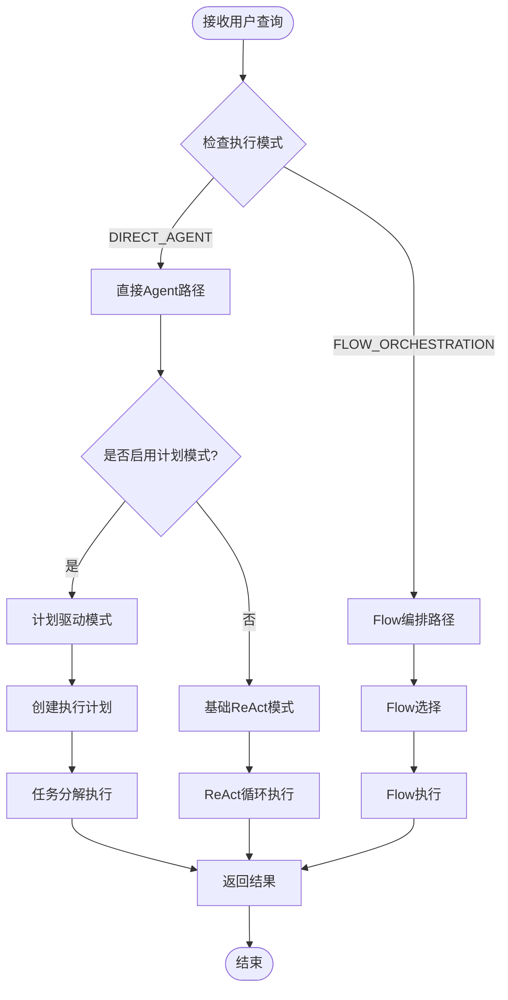
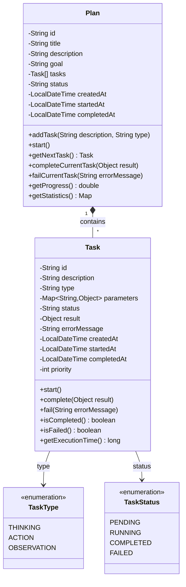
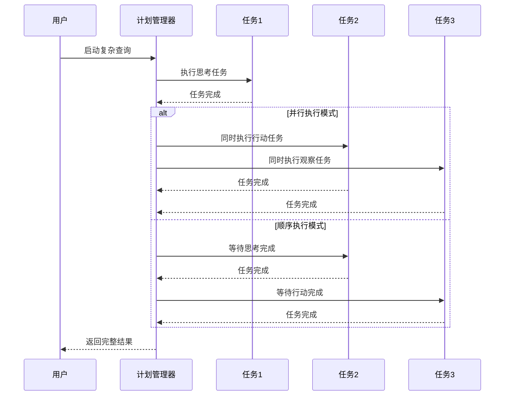
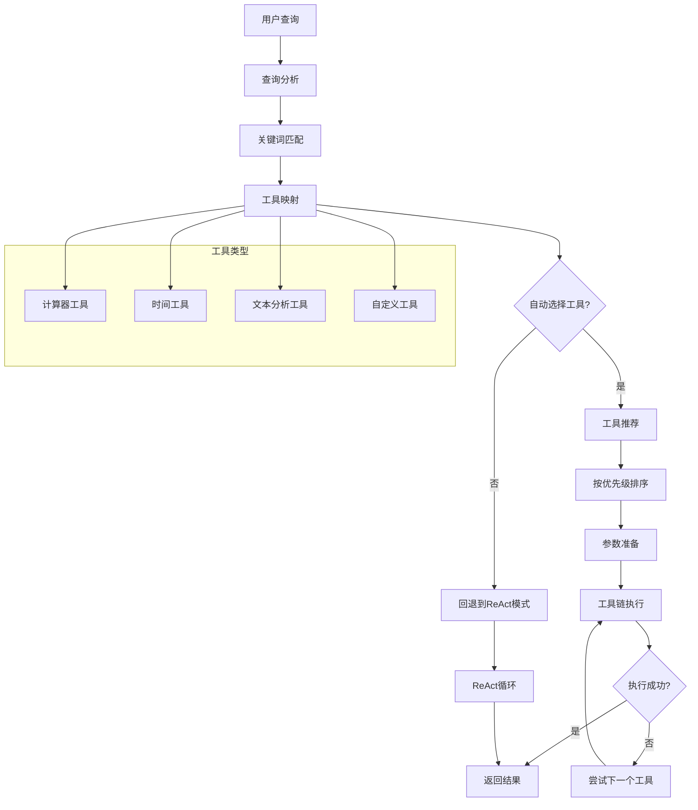
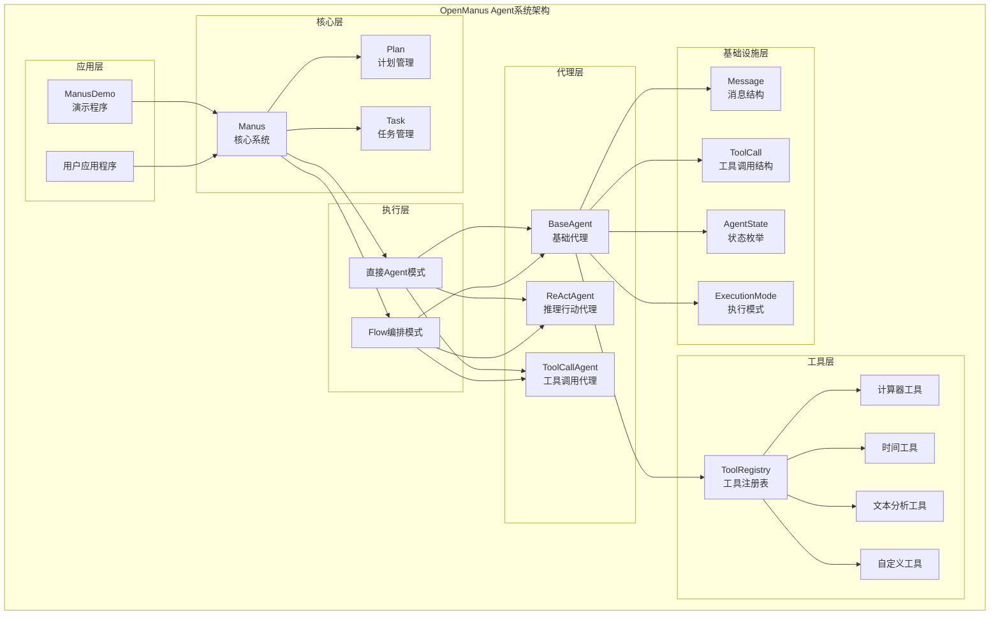
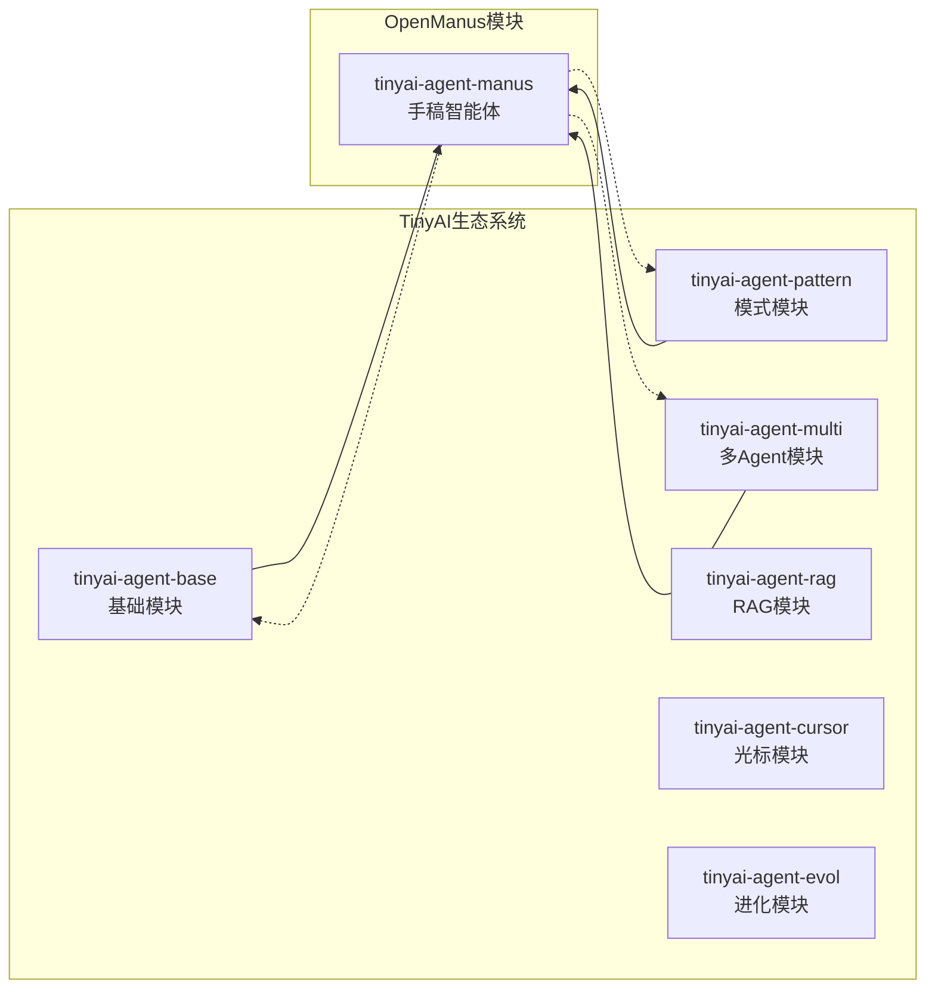
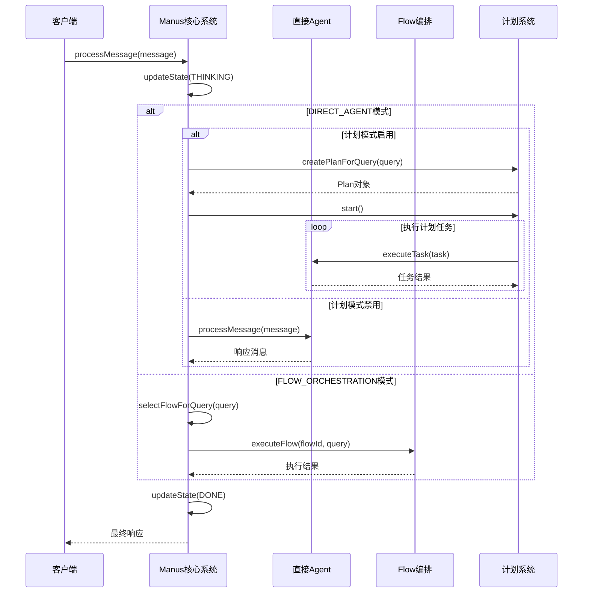

# 手稿智能体文档

<cite>
**本文档引用的文件**
- [README.md](file://tinyai-agent-manus/README.md)
- [Manus.java](file://tinyai-agent-manus/src/main/java/io/leavesfly/tinyai/agent/manus/Manus.java)
- [BaseAgent.java](file://tinyai-agent-manus/src/main/java/io/leavesfly/tinyai/agent/manus/BaseAgent.java)
- [ReActAgent.java](file://tinyai-agent-manus/src/main/java/io/leavesfly/tinyai/agent/manus/ReActAgent.java)
- [ToolCallAgent.java](file://tinyai-agent-manus/src/main/java/io/leavesfly/tinyai/agent/manus/ToolCallAgent.java)
- [ExecutionMode.java](file://tinyai-agent-manus/src/main/java/io/leavesfly/tinyai/agent/manus/ExecutionMode.java)
- [FlowDefinition.java](file://tinyai-agent-manus/src/main/java/io/leavesfly/tinyai/agent/manus/FlowDefinition.java)
- [Plan.java](file://tinyai-agent-manus/src/main/java/io/leavesfly/tinyai/agent/manus/Plan.java)
- [Task.java](file://tinyai-agent-manus/src/main/java/io/leavesfly/tinyai/agent/manus/Task.java)
- [AgentState.java](file://tinyai-agent-manus/src/main/java/io/leavesfly/tinyai/agent/manus/AgentState.java)
- [ManusDemo.java](file://tinyai-agent-manus/src/main/java/io/leavesfly/tinyai/agent/manus/ManusDemo.java)
- [pom.xml](file://tinyai-agent-manus/pom.xml)
</cite>

## 目录
1. [项目概述](#项目概述)
2. [核心特征](#核心特征)
3. [四层分层架构](#四层分层架构)
4. [双执行模式](#双执行模式)
5. [计划驱动任务分解](#计划驱动任务分解)
6. [动态工具调用](#动态工具调用)
7. [系统架构](#系统架构)
8. [核心组件详解](#核心组件详解)
9. [使用示例](#使用示例)
10. [部署指南](#部署指南)
11. [总结](#总结)

## 项目概述

OpenManus Agent系统是基于Python版本的OpenManus Agent系统成功实现的Java版本完整移植项目。该项目复用了TinyAI项目中已有的`tinyai-agent-*`模块的实现，最大化地减少了第三方库依赖，为Java开发者提供了一个功能强大且高度可扩展的智能代理系统。

### 主要特点

- **跨语言移植**：成功将Python版本的功能完整移植到Java平台
- **模块化设计**：充分利用现有TinyAI模块，降低维护成本
- **类型安全**：利用Java的强类型系统提供更好的代码质量
- **性能优化**：得益于JVM优化，具有更好的运行性能
- **生态系统集成**：更好地融入Java生态系统

## 核心特征

OpenManus Agent系统具备四大核心特征，这些特征共同构成了一个完整的智能代理解决方案：

### 1. 双执行机制

系统支持两种不同的执行模式，能够根据具体需求灵活切换：

- **直接Agent模式**：基于ReAct（推理-行动）模式的基础执行机制
- **Flow编排模式**：根据查询类型自动选择合适的工作流程执行

### 2. 分层架构

系统采用精心设计的四层架构，每一层都有明确的职责和功能：

```
BaseAgent (基础层) 
    ↓
ReActAgent (推理行动层)
    ↓  
ToolCallAgent (工具调用层)
    ↓
Manus (核心控制层)
```

### 3. 计划驱动任务分解

支持复杂任务的自动分解和执行，提供完整的任务生命周期管理：

- 支持复杂任务的自动分解
- 提供任务执行状态跟踪
- 支持顺序和并行执行模式

### 4. 动态工具调用

智能的工具推荐和选择机制，支持自定义工具注册：

- 智能工具推荐和选择
- 支持自定义工具注册
- 工具使用统计和监控

## 四层分层架构

OpenManus Agent系统采用清晰的四层分层架构设计，每一层都承担着特定的功能职责，形成了一个完整的代理系统架构。

```mermaid
graph TD
subgraph "OpenManus 四层架构"
subgraph "第一层: BaseAgent<br/>基础层"
BA[BaseAgent<br/>基础代理类]
BA --> |"消息处理"<br/>|"BM[消息管理]"
BA --> |"工具注册"<br/>|"BR[工具注册表]"
BA --> |"状态管理"<br/>|"BS[状态跟踪]"
end
subgraph "第二层: ReActAgent<br/>推理行动层"
RA[ReActAgent<br/>推理行动代理]
RA --> |"ReAct循环"<br/>|"RC[思考→行动→观察]"
RA --> |"模式配置"<br/>|"RM[详细模式/迭代限制]"
end
subgraph "第三层: ToolCallAgent<br/>工具调用层"
TCA[ToolCallAgent<br/>工具调用代理]
TCA --> |"智能推荐"<br/>|"TR[工具推荐算法]"
TCA --> |"参数准备"<br/>|"TP[参数提取]"
TCA --> |"执行链路"<br/>|"TE[工具链执行]"
end
subgraph "第四层: Manus<br/>核心控制层"
M[Manus<br/>核心系统]
M --> |"执行模式"<br/>|"EM[DIRECT_AGENT/<br/>FLOW_ORCHESTRATION]"]
M --> |"计划管理"<br/>|"PM[Plan/Task管理]"]
M --> |"Flow编排"<br/>|"FM[Flow定义/执行]"]
end
end
BA --> RA
RA --> TCA
TCA --> M
subgraph "工具层"
T1[计算器工具]
T2[时间工具]
T3[文本分析工具]
T4[自定义工具]
end
BR --> T1
BR --> T2
BR --> T3
BR --> T4
```

**图表来源**
- [BaseAgent.java](file://tinyai-agent-manus/src/main/java/io/leavesfly/tinyai/agent/manus/BaseAgent.java#L1-L50)
- [ReActAgent.java](file://tinyai-agent-manus/src/main/java/io/leavesfly/tinyai/agent/manus/ReActAgent.java#L1-L50)
- [ToolCallAgent.java](file://tinyai-agent-manus/src/main/java/io/leavesfly/tinyai/agent/manus/ToolCallAgent.java#L1-L50)
- [Manus.java](file://tinyai-agent-manus/src/main/java/io/leavesfly/tinyai/agent/manus/Manus.java#L1-L50)

### 第一层：BaseAgent（基础层）

BaseAgent是整个架构的基础层，提供所有Agent的基本功能：

- **消息管理**：维护消息历史记录，支持消息添加和检索
- **工具注册表**：集成ToolRegistry，支持工具的注册和调用
- **状态管理**：跟踪Agent的当前状态和活动时间
- **默认工具**：预注册计算器、时间查询和文本分析工具

### 第二层：ReActAgent（推理行动层）

ReActAgent实现了经典的ReAct（Reasoning and Acting）模式：

- **ReAct循环**：实现思考→行动→观察的完整循环
- **模式配置**：支持详细模式和最大迭代次数配置
- **智能解析**：根据用户输入智能选择合适的工具

### 第三层：ToolCallAgent（工具调用层）

ToolCallAgent增强了工具调用能力：

- **工具映射**：支持关键词到工具的映射关系
- **自动工具推荐**：基于查询内容自动推荐合适的工具
- **工具使用统计**：记录工具使用情况和偏好设置

### 第四层：Manus（核心控制层）

Manus是系统的最上层，负责整体协调和控制：

- **双执行机制**：支持直接Agent模式和Flow编排模式
- **计划驱动**：支持复杂任务的计划和分解
- **系统监控**：提供完整的系统状态和统计信息

**章节来源**
- [BaseAgent.java](file://tinyai-agent-manus/src/main/java/io/leavesfly/tinyai/agent/manus/BaseAgent.java#L1-L241)
- [ReActAgent.java](file://tinyai-agent-manus/src/main/java/io/leavesfly/tinyai/agent/manus/ReActAgent.java#L1-L358)
- [ToolCallAgent.java](file://tinyai-agent-manus/src/main/java/io/leavesfly/tinyai/agent/manus/ToolCallAgent.java#L1-L395)
- [Manus.java](file://tinyai-agent-manus/src/main/java/io/leavesfly/tinyai/agent/manus/Manus.java#L1-L539)

## 双执行模式

OpenManus Agent系统的核心创新之一是其双执行模式机制，这种设计使得系统能够根据不同类型的查询需求选择最适合的执行策略。

### 执行模式概述

系统支持两种主要的执行模式：



**图表来源**
- [Manus.java](file://tinyai-agent-manus/src/main/java/io/leavesfly/tinyai/agent/manus/Manus.java#L100-L150)
- [ExecutionMode.java](file://tinyai-agent-manus/src/main/java/io/leavesfly/tinyai/agent/manus/ExecutionMode.java#L1-L35)

### 直接Agent模式

直接Agent模式基于ReAct（推理-行动）模式，是最基础也是最灵活的执行方式：

#### 基础ReAct模式

在基础ReAct模式下，系统会执行完整的推理-行动-观察循环：

```java
// 基础ReAct执行流程
for (int iteration = 0; iteration < maxIterations; iteration++) {
    // 1. 思考阶段
    String thought = think(query, context);
    
    // 2. 行动阶段（如果需要）
    if (shouldAct(thought)) {
        String action = planAction(thought);
        String observation = executeAction(action);
        
        // 3. 观察阶段
        if (isGoalReached(observation, query)) {
            break;
        }
    }
}
```

#### 计划驱动模式

当启用计划模式时，系统会自动创建和执行复杂的执行计划：

```java
// 计划创建逻辑
private Plan createPlanForQuery(String query) {
    Plan plan = new Plan("处理查询：" + query.substring(0, Math.min(query.length(), 20)), 
                       "分析并回答用户的查询");
    
    if (query.contains("详细") || query.contains("深入")) {
        // 复杂查询需要多步骤处理
        plan.addTask("分析查询意图", "thinking");
        plan.addTask("收集相关信息", "action");
        plan.addTask("整合分析结果", "thinking");
        plan.addTask("生成详细回答", "action");
    } else {
        // 简单查询
        plan.addTask("理解查询", "thinking");
        plan.addTask("执行相应操作", "action");
        plan.addTask("生成回答", "thinking");
    }
    
    return plan;
}
```

### Flow编排模式

Flow编排模式是一种基于预定义工作流程的执行方式，系统会根据查询内容自动选择最合适的工作流程：

#### Flow选择机制

```java
// Flow选择算法
private String selectFlowForQuery(String query) {
    Map<String, Integer> flowScores = new HashMap<>();
    
    for (Map.Entry<String, String> mapping : flowMappings.entrySet()) {
        String keyword = mapping.getKey();
        String flowId = mapping.getValue();
        
        if (query.contains(keyword)) {
            flowScores.merge(flowId, 1, Integer::sum);
        }
    }
    
    // 返回分数最高的Flow
    return flowScores.entrySet().stream()
            .max(Map.Entry.comparingByValue())
            .map(Map.Entry::getKey)
            .orElse(null);
}
```

#### 内置Flow示例

系统预定义了几个常用的Flow：

1. **计算Flow**：专门处理数学计算
2. **时间查询Flow**：处理时间相关查询
3. **分析Flow**：处理文本分析任务

```java
// 默认Flow注册
private void registerDefaultFlows() {
    // 计算Flow
    FlowDefinition calculationFlow = new FlowDefinition("计算流程", "专门处理数学计算的流程");
    Map<String, Object> calcNodes = new HashMap<>();
    calcNodes.put("type", "tool");
    calcNodes.put("name", "calculator");
    calcNodes.put("description", "执行数学计算");
    calculationFlow.setNodes(calcNodes);
    registerFlow("calculation_flow", calculationFlow);
}
```

**章节来源**
- [Manus.java](file://tinyai-agent-manus/src/main/java/io/leavesfly/tinyai/agent/manus/Manus.java#L100-L300)
- [ReActAgent.java](file://tinyai-agent-manus/src/main/java/io/leavesfly/tinyai/agent/manus/ReActAgent.java#L50-L150)
- [ExecutionMode.java](file://tinyai-agent-manus/src/main/java/io/leavesfly/tinyai/agent/manus/ExecutionMode.java#L1-L35)

## 计划驱动任务分解

OpenManus Agent系统的一个重要特性是其计划驱动的任务分解能力，这种能力使得系统能够处理复杂的多步骤任务。

### 计划系统架构



**图表来源**
- [Plan.java](file://tinyai-agent-manus/src/main/java/io/leavesfly/tinyai/agent/manus/Plan.java#L1-L100)
- [Task.java](file://tinyai-agent-manus/src/main/java/io/leavesfly/tinyai/agent/manus/Task.java#L1-L100)

### 计划创建和管理

#### 自动计划创建

系统能够根据查询内容自动创建相应的执行计划：

```java
// 查询分析和计划创建
private Plan createPlanForQuery(String query) {
    Plan plan = new Plan("处理查询：" + query.substring(0, Math.min(query.length(), 20)) + "...", 
                       "分析并回答用户的查询");
    
    // 根据查询复杂度添加不同数量的任务
    if (query.contains("详细") || query.contains("深入") || query.contains("完整")) {
        // 复杂查询需要多步骤处理
        plan.addTask("分析查询意图", "thinking");
        plan.addTask("收集相关信息", "action");
        plan.addTask("整合分析结果", "thinking");
        plan.addTask("生成详细回答", "action");
    } else {
        // 简单查询
        plan.addTask("理解查询", "thinking");
        plan.addTask("执行相应操作", "action");
        plan.addTask("生成回答", "thinking");
    }
    
    return plan;
}
```

#### 任务类型和状态

系统支持三种主要的任务类型：

1. **思考任务（THINKING）**：需要进行分析和推理的任务
2. **行动任务（ACTION）**：需要执行具体操作的任务
3. **观察任务（OBSERVATION）**：需要观察和评估结果的任务

### 并行和顺序执行



**图表来源**
- [Plan.java](file://tinyai-agent-manus/src/main/java/io/leavesfly/tinyai/agent/manus/Plan.java#L80-L120)

### 执行统计和监控

系统提供详细的执行统计信息：

```java
// 执行统计信息
public Map<String, Object> getStatistics() {
    Map<String, Object> stats = new HashMap<>();
    stats.put("total_tasks", tasks.size());
    stats.put("completed_tasks", (int) tasks.stream().mapToLong(task -> task.isCompleted() ? 1 : 0).sum());
    stats.put("failed_tasks", (int) tasks.stream().mapToLong(task -> task.isFailed() ? 1 : 0).sum());
    stats.put("running_tasks", (int) tasks.stream().mapToLong(task -> task.isRunning() ? 1 : 0).sum());
    stats.put("progress", getProgress());
    stats.put("status", status);
    
    if (startedAt != null) {
        long executionTime = Duration.between(startedAt, 
            completedAt != null ? completedAt : LocalDateTime.now()).toMillis();
        stats.put("execution_time_ms", executionTime);
    }
    
    return stats;
}
```

**章节来源**
- [Plan.java](file://tinyai-agent-manus/src/main/java/io/leavesfly/tinyai/agent/manus/Plan.java#L1-L315)
- [Task.java](file://tinyai-agent-manus/src/main/java/io/leavesfly/tinyai/agent/manus/Task.java#L1-L204)
- [Manus.java](file://tinyai-agent-manus/src/main/java/io/leavesfly/tinyai/agent/manus/Manus.java#L220-L280)

## 动态工具调用

OpenManus Agent系统提供了智能的动态工具调用机制，这是系统灵活性和可扩展性的关键所在。

### 工具调用架构



**图表来源**
- [ToolCallAgent.java](file://tinyai-agent-manus/src/main/java/io/leavesfly/tinyai/agent/manus/ToolCallAgent.java#L80-L150)

### 工具映射和推荐

#### 智能工具推荐

系统通过关键词匹配和语义分析来推荐最适合的工具：

```java
// 工具推荐算法
private List<String> recommendTools(String query) {
    List<String> recommended = new ArrayList<>();
    Map<String, Integer> toolScores = new HashMap<>();
    
    // 计算每个工具的匹配分数
    for (Map.Entry<String, String> mapping : toolMappings.entrySet()) {
        String keyword = mapping.getKey();
        String tool = mapping.getValue();
        
        if (query.contains(keyword)) {
            toolScores.merge(tool, 1, Integer::sum);
        }
    }
    
    // 特殊模式检测
    if (containsMathExpression(query)) {
        toolScores.merge("calculator", 5, Integer::sum);
    }
    
    if (containsTimeQuery(query)) {
        toolScores.merge("get_time", 3, Integer::sum);
    }
    
    if (containsTextAnalysisRequest(query)) {
        toolScores.merge("text_analyzer", 3, Integer::sum);
    }
    
    // 按分数排序并返回推荐工具
    toolScores.entrySet().stream()
            .filter(entry -> entry.getValue() > 0)
            .sorted(Map.Entry.<String, Integer>comparingByValue().reversed())
            .map(Map.Entry::getKey)
            .forEach(recommended::add);
    
    return recommended;
}
```

#### 参数自动提取

系统能够自动从查询中提取所需的参数：

```java
// 参数提取示例
private Map<String, Object> prepareToolArguments(String toolName, String query) {
    Map<String, Object> arguments = new HashMap<>();
    
    switch (toolName) {
        case "calculator":
            String expression = extractMathExpression(query);
            if (expression != null) {
                arguments.put("expression", expression);
            }
            break;
            
        case "text_analyzer":
            String textToAnalyze = extractTextForAnalysis(query);
            arguments.put("text", textToAnalyze);
            break;
            
        case "get_time":
            // 时间工具不需要参数
            break;
            
        default:
            arguments.put("query", query);
            break;
    }
    
    return arguments;
}
```

### 自定义工具注册

系统支持动态注册自定义工具：

```java
// 自定义工具注册
public void registerCustomTool(String name, Function<Map<String, Object>, Object> function, String description) {
    toolRegistry.register(name, function, description);
}

// 使用示例
manus.registerCustomTool("custom_analysis", args -> {
    String text = (String) args.get("text");
    // 执行自定义分析逻辑
    return performCustomAnalysis(text);
}, "自定义文本分析工具");
```

### 工具使用统计

系统提供详细的工具使用统计：

```java
// 工具使用统计
private Map<String, Integer> toolUsageCount; // 工具使用计数

// 在工具调用后更新统计
private ToolCall executeSpecificTool(String toolName, String query) {
    Map<String, Object> arguments = prepareToolArguments(toolName, query);
    ToolCall result = callTool(toolName, arguments);
    
    // 更新使用统计
    toolUsageCount.merge(toolName, 1, Integer::sum);
    
    return result;
}
```

**章节来源**
- [ToolCallAgent.java](file://tinyai-agent-manus/src/main/java/io/leavesfly/tinyai/agent/manus/ToolCallAgent.java#L80-L200)
- [BaseAgent.java](file://tinyai-agent-manus/src/main/java/io/leavesfly/tinyai/agent/manus/BaseAgent.java#L50-L100)

## 系统架构

OpenManus Agent系统采用了模块化的架构设计，充分利用了现有的TinyAI生态系统，形成了一个完整的智能代理解决方案。

### 整体架构图



**图表来源**
- [Manus.java](file://tinyai-agent-manus/src/main/java/io/leavesfly/tinyai/agent/manus/Manus.java#L1-L50)
- [pom.xml](file://tinyai-agent-manus/pom.xml#L1-L58)

### 依赖关系分析

系统充分利用了TinyAI项目中的现有模块：



**图表来源**
- [pom.xml](file://tinyai-agent-manus/pom.xml#L25-L40)

### 核心依赖模块

#### 1. tinyai-agent-base
- **Message**：消息结构，支持角色、内容、时间戳和元数据
- **ToolCall**：工具调用结构，支持参数、结果和错误处理
- **ToolRegistry**：工具注册表，支持工具注册、调用和管理

#### 2. tinyai-agent-pattern
- 提供Agent模式相关实现
- 包含ReActAgent等模式实现

#### 3. tinyai-agent-multi
- 提供多Agent协作功能
- 支持Agent间的消息传递和协调

**章节来源**
- [pom.xml](file://tinyai-agent-manus/pom.xml#L1-L58)

## 核心组件详解

### Manus核心系统

Manus是OpenManus Agent系统的核心组件，位于四层架构的最顶层，负责整体协调和控制。

#### 核心属性和配置

```java
public class Manus extends ToolCallAgent {
    // 执行模式和配置
    private ExecutionMode executionMode;            // 当前执行模式
    private boolean planningEnabled;                // 是否启用计划模式
    private Plan currentPlan;                       // 当前执行的计划
    
    // Flow管理
    private Map<String, FlowDefinition> registeredFlows;  // 注册的Flow
    private Map<String, String> flowMappings;             // Flow映射
    
    // 统计和监控
    private Map<String, Object> systemMetrics;     // 系统指标
    private LocalDateTime systemStartTime;         // 系统启动时间
    private int totalProcessedMessages;            // 处理的消息总数
    private int totalExecutedPlans;                // 执行的计划总数
    private int totalFlowExecutions;               // Flow执行总数
}
```

#### 执行模式切换机制



**图表来源**
- [Manus.java](file://tinyai-agent-manus/src/main/java/io/leavesfly/tinyai/agent/manus/Manus.java#L100-L200)

### 状态管理系统

系统定义了完整的Agent状态枚举：

```java
public enum AgentState {
    IDLE("空闲"),           // 空闲状态
    THINKING("思考"),       // 思考状态
    ACTING("行动"),         // 行动状态
    OBSERVING("观察"),      // 观察状态
    REFLECTING("反思"),     // 反思状态
    PLANNING("计划"),       // 计划状态
    DONE("完成"),           // 完成状态
    ERROR("错误");          // 错误状态
}
```

### Flow编排系统

Flow编排系统允许定义和执行预定义的工作流程：

```java
public class FlowDefinition {
    private String name;                    // Flow名称
    private String description;             // 描述
    private Map<String, Object> nodes;      // 节点配置
    private LocalDateTime createdAt;        // 创建时间
    
    // 支持动态添加和移除节点
    public void addNode(String key, Object value) {
        this.nodes.put(key, value);
    }
    
    public Object removeNode(String key) {
        return this.nodes.remove(key);
    }
}
```

**章节来源**
- [Manus.java](file://tinyai-agent-manus/src/main/java/io/leavesfly/tinyai/agent/manus/Manus.java#L1-L200)
- [AgentState.java](file://tinyai-agent-manus/src/main/java/io/leavesfly/tinyai/agent/manus/AgentState.java#L1-L63)
- [FlowDefinition.java](file://tinyai-agent-manus/src/main/java/io/leavesfly/tinyai/agent/manus/FlowDefinition.java#L1-L88)

## 使用示例

### 基础使用示例

#### 创建和配置Manus实例

```java
// 创建Manus实例
Manus manus = new Manus("MyAgent");

// 配置执行模式
manus.setExecutionMode(ExecutionMode.DIRECT_AGENT);
manus.setPlanningEnabled(true); // 启用计划模式

// 注册自定义工具
manus.registerCustomTool("custom_analysis", args -> {
    String text = (String) args.get("text");
    return performCustomAnalysis(text);
}, "自定义文本分析工具");
```

#### 处理用户消息

```java
// 处理用户消息
Message userMessage = new Message("user", "计算 100 * 25 + 50");
Message response = manus.processMessage(userMessage);

// 获取系统状态
Map<String, Object> status = manus.getSystemStatus();
System.out.println("当前状态: " + status.get("current_state"));
System.out.println("处理消息数: " + status.get("total_messages"));
```

### 执行模式演示

#### 直接Agent模式

```java
// 直接Agent模式演示
Manus directAgent = new Manus("DirectAgent");
directAgent.setExecutionMode(ExecutionMode.DIRECT_AGENT);
directAgent.setPlanningEnabled(false);

Message query = new Message("user", "计算 25 * 8 + 15");
Message response = directAgent.processMessage(query);
System.out.println("直接Agent结果: " + response.getContent());
```

#### Flow编排模式

```java
// Flow编排模式演示
Manus flowAgent = new Manus("FlowAgent");
flowAgent.setExecutionMode(ExecutionMode.FLOW_ORCHESTRATION);

Message query = new Message("user", "查询当前时间");
Message response = flowAgent.processMessage(query);
System.out.println("Flow编排结果: " + response.getContent());
```

#### 计划驱动模式

```java
// 计划驱动模式演示
Manus planningAgent = new Manus("PlanningAgent");
planningAgent.setExecutionMode(ExecutionMode.DIRECT_AGENT);
planningAgent.setPlanningEnabled(true);

Message complexQuery = new Message("user", "详细分析计算 100 * 25 的结果");
Message response = planningAgent.processMessage(complexQuery);
System.out.println("计划驱动结果: " + response.getContent());
```

### 高级功能使用

#### 自定义Flow定义

```java
// 定义自定义Flow
FlowDefinition customFlow = new FlowDefinition("自定义分析流程", "处理复杂分析任务的流程");
Map<String, Object> nodes = new HashMap<>();
nodes.put("type", "tool");
nodes.put("name", "custom_analysis");
nodes.put("description", "执行自定义分析");
customFlow.setNodes(nodes);

// 注册Flow
manus.registerFlow("custom_analysis_flow", customFlow);
```

#### 任务监控和统计

```java
// 获取系统监控信息
Map<String, Object> systemStatus = manus.getSystemStatus();

// 获取当前计划信息
Plan currentPlan = manus.getCurrentPlan();
if (currentPlan != null) {
    Map<String, Object> planStats = currentPlan.getStatistics();
    System.out.println("计划进度: " + planStats.get("progress"));
    System.out.println("已完成任务: " + planStats.get("completed_tasks"));
}
```

**章节来源**
- [ManusDemo.java](file://tinyai-agent-manus/src/main/java/io/leavesfly/tinyai/agent/manus/ManusDemo.java#L100-L200)

## 部署指南

### 系统要求

- **Java版本**: Java 17或更高版本
- **构建工具**: Maven 3.6+
- **内存要求**: 至少512MB可用内存
- **存储空间**: 至少100MB可用磁盘空间

### 构建步骤

#### 1. 构建整个项目

```bash
# 导航到项目根目录
cd 

# 设置Java环境变量
export JAVA_HOME="/Library/Java/JavaVirtualMachines/jdk-17.jdk/Contents/Home"

# 清理并构建项目
mvn clean install -DskipTests
```

#### 2. 运行测试

```bash
# 运行Manus模块的测试
mvn test -pl tinyai-agent-manus
```

#### 3. 运行演示程序

```bash
# 运行Manus演示程序
mvn exec:java -pl tinyai-agent-manus -Dexec.mainClass="io.leavesfly.tinyai.agent.manus.ManusDemo"
```

### 项目结构

```
tinyai-agent-manus/
├── src/main/java/io/leavesfly/tinyai/agent/manus/
│   ├── AgentState.java           # Agent状态枚举
│   ├── ExecutionMode.java        # 执行模式枚举
│   ├── FlowDefinition.java       # Flow定义类
│   ├── Task.java                 # 任务类
│   ├── Plan.java                 # 计划类
│   ├── BaseAgent.java            # 基础Agent抽象类
│   ├── ReActAgent.java           # ReAct推理行动Agent
│   ├── ToolCallAgent.java        # 工具调用Agent
│   ├── Manus.java                # 核心系统类
│   ├── ManusDemo.java            # 演示程序
│   └── OpenManusDemo.java        # 已有的演示程序（保留）
├── src/test/java/io/leavesfly/tinyai/agent/manus/
│   ├── ManusTest.java            # 核心功能测试
│   └── PlanTaskTest.java         # 计划任务测试
├── doc/
│   └── manus.py                  # Python参考实现
├── pom.xml                       # Maven配置文件
└── README.md                     # 本文档
```

### 依赖管理

项目通过Maven管理依赖，主要依赖包括：

```xml
<dependencies>
    <!-- 核心依赖 -->
    <dependency>
        <groupId>io.leavesfly.tinyai</groupId>
        <artifactId>tinyai-agent-base</artifactId>
    </dependency>
    
    <dependency>
        <groupId>io.leavesfly.tinyai</groupId>
        <artifactId>tinyai-agent-pattern</artifactId>
    </dependency>
    
    <dependency>
        <groupId>io.leavesfly.tinyai</groupId>
        <artifactId>tinyai-agent-multi</artifactId>
    </dependency>
    
    <!-- 测试依赖 -->
    <dependency>
        <groupId>junit</groupId>
        <artifactId>junit</artifactId>
        <scope>test</scope>
    </dependency>
</dependencies>
```

### 配置选项

#### 系统配置

```java
// 配置系统参数
manus.setPlanningEnabled(true);                    // 启用计划模式
manus.setExecutionMode(ExecutionMode.DIRECT_AGENT); // 设置执行模式

// 配置工具偏好
List<String> preferredTools = Arrays.asList("calculator", "text_analyzer");
manus.getToolCallAgent().setPreferredTools(preferredTools);
```

#### 性能调优

```java
// 调整ReActAgent参数
ReActAgent reactAgent = manus.getReActAgent();
reactAgent.setMaxIterations(15);        // 增加最大迭代次数
reactAgent.setVerboseMode(true);        // 启用详细模式
```

**章节来源**
- [README.md](file://tinyai-agent-manus/README.md#L200-L313)
- [pom.xml](file://tinyai-agent-manus/pom.xml#L1-L58)

## 总结

OpenManus Agent系统是一个功能完整、架构清晰的智能代理解决方案，它成功地将Python版本的功能完整移植到了Java平台，并在此基础上进行了多项优化和改进。

### 主要成就

1. **完整功能实现**：成功复制了Python版本的全部核心功能，包括四大核心特征
2. **架构优化**：采用了更清晰的分层架构设计，提供了更好的模块化和可扩展性
3. **类型安全**：利用Java的强类型系统提供更好的代码质量和安全性
4. **性能优化**：得益于JVM优化，具有更好的运行性能
5. **生态集成**：更好地集成了Java生态系统，便于企业级应用开发

### 技术优势

- **模块化设计**：清晰的分层架构，易于扩展和维护
- **接口抽象**：良好的抽象设计，支持多种实现方式
- **组合模式**：灵活的组件组合，支持功能定制
- **智能缓存**：工具调用结果缓存，减少重复计算
- **并行支持**：支持任务并行执行，提高处理效率
- **监控调试**：完整的状态跟踪和统计信息

### 应用价值

OpenManus Agent系统为Java开发者提供了一个功能强大且高度可扩展的智能代理解决方案，适用于各种需要自动化决策和任务执行的应用场景，包括：

- **智能客服系统**
- **自动化数据分析**
- **业务流程自动化**
- **知识管理系统**
- **多Agent协作系统**

通过其双执行模式、分层架构、计划驱动任务分解和动态工具调用等核心特性，OpenManus Agent系统能够满足从简单查询到复杂任务的各种需求，为企业数字化转型提供了强有力的技术支撑。