# 手稿智能体架构文档

<cite>
**本文档引用的文件**
- [Manus.java](file://tinyai-agent-manus/src/main/java/io/leavesfly/tinyai/agent/manus/Manus.java)
- [ReActAgent.java](file://tinyai-agent-manus/src/main/java/io/leavesfly/tinyai/agent/manus/ReActAgent.java)
- [ToolCallAgent.java](file://tinyai-agent-manus/src/main/java/io/leavesfly/tinyai/agent/manus/ToolCallAgent.java)
- [BaseAgent.java](file://tinyai-agent-manus/src/main/java/io/leavesfly/tinyai/agent/BaseAgent.java)
- [AgentState.java](file://tinyai-agent-manus/src/main/java/io/leavesfly/tinyai/agent/manus/AgentState.java)
- [ExecutionMode.java](file://tinyai-agent-manus/src/main/java/io/leavesfly/tinyai/agent/manus/ExecutionMode.java)
- [Plan.java](file://tinyai-agent-manus/src/main/java/io/leavesfly/tinyai/agent/manus/Plan.java)
- [Task.java](file://tinyai-agent-manus/src/main/java/io/leavesfly/tinyai/agent/manus/Task.java)
- [FlowDefinition.java](file://tinyai-agent-manus/src/main/java/io/leavesfly/tinyai/agent/manus/FlowDefinition.java)
- [ManusTest.java](file://tinyai-agent-manus/src/test/java/io/leavesfly/tinyai/agent/manus/ManusTest.java)
- [README.md](file://tinyai-agent-manus/README.md)
</cite>

## 目录
1. [简介](#简介)
2. [项目结构](#项目结构)
3. [核心组件](#核心组件)
4. [架构概览](#架构概览)
5. [详细组件分析](#详细组件分析)
6. [双执行机制](#双执行机制)
7. [任务分解流程](#任务分解流程)
8. [工具调用系统](#工具调用系统)
9. [状态管理](#状态管理)
10. [性能考虑](#性能考虑)
11. [故障排除指南](#故障排除指南)
12. [结论](#结论)

## 简介

手稿智能体（OpenManus Agent系统）是一个基于Java实现的先进智能代理系统，专为复杂任务处理和自动化工作流设计。该系统采用创新的ReAct模式双执行机制，结合智能任务分解、动态工具调用和全面的状态管理，为企业级应用提供了强大而灵活的解决方案。

系统的核心特色包括：
- **双执行机制**：支持直接Agent模式和Flow编排模式的无缝切换
- **分层架构**：采用四层架构设计，确保代码的模块化和可扩展性
- **计划驱动**：自动任务分解和执行流程管理
- **动态工具调用**：智能工具推荐和自定义工具集成

## 项目结构

手稿智能体项目采用清晰的模块化结构，主要包含以下核心组件：

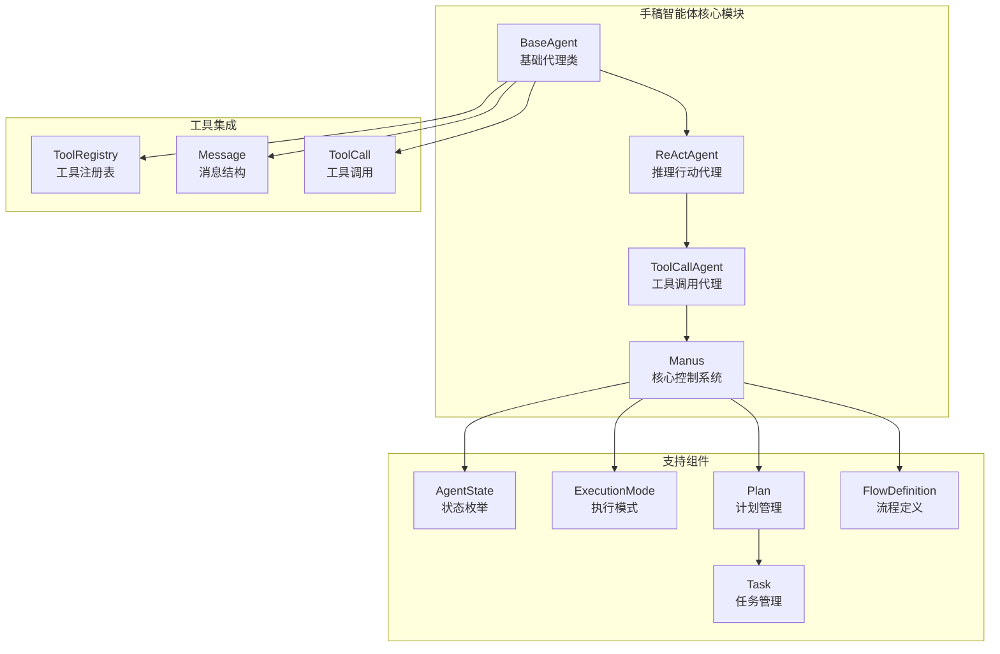
```mermaid
graph TB
subgraph "手稿智能体核心模块"
BaseAgent[BaseAgent<br/>基础代理类]
ReActAgent[ReActAgent<br/>推理行动代理]
ToolCallAgent[ToolCallAgent<br/>工具调用代理]
Manus[Manus<br/>核心控制系统]
end
subgraph "支持组件"
AgentState[AgentState<br/>状态枚举]
ExecutionMode[ExecutionMode<br/>执行模式]
Plan[Plan<br/>计划管理]
Task[Task<br/>任务管理]
FlowDefinition[FlowDefinition<br/>流程定义]
end
subgraph "工具集成"
ToolRegistry[ToolRegistry<br/>工具注册表]
Message[Message<br/>消息结构]
ToolCall[ToolCall<br/>工具调用]
end
BaseAgent --> ReActAgent
ReActAgent --> ToolCallAgent
ToolCallAgent --> Manus
Manus --> AgentState
Manus --> ExecutionMode
Manus --> Plan
Plan --> Task
Manus --> FlowDefinition
BaseAgent --> ToolRegistry
BaseAgent --> Message
BaseAgent --> ToolCall
```

**图表来源**
- [Manus.java](file://tinyai-agent-manus/src/main/java/io/leavesfly/tinyai/agent/manus/Manus.java#L1-L50)
- [ReActAgent.java](file://tinyai-agent-manus/src/main/java/io/leavesfly/tinyai/agent/manus/ReActAgent.java#L1-L30)
- [ToolCallAgent.java](file://tinyai-agent-manus/src/main/java/io/leavesfly/tinyai/agent/manus/ToolCallAgent.java#L1-L30)

**章节来源**
- [README.md](file://tinyai-agent-manus/README.md#L1-L50)

## 核心组件

手稿智能体系统由以下核心组件构成：

### 1. 状态管理组件
- **AgentState**：定义代理的生命周期状态
- **ExecutionMode**：控制系统的执行模式

### 2. 任务管理组件
- **Plan**：负责复杂任务的分解和编排
- **Task**：代表单个执行单元，支持状态跟踪

### 3. 流程管理组件
- **FlowDefinition**：定义可重用的工作流程
- **FlowRegistry**：管理注册的流程集合

### 4. 执行引擎
- **BaseAgent**：提供基础代理功能
- **ReActAgent**：实现ReAct推理-行动循环
- **ToolCallAgent**：增强工具调用能力
- **Manus**：核心控制系统，集成所有功能

**章节来源**
- [AgentState.java](file://tinyai-agent-manus/src/main/java/io/leavesfly/tinyai/agent/manus/AgentState.java#L1-L63)
- [ExecutionMode.java](file://tinyai-agent-manus/src/main/java/io/leavesfly/tinyai/agent/manus/ExecutionMode.java#L1-L35)
- [Plan.java](file://tinyai-agent-manus/src/main/java/io/leavesfly/tinyai/agent/manus/Plan.java#L1-L50)
- [Task.java](file://tinyai-agent-manus/src/main/java/io/leavesfly/tinyai/agent/manus/Task.java#L1-L50)

## 架构概览

手稿智能体采用四层分层架构设计，每一层都有明确的职责和功能边界：

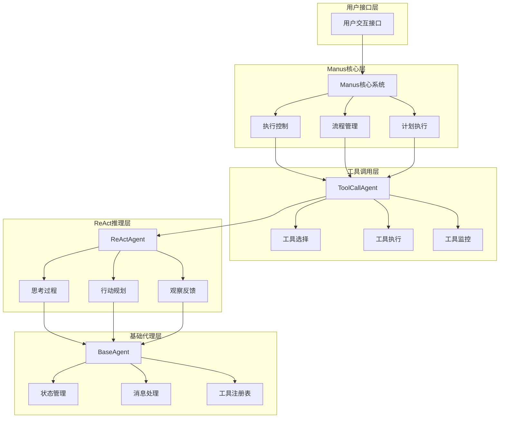
```mermaid
graph TD
subgraph "用户接口层"
UI[用户交互接口]
end
subgraph "Manus核心层"
ManusCore[Manus核心系统]
ExecutionControl[执行控制]
FlowManagement[流程管理]
PlanExecution[计划执行]
end
subgraph "工具调用层"
ToolAgent[ToolCallAgent]
ToolSelection[工具选择]
ToolExecution[工具执行]
ToolMonitoring[工具监控]
end
subgraph "ReAct推理层"
ReactAgent[ReActAgent]
ThoughtProcess[思考过程]
ActionPlanning[行动规划]
Observation[观察反馈]
end
subgraph "基础代理层"
BaseAgent[BaseAgent]
StateManagement[状态管理]
MessageHandling[消息处理]
ToolRegistry[工具注册表]
end
UI --> ManusCore
ManusCore --> ExecutionControl
ManusCore --> FlowManagement
ManusCore --> PlanExecution
ExecutionControl --> ToolAgent
FlowManagement --> ToolAgent
PlanExecution --> ToolAgent
ToolAgent --> ReactAgent
ToolAgent --> ToolSelection
ToolAgent --> ToolExecution
ToolAgent --> ToolMonitoring
ReactAgent --> ThoughtProcess
ReactAgent --> ActionPlanning
ReactAgent --> Observation
ThoughtProcess --> BaseAgent
ActionPlanning --> BaseAgent
Observation --> BaseAgent
BaseAgent --> StateManagement
BaseAgent --> MessageHandling
BaseAgent --> ToolRegistry
```

**图表来源**
- [Manus.java](file://tinyai-agent-manus/src/main/java/io/leavesfly/tinyai/agent/manus/Manus.java#L20-L50)
- [ToolCallAgent.java](file://tinyai-agent-manus/src/main/java/io/leavesfly/tinyai/agent/manus/ToolCallAgent.java#L20-L50)

这种分层架构的优势：
- **职责分离**：每层专注于特定的功能领域
- **可扩展性**：新功能可以添加到适当的层次
- **可维护性**：清晰的边界使得代码更容易理解和维护
- **测试友好**：每层都可以独立测试

**章节来源**
- [README.md](file://tinyai-agent-manus/README.md#L20-L40)

## 详细组件分析

### BaseAgent - 基础代理类

BaseAgent是整个系统的基础抽象类，提供了所有代理的核心功能：

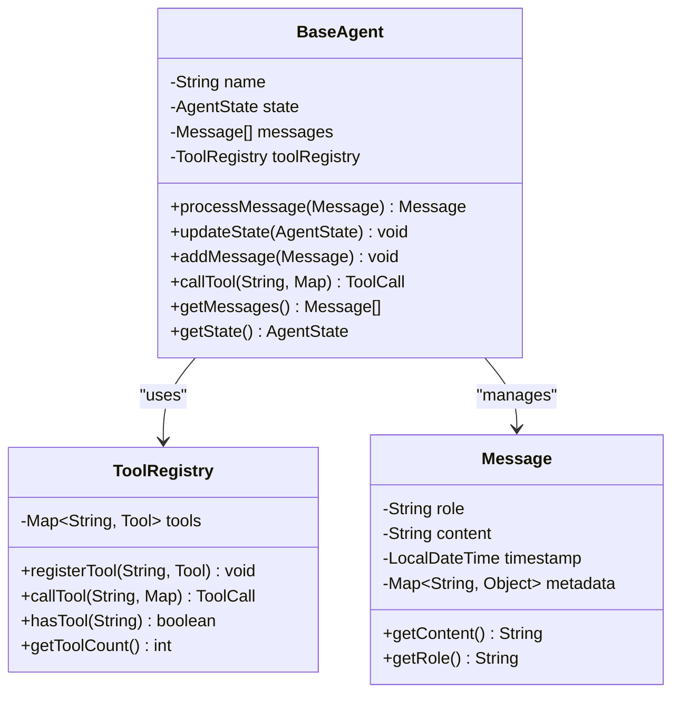
```mermaid
classDiagram
class BaseAgent {
-String name
-AgentState state
-Message[] messages
-ToolRegistry toolRegistry
+processMessage(Message) Message
+updateState(AgentState) void
+addMessage(Message) void
+callTool(String, Map) ToolCall
+getMessages() Message[]
+getState() AgentState
}
class ToolRegistry {
-Map~String, Tool~ tools
+registerTool(String, Tool) void
+callTool(String, Map) ToolCall
+hasTool(String) boolean
+getToolCount() int
}
class Message {
-String role
-String content
-LocalDateTime timestamp
-Map~String, Object~ metadata
+getContent() String
+getRole() String
}
BaseAgent --> ToolRegistry : "uses"
BaseAgent --> Message : "manages"
```

**图表来源**
- [BaseAgent.java](file://tinyai-agent-manus/src/main/java/io/leavesfly/tinyai/agent/BaseAgent.java#L1-L50)

### ReActAgent - 推理行动代理

ReActAgent实现了经典的ReAct（Reasoning and Acting）模式，包含思考、行动和观察三个阶段：

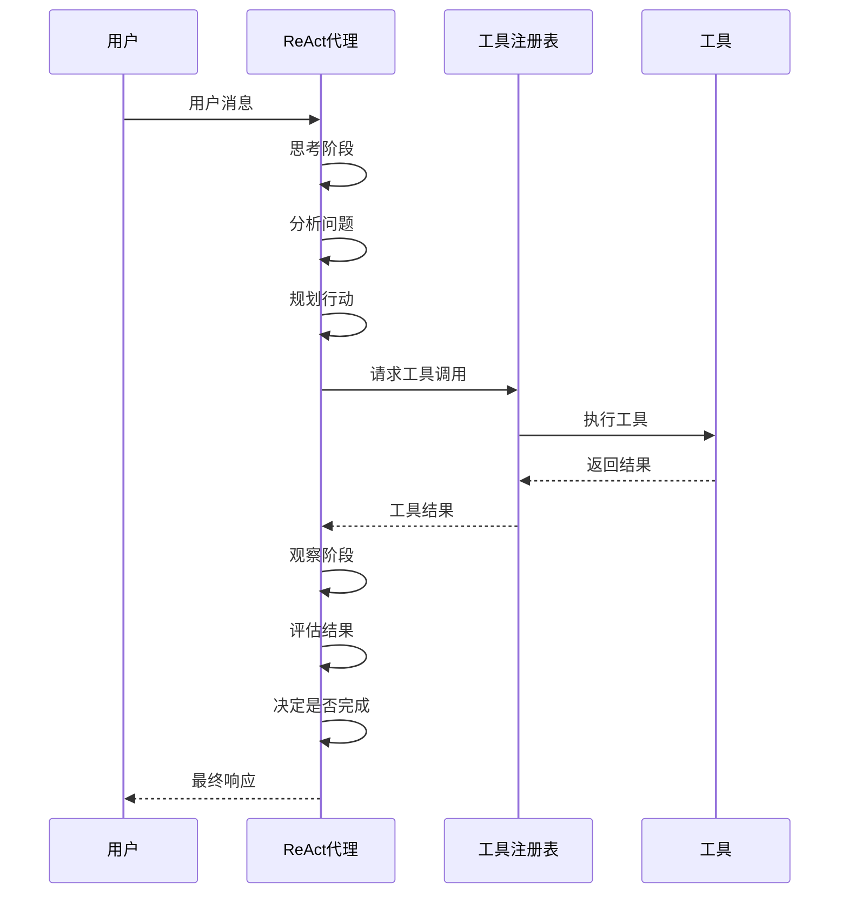
```mermaid
sequenceDiagram
participant User as 用户
participant ReActAgent as ReAct代理
participant ToolRegistry as 工具注册表
participant Tool as 工具
User->>ReActAgent : 用户消息
ReActAgent->>ReActAgent : 思考阶段
ReActAgent->>ReActAgent : 分析问题
ReActAgent->>ReActAgent : 规划行动
ReActAgent->>ToolRegistry : 请求工具调用
ToolRegistry->>Tool : 执行工具
Tool-->>ToolRegistry : 返回结果
ToolRegistry-->>ReActAgent : 工具结果
ReActAgent->>ReActAgent : 观察阶段
ReActAgent->>ReActAgent : 评估结果
ReActAgent->>ReActAgent : 决定是否完成
ReActAgent-->>User : 最终响应
```

**图表来源**
- [ReActAgent.java](file://tinyai-agent-manus/src/main/java/io/leavesfly/tinyai/agent/manus/ReActAgent.java#L40-L100)

### ToolCallAgent - 工具调用代理

ToolCallAgent在ReActAgent的基础上增强了智能工具选择和调用能力：

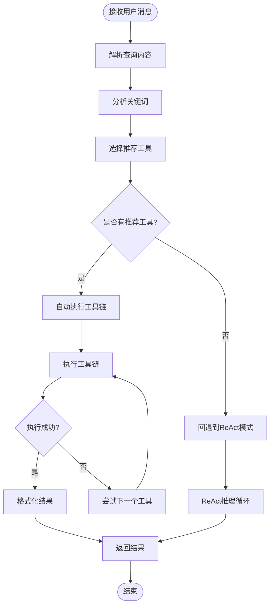
```mermaid
flowchart TD
Start([接收用户消息]) --> ParseQuery["解析查询内容"]
ParseQuery --> AnalyzeKeywords["分析关键词"]
AnalyzeKeywords --> SelectTools["选择推荐工具"]
SelectTools --> HasRecommendations{"是否有推荐工具?"}
HasRecommendations --> |是| AutoExecute["自动执行工具链"]
HasRecommendations --> |否| FallBackReAct["回退到ReAct模式"]
AutoExecute --> ExecuteChain["执行工具链"]
ExecuteChain --> CheckSuccess{"执行成功?"}
CheckSuccess --> |是| FormatResult["格式化结果"]
CheckSuccess --> |否| TryNextTool["尝试下一个工具"]
TryNextTool --> ExecuteChain
FallBackReAct --> ReActLoop["ReAct推理循环"]
FormatResult --> ReturnResult["返回结果"]
ReActLoop --> ReturnResult
ReturnResult --> End([结束])
```

**图表来源**
- [ToolCallAgent.java](file://tinyai-agent-manus/src/main/java/io/leavesfly/tinyai/agent/manus/ToolCallAgent.java#L60-L120)

**章节来源**
- [BaseAgent.java](file://tinyai-agent-manus/src/main/java/io/leavesfly/tinyai/agent/BaseAgent.java#L1-L100)
- [ReActAgent.java](file://tinyai-agent-manus/src/main/java/io/leavesfly/tinyai/agent/manus/ReActAgent.java#L1-L100)
- [ToolCallAgent.java](file://tinyai-agent-manus/src/main/java/io/leavesfly/tinyai/agent/manus/ToolCallAgent.java#L1-L100)

## 双执行机制

手稿智能体的核心创新在于其双执行机制，支持两种不同的执行模式：

### 直接Agent模式

直接Agent模式基于传统的ReAct推理-行动循环，适用于简单到中等复杂度的任务：

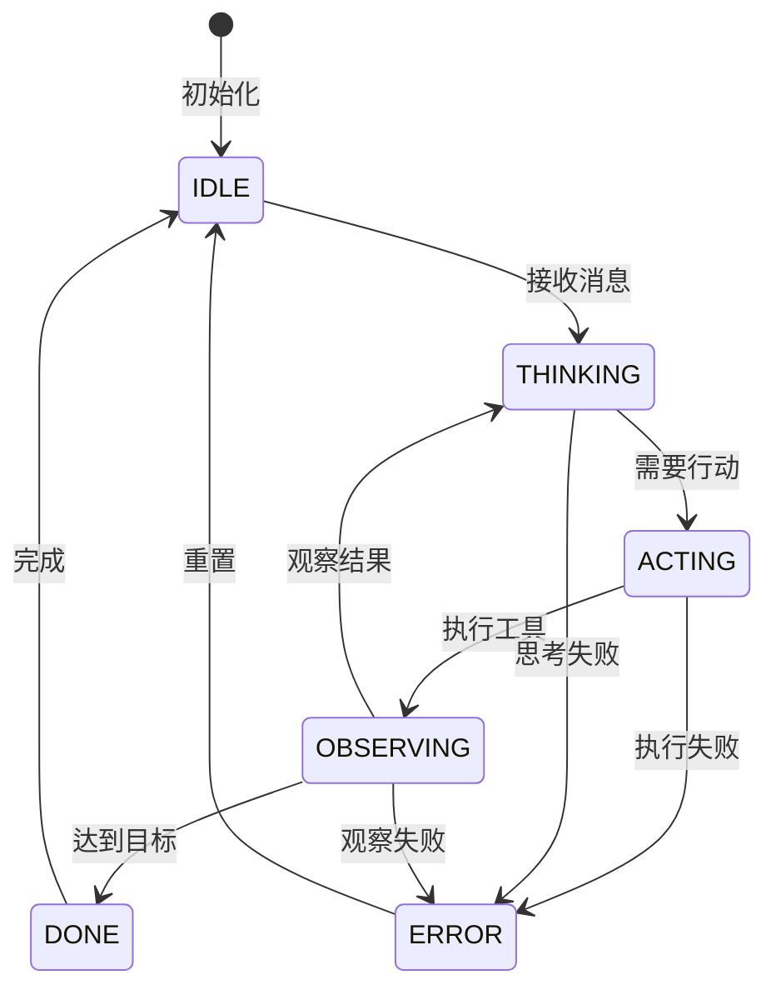
```mermaid
stateDiagram-v2
[*] --> IDLE : 初始化
IDLE --> THINKING : 接收消息
THINKING --> ACTING : 需要行动
ACTING --> OBSERVING : 执行工具
OBSERVING --> THINKING : 观察结果
OBSERVING --> DONE : 达到目标
ACTING --> ERROR : 执行失败
THINKING --> ERROR : 思考失败
OBSERVING --> ERROR : 观察失败
ERROR --> IDLE : 重置
DONE --> IDLE : 完成
```

**图表来源**
- [AgentState.java](file://tinyai-agent-manus/src/main/java/io/leavesfly/tinyai/agent/manus/AgentState.java#L1-L63)

### Flow编排模式

Flow编排模式根据查询类型自动选择预定义的工作流程，适用于特定领域的复杂任务：

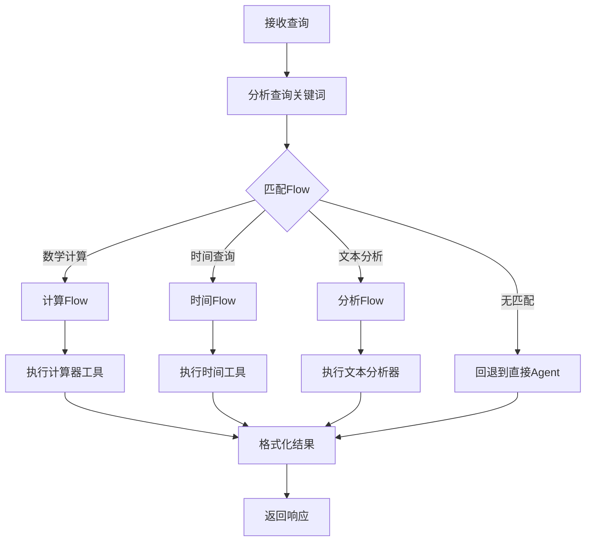
```mermaid
flowchart TD
ReceiveQuery[接收查询] --> AnalyzeQuery[分析查询关键词]
AnalyzeQuery --> MatchFlow{匹配Flow}
MatchFlow --> |数学计算| CalcFlow[计算Flow]
MatchFlow --> |时间查询| TimeFlow[时间Flow]
MatchFlow --> |文本分析| AnalysisFlow[分析Flow]
MatchFlow --> |无匹配| DirectAgent[回退到直接Agent]
CalcFlow --> ExecuteCalc[执行计算器工具]
TimeFlow --> ExecuteTime[执行时间工具]
AnalysisFlow --> ExecuteAnalyzer[执行文本分析器]
ExecuteCalc --> FormatResult[格式化结果]
ExecuteTime --> FormatResult
ExecuteAnalyzer --> FormatResult
DirectAgent --> FormatResult
FormatResult --> ReturnResponse[返回响应]
```

**图表来源**
- [Manus.java](file://tinyai-agent-manus/src/main/java/io/leavesfly/tinyai/agent/manus/Manus.java#L150-L200)

**章节来源**
- [Manus.java](file://tinyai-agent-manus/src/main/java/io/leavesfly/tinyai/agent/manus/Manus.java#L100-L200)
- [ExecutionMode.java](file://tinyai-agent-manus/src/main/java/io/leavesfly/tinyai/agent/manus/ExecutionMode.java#L1-L35)

## 任务分解流程

手稿智能体的计划驱动模式能够自动将复杂任务分解为多个子任务，并协调它们的执行：

### 计划创建过程

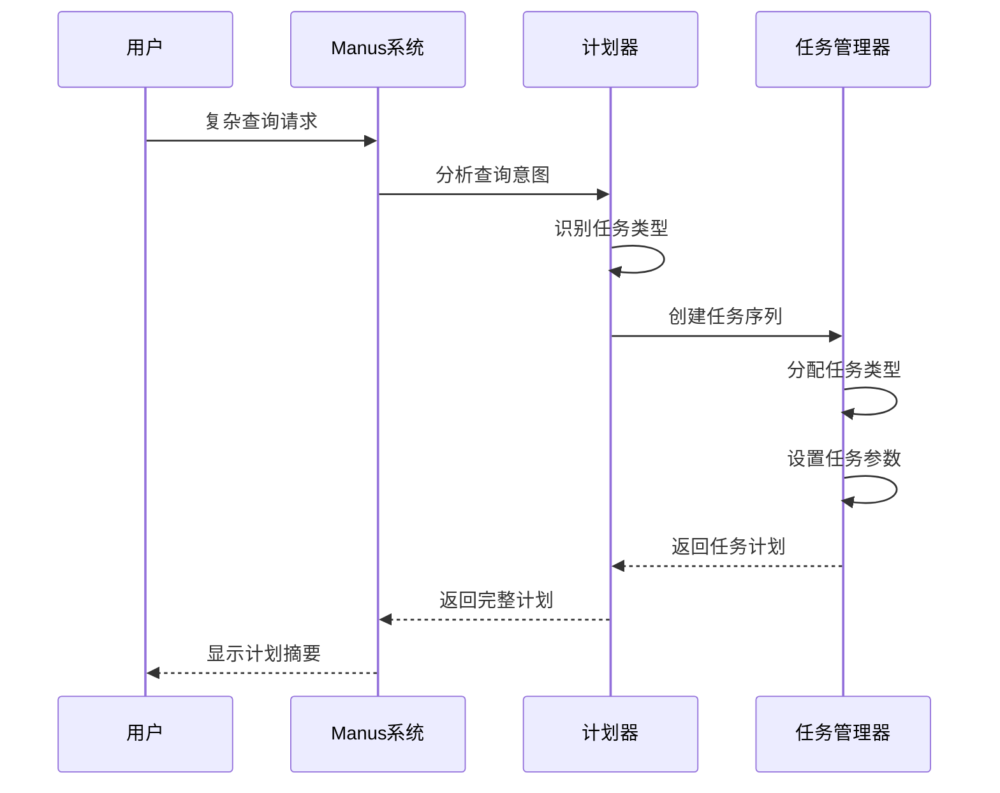
```mermaid
sequenceDiagram
participant User as 用户
participant Manus as Manus系统
participant Planner as 计划器
participant TaskManager as 任务管理器
User->>Manus : 复杂查询请求
Manus->>Planner : 分析查询意图
Planner->>Planner : 识别任务类型
Planner->>TaskManager : 创建任务序列
TaskManager->>TaskManager : 分配任务类型
TaskManager->>TaskManager : 设置任务参数
TaskManager-->>Planner : 返回任务计划
Planner-->>Manus : 返回完整计划
Manus-->>User : 显示计划摘要
```

**图表来源**
- [Plan.java](file://tinyai-agent-manus/src/main/java/io/leavesfly/tinyai/agent/manus/Plan.java#L100-L150)

### 任务执行流程

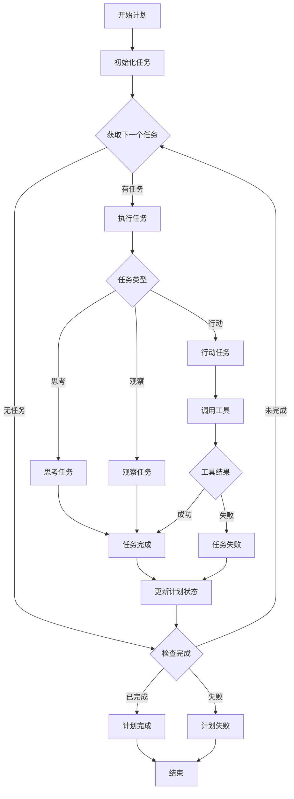
```mermaid
flowchart TD
StartPlan[开始计划] --> InitTasks[初始化任务]
InitTasks --> NextTask{获取下一个任务}
NextTask --> |有任务| ExecuteTask[执行任务]
NextTask --> |无任务| CheckComplete{检查完成}
ExecuteTask --> TaskType{任务类型}
TaskType --> |思考| ThinkingTask[思考任务]
TaskType --> |行动| ActionTask[行动任务]
TaskType --> |观察| ObservationTask[观察任务]
ThinkingTask --> TaskComplete[任务完成]
ActionTask --> CallTool[调用工具]
ObservationTask --> TaskComplete
CallTool --> ToolResult{工具结果}
ToolResult --> |成功| TaskComplete
ToolResult --> |失败| TaskFailed[任务失败]
TaskComplete --> UpdatePlan[更新计划状态]
TaskFailed --> UpdatePlan
UpdatePlan --> CheckComplete
CheckComplete --> |未完成| NextTask
CheckComplete --> |已完成| PlanComplete[计划完成]
CheckComplete --> |失败| PlanFailed[计划失败]
PlanComplete --> End[结束]
PlanFailed --> End
```

**图表来源**
- [Plan.java](file://tinyai-agent-manus/src/main/java/io/leavesfly/tinyai/agent/manus/Plan.java#L150-L200)
- [Task.java](file://tinyai-agent-manus/src/main/java/io/leavesfly/tinyai/agent/manus/Task.java#L50-L100)

**章节来源**
- [Plan.java](file://tinyai-agent-manus/src/main/java/io/leavesfly/tinyai/agent/manus/Plan.java#L1-L100)
- [Task.java](file://tinyai-agent-manus/src/main/java/io/leavesfly/tinyai/agent/manus/Task.java#L1-L100)

## 工具调用系统

手稿智能体的工具调用系统是其核心功能之一，提供了智能的工具选择、调用和管理能力：

### 工具映射机制

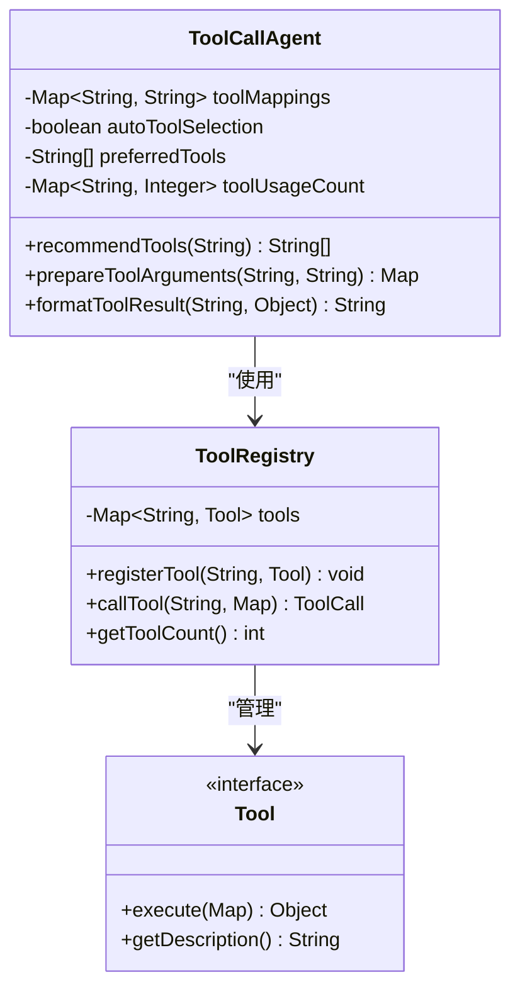
```mermaid
classDiagram
class ToolCallAgent {
-Map~String, String~ toolMappings
-boolean autoToolSelection
-String[] preferredTools
-Map~String, Integer~ toolUsageCount
+recommendTools(String) String[]
+prepareToolArguments(String, String) Map
+formatToolResult(String, Object) String
}
class ToolRegistry {
-Map~String, Tool~ tools
+registerTool(String, Tool) void
+callTool(String, Map) ToolCall
+getToolCount() int
}
class Tool {
<<interface>>
+execute(Map) Object
+getDescription() String
}
ToolCallAgent --> ToolRegistry : "使用"
ToolRegistry --> Tool : "管理"
```

**图表来源**
- [ToolCallAgent.java](file://tinyai-agent-manus/src/main/java/io/leavesfly/tinyai/agent/manus/ToolCallAgent.java#L20-L50)

### 智能工具选择

系统通过关键词匹配和语义分析来智能选择最适合的工具：

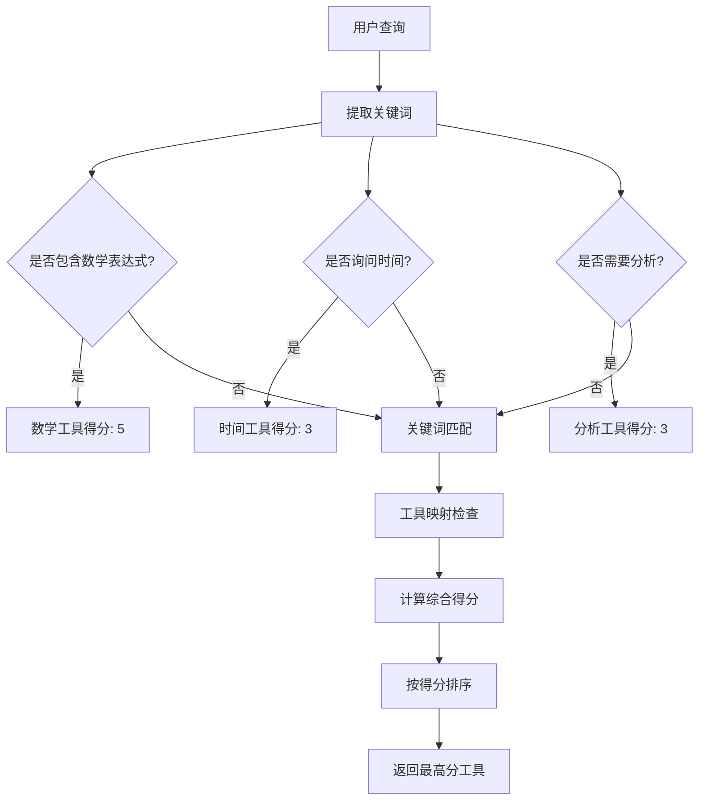
```mermaid
flowchart TD
Query[用户查询] --> ExtractKeywords[提取关键词]
ExtractKeywords --> CheckMath{是否包含数学表达式?}
ExtractKeywords --> CheckTime{是否询问时间?}
ExtractKeywords --> CheckAnalysis{是否需要分析?}
CheckMath --> |是| MathScore[数学工具得分: 5]
CheckTime --> |是| TimeScore[时间工具得分: 3]
CheckAnalysis --> |是| AnalysisScore[分析工具得分: 3]
CheckMath --> |否| KeywordMatch[关键词匹配]
CheckTime --> |否| KeywordMatch
CheckAnalysis --> |否| KeywordMatch
KeywordMatch --> ToolMapping[工具映射检查]
ToolMapping --> CalculateScore[计算综合得分]
CalculateScore --> SortResults[按得分排序]
SortResults --> ReturnTop[返回最高分工具]
```

**图表来源**
- [ToolCallAgent.java](file://tinyai-agent-manus/src/main/java/io/leavesfly/tinyai/agent/manus/ToolCallAgent.java#L80-L120)

### 工具执行链

当有多个推荐工具时，系统会按照优先级执行工具链：

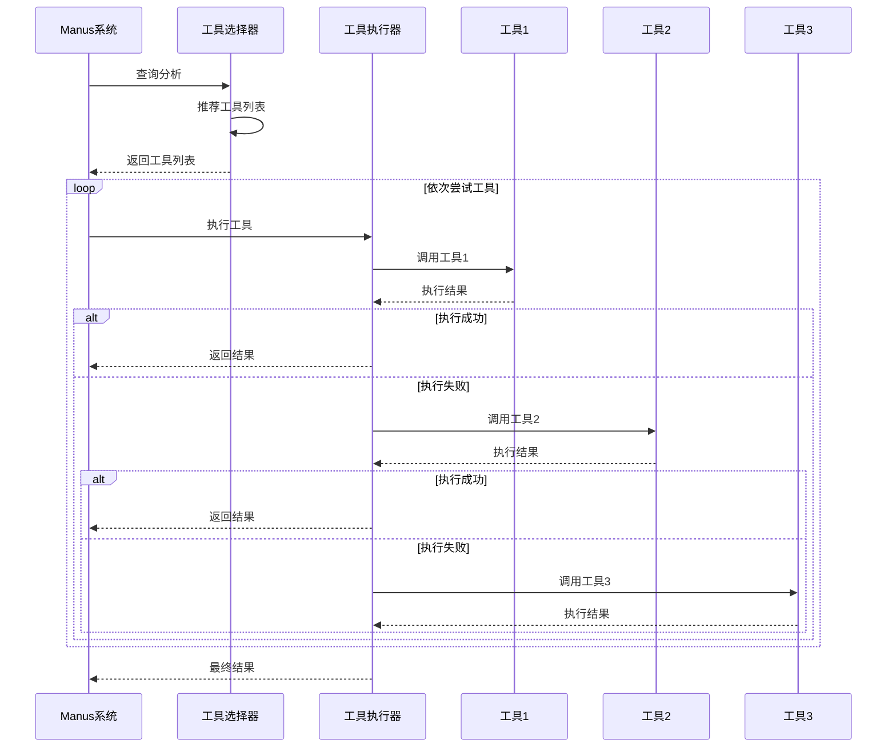
```mermaid
sequenceDiagram
participant Manus as Manus系统
participant ToolSelector as 工具选择器
participant ToolExecutor as 工具执行器
participant Tool1 as 工具1
participant Tool2 as 工具2
participant Tool3 as 工具3
Manus->>ToolSelector : 查询分析
ToolSelector->>ToolSelector : 推荐工具列表
ToolSelector-->>Manus : 返回工具列表
loop 依次尝试工具
Manus->>ToolExecutor : 执行工具
ToolExecutor->>Tool1 : 调用工具1
Tool1-->>ToolExecutor : 执行结果
alt 执行成功
ToolExecutor-->>Manus : 返回结果
else 执行失败
ToolExecutor->>Tool2 : 调用工具2
Tool2-->>ToolExecutor : 执行结果
alt 执行成功
ToolExecutor-->>Manus : 返回结果
else 执行失败
ToolExecutor->>Tool3 : 调用工具3
Tool3-->>ToolExecutor : 执行结果
end
end
end
ToolExecutor-->>Manus : 最终结果
```

**图表来源**
- [ToolCallAgent.java](file://tinyai-agent-manus/src/main/java/io/leavesfly/tinyai/agent/manus/ToolCallAgent.java#L120-L160)

**章节来源**
- [ToolCallAgent.java](file://tinyai-agent-manus/src/main/java/io/leavesfly/tinyai/agent/manus/ToolCallAgent.java#L1-L200)

## 状态管理

手稿智能体实现了全面的状态管理系统，确保代理行为的可预测性和可靠性：

### Agent状态枚举

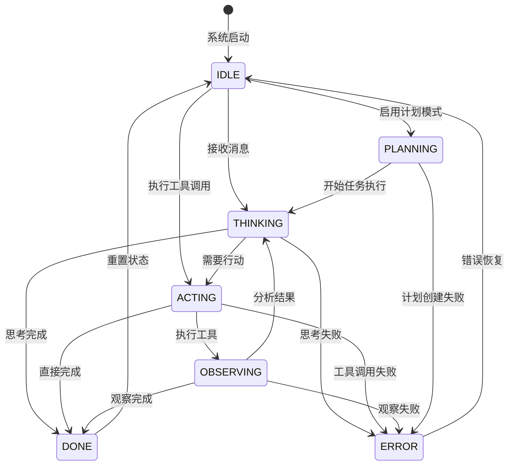
```mermaid
stateDiagram-v2
[*] --> IDLE : 系统启动
IDLE --> THINKING : 接收消息
IDLE --> PLANNING : 启用计划模式
IDLE --> ACTING : 执行工具调用
THINKING --> ACTING : 需要行动
THINKING --> DONE : 思考完成
THINKING --> ERROR : 思考失败
ACTING --> OBSERVING : 执行工具
ACTING --> ERROR : 工具调用失败
ACTING --> DONE : 直接完成
OBSERVING --> THINKING : 分析结果
OBSERVING --> DONE : 观察完成
OBSERVING --> ERROR : 观察失败
PLANNING --> THINKING : 开始任务执行
PLANNING --> ERROR : 计划创建失败
DONE --> IDLE : 重置状态
ERROR --> IDLE : 错误恢复
```

**图表来源**
- [AgentState.java](file://tinyai-agent-manus/src/main/java/io/leavesfly/tinyai/agent/manus/AgentState.java#L1-L63)

### 状态转换规则

系统严格遵循状态转换规则，确保代理行为的一致性：

1. **空闲状态(IDLE)**：系统初始状态，等待用户输入
2. **思考状态(THINKING)**：分析用户请求，规划下一步行动
3. **行动状态(ACTING)**：执行具体的工具调用或任务
4. **观察状态(OBSERVING)**：评估行动结果，准备下一步决策
5. **反思状态(REFLECTING)**：分析执行过程，优化未来行为
6. **计划状态(PLANNING)**：创建和管理复杂任务计划
7. **完成状态(DONE)**：任务成功完成，准备进入空闲状态
8. **错误状态(ERROR)**：遇到不可恢复的错误，需要重置

### 状态监控和统计

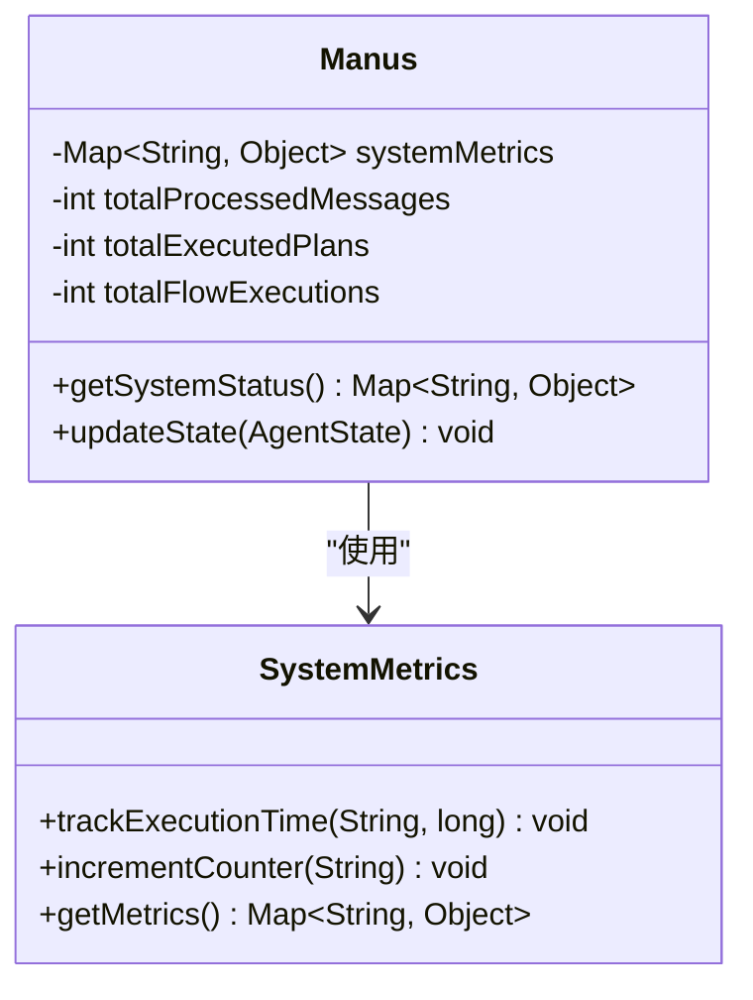
```mermaid
classDiagram
class Manus {
-Map~String, Object~ systemMetrics
-int totalProcessedMessages
-int totalExecutedPlans
-int totalFlowExecutions
+getSystemStatus() Map~String, Object~
+updateState(AgentState) void
}
class SystemMetrics {
+trackExecutionTime(String, long) void
+incrementCounter(String) void
+getMetrics() Map~String, Object~
}
Manus --> SystemMetrics : "使用"
```

**图表来源**
- [Manus.java](file://tinyai-agent-manus/src/main/java/io/leavesfly/tinyai/agent/manus/Manus.java#L20-L50)

**章节来源**
- [AgentState.java](file://tinyai-agent-manus/src/main/java/io/leavesfly/tinyai/agent/manus/AgentState.java#L1-L63)
- [Manus.java](file://tinyai-agent-manus/src/main/java/io/leavesfly/tinyai/agent/manus/Manus.java#L200-L250)

## 性能考虑

手稿智能体在设计时充分考虑了性能优化，采用了多种策略来提高系统的响应速度和资源利用率：

### 异步处理机制

系统支持异步消息处理，避免阻塞主线程：

```java
// 异步消息处理示例
CompletableFuture<Message> asyncResponse = CompletableFuture.supplyAsync(() -> {
    return manus.processMessage(userMessage);
});
```

### 缓存策略

- **工具调用结果缓存**：避免重复执行相同的工具调用
- **查询结果缓存**：缓存常用查询的结果
- **状态信息缓存**：减少频繁的状态查询开销

### 资源管理

- **连接池管理**：合理管理外部服务连接
- **内存优化**：及时清理不再需要的对象
- **线程池优化**：使用合适的线程池配置

### 并行执行支持

系统支持任务的并行执行，特别是在计划模式下：

```java
// 并行任务执行示例
if (allowParallel) {
    // 并行执行所有待执行的任务
    tasks.parallelStream()
         .filter(task -> "pending".equals(task.getStatus()))
         .forEach(this::executeTask);
}
```

## 故障排除指南

### 常见问题及解决方案

#### 1. 工具调用失败

**症状**：工具调用返回错误或超时

**排查步骤**：
1. 检查工具注册状态：`manus.getToolRegistry().hasTool(toolName)`
2. 验证工具参数：确保传递的参数格式正确
3. 检查网络连接：验证外部服务可用性
4. 查看工具日志：分析具体错误原因

**解决方案**：
```java
// 添加自定义工具作为备用方案
manus.registerCustomTool("fallback_calculator", args -> {
    // 实现备用计算逻辑
    return calculateFallback(args);
}, "备用计算器");
```

#### 2. 计划执行失败

**症状**：复杂任务无法完成，计划状态显示失败

**排查步骤**：
1. 检查计划状态：`plan.getStatistics()`
2. 分析失败任务：`plan.getTasks().stream().filter(Task::isFailed)`
3. 查看任务详情：检查每个任务的错误信息

**解决方案**：
```java
// 重新创建计划
Plan newPlan = new Plan("重新执行：" + originalPlan.getTitle(), originalPlan.getGoal());
// 添加容错任务
newPlan.addTask("容错处理", "action");
```

#### 3. 状态同步问题

**症状**：代理状态不一致，出现死锁或状态混乱

**排查步骤**：
1. 检查状态转换日志
2. 验证状态守卫条件
3. 分析并发访问情况

**解决方案**：
```java
// 使用原子操作确保状态一致性
AtomicReference<AgentState> currentState = new AtomicReference<>(AgentState.IDLE);
currentState.set(AgentState.THINKING);
```

### 调试工具

系统提供了丰富的调试和监控功能：

```java
// 获取系统状态信息
Map<String, Object> status = manus.getSystemStatus();
System.out.println("当前状态：" + status.get("current_state"));
System.out.println("消息数量：" + status.get("total_messages"));
System.out.println("工具使用：" + manus.getToolStats());

// 启用详细模式
manus.setVerboseMode(true);
```

**章节来源**
- [Manus.java](file://tinyai-agent-manus/src/main/java/io/leavesfly/tinyai/agent/manus/Manus.java#L400-L450)
- [ManusTest.java](file://tinyai-agent-manus/src/test/java/io/leavesfly/tinyai/agent/manus/ManusTest.java#L150-L200)

## 结论

手稿智能体（OpenManus Agent系统）是一个功能强大、架构清晰的智能代理系统。通过其创新的双执行机制、智能任务分解、动态工具调用和全面的状态管理，为复杂任务处理和自动化工作流提供了卓越的解决方案。

### 主要优势

1. **技术创新**：双执行机制结合了ReAct模式的灵活性和Flow编排的专业性
2. **架构优雅**：四层分层架构确保了代码的模块化和可扩展性
3. **功能完备**：支持从简单查询到复杂任务的全方位处理
4. **易于使用**：提供了直观的API和丰富的配置选项
5. **稳定可靠**：完善的错误处理和状态管理机制

### 应用前景

手稿智能体系统特别适合以下应用场景：
- **企业级自动化**：复杂的业务流程自动化
- **智能客服**：多轮对话和复杂问题解答
- **数据分析**：结构化数据处理和分析
- **开发辅助**：代码生成和重构建议
- **知识管理**：文档处理和信息检索

### 发展方向

未来的改进方向包括：
- **多模态支持**：扩展对图像、音频等多媒体的支持
- **深度学习集成**：结合LLM能力提升智能水平
- **分布式部署**：支持大规模集群部署
- **可视化界面**：提供图形化的配置和监控界面
- **插件生态**：建立丰富的第三方工具插件生态

手稿智能体系统为智能代理技术的发展提供了有价值的参考，其设计理念和实现方式值得在更多场景中推广应用。