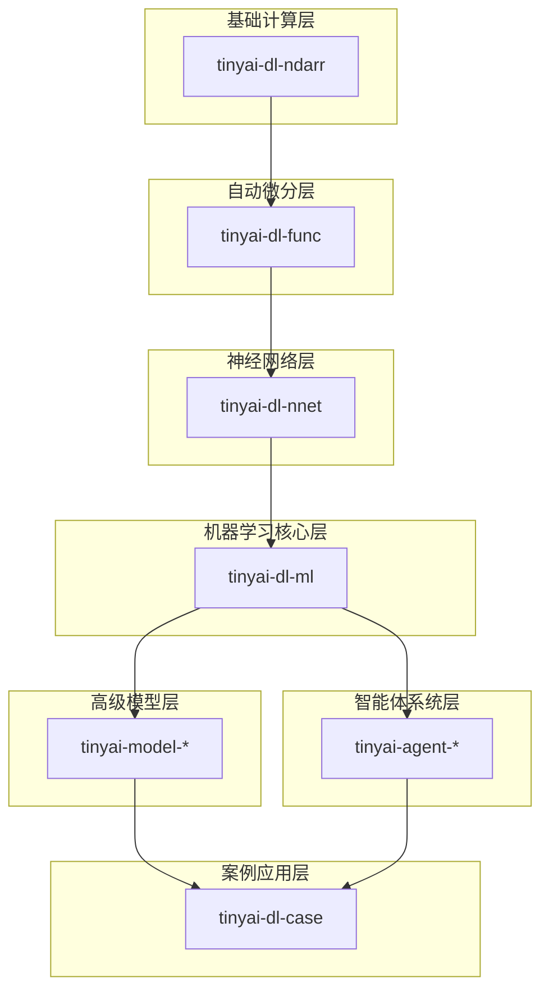
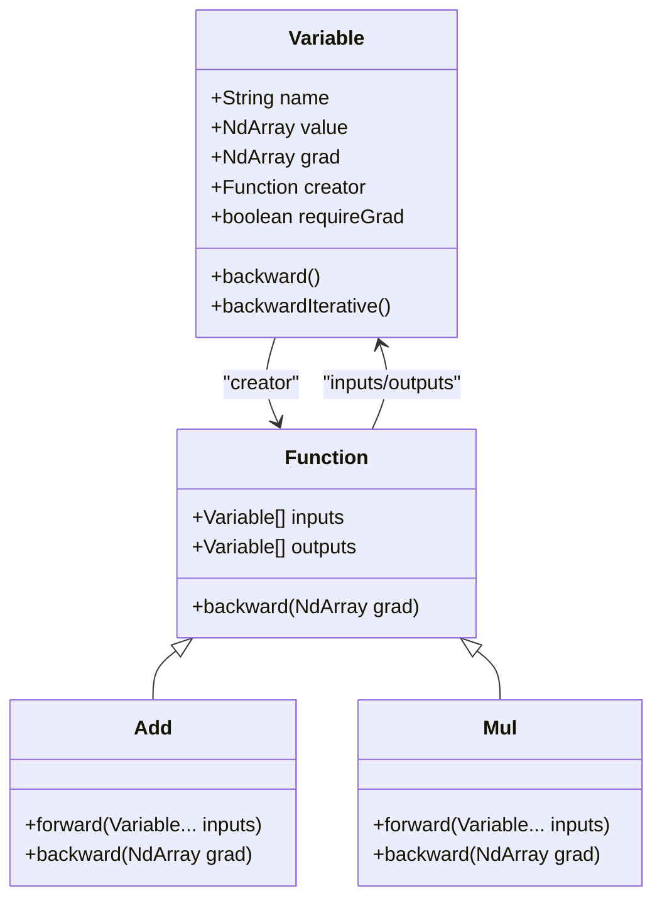
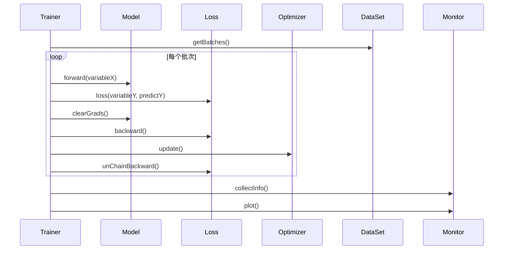
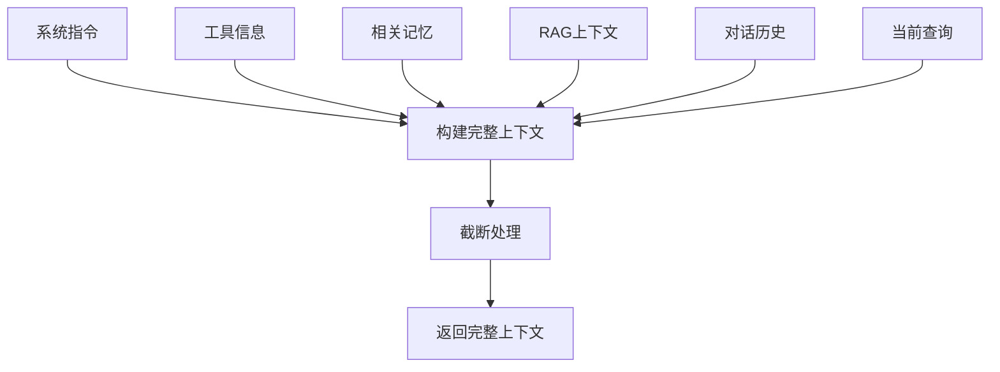
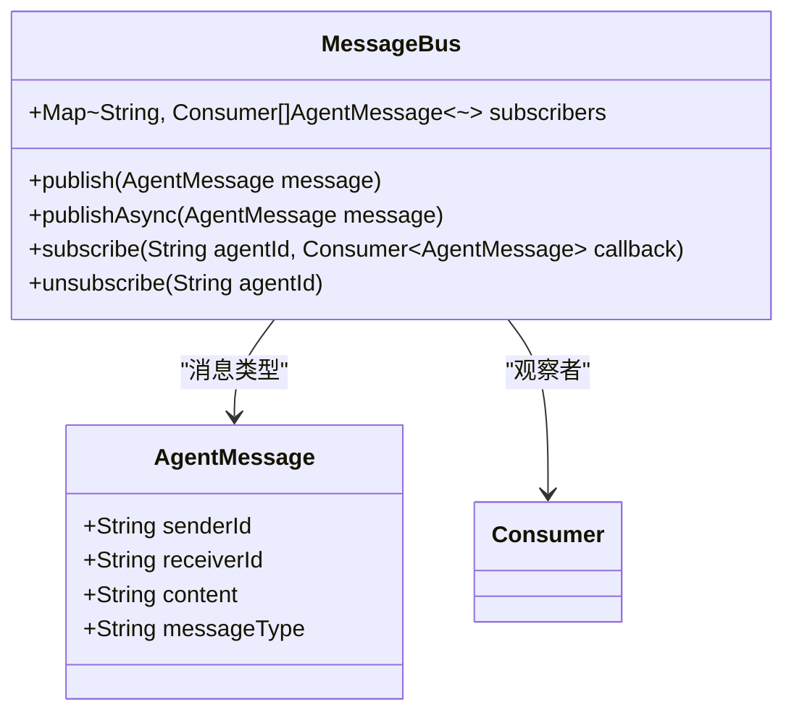
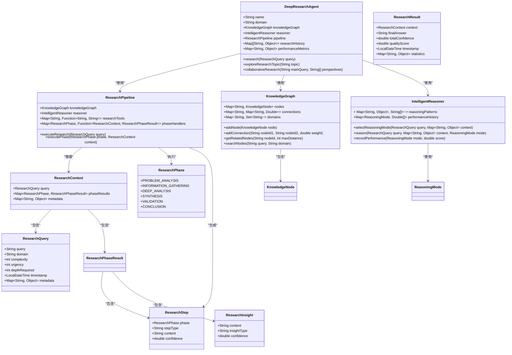
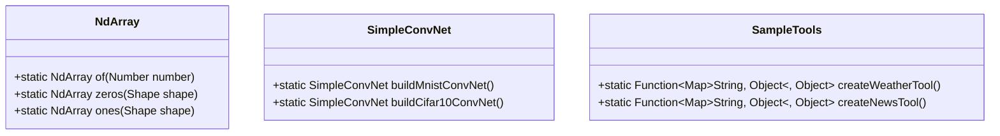
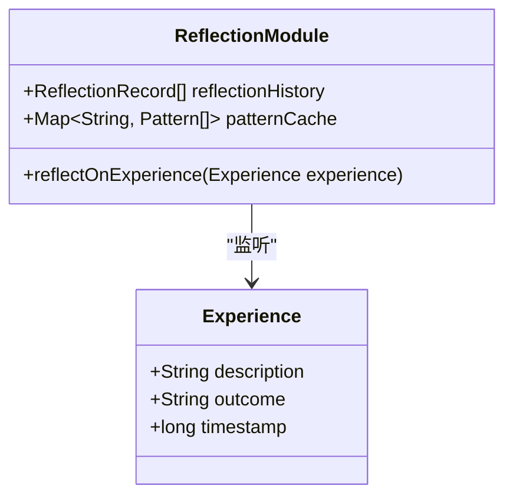

# 技术架构

<cite>
**本文档引用的文件**   
- [pom.xml](file://pom.xml) - *Updated in recent commit*
- [NdArray.java](file://tinyai-deeplearning-ndarr/src/main/java/io/leavesfly/tinyai/ndarr/NdArray.java)
- [Variable.java](file://tinyai-deeplearning-func/src/main/java/io/leavesfly/tinyai/func/Variable.java)
- [Layer.java](file://tinyai-deeplearning-nnet/src/main/java/io/leavesfly/tinyai/nnet/Layer.java)
- [Trainer.java](file://tinyai-deeplearning-ml/src/main/java/io/leavesfly/tinyai/ml/Trainer.java)
- [ContextEngine.java](file://tinyai-agent-base/src/main/java/io/leavesfly/tinyai/agent/ContextEngine.java)
- [GPT2Model.java](file://tinyai-model-gpt/src/main/java/io/leavesfly/tinyai/gpt/GPT2Model.java)
- [ReflectionModule.java](file://tinyai-agent-evol/src/main/java/io/leavesfly/tinyai/agent/evol/ReflectionModule.java)
- [MessageBus.java](file://tinyai-agent-multi/src/main/java/io/leavesfly/tinyai/agent/multi/MessageBus.java)
- [AgentPatternMain.java](file://tinyai-agent-pattern/src/main/java/io/leavesfly/tinyai/agent/pattern/AgentPatternMain.java)
- [SampleTools.java](file://tinyai-agent-pattern/src/main/java/io/leavesfly/tinyai/agent/pattern/SampleTools.java)
- [DeepResearchAgent.java](file://tinyai-agent-research/src/main/java/io/leavesfly/tinyai/agent/research/DeepResearchAgent.java) - *Added in recent commit*
- [ResearchPipeline.java](file://tinyai-agent-research/src/main/java/io/leavesfly/tinyai/agent/research/ResearchPipeline.java) - *Added in recent commit*
- [KnowledgeGraph.java](file://tinyai-agent-research/src/main/java/io/leavesfly/tinyai/agent/research/KnowledgeGraph.java) - *Added in recent commit*
- [IntelligentReasoner.java](file://tinyai-agent-research/src/main/java/io/leavesfly/tinyai/agent/research/IntelligentReasoner.java) - *Added in recent commit*
- [ResearchQuery.java](file://tinyai-agent-research/src/main/java/io/leavesfly/tinyai/agent/research/ResearchQuery.java) - *Added in recent commit*
- [ResearchResult.java](file://tinyai-agent-research/src/main/java/io/leavesfly/tinyai/agent/research/ResearchResult.java) - *Added in recent commit*
- [ResearchContext.java](file://tinyai-agent-research/src/main/java/io/leavesfly/tinyai/agent/research/ResearchContext.java) - *Added in recent commit*
- [ResearchPhase.java](file://tinyai-agent-research/src/main/java/io/leavesfly/tinyai/agent/research/ResearchPhase.java) - *Added in recent commit*
</cite>

## 更新摘要
**变更内容**   
- 新增了`tinyai-agent-research`模块的详细文档，包括核心组件和架构设计
- 更新了分层架构设计，将`tinyai-agent-research`模块纳入智能体系统层
- 在系统上下文与组件交互部分新增了深度研究智能体系统的详细说明
- 更新了Maven多模块构建体系，反映了新增的`tinyai-agent-research`模块
- 在设计模式应用部分新增了深度研究智能体中的策略模式应用
- 更新了所有相关文件引用，包含了新模块的源代码文件

## 目录
1. [系统概述](#系统概述)
2. [分层架构设计](#分层架构设计)
3. [核心模块分析](#核心模块分析)
4. [计算图与自动微分](#计算图与自动微分)
5. [训练循环设计](#训练循环设计)
6. [系统上下文与组件交互](#系统上下文与组件交互)
7. [Maven多模块构建体系](#maven多模块构建体系)
8. [设计模式应用](#设计模式应用)
9. [总结](#总结)

## 系统概述

TinyAI是一个分层设计的深度学习与智能体系统，采用模块化架构，从底层数值计算到上层智能体系统形成完整的技术栈。系统采用Maven多模块构建，各模块之间通过清晰的依赖关系组织，形成了从基础计算到高级应用的完整链条。

**系统来源**
- [pom.xml](file://pom.xml)

## 分层架构设计

TinyAI采用清晰的分层架构设计，从底层到上层依次为：NdArray数值计算层、func自动微分引擎层、nnet神经网络层、ml机器学习核心层，最终支撑agent智能体系统和model系列高级模型。

各模块的依赖关系为：tinyai-dl-ndarr → tinyai-dl-func → tinyai-dl-nnet → tinyai-dl-ml，形成单向依赖的稳定架构。这种设计确保了底层模块的独立性和可复用性，同时为上层模块提供了坚实的基础。

**图示来源**
- [pom.xml](file://pom.xml)

**章节来源**
- [pom.xml](file://pom.xml)

## 核心模块分析

### NdArray数值计算模块

NdArray模块是TinyAI的底层数值计算基础，提供了多维数组的抽象和基本运算。该模块支持CPU、GPU和TPU等多种后端实现，通过统一的接口提供高性能的数值计算能力。

模块提供了丰富的静态工厂方法，如zeros、ones、eye等，用于创建特殊矩阵。同时支持从标量、一维数组和多维数组创建NdArray实例，满足不同场景的需求。

**章节来源**
- [NdArray.java](file://tinyai-deeplearning-ndarr/src/main/java/io/leavesfly/tinyai/ndarr/NdArray.java)

### Func自动微分引擎

Func模块是TinyAI的自动微分引擎，核心是Variable类和Function类。Variable类不仅包含数值，还包含梯度和生成该变量的函数信息，是构建计算图的基础。

该模块实现了反向传播算法，支持递归和迭代两种实现方式。通过creator字段维护计算图的拓扑结构，实现了高效的梯度计算。

**图示来源**
- [Variable.java](file://tinyai-deeplearning-func/src/main/java/io/leavesfly/tinyai/func/Variable.java)

**章节来源**
- [Variable.java](file://tinyai-deeplearning-func/src/main/java/io/leavesfly/tinyai/func/Variable.java)

### NNet神经网络层

NNet模块提供了神经网络的基本构建块，包括Layer和Block两个核心抽象。Layer表示神经网络中的具体层，如卷积层、全连接层等；Block表示由多个层组成的网络块。

该模块实现了参数管理、梯度清零等基础功能，为构建复杂的神经网络结构提供了支持。通过继承LayerAble抽象类，确保了所有层都具有统一的接口和行为。

**章节来源**
- [Layer.java](file://tinyai-deeplearning-nnet/src/main/java/io/leavesfly/tinyai/nnet/Layer.java)

### ML机器学习核心

ML模块是TinyAI的机器学习核心，提供了模型训练、评估和监控的完整功能。Trainer类是训练流程的核心，支持单线程和并行训练两种模式。

该模块实现了完整的训练循环，包括数据准备、前向传播、损失计算、反向传播和参数更新等步骤。同时提供了Monitor和Evaluator组件，用于训练过程的监控和模型性能的评估。

**图示来源**
- [Trainer.java](file://tinyai-deeplearning-ml/src/main/java/io/leavesfly/tinyai/ml/Trainer.java)

**章节来源**
- [Trainer.java](file://tinyai-deeplearning-ml/src/main/java/io/leavesfly/tinyai/ml/Trainer.java)

## 计算图与自动微分

TinyAI的自动微分系统基于动态计算图实现。每个Variable对象通过creator字段记录生成它的Function，形成计算图的节点连接。

反向传播时，从损失变量开始，递归调用每个Function的backward方法，计算输入变量的梯度。梯度通过累加方式更新，支持梯度复用。

系统提供了两种反向传播实现：递归实现和迭代实现。递归实现代码简洁，但可能在深层网络中导致栈溢出；迭代实现使用显式栈，避免了递归调用的限制。

**章节来源**
- [Variable.java](file://tinyai-deeplearning-func/src/main/java/io/leavesfly/tinyai/func/Variable.java)

## 训练循环设计

TinyAI的训练循环设计遵循标准的深度学习训练流程：

1. 数据准备：从DataSet获取训练批次
2. 前向传播：模型对输入数据进行预测
3. 损失计算：比较预测值与真实值，计算损失
4. 梯度清零：清除模型参数的梯度
5. 反向传播：从损失变量开始反向传播，计算梯度
6. 参数更新：优化器根据梯度更新模型参数
7. 信息收集：监控器收集训练信息
8. 循环迭代：重复上述步骤直到达到最大训练轮次

并行训练模式将批次处理分配给多个线程，然后聚合梯度并更新参数，提高了训练效率。

**章节来源**
- [Trainer.java](file://tinyai-deeplearning-ml/src/main/java/io/leavesfly/tinyai/ml/Trainer.java)

## 系统上下文与组件交互

### 智能体系统上下文

智能体系统通过ContextEngine类管理对话上下文，整合系统提示、工具信息、相关记忆、RAG检索结果和对话历史，构建完整的上下文供智能体使用。

上下文构建过程包括：系统指令、工具信息、相关记忆、RAG上下文、对话历史和当前查询的整合，并根据长度限制进行截断。

**图示来源**
- [ContextEngine.java](file://tinyai-agent-base/src/main/java/io/leavesfly/tinyai/agent/ContextEngine.java)

**章节来源**
- [ContextEngine.java](file://tinyai-agent-base/src/main/java/io/leavesfly/tinyai/agent/ContextEngine.java)

### 多智能体通信

多智能体系统通过MessageBus实现智能体间的通信，支持广播和点对点消息传递。MessageBus作为观察者模式的具体实现，管理智能体的订阅和消息分发。

**图示来源**
- [MessageBus.java](file://tinyai-agent-multi/src/main/java/io/leavesfly/tinyai/agent/multi/MessageBus.java)

**章节来源**
- [MessageBus.java](file://tinyai-agent-multi/src/main/java/io/leavesfly/tinyai/agent/multi/MessageBus.java)

### 深度研究智能体系统

深度研究智能体系统是一个基于LLM驱动的高级研究智能体，具备多阶段推理、知识图谱构建、自适应学习等能力。系统由四个核心组件构成：

1. **DeepResearchAgent**: 主类，协调整个研究流程，管理研究历史和性能指标
2. **ResearchPipeline**: 多阶段研究管道，管理从问题分析到结论生成的完整研究流程
3. **KnowledgeGraph**: 动态知识图谱，管理研究过程中的知识节点和连接关系
4. **IntelligentReasoner**: 智能推理器，自适应选择推理策略并执行推理任务

系统实现了六阶段研究流程：
- 问题分析 (Problem Analysis)
- 信息收集 (Information Gathering)
- 深度分析 (Deep Analysis)
- 综合处理 (Synthesis)
- 验证检查 (Validation)
- 结论生成 (Conclusion)

**图示来源**
- [DeepResearchAgent.java](file://tinyai-agent-research/src/main/java/io/leavesfly/tinyai/agent/research/DeepResearchAgent.java)
- [ResearchPipeline.java](file://tinyai-agent-research/src/main/java/io/leavesfly/tinyai/agent/research/ResearchPipeline.java)
- [KnowledgeGraph.java](file://tinyai-agent-research/src/main/java/io/leavesfly/tinyai/agent/research/KnowledgeGraph.java)
- [IntelligentReasoner.java](file://tinyai-agent-research/src/main/java/io/leavesfly/tinyai/agent/research/IntelligentReasoner.java)

**章节来源**
- [DeepResearchAgent.java](file://tinyai-agent-research/src/main/java/io/leavesfly/tinyai/agent/research/DeepResearchAgent.java)
- [ResearchPipeline.java](file://tinyai-agent-research/src/main/java/io/leavesfly/tinyai/agent/research/ResearchPipeline.java)
- [KnowledgeGraph.java](file://tinyai-agent-research/src/main/java/io/leavesfly/tinyai/agent/research/KnowledgeGraph.java)
- [IntelligentReasoner.java](file://tinyai-agent-research/src/main/java/io/leavesfly/tinyai/agent/research/IntelligentReasoner.java)

## Maven多模块构建体系

TinyAI采用Maven多模块构建体系，通过父POM统一管理所有子模块的依赖和插件配置。这种设计带来了以下优势：

1. **依赖管理**：通过dependencyManagement统一管理所有模块的依赖版本，确保版本一致性
2. **构建一致性**：通过pluginManagement统一管理构建插件，确保构建过程的一致性
3. **模块化**：各功能模块独立，便于单独开发、测试和部署
4. **依赖控制**：明确的模块依赖关系，避免循环依赖
5. **构建效率**：支持模块并行构建，提高构建速度

父POM中定义了Java 17作为编译版本，统一管理了jfreechart、junit等外部依赖的版本。最新更新中，根pom.xml已添加`tinyai-agent-research`模块，使其成为智能体系统的重要组成部分。

**章节来源**
- [pom.xml](file://pom.xml)

## 设计模式应用

### 工厂模式

TinyAI在多个地方应用了工厂模式：

1. **静态工厂方法**：NdArray类提供了of、zeros、ones等静态工厂方法，简化对象创建
2. **构建器模式**：SimpleConvNet类提供了buildMnistConvNet、buildCifar10ConvNet等静态方法，用于创建预配置的网络实例
3. **工具工厂**：SampleTools类提供了createWeatherTool、createNewsTool等方法，用于创建不同功能的工具

**图示来源**
- [NdArray.java](file://tinyai-deeplearning-ndarr/src/main/java/io/leavesfly/tinyai/ndarr/NdArray.java)
- [SimpleConvNet.java](file://tinyai-deeplearning-nnet/src/main/java/io/leavesfly/tinyai/nnet/block/SimpleConvNet.java)
- [SampleTools.java](file://tinyai-agent-pattern/src/main/java/io/leavesfly/tinyai/agent/pattern/SampleTools.java)

**章节来源**
- [NdArray.java](file://tinyai-deeplearning-ndarr/src/main/java/io/leavesfly/tinyai/ndarr/NdArray.java)
- [SimpleConvNet.java](file://tinyai-deeplearning-nnet/src/main/java/io/leavesfly/tinyai/nnet/block/SimpleConvNet.java)
- [SampleTools.java](file://tinyai-agent-pattern/src/main/java/io/leavesfly/tinyai/agent/pattern/SampleTools.java)

### 策略模式

策略模式在智能体系统中广泛应用：

1. **Agent模式**：ReAct、Reflect、Planning、Collaborative等不同类型的Agent实现了不同的行为策略
2. **优化器**：SGD、Adam等不同优化算法作为不同的优化策略
3. **强化学习策略**：EpsilonGreedyPolicy等策略实现了不同的决策逻辑
4. **推理模式**：在深度研究智能体中，IntelligentReasoner根据问题特征选择QUICK、THOROUGH、CREATIVE、ANALYTICAL、SYSTEMATIC五种不同的推理策略

### 观察者模式

观察者模式主要应用于：

1. **多智能体通信**：MessageBus作为主题，智能体作为观察者，实现消息的发布-订阅机制
2. **训练监控**：Monitor作为观察者，监听训练过程中的各种事件
3. **反思系统**：ReflectionModule监听智能体的经验，触发反思过程

**图示来源**
- [ReflectionModule.java](file://tinyai-agent-evol/src/main/java/io/leavesfly/tinyai/agent/evol/ReflectionModule.java)

**章节来源**
- [ReflectionModule.java](file://tinyai-agent-evol/src/main/java/io/leavesfly/tinyai/agent/evol/ReflectionModule.java)

## 总结

TinyAI通过精心设计的分层架构和模块化组织，构建了一个功能完整、结构清晰的深度学习与智能体系统。系统从底层数值计算到上层智能体应用，形成了完整的生态。

核心优势包括：
1. **清晰的分层架构**：各层职责明确，依赖关系清晰
2. **高效的自动微分**：基于动态计算图的自动微分系统
3. **灵活的模型构建**：通过Layer和Block的组合构建复杂网络
4. **完整的训练支持**：提供训练、评估、监控的完整工具链
5. **丰富的智能体模式**：支持多种智能体行为模式
6. **良好的扩展性**：模块化设计便于功能扩展

最新引入的深度研究智能体系统（DeepResearchAgent）进一步增强了TinyAI在复杂问题分析和知识管理方面的能力。该系统通过六阶段研究流程、动态知识图谱和自适应推理机制，实现了对复杂问题的深度分析和综合研究，为TinyAI的智能体生态系统增添了重要的高级功能。

这些设计使得TinyAI既适合深度学习研究，也适合智能体系统的开发和应用。