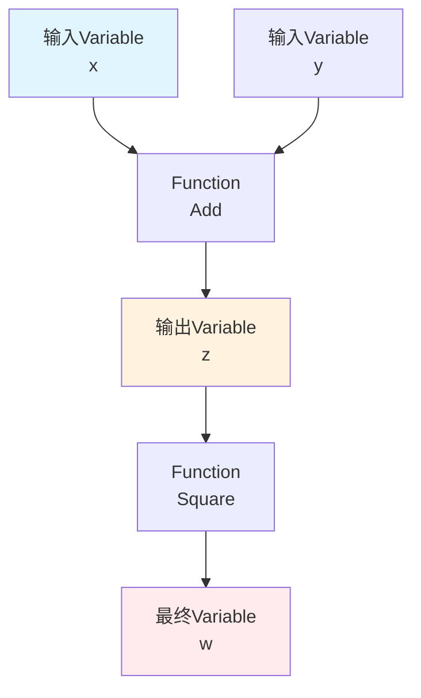
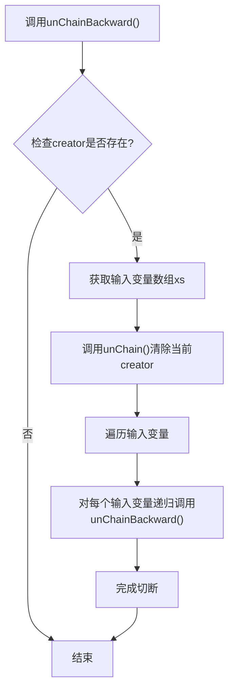
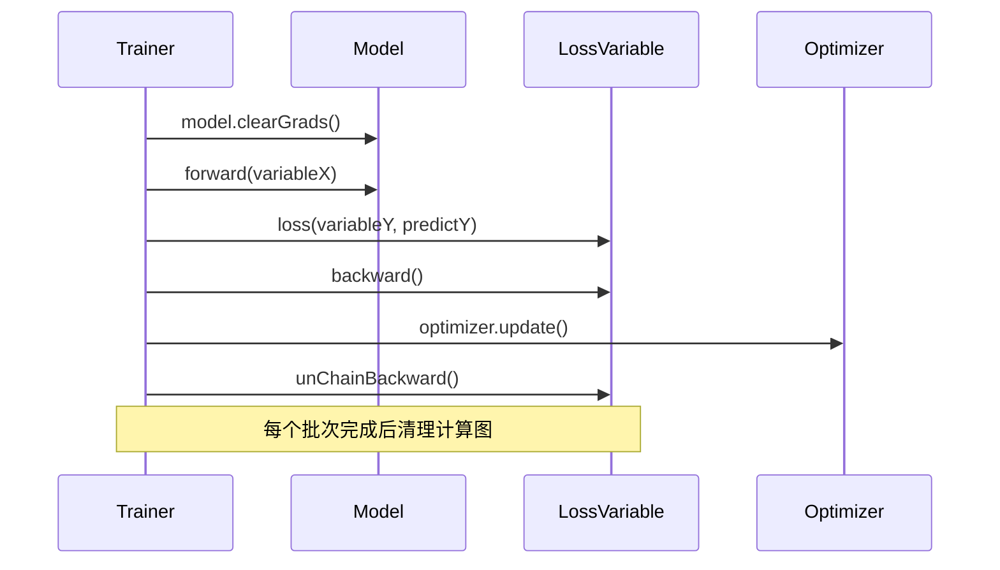
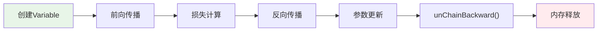

# 内存与计算图管理

<cite>
**本文档中引用的文件**
- [Variable.java](file://tinyai-dl-func/src/main/java/io/leavesfly/tinyai/func/Variable.java)
- [Trainer.java](file://tinyai-dl-ml/src/main/java/io/leavesfly/tinyai/ml/Trainer.java)
- [RnnCosExam.java](file://tinyai-dl-case/src/main/java/io/leavesfly/tinyai/example/regress/RnnCosExam.java)
- [VariableTest.java](file://tinyai-dl-func/src/test/java/io/leavesfly/tinyai/func/VariableTest.java)
</cite>

## 目录
1. [简介](#简介)
2. [计算图生命周期概述](#计算图生命周期概述)
3. [核心内存管理机制](#核心内存管理机制)
4. [unChainBackward方法详解](#unchainbackward方法详解)
5. [Trainer类中的内存管理](#trainer类中的内存管理)
6. [RNN场景下的特殊处理](#rnn场景下的特殊处理)
7. [完整的训练迭代流程](#完整的训练迭代流程)
8. [性能考虑与最佳实践](#性能考虑与最佳实践)
9. [故障排除指南](#故障排除指南)
10. [结论](#结论)

## 简介

TinyAI框架中的内存管理是确保深度学习模型高效运行的关键组件。计算图的生命周期管理直接影响着内存使用效率和训练稳定性。本文档深入分析了TinyAI中计算图的生命周期管理策略，重点探讨了`unChainBackward()`方法如何递归地切断Variable的creator引用，以及Trainer类如何通过显式的内存管理操作防止内存泄漏。

## 计算图生命周期概述

在TinyAI框架中，计算图是由Variable对象和Function对象构成的有向无环图(DAG)。每个Variable对象代表计算图中的一个节点，而Function对象则代表计算图中的边，表示数学运算。



**图表来源**
- [Variable.java](file://tinyai-dl-func/src/main/java/io/leavesfly/tinyai/func/Variable.java#L1-L50)

计算图的生命周期包括以下阶段：
1. **构建阶段**：通过Variable的数学运算方法创建新的Variable
2. **前向传播**：计算Variable的值并建立计算图
3. **反向传播**：计算梯度并建立梯度计算图
4. **内存释放**：切断计算图连接并释放相关内存

## 核心内存管理机制

### Variable类的内存管理属性

Variable类包含了三个关键的内存管理属性：

```java
private NdArray value;          // 变量的实际值
private NdArray grad;           // 变量的梯度
private transient Function creator; // 生成该变量的函数（临时属性）
```

其中，`creator`属性使用`transient`关键字标记，这意味着它不会被序列化，避免了循环引用问题。

### 梯度内存管理

梯度是计算图中最重要的内存消耗来源。TinyAI提供了两种主要的梯度管理方式：

1. **梯度累加**：支持多次反向传播的梯度累加
2. **梯度清理**：通过`clearGrad()`方法主动释放梯度内存

**章节来源**
- [Variable.java](file://tinyai-dl-func/src/main/java/io/leavesfly/tinyai/func/Variable.java#L20-L40)

## unChainBackward方法详解

`unChainBackward()`方法是TinyAI中最重要的内存管理工具之一，专门用于切断计算图的连接，防止内存泄漏。

### 方法实现原理

```java
public void unChainBackward() {
    Function creatorFunc = creator;
    if (!Objects.isNull(creatorFunc)) {
        Variable[] xs = creatorFunc.getInputs();
        unChain();
        for (Variable x : xs) {
            x.unChainBackward();
        }
    }
}
```

### 递归切断机制

`unChainBackward()`方法采用了递归的切断策略：



**图表来源**
- [Variable.java](file://tinyai-dl-func/src/main/java/io/leavesfly/tinyai/func/Variable.java#L210-L225)

### RNN场景中的关键作用

在RNN（循环神经网络）中，`unChainBackward()`方法尤为重要。由于RNN具有时间维度上的循环连接，如果不及时切断计算图，会导致：

1. **内存泄漏**：计算图不断增长，占用大量内存
2. **梯度爆炸/消失**：梯度在长时间序列中累积或衰减
3. **训练不稳定**：过长的计算图影响训练效果

**章节来源**
- [Variable.java](file://tinyai-dl-func/src/main/java/io/leavesfly/tinyai/func/Variable.java#L210-L225)

## Trainer类中的内存管理

Trainer类是TinyAI框架中模型训练的核心组件，它在训练循环中实现了完整的内存管理策略。

### 单线程训练中的内存管理

```java
public void singleThreadTrain(boolean shuffleData) {
    DataSet trainDataSet = dataSet.getTrainDataSet();
    if (shuffleData) {
        trainDataSet.shuffle();
    }

    for (int i = 0; i < maxEpoch; i++) {
        model.resetState();
        monitor.startNewEpoch(i);

        List<Batch> batches = trainDataSet.getBatches();
        float lossSum = 0f;
        float accSum = 0f;

        for (Batch batch : batches) {
            Variable variableX = batch.toVariableX().setName("x").setRequireGrad(false);
            Variable variableY = batch.toVariableY().setName("y").setRequireGrad(false);

            Variable predictY = model.forward(variableX);
            Variable lossVariable = loss.loss(variableY, predictY);
            lossVariable.setName("loss");

            model.clearGrads();
            lossSum += lossVariable.getValue().getNumber().floatValue();

            lossVariable.backward();
            optimizer.update();
            lossVariable.unChainBackward();

            model.tmpPredict = predictY;
        }
        monitor.collectInfo(lossSum / batches.size());
        monitor.endEpoch();
        monitor.printTrainInfo();
    }
    monitor.plot();
}
```

### 内存管理操作序列

在每个训练迭代中，Trainer类按照以下顺序执行内存管理操作：



**图表来源**
- [Trainer.java](file://tinyai-dl-ml/src/main/java/io/leavesfly/tinyai/ml/Trainer.java#L130-L150)

### clearGrad()方法的作用

`clearGrad()`方法负责清理Variable的梯度信息：

```java
public void clearGrad() {
    grad = null;
}
```

这个方法在每次训练迭代开始前调用，确保梯度不会累积，防止内存泄漏。

**章节来源**
- [Trainer.java](file://tinyai-dl-ml/src/main/java/io/leavesfly/tinyai/ml/Trainer.java#L130-L150)

## RNN场景下的特殊处理

RNN模型对内存管理有特殊要求，特别是在处理长序列数据时。

### RNN中的计算图管理

在RNN示例中，可以看到明确的计算图切断操作：

```java
// 切断计算图 每批数据要清理重新构建计算图
loss.unChainBackward();
```

### BPTT长度控制

在RNN训练中，通过控制BPTT（Backpropagation Through Time）长度来管理计算图大小：

```java
int bpttLength = 3;  // BPTT截断长度
SimpleRnnBlock rnnBlock = new SimpleRnnBlock("rnn", inputSize, hiddenSize, outputSize);
```

### 内存管理最佳实践

1. **定期切断计算图**：在每个时间步或批次后调用`unChainBackward()`
2. **重置模型状态**：使用`model.resetState()`清理隐藏状态
3. **及时释放内存**：在训练完成后调用`shutdown()`方法

**章节来源**
- [RnnCosExam.java](file://tinyai-dl-case/src/main/java/io/leavesfly/tinyai/example/regress/RnnCosExam.java#L70-L90)

## 完整的训练迭代流程

让我们详细分析一个完整的训练迭代中各个阶段的内存管理操作：

### 数据加载阶段

```java
Variable variableX = batch.toVariableX().setName("x").setRequireGrad(false);
Variable variableY = batch.toVariableY().setName("y").setRequireGrad(false);
```

在这个阶段，我们创建Variable对象，它们会自动参与计算图的构建。

### 前向传播阶段

```java
Variable predictY = model.forward(variableX);
```

前向传播会构建计算图，Variable对象之间建立连接关系。

### 损失计算阶段

```java
Variable lossVariable = loss.loss(variableY, predictY);
lossVariable.setName("loss");
```

损失计算会进一步扩展计算图，为反向传播做准备。

### 反向传播阶段

```java
model.clearGrads();  // 清理之前的梯度
lossVariable.backward();  // 计算梯度
optimizer.update();  // 更新参数
lossVariable.unChainBackward();  // 切断计算图
```

这是内存管理最关键的步骤，每一步都有特定的目的：

1. **clearGrads()**：清理上次迭代的梯度，防止梯度累积
2. **backward()**：计算梯度并建立梯度计算图
3. **update()**：使用计算好的梯度更新模型参数
4. **unChainBackward()**：切断计算图连接，释放内存

### 内存释放流程



**图表来源**
- [Trainer.java](file://tinyai-dl-ml/src/main/java/io/leavesfly/tinyai/ml/Trainer.java#L140-L150)

**章节来源**
- [Trainer.java](file://tinyai-dl-ml/src/main/java/io/leavesfly/tinyai/ml/Trainer.java#L130-L150)

## 性能考虑与最佳实践

### 内存使用优化

1. **及时清理**：在每个批次处理完成后立即清理计算图
2. **批量处理**：合理设置batch size，平衡内存使用和训练效率
3. **梯度累积**：在需要时使用梯度累积技术减少内存碎片

### 并行训练中的内存管理

在并行训练模式下，内存管理更加复杂：

```java
// 并行处理批次时的内存管理
GradientAggregator gradientAggregator = new GradientAggregator(currentBatchGroup.size());
// 梯度聚合完成后清理
model.clearGrads();
```

### 内存监控建议

1. **定期检查内存使用**：监控训练过程中的内存消耗
2. **设置合理的超时**：防止长时间运行导致的内存泄漏
3. **使用内存分析工具**：定期分析内存使用模式

## 故障排除指南

### 常见内存问题

1. **内存泄漏**
   - 症状：训练过程中内存持续增长
   - 解决方案：确保每个批次都调用`unChainBackward()`

2. **梯度累积**
   - 症状：梯度值异常大或小
   - 解决方案：在每次迭代开始前调用`clearGrads()`

3. **计算图过大**
   - 症状：训练速度变慢，内存使用过高
   - 解决方案：适当缩短BPTT长度，增加`unChainBackward()`调用频率

### 调试技巧

```java
// 在关键位置添加内存检查
System.out.println("Memory usage before unChainBackward: " + getMemoryUsage());
lossVariable.unChainBackward();
System.out.println("Memory usage after unChainBackward: " + getMemoryUsage());
```

**章节来源**
- [VariableTest.java](file://tinyai-dl-func/src/test/java/io/leavesfly/tinyai/func/VariableTest.java#L360-L370)

## 结论

TinyAI框架中的内存管理策略体现了现代深度学习框架的设计精髓。通过`unChainBackward()`方法的递归切断机制、Trainer类的完整内存管理流程，以及针对RNN等特殊场景的优化，TinyAI确保了高效的内存使用和稳定的训练过程。

关键要点总结：

1. **递归切断**：`unChainBackward()`方法通过递归方式切断整个计算图
2. **显式管理**：Trainer类通过显式的内存管理操作防止内存泄漏
3. **场景适配**：针对RNN等特殊场景提供专门的内存管理策略
4. **性能优化**：通过合理的内存管理提升训练效率和稳定性

这些设计使得TinyAI能够在长时间训练大型模型时保持良好的性能表现，为深度学习研究和应用提供了可靠的基础设施。