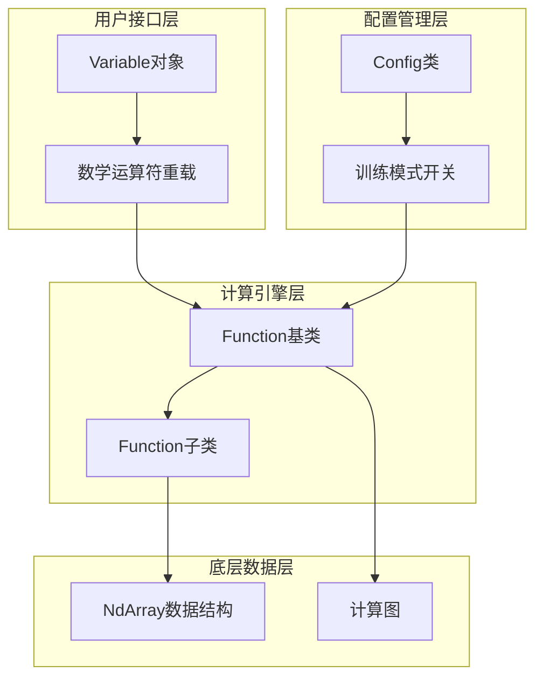
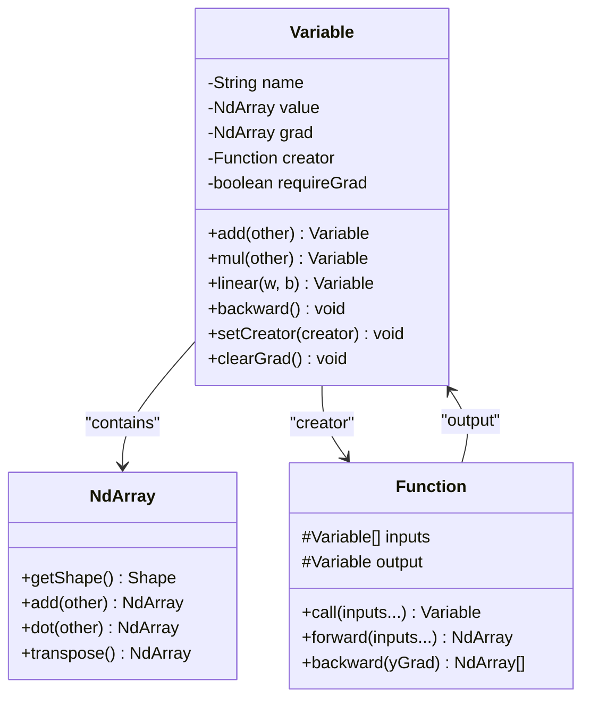
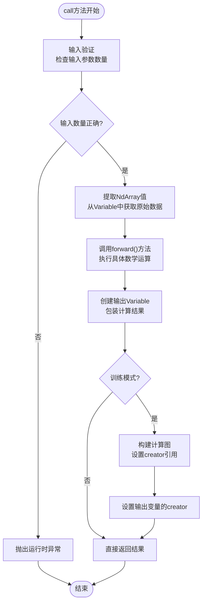
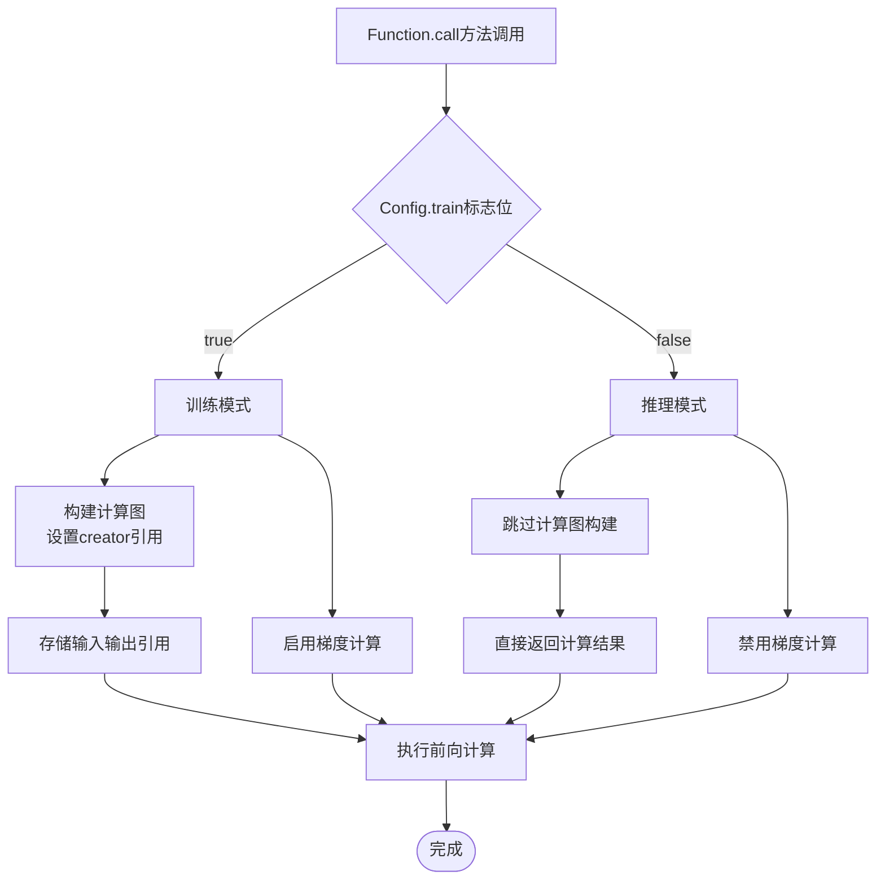
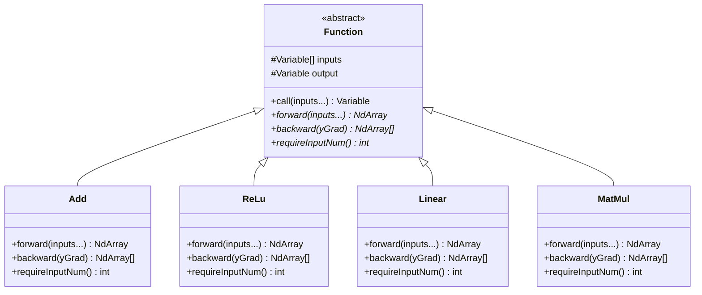
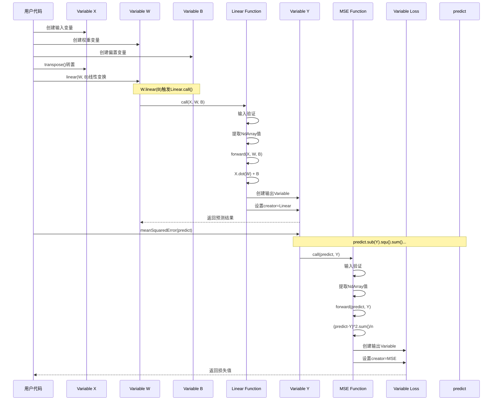
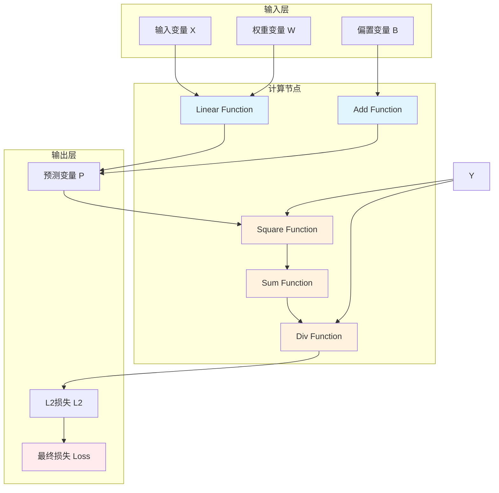

# TinyAI框架前向传播机制详解

<cite>
**本文档引用的文件**
- [Variable.java](file://tinyai-dl-func/src/main/java/io/leavesfly/tinyai/func/Variable.java)
- [Function.java](file://tinyai-dl-func/src/main/java/io/leavesfly/tinyai/func/Function.java)
- [Config.java](file://tinyai-dl-func/src/main/java/io/leavesfly/tinyai/util/Config.java)
- [Add.java](file://tinyai-dl-func/src/main/java/io/leavesfly/tinyai/func/base/Add.java)
- [Linear.java](file://tinyai-dl-func/src/main/java/io/leavesfly/tinyai/func/matrix/Linear.java)
- [ReLu.java](file://tinyai-dl-func/src/main/java/io/leavesfly/tinyai/func/math/ReLu.java)
- [MatMul.java](file://tinyai-dl-func/src/main/java/io/leavesfly/tinyai/func/matrix/MatMul.java)
- [LineExam.java](file://tinyai-dl-case/src/main/java/io/leavesfly/tinyai/example/regress/LineExam.java)
- [MnistMlpExam.java](file://tinyai-dl-case/src/main/java/io/leavesfly/tinyai/example/classify/MnistMlpExam.java)
- [MlpBlock.java](file://tinyai-dl-nnet/src/main/java/io/leavesfly/tinyai/nnet/block/MlpBlock.java)
</cite>

## 目录
1. [简介](#简介)
2. [核心架构概览](#核心架构概览)
3. [Variable对象与数学运算符重载](#variable对象与数学运算符重载)
4. [Function基类的call()方法执行流程](#function基类的call方法执行流程)
5. [Config.train标志位的作用机制](#configtrain标志位的作用机制)
6. [Function子类的具体实现分析](#function子类的具体实现分析)
7. [前向传播完整示例分析](#前向传播完整示例分析)
8. [计算图构建机制](#计算图构建机制)
9. [性能优化考虑](#性能优化考虑)
10. [故障排除指南](#故障排除指南)
11. [总结](#总结)

## 简介

TinyAI框架采用了基于计算图的前向传播机制，通过重载数学运算符和精心设计的Function类体系，实现了灵活而高效的深度学习计算。本文档将深入分析Variable对象如何通过重载数学运算符触发Function.call()方法，从而构建计算图的节点连接，以及Function基类中call()方法的完整执行流程。

## 核心架构概览

TinyAI框架的前向传播机制基于以下核心组件：



**图表来源**
- [Variable.java](file://tinyai-dl-func/src/main/java/io/leavesfly/tinyai/func/Variable.java#L1-L50)
- [Function.java](file://tinyai-dl-func/src/main/java/io/leavesfly/tinyai/func/Function.java#L1-L30)
- [Config.java](file://tinyai-dl-func/src/main/java/io/leavesfly/tinyai/util/Config.java#L1-L20)

## Variable对象与数学运算符重载

Variable类是TinyAI框架的核心抽象，它不仅包含变量的值和梯度信息，更重要的是通过重载数学运算符实现了自动化的计算图构建。

### 运算符重载机制

Variable类通过重载Java中的运算符方法，将传统的函数调用转换为直观的数学表达式：

```java
// 加法运算符重载
public Variable add(Variable other) {
    Function function = new Add();
    return function.call(this, other);
}

// 乘法运算符重载  
public Variable mul(Variable other) {
    Function function = new Mul();
    return function.call(this, other);
}

// 线性变换运算符重载
public Variable linear(Variable w, Variable b) {
    Function function = new Linear();
    if (Objects.isNull(b)) {
        return function.call(this, w);
    }
    return function.call(this, w, b);
}
```

这种设计模式的优势在于：
- **直观性**：用户可以直接使用数学表达式，无需手动管理计算图
- **自动化**：运算符重载自动触发Function.call()方法，构建计算图节点
- **扩展性**：新增运算符只需实现对应的Function子类即可

### Variable类的核心属性



**图表来源**
- [Variable.java](file://tinyai-dl-func/src/main/java/io/leavesfly/tinyai/func/Variable.java#L20-L80)
- [Function.java](file://tinyai-dl-func/src/main/java/io/leavesfly/tinyai/func/Function.java#L15-L35)

**章节来源**
- [Variable.java](file://tinyai-dl-func/src/main/java/io/leavesfly/tinyai/func/Variable.java#L300-L400)

## Function基类的call()方法执行流程

Function基类的call()方法是整个前向传播机制的核心，它定义了所有数学运算的标准执行流程。

### call()方法的完整执行步骤



**图表来源**
- [Function.java](file://tinyai-dl-func/src/main/java/io/leavesfly/tinyai/func/Function.java#L35-L70)

### call()方法的详细实现分析

call()方法的执行流程包含五个关键步骤：

#### 1. 输入验证阶段

```java
// 输入验证
if (_inputs.length != requireInputNum() && requireInputNum() > 0) {
    throw new RuntimeException("Function call inputs Variable requireInputNum error! Expected: "
            + requireInputNum() + ", Actual: " + _inputs.length);
}
```

这个阶段确保函数接收到正确的输入参数数量，防止因参数错误导致的计算异常。

#### 2. NdArray值提取阶段

```java
// 提取NdArray值
NdArray[] ndArrayInputs = Arrays.stream(_inputs)
        .filter(Objects::nonNull)
        .map(Variable::getValue)
        .toArray(NdArray[]::new);
```

将Variable对象中的NdArray值提取出来，准备进行实际的数学运算。

#### 3. forward()计算执行阶段

```java
// 执行前向传播
NdArray ndArrayOutput = forward(ndArrayInputs);
```

调用子类实现的forward()方法，执行具体的数学运算。这是每个Function子类必须实现的核心方法。

#### 4. 输出Variable创建阶段

```java
// 创建输出变量
Variable _output = new Variable(ndArrayOutput);
```

将计算结果封装为新的Variable对象，保持与输入Variable一致的接口。

#### 5. 计算图构建阶段

```java
// 只在训练模式下构建计算图
if (Config.train) {
    this.inputs = _inputs;
    this.output = _output;
    _output.setCreator(this);
}
```

在训练模式下，建立输入变量与输出变量之间的引用关系，构建完整的计算图。

**章节来源**
- [Function.java](file://tinyai-dl-func/src/main/java/io/leavesfly/tinyai/func/Function.java#L35-L70)

## Config.train标志位的作用机制

Config类中的train标志位是控制计算图构建的关键机制，它决定了Function.call()方法是否建立输入输出变量之间的引用关系。

### train标志位的工作原理



**图表来源**
- [Function.java](file://tinyai-dl-func/src/main/java/io/leavesfly/tinyai/func/Function.java#L55-L65)
- [Config.java](file://tinyai-dl-func/src/main/java/io/leavesfly/tinyai/util/Config.java#L15-L20)

### train标志位的应用场景

1. **训练阶段**：启用计算图构建，支持反向传播和梯度计算
2. **推理阶段**：禁用计算图构建，提高推理性能
3. **混合模式**：根据具体需求动态切换训练和推理模式

### train标志位的默认行为

```java
public static Boolean train = true;
```

默认情况下，框架处于训练模式，这确保了大多数应用场景下的自动微分功能可用。

**章节来源**
- [Config.java](file://tinyai-dl-func/src/main/java/io/leavesfly/tinyai/util/Config.java#L15-L20)
- [Function.java](file://tinyai-dl-func/src/main/java/io/leavesfly/tinyai/func/Function.java#L55-L65)

## Function子类的具体实现分析

TinyAI框架提供了丰富的Function子类，涵盖了基本数学运算、矩阵操作和神经网络层等各种计算需求。

### 基本数学运算Function

#### Add类的实现分析

Add类展示了标准的Function子类实现模式：

```java
@Override
public NdArray forward(NdArray... inputs) {
    x0Shape = inputs[0].getShape();
    x1Shape = inputs[1].getShape();
    
    // 检查是否需要广播
    if (x0Shape.equals(x1Shape)) {
        // 形状相同，直接相加
        return inputs[0].add(inputs[1]);
    } else {
        // 需要广播
        if (isBroadcastable(x1Shape, x0Shape)) {
            return inputs[0].add(inputs[1].broadcastTo(x0Shape));
        } else if (isBroadcastable(x0Shape, x1Shape)) {
            return inputs[0].broadcastTo(x1Shape).add(inputs[1]);
        } else {
            throw new IllegalArgumentException(
                String.format("加法操作的形状不兼容：%s vs %s", x0Shape, x1Shape)
            );
        }
    }
}
```

#### ReLU类的实现特点

ReLU类展示了激活函数的典型实现：

```java
@Override
public NdArray forward(NdArray... inputs) {
    return inputs[0].maximum(0f);  // max(0, x)
}

@Override
public List<NdArray> backward(NdArray yGrad) {
    return Collections.singletonList(inputs[0].getValue().mask(0).mul(yGrad));
}
```

### 矩阵运算Function

#### Linear类的线性变换

Linear类实现了标准的线性变换：y = x * w + b

```java
@Override
public NdArray forward(NdArray... inputs) {
    NdArray y = inputs[0].dot(inputs[1]);
    if (inputs.length == 2) {
        return y;
    }
    return y.add(inputs[2].broadcastTo(y.getShape()));
}
```

#### MatMul类的矩阵乘法

MatMul类专注于矩阵内积运算：

```java
@Override
public NdArray forward(NdArray... inputs) {
    NdArray x = inputs[0];
    NdArray w = inputs[1];
    return x.dot(w);
}
```

### Function子类的继承层次



**图表来源**
- [Add.java](file://tinyai-dl-func/src/main/java/io/leavesfly/tinyai/func/base/Add.java#L15-L30)
- [ReLu.java](file://tinyai-dl-func/src/main/java/io/leavesfly/tinyai/func/math/ReLu.java#L15-L25)
- [Linear.java](file://tinyai-dl-func/src/main/java/io/leavesfly/tinyai/func/matrix/Linear.java#L15-L25)
- [MatMul.java](file://tinyai-dl-func/src/main/java/io/leavesfly/tinyai/func/matrix/MatMul.java#L15-L25)

**章节来源**
- [Add.java](file://tinyai-dl-func/src/main/java/io/leavesfly/tinyai/func/base/Add.java#L25-L60)
- [ReLu.java](file://tinyai-dl-func/src/main/java/io/leavesfly/tinyai/func/math/ReLu.java#L20-L35)
- [Linear.java](file://tinyai-dl-func/src/main/java/io/leavesfly/tinyai/func/matrix/Linear.java#L20-L40)
- [MatMul.java](file://tinyai-dl-func/src/main/java/io/leavesfly/tinyai/func/matrix/MatMul.java#L20-L40)

## 前向传播完整示例分析

让我们通过一个完整的线性回归示例来追踪从输入数据到模型输出的完整前向计算路径。

### 示例代码分析

```java
// 定义权重和偏置变量
Variable w = new Variable(NdArray.of(0), "w");
Variable b = new Variable(NdArray.of(0), "b");

// 定义输入变量（注意设置requireGrad=false）
Variable variableX = new Variable(NdArray.of(x), "x", false).transpose();
Variable variableY = new Variable(NdArray.of(y), "y", false).transpose();

// 前向传播计算
Variable predict = predict(variableX, w, b);
Variable loss = meanSquaError(variableY, predict);
```

### 前向传播执行流程



**图表来源**
- [LineExam.java](file://tinyai-dl-case/src/main/java/io/leavesfly/tinyai/example/regress/LineExam.java#L40-L60)
- [Variable.java](file://tinyai-dl-func/src/main/java/io/leavesfly/tinyai/func/Variable.java#L580-L590)
- [Function.java](file://tinyai-dl-func/src/main/java/io/leavesfly/tinyai/func/Function.java#L35-L70)

### 关键执行细节

1. **变量创建阶段**：用户创建Variable对象，设置初始值和名称
2. **运算符重载触发**：调用linear()方法触发Linear Function的call()方法
3. **计算图构建**：在训练模式下，Linear Function建立输入输出变量的引用关系
4. **前向计算执行**：Linear Function执行具体的线性变换计算
5. **结果封装**：将计算结果封装为新的Variable对象

**章节来源**
- [LineExam.java](file://tinyai-dl-case/src/main/java/io/leavesfly/tinyai/example/regress/LineExam.java#L40-L70)

## 计算图构建机制

计算图是TinyAI框架自动微分的核心数据结构，它记录了整个前向传播过程中各变量之间的依赖关系。

### 计算图的构建过程



**图表来源**
- [Variable.java](file://tinyai-dl-func/src/main/java/io/leavesfly/tinyai/func/Variable.java#L580-L590)
- [Function.java](file://tinyai-dl-func/src/main/java/io/leavesfly/tinyai/func/Function.java#L55-L65)

### 计算图的内存管理

计算图的构建涉及到复杂的内存管理：

1. **引用关系维护**：每个输出Variable都持有creator引用
2. **循环引用处理**：通过transient关键字避免序列化时的循环引用
3. **内存泄漏防护**：提供unChainBackward()方法清理计算图

### 计算图的遍历机制

```java
// 递归方式遍历计算图
public void backward() {
    if (!requireGrad) {
        this.grad = null;
        return;
    }
    
    // 初始化梯度
    if (Objects.isNull(grad)) {
        setGrad(NdArray.ones(this.getValue().getShape()));
    }
    
    Function _creator = creator;
    if (!Objects.isNull(_creator)) {
        Variable[] _inputs = _creator.getInputs();
        List<NdArray> grads = _creator.backward(grad);
        
        // 递归处理输入变量
        int index = 0;
        for (Variable input : _inputs) {
            if (input.getGrad() != null) {
                input.setGrad(input.getGrad().add(grads.get(index)));
            } else {
                input.setGrad(grads.get(index));
            }
            input.backward();
            index++;
        }
    }
}
```

**章节来源**
- [Variable.java](file://tinyai-dl-func/src/main/java/io/leavesfly/tinyai/func/Variable.java#L120-L180)

## 性能优化考虑

TinyAI框架在前向传播机制中采用了多种性能优化策略：

### 1. 训练模式优化

通过Config.train标志位，框架可以在推理模式下跳过计算图构建，显著提升性能：

```java
// 推理模式下跳过计算图构建
if (Config.train) {
    this.inputs = _inputs;
    this.output = _output;
    _output.setCreator(this);
}
```

### 2. 内存管理优化

- **延迟计算**：只有在需要时才执行前向传播
- **梯度累加**：支持梯度复用，避免重复分配内存
- **引用清理**：提供清理方法防止内存泄漏

### 3. 广播优化

Add类中的广播逻辑经过优化，能够高效处理不同形状的张量运算：

```java
private boolean isBroadcastable(Shape srcShape, Shape dstShape) {
    // 从后往前检查维度兼容性
    if (srcShape.getDimNum() <= dstShape.getDimNum()) {
        boolean compatible = true;
        for (int i = 0; i < srcShape.getDimNum(); i++) {
            int srcDimIndex = srcShape.getDimNum() - 1 - i;
            int dstDimIndex = dstShape.getDimNum() - 1 - i;
            
            int srcDim = srcShape.getDimension(srcDimIndex);
            int dstDim = dstShape.getDimension(dstDimIndex);
            
            // 广播规则：维度相等，或者源维度为1
            if (srcDim != dstDim && srcDim != 1) {
                compatible = false;
                break;
            }
        }
        if (compatible) {
            return true;
        }
    }
    return false;
}
```

### 4. 迭代式反向传播

对于深层网络，框架提供了迭代式的反向传播实现，避免递归调用导致的栈溢出：

```java
public void backwardIterative() {
    // 使用栈来模拟递归过程
    Stack<Variable> stack = new Stack<>();
    stack.push(this);
    
    while (!stack.isEmpty()) {
        Variable currentVar = stack.pop();
        // 处理当前变量的反向传播
        // ...
    }
}
```

## 故障排除指南

### 常见问题及解决方案

#### 1. 输入参数数量错误

**问题症状**：RuntimeException "Function call inputs Variable requireInputNum error"

**原因分析**：调用Function时提供的输入参数数量与函数要求不符

**解决方案**：
```java
// 检查Function的requireInputNum()实现
@Override
public int requireInputNum() {
    return 2;  // 确保返回正确的参数数量
}
```

#### 2. 形状不兼容错误

**问题症状**：IllegalArgumentException "加法操作的形状不兼容"

**原因分析**：广播操作无法匹配输入张量的形状

**解决方案**：
```java
// 在forward()方法中添加形状检查
if (!isBroadcastable(x0Shape, x1Shape)) {
    throw new IllegalArgumentException("Shapes are not broadcastable: " + x0Shape + " vs " + x1Shape);
}
```

#### 3. 计算图构建失败

**问题症状**：Variable的creator引用为null，无法进行反向传播

**原因分析**：Config.train设置为false，跳过了计算图构建

**解决方案**：
```java
// 确保在训练模式下构建计算图
Config.train = true;
```

#### 4. 内存泄漏问题

**问题症状**：长时间运行后内存占用持续增长

**原因分析**：计算图引用未及时清理

**解决方案**：
```java
// 在适当位置调用unChainBackward()清理计算图
variable.unChainBackward();
```

### 调试技巧

1. **启用训练模式**：确保Config.train=true以观察计算图构建
2. **检查Variable状态**：使用getName()和getCreator()方法跟踪变量状态
3. **验证形状兼容性**：在forward()方法中添加形状检查日志
4. **监控内存使用**：定期调用clearGrad()清理梯度

**章节来源**
- [Function.java](file://tinyai-dl-func/src/main/java/io/leavesfly/tinyai/func/Function.java#L35-L45)
- [Add.java](file://tinyai-dl-func/src/main/java/io/leavesfly/tinyai/func/base/Add.java#L60-L80)

## 总结

TinyAI框架的前向传播机制通过精心设计的Variable和Function体系，实现了灵活而高效的深度学习计算。其核心特点包括：

### 核心优势

1. **自动化计算图构建**：通过运算符重载和Function.call()方法，自动构建计算图节点
2. **灵活的训练模式控制**：Config.train标志位支持训练和推理模式的动态切换
3. **丰富的Function子类**：涵盖基本数学运算、矩阵操作和神经网络层的各种需求
4. **优秀的性能优化**：通过多种优化策略提升计算效率和内存利用率

### 设计理念

- **简洁性**：用户可以通过直观的数学表达式进行计算
- **扩展性**：新增运算只需实现Function子类即可
- **灵活性**：支持动态计算图和静态计算图的不同需求
- **可靠性**：完善的错误检查和内存管理机制

### 应用价值

TinyAI框架的前向传播机制为深度学习研究和应用提供了坚实的基础，其设计理念和实现方式值得其他深度学习框架借鉴和参考。通过深入理解这些机制，开发者可以更好地利用TinyAI框架进行各种机器学习任务的开发和优化。