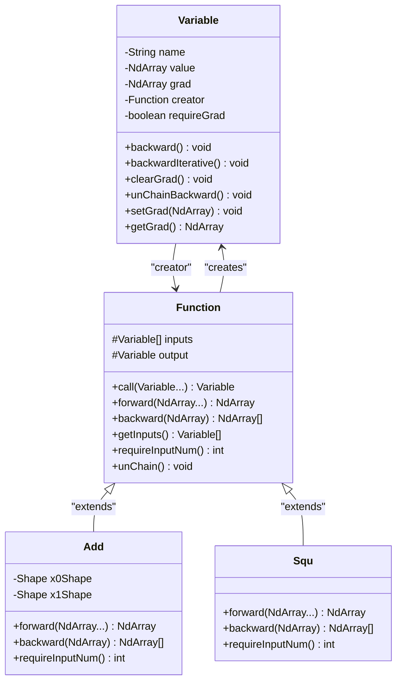
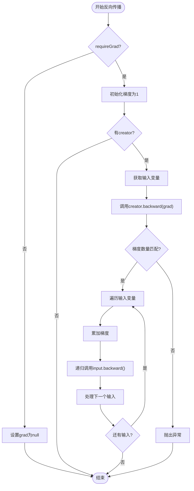
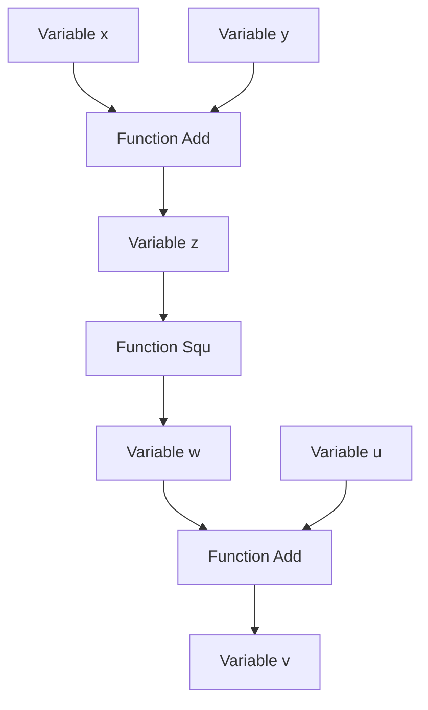

# 反向传播与自动微分系统

<cite>
**本文档中引用的文件**
- [Variable.java](file://tinyai-dl-func/src/main/java/io/leavesfly/tinyai/func/Variable.java)
- [Function.java](file://tinyai-dl-func/src/main/java/io/leavesfly/tinyai/func/Function.java)
- [Add.java](file://tinyai-dl-func/src/main/java/io/leavesfly/tinyai/func/base/Add.java)
- [Squ.java](file://tinyai-dl-func/src/main/java/io/leavesfly/tinyai/func/math/Squ.java)
- [VariableTest.java](file://tinyai-dl-func/src/test/java/io/leavesfly/tinyai/func/VariableTest.java)
</cite>

## 目录
1. [简介](#简介)
2. [核心架构概述](#核心架构概述)
3. [Variable类详解](#variable类详解)
4. [Function基类详解](#function基类详解)
5. [反向传播算法实现](#反向传播算法实现)
6. [梯度累加机制](#梯度累加机制)
7. [迭代式反向传播](#迭代式反向传播)
8. [计算图管理](#计算图管理)
9. [实际应用示例](#实际应用示例)
10. [性能优化考虑](#性能优化考虑)
11. [故障排除指南](#故障排除指南)
12. [总结](#总结)

## 简介

TinyAI的反向传播和自动微分系统是一个精心设计的深度学习框架核心组件，它实现了高效的梯度计算和自动微分功能。该系统通过构建计算图来跟踪变量之间的依赖关系，并使用链式法则自动计算梯度。

系统的核心设计理念包括：
- **递归与迭代双重实现**：提供递归的简洁性和迭代的稳定性
- **梯度累加机制**：支持复杂计算图中的梯度复用
- **计算图管理**：灵活的计算图构建和清理机制
- **广播感知的梯度传播**：正确处理广播操作的梯度计算

## 核心架构概述



**图表来源**
- [Variable.java](file://tinyai-dl-func/src/main/java/io/leavesfly/tinyai/func/Variable.java#L18-L654)
- [Function.java](file://tinyai-dl-func/src/main/java/io/leavesfly/tinyai/func/Function.java#L18-L152)

## Variable类详解

Variable类是TinyAI自动微分系统的核心，它封装了数学变量的概念，不仅包含变量的值，还包含了梯度信息和计算图的引用。

### 核心属性

```java
private String name;              // 变量名称，用于调试和可视化
private NdArray value;            // 变量的实际数值
private NdArray grad;             // 反向传播计算得到的梯度值
private transient Function creator; // 生成该变量的函数
private boolean requireGrad = true; // 是否需要计算梯度
```

### 构造函数设计

Variable类提供了多种构造函数来满足不同的使用场景：

```java
// 基本构造函数
public Variable(NdArray _value)

// 带名称的构造函数
public Variable(NdArray _value, String _name)

// 带梯度需求标志的构造函数
public Variable(NdArray _value, String _name, boolean _requireGrad)
```

### 关键方法实现

#### backward()方法（递归实现）

```java
public void backward() {
    if (!requireGrad) {
        this.grad = null;
        return;
    }
    // 初始化梯度为1
    if (Objects.isNull(grad)) {
        setGrad(NdArray.ones(this.getValue().getShape()));
    }
    
    Function _creator = creator;
    if (!Objects.isNull(_creator)) {
        Variable[] _inputs = _creator.getInputs();
        List<NdArray> grads = _creator.backward(grad);
        
        int index = 0;
        for (Variable input : _inputs) {
            // 累加梯度而不是直接设置
            if (input.getGrad() != null) {
                input.setGrad(input.getGrad().add(grads.get(index)));
            } else {
                input.setGrad(grads.get(index));
            }
            input.backward();
            index++;
        }
    }
}
```

**章节来源**
- [Variable.java](file://tinyai-dl-func/src/main/java/io/leavesfly/tinyai/func/Variable.java#L111-L148)

## Function基类详解

Function类是所有数学函数操作的抽象基类，它定义了前向传播和反向传播的标准接口，并负责构建计算图。

### 核心方法契约

#### call()方法 - 前向传播入口

```java
public Variable call(Variable... _inputs) {
    // 输入验证
    if (_inputs.length != requireInputNum() && requireInputNum() > 0) {
        throw new RuntimeException("Function call inputs Variable requireInputNum error!");
    }

    // 提取NdArray值
    NdArray[] ndArrayInputs = Arrays.stream(_inputs)
            .filter(Objects::nonNull)
            .map(Variable::getValue)
            .toArray(NdArray[]::new);

    // 执行前向传播
    NdArray ndArrayOutput = forward(ndArrayInputs);

    // 创建输出变量
    Variable _output = new Variable(ndArrayOutput);

    // 构建计算图
    if (Config.train) {
        this.inputs = _inputs;
        this.output = _output;
        _output.setCreator(this);
    }

    return _output;
}
```

#### backward()抽象方法 - 反向传播契约

```java
public abstract List<NdArray> backward(NdArray yGrad);
```

**章节来源**
- [Function.java](file://tinyai-dl-func/src/main/java/io/leavesfly/tinyai/func/Function.java#L40-L152)

### 反向传播契约详解

Function类的backward方法遵循严格的契约：

1. **输入参数**：接收输出变量的梯度（yGrad）
2. **返回值**：返回输入变量的梯度列表，顺序与输入变量一致
3. **数量一致性**：返回的梯度列表大小必须等于输入变量的数量
4. **数学正确性**：梯度计算必须符合链式法则

## 反向传播算法实现

### 递归式反向传播流程



**图表来源**
- [Variable.java](file://tinyai-dl-func/src/main/java/io/leavesfly/tinyai/func/Variable.java#L111-L148)

### 具体实现分析

以简单的计算图 `z = x^2 + y` 为例：

1. **前向传播阶段**：
   ```java
   Variable x = new Variable(NdArray.of(3.0f), "x");
   Variable y = new Variable(NdArray.of(2.0f), "y");
   Variable x_squared = x.squ();        // x^2
   Variable z = x_squared.add(y);       // z = x^2 + y
   ```

2. **反向传播阶段**：
   ```java
   z.backward();
   ```

3. **梯度计算过程**：
   - `dz/dx = 2x = 6`
   - `dz/dy = 1`

**章节来源**
- [VariableTest.java](file://tinyai-dl-func/src/test/java/io/leavesfly/tinyai/func/VariableTest.java#L280-L310)

## 梯度累加机制

### 设计原理

TinyAI采用了梯度累加而非覆盖的设计，这一设计具有重要的意义：

```java
// 累加梯度而不是直接设置
if (input.getGrad() != null) {
    input.setGrad(input.getGrad().add(grads.get(index)));
} else {
    input.setGrad(grads.get(index));
}
```

### 优势分析

1. **支持复杂训练场景**：
   - 多次前向传播后的梯度累加
   - 分批处理中的梯度累积
   - 多任务学习中的梯度合并

2. **内存效率**：
   - 避免重复分配内存
   - 减少垃圾回收压力

3. **数值稳定性**：
   - 防止梯度丢失
   - 维持梯度的完整性

### 实际应用场景

```java
// 多次前向传播后的梯度累加
for (int i = 0; i < numIterations; i++) {
    Variable loss = computeLoss(batch);
    loss.backward();  // 梯度累加
}

// 参数更新后清零梯度
optimizer.step();
x.clearGrad();  // 清零梯度
```

**章节来源**
- [Variable.java](file://tinyai-dl-func/src/main/java/io/leavesfly/tinyai/func/Variable.java#L125-L135)
- [VariableTest.java](file://tinyai-dl-func/src/test/java/io/leavesfly/tinyai/func/VariableTest.java#L340-L350)

## 迭代式反向传播

### 问题背景

递归式的反向传播在深层网络或RNN中可能导致栈溢出问题。为了解决这个问题，TinyAI提供了迭代式的反向传播实现。

### 实现原理

```java
public void backwardIterative() {
    if (!requireGrad) {
        this.grad = null;
        return;
    }

    // 初始化梯度为1
    if (Objects.isNull(grad)) {
        setGrad(NdArray.ones(this.getValue().getShape()));
    }

    // 使用栈来模拟递归过程
    Stack<Variable> stack = new Stack<>();
    stack.push(this);

    while (!stack.isEmpty()) {
        Variable currentVar = stack.pop();
        Function currentCreator = currentVar.getCreator();
        
        if (Objects.isNull(currentCreator)) {
            continue;
        }

        Variable[] inputs = currentCreator.getInputs();
        List<NdArray> grads = currentCreator.backward(currentVar.getGrad());

        for (int i = 0; i < inputs.length; i++) {
            Variable input = inputs[i];
            NdArray grad = grads.get(i);

            // 累加梯度
            if (input.getGrad() != null) {
                input.setGrad(input.getGrad().add(grad));
            } else {
                input.setGrad(grad);
            }

            // 如果输入变量有创建者函数，将其加入栈中继续处理
            if (input.getCreator() != null) {
                stack.push(input);
            }
        }
    }
}
```

### 性能对比

| 特性 | 递归实现 | 迭代实现 |
|------|----------|----------|
| 内存使用 | O(depth) | O(max_width) |
| 栈溢出风险 | 高 | 低 |
| 实现复杂度 | 简单 | 中等 |
| 执行效率 | 高 | 中等 |

**章节来源**
- [Variable.java](file://tinyai-dl-func/src/main/java/io/leavesfly/tinyai/func/Variable.java#L150-L188)

## 计算图管理

### 计算图结构



### 关键管理方法

#### unChainBackward() - 切断计算图

```java
public void unChainBackward() {
    Function creatorFunc = creator;
    if (!Objects.isNull(creatorFunc)) {
        Variable[] xs = creatorFunc.getInputs();
        unChain();
        for (Variable x : xs) {
            x.unChainBackward();
        }
    }
}
```

#### clearGrad() - 清理梯度

```java
public void clearGrad() {
    grad = null;
}
```

### 计算图清理的重要性

1. **内存管理**：及时释放不再需要的计算图节点
2. **RNN训练**：防止梯度回传过长导致的梯度消失或爆炸
3. **模型推理**：在推理阶段不需要梯度信息

**章节来源**
- [Variable.java](file://tinyai-dl-func/src/main/java/io/leavesfly/tinyai/func/Variable.java#L190-L200)
- [Variable.java](file://tinyai-dl-func/src/main/java/io/leavesfly/tinyai/func/Variable.java#L202-L206)

## 实际应用示例

### 示例1：简单二次函数的梯度计算

```java
// 创建计算图: z = x^2 + y
Variable x = new Variable(NdArray.of(5.0f), "x");
Variable y = new Variable(NdArray.of(3.0f), "y");

Variable x_squared = x.squ();      // x^2
Variable z = x_squared.add(y);     // z = x^2 + y

// 执行反向传播
z.backward();

// 验证梯度
assertEquals(10f, x.getGrad().getNumber().floatValue(), 1e-6);  // dz/dx = 2x = 10
assertEquals(1f, y.getGrad().getNumber().floatValue(), 1e-6);   // dz/dy = 1
```

### 示例2：复杂计算图的梯度传播

```java
// 创建复杂计算图: z = (x + y) * (x - y) = x^2 - y^2
Variable x = new Variable(NdArray.of(5.0f), "x");
Variable y = new Variable(NdArray.of(3.0f), "y");

Variable sum = x.add(y);     // x + y = 8
Variable diff = x.sub(y);    // x - y = 2
Variable z = sum.mul(diff);  // z = 8 * 2 = 16

z.backward();

// 验证梯度
assertEquals(10f, x.getGrad().getNumber().floatValue(), 1e-6);  // dz/dx = 2x = 10
assertEquals(-6f, y.getGrad().getNumber().floatValue(), 1e-6);  // dz/dy = -2y = -6
```

### 示例3：广播操作的梯度传播

```java
// 广播操作的梯度传播
Variable x = new Variable(NdArray.of(new float[][]{{1, 2, 3}, {4, 5, 6}}), "x");
Variable y = new Variable(NdArray.of(new float[][]{{1, 1, 1}}), "y");

Variable z = x.add(y);         // y会被广播到2行
Variable loss = z.sum();       // 所有元素求和

loss.backward();

// 验证梯度
float[][] expectedXGrad = {{1, 1, 1}, {1, 1, 1}};  // x的梯度全为1
float[][] expectedYGrad = {{2, 2, 2}};             // y的梯度为2（因为被广播到2行）
```

**章节来源**
- [VariableTest.java](file://tinyai-dl-func/src/test/java/io/leavesfly/tinyai/func/VariableTest.java#L313-L340)
- [VariableTest.java](file://tinyai-dl-func/src/test/java/io/leavesfly/tinyai/func/VariableTest.java#L342-L370)

## 性能优化考虑

### 内存优化策略

1. **梯度缓存**：利用梯度累加机制减少内存分配
2. **计算图清理**：及时调用unChainBackward()释放内存
3. **梯度清零**：在训练循环开始前调用clearGrad()

### 计算优化技巧

1. **选择合适的反向传播方式**：
   - 简单网络使用递归实现
   - 深层网络或RNN使用迭代实现

2. **批量处理优化**：
   ```java
   // 批量前向传播
   for (Variable batch : batches) {
       Variable loss = computeLoss(batch);
       loss.backward();  // 梯度累加
   }
   
   // 统一参数更新
   optimizer.step();
   
   // 清零梯度
   for (Variable var : variables) {
       var.clearGrad();
   }
   ```

### 性能监控指标

- **内存使用量**：监控Variable和Function对象的内存占用
- **计算时间**：测量反向传播的执行时间
- **梯度精度**：验证梯度计算的准确性

## 故障排除指南

### 常见错误类型

#### 1. 梯度尺寸不匹配

```java
// 错误：backward返回的梯度数量与输入变量数量不匹配
@Override
public List<NdArray> backward(NdArray yGrad) {
    // 应该返回与输入变量数量相同的梯度列表
    return Collections.singletonList(yGrad);  // 错误：只返回一个梯度
}
```

**解决方案**：
```java
@Override
public List<NdArray> backward(NdArray yGrad) {
    // 确保返回与输入变量数量相同的梯度列表
    return Arrays.asList(yGrad, yGrad);  // 正确：返回两个梯度
}
```

#### 2. 梯度形状不匹配

```java
// 错误：设置梯度时形状不匹配
Variable x = new Variable(NdArray.of(new float[][]{{1, 2}, {3, 4}}));
NdArray invalidGrad = NdArray.of(new float[]{1, 2, 3});  // 形状不匹配
x.setGrad(invalidGrad);  // 抛出异常
```

**解决方案**：
```java
// 确保梯度形状与变量值形状匹配
Variable x = new Variable(NdArray.of(new float[][]{{1, 2}, {3, 4}}));
NdArray validGrad = NdArray.of(new float[][]{{1, 1}, {1, 1}});  // 形状匹配
x.setGrad(validGrad);
```

#### 3. 计算图断裂

```java
// 错误：忘记清理计算图导致内存泄漏
Variable x = new Variable(NdArray.of(3.0f), "x");
Variable y = x.squ();
Variable z = y.add(x);

// 忘记切断计算图
// z.unChainBackward();  // 应该调用这行代码
```

**解决方案**：
```java
// 及时切断计算图
z.unChainBackward();
```

### 调试技巧

1. **启用训练模式**：
   ```java
   Config.train = true;  // 确保计算图被构建
   ```

2. **检查计算图结构**：
   ```java
   // 验证计算图是否正确构建
   assertNotNull(z.getCreator());
   assertNotNull(y.getCreator());
   ```

3. **验证梯度计算**：
   ```java
   // 使用数值微分验证梯度
   float epsilon = 1e-6f;
   // 对x的偏导数近似
   float numericalGrad = (computeLoss(x.add(new Variable(NdArray.of(epsilon)))) - 
                         computeLoss(x)) / epsilon;
   ```

**章节来源**
- [Variable.java](file://tinyai-dl-func/src/main/java/io/leavesfly/tinyai/func/Variable.java#L120-L130)
- [VariableTest.java](file://tinyai-dl-func/src/test/java/io/leavesfly/tinyai/func/VariableTest.java#L372-L390)

## 总结

TinyAI的反向传播和自动微分系统展现了优秀的工程设计和算法实现。通过深入分析其核心组件，我们可以看到以下几个关键特点：

### 系统设计亮点

1. **双重实现策略**：同时提供递归和迭代两种反向传播实现，既保证了代码的简洁性，又解决了深层网络的栈溢出问题。

2. **梯度累加机制**：采用累加而非覆盖的梯度更新策略，支持复杂的训练场景和内存优化。

3. **灵活的计算图管理**：提供了完整的计算图构建、维护和清理机制，适应各种深度学习应用场景。

4. **严格的契约设计**：Function类的backward方法遵循明确的契约，确保了系统的可扩展性和可靠性。

### 技术创新点

- **广播感知的梯度传播**：Add函数的backward方法能够正确处理广播操作的梯度计算
- **智能的内存管理**：通过clearGrad和unChainBackward方法实现有效的内存回收
- **配置驱动的行为**：通过Config.train控制计算图的构建，支持训练和推理两种模式

### 应用价值

该系统不仅为TinyAI框架提供了强大的自动微分能力，也为深度学习框架的设计提供了宝贵的参考。其优雅的架构设计和完善的错误处理机制，使得开发者能够专注于模型开发，而无需担心底层的梯度计算细节。

通过本文档的详细分析，我们深入了解了TinyAI反向传播系统的工作原理和最佳实践，为后续的模型开发和系统优化奠定了坚实的基础。