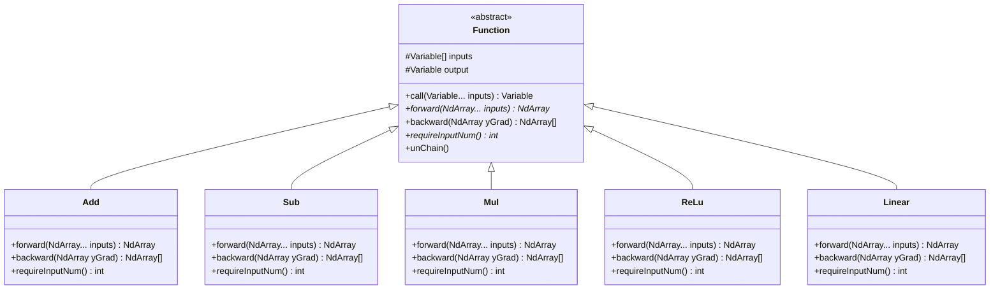

# 数据流与计算图技术文档

<cite>
**本文档中引用的文件**
- [Variable.java](file://tinyai-dl-func/src/main/java/io/leavesfly/tinyai/func/Variable.java)
- [Function.java](file://tinyai-dl-func/src/main/java/io/leavesfly/tinyai/func/Function.java)
- [Add.java](file://tinyai-dl-func/src/main/java/io/leavesfly/tinyai/func/base/Add.java)
- [LineExam.java](file://tinyai-dl-case/src/main/java/io/leavesfly/tinyai/example/regress/LineExam.java)
- [VariableTest.java](file://tinyai-dl-func/src/test/java/io/leavesfly/tinyai/func/VariableTest.java)
- [Config.java](file://tinyai-dl-func/src/main/java/io/leavesfly/tinyai/util/Config.java)
- [Uml.java](file://tinyai-dl-nnet/src/main/java/io/leavesfly/tinyai/nnet/Uml.java)
- [Trainer.java](file://tinyai-dl-ml/src/main/java/io/leavesfly/tinyai/ml/Trainer.java)
- [Util.java](file://tinyai-dl-func/src/main/java/io/leavesfly/tinyai/func/Util.java)
</cite>

## 目录
1. [简介](#简介)
2. [计算图架构概述](#计算图架构概述)
3. [核心组件分析](#核心组件分析)
4. [动态计算图构建机制](#动态计算图构建机制)
5. [前向传播与反向传播](#前向传播与反向传播)
6. [梯度计算与累积](#梯度计算与累积)
7. [计算图生命周期管理](#计算图生命周期管理)
8. [线性回归示例分析](#线性回归示例分析)
9. [计算图可视化](#计算图可视化)
10. [优化策略](#优化策略)
11. [故障排除指南](#故障排除指南)
12. [结论](#结论)

## 简介

TinyAI框架中的数据流与计算图系统是一个动态的自动微分引擎，它能够实时构建和执行计算图，支持高效的梯度计算和反向传播。该系统的核心思想是通过Variable对象在数学运算中自动生成Function节点并建立计算图连接，从而实现端到端的自动微分。

计算图是一种有向无环图（DAG），其中节点代表变量或操作，边代表数据依赖关系。在TinyAI中，计算图的构建是动态的，在运行时根据变量的操作自动完成，无需预先定义静态图结构。

## 计算图架构概述


**图表来源**
- [Variable.java](file://tinyai-dl-func/src/main/java/io/leavesfly/tinyai/func/Variable.java#L1-L50)
- [Function.java](file://tinyai-dl-func/src/main/java/io/leavesfly/tinyai/func/Function.java#L1-L50)

计算图系统由以下关键组件构成：

1. **Variable类**：表示数学变量，包含值、梯度和创建者函数
2. **Function类**：抽象数学函数基类，定义前向和反向传播接口
3. **计算图构建器**：在运行时动态建立变量和函数之间的连接
4. **梯度传播引擎**：实现自动微分的反向传播算法

## 核心组件分析

### Variable类设计

Variable类是计算图系统的核心，它继承了Serializable接口以支持序列化，并包含了计算图所需的所有必要信息。


**图表来源**
- [Variable.java](file://tinyai-dl-func/src/main/java/io/leavesfly/tinyai/func/Variable.java#L20-L100)
- [Function.java](file://tinyai-dl-func/src/main/java/io/leavesfly/tinyai/func/Function.java#L15-L80)

**章节来源**
- [Variable.java](file://tinyai-dl-func/src/main/java/io/leavesfly/tinyai/func/Variable.java#L1-L654)
- [Function.java](file://tinyai-dl-func/src/main/java/io/leavesfly/tinyai/func/Function.java#L1-L152)

### Function类层次结构

Function类定义了所有数学运算的统一接口，支持前向传播和反向传播：



**图表来源**
- [Function.java](file://tinyai-dl-func/src/main/java/io/leavesfly/tinyai/func/Function.java#L15-L152)
- [Add.java](file://tinyai-dl-func/src/main/java/io/leavesfly/tinyai/func/base/Add.java#L15-L50)

## 动态计算图构建机制

### 计算图构建流程

当Variable对象执行数学运算时，系统会自动创建相应的Function节点并建立计算图连接：


**图表来源**
- [Variable.java](file://tinyai-dl-func/src/main/java/io/leavesfly/tinyai/func/Variable.java#L400-L450)
- [Function.java](file://tinyai-dl-func/src/main/java/io/leavesfly/tinyai/func/Function.java#L35-L70)

### 变量构造与初始化

Variable类提供了多种构造方式，支持不同的使用场景：

```java
// 基本构造
Variable x = new Variable(NdArray.of(3.0f));

// 带名称的构造
Variable y = new Variable(NdArray.of(2.0f), "y");

// 带梯度标志的构造
Variable z = new Variable(NdArray.of(1.0f), "z", false); // 不需要梯度
```

**章节来源**
- [Variable.java](file://tinyai-dl-func/src/main/java/io/leavesfly/tinyai/func/Variable.java#L60-L90)

## 前向传播与反向传播

### 前向传播机制

前向传播通过Function的call方法实现，该方法执行以下步骤：

1. **输入验证**：检查输入变量数量是否符合要求
2. **值提取**：从输入变量中提取NdArray值
3. **前向计算**：调用forward方法执行具体运算
4. **图构建**：在训练模式下建立计算图连接


**图表来源**
- [Function.java](file://tinyai-dl-func/src/main/java/io/leavesfly/tinyai/func/Function.java#L35-L70)

### 反向传播算法

反向传播是计算图系统的核心功能，通过递归或迭代的方式计算梯度：

```java
public void backward() {
    if (!requireGrad) {
        this.grad = null;
        return;
    }
    // 初始化梯度为1
    if (Objects.isNull(grad)) {
        setGrad(NdArray.ones(this.getValue().getShape()));
    }
    
    Function _creator = creator;
    if (!Objects.isNull(_creator)) {
        Variable[] _inputs = _creator.getInputs();
        List<NdArray> grads = _creator.backward(grad);
        
        int index = 0;
        for (Variable input : _inputs) {
            // 累加梯度而不是直接设置
            if (input.getGrad() != null) {
                input.setGrad(input.getGrad().add(grads.get(index)));
            } else {
                input.setGrad(grads.get(index));
            }
            input.backward();
            index++;
        }
    }
}
```

**章节来源**
- [Variable.java](file://tinyai-dl-func/src/main/java/io/leavesfly/tinyai/func/Variable.java#L111-L148)

## 梯度计算与累积

### 梯度累加机制

TinyAI采用梯度累加而非覆盖的方式，这允许同一个变量被多次使用而不会丢失梯度信息：

```mermaid
flowchart LR
subgraph "梯度累加过程"
A[初始梯度: null] --> B[第一次计算]
B --> C[梯度: [1, 1]]
C --> D[第二次计算]
D --> E[累加: [2, 2]]
E --> F[第三次计算]
F --> G[累加: [3, 3]]
end
subgraph "梯度清理"
H[调用clearGrad] --> I[梯度置为null]
I --> J[内存释放]
end
```

**图表来源**
- [Variable.java](file://tinyai-dl-func/src/main/java/io/leavesfly/tinyai/func/Variable.java#L186-L200)

### 梯度形状验证

系统严格验证梯度形状与变量值形状的一致性：

```java
public void setGrad(NdArray _grad) {
    if (_grad == null) {
        return;
    }
    if (!_grad.getShape().equals(value.getShape())) {
        throw new RuntimeException("_grad shape must equal value shape!");
    }
    if (requireGrad) {
        this.grad = _grad;
    } else {
        this.grad = null;
    }
}
```

**章节来源**
- [Variable.java](file://tinyai-dl-func/src/main/java/io/leavesfly/tinyai/func/Variable.java#L200-L220)

## 计算图生命周期管理

### 图结构回收

计算图的生命周期管理包括梯度清零、内存释放和图结构回收：


**图表来源**
- [Variable.java](file://tinyai-dl-func/src/main/java/io/leavesfly/tinyai/func/Variable.java#L149-L230)

### RNN中的梯度截断

在RNN等场景中，可以通过unChainBackward方法切断过长的计算图：

```java
public void unChainBackward() {
    Function creatorFunc = creator;
    if (!Objects.isNull(creatorFunc)) {
        Variable[] xs = creatorFunc.getInputs();
        unChain();
        for (Variable x : xs) {
            x.unChainBackward();
        }
    }
}
```

**章节来源**
- [Variable.java](file://tinyai-dl-func/src/main/java/io/leavesfly/tinyai/func/Variable.java#L149-L170)

## 线性回归示例分析

### 完整训练流程

让我们通过线性回归示例来理解整个计算图的使用流程：

```mermaid
sequenceDiagram
participant Data as 数据准备
participant Model as 模型参数
participant Graph as 计算图
participant Loss as 损失函数
participant Opt as 优化器
Data->>Model : 初始化权重w, b
Model->>Graph : 创建Variable对象
Graph->>Graph : 前向传播 : y_pred = x * w + b
Graph->>Loss : 计算损失 : MSE(y_true, y_pred)
Loss->>Graph : 反向传播计算梯度
Graph->>Opt : 更新参数 : w -= lr * grad_w
Graph->>Opt : 更新参数 : b -= lr * grad_b
Note over Data,Opt : 重复上述过程直到收敛
```

**图表来源**
- [LineExam.java](file://tinyai-dl-case/src/main/java/io/leavesfly/tinyai/example/regress/LineExam.java#L40-L80)

### 示例代码解析

```java
// 1. 数据准备
Variable variableX = new Variable(NdArray.of(x), "x", false).transpose();
Variable variableY = new Variable(NdArray.of(y), "y", false).transpose();

// 2. 前向传播
Variable predict = predict(variableX, w, b);

// 3. 损失计算
Variable loss = meanSquaError(variableY, predict);

// 4. 梯度清零
w.clearGrad();
b.clearGrad();

// 5. 反向传播
loss.backward();

// 6. 参数更新
w.setValue(w.getValue().sub(w.getGrad().mul(learnRate)));
b.setValue(b.getValue().sub(b.getGrad().mul(learnRate)));
```

**章节来源**
- [LineExam.java](file://tinyai-dl-case/src/main/java/io/leavesfly/tinyai/example/regress/LineExam.java#L40-L80)

## 计算图可视化

### UML可视化工具

TinyAI提供了Uml类来可视化计算图结构：

```java
public static String getDotGraph(Variable variableNode) {
    StringBuilder dotGraph = new StringBuilder();
    getDotNode(variableNode, dotGraph);
    return "@startuml\ndigraph g {\n" + "rankdir=LR;\n" + dotGraph + "}\n@enduml";
}

private static String getDotVar(Variable node) {
    String dotVar = "%s [label=\"%s\", color=orange, style=filled]\n";
    StringBuilder label = new StringBuilder();
    if (node.getName() != null) {
        label.append(node.getName()).append(" ");
    }
    return String.format(dotVar, node.hashCode(), label);
}

private static String getDotFunc(Function node) {
    StringBuilder dotFunc = new StringBuilder("%s [label=\"%s\", color=lightblue, style=filled, shape=box]\n");
    String docEdge = " %s -> %s\n";
    dotFunc = new StringBuilder(String.format(dotFunc.toString(), 
        node.hashCode(), node.getClass().getSimpleName()));
    for (Variable input : node.getInputs()) {
        dotFunc.append(String.format(docEdge, input.hashCode(), node.hashCode()));
    }
    dotFunc.append(String.format(docEdge, node.hashCode(), node.getOutput().hashCode()));
    return dotFunc.toString();
}
```

**章节来源**
- [Uml.java](file://tinyai-dl-nnet/src/main/java/io/leavesfly/tinyai/nnet/Uml.java#L25-L101)

### 可视化示例

假设我们有以下计算图：
```
x -> Add -> z -> Square -> w
      |-> y
```

对应的DOT图表示：
```
digraph g {
rankdir=LR;
12345 [label="x", color=orange, style=filled]
67890 [label="y", color=orange, style=filled]
54321 [label="Add", color=lightblue, style=filled, shape=box]
98765 [label="Square", color=lightblue, style=filled, shape=box]
12345 -> 54321
67890 -> 54321
54321 -> 98765
}
```

## 优化策略

### 操作融合

虽然当前实现主要关注功能完整性，但计算图系统为未来的优化提供了良好的基础：

1. **操作融合**：将多个简单操作合并为复合操作
2. **内存复用**：重用中间结果的内存空间
3. **计算图简化**：移除不必要的中间节点

### 性能优化建议


**章节来源**
- [Trainer.java](file://tinyai-dl-ml/src/main/java/io/leavesfly/tinyai/ml/Trainer.java#L150-L200)

## 故障排除指南

### 常见问题与解决方案

1. **梯度形状不匹配**
   ```java
   // 错误：梯度形状与变量值形状不一致
   throw new RuntimeException("_grad shape must equal value shape!");
   
   // 解决方案：检查前向传播和反向传播的形状一致性
   ```

2. **计算图断开**
   ```java
   // 问题：反向传播无法找到creator
   assertNull(z.getCreator());
   
   // 解决方案：确保在训练模式下创建变量
   Config.train = true;
   ```

3. **内存泄漏**
   ```java
   // 问题：忘记清零梯度导致内存持续增长
   // 解决方案：在每轮训练开始前调用clearGrad()
   w.clearGrad();
   b.clearGrad();
   ```

**章节来源**
- [VariableTest.java](file://tinyai-dl-func/src/test/java/io/leavesfly/tinyai/func/VariableTest.java#L110-L130)

### 调试技巧

1. **使用UML可视化**：通过`Uml.getDotGraph()`查看计算图结构
2. **检查训练模式**：确保`Config.train`设置正确
3. **验证形状一致性**：在调试阶段打印变量和梯度的形状
4. **逐步验证**：从简单的二元运算开始，逐步增加复杂度

## 结论

TinyAI的数据流与计算图系统提供了一个强大而灵活的自动微分框架。通过动态计算图的构建与执行机制，系统能够高效地支持各种数学运算和梯度计算。核心特性包括：

1. **动态图构建**：在运行时自动建立计算图连接
2. **递归反向传播**：支持复杂的嵌套计算图
3. **梯度累加机制**：允许多次使用同一变量而不丢失梯度
4. **内存管理**：提供清晰的生命周期管理和资源回收
5. **可视化支持**：通过UML工具提供直观的计算图表示

该系统为深度学习模型的训练和推理提供了坚实的基础，同时保持了代码的简洁性和可维护性。通过合理的优化策略和最佳实践，可以进一步提升系统的性能和稳定性。