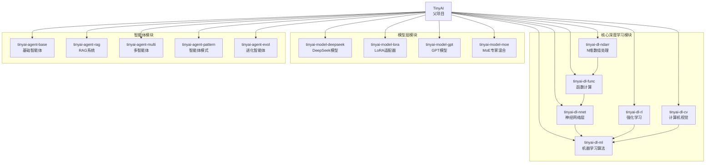
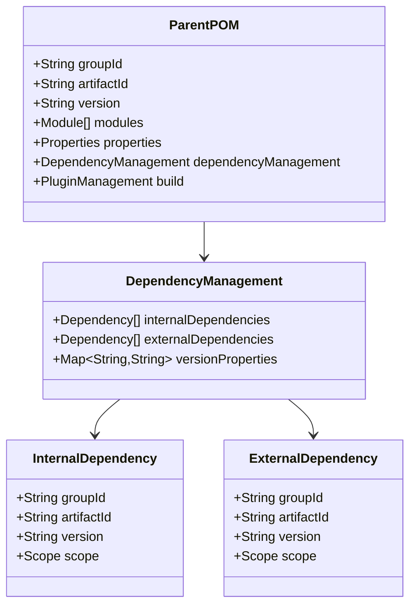
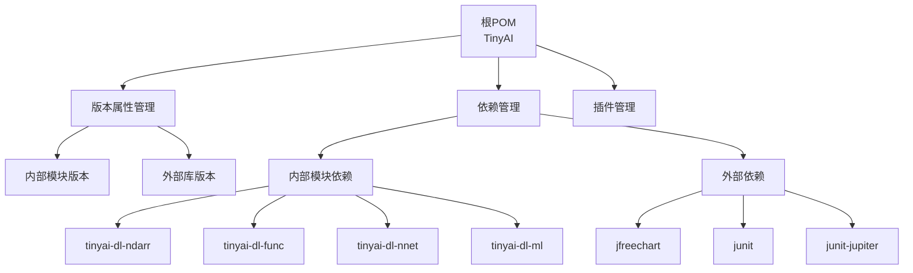
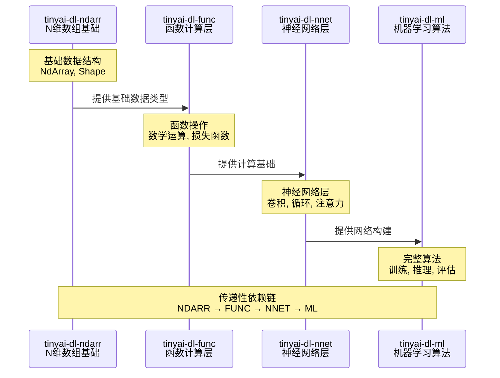
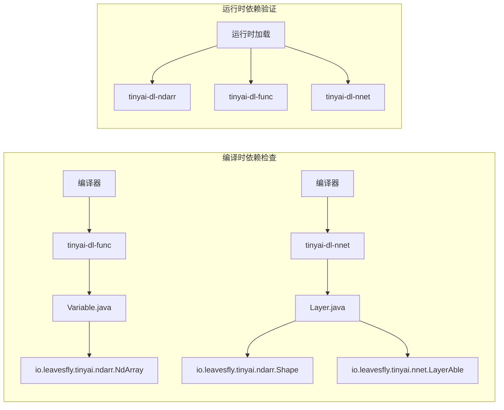
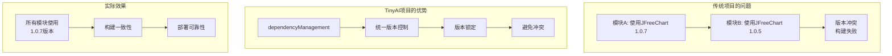
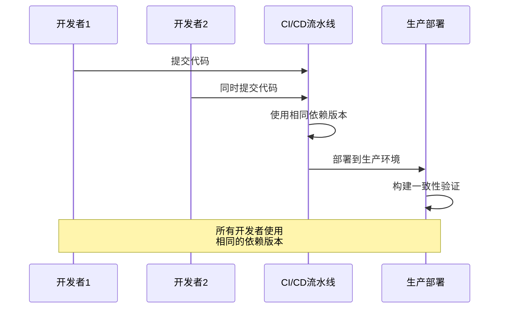
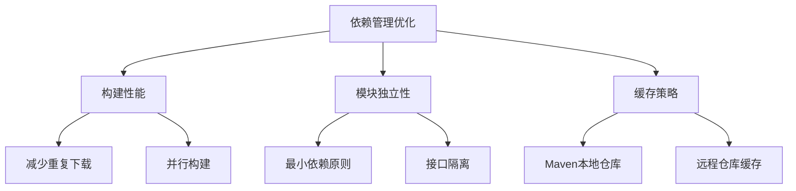

# 依赖管理

<cite>
**本文档中引用的文件**
- [pom.xml](file://pom.xml)
- [tinyai-dl-ndarr/pom.xml](file://tinyai-dl-ndarr/pom.xml)
- [tinyai-dl-func/pom.xml](file://tinyai-dl-func/pom.xml)
- [tinyai-dl-nnet/pom.xml](file://tinyai-dl-nnet/pom.xml)
- [tinyai-dl-ml/pom.xml](file://tinyai-dl-ml/pom.xml)
- [tinyai-agent-base/pom.xml](file://tinyai-agent-base/pom.xml)
- [tinyai-dl-func/src/main/java/io/leavesfly/tinyai/func/Variable.java](file://tinyai-dl-func/src/main/java/io/leavesfly/tinyai/func/Variable.java)
- [tinyai-dl-nnet/src/main/java/io/leavesfly/tinyai/nnet/Layer.java](file://tinyai-dl-nnet/src/main/java/io/leavesfly/tinyai/nnet/Layer.java)
</cite>

## 目录
1. [简介](#简介)
2. [项目结构概览](#项目结构概览)
3. [核心依赖管理架构](#核心依赖管理架构)
4. [内部模块依赖链分析](#内部模块依赖链分析)
5. [外部依赖版本控制](#外部依赖版本控制)
6. [实际应用案例](#实际应用案例)
7. [依赖管理优势](#依赖管理优势)
8. [最佳实践建议](#最佳实践建议)
9. [总结](#总结)

## 简介

TinyAI项目采用了Maven的dependencyManagement机制来实现统一的依赖版本管理。这种设计模式通过在父POM中定义所有模块共享的依赖版本，实现了对内部模块依赖和外部库版本的集中控制。本文档将深入分析这种依赖管理模式，展示其如何避免版本冲突、简化依赖升级并确保构建一致性。

## 项目结构概览

TinyAI项目采用多模块Maven项目结构，包含以下主要模块类别：



**图表来源**
- [pom.xml](file://pom.xml#L12-L30)

## 核心依赖管理架构

### 父POM配置结构

根POM文件通过dependencyManagement部分实现了完整的依赖版本控制体系：



**图表来源**
- [pom.xml](file://pom.xml#L40-L110)

### 依赖管理层次结构



**图表来源**
- [pom.xml](file://pom.xml#L32-L45)
- [pom.xml](file://pom.xml#L47-L110)

**章节来源**
- [pom.xml](file://pom.xml#L1-L148)

## 内部模块依赖链分析

### 传递性依赖管理

TinyAI项目建立了清晰的内部模块依赖链，形成了从底层到高层的完整技术栈：



**图表来源**
- [tinyai-dl-ndarr/pom.xml](file://tinyai-dl-ndarr/pom.xml#L15-L25)
- [tinyai-dl-func/pom.xml](file://tinyai-dl-func/pom.xml#L25-L35)
- [tinyai-dl-nnet/pom.xml](file://tinyai-dl-nnet/pom.xml#L25-L40)
- [tinyai-dl-ml/pom.xml](file://tinyai-dl-ml/pom.xml#L25-L45)

### 具体依赖关系实现

#### tinyai-dl-func模块依赖

```xml
<!-- 依赖tinyai-ndarr模块 -->
<dependency>
    <groupId>io.leavesfly.tinyai</groupId>
    <artifactId>tinyai-dl-ndarr</artifactId>
</dependency>
```

#### tinyai-dl-nnet模块依赖

```xml
<!-- 依赖tinyai-ndarr模块 -->
<dependency>
    <groupId>io.leavesfly.tinyai</groupId>
    <artifactId>tinyai-dl-ndarr</artifactId>
</dependency>

<!-- 依赖tinyai-func模块 -->
<dependency>
    <groupId>io.leavesfly.tinyai</groupId>
    <artifactId>tinyai-dl-func</artifactId>
</dependency>
```

#### tinyai-dl-ml模块依赖

```xml
<!-- 依赖tinyai-func模块 -->
<dependency>
    <groupId>io.leavesfly.tinyai</groupId>
    <artifactId>tinyai-dl-func</artifactId>
</dependency>

<!-- 依赖tinyai-ndarr模块 -->
<dependency>
    <groupId>io.leavesfly.tinyai</groupId>
    <artifactId>tinyai-dl-ndarr</artifactId>
</dependency>

<!-- 依赖tinyai-nnet模块 -->
<dependency>
    <groupId>io.leavesfly.tinyai</groupId>
    <artifactId>tinyai-dl-nnet</artifactId>
</dependency>
```

**章节来源**
- [tinyai-dl-func/pom.xml](file://tinyai-dl-func/pom.xml#L25-L35)
- [tinyai-dl-nnet/pom.xml](file://tinyai-dl-nnet/pom.xml#L25-L40)
- [tinyai-dl-ml/pom.xml](file://tinyai-dl-ml/pom.xml#L25-L45)

## 外部依赖版本控制

### JFreeChart可视化库版本管理

JFreeChart是一个强大的Java图表库，在TinyAI项目中主要用于数据可视化和结果展示：

```xml
<dependency>
    <groupId>jfree</groupId>
    <artifactId>jfreechart</artifactId>
    <version>${jfreechart.version}</version>
</dependency>
```

**版本特性：**
- **版本锁定**：通过`${jfreechart.version}`属性统一管理
- **版本稳定性**：使用1.0.7稳定版本
- **跨模块共享**：所有子模块均可继承此依赖配置

### JUnit测试框架版本管理

项目同时支持JUnit 4和JUnit 5两个版本的测试框架：

```xml
<!-- JUnit 4测试框架 -->
<dependency>
    <groupId>junit</groupId>
    <artifactId>junit</artifactId>
    <version>${junit.version}</version>
    <scope>test</scope>
</dependency>

<!-- JUnit 5测试框架 -->
<dependency>
    <groupId>org.junit.jupiter</groupId>
    <artifactId>junit-jupiter</artifactId>
    <version>${junit-jupiter.version}</version>
    <scope>test</scope>
</dependency>
```

**版本管理策略：**
- **双版本支持**：同时维护JUnit 4和JUnit 5兼容性
- **作用域隔离**：仅在测试阶段生效
- **版本统一**：通过属性管理确保版本一致性

### Maven插件版本管理

```xml
<plugin>
    <groupId>org.apache.maven.plugins</groupId>
    <artifactId>maven-compiler-plugin</artifactId>
    <version>${maven-compiler-plugin.version}</version>
    <configuration>
        <source>${maven.compiler.source}</source>
        <target>${maven.compiler.target}</target>
    </configuration>
</plugin>
```

**插件管理优势：**
- **编译器版本统一**：Java 17源码兼容
- **构建工具标准化**：确保跨环境一致性
- **插件版本控制**：避免插件版本不一致问题

**章节来源**
- [pom.xml](file://pom.xml#L32-L45)
- [pom.xml](file://pom.xml#L105-L115)

## 实际应用案例

### 子模块依赖声明示例

#### tinyai-dl-func模块的实际依赖使用

在`Variable.java`类中可以看到对上游模块的直接引用：

```java
// 引入N维数组基础类型
import io.leavesfly.tinyai.ndarr.NdArray;
import io.leavesfly.tinyai.ndarr.Shape;

// 引入函数计算相关类
import io.leavesfly.tinyai.func.base.*;
import io.leavesfly.tinyai.func.loss.MeanSE;
import io.leavesfly.tinyai.func.math.*;
import io.leavesfly.tinyai.func.matrix.*;
```

#### tinyai-dl-nnet模块的实际依赖使用

在`Layer.java`类中展示了对上游模块的依赖：

```java
// 引入N维数组形状定义
import io.leavesfly.tinyai.ndarr.Shape;

// 引入参数管理基础类
import io.leavesfly.tinyai.nnet.LayerAble;
```

### 依赖传递性验证



**图表来源**
- [tinyai-dl-func/src/main/java/io/leavesfly/tinyai/func/Variable.java](file://tinyai-dl-func/src/main/java/io/leavesfly/tinyai/func/Variable.java#L1-L15)
- [tinyai-dl-nnet/src/main/java/io/leavesfly/tinyai/nnet/Layer.java](file://tinyai-dl-nnet/src/main/java/io/leavesfly/tinyai/nnet/Layer.java#L1-L10)

**章节来源**
- [tinyai-dl-func/src/main/java/io/leavesfly/tinyai/func/Variable.java](file://tinyai-dl-func/src/main/java/io/leavesfly/tinyai/func/Variable.java#L1-L50)
- [tinyai-dl-nnet/src/main/java/io/leavesfly/tinyai/nnet/Layer.java](file://tinyai-dl-nnet/src/main/java/io/leavesfly/tinyai/nnet/Layer.java#L1-L51)

## 依赖管理优势

### 避免版本冲突

通过dependencyManagement机制，项目实现了以下版本控制优势：



### 简化依赖升级

当需要升级某个外部库时，只需修改父POM中的版本属性：

```xml
<!-- 升级前 -->
<jfreechart.version>1.0.7</jfreechart.version>

<!-- 升级后 -->
<jfreechart.version>1.5.3</jfreechart.version>
```

**升级流程：**
1. 修改父POM中的版本属性
2. 执行`mvn clean install`
3. 自动更新所有子模块的依赖版本
4. 验证构建完整性

### 确保构建一致性



## 最佳实践建议

### 依赖管理最佳实践

1. **版本锁定策略**
   - 在父POM中统一管理所有外部依赖版本
   - 使用属性占位符实现版本集中控制
   - 定期审查和更新依赖版本

2. **模块间依赖设计**
   - 建立清晰的依赖层次结构
   - 避免循环依赖
   - 使用接口而非具体实现类

3. **测试依赖管理**
   - 区分开发和测试依赖
   - 使用适当的依赖范围
   - 支持多种测试框架

### 性能优化建议



## 总结

TinyAI项目的依赖管理设计体现了现代软件工程的最佳实践。通过Maven的dependencyManagement机制，项目成功实现了：

1. **统一的版本控制**：所有内部模块和外部依赖版本在父POM中集中管理
2. **清晰的依赖层次**：从tinyai-dl-ndarr到tinyai-dl-ml的传递性依赖链
3. **稳定的外部依赖**：JFreeChart和JUnit框架的版本锁定机制
4. **高效的构建流程**：避免版本冲突，简化依赖升级，确保构建一致性

这种设计不仅提高了开发效率，还增强了项目的可维护性和稳定性。对于大型多模块项目而言，这种依赖管理模式是值得借鉴和推广的实践经验。

通过本文档的分析，我们可以看到TinyAI项目在依赖管理方面的精心设计，这为项目的长期发展奠定了坚实的基础。无论是新开发者的学习路径，还是现有团队的工作流程，这种清晰的依赖结构都提供了极大的便利和支持。