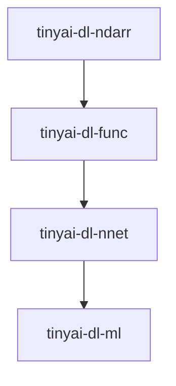

# 内部模块依赖

<cite>
**本文档引用的文件**   
- [pom.xml](file://pom.xml)
- [tinyai-dl-ndarr/pom.xml](file://tinyai-dl-ndarr/pom.xml)
- [tinyai-dl-func/pom.xml](file://tinyai-dl-func/pom.xml)
- [tinyai-dl-nnet/pom.xml](file://tinyai-dl-nnet/pom.xml)
- [tinyai-dl-ml/pom.xml](file://tinyai-dl-ml/pom.xml)
- [tinyai-dl-ndarr/src/main/java/io/leavesfly/tinyai/ndarr/NdArray.java](file://tinyai-dl-ndarr/src/main/java/io/leavesfly/tinyai/ndarr/NdArray.java)
- [tinyai-dl-func/src/main/java/io/leavesfly/tinyai/func/Variable.java](file://tinyai-dl-func/src/main/java/io/leavesfly/tinyai/func/Variable.java)
- [tinyai-dl-nnet/src/main/java/io/leavesfly/tinyai/nnet/Layer.java](file://tinyai-dl-nnet/src/main/java/io/leavesfly/tinyai/nnet/Layer.java)
- [tinyai-dl-nnet/src/main/java/io/leavesfly/tinyai/nnet/Block.java](file://tinyai-dl-nnet/src/main/java/io/leavesfly/tinyai/nnet/Block.java)
- [tinyai-dl-ml/src/main/java/io/leavesfly/tinyai/ml/Model.java](file://tinyai-dl-ml/src/main/java/io/leavesfly/tinyai/ml/Model.java)
- [tinyai-dl-case/src/main/java/io/leavesfly/tinyai/example/classify/SpiralMlpExam.java](file://tinyai-dl-case/src/main/java/io/leavesfly/tinyai/example/classify/SpiralMlpExam.java)
</cite>

## 目录
1. [模块依赖链概述](#模块依赖链概述)
2. [技术栈定位分析](#技术栈定位分析)
3. [依赖管理机制](#依赖管理机制)
4. [跨模块调用示例](#跨模块调用示例)
5. [架构优势](#架构优势)

## 模块依赖链概述

TinyAI项目采用分层架构设计，核心深度学习模块之间存在明确的层级依赖关系：`tinyai-dl-ndarr` → `tinyai-dl-func` → `tinyai-dl-nnet` → `tinyai-dl-ml`。这种设计遵循了从基础数据结构到高级功能的构建原则，确保了代码的模块化和可维护性。



**Diagram sources**
- [pom.xml](file://pom.xml)

**Section sources**
- [pom.xml](file://pom.xml)

## 技术栈定位分析

### 基础多维数组运算 (tinyai-dl-ndarr)

`tinyai-dl-ndarr`模块提供了基础的多维数组运算能力，是整个深度学习框架的基石。该模块定义了`NdArray`接口，封装了各种数学运算和数组操作。

```java
public interface NdArray {
    // 基础四则运算
    NdArray add(NdArray other);
    NdArray sub(NdArray other);
    NdArray mul(NdArray other);
    NdArray div(NdArray other);
    
    // 数学函数
    NdArray exp();
    NdArray log();
    NdArray sin();
    NdArray cos();
    NdArray tanh();
    NdArray sigmoid();
    NdArray softMax();
    
    // 数组变形
    NdArray reshape(Shape newShape);
    NdArray transpose();
    NdArray broadcastTo(Shape _shape);
    
    // 统计聚合
    NdArray sum();
    NdArray mean(int axis);
    NdArray var(int axis);
    NdArray sum(int axis);
}
```

**Section sources**
- [tinyai-dl-ndarr/src/main/java/io/leavesfly/tinyai/ndarr/NdArray.java](file://tinyai-dl-ndarr/src/main/java/io/leavesfly/tinyai/ndarr/NdArray.java)

### 自动微分系统 (tinyai-dl-func)

`tinyai-dl-func`模块基于`tinyai-dl-ndarr`构建了自动微分系统，核心是`Variable`类。`Variable`不仅包含数值，还维护了计算图信息，支持反向传播。

```java
public class Variable implements Serializable {
    private NdArray value;
    private NdArray grad;
    private transient Function creator;
    private boolean requireGrad = true;
    
    // 四则运算
    public Variable add(Variable other);
    public Variable sub(Variable other);
    public Variable mul(Variable other);
    public Variable div(Variable other);
    
    // 数学函数
    public Variable exp();
    public Variable log();
    public Variable sin();
    public Variable cos();
    public Variable tanh();
    public Variable sigmoid();
    public Variable softMax();
    public Variable relu();
    
    // 反向传播
    public void backward();
    public void backwardIterative();
}
```

**Section sources**
- [tinyai-dl-func/src/main/java/io/leavesfly/tinyai/func/Variable.java](file://tinyai-dl-func/src/main/java/io/leavesfly/tinyai/func/Variable.java)

### 神经网络层 (tinyai-dl-nnet)

`tinyai-dl-nnet`模块实现了神经网络的各种层和块，基于`tinyai-dl-func`的自动微分系统。核心类包括`Layer`和`Block`。

```java
public abstract class Layer extends LayerAble {
    protected Map<String, Parameter> params;
    protected Shape inputShape;
    protected Shape outputShape;
    
    public abstract Variable layerForward(Variable... inputs);
    public abstract void clearGrads();
}

public abstract class Block extends LayerAble {
    protected List<LayerAble> layers;
    
    @Override
    public Variable layerForward(Variable... inputs) {
        Variable x = inputs[0];
        Variable y = layers.get(0).layerForward(x);
        for (int i = 1; i < layers.size(); i++) {
            y = layers.get(i).layerForward(y);
        }
        return y;
    }
}
```

**Section sources**
- [tinyai-dl-nnet/src/main/java/io/leavesfly/tinyai/nnet/Layer.java](file://tinyai-dl-nnet/src/main/java/io/leavesfly/tinyai/nnet/Layer.java)
- [tinyai-dl-nnet/src/main/java/io/leavesfly/tinyai/nnet/Block.java](file://tinyai-dl-nnet/src/main/java/io/leavesfly/tinyai/nnet/Block.java)

### 机器学习核心 (tinyai-dl-ml)

`tinyai-dl-ml`模块整合了前三个模块，构建了机器学习的核心功能，包括模型、训练器、优化器等。核心类是`Model`。

```java
public class Model implements Serializable {
    private String name;
    private Block block;
    private ModelInfo modelInfo;
    
    public Variable forward(Variable... inputs) {
        return block.layerForward(inputs);
    }
    
    public void clearGrads() {
        block.clearGrads();
    }
    
    public Map<String, Parameter> getAllParams() {
        return block.getAllParams();
    }
}
```

**Section sources**
- [tinyai-dl-ml/src/main/java/io/leavesfly/tinyai/ml/Model.java](file://tinyai-dl-ml/src/main/java/io/leavesfly/tinyai/ml/Model.java)

## 依赖管理机制

### 父POM统一管理

项目通过父POM文件统一管理内部模块版本，子模块通过`groupId`和`artifactId`引用而无需指定版本号。

```xml
<!-- 父POM中的dependencyManagement -->
<dependencyManagement>
    <dependencies>
        <dependency>
            <groupId>io.leavesfly.tinyai</groupId>
            <artifactId>tinyai-dl-ndarr</artifactId>
            <version>${project.version}</version>
        </dependency>
        <dependency>
            <groupId>io.leavesfly.tinyai</groupId>
            <artifactId>tinyai-dl-func</artifactId>
            <version>${project.version}</version>
        </dependency>
        <dependency>
            <groupId>io.leavesfly.tinyai</groupId>
            <artifactId>tinyai-dl-nnet</artifactId>
            <version>${project.version}</version>
        </dependency>
        <dependency>
            <groupId>io.leavesfly.tinyai</groupId>
            <artifactId>tinyai-dl-ml</artifactId>
            <version>${project.version}</version>
        </dependency>
    </dependencies>
</dependencyManagement>
```

### 子模块依赖配置

子模块通过继承父POM并声明依赖来实现版本统一管理。

```xml
<!-- tinyai-dl-func的pom.xml -->
<parent>
    <groupId>io.leavesfly.tinyai</groupId>
    <artifactId>TinyAI</artifactId>
    <version>1.0-SNAPSHOT</version>
</parent>

<artifactId>tinyai-dl-func</artifactId>

<dependencies>
    <!-- 依赖tinyai-ndarr模块 -->
    <dependency>
        <groupId>io.leavesfly.tinyai</groupId>
        <artifactId>tinyai-dl-ndarr</artifactId>
    </dependency>
</dependencies>
```

```xml
<!-- tinyai-dl-nnet的pom.xml -->
<parent>
    <groupId>io.leavesfly.tinyai</groupId>
    <artifactId>TinyAI</artifactId>
    <version>1.0-SNAPSHOT</version>
</parent>

<artifactId>tinyai-dl-nnet</artifactId>

<dependencies>
    <dependency>
        <groupId>io.leavesfly.tinyai</groupId>
        <artifactId>tinyai-dl-ndarr</artifactId>
    </dependency>
    <dependency>
        <groupId>io.leavesfly.tinyai</groupId>
        <artifactId>tinyai-dl-func</artifactId>
    </dependency>
</dependencies>
```

```xml
<!-- tinyai-dl-ml的pom.xml -->
<parent>
    <groupId>io.leavesfly.tinyai</groupId>
    <artifactId>TinyAI</artifactId>
    <version>1.0-SNAPSHOT</version>
</parent>

<artifactId>tinyai-dl-ml</artifactId>

<dependencies>
    <dependency>
        <groupId>io.leavesfly.tinyai</groupId>
        <artifactId>tinyai-dl-func</artifactId>
    </dependency>
    <dependency>
        <groupId>io.leavesfly.tinyai</groupId>
        <artifactId>tinyai-dl-ndarr</artifactId>
    </dependency>
    <dependency>
        <groupId>io.leavesfly.tinyai</groupId>
        <artifactId>tinyai-dl-nnet</artifactId>
    </dependency>
</dependencies>
```

**Section sources**
- [pom.xml](file://pom.xml)
- [tinyai-dl-ndarr/pom.xml](file://tinyai-dl-ndarr/pom.xml)
- [tinyai-dl-func/pom.xml](file://tinyai-dl-func/pom.xml)
- [tinyai-dl-nnet/pom.xml](file://tinyai-dl-nnet/pom.xml)
- [tinyai-dl-ml/pom.xml](file://tinyai-dl-ml/pom.xml)

## 跨模块调用示例

以下代码示例展示了如何在实际应用中跨模块调用：

```java
// 创建数据集
ArrayDataset dataSet = new SpiralDateSet(batchSize);

// 创建神经网络块
Block block = new MlpBlock("MlpBlock", batchSize, null, inputSize, hiddenSize, hiddenSize, outputSize);

// 创建模型
Model model = new Model("SpiralMlpExam", block);

// 创建优化器、损失函数和评估器
Optimizer optimizer = new SGD(model, learRate);
Loss lossFunc = new SoftmaxCrossEntropy();
Classify accuracy = new Classify();

// 训练循环
for (int i = 0; i < maxEpoch; i++) {
    float sumLoss = 0f;
    float sumAcc = 0f;
    for (Batch batch : batches) {
        Variable variableX = batch.toVariableX().setName("x").setRequireGrad(false);
        Variable variableY = batch.toVariableY().setName("y").setRequireGrad(false);
        Variable predict = model.forward(variableX);
        Variable loss = lossFunc.loss(variableY, predict);
        float acc = accuracy.accuracyRate(variableY, predict);

        model.clearGrads();
        loss.backward();
        optimizer.update();
        
        sumLoss += loss.getValue().getNumber().floatValue();
        sumAcc += acc;
    }
}
```

**Section sources**
- [tinyai-dl-case/src/main/java/io/leavesfly/tinyai/example/classify/SpiralMlpExam.java](file://tinyai-dl-case/src/main/java/io/leavesfly/tinyai/example/classify/SpiralMlpExam.java)

## 架构优势

### 代码复用

分层架构使得每个模块都可以独立开发和测试，同时为上层模块提供稳定接口。例如，`NdArray`提供的基础运算可以在`Variable`、`Layer`等各个层级复用。

### 降低耦合度

通过清晰的接口定义和依赖关系，各模块之间的耦合度被有效降低。`tinyai-dl-ml`模块不需要关心`NdArray`的具体实现，只需要使用其提供的API。

### 简化维护

当需要修改某个功能时，只需关注特定模块。例如，如果需要优化矩阵乘法性能，只需修改`NdArray`的实现，而不需要改动上层的`Variable`或`Layer`类。

### 易于扩展

新的功能可以作为独立模块添加，而不会影响现有代码。例如，可以轻松添加新的神经网络层类型或优化算法，而不需要修改核心框架。