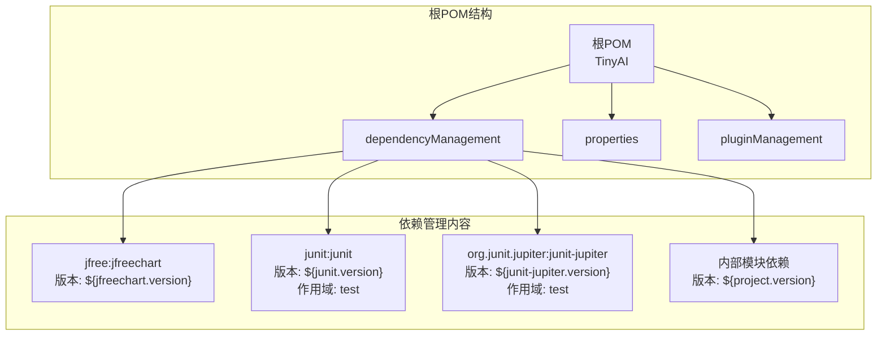
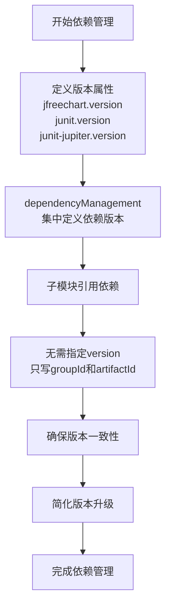
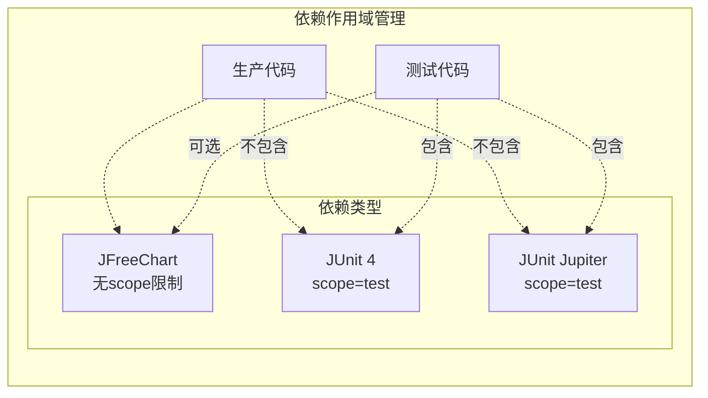
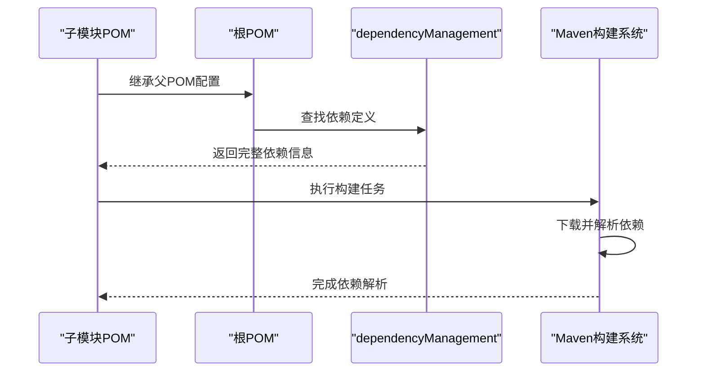
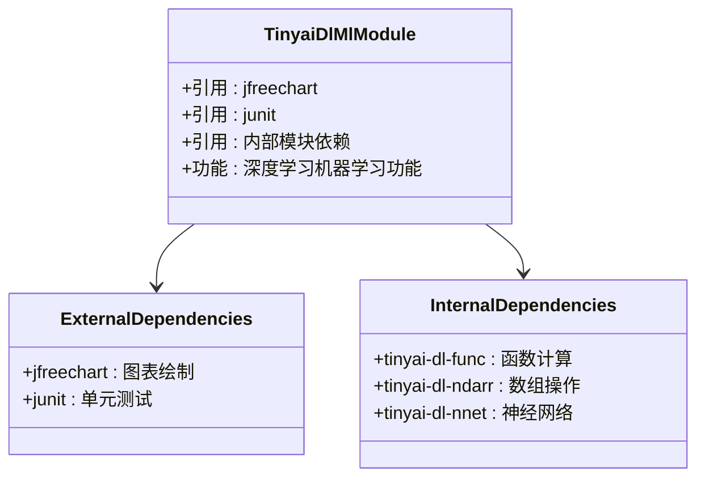
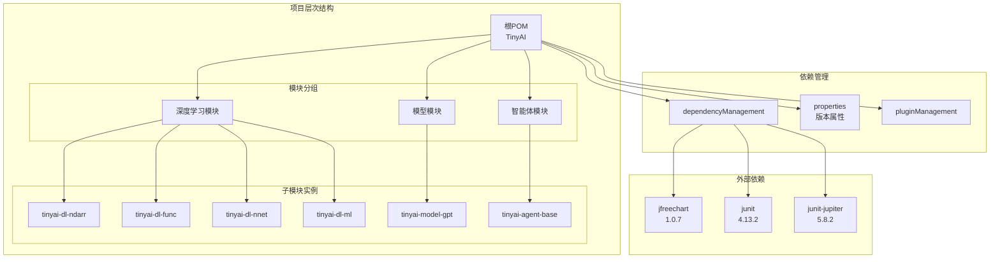
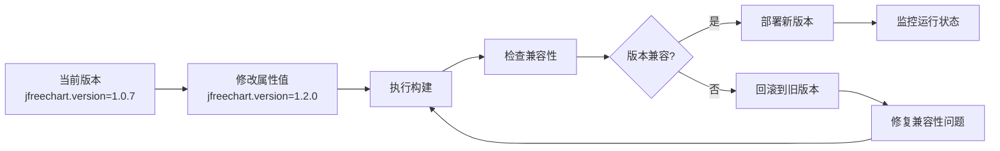
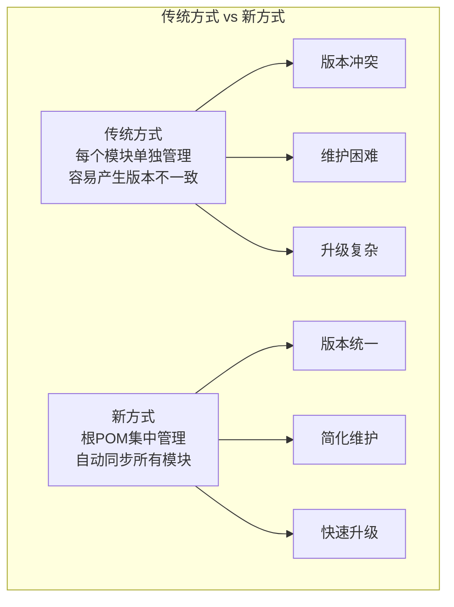
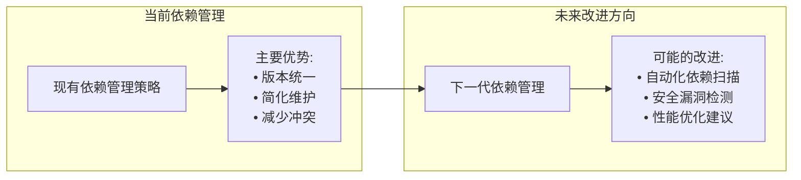

# 外部库依赖管理策略

<cite>
**本文档中引用的文件**
- [pom.xml](file://pom.xml)
- [tinyai-dl-ndarr/pom.xml](file://tinyai-dl-ndarr/pom.xml)
- [tinyai-dl-ml/pom.xml](file://tinyai-dl-ml/pom.xml)
- [tinyai-agent-base/pom.xml](file://tinyai-agent-base/pom.xml)
- [tinyai-model-gpt/pom.xml](file://tinyai-model-gpt/pom.xml)
- [tinyai-model-deepseek/pom.xml](file://tinyai-model-deepseek/pom.xml)
- [tinyai-dl-ml/src/test/java/io/leavesfly/tinyai/ml/ModelSerializerTest.java](file://tinyai-dl-ml/src/test/java/io/leavesfly/tinyai/ml/ModelSerializerTest.java)
- [tinyai-agent-base/src/test/java/io/leavesfly/tinyai/agent/AdvancedAgentTest.java](file://tinyai-agent-base/src/test/java/io/leavesfly/tinyai/agent/AdvancedAgentTest.java)
</cite>

## 目录
1. [概述](#概述)
2. [根POM中的依赖管理策略](#根pom中的依赖管理策略)
3. [版本属性集中化管理](#版本属性集中化管理)
4. [测试依赖的作用域管理](#测试依赖的作用域管理)
5. [子模块依赖引用模式](#子模块依赖引用模式)
6. [依赖管理架构图](#依赖管理架构图)
7. [依赖升级与维护优势](#依赖升级与维护优势)
8. [最佳实践建议](#最佳实践建议)
9. [总结](#总结)

## 概述

TinyAI项目采用了一套完善的外部库依赖管理策略，通过Maven的dependencyManagement机制实现了对关键第三方库的统一版本控制。该项目的核心依赖包括JFreeChart图表库、JUnit 4和JUnit Jupiter（JUnit 5）测试框架等关键组件，通过根POM文件的集中管理确保了整个多模块项目的一致性。

这种依赖管理策略不仅简化了子模块的配置复杂度，还提供了强大的版本控制能力，确保所有子模块使用统一的库版本，避免了版本冲突问题，同时保证了构建过程的可重现性和项目的稳定性。

## 根POM中的依赖管理策略

### 依赖管理范围

根POM文件采用了dependencyManagement元素来定义所有外部依赖的版本信息，这种方式允许子模块在引用依赖时只需要指定groupId和artifactId，而无需重复定义version信息。



**图表来源**
- [pom.xml](file://pom.xml#L105-L125)

### 内部模块依赖管理

除了外部依赖，根POM还管理了项目内部各模块之间的依赖关系，确保模块间的版本一致性：

- **深度学习模块**: tinyai-dl-ndarr、tinyai-dl-func、tinyai-dl-nnet、tinyai-dl-ml、tinyai-dl-rl、tinyai-dl-cv
- **模型模块**: tinyai-model-gpt、tinyai-model-deepseek、tinyai-model-lora、tinyai-model-moe
- **智能体模块**: tinyai-agent-base、tinyai-agent-rag、tinyai-agent-multi、tinyai-agent-pattern、tinyai-agent-evol

**章节来源**
- [pom.xml](file://pom.xml#L15-L40)

## 版本属性集中化管理

### 属性定义策略

项目通过properties元素定义了所有外部依赖的关键版本属性，实现了版本信息的集中化管理：

```xml
<!-- 外部依赖版本统一管理 -->
<jfreechart.version>1.0.7</jfreechart.version>
<junit.version>4.13.2</junit.version>
<junit-jupiter.version>5.8.2</junit-jupiter.version>
```

### 版本管理的优势

1. **单一版本控制**: 只需修改属性值即可更新所有子模块使用的版本
2. **版本一致性**: 确保整个项目使用相同版本的依赖库
3. **易于维护**: 集中管理减少了重复配置的工作量
4. **可追踪性**: 版本变更记录清晰可见



**图表来源**
- [pom.xml](file://pom.xml#L35-L40)

**章节来源**
- [pom.xml](file://pom.xml#L35-L40)

## 测试依赖的作用域管理

### 测试作用域的重要性

项目巧妙地利用了Maven的scope概念来区分不同类型的依赖：

```xml
<!-- 测试依赖 -->
<dependency>
    <groupId>junit</groupId>
    <artifactId>junit</artifactId>
    <version>${junit.version}</version>
    <scope>test</scope>
</dependency>
<dependency>
    <groupId>org.junit.jupiter</groupId>
    <artifactId>junit-jupiter</artifactId>
    <version>${junit-jupiter.version}</version>
    <scope>test</scope>
</dependency>
```

### 作用域管理策略

1. **test scope**: 确保测试依赖不会被引入生产环境
2. **版本分离**: JUnit 4和JUnit 5共存，满足不同测试需求
3. **清晰隔离**: 生产代码和测试代码完全分离



**图表来源**
- [pom.xml](file://pom.xml#L115-L125)

**章节来源**
- [pom.xml](file://pom.xml#L115-L125)

## 子模块依赖引用模式

### 简洁的依赖引用

子模块通过继承根POM的dependencyManagement配置，可以非常简洁地引用外部依赖：

```xml
<!-- 图表依赖 -->
<dependency>
    <groupId>jfree</groupId>
    <artifactId>jfreechart</artifactId>
</dependency>

<!-- 测试依赖 -->
<dependency>
    <groupId>junit</groupId>
    <artifactId>junit</artifactId>
    <scope>test</scope>
</dependency>
```

### 依赖引用流程



**图表来源**
- [tinyai-dl-ml/pom.xml](file://tinyai-dl-ml/pom.xml#L25-L45)

### 实际应用示例

以tinyai-dl-ml模块为例，展示了如何优雅地引用外部依赖：



**图表来源**
- [tinyai-dl-ml/pom.xml](file://tinyai-dl-ml/pom.xml#L25-L45)

**章节来源**
- [tinyai-dl-ml/pom.xml](file://tinyai-dl-ml/pom.xml#L25-L45)
- [tinyai-dl-ndarr/pom.xml](file://tinyai-dl-ndarr/pom.xml#L25-L30)

## 依赖管理架构图

### 整体架构设计



**图表来源**
- [pom.xml](file://pom.xml#L15-L40)
- [pom.xml](file://pom.xml#L105-L125)

## 依赖升级与维护优势

### 版本升级策略

当需要升级某个依赖版本时，只需修改根POM中的相应属性值：



### 维护优势分析

1. **简化升级流程**: 只需修改一处配置即可影响所有子模块
2. **减少错误风险**: 避免手动修改每个子模块的版本号
3. **提高效率**: 大幅减少版本升级的时间和工作量
4. **增强一致性**: 确保所有模块使用相同的依赖版本



**章节来源**
- [pom.xml](file://pom.xml#L35-L40)

## 最佳实践建议

### 依赖管理最佳实践

基于TinyAI项目的实践经验，以下是推荐的最佳实践：

1. **合理使用dependencyManagement**
   - 仅在根POM中定义外部依赖
   - 内部模块依赖也应在根POM中管理
   - 避免在子模块中重复定义版本

2. **版本选择策略**
   - 使用稳定的长期支持版本
   - 考虑向后兼容性
   - 定期评估依赖的安全性和性能

3. **测试依赖管理**
   - 明确区分测试和生产依赖
   - 合理选择JUnit版本组合
   - 利用scope隔离测试环境

4. **依赖审查机制**
   - 定期审查依赖树
   - 移除未使用的依赖
   - 更新过时的依赖版本

### 项目扩展建议



## 总结

TinyAI项目通过精心设计的依赖管理策略，成功实现了对外部第三方库的有效控制。该策略的核心优势包括：

1. **版本统一性**: 通过property属性和dependencyManagement实现了版本的集中化管理
2. **简化配置**: 子模块只需引用依赖而无需指定版本，大大简化了配置复杂度
3. **易于维护**: 版本升级只需修改根POM中的属性值，提高了维护效率
4. **作用域隔离**: 正确使用test scope确保测试依赖不会影响生产环境
5. **模块化支持**: 支持多模块项目的依赖管理，确保模块间的一致性

这种依赖管理策略不仅适用于当前的TinyAI项目，也为其他大型Java项目提供了宝贵的参考经验。通过遵循这些最佳实践，开发团队可以构建更加稳定、可维护和高效的软件系统。