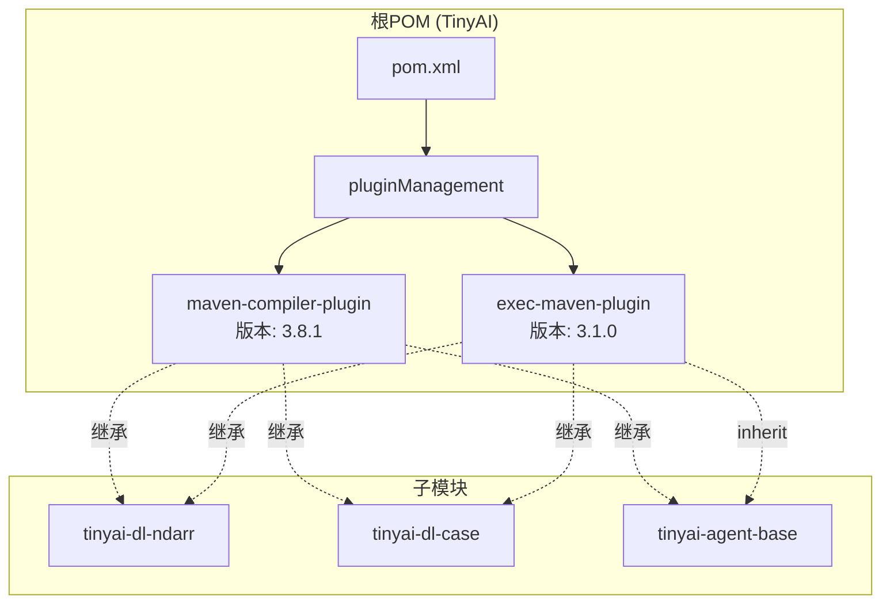
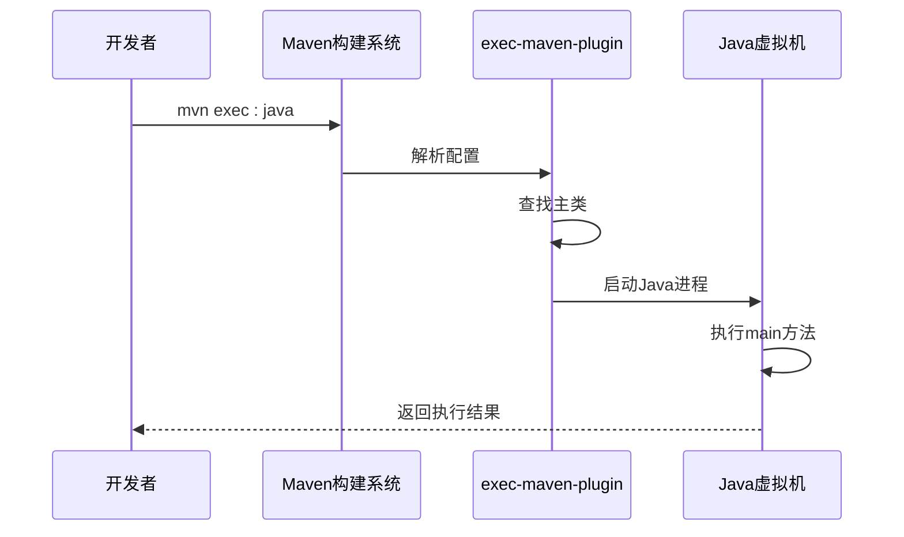
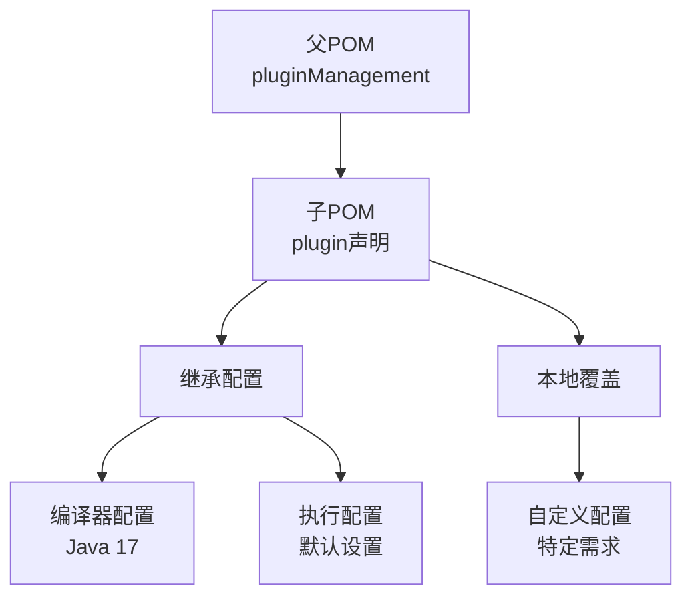

# Maven插件配置管理文档

<cite>
**本文档引用的文件**
- [pom.xml](file://pom.xml)
- [tinyai-dl-ndarr/pom.xml](file://tinyai-dl-ndarr/pom.xml)
- [tinyai-dl-case/pom.xml](file://tinyai-dl-case/pom.xml)
- [tinyai-agent-base/src/main/java/io/leavesfly/tinyai/agent/AgentDemo.java](file://tinyai-agent-base/src/main/java/io/leavesfly/tinyai/agent/AgentDemo.java)
- [tinyai-dl-case/src/main/java/io/leavesfly/tinyai/example/classify/MnistMlpExam.java](file://tinyai-dl-case/src/main/java/io/leavesfly/tinyai/example/classify/MnistMlpExam.java)
</cite>

## 目录
1. [项目概述](#项目概述)
2. [插件管理架构](#插件管理架构)
3. [核心插件配置详解](#核心插件配置详解)
4. [插件继承机制](#插件继承机制)
5. [实际使用示例](#实际使用示例)
6. [最佳实践指南](#最佳实践指南)
7. [故障排除](#故障排除)
8. [总结](#总结)

## 项目概述

TinyAI是一个大型的多模块Maven项目，采用分层架构设计，包含多个子模块用于不同的AI和机器学习功能。该项目通过集中式的插件管理机制，确保所有子模块具有一致的编译器配置和插件版本，从而提高构建效率和环境一致性。

项目结构包括：
- **深度学习模块**：tinyai-dl-ndarr、tinyai-dl-func、tinyai-dl-nnet等
- **模型模块**：tinyai-model-gpt、tinyai-model-deepseek等
- **智能体模块**：tinyai-agent-base、tinyai-agent-multi等

## 插件管理架构

### 根POM的插件管理配置



**图表来源**
- [pom.xml](file://pom.xml#L85-L100)

### 插件版本统一管理

根POM通过`<properties>`标签定义了统一的插件版本：

```xml
<properties>
    <maven.compiler.source>17</maven.compiler.source>
    <maven.compiler.target>17</maven.compiler.target>
    <project.build.sourceEncoding>UTF-8</project.build.sourceEncoding>
    
    <!-- 插件版本统一管理 -->
    <maven-compiler-plugin.version>3.8.1</maven-compiler-plugin.version>
    <exec-maven-plugin.version>3.1.0</exec-maven-plugin.version>
</properties>
```

**章节来源**
- [pom.xml](file://pom.xml#L35-L45)

## 核心插件配置详解

### maven-compiler-plugin配置

maven-compiler-plugin是项目中最关键的插件之一，负责Java源代码的编译工作。

```mermaid
classDiagram
class MavenCompilerPlugin {
+String groupId : org.apache.maven.plugins
+String artifactId : maven-compiler-plugin
+String version : ${maven-compiler-plugin.version}
+configureSourceTarget()
+setEncoding()
+compileSources()
}
class PluginConfiguration {
+String source : ${maven.compiler.source}
+String target : ${maven.compiler.target}
+String encoding : UTF-8
}
class ChildModule {
+inheritPlugin()
+useGlobalConfig()
}
MavenCompilerPlugin --> PluginConfiguration : "配置"
MavenCompilerPlugin --> ChildModule : "继承"
```

**图表来源**
- [pom.xml](file://pom.xml#L85-L95)

#### 编译器配置细节

```xml
<plugin>
    <groupId>org.apache.maven.plugins</groupId>
    <artifactId>maven-compiler-plugin</artifactId>
    <version>${maven-compiler-plugin.version}</version>
    <configuration>
        <source>${maven.compiler.source}</source>
        <target>${maven.compiler.target}</target>
    </configuration>
</plugin>
```

**关键特性：**
- **Java 17统一配置**：所有子模块都使用Java 17作为源码和目标版本
- **编码统一**：默认使用UTF-8编码，避免字符集问题
- **版本控制**：通过属性管理插件版本，确保一致性

### exec-maven-plugin配置

exec-maven-plugin提供了直接运行Java主类的功能，是项目开发和测试的重要工具。



**图表来源**
- [tinyai-dl-case/pom.xml](file://tinyai-dl-case/pom.xml#L50-L55)

#### 插件继承机制

每个子模块只需要声明插件而无需重复配置：

```xml
<build>
    <plugins>
        <plugin>
            <groupId>org.apache.maven.plugins</groupId>
            <artifactId>maven-compiler-plugin</artifactId>
        </plugin>
        
        <plugin>
            <groupId>org.codehaus.mojo</groupId>
            <artifactId>exec-maven-plugin</artifactId>
        </plugin>
    </plugins>
</build>
```

**章节来源**
- [tinyai-dl-ndarr/pom.xml](file://tinyai-dl-ndarr/pom.xml#L30-L36)
- [tinyai-dl-case/pom.xml](file://tinyai-dl-case/pom.xml#L45-L55)

## 插件继承机制

### 继承原理

Maven的插件继承遵循以下规则：

1. **父POM定义**：根POM通过`<pluginManagement>`定义插件配置
2. **子模块声明**：子模块只需声明插件而不需指定版本
3. **配置继承**：子模块自动继承父POM的插件配置
4. **局部覆盖**：子模块可以覆盖特定配置项



**图表来源**
- [pom.xml](file://pom.xml#L85-L100)
- [tinyai-dl-ndarr/pom.xml](file://tinyai-dl-ndarr/pom.xml#L30-L36)

### 版本管理策略

项目采用集中式版本管理策略：

```mermaid
graph LR
subgraph "版本管理"
GlobalProps[全局属性<br/>${maven-compiler-plugin.version}]
LocalProps[本地属性<br/>${maven.compiler.source}]
end
subgraph "插件实例"
Plugin1[maven-compiler-plugin<br/>版本: 3.8.1]
Plugin2[exec-maven-plugin<br/>版本: 3.1.0]
end
GlobalProps --> Plugin1
GlobalProps --> Plugin2
LocalProps --> Plugin1
```

**图表来源**
- [pom.xml](file://pom.xml#L35-L45)

**章节来源**
- [pom.xml](file://pom.xml#L85-L100)

## 实际使用示例

### 基本命令使用

开发者可以通过以下命令直接运行子模块中的主类：

```bash
# 进入具体子模块目录
cd tinyai-dl-case

# 运行主类（需要在pom.xml中配置exec-maven-plugin）
mvn exec:java -Dexec.mainClass="io.leavesfly.tinyai.example.classify.MnistMlpExam"

# 或者使用更简洁的方式
mvn exec:java -Dexec.mainClass="io.leavesfly.tinyai.example.classify.MnistMlpExam" -Dexec.args=""
```

### 典型应用场景

#### 1. 深度学习模型训练

```java
// 来自MnistMlpExam.java的主方法示例
public static void main(String[] args) {
    // 定义超参数
    int maxEpoch = 50;
    int batchSize = 100;
    
    // 定义模型结构
    Block block = new MlpBlock("MlpBlock", batchSize, 
                               Config.ActiveFunc.Sigmoid, 
                               inputSize, hiddenSize1, hiddenSize2, outputSize);
    
    // 执行训练
    trainer.train(true);
    
    // 效果评估
    trainer.evaluate();
}
```

#### 2. 智能体演示

```java
// 来自AgentDemo.java的主方法示例
public static void main(String[] args) {
    // 创建智能体
    AdvancedAgent agent = new AdvancedAgent();
    
    // 执行任务
    agent.executeTask();
    
    // 获取结果
    System.out.println("任务完成");
}
```

**章节来源**
- [tinyai-dl-case/src/main/java/io/leavesfly/tinyai/example/classify/MnistMlpExam.java](file://tinyai-dl-case/src/main/java/io/leavesfly/tinyai/example/classify/MnistMlpExam.java#L35-L84)
- [tinyai-agent-base/src/main/java/io/leavesfly/tinyai/agent/AgentDemo.java](file://tinyai-agent-base/src/main/java/io/leavesfly/tinyai/agent/AgentDemo.java#L21-L25)

## 最佳实践指南

### 添加新插件到全局管理

如果需要添加新的插件到全局管理中，按照以下步骤操作：

1. **更新根POM的属性**：
```xml
<properties>
    <!-- 添加新插件版本 -->
    <new-plugin.version>1.0.0</new-plugin.version>
</properties>
```

2. **在pluginManagement中添加配置**：
```xml
<plugin>
    <groupId>org.example</groupId>
    <artifactId>new-plugin</artifactId>
    <version>${new-plugin.version}</version>
    <configuration>
        <!-- 新插件配置 -->
    </configuration>
</plugin>
```

3. **在子模块中声明使用**：
```xml
<plugin>
    <groupId>org.example</groupId>
    <artifactId>new-plugin</artifactId>
</plugin>
```

### 插件配置优化建议

#### 1. 编译器配置优化

```xml
<plugin>
    <groupId>org.apache.maven.plugins</groupId>
    <artifactId>maven-compiler-plugin</artifactId>
    <configuration>
        <source>${maven.compiler.source}</source>
        <target>${maven.compiler.target}</target>
        <encoding>${project.build.sourceEncoding}</encoding>
        <compilerArgs>
            <arg>-Xlint:all</arg>
            <arg>-Werror</arg>
        </compilerArgs>
    </configuration>
</plugin>
```

#### 2. exec-maven-plugin扩展配置

```xml
<plugin>
    <groupId>org.codehaus.mojo</groupId>
    <artifactId>exec-maven-plugin</artifactId>
    <configuration>
        <mainClass>io.leavesfly.tinyai.example.classify.MnistMlpExam</mainClass>
        <arguments>
            <argument>arg1</argument>
            <argument>arg2</argument>
        </arguments>
        <systemProperties>
            <systemProperty>
                <key>property.name</key>
                <value>property.value</value>
            </systemProperty>
        </systemProperties>
    </configuration>
</plugin>
```

### 环境一致性保证

#### 1. JDK版本统一

确保所有开发者使用相同的JDK版本：

```bash
# 检查JDK版本
java --version

# 设置JAVA_HOME
export JAVA_HOME=/path/to/jdk17
export PATH=$JAVA_HOME/bin:$PATH
```

#### 2. Maven版本统一

```bash
# 检查Maven版本
mvn --version

# 推荐使用Maven 3.8.1+
mvn clean install
```

## 故障排除

### 常见问题及解决方案

#### 1. 编译器版本不匹配

**问题症状**：
```
错误: 不支持的源或目标版本: 17
```

**解决方案**：
```bash
# 检查JDK安装
java --version

# 如果使用的是JDK 8，升级到JDK 17
# 下载并安装JDK 17
# 设置JAVA_HOME指向JDK 17路径
```

#### 2. exec-maven-plugin找不到主类

**问题症状**：
```
错误: 找不到或无法加载主类 io.leavesfly.tinyai.example.classify.MnistMlpExam
```

**解决方案**：
```bash
# 确保项目已正确编译
mvn clean compile

# 检查主类是否存在
find . -name "*.class" | grep MnistMlpExam

# 使用正确的包名
mvn exec:java -Dexec.mainClass="io.leavesfly.tinyai.example.classify.MnistMlpExam"
```

#### 3. 插件版本冲突

**问题症状**：
```
错误: 插件版本冲突
```

**解决方案**：
```xml
<!-- 在子模块中明确指定版本 -->
<plugin>
    <groupId>org.apache.maven.plugins</groupId>
    <artifactId>maven-compiler-plugin</artifactId>
    <version>3.8.1</version>
</plugin>
```

### 调试技巧

#### 1. 启用详细输出

```bash
# 启用调试模式
mvn clean install -X

# 查看插件配置
mvn help:describe -Dplugin=exec-maven-plugin -Ddetail
```

#### 2. 验证插件继承

```bash
# 显示插件树
mvn help:effective-pom | grep -A 10 "maven-compiler-plugin"

# 验证插件配置
mvn help:effective-pom | grep -A 20 "exec-maven-plugin"
```

**章节来源**
- [pom.xml](file://pom.xml#L85-L100)

## 总结

TinyAI项目通过精心设计的插件管理体系，实现了以下优势：

### 核心优势

1. **统一性**：所有子模块使用相同的Java版本和插件配置
2. **可维护性**：集中管理插件版本，减少重复配置
3. **扩展性**：易于添加新的插件到全局管理中
4. **一致性**：确保不同环境下的构建行为一致

### 技术特点

- **Java 17统一配置**：确保跨模块的编译兼容性
- **exec-maven-plugin支持**：简化主类的直接执行
- **版本锁定机制**：防止插件版本冲突
- **继承优先原则**：最大化配置复用

### 发展方向

随着项目的发展，可以考虑：
- 添加更多的质量检查插件
- 集成持续集成工具
- 优化构建性能
- 增强插件配置的灵活性

这种集中式的插件管理方式不仅提高了开发效率，还确保了整个项目的稳定性和可维护性，是大型多模块Maven项目的最佳实践典范。