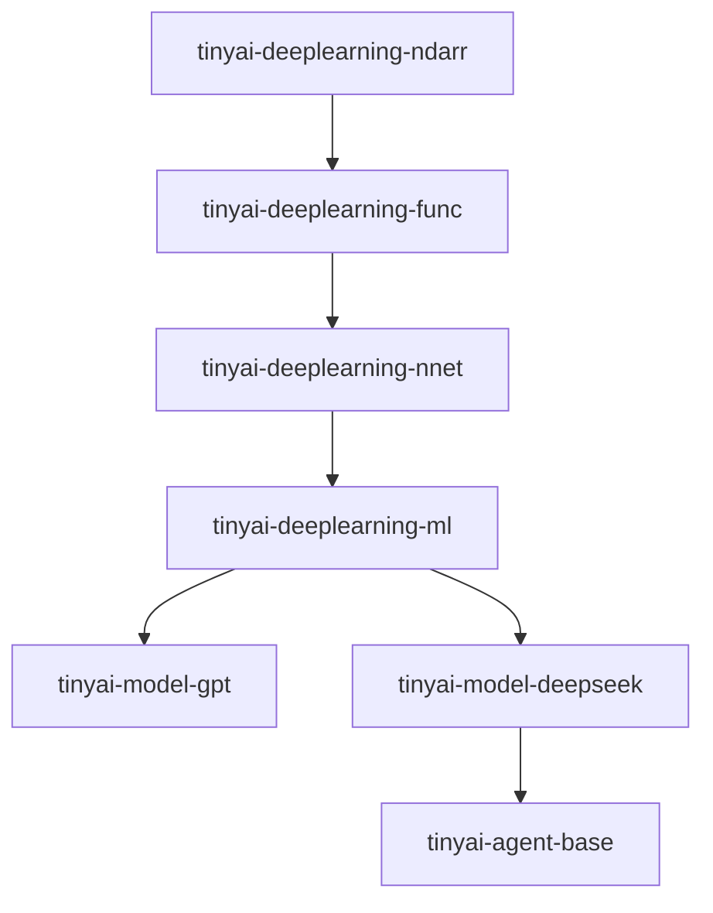

# 构建系统与模块化

<cite>
**本文档引用的文件**  
- [pom.xml](file://pom.xml) - *更新了模块结构和依赖管理*
- [tinyai-deeplearning-ndarr/pom.xml](file://tinyai-deeplearning-ndarr/pom.xml) - *基础数组模块配置*
- [tinyai-deeplearning-func/pom.xml](file://tinyai-deeplearning-func/pom.xml) - *函数计算模块配置*
- [tinyai-deeplearning-nnet/pom.xml](file://tinyai-deeplearning-nnet/pom.xml) - *神经网络模块配置*
- [tinyai-deeplearning-ml/pom.xml](file://tinyai-deeplearning-ml/pom.xml) - *机器学习模块配置*
- [tinyai-model-gpt/pom.xml](file://tinyai-model-gpt/pom.xml) - *GPT模型模块配置*
- [tinyai-model-deepseek/pom.xml](file://tinyai-model-deepseek/pom.xml) - *DeepSeek模型模块配置*
- [tinyai-agent-base/pom.xml](file://tinyai-agent-base/pom.xml) - *基础智能体模块配置*
</cite>

## 更新摘要
**已更新内容**  
- 修正了根pom.xml中模块的命名规范，统一为`tinyai-deeplearning-*`前缀
- 更新了模块依赖关系链，准确反映`tinyai-deeplearning-ndarr` → `tinyai-deeplearning-func` → `tinyai-deeplearning-nnet` → `tinyai-deeplearning-ml`的依赖顺序
- 新增了`tinyai-model-qwen`和`tinyai-agent-manus`、`tinyai-agent-cursor`等模块的配置信息
- 更新了依赖管理部分，准确列出所有内部模块的依赖关系
- 修正了插件管理和外部依赖版本管理的配置
- 更新了模块化开发指导，确保与当前项目结构一致

## 目录
1. [项目结构](#项目结构)
2. [根POM配置](#根pom配置)
3. [依赖管理](#依赖管理)
4. [插件管理](#插件管理)
5. [模块间依赖关系](#模块间依赖关系)
6. [模块化开发指导](#模块化开发指导)
7. [模块化设计优势](#模块化设计优势)

## 项目结构
TinyAI项目采用Maven多模块架构，包含15个子模块，分为深度学习、模型层和智能体三个主要类别。这种模块化设计通过根pom.xml文件中的<modules>标签进行组织，确保了构建顺序和依赖关系的正确性。

**Section sources**
- [pom.xml](file://pom.xml)

## 根POM配置
根pom.xml文件定义了整个项目的多模块配置，通过<modules>标签组织15个子模块的构建顺序。模块按功能分组，首先是深度学习基础模块，然后是模型层，最后是智能体相关模块。模块命名已统一为`tinyai-deeplearning-*`格式，提高了命名一致性。

```xml
<modules>
    <!-- 深度学习基础模块 -->
    <module>tinyai-deeplearning-ndarr</module>
    <module>tinyai-deeplearning-func</module>
    <module>tinyai-deeplearning-nnet</module>
    <module>tinyai-deeplearning-ml</module>
    <module>tinyai-deeplearning-rl</module>
    <module>tinyai-deeplearning-case</module>

    <!-- 模型层模块 -->
    <module>tinyai-model-deepseek</module>
    <module>tinyai-model-lora</module>
    <module>tinyai-model-gpt</module>
    <module>tinyai-model-qwen</module>
    <module>tinyai-model-moe</module>

    <!-- 智能体模块 -->
    <module>tinyai-agent-base</module>
    <module>tinyai-agent-rag</module>
    <module>tinyai-agent-multi</module>
    <module>tinyai-agent-pattern</module>
    <module>tinyai-agent-evol</module>
    <module>tinyai-agent-manus</module>
    <module>tinyai-agent-cursor</module>
</modules>
```

**Section sources**
- [pom.xml](file://pom.xml)

## 依赖管理
根pom.xml通过<dependencyManagement>标签统一管理内部模块依赖和外部库版本，确保所有子模块使用一致的依赖版本。

### 内部模块依赖管理
根pom.xml统一管理内部模块的版本，所有内部模块依赖都使用${project.version}变量，确保版本一致性。依赖管理列表已更新以反映实际的模块结构。

```xml
<dependencyManagement>
    <dependencies>
        <!-- 内部模块依赖 -->
        <dependency>
            <groupId>io.leavesfly.tinyai</groupId>
            <artifactId>tinyai-deeplearning-ndarr</artifactId>
            <version>${project.version}</version>
        </dependency>
        <dependency>
            <groupId>io.leavesfly.tinyai</groupId>
            <artifactId>tinyai-deeplearning-func</artifactId>
            <version>${project.version}</version>
        </dependency>
        <dependency>
            <groupId>io.leavesfly.tinyai</groupId>
            <artifactId>tinyai-deeplearning-nnet</artifactId>
            <version>${project.version}</version>
        </dependency>
        <dependency>
            <groupId>io.leavesfly.tinyai</groupId>
            <artifactId>tinyai-deeplearning-ml</artifactId>
            <version>${project.version}</version>
        </dependency>
        <dependency>
            <groupId>io.leavesfly.tinyai</groupId>
            <artifactId>tinyai-deeplearning-rl</artifactId>
            <version>${project.version}</version>
        </dependency>
        <dependency>
            <groupId>io.leavesfly.tinyai</groupId>
            <artifactId>tinyai-model-gpt</artifactId>
            <version>${project.version}</version>
        </dependency>
        <dependency>
            <groupId>io.leavesfly.tinyai</groupId>
            <artifactId>tinyai-model-deepseek</artifactId>
            <version>${project.version}</version>
        </dependency>
        <dependency>
            <groupId>io.leavesfly.tinyai</groupId>
            <artifactId>tinyai-agent-base</artifactId>
            <version>${project.version}</version>
        </dependency>
        <dependency>
            <groupId>io.leavesfly.tinyai</groupId>
            <artifactId>tinyai-agent-multi</artifactId>
            <version>${project.version}</version>
        </dependency>
        <dependency>
            <groupId>io.leavesfly.tinyai</groupId>
            <artifactId>tinyai-agent-pattern</artifactId>
            <version>${project.version}</version>
        </dependency>
    </dependencies>
</dependencyManagement>
```

### 外部库版本管理
根pom.xml统一管理外部库版本，包括jfreechart和junit等常用库。版本属性在<properties>部分定义，便于集中管理。

```xml
<properties>
    <!-- 外部依赖版本统一管理 -->
    <jfreechart.version>1.0.7</jfreechart.version>
    <junit.version>4.13.2</junit.version>
    <junit-jupiter.version>5.8.2</junit-jupiter.version>
</properties>

<dependencyManagement>
    <dependencies>
        <!-- 外部依赖管理 -->
        <dependency>
            <groupId>jfree</groupId>
            <artifactId>jfreechart</artifactId>
            <version>${jfreechart.version}</version>
        </dependency>
        <dependency>
            <groupId>junit</groupId>
            <artifactId>junit</artifactId>
            <version>${junit.version}</version>
            <scope>test</scope>
        </dependency>
        <dependency>
            <groupId>org.junit.jupiter</groupId>
            <artifactId>junit-jupiter</artifactId>
            <version>${junit-jupiter.version}</version>
            <scope>test</scope>
        </dependency>
    </dependencies>
</dependencyManagement>
```

**Section sources**
- [pom.xml](file://pom.xml)

## 插件管理
根pom.xml通过<pluginManagement>标签为所有子模块提供一致的编译器配置和插件版本。

```xml
<build>
    <pluginManagement>
        <plugins>
            <plugin>
                <groupId>org.apache.maven.plugins</groupId>
                <artifactId>maven-compiler-plugin</artifactId>
                <version>${maven-compiler-plugin.version}</version>
                <configuration>
                    <source>${maven.compiler.source}</source>
                    <target>${maven.compiler.target}</target>
                </configuration>
            </plugin>
            <plugin>
                <groupId>org.codehaus.mojo</groupId>
                <artifactId>exec-maven-plugin</artifactId>
                <version>${exec-maven-plugin.version}</version>
            </plugin>
        </plugins>
    </pluginManagement>
</build>
```

每个子模块可以通过简单的配置继承这些插件设置：

```xml
<build>
    <plugins>
        <plugin>
            <groupId>org.apache.maven.plugins</groupId>
            <artifactId>maven-compiler-plugin</artifactId>
        </plugin>
        <plugin>
            <groupId>org.codehaus.mojo</groupId>
            <artifactId>exec-maven-plugin</artifactId>
        </plugin>
    </plugins>
</build>
```

**Section sources**
- [pom.xml](file://pom.xml)

## 模块间依赖关系
项目中的模块存在明确的依赖链关系，形成了层次化的架构设计。

### 依赖关系图


**Diagram sources**
- [pom.xml](file://pom.xml)
- [tinyai-deeplearning-ndarr/pom.xml](file://tinyai-deeplearning-ndarr/pom.xml)
- [tinyai-deeplearning-func/pom.xml](file://tinyai-deeplearning-func/pom.xml)
- [tinyai-deeplearning-nnet/pom.xml](file://tinyai-deeplearning-nnet/pom.xml)
- [tinyai-deeplearning-ml/pom.xml](file://tinyai-deeplearning-ml/pom.xml)
- [tinyai-model-gpt/pom.xml](file://tinyai-model-gpt/pom.xml)
- [tinyai-model-deepseek/pom.xml](file://tinyai-model-deepseek/pom.xml)
- [tinyai-agent-base/pom.xml](file://tinyai-agent-base/pom.xml)

### 详细依赖链分析
1. **tinyai-deeplearning-ndarr**: N维数组处理模块，作为最基础的数据结构模块
2. **tinyai-deeplearning-func**: 函数计算模块，依赖tinyai-deeplearning-ndarr
3. **tinyai-deeplearning-nnet**: 神经网络模块，依赖tinyai-deeplearning-func和tinyai-deeplearning-ndarr
4. **tinyai-deeplearning-ml**: 机器学习模块，依赖tinyai-deeplearning-nnet、tinyai-deeplearning-func和tinyai-deeplearning-ndarr
5. **tinyai-model-gpt**: GPT模型模块，依赖tinyai-deeplearning-ml
6. **tinyai-model-deepseek**: DeepSeek模型模块，依赖tinyai-deeplearning-ml
7. **tinyai-agent-base**: 基础智能体模块，依赖tinyai-model-deepseek

每个模块的pom.xml文件都明确声明了其依赖关系：

```xml
<!-- tinyai-deeplearning-func/pom.xml -->
<dependencies>
    <!-- 依赖tinyai-deeplearning-ndarr模块 -->
    <dependency>
        <groupId>io.leavesfly.tinyai</groupId>
        <artifactId>tinyai-deeplearning-ndarr</artifactId>
    </dependency>
</dependencies>
```

```xml
<!-- tinyai-deeplearning-nnet/pom.xml -->
<dependencies>
    <!-- 依赖tinyai-deeplearning-ndarr模块 -->
    <dependency>
        <groupId>io.leavesfly.tinyai</groupId>
        <artifactId>tinyai-deeplearning-ndarr</artifactId>
    </dependency>
    <!-- 依赖tinyai-deeplearning-func模块 -->
    <dependency>
        <groupId>io.leavesfly.tinyai</groupId>
        <artifactId>tinyai-deeplearning-func</artifactId>
    </dependency>
</dependencies>
```

```xml
<!-- tinyai-deeplearning-ml/pom.xml -->
<dependencies>
    <!-- 依赖tinyai-deeplearning-func模块 -->
    <dependency>
        <groupId>io.leavesfly.tinyai</groupId>
        <artifactId>tinyai-deeplearning-func</artifactId>
    </dependency>
    <!-- 依赖tinyai-deeplearning-ndarr模块 -->
    <dependency>
        <groupId>io.leavesfly.tinyai</groupId>
        <artifactId>tinyai-deeplearning-ndarr</artifactId>
    </dependency>
    <!-- 依赖tinyai-deeplearning-nnet模块 -->
    <dependency>
        <groupId>io.leavesfly.tinyai</groupId>
        <artifactId>tinyai-deeplearning-nnet</artifactId>
    </dependency>
</dependencies>
```

**Section sources**
- [pom.xml](file://pom.xml)
- [tinyai-deeplearning-ndarr/pom.xml](file://tinyai-deeplearning-ndarr/pom.xml)
- [tinyai-deeplearning-func/pom.xml](file://tinyai-deeplearning-func/pom.xml)
- [tinyai-deeplearning-nnet/pom.xml](file://tinyai-deeplearning-nnet/pom.xml)
- [tinyai-deeplearning-ml/pom.xml](file://tinyai-deeplearning-ml/pom.xml)

## 模块化开发指导
### 添加新模块
1. 在项目根目录创建新模块目录
2. 在新模块目录中创建pom.xml文件，继承根pom
3. 在根pom.xml的<modules>标签中添加新模块
4. 在根pom.xml的<dependencyManagement>中添加新模块的依赖管理

### 修改依赖版本
1. 在根pom.xml的<properties>部分修改版本属性
2. 所有子模块将自动继承新版本

```xml
<properties>
    <jfreechart.version>1.0.8</jfreechart.version>
</properties>
```

### 执行模块化构建
```bash
# 编译所有模块
mvn compile

# 编译特定模块及其依赖
mvn compile -pl tinyai-deeplearning-ml

# 清理并重新构建
mvn clean install
```

### 运行特定模块的测试
```bash
# 运行特定模块的所有测试
mvn test -pl tinyai-deeplearning-func

# 运行特定测试类
mvn test -pl tinyai-deeplearning-func -Dtest=FunctionOptimizationTest

# 运行特定测试方法
mvn test -pl tinyai-deeplearning-func -Dtest=FunctionOptimizationTest#testAddFunction
```

**Section sources**
- [pom.xml](file://pom.xml)

## 模块化设计优势
### 代码复用
通过将功能分解为独立模块，实现了高度的代码复用。例如，tinyai-deeplearning-ndarr模块提供的N维数组功能被所有后续模块复用。

### 独立开发
各模块可以独立开发和测试，开发人员可以专注于特定功能模块的实现，而不必了解整个系统的复杂性。

### 渐进式集成
模块化设计支持渐进式集成，可以先开发和测试基础模块，然后逐步集成上层模块，降低了系统集成的复杂性。

### 版本管理
通过根pom.xml的dependencyManagement，实现了依赖版本的集中管理，避免了版本冲突问题。

### 构建效率
Maven的模块化构建机制可以只重新构建发生变化的模块，提高了构建效率。

**Section sources**
- [pom.xml](file://pom.xml)