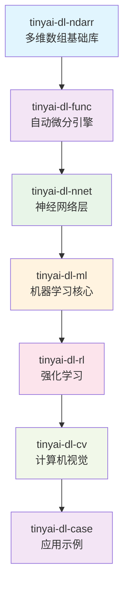
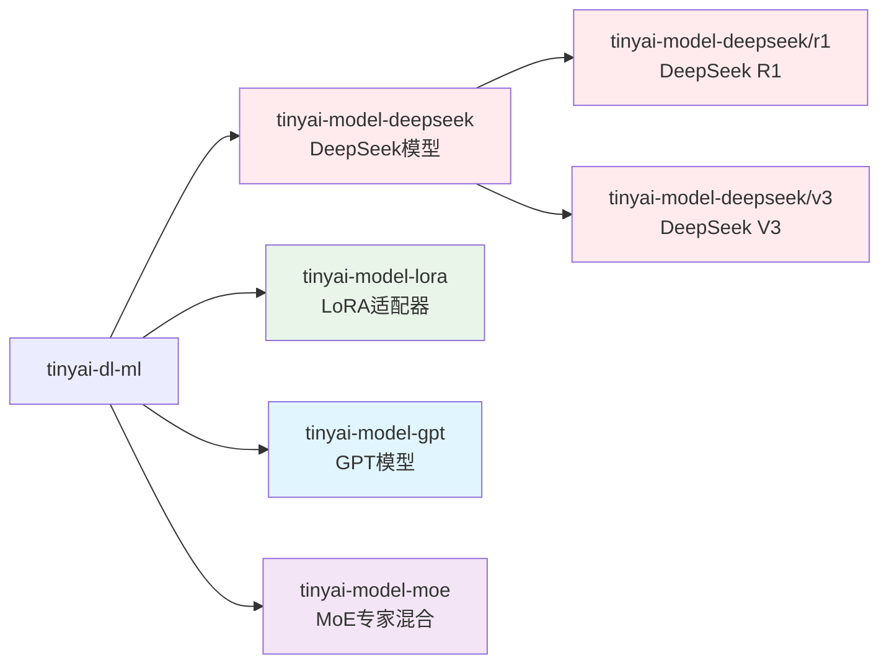
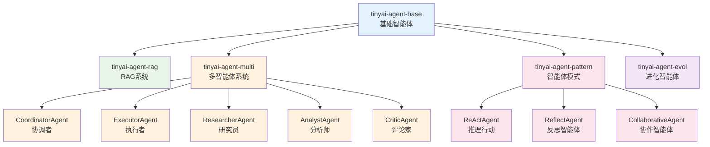
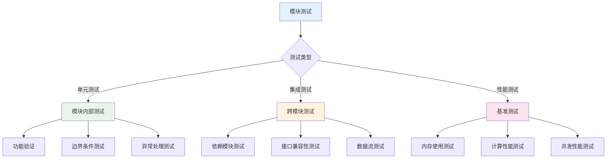

# 模块化配置

<cite>
**本文档中引用的文件**
- [pom.xml](file://pom.xml)
- [tinyai-dl-ndarr/pom.xml](file://tinyai-dl-ndarr/pom.xml)
- [tinyai-dl-func/pom.xml](file://tinyai-dl-func/pom.xml)
- [tinyai-dl-nnet/pom.xml](file://tinyai-dl-nnet/pom.xml)
- [tinyai-dl-ml/pom.xml](file://tinyai-dl-ml/pom.xml)
- [tinyai-model-deepseek/pom.xml](file://tinyai-model-deepseek/pom.xml)
- [tinyai-agent-base/pom.xml](file://tinyai-agent-base/pom.xml)
- [README.md](file://README.md)
</cite>

## 目录
1. [项目概述](#项目概述)
2. [根pom.xml模块配置](#根pompomxml模块配置)
3. [模块分组策略](#模块分组策略)
4. [模块依赖关系分析](#模块依赖关系分析)
5. [构建顺序与依赖图](#构建顺序与依赖图)
6. [模块化设计优势](#模块化设计优势)
7. [开发指南](#开发指南)
8. [故障排除](#故障排除)
9. [总结](#总结)

## 项目概述

TinyAI是一个完全使用Java开发的现代化深度学习框架，采用多模块Maven项目结构。该项目通过精心设计的模块化架构，实现了从底层张量运算到高级AI智能体的完整技术栈支持。

### 核心特性
- **完整AI技术栈**：从张量运算到大模型训练的全链路支持
- **自动微分引擎**：支持动态计算图和梯度累积
- **多领域支持**：CV、NLP、RL、多智能体、推理优化
- **现代优化器**：Adam、AdamW、Lion等前沿优化算法
- **高性能训练**：并行训练、梯度累积、混合精度
- **完善序列化**：模型检查点、增量保存、压缩存储

## 根pom.xml模块配置

### 多模块配置结构

根pom.xml采用了清晰的模块组织结构，通过`<modules>`标签定义了15个子模块的构建顺序：

```xml
<modules>
    <!-- 深度学习核心 -->
    <module>tinyai-dl-ndarr</module>
    <module>tinyai-dl-func</module>
    <module>tinyai-dl-nnet</module>
    <module>tinyai-dl-ml</module>
    <module>tinyai-dl-rl</module>
    <module>tinyai-dl-cv</module>
    <module>tinyai-dl-case</module>

    <!-- 模型实现 -->
    <module>tinyai-model-deepseek</module>
    <module>tinyai-model-lora</module>
    <module>tinyai-model-gpt</module>
    <module>tinyai-model-moe</module>

    <!-- 智能体系统 -->
    <module>tinyai-agent-base</module>
    <module>tinyai-agent-rag</module>
    <module>tinyai-agent-multi</module>
    <module>tinyai-agent-pattern</module>
    <module>tinyai-agent-evol</module>
</modules>
```

### 构建属性配置

根pom.xml定义了统一的构建属性和依赖管理：

```xml
<properties>
    <maven.compiler.source>17</maven.compiler.source>
    <maven.compiler.target>17</maven.compiler.target>
    <project.build.sourceEncoding>UTF-8</project.build.sourceEncoding>
    
    <!-- 插件版本统一管理 -->
    <maven-compiler-plugin.version>3.8.1</maven-compiler-plugin.version>
    <exec-maven-plugin.version>3.1.0</exec-maven-plugin.version>
    
    <!-- 外部依赖版本统一管理 -->
    <jfreechart.version>1.0.7</jfreechart.version>
    <junit.version>4.13.2</junit.version>
    <junit-jupiter.version>5.8.2</junit-jupiter.version>
</properties>
```

**章节来源**
- [pom.xml](file://pom.xml#L1-L148)

## 模块分组策略

### 深度学习核心模块（tinyai-dl-*）

深度学习核心模块构成了整个框架的基础架构，按照功能层次进行组织：



**图表来源**
- [pom.xml](file://pom.xml#L15-L22)
- [tinyai-dl-ndarr/pom.xml](file://tinyai-dl-ndarr/pom.xml#L1-L37)
- [tinyai-dl-func/pom.xml](file://tinyai-dl-func/pom.xml#L1-L58)
- [tinyai-dl-nnet/pom.xml](file://tinyai-dl-nnet/pom.xml#L1-L60)
- [tinyai-dl-ml/pom.xml](file://tinyai-dl-ml/pom.xml#L1-L66)

#### 模块功能分布

1. **tinyai-dl-ndarr**：多维数组基础库
   - CPU/GPU/TPU计算后端支持
   - 广播机制和形状操作
   - 数学运算和线性代数
   - 内存优化的数组存储

2. **tinyai-dl-func**：自动微分引擎
   - Variable类：计算图节点
   - Function抽象：数学函数定义
   - 前向和反向传播算法
   - 梯度累积和清理

3. **tinyai-dl-nnet**：神经网络层
   - 基础层：LinearLayer、ActivationLayer
   - 卷积层：ConvLayer、PoolingLayer
   - 循环层：SimpleRNN、LSTM、GRU
   - 注意力层：Attention、MultiHeadAttention
   - 正则化层：BatchNorm、LayerNorm、Dropout

4. **tinyai-dl-ml**：机器学习核心
   - 模型管理：Model、ModelSerializer
   - 训练器：Trainer、Monitor
   - 优化器：SGD、Adam、RMSprop
   - 损失函数：MSE、CrossEntropy、MaskedSoftmaxCE
   - 数据集：DataSet、Batch处理

5. **tinyai-dl-rl**：强化学习
   - 智能体：DQNAgent、REINFORCEAgent
   - 环境：CartPole、GridWorld
   - 策略：EpsilonGreedyPolicy
   - 经验回放：ReplayBuffer

6. **tinyai-dl-cv**：计算机视觉
   - SimpleConvNet：深度卷积神经网络
   - 支持MNIST、CIFAR-10等数据集
   - 图像分类和目标检测

7. **tinyai-dl-case**：应用示例
   - 分类任务：MnistMlpExam、SpiralMlpExam
   - 计算机视觉：SimpleConvNetExample
   - 回归任务：LineExam、MlpSinExam
   - 强化学习：CartPoleDQNExample
   - RNN：CompleteRnnExample
   - 模型序列化和监控示例

### 模型实现模块（tinyai-model-*）

模型实现模块专注于各种先进模型架构的实现：



**图表来源**
- [pom.xml](file://pom.xml#L24-L27)
- [tinyai-model-deepseek/pom.xml](file://tinyai-model-deepseek/pom.xml#L1-L71)

#### 模型模块功能

1. **tinyai-model-deepseek**：DeepSeek系列模型
   - DeepSeek R1：推理增强的Transformer
   - DeepSeek V3：专家路由的MoE架构
   - 代码生成和推理优化

2. **tinyai-model-lora**：LoRA适配器
   - 参数高效微调
   - 低秩适应技术
   - 大模型微调解决方案

3. **tinyai-model-gpt**：GPT语言模型
   - GPT-2模型实现
   - 文本生成和理解
   - Token嵌入和解码

4. **tinyai-model-moe**：MoE专家混合
   - 专家网络架构
   - 动态路由机制
   - 计算资源优化

### 智能体系统模块（tinyai-agent-*）

智能体系统模块提供了完整的AI智能体框架：



**图表来源**
- [pom.xml](file://pom.xml#L29-L35)
- [tinyai-agent-base/pom.xml](file://tinyai-agent-base/pom.xml#L1-L55)

#### 智能体模块功能

1. **tinyai-agent-base**：基础智能体框架
   - 消息传递机制
   - 内存管理系统
   - 工具注册和调用
   - 上下文引擎

2. **tinyai-agent-rag**：检索增强生成
   - 文档检索系统
   - 向量数据库
   - TF-IDF特征提取
   - 查询结果处理

3. **tinyai-agent-multi**：多智能体系统
   - 多智能体协调
   - 任务分配和执行
   - 消息总线通信
   - 智能体状态管理

4. **tinyai-agent-pattern**：智能体模式
   - ReAct推理行动模式
   - 反思智能体架构
   - 协作智能体设计
   - 智能体生命周期管理

5. **tinyai-agent-evol**：进化智能体
   - 自我进化机制
   - 经验积累系统
   - 知识图谱构建
   - 反思模块设计

**章节来源**
- [pom.xml](file://pom.xml#L15-L35)
- [README.md](file://README.md#L20-L50)

## 模块依赖关系分析

### 层次化依赖结构

TinyAI采用严格的层次化依赖结构，确保模块间的清晰分离和合理的构建顺序：

```mermaid
graph TD
subgraph "深度学习核心层"
NDARR[tinyai-dl-ndarr<br/>基础数组库]
FUNC[tinyai-dl-func<br/>自动微分]
NNET[tinyai-dl-nnet<br/>神经网络层]
ML[tinyai-dl-ml<br/>机器学习核心]
RL[tinyai-dl-rl<br/>强化学习]
CV[tinyai-dl-cv<br/>计算机视觉]
CASE[tinyai-dl-case<br/>应用示例]
end
subgraph "模型实现层"
DEEPSEEK[tinyai-model-deepseek<br/>DeepSeek模型]
LORA[tinyai-model-lora<br/>LoRA适配器]
GPT[tinyai-model-gpt<br/>GPT模型]
MOE[tinyai-model-moe<br/>MoE专家混合]
end
subgraph "智能体系统层"
BASE[tinyai-agent-base<br/>基础框架]
RAG[tinyai-agent-rag<br/>RAG系统]
MULTI[tinyai-agent-multi<br/>多智能体]
PATTERN[tinyai-agent-pattern<br/>智能体模式]
EVOL[tinyai-agent-evol<br/>进化智能体]
end
-- Dependencies --
NDARR --> FUNC
FUNC --> NNET
NNET --> ML
FUNC --> ML
NDARR --> ML
ML --> RL
ML --> CV
ML --> DEEPSEEK
RL --> DEEPSEEK
GPT --> DEEPSEEK
ML --> LORA
ML --> GPT
ML --> MOE
ML --> BASE
BASE --> RAG
BASE --> MULTI
BASE --> PATTERN
BASE --> EVOL
style NDARR fill:#e1f5fe
style FUNC fill:#f3e5f5
style NNET fill:#e8f5e8
style ML fill:#fff3e0
style RL fill:#fce4ec
style CV fill:#f1f8e9
style DEEPSEEK fill:#ffebee
style LORA fill:#e8f5e8
style GPT fill:#e1f5fe
style MOE fill:#f3e5f5
style BASE fill:#e3f2fd
style RAG fill:#e8f5e8
style MULTI fill:#fff3e0
style PATTERN fill:#fce4ec
style EVOL fill:#f3e5f5
```

**图表来源**
- [tinyai-dl-func/pom.xml](file://tinyai-dl-func/pom.xml#L25-L35)
- [tinyai-dl-nnet/pom.xml](file://tinyai-dl-nnet/pom.xml#L25-L40)
- [tinyai-dl-ml/pom.xml](file://tinyai-dl-ml/pom.xml#L25-L45)
- [tinyai-model-deepseek/pom.xml](file://tinyai-model-deepseek/pom.xml#L25-L45)

### 关键依赖关系

1. **基础依赖链**
   ```
   tinyai-dl-ndarr → tinyai-dl-func → tinyai-dl-nnet → tinyai-dl-ml
   ```

2. **模型依赖关系**
   - 所有模型模块都依赖于`tinyai-dl-ml`
   - `tinyai-model-deepseek`还依赖`tinyai-dl-rl`和`tinyai-model-gpt`

3. **智能体依赖关系**
   - 所有智能体模块都依赖于`tinyai-dl-ml`
   - `tinyai-agent-rag`需要数据库支持
   - `tinyai-agent-multi`涉及复杂的多智能体通信

**章节来源**
- [tinyai-dl-func/pom.xml](file://tinyai-dl-func/pom.xml#L25-L35)
- [tinyai-dl-nnet/pom.xml](file://tinyai-dl-nnet/pom.xml#L25-L40)
- [tinyai-dl-ml/pom.xml](file://tinyai-dl-ml/pom.xml#L25-L45)
- [tinyai-model-deepseek/pom.xml](file://tinyai-model-deepseek/pom.xml#L25-L45)

## 构建顺序与依赖图

### Maven构建顺序

根据根pom.xml中的模块定义，Maven构建将按照以下顺序执行：

1. **深度学习核心模块**（7个）
   - `tinyai-dl-ndarr` → `tinyai-dl-func` → `tinyai-dl-nnet` → `tinyai-dl-ml` → `tinyai-dl-rl` → `tinyai-dl-cv` → `tinyai-dl-case`

2. **模型实现模块**（4个）
   - `tinyai-model-deepseek` → `tinyai-model-lora` → `tinyai-model-gpt` → `tinyai-model-moe`

3. **智能体系统模块**（5个）
   - `tinyai-agent-base` → `tinyai-agent-rag` → `tinyai-agent-multi` → `tinyai-agent-pattern` → `tinyai-agent-evol`

### 并行构建能力

由于模块间存在明确的依赖关系，Maven能够智能地并行构建不相互依赖的模块：

```mermaid
gantt
title Maven构建时间线
dateFormat X
axisFormat %s
section 深度学习核心
tinyai-dl-ndarr :0, 1
tinyai-dl-func :1, 2
tinyai-dl-nnet :2, 3
tinyai-dl-ml :3, 4
tinyai-dl-rl :4, 5
tinyai-dl-cv :5, 6
tinyai-dl-case :6, 7
section 模型实现
tinyai-model-deepseek :7, 8
tinyai-model-lora :7, 8
tinyai-model-gpt :7, 8
tinyai-model-moe :7, 8
section 智能体系统
tinyai-agent-base :8, 9
tinyai-agent-rag :9, 10
tinyai-agent-multi :9, 11
tinyai-agent-pattern :9, 10
tinyai-agent-evol :9, 11
```



**图表来源**
- [pom.xml](file://pom.xml#L15-L35)

### 依赖冲突解决

根pom.xml通过`dependencyManagement`统一管理依赖版本，避免版本冲突：

```xml
<dependencyManagement>
    <dependencies>
        <!-- 项目内部模块依赖管理 -->
        <dependency>
            <groupId>io.leavesfly.tinyai</groupId>
            <artifactId>tinyai-dl-ndarr</artifactId>
            <version>${project.version}</version>
        </dependency>
        <!-- ... 更多依赖声明 ... -->
    </dependencies>
</dependencyManagement>
```

**章节来源**
- [pom.xml](file://pom.xml#L15-L35)
- [pom.xml](file://pom.xml#L40-L105)

## 模块化设计优势

### 团队并行开发支持

模块化架构为团队协作提供了强大的支持：

1. **独立开发空间**
   - 每个模块都有独立的包结构和命名空间
   - 开发者可以在不影响其他模块的情况下进行修改
   - 版本控制更加精细，便于代码审查

2. **并行构建能力**
   - 不相互依赖的模块可以同时编译
   - 显著减少整体构建时间
   - CI/CD流水线可以并行执行不同模块的测试

3. **职责分离**
   - 深度学习核心：专注于基础计算和自动微分
   - 模型实现：专注于具体模型架构
   - 智能体系统：专注于AI智能体框架

### 独立测试支持

每个模块都可以独立进行单元测试和集成测试：



### 渐进式集成

模块化设计支持渐进式集成和部署：

1. **增量发布**：可以单独发布某个模块的新版本
2. **向后兼容**：稳定的API保证向后兼容性
3. **功能开关**：通过配置控制模块功能的启用/禁用
4. **热插拔**：某些模块可以在运行时动态加载

### 代码复用和维护

1. **共享基础设施**：基础模块被多个上层模块复用
2. **统一接口**：所有模块遵循一致的设计模式
3. **文档完整性**：每个模块都有详细的文档和示例
4. **测试覆盖**：完整的测试套件确保代码质量

## 开发指南

### 添加新模块

#### 1. 确定模块位置

根据功能选择合适的模块组：

- **深度学习核心**：新基础功能或优化
- **模型实现**：新的模型架构
- **智能体系统**：新的智能体功能

#### 2. 创建模块目录

```bash
mkdir tinyai-new-module
cd tinyai-new-module
```

#### 3. 编写pom.xml

```xml
<?xml version="1.0" encoding="UTF-8"?>
<project xmlns="http://maven.apache.org/POM/4.0.0"
         xmlns:xsi="http://www.w3.org/2001/XMLSchema-instance"
         xsi:schemaLocation="http://maven.apache.org/POM/4.0.0 http://maven.apache.org/xsd/maven-4.0.0.xsd">
    <modelVersion>4.0.0</modelVersion>

    <parent>
        <groupId>io.leavesfly.tinyai</groupId>
        <artifactId>TinyAI</artifactId>
        <version>1.0-SNAPSHOT</version>
    </parent>

    <artifactId>tinyai-new-module</artifactId>
    <packaging>jar</packaging>
    <name>tinyai-new-module</name>
    <description>新模块描述</description>

    <dependencies>
        <!-- 根据需要添加依赖 -->
        <dependency>
            <groupId>io.leavesfly.tinyai</groupId>
            <artifactId>tinyai-dl-ml</artifactId>
        </dependency>
    </dependencies>
</project>
```

#### 4. 更新根pom.xml

在`<modules>`标签中添加新模块：

```xml
<module>tinyai-new-module</module>
```

#### 5. 添加构建配置

```xml
<build>
    <plugins>
        <plugin>
            <groupId>org.apache.maven.plugins</groupId>
            <artifactId>maven-compiler-plugin</artifactId>
        </plugin>
    </plugins>
</build>
```

### 重命名模块

重命名模块需要谨慎操作：

1. **更新pom.xml**
   ```xml
   <artifactId>tinyai-new-name</artifactId>
   ```

2. **更新目录结构**
   ```bash
   mv tinyai-old-name tinyai-new-name
   ```

3. **更新依赖引用**
   - 修改所有引用旧模块名的地方
   - 更新文档和示例代码

4. **更新根pom.xml**
   ```xml
   <module>tinyai-new-name</module>
   ```

### 调整模块构建顺序

如果需要调整模块的构建顺序：

1. **分析依赖关系**
   - 确保不会破坏现有依赖链
   - 避免循环依赖

2. **重新排序模块**
   ```xml
   <modules>
       <!-- 新的构建顺序 -->
       <module>tinyai-dl-core</module>
       <module>tinyai-dl-advanced</module>
       <module>tinyai-dl-specialized</module>
   </modules>
   ```

3. **验证构建**
   ```bash
   mvn clean compile
   mvn test
   ```

### 最佳实践

1. **模块命名规范**
   ```
   tinyai-{category}-{feature}
   ```
   示例：`tinyai-dl-attention`、`tinyai-model-t5`、`tinyai-agent-planning`

2. **依赖管理**
   - 优先使用父pom.xml中定义的依赖
   - 避免直接指定版本号
   - 使用范围依赖（如`+`）

3. **测试策略**
   - 每个模块至少包含单元测试
   - 提供集成测试示例
   - 包含性能基准测试

4. **文档要求**
   - 每个模块提供README.md
   - 包含使用示例和API文档
   - 记录依赖关系和限制

## 故障排除

### 常见构建问题

#### 1. 依赖解析失败

**症状**：Maven无法找到模块依赖

**解决方案**：
```bash
# 清理本地仓库缓存
mvn dependency:purge-local-repository

# 强制更新依赖
mvn clean install -U
```

#### 2. 编译错误

**症状**：模块编译失败，提示找不到类或方法

**解决方案**：
```bash
# 检查模块依赖顺序
mvn dependency:tree

# 确保父pom已安装
mvn install -pl .
```

#### 3. 测试失败

**症状**：模块测试失败，但模块本身可以编译

**解决方案**：
```bash
# 运行特定模块测试
mvn test -pl tinyai-new-module

# 查看详细测试报告
mvn test -Dmaven.test.failure.ignore=true
```

### 模块间依赖问题

#### 1. 循环依赖

**症状**：两个模块互相依赖

**解决方案**：
- 创建新的共享模块
- 提取公共接口到独立模块
- 重构代码消除循环依赖

#### 2. 版本不兼容

**症状**：模块使用了不兼容的API版本

**解决方案**：
```xml
<!-- 在dependencyManagement中锁定版本 -->
<dependency>
    <groupId>io.leavesfly.tinyai</groupId>
    <artifactId>tinyai-dl-core</artifactId>
    <version>1.0.0</version>
</dependency>
```

### 性能优化建议

1. **并行构建**
   ```bash
   # 使用多线程构建
   mvn clean install -T 4
   ```

2. **跳过测试**
   ```bash
   # 生产构建时跳过测试
   mvn clean package -DskipTests
   ```

3. **增量构建**
   ```bash
   # 只构建修改过的模块
   mvn clean install -am -pl tinyai-modified-module
   ```

**章节来源**
- [pom.xml](file://pom.xml#L1-L148)

## 总结

TinyAI的模块化配置展现了现代软件工程的最佳实践，通过精心设计的多模块架构实现了：

### 架构优势

1. **清晰的层次结构**：从底层张量运算到高级智能体的完整技术栈
2. **合理的依赖关系**：严格的层次化依赖确保模块间的清晰分离
3. **灵活的扩展性**：易于添加新模块和调整现有模块
4. **高效的构建流程**：支持并行构建和增量编译

### 设计理念

1. **关注点分离**：每个模块专注于特定的功能领域
2. **接口一致性**：统一的设计模式和API规范
3. **渐进式集成**：支持增量开发和部署
4. **团队协作友好**：并行开发和独立测试支持

### 实践价值

1. **教育价值**：完整的深度学习框架作为学习材料
2. **研究价值**：前沿AI技术的实验平台
3. **工业价值**：生产环境可用的AI解决方案
4. **开源价值**：社区驱动的高质量代码库

这种模块化设计不仅提高了代码质量和可维护性，更为团队协作和项目扩展奠定了坚实的基础。通过合理的模块划分和依赖管理，TinyAI成功地将复杂的深度学习框架分解为易于理解和维护的组件，体现了优秀的软件架构设计原则。