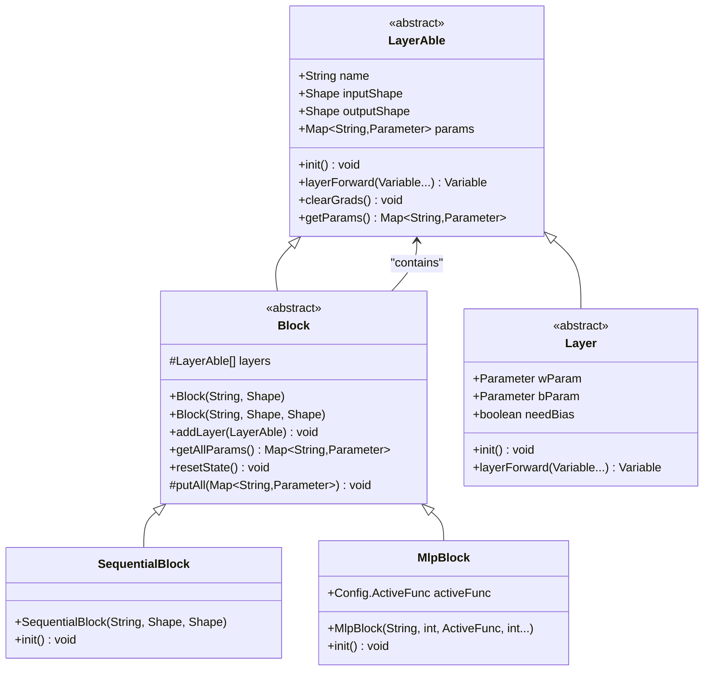
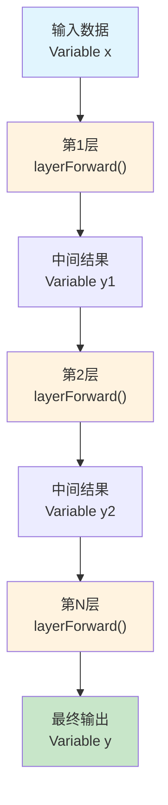
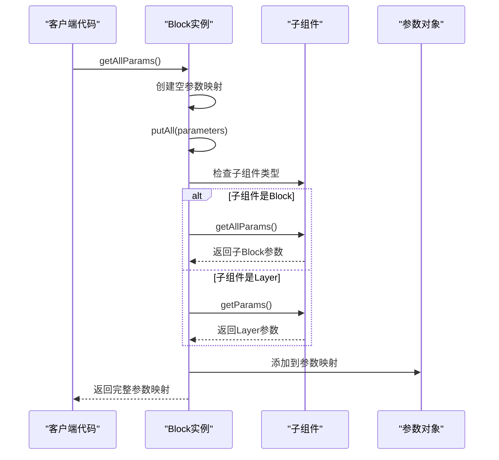
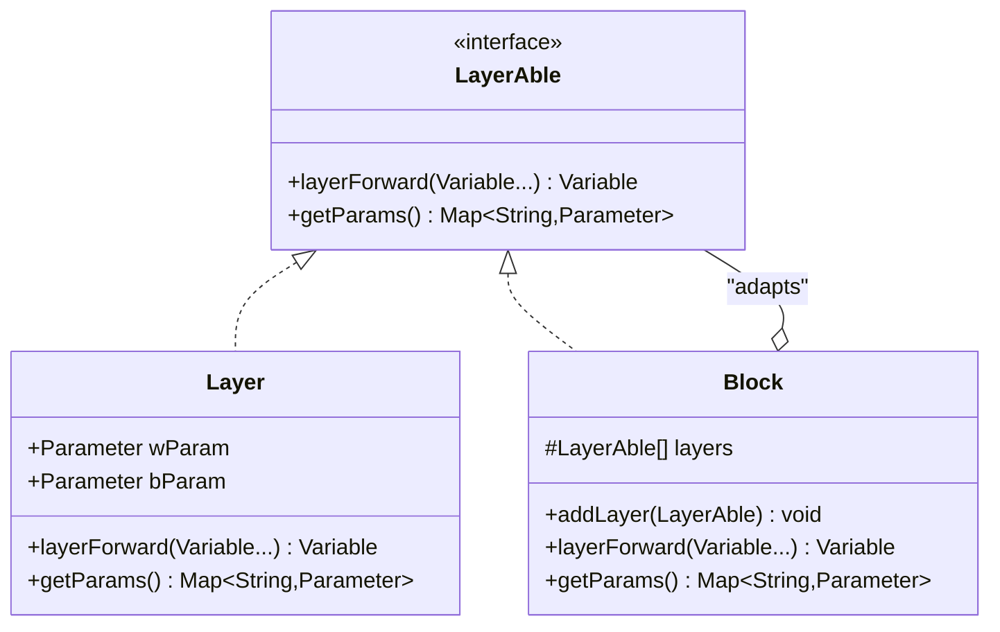

# Block - 神经网络构建单元

<cite>
**本文档引用的文件**
- [Block.java](file://tinyai-dl-nnet/src/main/java/io/leavesfly/tinyai/nnet/Block.java)
- [SequentialBlock.java](file://tinyai-dl-nnet/src/main/java/io/leavesfly/tinyai/nnet/block/SequentialBlock.java)
- [MlpBlock.java](file://tinyai-dl-nnet/src/main/java/io/leavesfly/tinyai/nnet/block/MlpBlock.java)
- [AffineLayer.java](file://tinyai-dl-nnet/src/main/java/io/leavesfly/tinyai/nnet/layer/dnn/AffineLayer.java)
- [ReLuLayer.java](file://tinyai-dl-nnet/src/main/java/io/leavesfly/tinyai/nnet/layer/activate/ReLuLayer.java)
- [Model.java](file://tinyai-dl-ml/src/main/java/io/leavesfly/tinyai/ml/Model.java)
- [SequentialBlockTest.java](file://tinyai-dl-nnet/src/test/java/io/leavesfly/tinyai/nnet/block/SequentialBlockTest.java)
- [MnistMlpExam.java](file://tinyai-dl-case/src/main/java/io/leavesfly/tinyai/example/classify/MnistMlpExam.java)
</cite>

## 目录
1. [简介](#简介)
2. [核心架构](#核心架构)
3. [Block类详解](#block类详解)
4. [SequentialBlock实现](#sequentialblock实现)
5. [前向传播机制](#前向传播机制)
6. [参数管理系统](#参数管理系统)
7. [实际应用示例](#实际应用示例)
8. [设计模式指导](#设计模式指导)
9. [最佳实践](#最佳实践)
10. [总结](#总结)

## 简介

Block类是TinyAI神经网络框架中的核心构建单元，采用组合式设计模式，作为Layer和子Block的容器，通过addLayer()方法实现网络结构的灵活构建。Block类继承自LayerAble抽象类，提供了神经网络模块化的基础架构，使得开发者能够以模块化的方式构建复杂的神经网络结构。

Block类的设计理念基于组合优于继承的原则，允许将多个Layer或Block组合成更复杂的网络结构。这种设计不仅提高了代码的可重用性和可维护性，还为构建各种类型的神经网络（如MLP、CNN、RNN等）提供了统一的接口。

## 核心架构



**图表来源**
- [Block.java](file://tinyai-dl-nnet/src/main/java/io/leavesfly/tinyai/nnet/Block.java#L1-L136)
- [SequentialBlock.java](file://tinyai-dl-nnet/src/main/java/io/leavesfly/tinyai/nnet/block/SequentialBlock.java#L1-L33)
- [MlpBlock.java](file://tinyai-dl-nnet/src/main/java/io/leavesfly/tinyai/nnet/block/MlpBlock.java#L1-L61)

## Block类详解

Block类是所有神经网络块的基础抽象类，提供了模块化神经网络构建的核心功能。它继承自LayerAble，具备了神经网络层的基本属性和行为。

### 核心属性

Block类的核心属性包括：

- **layers**: 存储该Block中包含的所有Layer或子Block的列表
- **params**: 该Block的参数映射表
- **inputShape**: 输入数据的形状
- **outputShape**: 输出数据的形状

### 构造函数

Block类提供了两个构造函数：

```java
public Block(String _name, Shape _inputShape)
public Block(String _name, Shape _inputShape, Shape _outputShape)
```

这两个构造函数分别用于创建具有或不具有明确输出形状的Block实例。

### 关键方法

#### addLayer()方法

```java
public void addLayer(LayerAble layerAble) {
    layerAble.init();
    layers.add(layerAble);
}
```

addLayer()方法是Block类的核心功能之一，它负责：
1. 初始化传入的Layer或Block
2. 将初始化后的组件添加到内部的layers列表中
3. 支持任意层级的嵌套组合

#### clearGrads()方法

```java
@Override
public void clearGrads() {
    for (Parameter parameter : params.values()) {
        parameter.clearGrad();
    }
    for (LayerAble layer : layers) {
        layer.clearGrads();
    }
}
```

该方法递归地清空所有参数的梯度，确保每次前向传播后都能正确计算新的梯度。

**章节来源**
- [Block.java](file://tinyai-dl-nnet/src/main/java/io/leavesfly/tinyai/nnet/Block.java#L1-L136)

## SequentialBlock实现

SequentialBlock是Block类的一个具体实现，专门用于按顺序组合多个神经网络层。它是构建前馈神经网络最常用的工具。

### 实现特点

SequentialBlock的设计非常简洁，继承了Block的所有功能，但没有额外的成员变量或方法：

```java
public class SequentialBlock extends Block {
    public SequentialBlock(String _name, Shape _xInputShape, Shape _yOutputShape) {
        super(_name, _xInputShape, _yOutputShape);
    }
    
    @Override
    public void init() {
        // 空实现，SequentialBlock不需要特殊初始化
    }
}
```

### 使用场景

SequentialBlock适用于以下场景：
- 构建简单的前馈神经网络
- 实现标准的MLP（多层感知机）
- 创建CNN（卷积神经网络）的特征提取部分
- 组合各种激活函数层

**章节来源**
- [SequentialBlock.java](file://tinyai-dl-nnet/src/main/java/io/leavesfly/tinyai/nnet/block/SequentialBlock.java#L1-L33)

## 前向传播机制

Block类的前向传播机制是其最重要的功能之一，通过layerForward()方法实现。这个机制确保了子组件能够按照正确的顺序执行前向传播。

### 前向传播实现

```java
@Override
public Variable layerForward(Variable... inputs) {
    Variable x = inputs[0];
    Variable y = layers.get(0).layerForward(x);
    for (int i = 1; i < layers.size(); i++) {
        y = layers.get(i).layerForward(y);
    }
    return y;
}
```

### 工作原理

1. **输入处理**: 接收输入变量数组，提取第一个输入变量
2. **顺序执行**: 按照layers列表的顺序，依次调用每个子组件的layerForward方法
3. **结果传递**: 将前一个组件的输出作为下一个组件的输入
4. **最终输出**: 返回最后一个组件的输出结果

### 数据流图



**图表来源**
- [Block.java](file://tinyai-dl-nnet/src/main/java/io/leavesfly/tinyai/nnet/Block.java#L60-L66)

**章节来源**
- [Block.java](file://tinyai-dl-nnet/src/main/java/io/leavesfly/tinyai/nnet/Block.java#L60-L66)

## 参数管理系统

Block类提供了强大的参数管理功能，能够自动收集和管理所有子组件的参数。

### getAllParams()方法

```java
public Map<String, Parameter> getAllParams() {
    Map<String, Parameter> allParams = new HashMap<>();
    putAll(allParams);
    return allParams;
}
```

### 参数收集机制

```java
private void putAll(Map<String, Parameter> allParams) {
    allParams.putAll(params);
    for (LayerAble layer : layers) {
        if (layer instanceof Block) {
            allParams.putAll(((Block) layer).getAllParams());
        } else {
            allParams.putAll(layer.getParams());
        }
    }
}
```

### 参数管理特性

1. **递归收集**: 自动递归收集所有子Block的参数
2. **类型区分**: 区分Block和普通Layer的参数获取方式
3. **去重保证**: 使用HashMap确保参数键的唯一性
4. **批量操作**: 支持对所有参数的批量操作（如梯度清零）

### 参数管理流程



**图表来源**
- [Block.java](file://tinyai-dl-nnet/src/main/java/io/leavesfly/tinyai/nnet/Block.java#L70-L85)

**章节来源**
- [Block.java](file://tinyai-dl-nnet/src/main/java/io/leavesfly/tinyai/nnet/Block.java#L70-L85)

## 实际应用示例

### 示例1：构建简单的MLP网络

```java
// 创建SequentialBlock
SequentialBlock mlp = new SequentialBlock("mlp", Shape.of(-1, 784), Shape.of(-1, 10));

// 添加隐藏层和激活函数
mlp.addLayer(new AffineLayer("hidden1", Shape.of(-1, 784), 128, true));
mlp.addLayer(new ReLuLayer("relu1"));
mlp.addLayer(new AffineLayer("hidden2", Shape.of(-1, 128), 64, true));
mlp.addLayer(new ReLuLayer("relu2"));
mlp.addLayer(new AffineLayer("output", Shape.of(-1, 64), 10, true));

// 创建模型
Model model = new Model("SimpleMLP", mlp);
```

### 示例2：使用MlpBlock快速构建网络

```java
// 使用MlpBlock快速构建三层MLP
Block block = new MlpBlock("MlpBlock", batchSize, 
                          Config.ActiveFunc.Sigmoid, 
                          inputSize, hiddenSize1, hiddenSize2, outputSize);

// 创建模型
Model model = new Model("MnistMlpExam", block);
```

### 示例3：复杂网络结构

```java
// 构建一个复杂的CNN-like网络
SequentialBlock complexNet = new SequentialBlock("complex_cnn", Shape.of(-1, 28*28), Shape.of(-1, 10));

// 添加卷积层（假设存在）
complexNet.addLayer(new ConvLayer("conv1", 1, 32, 3, 1, 0));
complexNet.addLayer(new ReLuLayer("relu1"));
complexNet.addLayer(new PoolingLayer("pool1", 2, 2, 2, 2));

complexNet.addLayer(new ConvLayer("conv2", 32, 64, 3, 1, 0));
complexNet.addLayer(new ReLuLayer("relu2"));
complexNet.addLayer(new PoolingLayer("pool2", 2, 2, 2, 2));

// 展平并添加全连接层
complexNet.addLayer(new Flatten("flatten"));
complexNet.addLayer(new AffineLayer("fc1", Shape.of(-1, 64*7*7), 128, true));
complexNet.addLayer(new ReLuLayer("relu3"));
complexNet.addLayer(new AffineLayer("output", Shape.of(-1, 128), 10, true));
```

**章节来源**
- [SequentialBlockTest.java](file://tinyai-dl-nnet/src/test/java/io/leavesfly/tinyai/nnet/block/SequentialBlockTest.java#L30-L50)
- [MnistMlpExam.java](file://tinyai-dl-case/src/main/java/io/leavesfly/tinyai/example/classify/MnistMlpExam.java#L40-L50)

## 设计模式指导

### 组合式设计模式

Block类体现了组合式设计模式的核心思想：

1. **聚合关系**: Block聚合多个Layer或子Block
2. **透明性**: 客户端代码无需关心内部结构
3. **灵活性**: 支持动态添加和移除组件

### 适配器模式的应用



**图表来源**
- [Block.java](file://tinyai-dl-nnet/src/main/java/io/leavesfly/tinyai/nnet/Block.java#L1-L20)

### 如何实现自定义Block子类

#### 步骤1：继承Block类

```java
public class CustomBlock extends Block {
    public CustomBlock(String name, Shape inputShape, Shape outputShape) {
        super(name, inputShape, outputShape);
    }
    
    @Override
    public void init() {
        // 自定义初始化逻辑
        // 例如：添加特定的Layer或子Block
    }
}
```

#### 步骤2：实现特殊功能

```java
public class ResidualBlock extends Block {
    private LayerAble mainPath;
    private LayerAble shortcut;
    
    public ResidualBlock(String name, Shape inputShape) {
        super(name, inputShape, inputShape);
        init();
    }
    
    @Override
    public void init() {
        // 主路径
        SequentialBlock main = new SequentialBlock("main", inputShape, inputShape);
        main.addLayer(new AffineLayer("conv1", inputShape, 64, true));
        main.addLayer(new ReLuLayer("relu1"));
        main.addLayer(new AffineLayer("conv2", Shape.of(-1, 64), 64, true));
        
        // 快捷连接
        SequentialBlock shortCut = new SequentialBlock("shortcut", inputShape, inputShape);
        shortCut.addLayer(new IdentityLayer()); // 或者保持输入不变的层
        
        this.mainPath = main;
        this.shortcut = shortCut;
        
        // 添加到layers列表
        addLayer(main);
        addLayer(shortCut);
    }
    
    @Override
    public Variable layerForward(Variable... inputs) {
        Variable x = inputs[0];
        Variable mainOutput = mainPath.layerForward(x);
        Variable shortcutOutput = shortcut.layerForward(x);
        return mainOutput.add(shortcutOutput); // 残差连接
    }
}
```

### 最佳实践建议

1. **单一职责**: 每个Block应该专注于特定的功能域
2. **开放封闭**: 对扩展开放，对修改封闭
3. **依赖倒置**: 依赖于LayerAble接口而非具体实现
4. **组合优先**: 优先使用组合而非继承

## 最佳实践

### 1. 模块化设计原则

```java
// 推荐：模块化设计
public class FeatureExtractor extends Block {
    public FeatureExtractor(String name, Shape inputShape) {
        super(name, inputShape, calculateOutputShape(inputShape));
        
        // 模块化添加特征提取层
        addLayer(createConvolutionalBlock());
        addLayer(createPoolingBlock());
        addLayer(createNormalizationBlock());
    }
}

// 不推荐：功能混杂
public class BadBlock extends Block {
    public BadBlock(String name, Shape inputShape) {
        super(name, inputShape, calculateOutputShape(inputShape));
        
        // 将所有功能都塞进一个Block
        addLayer(new ConvLayer(...));
        addLayer(new ReLuLayer(...));
        addLayer(new PoolingLayer(...));
        addLayer(new AffineLayer(...));
        addLayer(new SoftMaxLayer(...));
    }
}
```

### 2. 参数管理优化

```java
// 推荐：显式参数管理
public class OptimizedBlock extends Block {
    private Parameter weight;
    private Parameter bias;
    
    @Override
    public void init() {
        if (!alreadyInit) {
            // 显式初始化参数
            weight = new Parameter(initializeWeights());
            bias = new Parameter(initializeBiases());
            
            // 注册参数
            addParam("weight", weight);
            addParam("bias", bias);
            
            alreadyInit = true;
        }
    }
}
```

### 3. 错误处理策略

```java
public class RobustBlock extends Block {
    @Override
    public Variable layerForward(Variable... inputs) {
        if (inputs == null || inputs.length == 0) {
            throw new IllegalArgumentException("输入不能为空");
        }
        
        if (layers.isEmpty()) {
            throw new IllegalStateException("Block中没有添加任何Layer");
        }
        
        try {
            return super.layerForward(inputs);
        } catch (Exception e) {
            throw new RuntimeException("Block前向传播失败: " + e.getMessage(), e);
        }
    }
}
```

### 4. 性能优化技巧

```java
public class OptimizedSequentialBlock extends SequentialBlock {
    private Variable cachedInput;
    private Variable cachedOutput;
    
    @Override
    public Variable layerForward(Variable... inputs) {
        // 缓存机制优化重复计算
        if (cachedInput != null && cachedInput.equals(inputs[0])) {
            return cachedOutput;
        }
        
        Variable result = super.layerForward(inputs);
        cachedInput = inputs[0];
        cachedOutput = result;
        
        return result;
    }
}
```

## 总结

Block类作为TinyAI神经网络框架的核心构建单元，通过组合式设计模式实现了高度模块化和可扩展的神经网络架构。其主要优势包括：

### 核心优势

1. **模块化设计**: 通过Layer和子Block的组合，实现复杂网络结构的模块化构建
2. **统一接口**: 提供一致的API接口，简化了不同网络组件的集成
3. **递归管理**: 支持任意层级的嵌套组合，便于构建复杂的网络架构
4. **参数透明**: 自动管理所有子组件的参数，简化了参数的收集和操作
5. **前向传播自动化**: 按顺序调用子组件的前向传播，确保数据流的正确性

### 应用价值

- **简化开发**: 开发者可以专注于业务逻辑，而无需关心底层的网络构建细节
- **提高效率**: 通过模块化设计，减少了重复代码的编写
- **增强可维护性**: 清晰的层次结构使得代码更容易理解和维护
- **促进复用**: 可以轻松复用已有的Block组件构建新的网络结构

### 发展方向

随着深度学习技术的发展，Block类的设计将继续演进，可能的方向包括：

1. **异步处理**: 支持异步的前向传播和反向传播
2. **分布式计算**: 支持跨设备的网络分布
3. **动态架构**: 支持运行时调整网络结构
4. **硬件加速**: 更好的GPU和TPU支持

Block类作为神经网络构建的基础单元，为TinyAI框架提供了强大而灵活的架构支持，是构建现代深度学习应用的重要基石。