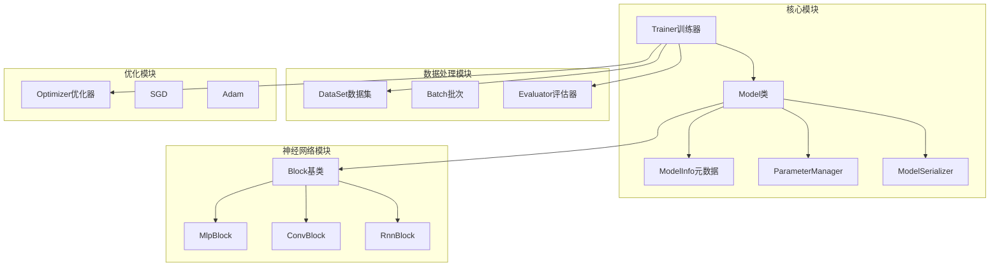
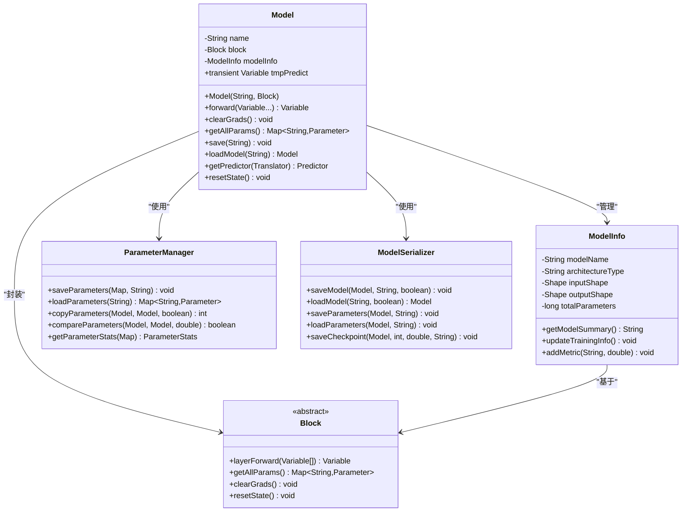
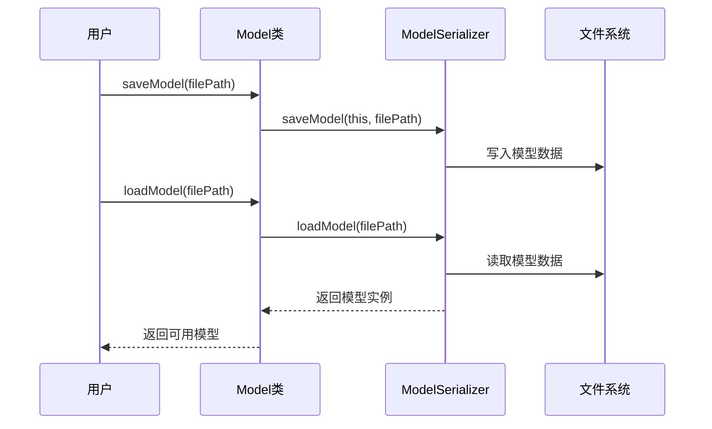
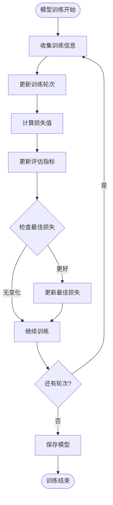
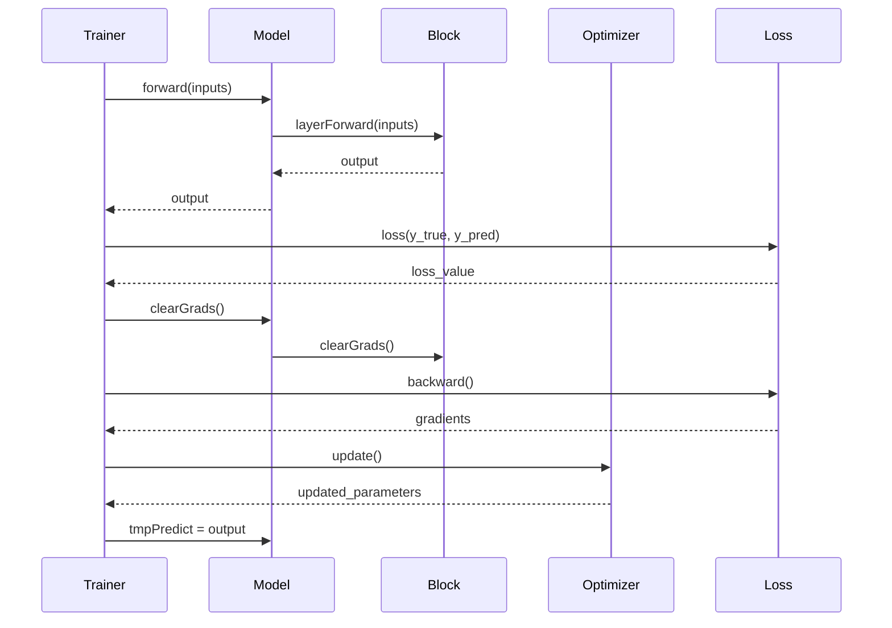
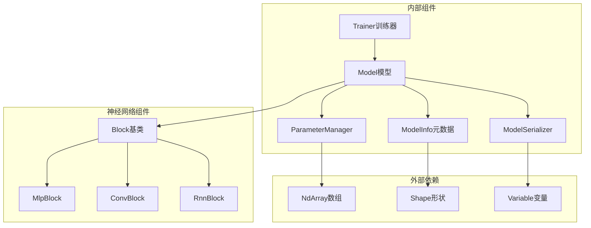

# Model - 模型管理与封装

<cite>
**本文档引用的文件**
- [Model.java](file://tinyai-dl-ml/src/main/java/io/leavesfly/tinyai/ml/Model.java)
- [ModelInfo.java](file://tinyai-dl-ml/src/main/java/io/leavesfly/tinyai/ml/ModelInfo.java)
- [ParameterManager.java](file://tinyai-dl-ml/src/main/java/io/leavesfly/tinyai/ml/ParameterManager.java)
- [Trainer.java](file://tinyai-dl-ml/src/main/java/io/leavesfly/tinyai/ml/Trainer.java)
- [ModelSerializer.java](file://tinyai-dl-ml/src/main/java/io/leavesfly/tinyai/ml/ModelSerializer.java)
- [Predictor.java](file://tinyai-dl-ml/src/main/java/io/leavesfly/tinyai/ml/inference/Predictor.java)
- [MnistMlpExam.java](file://tinyai-dl-case/src/main/java/io/leavesfly/tinyai/example/classify/MnistMlpExam.java)
- [MlpBlock.java](file://tinyai-dl-nnet/src/main/java/io/leavesfly/tinyai/nnet/block/MlpBlock.java)
</cite>

## 目录
1. [简介](#简介)
2. [项目结构](#项目结构)
3. [核心组件](#核心组件)
4. [架构概览](#架构概览)
5. [详细组件分析](#详细组件分析)
6. [依赖关系分析](#依赖关系分析)
7. [性能考虑](#性能考虑)
8. [故障排除指南](#故障排除指南)
9. [结论](#结论)

## 简介

Model类是TinyAI框架中机器学习模型的顶层封装，作为整个深度学习系统的核心组件。它不仅负责管理神经网络的结构（Block），还维护模型的元数据信息，提供完整的模型生命周期管理功能，包括训练、推理、序列化和参数管理。

Model类的设计理念是将复杂的神经网络结构与简洁的模型接口相结合，为用户提供统一的模型操作体验。通过与ParameterManager、ModelSerializer、Trainer等组件的紧密协作，Model类实现了从模型定义到部署的全流程支持。

## 项目结构

TinyAI项目采用模块化架构设计，Model类位于核心模块`tinyai-dl-ml`中，与其他关键组件形成清晰的层次结构：



**图表来源**
- [Model.java](file://tinyai-dl-ml/src/main/java/io/leavesfly/tinyai/ml/Model.java#L1-L50)
- [ModelInfo.java](file://tinyai-dl-ml/src/main/java/io/leavesfly/tinyai/ml/ModelInfo.java#L1-L50)

**章节来源**
- [Model.java](file://tinyai-dl-ml/src/main/java/io/leavesfly/tinyai/ml/Model.java#L1-L361)
- [ModelInfo.java](file://tinyai-dl-ml/src/main/java/io/leavesfly/tinyai/ml/ModelInfo.java#L1-L655)

## 核心组件

### Model类的核心功能

Model类作为机器学习模型的顶层封装，提供了以下核心功能：

1. **模型结构管理**：封装神经网络的架构（Block）
2. **模型序列化**：支持完整模型、参数、检查点等多种保存方式
3. **模型推理**：提供预测接口
4. **模型信息管理**：维护模型的元数据信息

### ModelInfo元数据管理

ModelInfo类专门负责管理模型的元数据信息，包括：

- **基本信息**：模型名称、版本、创建时间等
- **架构信息**：输入输出形状、参数数量、层类型统计等
- **训练信息**：训练轮次、损失值、优化器配置等
- **性能信息**：评估指标、训练时间等
- **自定义属性**：用户自定义的扩展信息

### ParameterManager参数管理

ParameterManager提供了灵活的参数操作功能：

- 参数的保存和加载
- 参数在不同模型间的复制
- 参数的比较和统计
- 参数的筛选和深拷贝

**章节来源**
- [Model.java](file://tinyai-dl-ml/src/main/java/io/leavesfly/tinyai/ml/Model.java#L25-L100)
- [ModelInfo.java](file://tinyai-dl-ml/src/main/java/io/leavesfly/tinyai/ml/ModelInfo.java#L20-L100)
- [ParameterManager.java](file://tinyai-dl-ml/src/main/java/io/leavesfly/tinyai/ml/ParameterManager.java#L20-L100)

## 架构概览

Model类的整体架构采用了组合模式，将神经网络结构与模型管理功能有机结合：



**图表来源**
- [Model.java](file://tinyai-dl-ml/src/main/java/io/leavesfly/tinyai/ml/Model.java#L30-L80)
- [ModelInfo.java](file://tinyai-dl-ml/src/main/java/io/leavesfly/tinyai/ml/ModelInfo.java#L30-L80)
- [ParameterManager.java](file://tinyai-dl-ml/src/main/java/io/leavesfly/tinyai/ml/ParameterManager.java#L25-L75)

## 详细组件分析

### Model类详细分析

Model类是整个框架的核心，它将神经网络结构与模型管理功能完美结合：

#### 构造函数与初始化

```java
public Model(String _name, Block _block) {
    name = _name;
    block = _block;
    modelInfo = new ModelInfo(_name);
    initializeModelInfo();
}
```

构造函数接收模型名称和神经网络结构块，同时初始化模型信息对象并进行架构信息的统计。

#### 前向推理机制

```java
public Variable forward(Variable... inputs) {
    return block.layerForward(inputs);
}
```

前向推理是最核心的功能，直接委托给底层的Block对象执行计算。

#### 参数管理系统

```java
public Map<String, Parameter> getAllParams() {
    return block.getAllParams();
}

public void clearGrads() {
    block.clearGrads();
}
```

参数管理包括获取所有参数和清除梯度，这两个方法都是对Block的直接代理。

#### 序列化与持久化

Model类提供了多种序列化方式：



**图表来源**
- [Model.java](file://tinyai-dl-ml/src/main/java/io/leavesfly/tinyai/ml/Model.java#L80-L150)
- [ModelSerializer.java](file://tinyai-dl-ml/src/main/java/io/leavesfly/tinyai/ml/ModelSerializer.java#L40-L100)

#### 自定义模型类示例

以下是继承Model类的自定义模型示例：

```java
public class CustomModel extends Model {
    public CustomModel(String name, Block block) {
        super(name, block);
    }
    
    @Override
    public Variable forward(Variable... inputs) {
        // 实现自定义前向传播逻辑
        return super.forward(inputs);
    }
    
    // 可以添加自定义方法
    public void customMethod() {
        // 自定义功能实现
    }
}
```

**章节来源**
- [Model.java](file://tinyai-dl-ml/src/main/java/io/leavesfly/tinyai/ml/Model.java#L40-L200)
- [MnistMlpExam.java](file://tinyai-dl-case/src/main/java/io/leavesfly/tinyai/example/classify/MnistMlpExam.java#L40-L60)

### ModelInfo元数据详细分析

ModelInfo类提供了完整的模型元数据管理功能：

#### 架构信息统计

```java
private void initializeModelInfo() {
    if (block != null) {
        modelInfo.setInputShape(block.getInputShape());
        modelInfo.setOutputShape(block.getOutputShape());

        Map<String, Parameter> params = block.getAllParams();
        long totalParams = 0;
        for (Parameter param : params.values()) {
            totalParams += param.getValue().getShape().size();
        }
        modelInfo.setTotalParameters(totalParams);

        String blockClassName = block.getClass().getSimpleName();
        modelInfo.setArchitectureType(blockClassName);
    }
}
```

#### 性能监控与评估

ModelInfo类还提供了丰富的性能监控功能：



**图表来源**
- [Model.java](file://tinyai-dl-ml/src/main/java/io/leavesfly/tinyai/ml/Model.java#L200-L250)

**章节来源**
- [ModelInfo.java](file://tinyai-dl-ml/src/main/java/io/leavesfly/tinyai/ml/ModelInfo.java#L50-L200)

### ParameterManager详细分析

ParameterManager提供了强大的参数管理功能：

#### 参数复制机制

```java
public static int copyParameters(Model sourceModel, Model targetModel, boolean strict) {
    Map<String, Parameter> sourceParams = sourceModel.getAllParams();
    Map<String, Parameter> targetParams = targetModel.getAllParams();
    
    int copiedCount = 0;
    int skippedCount = 0;
    
    for (Map.Entry<String, Parameter> sourceEntry : sourceParams.entrySet()) {
        String paramName = sourceEntry.getKey();
        Parameter sourceParam = sourceEntry.getValue();
        
        if (targetParams.containsKey(paramName)) {
            Parameter targetParam = targetParams.get(paramName);
            
            if (sourceParam.getValue().getShape().equals(targetParam.getValue().getShape())) {
                // 复制参数值
                // ... 复制逻辑
                copiedCount++;
            } else {
                // 形状不匹配处理
                skippedCount++;
            }
        }
    }
    
    return copiedCount;
}
```

#### 参数统计与分析

```java
public static ParameterStats getParameterStats(Map<String, Parameter> parameters) {
    ParameterStats stats = new ParameterStats();
    stats.parameterCount = parameters.size();
    
    for (Map.Entry<String, Parameter> entry : parameters.entrySet()) {
        Parameter param = entry.getValue();
        Shape shape = param.getValue().getShape();
        long paramSize = shape.size();
        stats.totalParameters += paramSize;
        
        // 计算数值统计
        // ... 统计逻辑
    }
    
    return stats;
}
```

**章节来源**
- [ParameterManager.java](file://tinyai-dl-ml/src/main/java/io/leavesfly/tinyai/ml/ParameterManager.java#L80-L200)

### Trainer训练器与Model的协作

Trainer类与Model类形成了紧密的协作关系：



**图表来源**
- [Trainer.java](file://tinyai-dl-ml/src/main/java/io/leavesfly/tinyai/ml/Trainer.java#L150-L200)

**章节来源**
- [Trainer.java](file://tinyai-dl-ml/src/main/java/io/leavesfly/tinyai/ml/Trainer.java#L100-L300)

### ModelSerializer序列化机制

ModelSerializer提供了完整的模型序列化解决方案：

#### 多种保存策略

```java
// 完整模型保存
public static void saveModel(Model model, String filePath, boolean compress) {
    // 实现逻辑...
}

// 仅保存参数
public static void saveParameters(Model model, String filePath) {
    Map<String, Parameter> params = model.getAllParams();
    // 保存参数逻辑...
}

// 保存检查点
public static void saveCheckpoint(Model model, int epoch, double loss, String filePath) {
    Map<String, Object> checkpoint = new HashMap<>();
    checkpoint.put("model", model);
    checkpoint.put("epoch", epoch);
    checkpoint.put("loss", loss);
    // 保存检查点逻辑...
}
```

#### 智能加载机制

```java
public static Model loadModel(String filePath) {
    // 首先尝试非压缩加载
    try {
        return loadModel(filePath, false);
    } catch (Exception e) {
        // 如果失败，尝试压缩格式加载
        try {
            return loadModel(filePath, true);
        } catch (Exception e2) {
            throw new RuntimeException("Failed to load model, tried both compressed and uncompressed formats", e2);
        }
    }
}
```

**章节来源**
- [ModelSerializer.java](file://tinyai-dl-ml/src/main/java/io/leavesfly/tinyai/ml/ModelSerializer.java#L40-L150)

## 依赖关系分析

Model类与多个组件形成了复杂的依赖关系网络：



**图表来源**
- [Model.java](file://tinyai-dl-ml/src/main/java/io/leavesfly/tinyai/ml/Model.java#L1-L20)
- [ModelInfo.java](file://tinyai-dl-ml/src/main/java/io/leavesfly/tinyai/ml/ModelInfo.java#L1-L15)

**章节来源**
- [Model.java](file://tinyai-dl-ml/src/main/java/io/leavesfly/tinyai/ml/Model.java#L1-L30)

## 性能考虑

### 内存管理

Model类在设计时充分考虑了内存效率：

1. **延迟初始化**：模型信息在需要时才进行初始化
2. **临时变量管理**：使用transient修饰符避免序列化tmpPredict
3. **参数缓存**：Block的参数通过Map缓存，避免重复计算

### 并发安全

虽然Model类本身不是线程安全的，但它与Trainer类配合可以实现高效的并发训练：

```java
// 并行训练配置
Trainer trainer = new Trainer(maxEpoch, monitor, evaluator, true, threadCount);
trainer.init(dataSet, model, loss, optimizer);
trainer.train(true);
```

### 序列化优化

ModelSerializer提供了多种优化策略：

1. **压缩保存**：支持GZIP压缩减少存储空间
2. **增量保存**：仅保存参数变化部分
3. **异步加载**：支持后台加载大型模型

## 故障排除指南

### 常见问题与解决方案

#### 1. 模型序列化失败

**问题症状**：保存或加载模型时抛出异常

**可能原因**：
- Block对象包含不可序列化的字段
- 参数形状不匹配
- 文件权限问题

**解决方案**：
```java
// 检查模型有效性
if (!Model.validateModel(filePath)) {
    System.out.println("模型文件无效");
}

// 使用压缩保存减少复杂对象序列化问题
model.saveModelCompressed(filePath);
```

#### 2. 参数复制失败

**问题症状**：copyParameters方法返回0或抛出异常

**可能原因**：
- 源模型和目标模型的参数形状不匹配
- 参数名称不一致
- 模型结构差异过大

**解决方案**：
```java
// 使用非严格模式进行参数复制
int copiedCount = ParameterManager.copyParameters(sourceModel, targetModel, false);

// 检查参数统计信息
ParameterManager.ParameterStats sourceStats = 
    ParameterManager.getParameterStats(sourceModel.getAllParams());
ParameterManager.ParameterStats targetStats = 
    ParameterManager.getParameterStats(targetModel.getAllParams());
```

#### 3. 训练过程中内存溢出

**问题症状**：训练过程中出现OutOfMemoryError

**可能原因**：
- 批次大小设置过大
- 模型参数过多
- 梯度累积过多

**解决方案**：
```java
// 减小批次大小
int batchSize = 32; // 从100减小到32

// 定期清理梯度
model.clearGrads();

// 使用梯度检查点
// 在Trainer中定期调用model.resetState()
```

**章节来源**
- [Model.java](file://tinyai-dl-ml/src/main/java/io/leavesfly/tinyai/ml/Model.java#L300-L361)
- [ParameterManager.java](file://tinyai-dl-ml/src/main/java/io/leavesfly/tinyai/ml/ParameterManager.java#L100-L200)

## 结论

Model类作为TinyAI框架的核心组件，成功地将神经网络结构与模型管理功能有机结合。通过精心设计的架构，它不仅提供了简洁易用的API，还具备了强大的功能扩展能力。

### 主要优势

1. **统一的模型接口**：为各种类型的神经网络提供了一致的操作方式
2. **完整的生命周期管理**：从训练到部署的全流程支持
3. **灵活的序列化机制**：支持多种保存和加载策略
4. **强大的参数管理**：提供了丰富的参数操作功能
5. **良好的扩展性**：易于继承和定制

### 最佳实践建议

1. **合理设计模型结构**：根据具体任务选择合适的Block类型
2. **充分利用元数据**：通过ModelInfo记录重要的模型信息
3. **定期保存检查点**：在长时间训练中定期保存模型状态
4. **参数初始化策略**：使用ParameterManager进行参数初始化
5. **监控训练过程**：利用ModelInfo和Monitor跟踪模型性能

Model类的设计体现了现代深度学习框架的发展趋势，即在保持简单易用的同时，提供强大的功能和良好的扩展性。它为开发者提供了一个可靠、高效的模型管理平台，是构建复杂深度学习应用的理想基础。