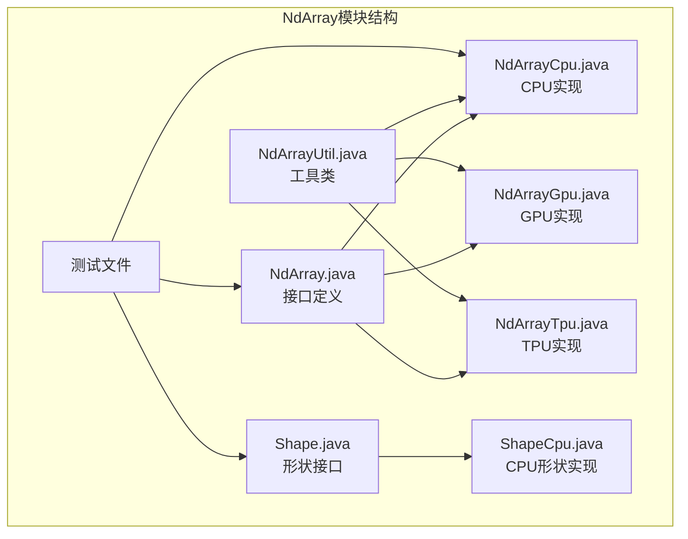
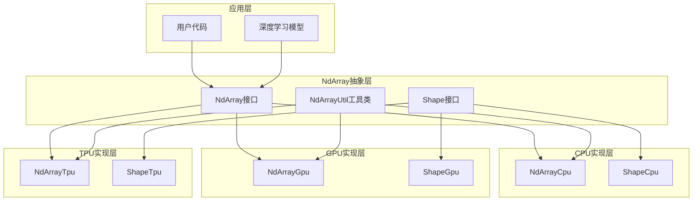
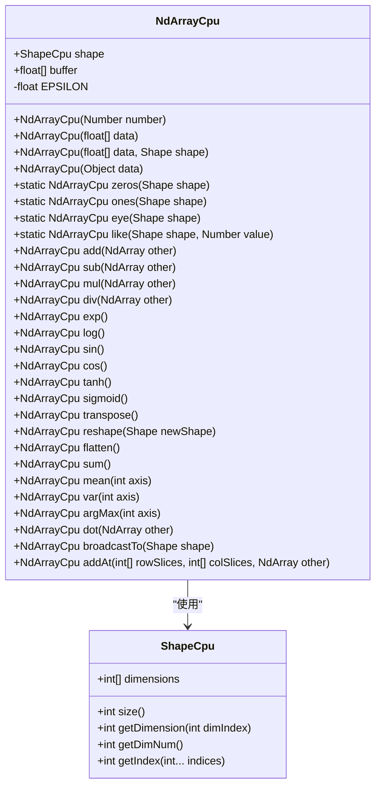
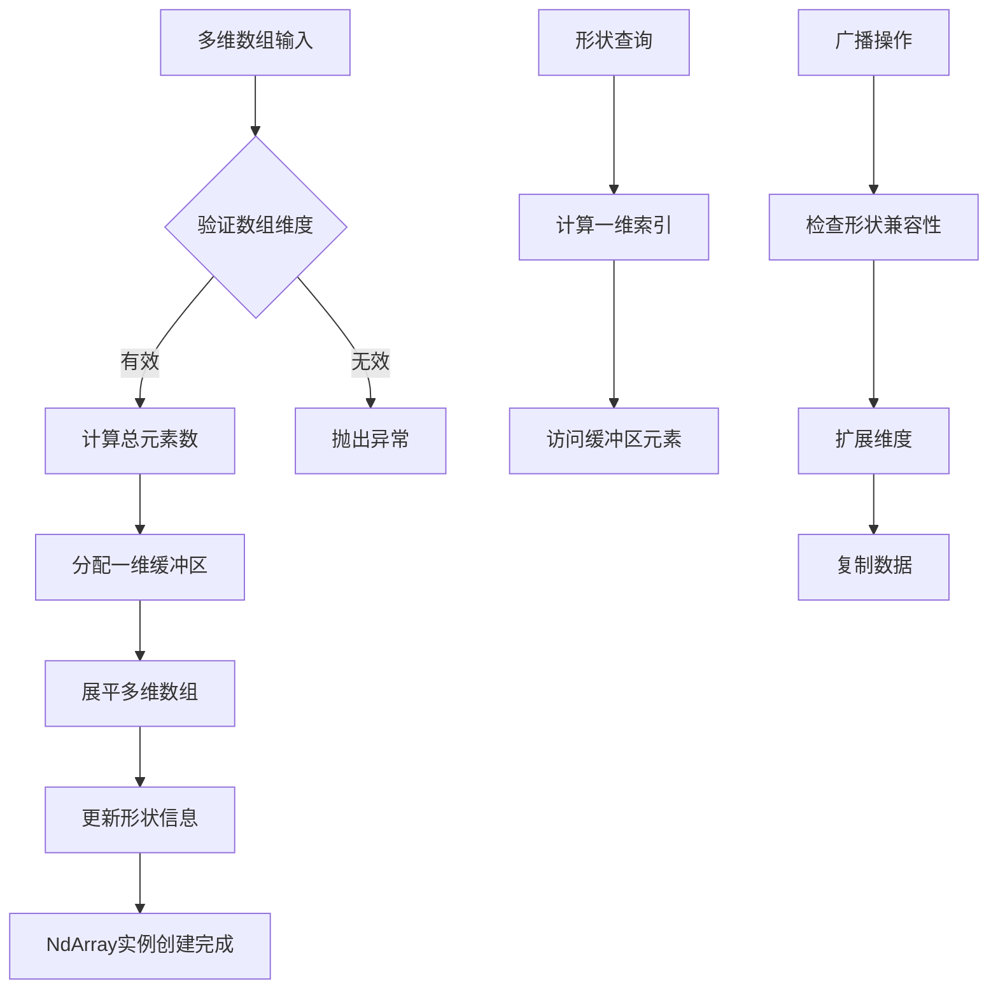
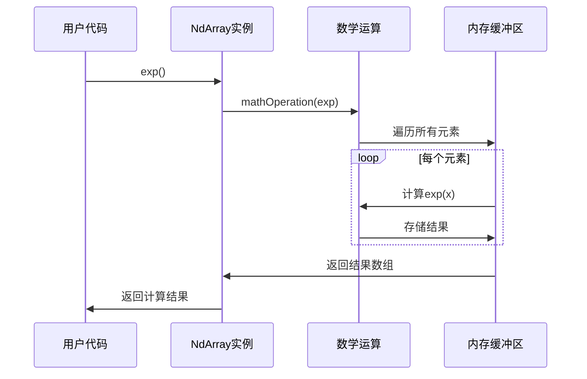
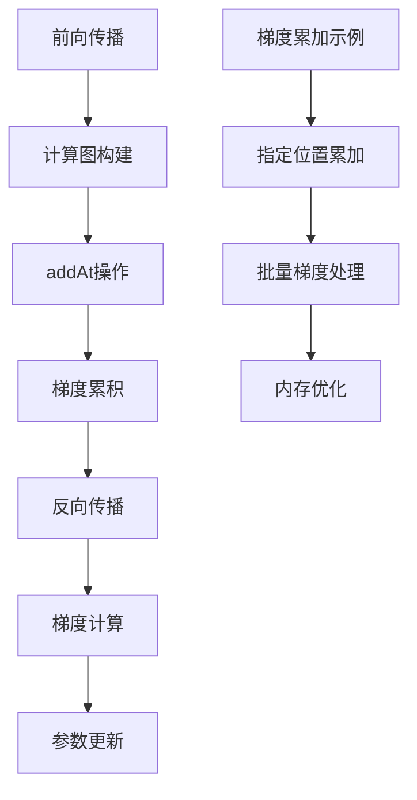
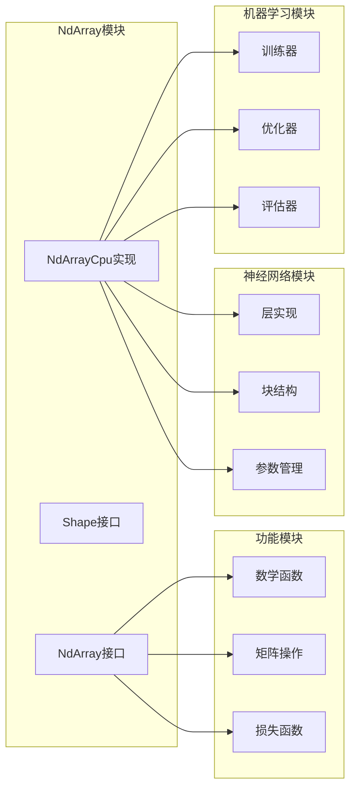

# NdArray - 多维数组基础

<cite>
**本文档中引用的文件**
- [NdArray.java](file://tinyai-dl-ndarr/src/main/java/io/leavesfly/tinyai/ndarr/NdArray.java)
- [Shape.java](file://tinyai-dl-ndarr/src/main/java/io/leavesfly/tinyai/ndarr/Shape.java)
- [NdArrayCpu.java](file://tinyai-dl-ndarr/src/main/java/io/leavesfly/tinyai/ndarr/cpu/NdArrayCpu.java)
- [NdArrayGpu.java](file://tinyai-dl-ndarr/src/main/java/io/leavesfly/tinyai/ndarr/gpu/NdArrayGpu.java)
- [NdArrayTpu.java](file://tinyai-dl-ndarr/src/main/java/io/leavesfly/tinyai/ndarr/tpu/NdArrayTpu.java)
- [NdArrayTest.java](file://tinyai-dl-ndarr/src/test/java/io/leavesfly/tinyai/ndarr/NdArrayTest.java)
- [TestBroadcast.java](file://tinyai-dl-ndarr/src/test/java/io/leavesfly/tinyai/ndarr/TestBroadcast.java)
- [TestBroadcastTo.java](file://tinyai-dl-ndarr/src/test/java/io/leavesfly/tinyai/ndarr/TestBroadcastTo.java)
- [BroadcastTo.java](file://tinyai-dl-func/src/main/java/io/leavesfly/tinyai/func/matrix/BroadcastTo.java)
- [Variable.java](file://tinyai-dl-func/src/main/java/io/leavesfly/tinyai/func/Variable.java)
- [Exp.java](file://tinyai-dl-func/src/main/java/io/leavesfly/tinyai/func/math/Exp.java)
- [Sin.java](file://tinyai-dl-func/src/main/java/io/leavesfly/tinyai/func/math/Sin.java)
- [Tanh.java](file://tinyai-dl-func/src/main/java/io/leavesfly/tinyai/func/math/Tanh.java)
- [Sigmoid.java](file://tinyai-dl-func/src/main/java/io/leavesfly/tinyai/func/math/Sigmoid.java)
- [Im2ColUtil.java](file://tinyai-dl-nnet/src/main/java/io/leavesfly/tinyai/nnet/layer/cnn/Im2ColUtil.java)
</cite>

## 目录
1. [简介](#简介)
2. [项目结构](#项目结构)
3. [核心组件](#核心组件)
4. [架构概览](#架构概览)
5. [详细组件分析](#详细组件分析)
6. [依赖关系分析](#依赖关系分析)
7. [性能考虑](#性能考虑)
8. [故障排除指南](#故障排除指南)
9. [结论](#结论)

## 简介

NdArray是TinyAI框架底层多维数组的核心实现，作为深度学习框架的基础数据结构，它提供了强大的多维数组操作能力。该实现支持标量、向量、矩阵和高维张量的各种操作，包括基础运算、数学函数、统计聚合和自动微分等功能。

NdArray的设计遵循现代深度学习框架的最佳实践，具有以下特点：
- **多后端支持**：支持CPU、GPU和TPU三种计算后端
- **内存高效**：使用float32类型优化内存使用
- **广播机制**：智能的广播支持简化数组运算
- **自动微分**：完整的反向传播和梯度累积机制
- **高性能**：优化的内存布局和算法实现

## 项目结构

NdArray模块位于`tinyai-dl-ndarr`目录下，采用清晰的分层架构：



**图表来源**
- [NdArray.java](file://tinyai-dl-ndarr/src/main/java/io/leavesfly/tinyai/ndarr/NdArray.java#L1-L50)
- [Shape.java](file://tinyai-dl-ndarr/src/main/java/io/leavesfly/tinyai/ndarr/Shape.java#L1-L30)

**章节来源**
- [NdArray.java](file://tinyai-dl-ndarr/src/main/java/io/leavesfly/tinyai/ndarr/NdArray.java#L1-L687)
- [Shape.java](file://tinyai-dl-ndarr/src/main/java/io/leavesfly/tinyai/ndarr/Shape.java#L1-L89)

## 核心组件

### NdArray接口设计

NdArray接口定义了多维数组的核心功能，采用静态工厂方法模式提供简洁的API：

```java
// 静态创建方法
static NdArray of(Number number);              // 标量
static NdArray of(float[] data);               // 一维数组
static NdArray of(float[][] data);             // 二维数组
static NdArray of(Shape shape);                // 指定形状
static NdArray zeros(Shape shape);             // 全零数组
static NdArray ones(Shape shape);              // 全一数组
static NdArray eye(Shape shape);               // 单位矩阵
```

### Shape形状管理

Shape接口负责管理数组的维度信息和内存布局：

```java
// 形状查询方法
int getRow();           // 获取行数（二维）
int getColumn();        // 获取列数（二维）
boolean isMatrix();     // 是否为矩阵
boolean isScalar();     // 是否为标量
boolean isVector();     // 是否为向量
int size();             // 元素总数
int getIndex(int... indices); // 多维索引转一维
```

**章节来源**
- [NdArray.java](file://tinyai-dl-ndarr/src/main/java/io/leavesfly/tinyai/ndarr/NdArray.java#L10-L100)
- [Shape.java](file://tinyai-dl-ndarr/src/main/java/io/leavesfly/tinyai/ndarr/Shape.java#L10-L89)

## 架构概览

NdArray采用分层架构设计，支持多种计算后端：



**图表来源**
- [NdArray.java](file://tinyai-dl-ndarr/src/main/java/io/leavesfly/tinyai/ndarr/NdArray.java#L1-L20)
- [NdArrayCpu.java](file://tinyai-dl-ndarr/src/main/java/io/leavesfly/tinyai/ndarr/cpu/NdArrayCpu.java#L1-L50)

## 详细组件分析

### CPU实现核心

NdArrayCpu是NdArray的主要实现，提供了完整的多维数组功能：



**图表来源**
- [NdArrayCpu.java](file://tinyai-dl-ndarr/src/main/java/io/leavesfly/tinyai/ndarr/cpu/NdArrayCpu.java#L20-L100)
- [Shape.java](file://tinyai-dl-ndarr/src/main/java/io/leavesfly/tinyai/ndarr/Shape.java#L10-L89)

### 内存布局与形状管理

NdArray采用紧凑的一维数组存储多维数据，通过Shape对象管理内存布局：



**图表来源**
- [NdArrayCpu.java](file://tinyai-dl-ndarr/src/main/java/io/leavesfly/tinyai/ndarr/cpu/NdArrayCpu.java#L130-L200)

### 基础运算实现

NdArray支持丰富的基础运算，采用统一的操作模式：

```java
// 通用二元运算模板
private NdArrayCpu binaryOperation(NdArray other, BinaryOperator<Float> op) {
    validateShapes(this.shape, other.getShape());
    NdArrayCpu result = new NdArrayCpu(this.shape);
    
    for (int i = 0; i < buffer.length; i++) {
        result.buffer[i] = op.apply(buffer[i], ((NdArrayCpu) other).buffer[i]);
    }
    
    return result;
}
```

**章节来源**
- [NdArrayCpu.java](file://tinyai-dl-ndarr/src/main/java/io/leavesfly/tinyai/ndarr/cpu/NdArrayCpu.java#L300-L400)

### 数学函数实现

NdArray提供了完整的数学函数库，支持元素级运算：



**图表来源**
- [NdArrayCpu.java](file://tinyai-dl-ndarr/src/main/java/io/leavesfly/tinyai/ndarr/cpu/NdArrayCpu.java#L700-L750)

### 广播机制

广播机制允许不同形状的数组进行运算，是NdArray的重要特性：

```java
// 广播到目标形状
public NdArrayCpu broadcastTo(Shape targetShape) {
    if (this.shape.equals(targetShape)) {
        return this.copy();
    }
    
    // 检查广播兼容性
    validateBroadcastCompatibility(this.shape, targetShape);
    
    // 创建新的数组
    NdArrayCpu result = new NdArrayCpu(targetShape);
    
    // 执行广播复制
    broadcastCopy(this, result);
    
    return result;
}
```

**章节来源**
- [NdArrayCpu.java](file://tinyai-dl-ndarr/src/main/java/io/leavesfly/tinyai/ndarr/cpu/NdArrayCpu.java#L1500-L1600)

### 自动微分支持

NdArray在自动微分中扮演关键角色，特别是在梯度累加方面：



**图表来源**
- [Variable.java](file://tinyai-dl-func/src/main/java/io/leavesfly/tinyai/func/Variable.java#L110-L150)

**章节来源**
- [NdArrayCpu.java](file://tinyai-dl-ndarr/src/main/java/io/leavesfly/tinyai/ndarr/cpu/NdArrayCpu.java#L1700-L1800)
- [Variable.java](file://tinyai-dl-func/src/main/java/io/leavesfly/tinyai/func/Variable.java#L110-L200)

## 依赖关系分析

NdArray模块与其他TinyAI模块存在紧密的依赖关系：



**图表来源**
- [NdArray.java](file://tinyai-dl-ndarr/src/main/java/io/leavesfly/tinyai/ndarr/NdArray.java#L1-L10)
- [BroadcastTo.java](file://tinyai-dl-func/src/main/java/io/leavesfly/tinyai/func/matrix/BroadcastTo.java#L1-L30)

**章节来源**
- [NdArray.java](file://tinyai-dl-ndarr/src/main/java/io/leavesfly/tinyai/ndarr/NdArray.java#L1-L50)

## 性能考虑

### 内存优化策略

NdArray采用了多种内存优化策略：

1. **数据类型优化**：使用float32而非double，减少内存占用50%
2. **缓存友好布局**：采用行优先存储，提高缓存命中率
3. **延迟分配**：按需分配内存，避免不必要的内存浪费
4. **内存复用**：在可能的情况下复用缓冲区

### 算法优化

```java
// 优化的求和操作
public NdArrayCpu sum() {
    float sum = 0f;
    for (float value : this.buffer) {
        sum += value;
    }
    return new NdArrayCpu(sum);
}

// 优化的展平操作
public NdArrayCpu flatten() {
    return this.reshape(Shape.of(1, shape.size()));
}
```

### 性能最佳实践

1. **避免频繁内存分配**：尽量复用NdArray实例
2. **合理使用in-place操作**：对于大型数组，使用就地操作
3. **批处理优化**：利用广播机制进行批量运算
4. **缓存机制**：对于重复计算的结果进行缓存

**章节来源**
- [NdArrayCpu.java](file://tinyai-dl-ndarr/src/main/java/io/leavesfly/tinyai/ndarr/cpu/NdArrayCpu.java#L910-L960)
- [Im2ColUtil.java](file://tinyai-dl-nnet/src/main/java/io/leavesfly/tinyai/nnet/layer/cnn/Im2ColUtil.java#L15-L45)

## 故障排除指南

### 常见错误及解决方案

1. **形状不匹配错误**
   ```java
   // 错误：形状不兼容
   NdArray a = NdArray.of(new float[][]{{1, 2}, {3, 4}});
   NdArray b = NdArray.of(new float[]{1, 2, 3});
   a.add(b); // 抛出异常
   
   // 解决方案：使用广播
   b = b.broadcastTo(a.getShape());
   a.add(b);
   ```

2. **维度验证失败**
   ```java
   // 错误：数组维度不一致
   float[][] irregular = {{1, 2}, {3, 4, 5}};
   NdArray.of(irregular); // 抛出异常
   
   // 解决方案：确保数组规则
   float[][] regular = {{1, 2}, {3, 4}};
   NdArray.of(regular);
   ```

3. **广播兼容性问题**
   ```java
   // 错误：无法广播到目标形状
   NdArray a = NdArray.of(new float[]{1, 2, 3});
   a.broadcastTo(Shape.of(2, 3)); // 抛出异常
   
   // 解决方案：检查广播规则
   a.broadcastTo(Shape.of(1, 3)); // 正确
   ```

### 调试技巧

1. **形状检查**：始终检查数组形状是否符合预期
2. **数据验证**：在关键操作前后验证数据的有效性
3. **内存监控**：监控内存使用情况，避免内存泄漏
4. **性能分析**：使用性能分析工具识别瓶颈

**章节来源**
- [NdArrayTest.java](file://tinyai-dl-ndarr/src/test/java/io/leavesfly/tinyai/ndarr/NdArrayTest.java#L600-L700)

## 结论

NdArray作为TinyAI框架的核心组件，提供了强大而灵活的多维数组操作能力。其设计充分考虑了性能、可扩展性和易用性，为深度学习应用提供了坚实的基础。

### 主要优势

1. **统一的API设计**：简洁直观的接口，降低学习成本
2. **多后端支持**：灵活的架构支持不同的计算后端
3. **完整的功能覆盖**：从基础运算到高级数学函数的全面支持
4. **优秀的性能表现**：优化的内存布局和算法实现
5. **强大的自动微分支持**：完整的反向传播机制

### 未来发展方向

1. **更多后端支持**：扩展对更多硬件平台的支持
2. **性能进一步优化**：持续改进算法和内存管理
3. **功能丰富化**：增加更多高级数学和统计函数
4. **易用性提升**：提供更多的便利方法和工具函数

NdArray的设计体现了现代深度学习框架的发展趋势，为构建高效的机器学习应用提供了强有力的支持。