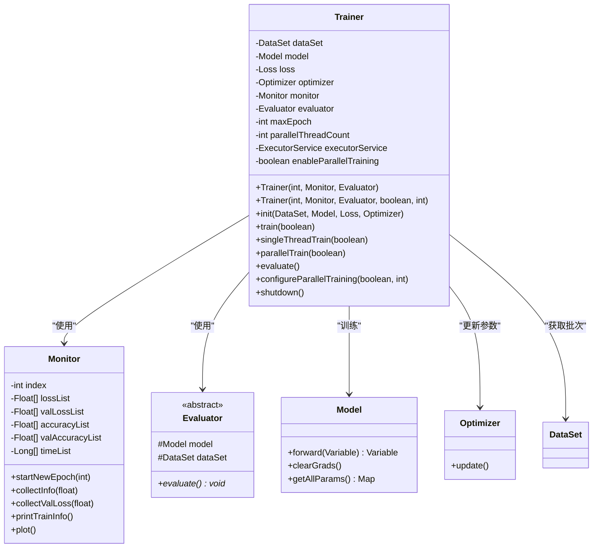
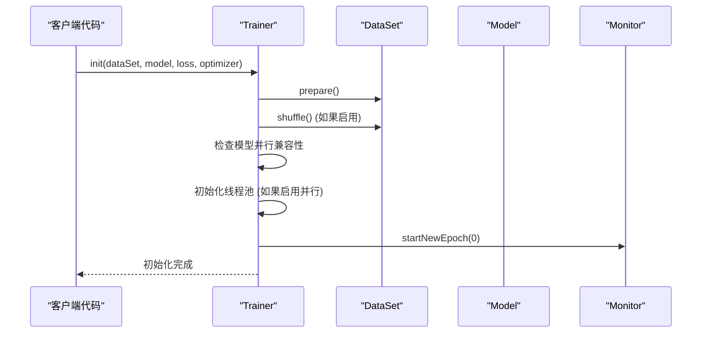
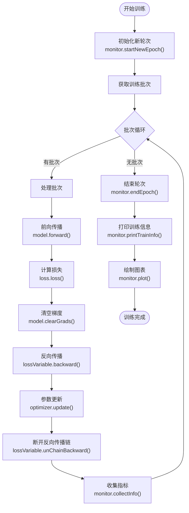
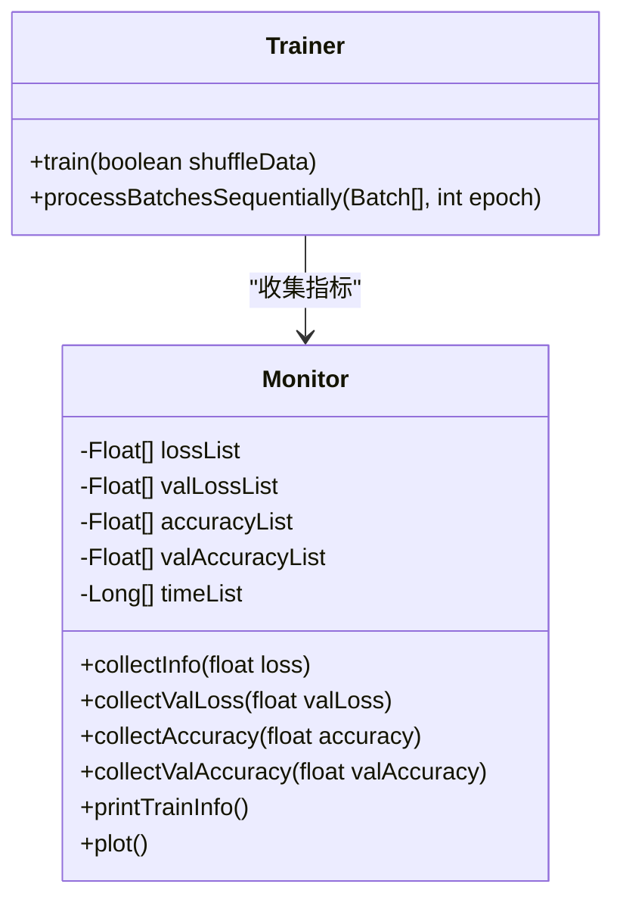
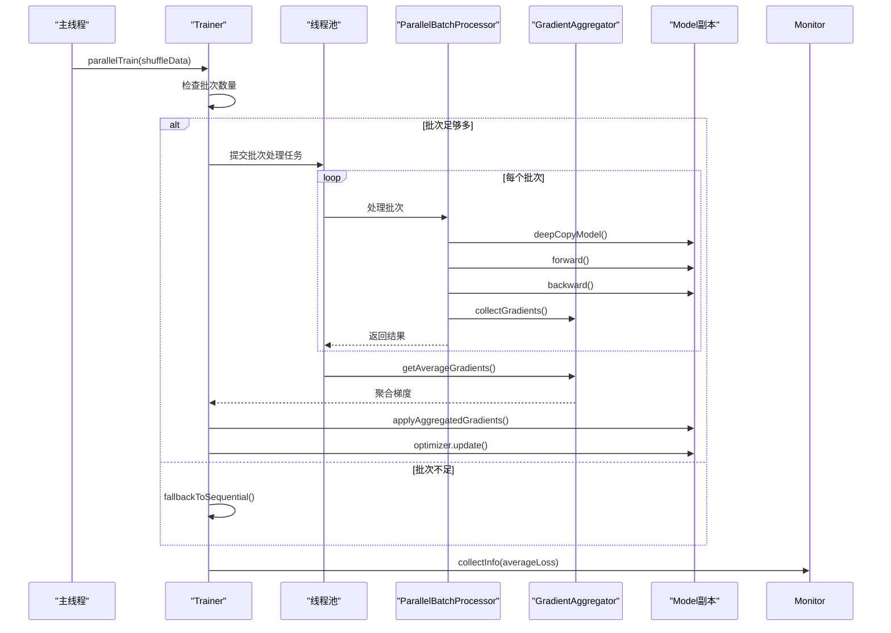

# Trainer - 训练流程控制器

<cite>
**本文档引用的文件**
- [Trainer.java](file://tinyai-dl-ml/src/main/java/io/leavesfly/tinyai/ml/Trainer.java)
- [Monitor.java](file://tinyai-dl-ml/src/main/java/io/leavesfly/tinyai/ml/Monitor.java)
- [Evaluator.java](file://tinyai-dl-ml/src/main/java/io/leavesfly/tinyai/ml/evaluator/Evaluator.java)
- [ParallelTrainingUtils.java](file://tinyai-dl-ml/src/main/java/io/leavesfly/tinyai/ml/parallel/ParallelTrainingUtils.java)
- [SpiralMlpExam.java](file://tinyai-dl-case/src/main/java/io/leavesfly/tinyai/example/classify/SpiralMlpExam.java)
- [ParallelTrainingTest.java](file://tinyai-dl-case/src/main/java/io/leavesfly/tinyai/example/parallel/ParallelTrainingTest.java)
- [RLTrainer.java](file://tinyai-model-deepseek/src/main/java/io/leavesfly/tinyai/deepseek/r1/RLTrainer.java)
</cite>

## 目录
1. [简介](#简介)
2. [核心架构](#核心架构)
3. [构造函数详解](#构造函数详解)
4. [训练流程分析](#训练流程分析)
5. [监控系统集成](#监控系统集成)
6. [并行训练机制](#并行训练机制)
7. [使用示例](#使用示例)
8. [高级配置](#高级配置)
9. [故障排除](#故障排除)
10. [总结](#总结)

## 简介

Trainer类是TinyDL框架中模型训练的核心控制器，负责组织和驱动整个模型训练循环。它提供了完整的训练流程管理功能，支持单线程和并行训练两种模式，并与Monitor监控器和Evaluator评估器紧密集成，实现训练过程的实时监控和性能评估。

Trainer类的主要职责包括：
- 控制训练轮次和批次处理
- 管理前向传播、损失计算和反向传播
- 协调优化器参数更新
- 收集和记录训练指标
- 支持模型评估和可视化

## 核心架构



**图表来源**
- [Trainer.java](file://tinyai-dl-ml/src/main/java/io/leavesfly/tinyai/ml/Trainer.java#L30-L90)
- [Monitor.java](file://tinyai-dl-ml/src/main/java/io/leavesfly/tinyai/ml/Monitor.java#L20-L50)
- [Evaluator.java](file://tinyai-dl-ml/src/main/java/io/leavesfly/tinyai/ml/evaluator/Evaluator.java#L10-L25)

## 构造函数详解

Trainer类提供了两个构造函数，分别支持不同的配置需求：

### 基础构造函数

```java
public Trainer(int _maxEpoch, Monitor _monitor, Evaluator _evaluator)
```

**参数说明：**
- `_maxEpoch`: 最大训练轮次，控制训练的总迭代次数
- `_monitor`: 监控器实例，用于收集和可视化训练过程指标
- `_evaluator`: 评估器实例，用于模型性能评估

**默认配置：**
- 并行训练默认禁用
- 推荐线程数基于4个批次计算

### 高级构造函数

```java
public Trainer(int _maxEpoch, Monitor _monitor, Evaluator _evaluator,
               boolean enableParallel, int threadCount)
```

**额外参数：**
- `enableParallel`: 是否启用并行训练
- `threadCount`: 并行线程数，0表示自动计算

**章节来源**
- [Trainer.java](file://tinyai-dl-ml/src/main/java/io/leavesfly/tinyai/ml/Trainer.java#L49-L90)

## 训练流程分析

### 初始化阶段



**图表来源**
- [Trainer.java](file://tinyai-dl-ml/src/main/java/io/leavesfly/tinyai/ml/Trainer.java#L92-L125)

### 单线程训练流程



**图表来源**
- [Trainer.java](file://tinyai-dl-ml/src/main/java/io/leavesfly/tinyai/ml/Trainer.java#L127-L170)

### 训练循环核心代码

```java
// 单线程训练核心逻辑
for (int i = 0; i < maxEpoch; i++) {
    model.resetState();
    monitor.startNewEpoch(i);
    
    List<Batch> batches = trainDataSet.getBatches();
    float lossSum = 0f;
    
    for (Batch batch : batches) {
        // 数据转换
        Variable variableX = batch.toVariableX().setName("x").setRequireGrad(false);
        Variable variableY = batch.toVariableY().setName("y").setRequireGrad(false);
        
        // 前向传播
        Variable predictY = model.forward(variableX);
        Variable lossVariable = loss.loss(variableY, predictY);
        
        // 梯度计算和参数更新
        model.clearGrads();
        lossVariable.backward();
        optimizer.update();
        
        // 收集损失值
        lossSum += lossVariable.getValue().getNumber().floatValue();
    }
    
    // 更新监控信息
    monitor.collectInfo(lossSum / batches.size());
    monitor.endEpoch();
    monitor.printTrainInfo();
}
```

**章节来源**
- [Trainer.java](file://tinyai-dl-ml/src/main/java/io/leavesfly/tinyai/ml/Trainer.java#L127-L170)

## 监控系统集成

Trainer与Monitor的集成实现了训练过程的实时监控和可视化：

### 监控指标收集



**图表来源**
- [Monitor.java](file://tinyai-dl-ml/src/main/java/io/leavesfly/tinyai/ml/Monitor.java#L20-L80)
- [Trainer.java](file://tinyai-dl-ml/src/main/java/io/leavesfly/tinyai/ml/Trainer.java#L320-L336)

### 实时可视化

Monitor类提供了丰富的可视化功能：

1. **损失曲线**: 记录并绘制训练损失和验证损失
2. **准确率曲线**: 跟踪训练准确率和验证准确率
3. **时间统计**: 记录每轮训练的耗时
4. **日志输出**: 实时打印训练进度和指标

**章节来源**
- [Monitor.java](file://tinyai-dl-ml/src/main/java/io/leavesfly/tinyai/ml/Monitor.java#L80-L150)

## 并行训练机制

### 并行训练架构



**图表来源**
- [Trainer.java](file://tinyai-dl-ml/src/main/java/io/leavesfly/tinyai/ml/Trainer.java#L172-L250)
- [ParallelTrainingUtils.java](file://tinyai-dl-ml/src/main/java/io/leavesfly/tinyai/ml/parallel/ParallelTrainingUtils.java#L20-L50)

### 并行训练优势

1. **性能提升**: 利用多核CPU并行处理多个批次
2. **内存隔离**: 每个线程使用独立的模型副本
3. **梯度聚合**: 安全地合并来自不同线程的梯度
4. **自动降级**: 批次不足时自动回退到单线程模式

### 并行训练配置

```java
// 创建支持并行训练的训练器
Trainer trainer = new Trainer(maxEpoch, monitor, evaluator, true, 4);

// 动态配置并行训练
trainer.configureParallelTraining(true, 8);

// 检查并行训练状态
if (trainer.isParallelTrainingEnabled()) {
    System.out.println("并行线程数: " + trainer.getParallelThreadCount());
}
```

**章节来源**
- [Trainer.java](file://tinyai-dl-ml/src/main/java/io/leavesfly/tinyai/ml/Trainer.java#L252-L300)
- [ParallelTrainingUtils.java](file://tinyai-dl-ml/src/main/java/io/leavesfly/tinyai/ml/parallel/ParallelTrainingUtils.java#L50-L121)

## 使用示例

### 基础使用示例

```java
// 1. 创建训练器
Trainer trainer = new Trainer(maxEpoch, new Monitor(), evaluator);

// 2. 初始化训练器
trainer.init(dataSet, model, loss, optimizer);

// 3. 执行训练
trainer.train(true); // true表示打乱数据

// 4. 模型评估
trainer.evaluate();

// 5. 清理资源
trainer.shutdown();
```

### 完整训练示例

```java
public static void test() {
    int maxEpoch = 300;
    int batchSize = 10;
    float learnRate = 1.0f;
    
    // 创建模型
    Block block = new MlpBlock("MlpBlock", batchSize, null, inputSize, hiddenSize, hiddenSize, outputSize);
    Model model = new Model("SpiralMlpExam", block);
    
    // 准备数据集
    ArrayDataset dataSet = new SpiralDateSet(batchSize);
    
    // 配置优化器和损失函数
    Optimizer optimizer = new SGD(model, learnRate);
    Evaluator evaluator = new AccuracyEval(new Classify(), model, dataSet);
    Loss loss = new SoftmaxCrossEntropy();
    
    // 创建训练器
    Trainer trainer = new Trainer(maxEpoch, new Monitor(), evaluator);
    
    // 初始化并训练
    trainer.init(dataSet, model, loss, optimizer);
    trainer.train(true);
    
    // 评估结果
    trainer.evaluate();
}
```

### 并行训练示例

```java
// 创建并行训练器
Trainer trainer = new Trainer(maxEpoch, monitor, evaluator, true, 4);

// 初始化
trainer.init(dataSet, model, loss, optimizer);

// 执行并行训练
trainer.train(true);

// 清理资源
trainer.shutdown();
```

**章节来源**
- [SpiralMlpExam.java](file://tinyai-dl-case/src/main/java/io/leavesfly/tinyai/example/classify/SpiralMlpExam.java#L41-L96)
- [ParallelTrainingTest.java](file://tinyai-dl-case/src/main/java/io/leavesfly/tinyai/example/parallel/ParallelTrainingTest.java#L50-L108)

## 高级配置

### 监控器配置

```java
// 带日志文件的监控器
Monitor monitor = new Monitor("/path/to/training.log");

// 自定义监控器配置
monitor.setLoggingEnabled(true);
monitor.setPlotEnabled(true);
```

### 评估器配置

```java
// 准确率评估器
Evaluator evaluator = new AccuracyEval(lossFunction, model, dataSet);

// 回归评估器
Evaluator regressEval = new RegressEval(lossFunction, model, dataSet);
```

### 并行训练优化

```java
// 智能线程数配置
int recommendedThreads = ParallelTrainingUtils.getRecommendedThreadCount(batchCount);

// 自定义线程数
Trainer trainer = new Trainer(maxEpoch, monitor, evaluator, true, 4);

// 动态调整并行配置
trainer.configureParallelTraining(true, 8);
```

### 强化学习训练器

```java
// 继承自Trainer的强化学习训练器
RLTrainer rlTrainer = new RLTrainer(maxEpoch, monitor, evaluator, true, 4);

// 添加强化学习特定指标
rlTrainer.initializeMetrics();
```

**章节来源**
- [RLTrainer.java](file://tinyai-model-deepseek/src/main/java/io/leavesfly/tinyai/deepseek/r1/RLTrainer.java#L59-L102)

## 故障排除

### 常见问题及解决方案

1. **并行训练失败**
   ```java
   // 检查模型是否支持序列化
   if (!ParallelTrainingUtils.isModelParallelizable(model)) {
       System.err.println("模型不支持并行训练，回退到单线程模式");
   }
   ```

2. **内存不足**
   ```java
   // 减少并行线程数
   trainer.configureParallelTraining(true, 2);
   
   // 或者禁用并行训练
   trainer.configureParallelTraining(false, 0);
   ```

3. **训练速度慢**
   ```java
   // 检查批次大小和线程数
   System.out.println("推荐线程数: " + ParallelTrainingUtils.getRecommendedThreadCount(batchCount));
   ```

### 资源管理

```java
// 确保正确关闭训练器
try {
    trainer.train(true);
} finally {
    trainer.shutdown();
}
```

**章节来源**
- [Trainer.java](file://tinyai-dl-ml/src/main/java/io/leavesfly/tinyai/ml/Trainer.java#L350-L400)

## 总结

Trainer类作为TinyDL框架的核心组件，提供了完整而灵活的模型训练解决方案：

### 主要特性

1. **双模式训练**: 支持单线程和并行训练，适应不同硬件环境
2. **智能监控**: 与Monitor深度集成，提供实时指标收集和可视化
3. **灵活评估**: 与Evaluator协作，支持多种评估指标
4. **资源管理**: 完善的生命周期管理和资源清理
5. **扩展性强**: 支持自定义评估器和监控器

### 最佳实践

1. **合理配置并行训练**: 根据硬件资源和数据规模调整线程数
2. **及时清理资源**: 训练完成后务必调用shutdown()方法
3. **监控训练过程**: 利用Monitor提供的可视化功能跟踪训练进度
4. **选择合适的评估器**: 根据任务类型选择相应的评估指标

### 未来发展方向

1. **分布式训练**: 支持跨机器的分布式训练
2. **异步训练**: 实现真正的异步训练流程
3. **自动调参**: 集成自动超参数优化功能
4. **云原生支持**: 适配容器化和微服务架构

Trainer类的设计体现了现代机器学习框架的最佳实践，为开发者提供了一个强大而易用的训练平台，大大简化了模型训练的复杂性，同时保持了高度的灵活性和可扩展性。