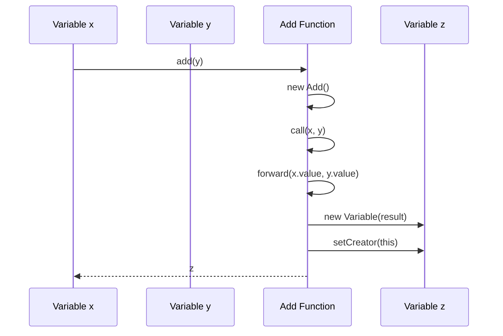
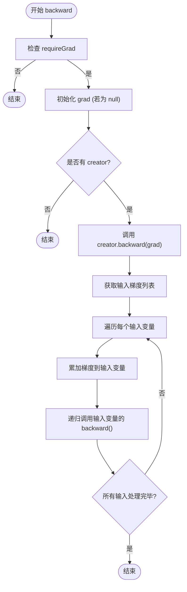
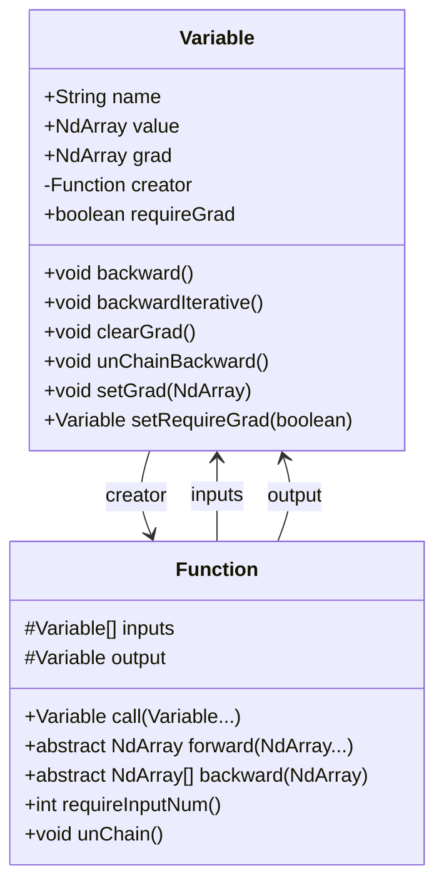

# Variable - 自动微分引擎

<cite>
**本文档中引用的文件**   
- [Variable.java](file://tinyai-dl-func/src/main/java/io/leavesfly/tinyai/func/Variable.java)
- [Function.java](file://tinyai-dl-func/src/main/java/io/leavesfly/tinyai/func/Function.java)
</cite>

## 目录
1. [简介](#简介)
2. [核心字段解析](#核心字段解析)
3. [正向传播与计算图构建](#正向传播与计算图构建)
4. [反向传播机制](#反向传播机制)
5. [梯度管理与最佳实践](#梯度管理与最佳实践)
6. [Variable与Function的协作关系](#variable与function的协作关系)
7. [序列化支持](#序列化支持)

## 简介
`Variable` 类是 TinyAI 深度学习框架中自动微分系统的核心组件，它对数学变量进行了抽象表示。该类不仅存储变量的数值，还维护了梯度信息、生成函数引用以及梯度计算开关，从而实现了动态计算图的构建与自动微分功能。`Variable` 类与 `Function` 基类紧密协作，共同构成了框架的计算基础。

## 核心字段解析

`Variable` 类包含以下几个关键字段，它们共同支撑了自动微分的实现：

- **value (NdArray数据)**: 存储变量的实际数值，使用 `NdArray` 类型表示多维数组数据。
- **grad (梯度)**: 存储反向传播过程中计算得到的梯度值，用于后续的参数更新。
- **creator (生成函数)**: 指向生成该变量的 `Function` 实例，是构建计算图的关键指针，通过此引用可以追溯变量的来源。
- **requireGrad (梯度开关)**: 布尔标志，控制是否为该变量计算和存储梯度。当设置为 `false` 时，反向传播将跳过该变量。

**Section sources**
- [Variable.java](file://tinyai-dl-func/src/main/java/io/leavesfly/tinyai/func/Variable.java#L50-L80)

## 正向传播与计算图构建

在正向传播过程中，`Variable` 通过其提供的各种运算方法（如 `add`、`mul` 等）与其他 `Variable` 进行交互。这些运算并非直接在 `NdArray` 上执行，而是通过创建相应的 `Function` 实例来完成。

**Diagram sources**
- [Variable.java](file://tinyai-dl-func/src/main/java/io/leavesfly/tinyai/func/Variable.java#L291-L294)
- [Function.java](file://tinyai-dl-func/src/main/java/io/leavesfly/tinyai/func/Function.java#L45-L85)

当调用 `x.add(y)` 时，会创建一个 `Add` 函数对象，并调用其 `call` 方法。`call` 方法首先执行前向计算（`forward`），生成结果的 `NdArray`，然后创建一个新的 `Variable` 对象来包装这个结果。关键的一步是，在训练模式下（由 `Config.train` 控制），`call` 方法会将当前 `Function` 实例设置为输出 `Variable` 的 `creator`，并将输入 `Variable` 记录在 `Function` 的 `inputs` 字段中。这样，就建立了一个从输出到输入的反向链接，多个这样的链接最终形成了完整的计算图。

**Section sources**
- [Variable.java](file://tinyai-dl-func/src/main/java/io/leavesfly/tinyai/func/Variable.java#L291-L320)
- [Function.java](file://tinyai-dl-func/src/main/java/io/leavesfly/tinyai/func/Function.java#L45-L85)

## 反向传播机制

反向传播通过 `Variable` 的 `backward()` 方法启动。该方法从当前变量开始，沿着 `creator` 指针递归或迭代地回溯整个计算图，计算并累积梯度。

**Diagram sources**
- [Variable.java](file://tinyai-dl-func/src/main/java/io/leavesfly/tinyai/func/Variable.java#L119-L148)

`backward()` 方法的执行流程如下：
1.  **梯度开关检查**: 首先检查 `requireGrad`，若为 `false`，则直接返回。
2.  **梯度初始化**: 如果当前变量的 `grad` 为 `null`，则将其初始化为一个与 `value` 形状相同的全1数组（这对应于损失函数对自身的导数为1）。
3.  **回溯计算**: 如果存在 `creator`，则调用该 `creator` 的 `backward` 方法，并传入当前的 `grad`。`backward` 方法会根据链式法则计算出对每个输入变量的梯度。
4.  **梯度累加与递归**: 将计算出的梯度累加到对应输入变量的 `grad` 字段中（支持梯度复用），然后递归地调用每个输入变量的 `backward()` 方法，继续向后传播。

此外，`Variable` 类还提供了 `backwardIterative()` 方法，使用栈来模拟递归过程，避免了在深层网络或RNN中可能出现的栈溢出问题。

**Section sources**
- [Variable.java](file://tinyai-dl-func/src/main/java/io/leavesfly/tinyai/func/Variable.java#L119-L203)

## 梯度管理与最佳实践

`Variable` 类提供了对梯度生命周期的完整管理。

- **梯度清零 (`clearGrad`)**: 在每次训练迭代开始前，必须调用 `clearGrad()` 方法将 `grad` 字段置为 `null`。这是最佳实践，可以防止梯度在多次 `backward()` 调用中不断累加，确保每次更新都基于当前批次数据的正确梯度。
- **切断计算图 (`unChainBackward`)**: 在RNN等场景中，为了防止梯度在过长的时间序列上回传导致梯度爆炸或消失，可以调用 `unChainBackward()` 方法。该方法会清除当前变量的 `creator` 引用，并递归地对所有输入变量执行相同的操作，从而有效地切断了计算图，将当前状态作为一个新的起点。

**Diagram sources**
- [Variable.java](file://tinyai-dl-func/src/main/java/io/leavesfly/tinyai/func/Variable.java#L70-L280)
- [Function.java](file://tinyai-dl-func/src/main/java/io/leavesfly/tinyai/func/Function.java#L30-L150)

**Section sources**
- [Variable.java](file://tinyai-dl-func/src/main/java/io/leavesfly/tinyai/func/Variable.java#L228-L230)
- [Variable.java](file://tinyai-dl-func/src/main/java/io/leavesfly/tinyai/func/Variable.java#L211-L220)
- [Variable.java](file://tinyai-dl-func/src/main/java/io/leavesfly/tinyai/func/Variable.java#L248-L260)

## Variable与Function的协作关系

`Variable` 和 `Function` 构成了一个生产者-消费者模型。`Variable` 是数据的载体，而 `Function` 是操作数据的算子。

- **正向协作**: `Variable` 的运算方法（如 `add`）负责创建并调用 `Function`。`Function` 的 `call` 方法执行前向计算，并在训练模式下将自己注册为输出 `Variable` 的 `creator`，同时记录输入 `Variable`。
- **反向协作**: 在反向传播时，`Variable` 的 `backward()` 方法通过 `creator` 找到 `Function`，并调用其 `backward()` 方法。`Function` 根据其前向计算的逻辑，计算出对输入的梯度并返回，`Variable` 则负责接收这些梯度并继续向后传播。

这种解耦的设计使得添加新的数学运算变得非常简单，只需继承 `Function` 类并实现 `forward` 和 `backward` 方法即可。

**Section sources**
- [Variable.java](file://tinyai-dl-func/src/main/java/io/leavesfly/tinyai/func/Variable.java#L291-L320)
- [Function.java](file://tinyai-dl-func/src/main/java/io/leavesfly/tinyai/func/Function.java#L45-L85)

## 序列化支持

`Variable` 类实现了 `Serializable` 接口，支持对象的序列化，这对于模型的保存和加载至关重要。为了防止在序列化时出现循环引用问题（因为 `creator` 和 `inputs` 形成了双向引用），`creator` 字段被标记为 `transient`，这意味着它不会被序列化。当模型被反序列化后，计算图需要在下一次前向传播时重新构建。

**Section sources**
- [Variable.java](file://tinyai-dl-func/src/main/java/io/leavesfly/tinyai/func/Variable.java#L45-L50)