# TinyAI框架核心组件技术文档

<cite>
**本文档引用的文件**
- [NdArray.java](file://tinyai-dl-ndarr/src/main/java/io/leavesfly/tinyai/ndarr/NdArray.java)
- [Variable.java](file://tinyai-dl-func/src/main/java/io/leavesfly/tinyai/func/Variable.java)
- [Block.java](file://tinyai-dl-nnet/src/main/java/io/leavesfly/tinyai/nnet/Block.java)
- [Model.java](file://tinyai-dl-ml/src/main/java/io/leavesfly/tinyai/ml/Model.java)
- [Trainer.java](file://tinyai-dl-ml/src/main/java/io/leavesfly/tinyai/ml/Trainer.java)
- [Add.java](file://tinyai-dl-func/src/main/java/io/leavesfly/tinyai/func/base/Add.java)
- [MlpBlock.java](file://tinyai-dl-nnet/src/main/java/io/leavesfly/tinyai/nnet/block/MlpBlock.java)
- [SGD.java](file://tinyai-dl-ml/src/main/java/io/leavesfly/tinyai/ml/optimize/SGD.java)
- [SoftmaxCE.java](file://tinyai-dl-func/src/main/java/io/leavesfly/tinyai/func/loss/SoftmaxCE.java)
- [MnistDataSet.java](file://tinyai-dl-ml/src/main/java/io/leavesfly/tinyai/ml/dataset/simple/MnistDataSet.java)
- [AffineLayer.java](file://tinyai-dl-nnet/src/main/java/io/leavesfly/tinyai/nnet/layer/dnn/AffineLayer.java)
- [MnistMlpExam.java](file://tinyai-dl-case/src/main/java/io/leavesfly/tinyai/example/classify/MnistMlpExam.java)
</cite>

## 目录
1. [简介](#简介)
2. [项目结构概览](#项目结构概览)
3. [核心组件详解](#核心组件详解)
4. [架构设计](#架构设计)
5. [组件交互流程](#组件交互流程)
6. [API使用示例](#API使用示例)
7. [性能优化机制](#性能优化机制)
8. [故障排除指南](#故障排除指南)
9. [总结](#总结)

## 简介

TinyAI框架是一个轻量级的深度学习框架，专为教育和研究目的而设计。该框架通过五个核心组件实现了完整的深度学习工作流程：NdArray（底层多维数组）、Variable（动态计算图）、Block（神经网络结构）、Model（模型封装）和Trainer（训练循环）。这些组件采用组合模式和面向对象设计原则，提供了清晰的层次结构和灵活的扩展能力。

## 项目结构概览


**图表来源**
- [NdArray.java](file://tinyai-dl-ndarr/src/main/java/io/leavesfly/tinyai/ndarr/NdArray.java#L1-L50)
- [Variable.java](file://tinyai-dl-func/src/main/java/io/leavesfly/tinyai/func/Variable.java#L1-L50)
- [Block.java](file://tinyai-dl-nnet/src/main/java/io/leavesfly/tinyai/nnet/Block.java#L1-L50)

## 核心组件详解

### NdArray：底层多维数组引擎

NdArray是TinyAI框架的最底层组件，提供了高性能的多维数组操作和计算优化机制。

#### 内存布局与计算优化


**图表来源**
- [NdArray.java](file://tinyai-dl-ndarr/src/main/java/io/leavesfly/tinyai/ndarr/NdArray.java#L1-L100)
- [NdArrayCpu.java](file://tinyai-dl-ndarr/src/main/java/io/leavesfly/tinyai/ndarr/cpu/NdArrayCpu.java)

#### 关键特性

1. **多维数组支持**：支持1D到4D数组的创建和操作
2. **广播机制**：自动处理不同形状数组的运算
3. **高效内存管理**：使用连续内存布局减少缓存未命中
4. **多种设备支持**：CPU、GPU、TPU的统一接口

**章节来源**
- [NdArray.java](file://tinyai-dl-ndarr/src/main/java/io/leavesfly/tinyai/ndarr/NdArray.java#L1-L200)

### Variable：动态计算图引擎

Variable类是自动微分系统的核心，负责构建和维护计算图，实现高效的反向传播。

#### 动态计算图构建


**图表来源**
- [Variable.java](file://tinyai-dl-func/src/main/java/io/leavesfly/tinyai/func/Variable.java#L80-L150)
- [Add.java](file://tinyai-dl-func/src/main/java/io/leavesfly/tinyai/func/base/Add.java#L20-L80)

#### 自动微分机制

Variable类实现了两种反向传播策略：

1. **递归实现**：简洁直观，适合浅层网络
2. **迭代实现**：使用栈避免栈溢出，适合深层网络

**章节来源**
- [Variable.java](file://tinyai-dl-func/src/main/java/io/leavesfly/tinyai/func/Variable.java#L80-L200)

### Block：神经网络结构组合器

Block组件采用组合模式，将多个Layer组合成复杂的神经网络结构。

#### 组合模式实现

```mermaid
classDiagram
class LayerAble {
<<abstract>>
+init() void
+layerForward(Variable[]) Variable
+getParams() Map~String,Parameter~
+clearGrads() void
}
class Block {
<<abstract>>
#LayerAble[] layers
#Map~String,Parameter~ params
+addLayer(LayerAble) void
+layerForward(Variable[]) Variable
+getAllParams() Map~String,Parameter~
+resetState() void
}
class MlpBlock {
-Config.ActiveFunc activeFunc
+MlpBlock(String, int, ActiveFunc, int...)
+init() void
}
class SequentialBlock {
+SequentialBlock(String, Shape)
+addLayer(LayerAble) void
}
class Layer {
+layerForward(Variable[]) Variable
+init() void
}
LayerAble <|-- Block
LayerAble <|-- Layer
Block <|-- MlpBlock
Block <|-- SequentialBlock
Block --> LayerAble : contains
```



**图表来源**
- [Block.java](file://tinyai-dl-nnet/src/main/java/io/leavesfly/tinyai/nnet/Block.java#L15-L80)
- [MlpBlock.java](file://tinyai-dl-nnet/src/main/java/io/leavesfly/tinyai/nnet/block/MlpBlock.java#L20-L60)

#### 神经网络构建流程


**图表来源**
- [Block.java](file://tinyai-dl-nnet/src/main/java/io/leavesfly/tinyai/nnet/Block.java#L50-L80)

**章节来源**
- [Block.java](file://tinyai-dl-nnet/src/main/java/io/leavesfly/tinyai/nnet/Block.java#L1-L135)
- [MlpBlock.java](file://tinyai-dl-nnet/src/main/java/io/leavesfly/tinyai/nnet/block/MlpBlock.java#L1-L60)

### Model：模型封装器

Model类封装了整个神经网络模型，提供了完整的生命周期管理功能。

#### 模型生命周期管理


**图表来源**
- [Model.java](file://tinyai-dl-ml/src/main/java/io/leavesfly/tinyai/ml/Model.java#L50-L150)

#### 序列化与持久化

Model类支持多种序列化方式：

1. **传统Java序列化**：简单易用
2. **ModelSerializer**：推荐方式，支持压缩
3. **参数分离保存**：仅保存模型参数

**章节来源**
- [Model.java](file://tinyai-dl-ml/src/main/java/io/leavesfly/tinyai/ml/Model.java#L1-L199)

### Trainer：训练循环控制器

Trainer类是模型训练的核心控制器，支持单线程和并行训练两种模式。

#### 训练流程控制


**图表来源**
- [Trainer.java](file://tinyai-dl-ml/src/main/java/io/leavesfly/tinyai/ml/Trainer.java#L100-L200)

#### 并行训练优化

Trainer类实现了智能的并行训练机制：

1. **批处理并行**：将批次数据分配给多个线程
2. **梯度聚合**：安全地合并多个线程的梯度
3. **自适应线程数**：根据硬件资源自动调整线程数

**章节来源**
- [Trainer.java](file://tinyai-dl-ml/src/main/java/io/leavesfly/tinyai/ml/Trainer.java#L1-L199)

## 架构设计

### 整体架构图


**图表来源**
- [Model.java](file://tinyai-dl-ml/src/main/java/io/leavesfly/tinyai/ml/Model.java#L1-L50)
- [Trainer.java](file://tinyai-dl-ml/src/main/java/io/leavesfly/tinyai/ml/Trainer.java#L1-L50)

### 数据流与控制流


**图表来源**
- [Trainer.java](file://tinyai-dl-ml/src/main/java/io/leavesfly/tinyai/ml/Trainer.java#L150-L200)

## 组件交互流程

### 完整训练流程


**图表来源**
- [Trainer.java](file://tinyai-dl-ml/src/main/java/io/leavesfly/tinyai/ml/Trainer.java#L100-L200)

### 模型推理流程


**图表来源**
- [Model.java](file://tinyai-dl-ml/src/main/java/io/leavesfly/tinyai/ml/Model.java#L100-L150)

## API使用示例

### NdArray基础操作

```java
// 创建NdArray
NdArray array1 = NdArray.of(new float[]{1, 2, 3});
NdArray array2 = NdArray.of(new float[]{4, 5, 6});

// 基础运算
NdArray result = array1.add(array2);  // 加法
NdArray multiply = array1.mul(array2); // 乘法
NdArray dotProduct = array1.dot(array2); // 点积

// 数学函数
NdArray exp = array1.exp(); // 指数
NdArray sigmoid = array1.sigmoid(); // Sigmoid
NdArray softmax = array1.softMax(); // SoftMax

// 形状操作
NdArray reshaped = array1.reshape(Shape.of(1, 3));
NdArray transposed = array1.transpose();
```

### Variable动态计算

```java
// 创建Variable
Variable x = new Variable(NdArray.of(2.0f));
Variable y = new Variable(NdArray.of(3.0f));

// 执行操作
Variable z = x.mul(y).add(new Variable(NdArray.of(1.0f)));

// 自动微分
z.backward(); // 计算梯度

// 访问梯度
NdArray gradX = x.getGrad();
NdArray gradY = y.getGrad();
```

### Block神经网络构建

```java
// 创建多层感知机
Block mlp = new MlpBlock("MyMLP", 32, Config.ActiveFunc.ReLU, 784, 256, 128, 10);

// 添加自定义层
mlp.addLayer(new AffineLayer("custom_layer", Shape.of(128, 64), 64, true));
mlp.addLayer(new ReLuLayer("relu"));

// 初始化参数
mlp.init();
```

### Model模型封装

```java
// 创建模型
Model model = new Model("MyModel", mlp);

// 保存模型
model.saveModel("model.bin");
model.saveParameters("params.bin");

// 加载模型
Model loadedModel = Model.loadModel("model.bin");
loadedModel.loadParameters("params.bin");
```

### Trainer训练循环

```java
// 配置训练器
Trainer trainer = new Trainer(100, new Monitor(), new AccuracyEval());

// 初始化
trainer.init(dataset, model, new SoftmaxCrossEntropy(), new SGD(model, 0.01f));

// 训练
trainer.train(true); // 打乱数据

// 评估
trainer.evaluate();
```

**章节来源**
- [MnistMlpExam.java](file://tinyai-dl-case/src/main/java/io/leavesfly/tinyai/example/classify/MnistMlpExam.java#L1-L84)

## 性能优化机制

### 内存优化策略

1. **连续内存布局**：NdArray采用连续内存存储，减少缓存未命中
2. **梯度复用**：支持梯度累加而非覆盖，提高内存利用率
3. **延迟计算**：仅在需要时才执行计算，避免不必要的中间结果

### 计算优化技术

1. **广播优化**：智能判断是否需要广播操作
2. **向量化操作**：利用SIMD指令加速数组运算
3. **并行计算**：支持多线程并行处理批次数据

### 内存管理


## 故障排除指南

### 常见错误与解决方案

1. **形状不匹配错误**
   - 检查NdArray的形状是否正确
   - 确认广播操作是否符合预期
   - 使用`.getShape()`方法验证形状

2. **梯度消失/爆炸**
   - 检查学习率设置
   - 调整权重初始化方法
   - 使用梯度裁剪技术

3. **内存不足**
   - 减少批次大小
   - 使用梯度累积
   - 启用混合精度训练

4. **计算图循环**
   - 检查Variable的creator链
   - 避免循环引用
   - 使用`.unChainBackward()`清理计算图

### 调试技巧

1. **可视化计算图**：使用`model.plot()`查看网络结构
2. **监控训练过程**：通过Monitor类跟踪损失和准确率
3. **检查梯度**：打印Variable的梯度值
4. **单元测试**：为关键组件编写测试用例

**章节来源**
- [Variable.java](file://tinyai-dl-func/src/main/java/io/leavesfly/tinyai/func/Variable.java#L80-L150)
- [Trainer.java](file://tinyai-dl-ml/src/main/java/io/leavesfly/tinyai/ml/Trainer.java#L150-L200)

## 总结

TinyAI框架通过精心设计的五个核心组件，构建了一个完整且高效的深度学习平台：

1. **NdArray**提供了高性能的多维数组操作和内存优化
2. **Variable**实现了灵活的动态计算图和自动微分
3. **Block**采用组合模式，支持复杂的神经网络结构
4. **Model**封装了完整的模型生命周期管理
5. **Trainer**提供了智能的训练循环控制和并行优化

这些组件之间通过清晰的接口和依赖关系相互协作，形成了一个层次分明、易于扩展的架构体系。开发者可以通过组合不同的组件来构建各种类型的深度学习模型，从简单的多层感知机到复杂的Transformer架构。

框架的设计理念体现了现代软件工程的最佳实践：关注点分离、接口抽象、组合优于继承、开闭原则等。这种设计使得TinyAI既适合教学使用，也具备一定的生产环境应用潜力。