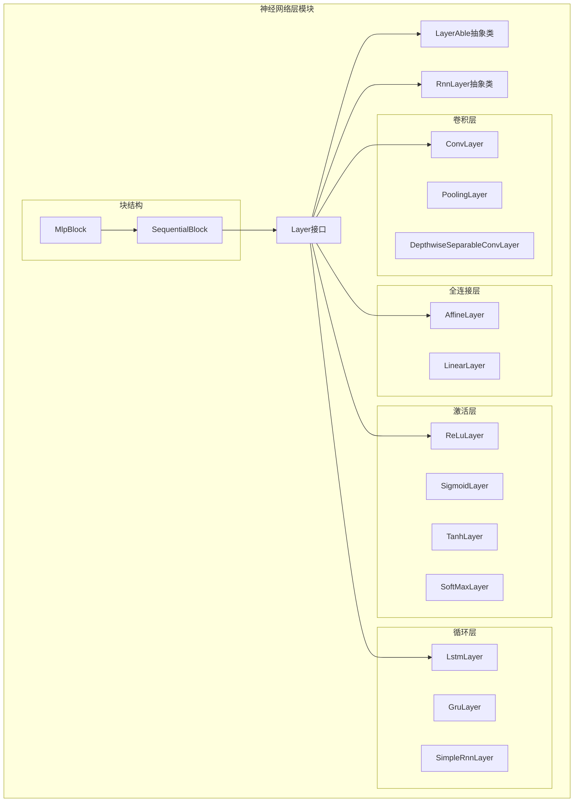
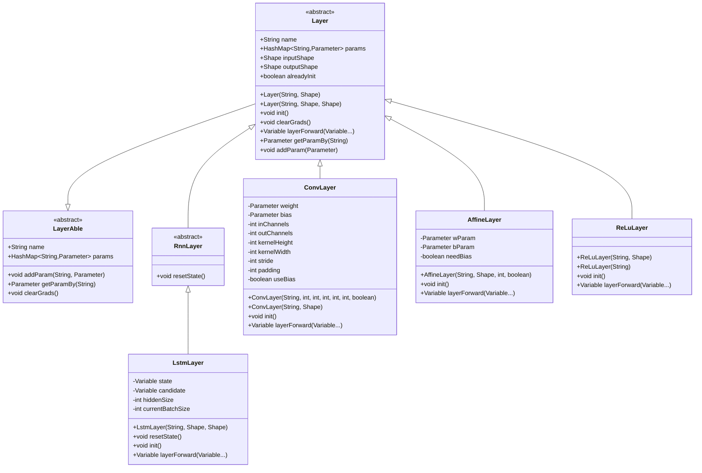
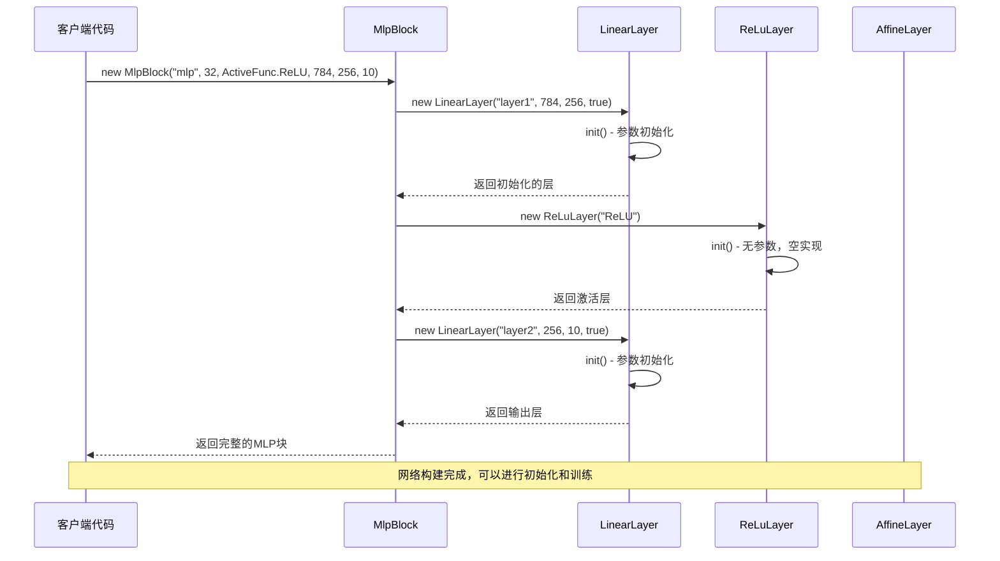

# 工厂模式在TinyAI神经网络层创建中的应用

<cite>
**本文档引用的文件**
- [Layer.java](file://tinyai-dl-nnet/src/main/java/io/leavesfly/tinyai/nnet/Layer.java)
- [ConvLayer.java](file://tinyai-dl-nnet/src/main/java/io/leavesfly/tinyai/nnet/layer/cnn/ConvLayer.java)
- [AffineLayer.java](file://tinyai-dl-nnet/src/main/java/io/leavesfly/tinyai/nnet/layer/dnn/AffineLayer.java)
- [ReLuLayer.java](file://tinyai-dl-nnet/src/main/java/io/leavesfly/tinyai/nnet/layer/activate/ReLuLayer.java)
- [LstmLayer.java](file://tinyai-dl-nnet/src/main/java/io/leavesfly/tinyai/nnet/layer/rnn/LstmLayer.java)
- [MlpBlock.java](file://tinyai-dl-nnet/src/main/java/io/leavesfly/tinyai/nnet/block/MlpBlock.java)
- [SimpleConvNet.java](file://tinyai-dl-cv/src/main/java/io/leavesfly/tinyai/cv/SimpleConvNet.java)
- [SequentialBlock.java](file://tinyai-dl-nnet/src/main/java/io/leavesfly/tinyai/nnet/block/SequentialBlock.java)
</cite>

## 目录
1. [引言](#引言)
2. [项目结构概述](#项目结构概述)
3. [工厂模式的核心概念](#工厂模式的核心概念)
4. [Layer接口设计](#layer接口设计)
5. [具体Layer实现分析](#具体layer实现分析)
6. [隐式工厂模式的应用](#隐式工厂模式的应用)
7. [UML类图展示](#uml类图展示)
8. [工厂模式的优势](#工厂模式的优势)
9. [实际应用场景](#实际应用场景)
10. [总结](#总结)

## 引言

TinyAI框架虽然没有采用传统的工厂类设计模式，但在神经网络层的创建过程中巧妙地运用了工厂方法模式的变体。通过Layer接口及其各种具体实现类，框架实现了复杂对象创建逻辑的封装，包括参数初始化、形状推断和内部状态配置等功能。这种设计模式简化了模型构建过程，提高了代码可读性，并支持通过配置文件或API参数动态构建网络结构。

## 项目结构概述

TinyAI项目采用了分层架构设计，神经网络层相关的核心组件位于`tinyai-dl-nnet`模块中：



**图表来源**
- [Layer.java](file://tinyai-dl-nnet/src/main/java/io/leavesfly/tinyai/nnet/Layer.java#L1-L52)
- [ConvLayer.java](file://tinyai-dl-nnet/src/main/java/io/leavesfly/tinyai/nnet/layer/cnn/ConvLayer.java#L1-L50)
- [AffineLayer.java](file://tinyai-dl-nnet/src/main/java/io/leavesfly/tinyai/nnet/layer/dnn/AffineLayer.java#L1-L40)

## 工厂模式的核心概念

在TinyAI中，工厂模式主要体现在以下几个方面：

### 1. 抽象工厂接口
Layer接口作为所有神经网络层的抽象工厂，定义了统一的层创建和管理规范。

### 2. 具体工厂实现
各种具体的Layer实现类（如ConvLayer、AffineLayer、ReLuLayer等）充当具体工厂，负责创建特定类型的网络层实例。

### 3. 产品族
不同类型的Layer实现构成了一个完整的产品族，包括卷积层、全连接层、激活层、循环层等。

### 4. 产品创建逻辑
每个具体的Layer实现都封装了其特有的参数初始化、形状推断和内部状态配置逻辑。

## Layer接口设计

Layer接口是整个工厂模式的核心，它继承自LayerAble抽象类并提供了基础的层管理功能：

```java
public abstract class Layer extends LayerAble {
    public Layer(String _name, Shape _inputShape) {
        name = _name;
        this.params = new HashMap<>();
        inputShape = _inputShape;
    }
    
    public Layer(String _name, Shape _inputShape, Shape _outputShape) {
        name = _name;
        this.params = new HashMap<>();
        inputShape = _inputShape;
        outputShape = _outputShape;
    }
}
```

**章节来源**
- [Layer.java](file://tinyai-dl-nnet/src/main/java/io/leavesfly/tinyai/nnet/Layer.java#L1-L52)

## 具体Layer实现分析

### 卷积层（ConvLayer）

ConvLayer展示了工厂模式在参数初始化方面的应用：

```java
public ConvLayer(String name, int inChannels, int outChannels, int kernelSize,
                 int stride, int padding, boolean useBias) {
    super(name, null, null);  // 输入输出形状将在运行时确定
    
    this.inChannels = inChannels;
    this.outChannels = outChannels;
    this.kernelHeight = kernelSize;
    this.kernelWidth = kernelSize;
    this.stride = stride;
    this.padding = padding;
    this.useBias = useBias;
    
    init();
}
```

#### 参数初始化策略

ConvLayer使用He初始化策略来初始化权重参数：

```java
@Override
public void init() {
    if (!alreadyInit) {
        // 使用He初始化
        double fan_in = inChannels * kernelHeight * kernelWidth;
        double std = Math.sqrt(2.0 / fan_in);
        
        Shape weightShape = Shape.of(outChannels, inChannels, kernelHeight, kernelWidth);
        NdArray weightData = NdArray.likeRandomN(weightShape).mulNum(std);
        
        weight = new Parameter(weightData);
        weight.setName(name + "_weight");
        addParam("weight", weight);
        
        // 初始化偏置参数(如果使用)
        if (useBias) {
            bias = new Parameter(NdArray.zeros(Shape.of(outChannels)));
            bias.setName(name + "_bias");
            addParam("bias", bias);
        }
        
        alreadyInit = true;
    }
}
```

**章节来源**
- [ConvLayer.java](file://tinyai-dl-nnet/src/main/java/io/leavesfly/tinyai/nnet/layer/cnn/ConvLayer.java#L40-L80)

### 全连接层（AffineLayer）

AffineLayer展示了工厂模式在形状推断方面的应用：

```java
public AffineLayer(String _name, Shape _inputShape, int hiddenCol, boolean _needBias) {
    super(_name, _inputShape, Shape.of(_inputShape.getRow(), hiddenCol));
    needBias = _needBias;
    //初始化
    init();
}
```

#### Xavier初始化策略

AffineLayer使用Xavier初始化方法来初始化权重矩阵：

```java
@Override
public void init() {
    if (!alreadyInit) {
        NdArray initWeight = NdArray.likeRandomN(Shape.of(inputShape.getColumn(), outputShape.getColumn()))
                .mulNum(Math.sqrt((double) 1 / inputShape.getColumn()));

        wParam = new Parameter(initWeight);
        wParam.setName("w");
        addParam(wParam.getName(), wParam);

        if (needBias) {
            bParam = new Parameter(NdArray.zeros(Shape.of(1, outputShape.getColumn())));
            bParam.setName("b");
            addParam(bParam.getName(), bParam);
        }
        alreadyInit = true;
    }
}
```

**章节来源**
- [AffineLayer.java](file://tinyai-dl-nnet/src/main/java/io/leavesfly/tinyai/nnet/layer/dnn/AffineLayer.java#L30-L60)

### 激活层（ReLuLayer）

ReLuLayer展示了工厂模式在无参数层创建中的应用：

```java
public ReLuLayer(String _name, Shape _xInputShape) {
    super(_name, _xInputShape, _xInputShape);
}

public ReLuLayer(String _name) {
    super(_name, null, null);
}
```

ReLuLayer不需要参数初始化，因此init方法为空实现。

**章节来源**
- [ReLuLayer.java](file://tinyai-dl-nnet/src/main/java/io/leavesfly/tinyai/nnet/layer/activate/ReLuLayer.java#L20-L40)

### 循环层（LstmLayer）

LstmLayer展示了工厂模式在复杂状态管理中的应用：

```java
public LstmLayer(String name, Shape xInputShape, Shape yOutputShape) {
    super(name, xInputShape, yOutputShape);
    this.hiddenSize = yOutputShape.getColumn();

    // 初始化遗忘门参数
    NdArray initWeight = NdArray.likeRandomN(Shape.of(xInputShape.getColumn(), hiddenSize))
            .mulNum(Math.sqrt((double) 1 / xInputShape.getColumn()));
    Parameter x2f = new Parameter(initWeight);
    x2f.setName(getName() + ".x2f");
    addParam(x2f.getName(), x2f);
    
    // ... 其他门的参数初始化
    
    resetState();
}
```

**章节来源**
- [LstmLayer.java](file://tinyai-dl-nnet/src/main/java/io/leavesfly/tinyai/nnet/layer/rnn/LstmLayer.java#L70-L120)

## 隐式工厂模式的应用

### 1. 构造函数参数化

TinyAI中的工厂模式通过构造函数参数化实现，不同的Layer实现类根据输入参数创建特定配置的网络层实例：

```java
// 卷积层工厂
ConvLayer convLayer = new ConvLayer("conv1", 3, 64, 3, 1, 1, true);

// 全连接层工厂  
AffineLayer affineLayer = new AffineLayer("fc1", Shape.of(-1, 128), 256, true);

// 激活层工厂
ReLuLayer reluLayer = new ReLuLayer("relu1");

// LSTM层工厂
LstmLayer lstmLayer = new LstmLayer("lstm1", Shape.of(-1, 100), Shape.of(-1, 50));
```

### 2. 形状推断机制

Layer实现类能够自动推断输出形状，无需显式指定：

```java
// 输入形状: (batch_size, channels, height, width)
Shape inputShape = Shape.of(32, 3, 32, 32);

// 卷积层自动推断输出形状
ConvLayer conv = new ConvLayer("conv", 3, 64, 3, 1, 1, true);
// 输出形状: (32, 64, 32, 32)
```

### 3. 动态参数初始化

Layer实现类根据输入参数动态初始化参数：

```java
// 根据输入形状自动选择默认参数
public ConvLayer(String _name, Shape _inputShape) {
    super(_name, _inputShape);
    // 从输入形状推断参数(默认值)
    if (_inputShape != null && _inputShape.size() == 4) {
        this.inChannels = _inputShape.getDimension(1);
        this.outChannels = 32;  // 默认输出通道数
    } else {
        this.inChannels = 1;
        this.outChannels = 32;
    }
    // 设置默认卷积核大小等参数
    this.kernelHeight = 3;
    this.kernelWidth = 3;
    this.stride = 1;
    this.padding = 1;
    this.useBias = true;
    
    init();
}
```

### 4. 多态性特征

不同Layer实现类共享相同的接口，支持多态性：

```java
// 统一的Layer接口
List<Layer> layers = new ArrayList<>();

// 可以添加任何类型的Layer
layers.add(new ConvLayer("conv1", 3, 64, 3, 1, 1, true));
layers.add(new ReLuLayer("relu1"));
layers.add(new AffineLayer("fc1", Shape.of(-1, 128), 256, true));

// 统一处理
for (Layer layer : layers) {
    layer.init();  // 多态调用
}
```

## UML类图展示

### Layer接口与具体实现类的关系



**图表来源**
- [Layer.java](file://tinyai-dl-nnet/src/main/java/io/leavesfly/tinyai/nnet/Layer.java#L1-L52)
- [ConvLayer.java](file://tinyai-dl-nnet/src/main/java/io/leavesfly/tinyai/nnet/layer/cnn/ConvLayer.java#L1-L50)
- [AffineLayer.java](file://tinyai-dl-nnet/src/main/java/io/leavesfly/tinyai/nnet/layer/dnn/AffineLayer.java#L1-L40)
- [ReLuLayer.java](file://tinyai-dl-nnet/src/main/java/io/leavesfly/tinyai/nnet/layer/activate/ReLuLayer.java#L1-L40)
- [LstmLayer.java](file://tinyai-dl-nnet/src/main/java/io/leavesfly/tinyai/nnet/layer/rnn/LstmLayer.java#L1-L50)

### 网络构建流程



**图表来源**
- [MlpBlock.java](file://tinyai-dl-nnet/src/main/java/io/leavesfly/tinyai/nnet/block/MlpBlock.java#L30-L50)
- [SimpleConvNet.java](file://tinyai-dl-cv/src/main/java/io/leavesfly/tinyai/cv/SimpleConvNet.java#L100-L150)

## 工厂模式的优势

### 1. 简化模型构建

通过工厂模式，用户可以轻松创建复杂的神经网络结构：

```java
// 简单的全连接网络构建
SequentialBlock mlp = new SequentialBlock("mlp", Shape.of(32, 784), Shape.of(32, 10));
mlp.addLayer(new LinearLayer("fc1", 784, 256, true));
mlp.addLayer(new ReLuLayer("relu1"));
mlp.addLayer(new LinearLayer("fc2", 256, 128, true));
mlp.addLayer(new ReLuLayer("relu2"));
mlp.addLayer(new LinearLayer("output", 128, 10, true));
```

### 2. 提高代码可读性

工厂模式使代码更加直观和易于理解：

```java
// 清晰的层创建语法
ConvLayer conv1 = new ConvLayer("conv1", 3, 64, 3, 1, 1, true);
BatchNorm bn1 = new BatchNorm("bn1", null, 64);
ReLuLayer relu1 = new ReLuLayer("relu1");

// 自动化的参数初始化和形状推断
// 用户只需关注网络结构，无需关心底层细节
```

### 3. 支持动态配置

通过构造函数参数，可以动态配置网络结构：

```java
// 从配置文件加载参数
public class NetworkBuilder {
    public static SimpleConvNet createFromConfig(Config config) {
        return new SimpleConvNet(
            "cnn", 
            Shape.of(config.batchSize, config.inputChannels, config.inputHeight, config.inputWidth),
            config.numClasses,
            config.useBatchNorm,
            config.dropoutRate
        );
    }
}
```

### 4. 促进代码复用

工厂模式促进了Layer实现的复用：

```java
// 在不同网络中复用相同的Layer实现
public class Classifier {
    public static SequentialBlock createFeatureExtractor() {
        SequentialBlock extractor = new SequentialBlock("extractor", null, null);
        extractor.addLayer(new ConvLayer("conv1", 3, 64, 3, 1, 1, true));
        extractor.addLayer(new ReLuLayer("relu1"));
        extractor.addLayer(new PoolingLayer("pool1", PoolingType.MAX, 2, 2, 0));
        return extractor;
    }
}

public class Generator {
    public static SequentialBlock createGenerator() {
        SequentialBlock generator = new SequentialBlock("generator", null, null);
        generator.addLayer(new AffineLayer("fc1", Shape.of(-1, 100), 256, true));
        generator.addLayer(new ReLuLayer("relu1"));
        generator.addLayer(new AffineLayer("fc2", Shape.of(-1, 256), 512, true));
        return generator;
    }
}
```

## 实际应用场景

### 1. 图像分类网络

在SimpleConvNet中，工厂模式被广泛应用于构建卷积神经网络：

```java
public class SimpleConvNet extends SequentialBlock {
    private void buildNetwork() {
        // 添加卷积块
        addConvBlock("conv1", inputChannels, 32, 3, 1, 1);
        addPoolingLayer("pool1", PoolingType.MAX, 2, 2, 0);
        
        // 添加全连接块
        addFullyConnectedBlock("fc1", flattenedSize, 512);
        addFullyConnectedBlock("fc2", 512, 256);
        
        // 添加输出层
        addLayer(new AffineLayer("output", Shape.of(-1, 256), numClasses, true));
    }
    
    private void addConvBlock(String prefix, int inChannels, int outChannels, 
                             int kernelSize, int stride, int padding) {
        // 卷积层工厂
        addLayer(new ConvLayer(prefix + "_conv", inChannels, outChannels, 
                              kernelSize, stride, padding, true));
        
        // 批量归一化层工厂
        if (useBatchNorm) {
            addLayer(new BatchNorm(prefix + "_bn", null, outChannels));
        }
        
        // ReLU激活层工厂
        addLayer(new ReLuLayer(prefix + "_relu"));
    }
}
```

### 2. 多层感知机网络

在MlpBlock中，工厂模式用于构建多层感知机：

```java
public class MlpBlock extends Block {
    public MlpBlock(String _name, int batchSize, Config.ActiveFunc _activeFunc, int... layerSizes) {
        super(_name, Shape.of(batchSize, layerSizes[0]), Shape.of(-1, layerSizes[layerSizes.length - 1]));
        
        activeFunc = _activeFunc;
        
        for (int i = 1; i < layerSizes.length - 1; i++) {
            // 全连接层工厂
            Layer layer = new LinearLayer("layer" + i, layerSizes[i - 1], layerSizes[i], true);
            addLayer(layer);
            
            // 激活层工厂
            if (Config.ActiveFunc.ReLU.name().equals(activeFunc.name())) {
                addLayer(new ReLuLayer("ReLU"));
            } else {
                addLayer(new SigmoidLayer("Sigmoid"));
            }
        }
        
        // 输出层工厂
        Layer layer = new LinearLayer("layer" + (layerSizes.length - 1), 
                                     layerSizes[layerSizes.length - 2],
                                     layerSizes[layerSizes.length - 1], true);
        addLayer(layer);
    }
}
```

### 3. 序列到序列模型

在Seq2Seq模型中，工厂模式用于构建编码器和解码器：

```java
public class EncoderDecoder extends SequentialBlock {
    public EncoderDecoder(String name, int vocabSize, int embeddingSize, int hiddenSize) {
        super(name, null, null);
        
        // 编码器层工厂
        addLayer(new Embedding("encoder_embedding", vocabSize, embeddingSize));
        addLayer(new LstmLayer("encoder_lstm", Shape.of(-1, embeddingSize), 
                              Shape.of(-1, hiddenSize)));
        
        // 解码器层工厂
        addLayer(new Embedding("decoder_embedding", vocabSize, embeddingSize));
        addLayer(new LstmLayer("decoder_lstm", Shape.of(-1, embeddingSize), 
                              Shape.of(-1, hiddenSize)));
        addLayer(new AffineLayer("decoder_output", Shape.of(-1, hiddenSize), vocabSize, true));
    }
}
```

**章节来源**
- [SimpleConvNet.java](file://tinyai-dl-cv/src/main/java/io/leavesfly/tinyai/cv/SimpleConvNet.java#L80-L150)
- [MlpBlock.java](file://tinyai-dl-nnet/src/main/java/io/leavesfly/tinyai/nnet/block/MlpBlock.java#L30-L50)

## 总结

TinyAI框架通过Layer接口及其各种具体实现类，巧妙地实现了工厂方法模式的变体。这种设计模式具有以下特点：

1. **参数化构造函数**：通过构造函数参数实现工厂方法的变体，支持灵活的层创建
2. **自动形状推断**：Layer实现类能够自动推断输出形状，简化用户使用
3. **智能参数初始化**：根据不同层的特点采用合适的初始化策略
4. **多态性支持**：统一的Layer接口支持不同类型的层实例化
5. **代码复用性**：标准化的工厂方法促进Layer实现的复用

这种工厂模式的应用使得TinyAI框架能够：
- 简化神经网络模型的构建过程
- 提高代码的可读性和可维护性
- 支持动态配置和参数化网络结构
- 促进不同网络组件之间的协作

通过这种方式，TinyAI成功地将复杂的神经网络层创建逻辑封装在各个具体的Layer实现中，为用户提供了一个简洁而强大的神经网络构建工具。