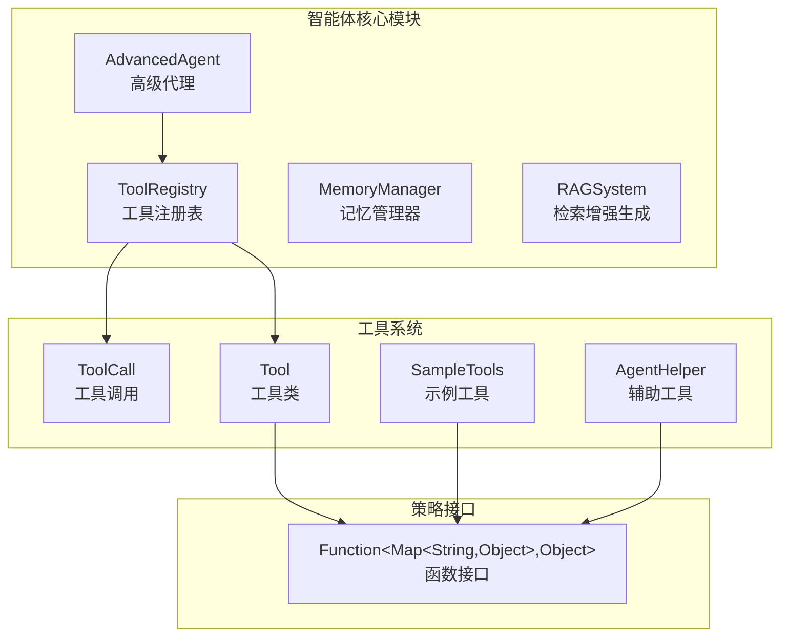
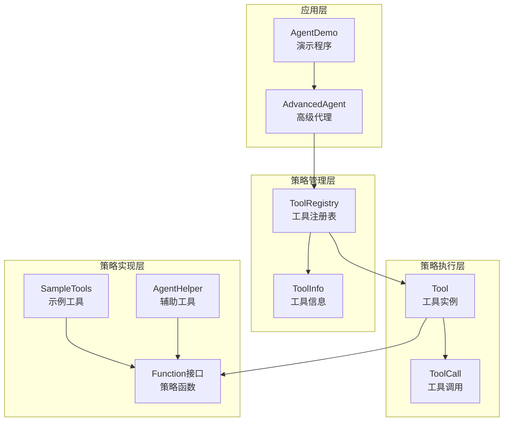
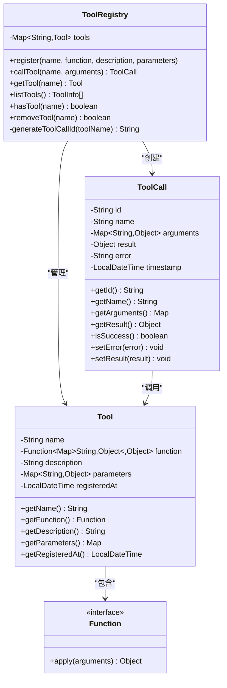
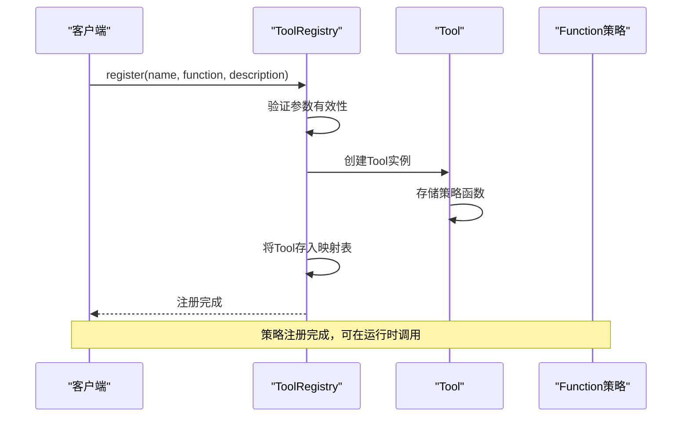
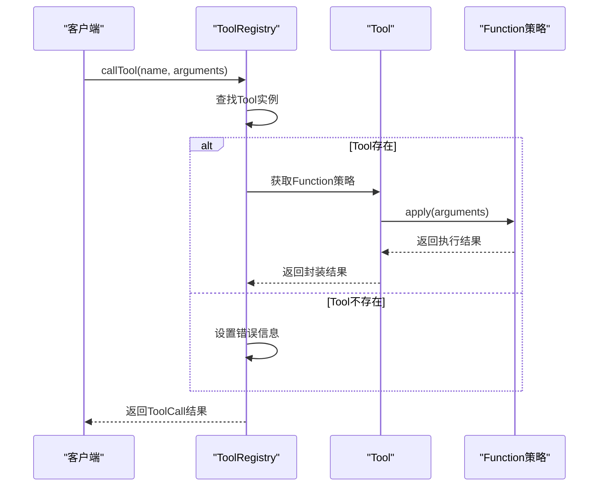

# 策略模式在TinyAI智能体工具系统中的应用实现

<cite>
**本文档中引用的文件**
- [ToolRegistry.java](file://tinyai-agent-base/src/main/java/io/leavesfly/tinyai/agent/ToolRegistry.java)
- [SampleTools.java](file://tinyai-agent-pattern/src/main/java/io/leavesfly/tinyai/agent/pattern/SampleTools.java)
- [ToolCall.java](file://tinyai-agent-base/src/main/java/io/leavesfly/tinyai/agent/ToolCall.java)
- [AdvancedAgent.java](file://tinyai-agent-base/src/main/java/io/leavesfly/tinyai/agent/AdvancedAgent.java)
- [AgentHelper.java](file://tinyai-agent-base/src/main/java/io/leavesfly/tinyai/agent/AgentHelper.java)
- [AgentDemo.java](file://tinyai-agent-base/src/main/java/io/leavesfly/tinyai/agent/AgentDemo.java)
</cite>

## 目录
1. [引言](#引言)
2. [项目结构概述](#项目结构概述)
3. [核心组件分析](#核心组件分析)
4. [架构概览](#架构概览)
5. [详细组件分析](#详细组件分析)
6. [策略模式实现详解](#策略模式实现详解)
7. [工具注册与调用流程](#工具注册与调用流程)
8. [性能考虑](#性能考虑)
9. [故障排除指南](#故障排除指南)
10. [结论](#结论)

## 引言

TinyAI项目中的策略模式在智能体工具系统中得到了巧妙的应用。该系统通过`ToolRegistry`类实现了可插拔的行为策略，使得智能体能够动态地扩展和管理各种功能工具。这种设计模式不仅提高了系统的灵活性和可扩展性，还为构建可扩展的AI代理系统提供了坚实的基础。

策略模式的核心思想是将算法或行为封装为独立的策略对象，使它们可以相互替换而不影响客户端代码。在TinyAI的智能体工具系统中，这种模式被用来实现工具的注册、管理和调用，从而支持智能体能力的动态扩展。

## 项目结构概述

TinyAI项目采用模块化架构，其中`tinyai-agent-base`模块包含了核心的智能体功能，包括工具注册表、高级代理、记忆管理等功能。整个工具系统围绕策略模式构建，实现了高度的模块化和可扩展性。



**图表来源**
- [AdvancedAgent.java](file://tinyai-agent-base/src/main/java/io/leavesfly/tinyai/agent/AdvancedAgent.java#L1-L50)
- [ToolRegistry.java](file://tinyai-agent-base/src/main/java/io/leavesfly/tinyai/agent/ToolRegistry.java#L1-L30)

## 核心组件分析

### ToolRegistry类 - 策略管理中心

`ToolRegistry`类是整个工具系统的核心，它充当策略管理器的角色，负责管理所有可用的工具策略。该类采用了工厂模式和策略模式的结合，通过`Function`接口实现了灵活的策略注册和调用机制。

```java
public class ToolRegistry {
    private final Map<String, Tool> tools;  // 注册的工具
    
    public void register(String name, Function<Map<String, Object>, Object> function, 
                        String description, Map<String, Object> parameters) {
        Tool tool = new Tool(name, function, description, parameters);
        tools.put(name, tool);
    }
}
```

### Tool类 - 策略容器

`Tool`类作为策略的容器，封装了具体的策略实现。每个工具都包含名称、函数实现、描述信息和参数规范，形成了一个完整的策略单元。

**章节来源**
- [ToolRegistry.java](file://tinyai-agent-base/src/main/java/io/leavesfly/tinyai/agent/ToolRegistry.java#L15-L60)
- [ToolRegistry.java](file://tinyai-agent-base/src/main/java/io/leavesfly/tinyai/agent/ToolRegistry.java#L149-L193)

## 架构概览

智能体工具系统采用了分层架构设计，通过策略模式实现了行为与主体的解耦。整个系统分为以下几个层次：



**图表来源**
- [AdvancedAgent.java](file://tinyai-agent-base/src/main/java/io/leavesfly/tinyai/agent/AdvancedAgent.java#L20-L40)
- [ToolRegistry.java](file://tinyai-agent-base/src/main/java/io/leavesfly/tinyai/agent/ToolRegistry.java#L15-L30)

## 详细组件分析

### ToolRegistry详细分析

`ToolRegistry`类是策略模式的核心实现，它通过以下关键方法展示了策略模式的应用：

#### 注册策略方法

```java
public void register(String name, Function<Map<String, Object>, Object> function, 
                    String description, Map<String, Object> parameters) {
    if (name == null || function == null) {
        throw new IllegalArgumentException("工具名称和函数不能为空");
    }
    
    Tool tool = new Tool(name, function, description, parameters);
    tools.put(name, tool);
}
```

这个方法展示了策略模式的核心：将具体的策略实现（`Function`接口的实现）注册到系统中，而不需要修改客户端代码。

#### 调用策略方法

```java
public ToolCall callTool(String name, Map<String, Object> arguments) {
    String toolCallId = generateToolCallId(name);
    ToolCall toolCall = new ToolCall(toolCallId, name, arguments);
    
    Tool tool = tools.get(name);
    if (tool == null) {
        toolCall.setError("工具 '" + name + "' 不存在");
        return toolCall;
    }
    
    try {
        Object result = tool.getFunction().apply(arguments != null ? arguments : new HashMap<>());
        toolCall.setResult(result);
    } catch (Exception e) {
        toolCall.setError("工具执行异常: " + e.getMessage());
    }
    
    return toolCall;
}
```

这个方法展示了策略模式的另一个关键特性：运行时动态选择和执行策略。系统根据工具名称动态查找并执行相应的策略。



**图表来源**
- [ToolRegistry.java](file://tinyai-agent-base/src/main/java/io/leavesfly/tinyai/agent/ToolRegistry.java#L15-L193)
- [ToolCall.java](file://tinyai-agent-base/src/main/java/io/leavesfly/tinyai/agent/ToolCall.java#L10-L50)

**章节来源**
- [ToolRegistry.java](file://tinyai-agent-base/src/main/java/io/leavesfly/tinyai/agent/ToolRegistry.java#L25-L100)
- [ToolCall.java](file://tinyai-agent-base/src/main/java/io/leavesfly/tinyai/agent/ToolCall.java#L1-L157)

## 策略模式实现详解

### Function接口作为策略接口

在TinyAI的工具系统中，`Function<Map<String, Object>, Object>`接口充当了策略模式的策略接口。这个接口的设计体现了函数式编程的思想，允许将任意的lambda表达式或方法引用作为策略注册。

```java
// 使用lambda表达式作为策略
registry.register("weather", args -> {
    String city = (String) args.get("city");
    return getWeather(city);
}, "查询天气信息");

// 使用方法引用作为策略
registry.register("calculator", AgentHelper::calculatorTool, 
                 "执行数学计算", calculatorParams);
```

### 策略注册过程

策略注册过程展示了策略模式的典型实现方式：



**图表来源**
- [ToolRegistry.java](file://tinyai-agent-base/src/main/java/io/leavesfly/tinyai/agent/ToolRegistry.java#L25-L40)

### 策略执行过程

策略执行过程展示了运行时动态选择和执行策略的机制：



**图表来源**
- [ToolRegistry.java](file://tinyai-agent-base/src/main/java/io/leavesfly/tinyai/agent/ToolRegistry.java#L75-L100)

### 不同类型的策略工具

系统支持多种类型的策略工具，每种工具都体现了不同的业务逻辑：

#### 数学计算策略

```java
public static Object calculatorTool(Map<String, Object> arguments) {
    try {
        String operation = (String) arguments.get("operation");
        double a = convertToDouble(arguments.get("a"));
        double b = convertToDouble(arguments.get("b"));
        
        switch (operation.toLowerCase()) {
            case "add":
                return a + b;
            case "subtract":
                return a - b;
            case "multiply":
                return a * b;
            case "divide":
                if (b == 0) throw new ArithmeticException("除零错误");
                return a / b;
        }
    } catch (Exception e) {
        return createErrorResult(e.getMessage());
    }
}
```

#### 数据查询策略

```java
public static Function<Map<String, Object>, Object> createWeatherTool() {
    return args -> {
        String city = (String) args.get("city");
        if (city == null) {
            return "天气信息: 城市名称为空";
        }
        
        Map<String, String> weatherData = new HashMap<>();
        weatherData.put("北京", "晴天，25°C");
        weatherData.put("上海", "多云，22°C");
        weatherData.put("广州", "雨天，28°C");
        
        return weatherData.getOrDefault(city, city + "天气信息暂不可用");
    };
}
```

**章节来源**
- [AgentHelper.java](file://tinyai-agent-base/src/main/java/io/leavesfly/tinyai/agent/AgentHelper.java#L150-L200)
- [SampleTools.java](file://tinyai-agent-pattern/src/main/java/io/leavesfly/tinyai/agent/pattern/SampleTools.java#L15-L50)

## 工具注册与调用流程

### 完整的工具使用示例

以下是一个完整的工具使用示例，展示了从注册到调用的完整流程：

```java
// 1. 创建工具注册表
ToolRegistry registry = new ToolRegistry();

// 2. 注册数学计算工具
Map<String, Object> params = new HashMap<>();
params.put("operation", createEnumParam("string", Arrays.asList("add", "subtract", "multiply", "divide")));
params.put("a", createNumberParam("number"));
params.put("b", createNumberParam("number"));

registry.register("calculator", AgentHelper::calculatorTool, 
                 "执行数学计算：加法、减法、乘法、除法", params);

// 3. 注册天气查询工具
registry.register("weather", SampleTools.createWeatherTool(), "查询天气信息");

// 4. 调用工具
Map<String, Object> calcArgs = new HashMap<>();
calcArgs.put("operation", "add");
calcArgs.put("a", 10);
calcArgs.put("b", 5);

ToolCall calcResult = registry.callTool("calculator", calcArgs);
System.out.println("计算结果: " + calcResult.getResult());

// 5. 调用天气工具
Map<String, Object> weatherArgs = new HashMap<>();
weatherArgs.put("city", "北京");

ToolCall weatherResult = registry.callTool("weather", weatherArgs);
System.out.println("天气结果: " + weatherResult.getResult());
```

### 异常处理机制

工具系统实现了完善的异常处理机制，确保策略执行失败时不会影响整个系统的稳定性：

```java
try {
    Object result = tool.getFunction().apply(arguments != null ? arguments : new HashMap<>());
    toolCall.setResult(result);
} catch (Exception e) {
    toolCall.setError("工具执行异常: " + e.getMessage());
}
```

### 结果封装与返回

每个工具调用都会返回一个封装的`ToolCall`对象，包含了完整的调用信息和结果：

```java
public class ToolCall {
    private String id;                      // 工具调用ID
    private String name;                    // 工具名称
    private Map<String, Object> arguments;  // 工具参数
    private Object result;                  // 执行结果
    private String error;                   // 错误信息
    private LocalDateTime timestamp;        // 时间戳
    
    public boolean isSuccess() {
        return error == null;
    }
    
    public void setError(String errorMessage) {
        this.error = errorMessage;
        this.result = null;
    }
    
    public void setResult(Object result) {
        this.result = result;
        this.error = null;
    }
}
```

**章节来源**
- [AgentDemo.java](file://tinyai-agent-base/src/main/java/io/leavesfly/tinyai/agent/AgentDemo.java#L110-L150)
- [ToolCall.java](file://tinyai-agent-base/src/main/java/io/leavesfly/tinyai/agent/ToolCall.java#L1-L157)

## 性能考虑

### 策略查找优化

工具系统采用了哈希表来存储策略，确保了O(1)时间复杂度的策略查找性能。对于高频使用的工具，系统可以通过缓存机制进一步提升性能。

### 内存管理

策略对象的生命周期由`ToolRegistry`管理，当不再需要某个策略时，可以通过`removeTool`方法及时释放内存资源。

### 并发安全

虽然当前实现不是线程安全的，但可以通过简单的同步机制或使用并发集合来支持多线程环境下的策略管理。

## 故障排除指南

### 常见问题及解决方案

#### 1. 工具不存在错误

**问题**: 调用工具时出现"工具不存在"的错误

**原因**: 工具名称拼写错误或工具未正确注册

**解决方案**: 
- 检查工具名称是否正确
- 使用`listTools()`方法查看已注册的工具列表
- 确保工具在调用前已经正确注册

#### 2. 参数类型错误

**问题**: 工具执行时出现参数类型转换异常

**原因**: 传递给工具的参数类型与预期不符

**解决方案**:
- 检查工具的参数规范
- 确保传递的参数类型正确
- 在工具内部添加参数验证逻辑

#### 3. 策略执行异常

**问题**: 工具执行过程中抛出异常

**原因**: 策略实现中的逻辑错误或外部依赖问题

**解决方案**:
- 检查策略函数的实现
- 添加适当的异常处理逻辑
- 记录详细的错误日志以便调试

**章节来源**
- [ToolRegistry.java](file://tinyai-agent-base/src/main/java/io/leavesfly/tinyai/agent/ToolRegistry.java#L75-L100)
- [ToolCall.java](file://tinyai-agent-base/src/main/java/io/leavesfly/tinyai/agent/ToolCall.java#L100-L157)

## 结论

TinyAI项目中的策略模式在智能体工具系统中的应用展现了优秀的软件设计实践。通过`ToolRegistry`类和`Function`接口的结合，系统实现了高度的灵活性和可扩展性。

### 主要优势

1. **行为与主体解耦**: 策略模式成功地将工具的行为实现与智能体主体分离，使得智能体可以专注于核心逻辑，而工具的具体实现可以独立发展。

2. **动态扩展能力**: 系统支持运行时动态注册和移除工具，无需修改现有代码即可扩展智能体的功能。

3. **类型安全**: 通过泛型和接口约束，确保了策略实现的类型安全性。

4. **易于测试**: 每个策略都是独立的单元，便于单独测试和验证。

5. **代码复用**: 通过抽象的策略接口，可以在多个场景中复用相同的策略实现。

### 应用价值

这种策略模式的实现为构建可扩展的AI代理系统提供了重要的参考价值。它不仅适用于工具系统，还可以推广到其他需要动态行为切换的场景，如不同的决策策略、算法选择、界面主题等。

通过深入理解TinyAI中策略模式的应用，开发者可以更好地掌握这一经典设计模式在现代软件架构中的实际应用，为构建更加灵活和可维护的系统奠定基础。