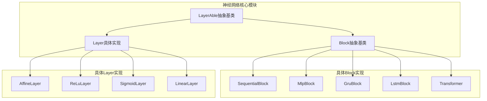
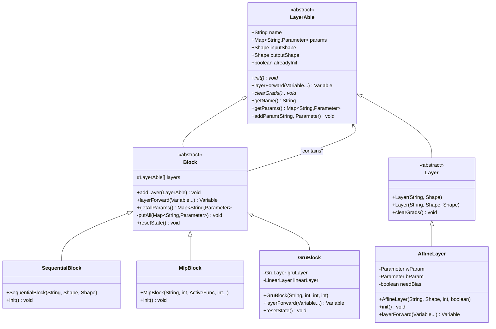
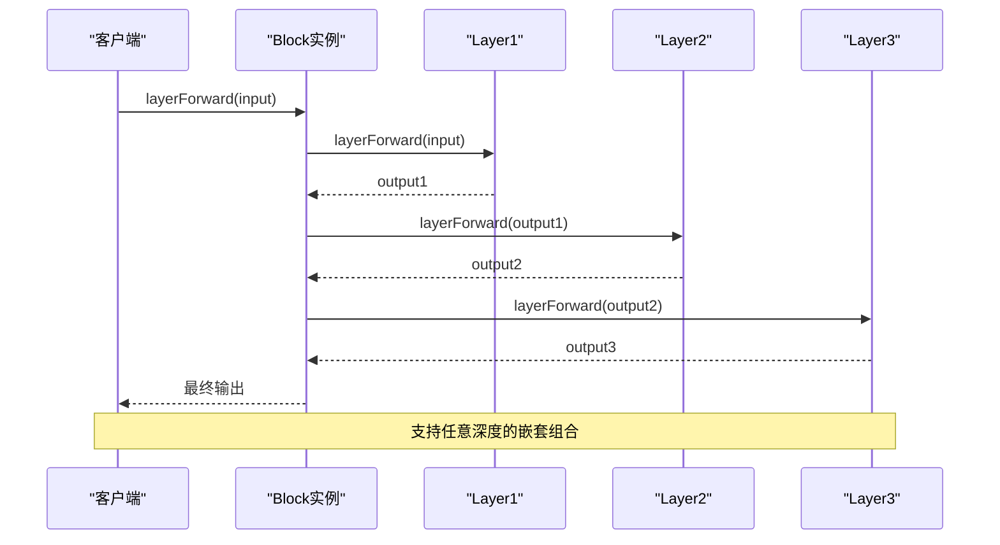
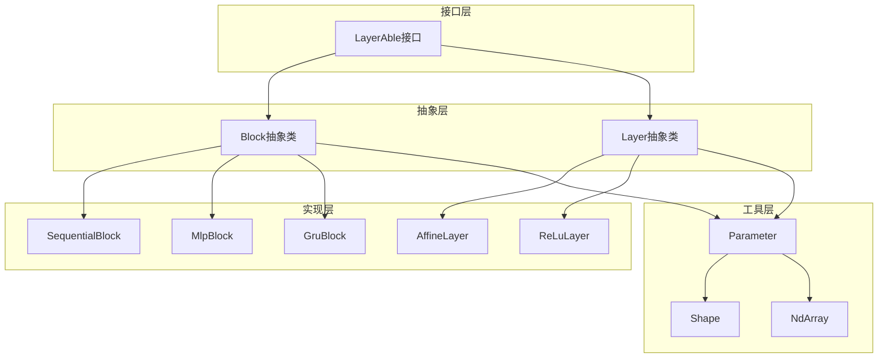

# 组合模式在TinyAI中Block类的具体实现与应用价值

<cite>
**本文档引用的文件**
- [Block.java](file://tinyai-dl-nnet/src/main/java/io/leavesfly/tinyai/nnet/Block.java)
- [LayerAble.java](file://tinyai-dl-nnet/src/main/java/io/leavesfly/tinyai/nnet/LayerAble.java)
- [Layer.java](file://tinyai-dl-nnet/src/main/java/io/leavesfly/tinyai/nnet/Layer.java)
- [SequentialBlock.java](file://tinyai-dl-nnet/src/main/java/io/leavesfly/tinyai/nnet/block/SequentialBlock.java)
- [MlpBlock.java](file://tinyai-dl-nnet/src/main/java/io/leavesfly/tinyai/nnet/block/MlpBlock.java)
- [GruBlock.java](file://tinyai-dl-nnet/src/main/java/io/leavesfly/tinyai/nnet/block/GruBlock.java)
- [LstmBlock.java](file://tinyai-dl-nnet/src/main/java/io/leavesfly/tinyai/nnet/block/LstmBlock.java)
- [AffineLayer.java](file://tinyai-dl-nnet/src/main/java/io/leavesfly/tinyai/nnet/layer/dnn/AffineLayer.java)
- [SequentialBlockTest.java](file://tinyai-dl-nnet/src/test/java/io/leavesfly/tinyai/nnet/block/SequentialBlockTest.java)
- [Transformer.java](file://tinyai-dl-nnet/src/main/java/io/leavesfly/tinyai/nnet/block/transformer/Transformer.java)
</cite>

## 目录
1. [引言](#引言)
2. [项目结构概述](#项目结构概述)
3. [核心组件分析](#核心组件分析)
4. [架构概览](#架构概览)
5. [详细组件分析](#详细组件分析)
6. [依赖关系分析](#依赖关系分析)
7. [性能考虑](#性能考虑)
8. [故障排除指南](#故障排除指南)
9. [结论](#结论)

## 引言

组合模式（Composite Pattern）是一种结构型设计模式，它允许将对象组合成树形结构以表示"部分-整体"的层次结构。在TinyAI深度学习框架中，组合模式被巧妙地应用于Block类的设计中，实现了神经网络层次化构建的核心功能。

Block类作为神经网络中用于组合多个Layer的容器类，可以包含其他Layer或Block，是构建复杂神经网络结构的基础组件。通过维护LayerAble列表实现树形结构，Block类成功地将简单层和复杂块统一为一个层次化的网络结构，大大提升了框架的可扩展性和代码复用性。

## 项目结构概述

TinyAI项目采用模块化架构，其中神经网络相关的核心功能集中在`tinyai-dl-nnet`模块中。该项目遵循分层设计原则，通过接口抽象和具体实现分离的方式，构建了一个灵活且可扩展的深度学习框架。



**图表来源**
- [LayerAble.java](file://tinyai-dl-nnet/src/main/java/io/leavesfly/tinyai/nnet/LayerAble.java#L1-L50)
- [Block.java](file://tinyai-dl-nnet/src/main/java/io/leavesfly/tinyai/nnet/Block.java#L1-L50)

**章节来源**
- [LayerAble.java](file://tinyai-dl-nnet/src/main/java/io/leavesfly/tinyai/nnet/LayerAble.java#L1-L144)
- [Block.java](file://tinyai-dl-nnet/src/main/java/io/leavesfly/tinyai/nnet/Block.java#L1-L136)

## 核心组件分析

### LayerAble抽象基类

LayerAble是所有神经网络层的抽象基类，继承自Function类，定义了神经网络层的基本接口和属性。它是组合模式的基础，为所有层和块提供了统一的接口。

```java
public abstract class LayerAble extends Function {
    protected String name;
    protected Map<String, Parameter> params;
    protected Shape inputShape;
    protected Shape outputShape;
    protected boolean alreadyInit = false;
    
    abstract public void init();
    public abstract Variable layerForward(Variable... inputs);
    public abstract void clearGrads();
}
```

### Block抽象基类

Block类继承自LayerAble，作为组合模式的核心实现。它维护一个LayerAble列表，支持动态添加子组件，并实现了统一的前向传播机制。

```java
public abstract class Block extends LayerAble {
    protected List<LayerAble> layers;
    
    public void addLayer(LayerAble layerAble) {
        layerAble.init();
        layers.add(layerAble);
    }
    
    @Override
    public Variable layerForward(Variable... inputs) {
        Variable x = inputs[0];
        Variable y = layers.get(0).layerForward(x);
        for (int i = 1; i < layers.size(); i++) {
            y = layers.get(i).layerForward(y);
        }
        return y;
    }
}
```

**章节来源**
- [LayerAble.java](file://tinyai-dl-nnet/src/main/java/io/leavesfly/tinyai/nnet/LayerAble.java#L15-L80)
- [Block.java](file://tinyai-dl-nnet/src/main/java/io/leavesfly/tinyai/nnet/Block.java#L20-L80)

## 架构概览

组合模式在TinyAI中的应用形成了一个清晰的层次化架构，从底层的具体Layer到高层的复合Block，每一层都遵循相同的接口规范，实现了高度的内聚和松耦合。



**图表来源**
- [LayerAble.java](file://tinyai-dl-nnet/src/main/java/io/leavesfly/tinyai/nnet/LayerAble.java#L15-L144)
- [Block.java](file://tinyai-dl-nnet/src/main/java/io/leavesfly/tinyai/nnet/Block.java#L20-L136)
- [Layer.java](file://tinyai-dl-nnet/src/main/java/io/leavesfly/tinyai/nnet/Layer.java#L15-L52)

## 详细组件分析

### addLayer方法的动态添加机制

addLayer方法是组合模式的核心操作之一，它负责将新的Layer或Block添加到当前Block的layers列表中。这个方法不仅简单地添加元素，还包含了重要的初始化逻辑。

```java
public void addLayer(LayerAble layerAble) {
    layerAble.init();
    layers.add(layerAble);
}
```

这个方法的关键作用在于：
1. **自动初始化**：在添加新层之前自动调用layerAble.init()，确保每个新添加的层都经过正确的初始化
2. **统一接口**：无论是Layer还是Block，都可以通过相同的接口进行添加
3. **动态构建**：支持运行时动态构建复杂的网络结构

### layerForward方法的递归调用机制

layerForward方法展示了组合模式在前向传播中的核心应用。它通过遍历layers列表，依次调用每个子组件的layerForward方法，实现了递归的前向传播。



**图表来源**
- [Block.java](file://tinyai-dl-nnet/src/main/java/io/leavesfly/tinyai/nnet/Block.java#L60-L70)

这种递归调用机制的优势：
- **透明性**：用户无需关心内部结构，只需调用顶层Block的layerForward方法
- **灵活性**：支持任意深度和宽度的网络结构
- **一致性**：无论网络多么复杂，都使用相同的调用方式

### getAllParams方法的递归参数聚合

getAllParams方法展示了组合模式在参数管理方面的强大能力。它通过递归调用，将所有子组件的参数统一收集到一个Map中。

```java
public Map<String, Parameter> getAllParams() {
    Map<String, Parameter> allParams = new HashMap<>();
    putAll(allParams);
    return allParams;
}

private void putAll(Map<String, Parameter> allParams) {
    allParams.putAll(params);
    for (LayerAble layer : layers) {
        if (layer instanceof Block) {
            allParams.putAll(((Block) layer).getAllParams());
        } else {
            allParams.putAll(layer.getParams());
        }
    }
}
```

这个方法的实现逻辑体现了组合模式的精髓：
1. **差异化处理**：对Block类型和普通Layer类型采用不同的参数收集策略
2. **递归聚合**：通过递归调用，确保所有层级的参数都被收集
3. **统一接口**：无论是单个Layer还是复杂Block，都能通过相同的接口获取参数

### 具体Block实现案例分析

#### SequentialBlock实现

SequentialBlock是最简单的组合模式实现，它严格按照添加顺序执行前向传播：

```java
public class SequentialBlock extends Block {
    public SequentialBlock(String _name, Shape _xInputShape, Shape _yOutputShape) {
        super(_name, _xInputShape, _yOutputShape);
    }
    
    @Override
    public void init() {
        // 空实现，由父类addLayer自动初始化
    }
}
```

#### MlpBlock实现

MlpBlock展示了如何利用组合模式构建复杂的网络结构：

```java
public class MlpBlock extends Block {
    public MlpBlock(String _name, int batchSize, Config.ActiveFunc _activeFunc, int... layerSizes) {
        super(_name, Shape.of(batchSize, layerSizes[0]), Shape.of(-1, layerSizes[layerSizes.length - 1]));
        
        activeFunc = _activeFunc;
        
        for (int i = 1; i < layerSizes.length - 1; i++) {
            Layer layer = new LinearLayer("layer" + i, layerSizes[i - 1], layerSizes[i], true);
            addLayer(layer);
            if (!Objects.isNull(activeFunc) && Config.ActiveFunc.ReLU.name().equals(activeFunc.name())) {
                addLayer(new ReLuLayer("ReLU"));
            } else {
                addLayer(new SigmoidLayer("Sigmoid"));
            }
        }
        // 添加输出层
        Layer layer = new LinearLayer("layer" + (layerSizes.length - 1), 
                                     layerSizes[(layerSizes.length - 2)], 
                                     layerSizes[(layerSizes.length - 1)], true);
        addLayer(layer);
    }
}
```

#### Transformer实现

Transformer展示了组合模式在复杂架构中的应用：

```java
public class Transformer extends Block {
    private Encoder encoder;
    private Decoder decoder;
    
    public Transformer(String _name, Encoder encoder, Decoder decoder) {
        super(_name, encoder.getInputShape(), decoder.getOutputShape());
        
        this.encoder = encoder;
        this.decoder = decoder;
        addLayer(encoder);
        addLayer(decoder);
    }
    
    @Override
    public Variable layerForward(Variable... inputs) {
        if (inputs.length < 2) {
            throw new IllegalArgumentException("Transformer requires at least 2 inputs");
        }
        
        Variable encoderInput = inputs[0];
        Variable decoderInput = inputs[1];
        
        // 编码器前向传播
        Variable encoderOutput = encoder.layerForward(encoderInput);
        
        // 初始化解码器状态
        decoder.initState(encoderOutput.getValue());
        
        // 解码器前向传播
        return decoder.layerForward(decoderInput, encoderOutput);
    }
}
```

**章节来源**
- [Block.java](file://tinyai-dl-nnet/src/main/java/io/leavesfly/tinyai/nnet/Block.java#L50-L136)
- [SequentialBlock.java](file://tinyai-dl-nnet/src/main/java/io/leavesfly/tinyai/nnet/block/SequentialBlock.java#L1-L33)
- [MlpBlock.java](file://tinyai-dl-nnet/src/main/java/io/leavesfly/tinyai/nnet/block/MlpBlock.java#L1-L61)
- [Transformer.java](file://tinyai-dl-nnet/src/main/java/io/leavesfly/tinyai/nnet/block/transformer/Transformer.java#L1-L168)

## 依赖关系分析

组合模式在TinyAI中的应用形成了清晰的依赖关系层次：



**图表来源**
- [LayerAble.java](file://tinyai-dl-nnet/src/main/java/io/leavesfly/tinyai/nnet/LayerAble.java#L1-L144)
- [Block.java](file://tinyai-dl-nnet/src/main/java/io/leavesfly/tinyai/nnet/Block.java#L1-L136)

这种依赖关系的设计优势：

1. **松耦合**：上层组件只依赖于抽象接口，不依赖具体实现
2. **高内聚**：每个类都有明确的职责边界
3. **可扩展性**：新增组件只需要实现相应的接口
4. **可测试性**：便于进行单元测试和集成测试

**章节来源**
- [LayerAble.java](file://tinyai-dl-nnet/src/main/java/io/leavesfly/tinyai/nnet/LayerAble.java#L1-L144)
- [Block.java](file://tinyai-dl-nnet/src/main/java/io/leavesfly/tinyai/nnet/Block.java#L1-L136)

## 性能考虑

组合模式在TinyAI中的应用虽然提供了强大的功能，但也需要考虑性能优化：

### 内存管理
- **延迟初始化**：只有在真正需要时才初始化参数和中间结果
- **内存池**：对于重复使用的中间变量，考虑使用对象池减少GC压力
- **及时释放**：在不再需要时及时释放大型张量占用的内存

### 计算优化
- **批处理**：充分利用NdArray的批处理能力，减少循环开销
- **并行化**：对于独立的子组件，考虑并行执行前向传播
- **缓存机制**：对频繁计算的结果进行缓存，避免重复计算

### 算法复杂度
- **时间复杂度**：前向传播的时间复杂度为O(n)，其中n为网络深度
- **空间复杂度**：空间复杂度主要取决于最大激活值的内存占用
- **参数数量**：参数聚合的复杂度为O(m)，其中m为总参数数量

## 故障排除指南

### 常见问题及解决方案

#### 1. 参数初始化失败
**症状**：调用addLayer时抛出初始化异常
**原因**：Layer或Block的初始化逻辑存在问题
**解决方案**：
- 检查Layer的构造函数参数是否正确
- 确保Shape对象的维度匹配
- 验证必要的依赖是否已正确设置

#### 2. 前向传播错误
**症状**：layerForward方法返回NaN或无穷大
**原因**：参数初始化不当或输入数据格式错误
**解决方案**：
- 检查参数初始化是否正常完成
- 验证输入数据的Shape是否匹配
- 使用调试工具检查中间结果

#### 3. 内存溢出
**症状**：程序运行过程中出现OutOfMemoryError
**原因**：网络过于复杂或批处理过大
**解决方案**：
- 减小批处理大小
- 优化网络结构，减少不必要的层
- 增加JVM堆内存设置

**章节来源**
- [SequentialBlockTest.java](file://tinyai-dl-nnet/src/test/java/io/leavesfly/tinyai/nnet/block/SequentialBlockTest.java#L1-L414)

## 结论

组合模式在TinyAI中Block类的实现充分展现了其在构建复杂系统中的价值。通过将简单层和复杂块统一为一个层次化的网络结构，组合模式实现了以下关键优势：

### 技术价值
1. **统一接口**：无论是单个Layer还是复杂Block，都使用相同的接口，简化了API设计
2. **递归处理**：通过递归调用，实现了对任意复杂网络结构的一致处理
3. **动态构建**：支持运行时动态构建和修改网络结构
4. **参数管理**：通过递归参数聚合，实现了统一的参数管理和优化

### 应用价值
1. **MLP网络**：MlpBlock展示了如何利用组合模式构建多层感知机
2. **RNN网络**：GruBlock和LstmBlock演示了序列模型的层次化构建
3. **Transformer架构**：Transformer展示了组合模式在现代深度学习架构中的应用
4. **模块化设计**：支持不同模块的独立开发和测试

### 设计启示
组合模式的成功应用证明了良好的软件设计原则的重要性：
- 接口抽象优于具体实现
- 递归处理优于条件分支
- 统一接口优于差异化处理
- 松耦合优于紧耦合

通过深入理解组合模式在TinyAI中的实现，开发者可以更好地设计自己的系统架构，构建更加灵活、可扩展和易于维护的软件系统。