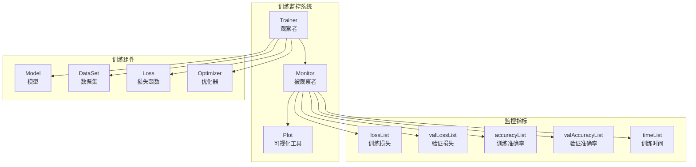
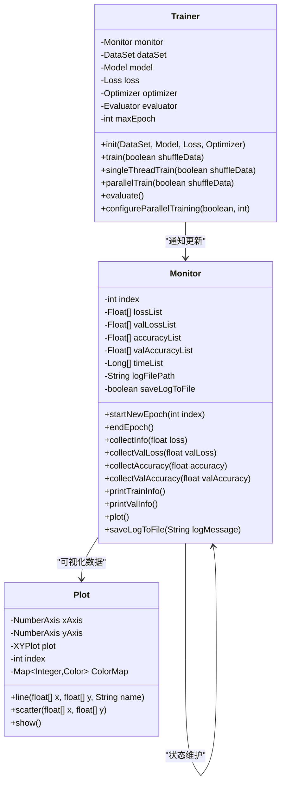
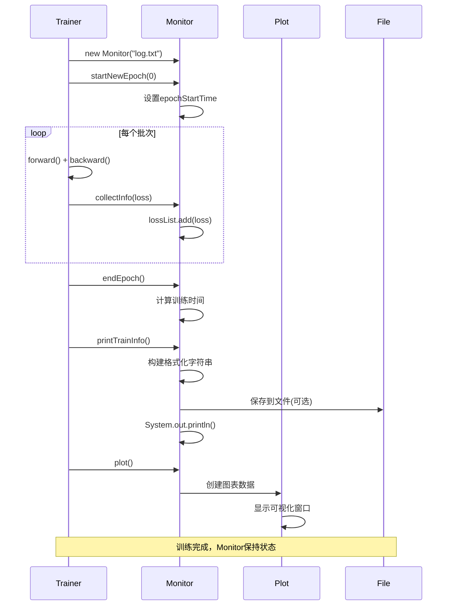

# 观察者模式在TinyAI训练监控系统中的实现原理

<cite>
**本文档引用的文件**
- [Monitor.java](file://tinyai-dl-ml/src/main/java/io/leavesfly/tinyai/ml/Monitor.java)
- [Trainer.java](file://tinyai-dl-ml/src/main/java/io/leavesfly/tinyai/ml/Trainer.java)
- [MonitorExample.java](file://tinyai-dl-case/src/main/java/io/leavesfly/tinyai/example/MonitorExample.java)
- [Plot.java](file://tinyai-dl-ml/src/main/java/io/leavesfly/tinyai/ml/Plot.java)
- [RLTrainer.java](file://tinyai-model-deepseek/src/main/java/io/leavesfly/tinyai/deepseek/r1/RLTrainer.java)
</cite>

## 目录
1. [简介](#简介)
2. [项目结构概览](#项目结构概览)
3. [核心组件分析](#核心组件分析)
4. [观察者模式架构](#观察者模式架构)
5. [详细组件分析](#详细组件分析)
6. [事件通知流程](#事件通知流程)
7. [监控策略实现](#监控策略实现)
8. [性能考虑](#性能考虑)
9. [故障排除指南](#故障排除指南)
10. [结论](#结论)

## 简介

TinyAI框架中的观察者模式实现了一个优雅的训练监控系统，其中Monitor类作为被观察者（Subject），Trainer类作为观察者（Observer）。这种设计实现了训练过程与监控逻辑的完全分离，支持多种监控策略的灵活配置和扩展。

观察者模式的核心思想是：当训练过程中的关键事件发生时（如新轮次开始、损失值更新、准确率变化等），Trainer会主动通知Monitor更新其内部状态。Monitor则负责收集、存储和可视化这些训练指标，同时支持将信息输出到控制台或保存到文件。

## 项目结构概览



**图表来源**
- [Monitor.java](file://tinyai-dl-ml/src/main/java/io/leavesfly/tinyai/ml/Monitor.java#L1-L304)
- [Trainer.java](file://tinyai-dl-ml/src/main/java/io/leavesfly/tinyai/ml/Trainer.java#L1-L495)

## 核心组件分析

### Monitor类 - 被观察者

Monitor类是观察者模式中的被观察者，负责维护训练指标的观测数据列表：

```java
public class Monitor {
    private int index;
    List<Float> lossList;
    List<Float> valLossList;
    List<Float> accuracyList;
    List<Float> valAccuracyList;
    List<Long> timeList;
    
    private long epochStartTime;
    private String logFilePath;
    private boolean saveLogToFile;
}
```

### Trainer类 - 观察者

Trainer类是观察者，负责在训练过程中主动通知Monitor更新状态：

```java
public class Trainer {
    private Monitor monitor;
    private DataSet dataSet;
    private Model model;
    private Loss loss;
    private Optimizer optimizer;
    private Evaluator evaluator;
    private int maxEpoch;
}
```

**章节来源**
- [Monitor.java](file://tinyai-dl-ml/src/main/java/io/leavesfly/tinyai/ml/Monitor.java#L30-L41)
- [Trainer.java](file://tinyai-dl-ml/src/main/java/io/leavesfly/tinyai/ml/Trainer.java#L35-L55)

## 观察者模式架构



**图表来源**
- [Monitor.java](file://tinyai-dl-ml/src/main/java/io/leavesfly/tinyai/ml/Monitor.java#L30-L304)
- [Trainer.java](file://tinyai-dl-ml/src/main/java/io/leavesfly/tinyai/ml/Trainer.java#L35-L495)
- [Plot.java](file://tinyai-dl-ml/src/main/java/io/leavesfly/tinyai/ml/Plot.java#L30-L199)

## 详细组件分析

### Monitor类详细实现

Monitor类通过以下方法实现观察者模式的核心功能：

#### 1. 状态维护方法

```java
// 开始新的训练轮次
public void startNewEpoch(int _index) {
    index = _index;
    epochStartTime = System.currentTimeMillis();
}

// 结束当前训练轮次并记录时间
public void endEpoch() {
    long epochEndTime = System.currentTimeMillis();
    timeList.add(epochEndTime - epochStartTime);
}
```

#### 2. 数据收集方法

```java
// 收集训练信息（损失值）
public void collectInfo(float loss) {
    lossList.add(loss);
}

// 收集训练准确率信息
public void collectAccuracy(float accuracy) {
    accuracyList.add(accuracy);
}

// 收集验证集损失信息
public void collectValLoss(float valLoss) {
    valLossList.add(valLoss);
}

// 收集验证集准确率信息
public void collectValAccuracy(float valAccuracy) {
    valAccuracyList.add(valAccuracy);
}
```

#### 3. 可视化输出方法

```java
// 打印训练信息
public void printTrainInfo() {
    StringBuilder sb = new StringBuilder();
    sb.append("epoch = ").append(index);
    
    if (lossList.size() > index) {
        sb.append(", loss: ").append(String.format("%.6f", lossList.get(index)));
    }
    
    if (accuracyList.size() > index) {
        sb.append(", acc: ").append(String.format("%.4f", accuracyList.get(index)));
    }
    
    if (timeList.size() > index) {
        sb.append(", time: ").append(timeList.get(index)).append("ms");
    }
    
    System.out.println(sb.toString());
    
    // 保存日志到文件
    if (saveLogToFile) {
        saveLogToFile(sb.toString());
    }
}
```

### Trainer类详细实现

Trainer类通过以下方式实现观察者模式：

#### 1. 初始化阶段

```java
public Trainer(int _maxEpoch, Monitor _monitor, Evaluator _evaluator) {
    this.maxEpoch = _maxEpoch;
    monitor = _monitor;
    evaluator = _evaluator;
    
    // 默认并行训练配置
    this.enableParallelTraining = false;
    this.parallelThreadCount = ParallelTrainingUtils.getRecommendedThreadCount(4);
}
```

#### 2. 训练过程中的通知机制

在单线程训练中：

```java
public void singleThreadTrain(boolean shuffleData) {
    DataSet trainDataSet = dataSet.getTrainDataSet();
    if (shuffleData) {
        trainDataSet.shuffle();
    }

    for (int i = 0; i < maxEpoch; i++) {
        model.resetState();
        monitor.startNewEpoch(i);  // 通知开始新轮次

        List<Batch> batches = trainDataSet.getBatches();
        float lossSum = 0f;
        float accSum = 0f;

        for (Batch batch : batches) {
            // 训练逻辑...
            lossSum += lossVariable.getValue().getNumber().floatValue();
        }
        
        monitor.collectInfo(lossSum / batches.size());  // 通知损失值更新
        monitor.endEpoch();  // 通知结束轮次
        monitor.printTrainInfo();  // 通知打印信息
    }
}
```

#### 3. 并行训练中的通知机制

```java
public void parallelTrain(boolean shuffleData) {
    // 并行训练逻辑...
    
    for (int epoch = 0; epoch < maxEpoch; epoch++) {
        long epochStartTime = System.currentTimeMillis();
        
        model.resetState();
        monitor.startNewEpoch(epoch);  // 通知开始新轮次

        // 并行处理批次...
        
        long epochEndTime = System.currentTimeMillis();
        monitor.endEpoch();  // 通知结束轮次
        monitor.printTrainInfo();  // 通知打印信息
    }
}
```

**章节来源**
- [Monitor.java](file://tinyai-dl-ml/src/main/java/io/leavesfly/tinyai/ml/Monitor.java#L60-L113)
- [Trainer.java](file://tinyai-dl-ml/src/main/java/io/leavesfly/tinyai/ml/Trainer.java#L150-L336)

## 事件通知流程



**图表来源**
- [Trainer.java](file://tinyai-dl-ml/src/main/java/io/leavesfly/tinyai/ml/Trainer.java#L150-L200)
- [Monitor.java](file://tinyai-dl-ml/src/main/java/io/leavesfly/tinyai/ml/Monitor.java#L60-L113)

### 具体事件序列

1. **初始化阶段**
   - Trainer创建Monitor实例
   - Monitor初始化数据结构

2. **训练开始阶段**
   - Trainer调用`startNewEpoch(epochIndex)`
   - Monitor记录轮次开始时间

3. **训练过程阶段**
   - Trainer遍历每个批次
   - Trainer调用`collectInfo(loss)`更新损失值
   - Trainer调用`collectAccuracy(accuracy)`更新准确率
   - Trainer调用`collectValLoss(valLoss)`更新验证损失
   - Trainer调用`collectValAccuracy(valAccuracy)`更新验证准确率

4. **轮次结束阶段**
   - Trainer调用`endEpoch()`记录训练时间
   - Trainer调用`printTrainInfo()`输出当前轮次信息

5. **训练完成阶段**
   - Trainer调用`plot()`生成可视化图表
   - Monitor保存最终状态供后续分析

**章节来源**
- [Trainer.java](file://tinyai-dl-ml/src/main/java/io/leavesfly/tinyai/ml/Trainer.java#L150-L336)
- [Monitor.java](file://tinyai-dl-ml/src/main/java/io/leavesfly/tinyai/ml/Monitor.java#L60-L113)

## 监控策略实现

### 控制台输出策略

Monitor类通过`printTrainInfo()`和`printValInfo()`方法实现控制台输出：

```java
public void printTrainInfo() {
    StringBuilder sb = new StringBuilder();
    sb.append("epoch = ").append(index);
    
    if (lossList.size() > index) {
        sb.append(", loss: ").append(String.format("%.6f", lossList.get(index)));
    }
    
    if (accuracyList.size() > index) {
        sb.append(", acc: ").append(String.format("%.4f", accuracyList.get(index)));
    }
    
    if (timeList.size() > index) {
        sb.append(", time: ").append(timeList.get(index)).append("ms");
    }
    
    System.out.println(sb.toString());
}
```

### 文件记录策略

Monitor类支持将训练信息保存到文件：

```java
private void saveLogToFile(String logMessage) {
    if (logFilePath == null || logFilePath.isEmpty()) {
        return;
    }
    
    try (FileWriter writer = new FileWriter(logFilePath, true)) {
        SimpleDateFormat sdf = new SimpleDateFormat("yyyy-MM-dd HH:mm:ss");
        String timestamp = sdf.format(new Date());
        writer.write("[" + timestamp + "] " + logMessage + "\n");
    } catch (IOException e) {
        System.err.println("保存日志到文件时出错: " + e.getMessage());
    }
}
```

### 可视化策略

Monitor类通过Plot类实现数据可视化：

```java
public void plot() {
    Plot plot = new Plot();
    int size = lossList.size();
    if (size > 0) {
        Float[] loss = lossList.toArray(new Float[0]);
        plot.line(Util.toFloat(Util.getSeq(size)), Util.toFloat(loss), "train_loss");
    }
    
    if (valLossList.size() > 0) {
        Float[] valLoss = valLossList.toArray(new Float[0]);
        plot.line(Util.toFloat(Util.getSeq(valLoss.length)), Util.toFloat(valLoss), "val_loss");
    }
    
    if (accuracyList.size() > 0) {
        Float[] acc = accuracyList.toArray(new Float[0]);
        plot.line(Util.toFloat(Util.getSeq(accuracyList.size())), Util.toFloat(acc), "train_acc");
    }
    
    if (valAccuracyList.size() > 0) {
        Float[] valAcc = valAccuracyList.toArray(new Float[0]);
        plot.line(Util.toFloat(Util.getSeq(valAccuracyList.size())), Util.toFloat(valAcc), "val_acc");
    }
    
    plot.show();
}
```

**章节来源**
- [Monitor.java](file://tinyai-dl-ml/src/main/java/io/leavesfly/tinyai/ml/Monitor.java#L115-L180)
- [Monitor.java](file://tinyai-dl-ml/src/main/java/io/leavesfly/tinyai/ml/Monitor.java#L182-L220)
- [Monitor.java](file://tinyai-dl-ml/src/main/java/io/leavesfly/tinyai/ml/Monitor.java#L222-L250)

## 性能考虑

### 内存管理

Monitor类使用ArrayList来存储训练指标，这提供了良好的随机访问性能，但需要注意内存增长：

```java
// 每个epoch都会添加新元素
this.lossList = new ArrayList<>();
this.valLossList = new ArrayList<>();
this.accuracyList = new ArrayList<>();
this.valAccuracyList = new ArrayList<>();
this.timeList = new ArrayList<>();
```

### 时间复杂度分析

- **startNewEpoch()**: O(1) - 常数时间操作
- **collectInfo()**: O(1) - 动态数组追加
- **endEpoch()**: O(1) - 计算时间差
- **printTrainInfo()**: O(n) - n为当前轮次数
- **plot()**: O(n) - 遍历所有数据点

### 并发安全

Monitor类不是线程安全的，但在单线程训练场景下足够使用。在并行训练中，Trainer确保对Monitor的访问是串行化的。

## 故障排除指南

### 常见问题及解决方案

#### 1. 监控数据为空

**问题**: Monitor没有收集到任何训练数据

**原因**: 
- Trainer未正确初始化Monitor
- 训练过程未执行

**解决方案**:
```java
// 确保Monitor正确传递给Trainer
Monitor monitor = new Monitor();
Trainer trainer = new Trainer(maxEpoch, monitor, evaluator);
trainer.init(dataSet, model, loss, optimizer);
```

#### 2. 可视化图表异常

**问题**: plot()方法抛出异常

**原因**:
- JFreeChart库缺失
- 图表窗口无法显示

**解决方案**:
```java
try {
    monitor.plot();
} catch (Exception e) {
    System.err.println("可视化失败: " + e.getMessage());
    // 使用其他方式查看数据
    System.out.println("训练损失: " + monitor.getLossList());
}
```

#### 3. 日志文件写入失败

**问题**: saveLogToFile()方法失败

**原因**:
- 文件路径无效
- 权限不足

**解决方案**:
```java
// 使用绝对路径
Monitor monitor = new Monitor("/absolute/path/training_log.txt");

// 或检查文件权限
File logFile = new File("training_log.txt");
if (!logFile.getParentFile().canWrite()) {
    System.err.println("无法写入日志文件，请检查权限");
}
```

**章节来源**
- [Monitor.java](file://tinyai-dl-ml/src/main/java/io/leavesfly/tinyai/ml/Monitor.java#L182-L220)

## 结论

TinyAI框架中的观察者模式实现展现了优秀的软件设计原则：

### 设计优势

1. **松耦合**: Trainer和Monitor之间完全解耦，可以独立演进
2. **可扩展性**: 新的监控策略可以通过继承Monitor轻松添加
3. **灵活性**: 支持多种输出方式（控制台、文件、可视化）
4. **清晰性**: 观察者模式使代码结构更加清晰易懂

### 实现特点

- **主动通知**: Trainer主动调用Monitor的方法更新状态
- **状态维护**: Monitor维护完整的训练历史数据
- **策略模式**: 支持多种监控输出策略
- **资源管理**: 提供资源清理和异常处理机制

### 应用价值

这种观察者模式的实现不仅适用于模型训练监控，还可以扩展到其他需要实时监控的场景，如：
- 实时数据分析
- 系统性能监控
- 用户行为跟踪
- 物联网设备状态监控

通过Monitor类作为被观察者，Trainer类作为观察者的松耦合设计，TinyAI框架成功地实现了训练过程与监控逻辑的分离，为构建可扩展、可维护的机器学习系统奠定了坚实基础。