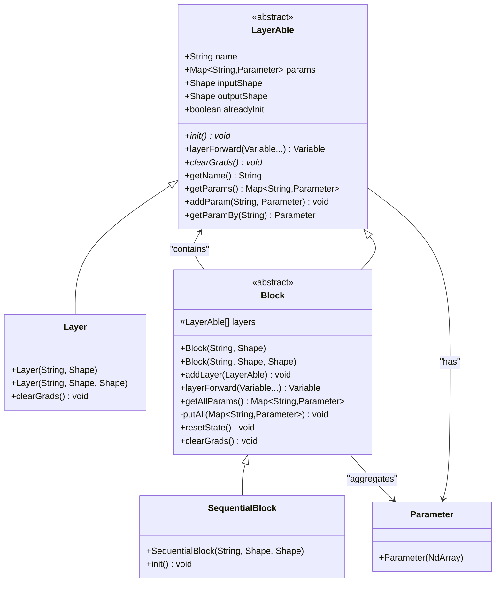
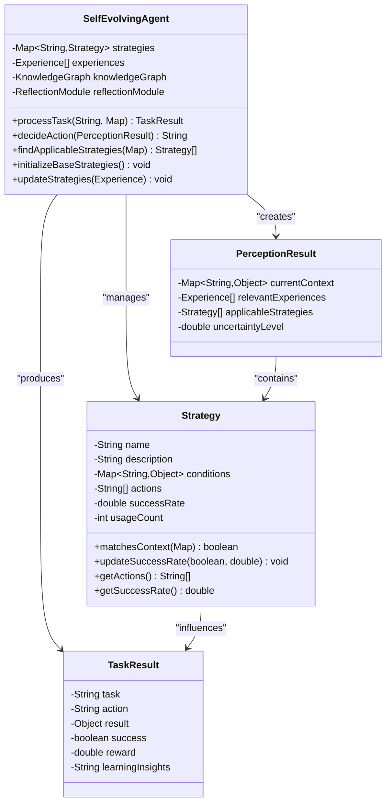
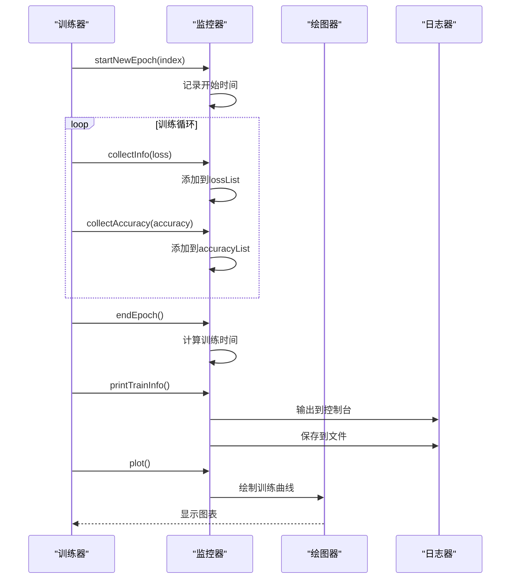
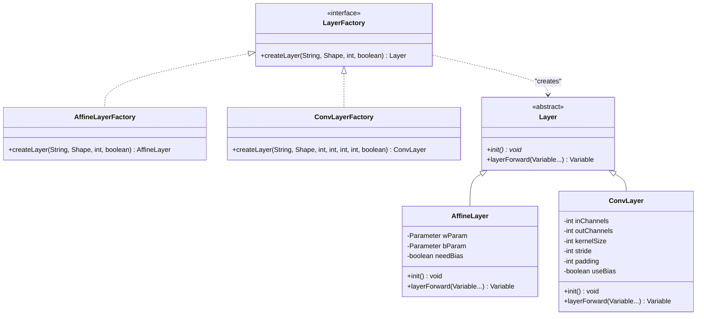
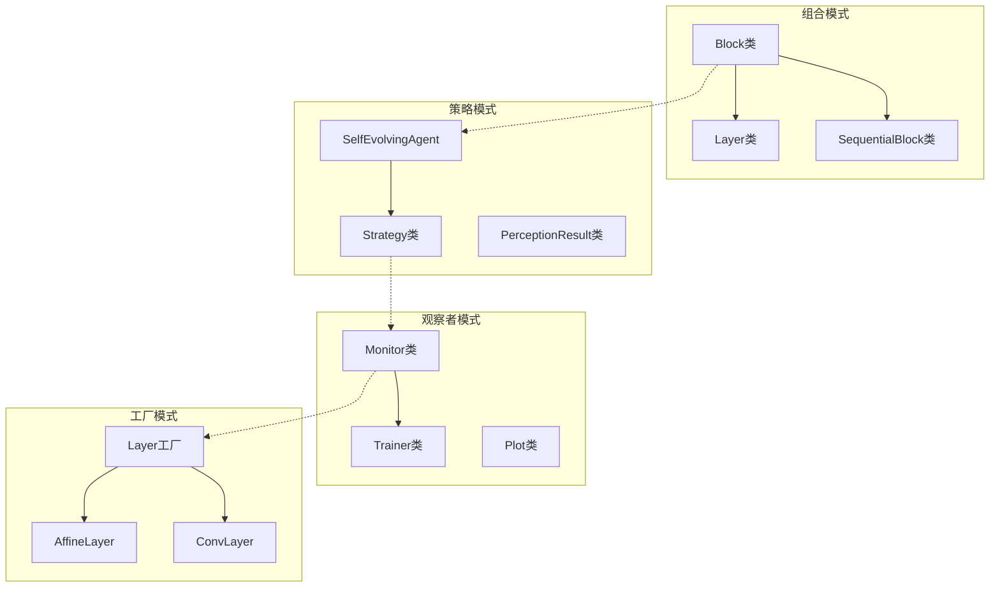

# 设计模式应用

<cite>
**本文档引用的文件**
- [Block.java](file://tinyai-dl-nnet/src/main/java/io/leavesfly/tinyai/nnet/Block.java)
- [Layer.java](file://tinyai-dl-nnet/src/main/java/io/leavesfly/tinyai/nnet/Layer.java)
- [LayerAble.java](file://tinyai-dl-nnet/src/main/java/io/leavesfly/tinyai/nnet/LayerAble.java)
- [Parameter.java](file://tinyai-dl-nnet/src/main/java/io/leavesfly/tinyai/nnet/Parameter.java)
- [Monitor.java](file://tinyai-dl-ml/src/main/java/io/leavesfly/tinyai/ml/Monitor.java)
- [AdvancedAgent.java](file://tinyai-agent-base/src/main/java/io/leavesfly/tinyai/agent/AdvancedAgent.java)
- [SelfEvolvingAgent.java](file://tinyai-agent-evol/src/main/java/io/leavesfly/tinyai/agent/evol/SelfEvolvingAgent.java)
- [MessageBus.java](file://tinyai-agent-multi/src/main/java/io/leavesfly/tinyai/agent/multi/MessageBus.java)
- [AffineLayer.java](file://tinyai-dl-nnet/src/main/java/io/leavesfly/tinyai/nnet/layer/dnn/AffineLayer.java)
- [SequentialBlock.java](file://tinyai-dl-nnet/src/main/java/io/leavesfly/tinyai/nnet/block/SequentialBlock.java)
- [Strategy.java](file://tinyai-agent-evol/src/main/java/io/leavesfly/tinyai/agent/evol/Strategy.java)
</cite>

## 目录
1. [简介](#简介)
2. [组合模式在Block类层次结构中的应用](#组合模式在block类层次结构中的应用)
3. [策略模式在智能体系统中的实现](#策略模式在智能体系统中的实现)
4. [观察者模式在Monitor监控系统中的应用](#观察者模式在monitor监控系统中的应用)
5. [工厂模式在Layer创建过程中的使用](#工厂模式在layer创建过程中的使用)
6. [设计模式综合分析](#设计模式综合分析)
7. [结论](#结论)

## 简介

TinyAI框架中广泛应用了多种设计模式，这些模式不仅提升了代码的可维护性和可扩展性，还为复杂的机器学习系统提供了清晰的架构指导。本文档深入分析了四种主要设计模式在TinyAI中的具体应用：组合模式、策略模式、观察者模式和工厂模式。

## 组合模式在Block类层次结构中的应用

### 模式概述

组合模式允许将对象组合成树形结构以表示"部分-整体"的层次结构。这种模式使得客户端可以统一处理单个对象和组合对象。

### 在TinyAI中的实现

在TinyAI的神经网络模块中，组合模式被广泛应用于Block类层次结构中，用于管理Layer和Block的层次关系。



**图表来源**
- [LayerAble.java](file://tinyai-dl-nnet/src/main/java/io/leavesfly/tinyai/nnet/LayerAble.java#L1-L144)
- [Layer.java](file://tinyai-dl-nnet/src/main/java/io/leavesfly/tinyai/nnet/Layer.java#L1-L52)
- [Block.java](file://tinyai-dl-nnet/src/main/java/io/leavesfly/tinyai/nnet/Block.java#L1-L136)
- [SequentialBlock.java](file://tinyai-dl-nnet/src/main/java/io/leavesfly/tinyai/nnet/block/SequentialBlock.java#L1-L32)

### 核心实现细节

#### 1. 父Block管理子Layer/Block

Block类通过`layers`字段管理其包含的所有子Layer和Block：

```java
protected List<LayerAble> layers;

public void addLayer(LayerAble layerAble) {
    layerAble.init();
    layers.add(layerAble);
}
```

#### 2. 参数聚合机制

Block类实现了递归的参数聚合机制：

```java
private void putAll(Map<String, Parameter> allParams) {
    allParams.putAll(params);
    for (LayerAble layer : layers) {
        if (layer instanceof Block) {
            allParams.putAll(((Block) layer).getAllParams());
        } else {
            allParams.putAll(layer.getParams());
        }
    }
}
```

#### 3. 前向传播流程

Block类实现了统一的前向传播逻辑：

```java
@Override
public Variable layerForward(Variable... inputs) {
    Variable x = inputs[0];
    Variable y = layers.get(0).layerForward(x);
    for (int i = 1; i < layers.size(); i++) {
        y = layers.get(i).layerForward(y);
    }
    return y;
}
```

**章节来源**
- [Block.java](file://tinyai-dl-nnet/src/main/java/io/leavesfly/tinyai/nnet/Block.java#L40-L136)

### 应用价值

1. **统一接口**：为单个Layer和复合Block提供统一的操作接口
2. **递归处理**：支持任意深度的嵌套结构
3. **参数管理**：自动聚合所有层级的参数
4. **状态管理**：统一管理所有子组件的状态

## 策略模式在智能体系统中的实现

### 模式概述

策略模式定义了一系列算法，将每个算法封装起来，并使它们可以相互替换。策略模式让算法的变化独立于使用算法的客户。

### 在TinyAI中的实现

在SelfEvolvingAgent中，策略模式被用来管理不同的行为策略，这些策略根据环境条件选择合适的行动方案。



**图表来源**
- [SelfEvolvingAgent.java](file://tinyai-agent-evol/src/main/java/io/leavesfly/tinyai/agent/evol/SelfEvolvingAgent.java#L1-L729)
- [Strategy.java](file://tinyai-agent-evol/src/main/java/io/leavesfly/tinyai/agent/evol/Strategy.java#L244-L286)

### 核心实现细节

#### 1. 策略定义

Strategy类封装了特定的决策规则：

```java
public class Strategy {
    private String name;
    private String description;
    private Map<String, Object> conditions;
    private List<String> actions;
    private double successRate;
    private int usageCount;
    
    public boolean matchesContext(Map<String, Object> context) {
        // 检查上下文是否满足策略条件
        for (Map.Entry<String, Object> condition : conditions.entrySet()) {
            if (!context.containsKey(condition.getKey()) || 
                !condition.getValue().equals(context.get(condition.getKey()))) {
                return false;
            }
        }
        return true;
    }
}
```

#### 2. 动态策略选择

```java
public String decideAction(PerceptionResult perception) {
    List<Strategy> applicableStrategies = perception.getApplicableStrategies();
    List<Experience> relevantExperiences = perception.getRelevantExperiences();
    
    if (!applicableStrategies.isEmpty() && Math.random() > explorationRate) {
        Strategy bestStrategy = applicableStrategies.get(0);
        List<String> actions = bestStrategy.getActions();
        return actions.get((int) (Math.random() * actions.size()));
    } else {
        // 探索逻辑...
    }
}
```

#### 3. 策略学习和优化

```java
private void updateStrategies(Experience experience) {
    String taskType = experience.getTask().contains(":") ? 
                     experience.getTask().split(":")[0] : experience.getTask();
    String strategyName = "策略_" + taskType + "_" + experience.getAction();
    
    Strategy strategy = strategies.get(strategyName);
    if (strategy != null) {
        strategy.updateSuccessRate(experience.isSuccess(), learningRate);
    } else {
        // 创建新策略...
    }
}
```

**章节来源**
- [SelfEvolvingAgent.java](file://tinyai-agent-evol/src/main/java/io/leavesfly/tinyai/agent/evol/SelfEvolvingAgent.java#L215-L729)

### 应用价值

1. **行为多样性**：支持多种不同的行为策略
2. **自适应学习**：根据经验动态调整策略
3. **条件匹配**：基于环境条件选择合适策略
4. **性能优化**：优先使用成功率高的策略

## 观察者模式在Monitor监控系统中的应用

### 模式概述

观察者模式定义了一种一对多的依赖关系，当一个对象的状态发生改变时，所有依赖于它的对象都会得到通知并自动更新。

### 在TinyAI中的实现

Monitor类作为观察者，监控训练过程中的各种指标变化，并提供相应的反馈机制。



**图表来源**
- [Monitor.java](file://tinyai-dl-ml/src/main/java/io/leavesfly/tinyai/ml/Monitor.java#L43-L303)

### 核心实现细节

#### 1. 指标收集机制

Monitor类维护多个指标列表：

```java
private List<Float> lossList;
private List<Float> valLossList;
private List<Float> accuracyList;
private List<Float> valAccuracyList;
private List<Long> timeList;
```

#### 2. 实时数据收集

```java
public void collectInfo(float loss) {
    lossList.add(loss);
}

public void collectValLoss(float valLoss) {
    valLossList.add(valLoss);
}

public void collectAccuracy(float accuracy) {
    accuracyList.add(accuracy);
}

public void collectValAccuracy(float valAccuracy) {
    valAccuracyList.add(valAccuracy);
}
```

#### 3. 实时通知机制

```java
public void printTrainInfo() {
    StringBuilder sb = new StringBuilder();
    sb.append("epoch = ").append(index);
    
    if (lossList.size() > index) {
        sb.append(", loss: ").append(String.format("%.6f", lossList.get(index)));
    }
    
    if (accuracyList.size() > index) {
        sb.append(", acc: ").append(String.format("%.4f", accuracyList.get(index)));
    }
    
    if (timeList.size() > index) {
        sb.append(", time: ").append(timeList.get(index)).append("ms");
    }
    
    System.out.println(sb.toString());
    
    if (saveLogToFile) {
        saveLogToFile(sb.toString());
    }
}
```

#### 4. 可视化支持

```java
public void plot() {
    Plot plot = new Plot();
    int size = lossList.size();
    if (size > 0) {
        Float[] loss = lossList.toArray(new Float[0]);
        plot.line(Util.toFloat(Util.getSeq(size)), Util.toFloat(loss), "train_loss");
    }
    
    if (valLossList.size() > 0) {
        Float[] valLoss = valLossList.toArray(new Float[0]);
        plot.line(Util.toFloat(Util.getSeq(valLoss.length)), Util.toFloat(valLoss), "val_loss");
    }
    
    plot.show();
}
```

**章节来源**
- [Monitor.java](file://tinyai-dl-ml/src/main/java/io/leavesfly/tinyai/ml/Monitor.java#L43-L303)

### 应用价值

1. **实时监控**：及时获取训练状态信息
2. **多维度反馈**：支持损失、准确率、时间等多种指标
3. **可视化支持**：提供图形化展示界面
4. **日志持久化**：支持训练过程的长期跟踪

## 工厂模式在Layer创建过程中的使用

### 模式概述

工厂模式提供了一种创建对象的最佳方式。当一个类不知道它所必须创建的对象的类的时候，或者一个类希望由它的子类来指定它所创建的对象的时候，工厂模式就显得特别有用。

### 在TinyAI中的实现

在TinyAI中，工厂模式体现在Layer的创建和初始化过程中，通过配置参数动态生成不同类型的神经网络层。



**图表来源**
- [AffineLayer.java](file://tinyai-dl-nnet/src/main/java/io/leavesfly/tinyai/nnet/layer/dnn/AffineLayer.java#L1-L89)

### 核心实现细节

#### 1. 参数驱动的层创建

```java
public AffineLayer(String _name, Shape _inputShape, int hiddenCol, boolean _needBias) {
    super(_name, _inputShape, Shape.of(_inputShape.getRow(), hiddenCol));
    needBias = _needBias;
    init();
}
```

#### 2. 自动初始化机制

```java
@Override
public void init() {
    if (!alreadyInit) {
        NdArray initWeight = NdArray.likeRandomN(Shape.of(inputShape.getColumn(), outputShape.getColumn()))
                .mulNum(Math.sqrt((double) 1 / inputShape.getColumn()));
        
        wParam = new Parameter(initWeight);
        wParam.setName("w");
        addParam(wParam.getName(), wParam);
        
        if (needBias) {
            bParam = new Parameter(NdArray.zeros(Shape.of(1, outputShape.getColumn())));
            bParam.setName("b");
            addParam(bParam.getName(), bParam);
        }
        alreadyInit = true;
    }
}
```

#### 3. 动态层组合

在MlpBlock中展示了工厂模式的实际应用：

```java
public MlpBlock(String _name, int batchSize, int[] layerSizes, ActiveFunc _activeFunc) {
    super(_name, Shape.of(batchSize, layerSizes[0]), Shape.of(-1, layerSizes[layerSizes.length - 1]));
    
    activeFunc = _activeFunc;
    
    for (int i = 1; i < layerSizes.length - 1; i++) {
        Layer layer = new LinearLayer("layer" + i, layerSizes[i - 1], layerSizes[i], true);
        addLayer(layer);
        if (!Objects.isNull(activeFunc) && Config.ActiveFunc.ReLU.name().equals(activeFunc.name())) {
            addLayer(new ReLuLayer("ReLU"));
        } else {
            addLayer(new SigmoidLayer("Sigmoid"));
        }
    }
    Layer layer = new LinearLayer("layer" + (layerSizes.length - 1), 
                                  layerSizes[(layerSizes.length - 2)], 
                                  layerSizes[(layerSizes.length - 1)], true);
    addLayer(layer);
}
```

**章节来源**
- [AffineLayer.java](file://tinyai-dl-nnet/src/main/java/io/leavesfly/tinyai/nnet/layer/dnn/AffineLayer.java#L40-L89)
- [MlpBlock.java](file://tinyai-dl-nnet/src/main/java/io/leavesfly/tinyai/nnet/block/MlpBlock.java#L38-L60)

### 应用价值

1. **参数化配置**：通过配置参数动态创建不同类型的层
2. **类型安全**：确保创建的层符合预期的接口规范
3. **简化使用**：隐藏复杂的初始化过程
4. **扩展性**：易于添加新的层类型

## 设计模式综合分析

### 模式间的关系



### 设计模式的价值体现

1. **可扩展性**
   - 组合模式支持任意深度的网络结构
   - 策略模式允许动态添加新的行为策略
   - 工厂模式便于扩展新的层类型

2. **可维护性**
   - 统一的接口设计降低了维护成本
   - 分离的关注点提高了代码的清晰度
   - 模块化的设计便于单独测试和调试

3. **灵活性**
   - 观察者模式实现了松耦合的监控系统
   - 策略模式支持运行时的行为切换
   - 组合模式提供了灵活的结构组织方式

## 结论

TinyAI框架中的设计模式应用展现了现代软件架构设计的最佳实践。通过组合模式、策略模式、观察者模式和工厂模式的有机结合，TinyAI实现了：

1. **高度模块化**的架构设计，各组件职责明确
2. **强大的可扩展性**，支持新功能的无缝集成
3. **优秀的可维护性**，降低开发和维护成本
4. **灵活的配置能力**，适应不同的应用场景

这些设计模式不仅解决了当前的技术挑战，也为未来的功能扩展奠定了坚实的基础。对于开发者而言，理解这些模式的应用有助于更好地使用TinyAI框架，并在自己的项目中借鉴这些设计思想。

通过深入分析这些设计模式的具体实现，我们可以看到它们在解决复杂系统架构问题方面的强大威力，以及在提升软件质量和开发效率方面的显著效果。