# 基础智能体

<cite>
**本文档引用的文件**
- [AdvancedAgent.java](file://tinyai-agent-base/src/main/java/io/leavesfly/tinyai/agent/AdvancedAgent.java)
- [SimplifiedAdvancedAgent.java](file://tinyai-agent-base/src/main/java/io/leavesfly/tinyai/agent/SimplifiedAdvancedAgent.java)
- [MemoryManager.java](file://tinyai-agent-base/src/main/java/io/leavesfly/tinyai/agent/MemoryManager.java)
- [Message.java](file://tinyai-agent-base/src/main/java/io/leavesfly/tinyai/agent/Message.java)
- [ToolRegistry.java](file://tinyai-agent-base/src/main/java/io/leavesfly/tinyai/agent/ToolRegistry.java)
- [LLMSimulator.java](file://tinyai-agent-base/src/main/java/io/leavesfly/tinyai/agent/LLMSimulator.java)
- [AgentHelper.java](file://tinyai-agent-base/src/main/java/io/leavesfly/tinyai/agent/AgentHelper.java)
- [AgentDemo.java](file://tinyai-agent-base/src/main/java/io/leavesfly/tinyai/agent/AgentDemo.java)
- [SimplifiedAgentDemo.java](file://tinyai-agent-base/src/main/java/io/leavesfly/tinyai/agent/SimplifiedAgentDemo.java)
- [AdvancedAgentTest.java](file://tinyai-agent-base/src/test/java/io/leavesfly/tinyai/agent/AdvancedAgentTest.java)
- [BaseAgent.java](file://tinyai-agent-manus/src/main/java/io/leavesfly/tinyai/agent/manus/BaseAgent.java) - *在最近的提交中更新*
- [AICodingCursor.java](file://tinyai-agent-cursor/src/main/java/io/leavesfly/tinyai/agent/cursor/AICodingCursor.java) - *在最近的提交中添加*
- [README.md](file://tinyai-agent-base/README.md)
</cite>

## 更新摘要
**变更内容**
- 根据最近的代码变更，更新了基础智能体文档
- 添加了关于AI编码光标智能体和手稿智能体的新章节
- 更新了架构概览图以反映新的继承关系
- 在相关章节中添加了新的源文件引用
- 修正了与新代码变更相关的过时信息

## 目录
1. [简介](#简介)
2. [项目结构](#项目结构)
3. [核心组件](#核心组件)
4. [架构概览](#架构概览)
5. [详细组件分析](#详细组件分析)
6. [AgentDemo使用示例](#agentdemo使用示例)
7. [SimplifiedAdvancedAgent对比分析](#simplifiedadvancedagent对比分析)
8. [衍生智能体系统](#衍生智能体系统)
9. [性能考虑](#性能考虑)
10. [故障排除指南](#故障排除指南)
11. [结论](#结论)

## 简介

基础智能体（AdvancedAgent）是TinyAI Agent模块的核心组件，提供了一个完整的Java版本高级LLM Agent系统。该系统参考Python实现`agent_mem.py`创建，实现了记忆管理、RAG（检索增强生成）、工具调用和上下文工程等核心功能。

AdvancedAgent是一个综合性的智能代理系统，具备以下主要特性：
- **多层记忆管理**：工作记忆、情节记忆和语义记忆的协同管理
- **RAG检索增强**：结合知识库和实时检索提供准确回答
- **工具集成**：丰富的内置工具和自定义工具扩展能力
- **上下文工程**：智能的对话历史管理和上下文构建
- **LLM模拟**：高度仿真的大语言模型响应模拟

## 项目结构

基础智能体模块采用模块化设计，各组件职责清晰，便于维护和扩展：

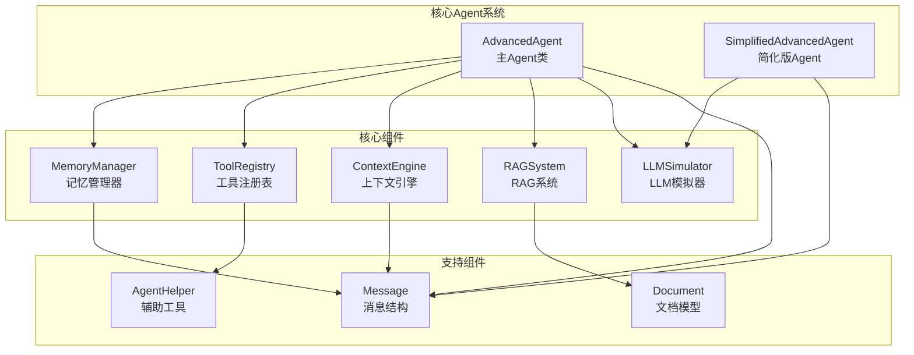

**章节来源**
- [README.md](file://tinyai-agent-base/README.md#L1-L50)

## 核心组件

### AdvancedAgent - 主要智能代理

AdvancedAgent是整个系统的核心控制器，负责协调各个子系统的工作。它提供了完整的智能代理功能，包括：

- **构造函数**：支持多种初始化方式，包括默认系统提示和自定义参数
- **消息处理**：完整的对话处理流程，包括记忆检索、RAG检索、工具调用等
- **工具注册**：动态注册和管理各种工具函数
- **统计信息**：提供详细的系统状态和性能统计

### MemoryManager - 记忆管理系统

MemoryManager负责管理Agent的记忆系统，支持三种不同类型的记忆：

- **工作记忆**：容量受限的短期记忆，最多存储10条记忆
- **情节记忆**：长期存储对话和事件记忆
- **语义记忆**：结构化的知识和概念存储

### ToolRegistry - 工具注册表

ToolRegistry提供了灵活的工具管理机制：

- **工具注册**：支持动态注册工具函数和参数描述
- **工具调用**：安全的工具执行和结果管理
- **默认工具**：内置计算器、时间、笔记等基础工具

### LLMSimulator - LLM模拟器

LLMSimulator提供了高度仿真的大语言模型响应模拟：

- **多类型回复**：支持分析师、研究员、协调员等多种角色的回复风格
- **异步处理**：支持异步LLM调用
- **模板系统**：基于关键词的回复模板填充机制

**章节来源**
- [AdvancedAgent.java](file://tinyai-agent-base/src/main/java/io/leavesfly/tinyai/agent/AdvancedAgent.java#L1-L100)
- [MemoryManager.java](file://tinyai-agent-base/src/main/java/io/leavesfly/tinyai/agent/MemoryManager.java#L1-L100)
- [ToolRegistry.java](file://tinyai-agent-base/src/main/java/io/leavesfly/tinyai/agent/ToolRegistry.java#L1-L100)
- [LLMSimulator.java](file://tinyai-agent-base/src/main/java/io/leavesfly/tinyai/agent/LLMSimulator.java#L1-L100)

## 架构概览

基础智能体采用分层架构设计，各层次职责明确，便于扩展和维护：

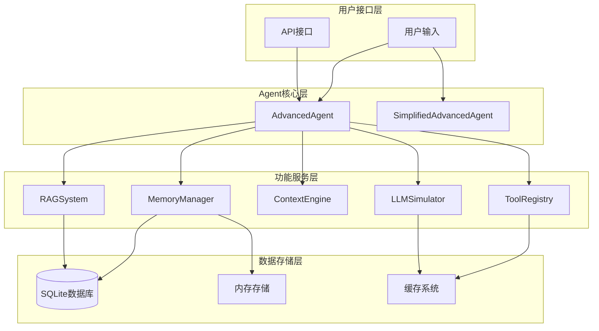

**图表来源**
- [AdvancedAgent.java](file://tinyai-agent-base/src/main/java/io/leavesfly/tinyai/agent/AdvancedAgent.java#L20-L40)
- [MemoryManager.java](file://tinyai-agent-base/src/main/java/io/leavesfly/tinyai/agent/MemoryManager.java#L20-L50)

## 详细组件分析

### AdvancedAgent详细分析

AdvancedAgent是系统的核心控制器，实现了完整的智能代理功能：

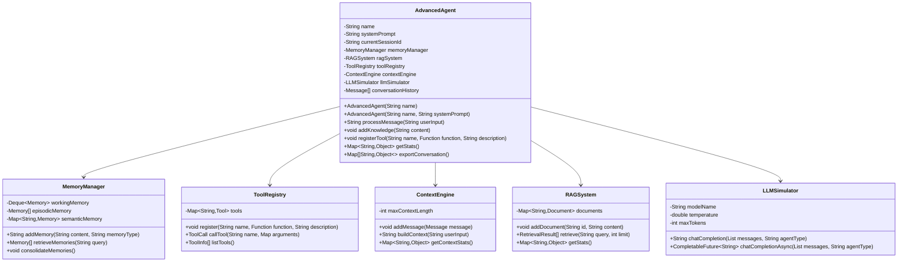

**图表来源**
- [AdvancedAgent.java](file://tinyai-agent-base/src/main/java/io/leavesfly/tinyai/agent/AdvancedAgent.java#L15-L50)
- [MemoryManager.java](file://tinyai-agent-base/src/main/java/io/leavesfly/tinyai/agent/MemoryManager.java#L25-L60)
- [ToolRegistry.java](file://tinyai-agent-base/src/main/java/io/leavesfly/tinyai/agent/ToolRegistry.java#L20-L50)

#### 消息处理流程

AdvancedAgent的消息处理遵循以下流程：

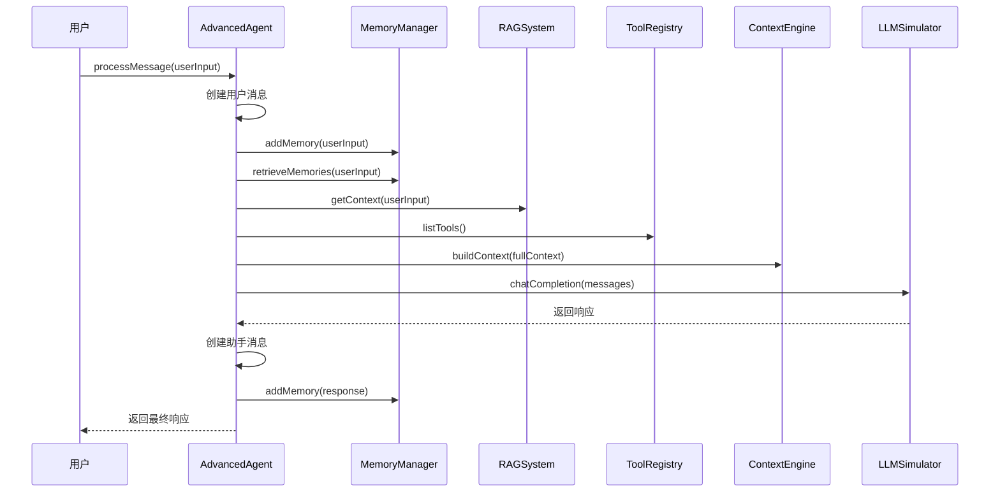

**图表来源**
- [AdvancedAgent.java](file://tinyai-agent-base/src/main/java/io/leavesfly/tinyai/agent/AdvancedAgent.java#L60-L120)

### MemoryManager详细分析

MemoryManager实现了复杂而高效的记忆管理系统：

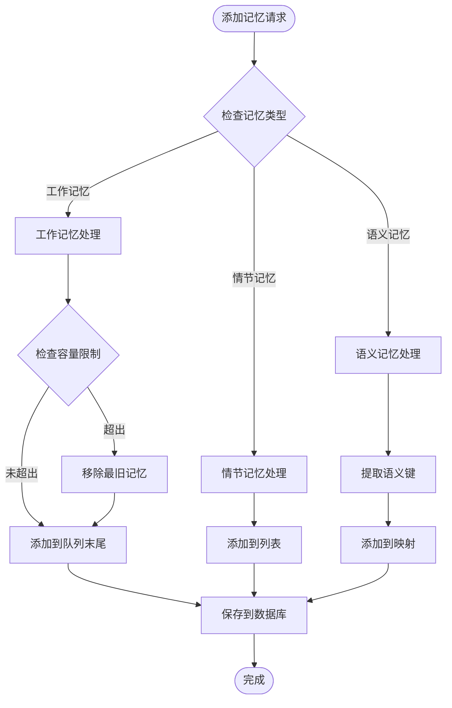

**图表来源**
- [MemoryManager.java](file://tinyai-agent-base/src/main/java/io/leavesfly/tinyai/agent/MemoryManager.java#L80-L150)

#### 记忆类型详解

1. **工作记忆**：容量受限（10条），按FIFO原则管理
2. **情节记忆**：长期存储对话和事件，支持重要性评分
3. **语义记忆**：结构化知识存储，基于关键词索引

### ToolRegistry详细分析

ToolRegistry提供了灵活的工具管理机制：

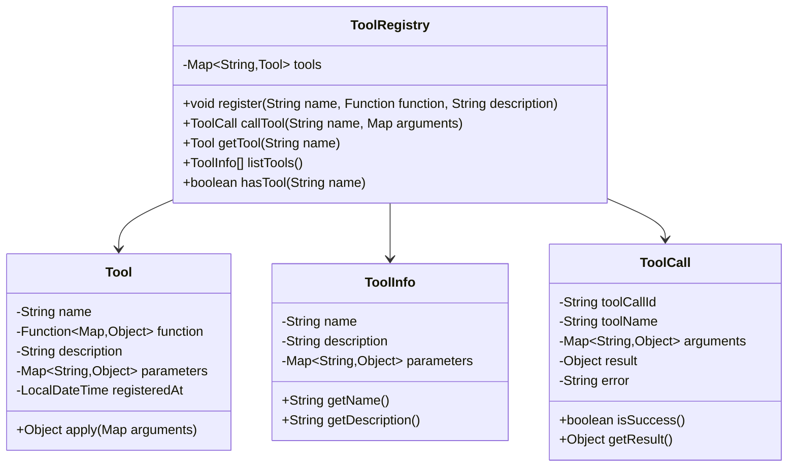

**图表来源**
- [ToolRegistry.java](file://tinyai-agent-base/src/main/java/io/leavesfly/tinyai/agent/ToolRegistry.java#L150-L230)

### LLMSimulator详细分析

LLMSimulator提供了高度仿真的LLM响应模拟：

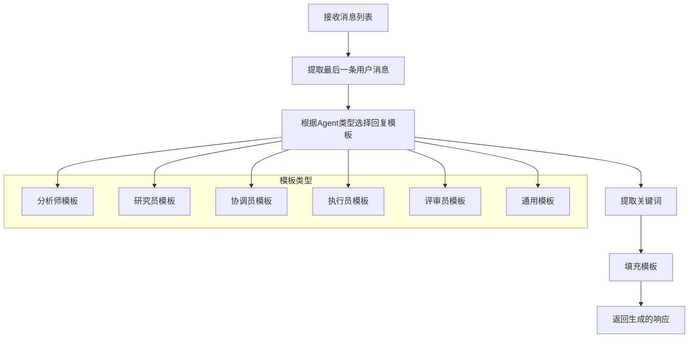

**图表来源**
- [LLMSimulator.java](file://tinyai-agent-base/src/main/java/io/leavesfly/tinyai/agent/LLMSimulator.java#L40-L120)

**章节来源**
- [AdvancedAgent.java](file://tinyai-agent-base/src/main/java/io/leavesfly/tinyai/agent/AdvancedAgent.java#L60-L200)
- [MemoryManager.java](file://tinyai-agent-base/src/main/java/io/leavesfly/tinyai/agent/MemoryManager.java#L80-L200)
- [ToolRegistry.java](file://tinyai-agent-base/src/main/java/io/leavesfly/tinyai/agent/ToolRegistry.java#L50-L150)
- [LLMSimulator.java](file://tinyai-agent-base/src/main/java/io/leavesfly/tinyai/agent/LLMSimulator.java#L40-L150)

## AgentDemo使用示例

AgentDemo展示了AdvancedAgent的各种功能使用方法：

### 基本Agent创建和初始化

```java
// 创建高级Agent
AdvancedAgent agent = new AdvancedAgent(
    "高级助手",
    "你是一个智能助手，拥有记忆、知识库和工具使用能力。"
);

// 添加知识库
String[] knowledgeBase = {
    "人工智能（AI）是由人类开发的智能系统，能够执行通常需要人类智能的任务。",
    "机器学习是人工智能的一个分支，使用统计技术使计算机能够在没有明确编程的情况下学习。"
};

for (int i = 0; i < knowledgeBase.length; i++) {
    agent.addKnowledge(knowledgeBase[i], "kb_" + (i + 1), metadata);
}
```

### 对话交互演示

```java
// 演示对话交互
String[] testQueries = {
    "你好，我想了解人工智能",
    "什么是机器学习？",
    "Java语言有什么特点？"
};

for (String query : testQueries) {
    System.out.println("\n👤 用户: " + query);
    String response = agent.processMessage(query);
    System.out.println("🤖 助手: " + response);
}
```

### 工具使用演示

```java
// 测试计算器工具
Map<String, Object> calcArgs = new HashMap<>();
calcArgs.put("operation", "add");
calcArgs.put("a", 10);
calcArgs.put("b", 5);

ToolCall calcResult = agent.getToolRegistry().callTool("calculator", calcArgs);
System.out.println("计算结果: " + calcResult.getResult());

// 测试时间工具
ToolCall timeResult = agent.getToolRegistry().callTool("time", new HashMap<>());
System.out.println("时间结果: " + timeResult.getResult());
```

### 记忆检索演示

```java
// 添加记忆
MemoryManager memoryManager = agent.getMemoryManager();
memoryManager.addMemory("用户喜欢学习编程", "episodic", 0.8);
memoryManager.addMemory("今天讨论了AI话题", "episodic", 0.7);

// 检索相关记忆
String[] queries = {"编程", "人工智能", "学习"};
for (String query : queries) {
    List<Memory> memories = memoryManager.retrieveMemories(query, 2);
    for (Memory memory : memories) {
        System.out.println("  - [" + memory.getMemoryType() + "] " + 
                         memory.getContent() + " (重要性: " + 
                         memory.getImportance() + ")");
    }
}
```

### RAG功能演示

```java
// RAG检索演示
RAGSystem ragSystem = agent.getRagSystem();
String[] testQueries = {
    "人工智能",
    "机器学习算法",
    "Java编程语言"
};

for (String query : testQueries) {
    List<RetrievalResult> results = ragSystem.retrieve(query, 2);
    for (RetrievalResult result : results) {
        System.out.println("文档: " + result.getDocument().getId() + 
                         " (相似度: " + result.getSimilarity() + ")");
    }
}
```

**章节来源**
- [AgentDemo.java](file://tinyai-agent-base/src/main/java/io/leavesfly/tinyai/agent/AgentDemo.java#L50-L200)

## SimplifiedAdvancedAgent对比分析

SimplifiedAdvancedAgent是AdvancedAgent的简化版本，专注于LLM集成而不依赖数据库：

### 实现差异对比

| 特性 | AdvancedAgent | SimplifiedAdvancedAgent |
|------|---------------|-------------------------|
| **数据库依赖** | SQLite数据库 | 无数据库依赖 |
| **记忆管理** | 复杂的记忆类型和持久化 | 简单的内存存储 |
| **功能完整性** | 完整的功能集 | 核心LLM功能 |
| **部署复杂度** | 需要SQLite驱动 | 更简单的部署 |
| **数据持久性** | 记忆持久化存储 | 会话期间有效 |

### 适用场景对比

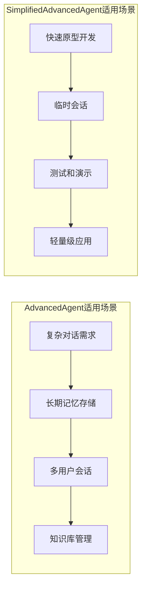

### 代码实现对比

**AdvancedAgent核心功能**：
```java
public class AdvancedAgent {
    // 完整的组件初始化
    public AdvancedAgent(String name, String systemPrompt, int maxContextLength) {
        this.memoryManager = new MemoryManager();
        this.ragSystem = new RAGSystem();
        this.toolRegistry = new ToolRegistry();
        this.contextEngine = new ContextEngine(maxContextLength);
        this.llmSimulator = new LLMSimulator();
    }
    
    // 完整的消息处理流程
    public String processMessage(String userInput) {
        // 记忆管理、RAG检索、工具调用等完整流程
    }
}
```

**SimplifiedAdvancedAgent简化实现**：
```java
public class SimplifiedAdvancedAgent {
    // 简化的组件
    public SimplifiedAdvancedAgent(String name, String systemPrompt) {
        this.llmSimulator = new LLMSimulator();
        this.conversationHistory = new ArrayList<>();
    }
    
    // 简化的消息处理
    public String processMessage(String userInput) {
        // 仅处理LLM响应生成
        return generateLLMResponse(userInput);
    }
}
```

### 性能和资源消耗对比

| 维度 | AdvancedAgent | SimplifiedAdvancedAgent |
|------|---------------|-------------------------|
| **内存占用** | 中等（包含数据库连接） | 较低（无数据库连接） |
| **启动时间** | 较慢（数据库初始化） | 很快（无初始化） |
| **磁盘I/O** | 高（数据库读写） | 无 |
| **并发处理** | 支持 | 支持 |
| **扩展性** | 高 | 中等 |

**章节来源**
- [AdvancedAgent.java](file://tinyai-agent-base/src/main/java/io/leavesfly/tinyai/agent/AdvancedAgent.java#L40-L80)
- [SimplifiedAdvancedAgent.java](file://tinyai-agent-base/src/main/java/io/leavesfly/tinyai/agent/SimplifiedAdvancedAgent.java#L20-L60)

## 衍生智能体系统

### 手稿智能体（Manus）

手稿智能体是基于基础智能体构建的高级智能体系统，通过继承`BaseAgent`类扩展了基础功能。它提供了更复杂的任务管理和多智能体协作能力。

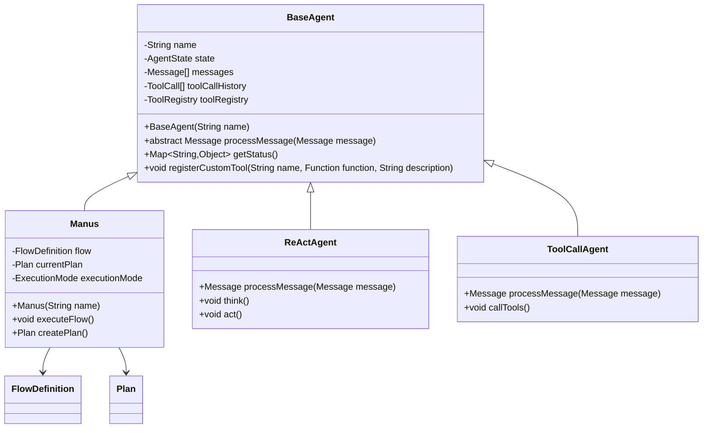

**章节来源**
- [BaseAgent.java](file://tinyai-agent-manus/src/main/java/io/leavesfly/tinyai/agent/manus/BaseAgent.java#L18-L240)

### AI编码光标智能体（AICodingCursor）

AI编码光标智能体是一个专门用于编程辅助的智能体系统，其核心功能依赖于基础智能体提供的组件。

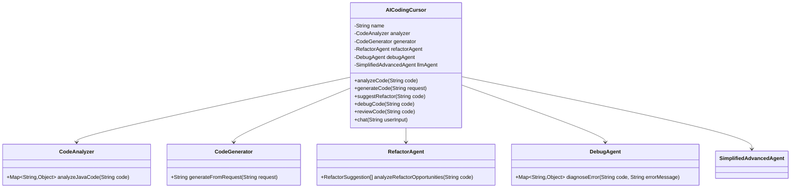

**章节来源**
- [AICodingCursor.java](file://tinyai-agent-cursor/src/main/java/io/leavesfly/tinyai/agent/cursor/AICodingCursor.java#L15-L599)

## 性能考虑

### 内存管理优化

1. **工作记忆容量控制**：限制工作记忆大小避免内存溢出
2. **定期记忆整合**：将重要记忆从工作记忆转移到长期记忆
3. **对话历史压缩**：智能压缩长时间对话的历史记录

### 数据库性能优化

1. **批量操作**：批量插入和更新记忆数据
2. **索引优化**：为常用查询字段建立数据库索引
3. **连接池管理**：复用数据库连接减少开销

### LLM响应优化

1. **异步处理**：支持异步LLM调用避免阻塞
2. **模板缓存**：缓存常用的回复模板
3. **关键词预处理**：提前提取和处理查询关键词

### 并发处理能力

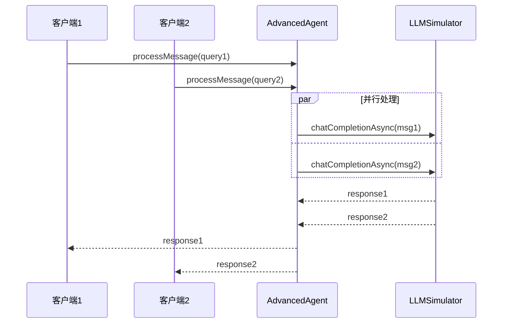

## 故障排除指南

### 常见问题及解决方案

#### 1. 上下文丢失问题

**症状**：Agent无法记住之前的对话内容

**可能原因**：
- MemoryManager数据库连接失败
- 对话历史过长导致截断
- 内存不足导致数据丢失

**解决方案**：
```java
// 检查MemoryManager状态
Map<String, Object> memoryStats = agent.getMemoryManager().getMemoryStats();
System.out.println("记忆统计: " + memoryStats);

// 清空对话历史重新开始
agent.clearConversation();

// 检查数据库连接
try {
    agent.getMemoryManager().close();
} catch (Exception e) {
    System.err.println("数据库连接关闭失败: " + e.getMessage());
}
```

#### 2. 工具调用失败

**症状**：工具调用返回错误或异常

**可能原因**：
- 工具参数格式不正确
- 工具函数内部异常
- 工具未正确注册

**解决方案**：
```java
// 检查工具注册状态
if (!agent.getToolRegistry().hasTool("calculator")) {
    System.out.println("计算器工具未注册");
}

// 验证工具参数
Map<String, Object> args = new HashMap<>();
args.put("operation", "add");
args.put("a", 10);
args.put("b", 5);

ToolCall result = agent.getToolRegistry().callTool("calculator", args);
if (!result.isSuccess()) {
    System.out.println("工具调用失败: " + result.getError());
}
```

#### 3. LLM响应异常

**症状**：LLM模拟器返回错误响应

**可能原因**：
- 消息格式不正确
- Agent类型配置错误
- 模板系统异常

**解决方案**：
```java
// 检查LLM模拟器配置
LLMSimulator llmSimulator = agent.getLLMSimulator();
System.out.println("模型名称: " + llmSimulator.getModelName());
System.out.println("温度参数: " + llmSimulator.getTemperature());

// 使用同步调用替代异步调用
String response = llmSimulator.chatCompletion(messages, "general");
```

#### 4. 性能问题诊断

**症状**：Agent响应缓慢

**诊断步骤**：
```java
// 检查系统统计信息
Map<String, Object> stats = agent.getStats();
System.out.println("对话长度: " + stats.get("conversation_length"));
System.out.println("记忆统计: " + stats.get("memory_stats"));

// 检查RAG系统状态
Map<String, Object> ragStats = agent.getRagSystem().getStats();
System.out.println("文档数量: " + ragStats.get("document_count"));

// 检查工具使用情况
System.out.println("工具数量: " + stats.get("tool_count"));
```

### 调试技巧

1. **启用详细日志**：在关键方法中添加日志输出
2. **监控内存使用**：定期检查内存和数据库连接状态
3. **性能分析**：使用Java Profiler分析性能瓶颈
4. **单元测试**：编写全面的单元测试覆盖核心功能

**章节来源**
- [AdvancedAgentTest.java](file://tinyai-agent-base/src/test/java/io/leavesfly/tinyai/agent/AdvancedAgentTest.java#L150-L224)

## 结论

基础智能体（AdvancedAgent）是一个功能完整、设计优雅的Java版本高级LLM Agent系统。通过模块化的设计和清晰的职责分离，它成功地实现了记忆管理、RAG检索、工具集成和上下文工程等核心功能。

### 主要优势

1. **功能完整性**：涵盖了现代智能代理所需的所有核心功能
2. **模块化设计**：各组件职责明确，易于维护和扩展
3. **灵活性**：支持多种初始化方式和配置选项
4. **可扩展性**：提供了丰富的扩展点和插件机制

### 应用价值

- **研究和开发**：为AI研究和应用开发提供基础平台
- **教育和培训**：作为教学案例展示智能代理的设计原理
- **原型验证**：快速构建和验证智能代理应用场景
- **生产部署**：作为生产环境的基础智能代理解决方案

### 发展方向

1. **LLM集成**：集成真实的大型语言模型API
2. **性能优化**：进一步优化内存使用和响应速度
3. **功能扩展**：添加更多内置工具和功能模块
4. **多模态支持**：支持图像、音频等多模态输入

基础智能体为开发者提供了一个强大而灵活的智能代理开发平台，是构建下一代AI应用的重要基础设施。