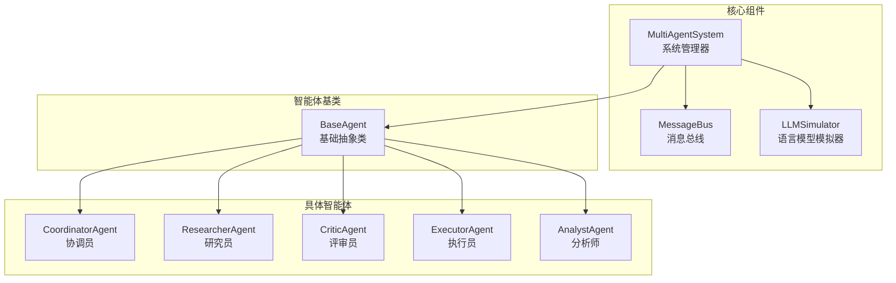
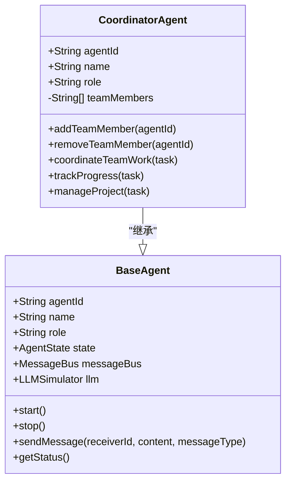
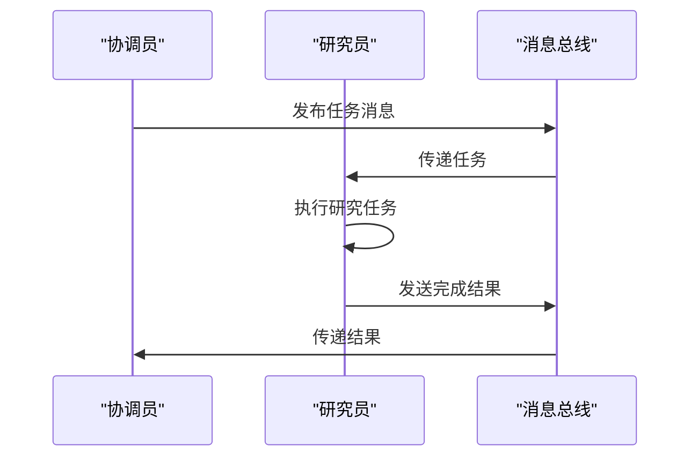
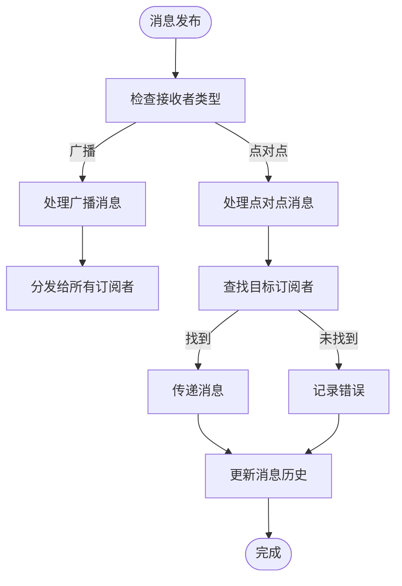
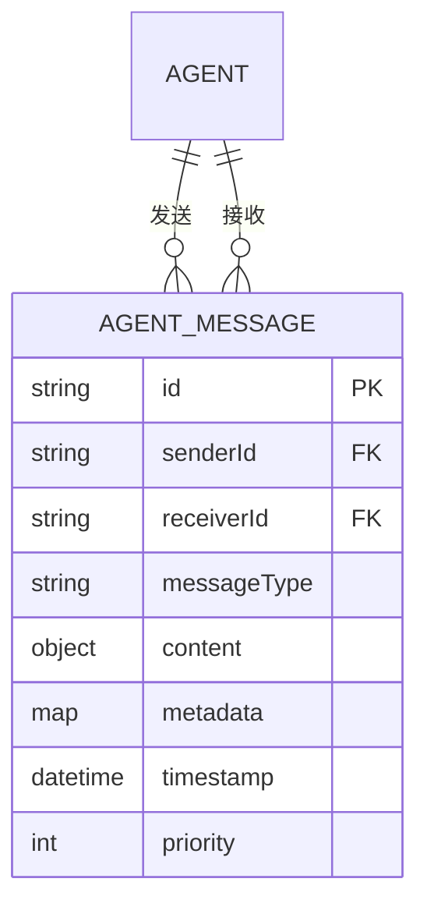
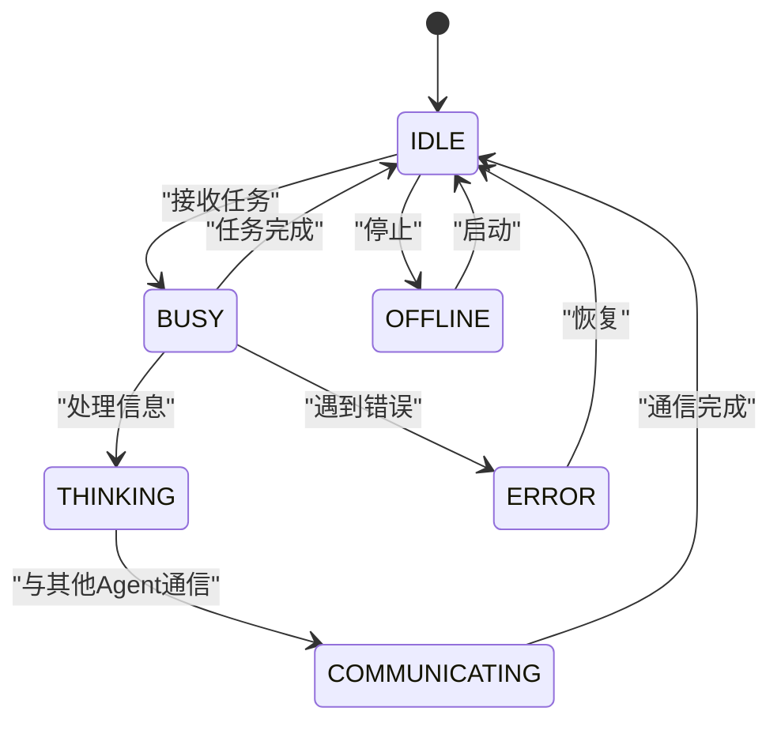
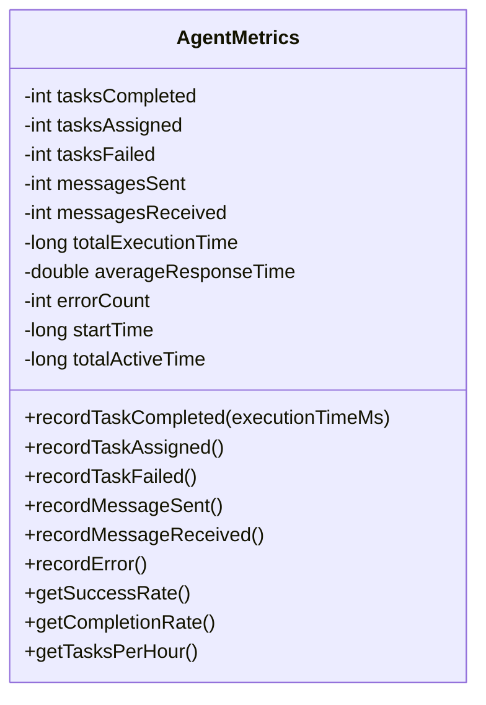
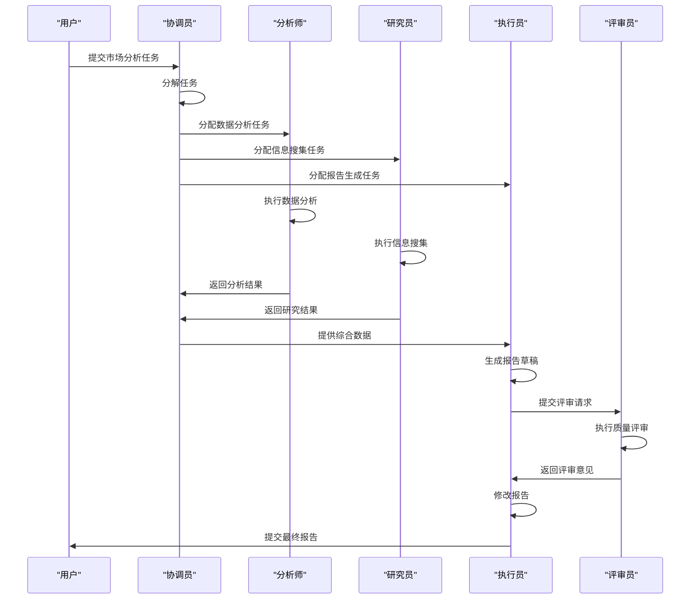
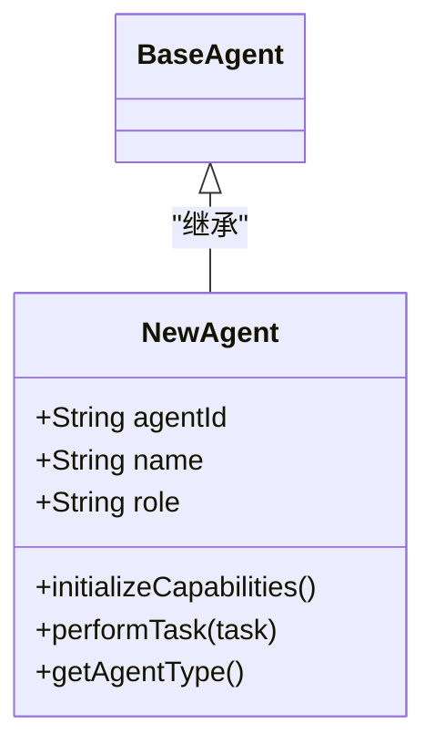

# 多智能体系统

<cite>
**本文档引用的文件**
- [MultiAgentSystem.java](file://tinyai-agent-multi/src/main/java/io/leavesfly/tinyai/agent/multi/MultiAgentSystem.java)
- [MessageBus.java](file://tinyai-agent-multi/src/main/java/io/leavesfly/tinyai/agent/multi/MessageBus.java)
- [AgentMessage.java](file://tinyai-agent-multi/src/main/java/io/leavesfly/tinyai/agent/multi/AgentMessage.java)
- [BaseAgent.java](file://tinyai-agent-multi/src/main/java/io/leavesfly/tinyai/agent/multi/BaseAgent.java)
- [CoordinatorAgent.java](file://tinyai-agent-multi/src/main/java/io/leavesfly/tinyai/agent/multi/CoordinatorAgent.java)
- [ResearcherAgent.java](file://tinyai-agent-multi/src/main/java/io/leavesfly/tinyai/agent/multi/ResearcherAgent.java)
- [CriticAgent.java](file://tinyai-agent-multi/src/main/java/io/leavesfly/tinyai/agent/multi/CriticAgent.java)
- [ExecutorAgent.java](file://tinyai-agent-multi/src/main/java/io/leavesfly/tinyai/agent/multi/ExecutorAgent.java)
- [AnalystAgent.java](file://tinyai-agent-multi/src/main/java/io/leavesfly/tinyai/agent/multi/AnalystAgent.java)
- [AgentState.java](file://tinyai-agent-multi/src/main/java/io/leavesfly/tinyai/agent/multi/AgentState.java)
- [TaskStatus.java](file://tinyai-agent-multi/src/main/java/io/leavesfly/tinyai/agent/multi/TaskStatus.java)
- [AgentMetrics.java](file://tinyai-agent-multi/src/main/java/io/leavesfly/tinyai/agent/multi/AgentMetrics.java)
- [MultiAgentDemo.java](file://tinyai-agent-multi/src/main/java/io/leavesfly/tinyai/agent/multi/MultiAgentDemo.java)
</cite>

## 目录
1. [简介](#简介)
2. [核心架构](#核心架构)
3. [角色分工与协作](#角色分工与协作)
4. [消息传递机制](#消息传递机制)
5. [状态与性能管理](#状态与性能管理)
6. [系统演示](#系统演示)
7. [扩展指南](#扩展指南)
8. [结论](#结论)

## 简介

多智能体系统（MultiAgentSystem）是一个基于角色分工的协作架构，旨在通过多个专业化智能体（Agent）的协同工作来解决复杂任务。系统采用模块化设计，每个智能体具有明确的职责和能力，通过统一的消息总线进行通信和协调。该系统支持灵活的任务分配、团队协作和性能监控，能够有效处理如市场分析报告生成等复杂任务。

**本节不分析具体源文件，因此不提供来源**

## 核心架构

多智能体系统的核心架构由`MultiAgentSystem`类管理，它负责协调多个智能体的工作。系统通过`MessageBus`实现智能体间的通信，使用`LLMSimulator`作为底层语言模型支持。每个智能体都继承自`BaseAgent`抽象类，实现了统一的接口和行为规范。

**图示来源**
- [MultiAgentSystem.java](file://tinyai-agent-multi/src/main/java/io/leavesfly/tinyai/agent/multi/MultiAgentSystem.java)
- [MessageBus.java](file://tinyai-agent-multi/src/main/java/io/leavesfly/tinyai/agent/multi/MessageBus.java)
- [BaseAgent.java](file://tinyai-agent-multi/src/main/java/io/leavesfly/tinyai/agent/multi/BaseAgent.java)

**本节来源**
- [MultiAgentSystem.java](file://tinyai-agent-multi/src/main/java/io/leavesfly/tinyai/agent/multi/MultiAgentSystem.java#L1-L378)
- [BaseAgent.java](file://tinyai-agent-multi/src/main/java/io/leavesfly/tinyai/agent/multi/BaseAgent.java#L1-L473)

## 角色分工与协作

多智能体系统采用基于角色的分工模式，每个智能体都有特定的职责和专长领域。这种设计使得系统能够高效地分解和处理复杂任务。

### 协调员智能体

`CoordinatorAgent`负责任务分解、进度跟踪和团队协调。它作为团队的领导者，接收复杂任务并将其分解为子任务分配给其他智能体。

**图示来源**
- [CoordinatorAgent.java](file://tinyai-agent-multi/src/main/java/io/leavesfly/tinyai/agent/multi/CoordinatorAgent.java#L15-L45)
- [BaseAgent.java](file://tinyai-agent-multi/src/main/java/io/leavesfly/tinyai/agent/multi/BaseAgent.java#L15-L80)

**本节来源**
- [CoordinatorAgent.java](file://tinyai-agent-multi/src/main/java/io/leavesfly/tinyai/agent/multi/CoordinatorAgent.java#L1-L215)

### 研究员智能体

`ResearcherAgent`专注于信息搜集和理论分析，擅长文献调研、实验设计和学术写作。

**图示来源**
- [ResearcherAgent.java](file://tinyai-agent-multi/src/main/java/io/leavesfly/tinyai/agent/multi/ResearcherAgent.java#L15-L45)
- [MessageBus.java](file://tinyai-agent-multi/src/main/java/io/leavesfly/tinyai/agent/multi/MessageBus.java#L10-L30)

**本节来源**
- [ResearcherAgent.java](file://tinyai-agent-multi/src/main/java/io/leavesfly/tinyai/agent/multi/ResearcherAgent.java#L1-L173)

### 评审员智能体

`CriticAgent`负责结果评估和质量控制，提供改进建议和标准制定。

**本节来源**
- [CriticAgent.java](file://tinyai-agent-multi/src/main/java/io/leavesfly/tinyai/agent/multi/CriticAgent.java#L1-L217)

### 执行员智能体

`ExecutorAgent`负责执行具体操作和任务实现，擅长工具使用和结果报告。

**本节来源**
- [ExecutorAgent.java](file://tinyai-agent-multi/src/main/java/io/leavesfly/tinyai/agent/multi/ExecutorAgent.java#L1-L168)

### 分析师智能体

`AnalystAgent`专注于数据分析、趋势预测和报告生成，提供数据驱动的洞察。

**本节来源**
- [AnalystAgent.java](file://tinyai-agent-multi/src/main/java/io/leavesfly/tinyai/agent/multi/AnalystAgent.java#L1-L162)

## 消息传递机制

多智能体系统通过`MessageBus`实现智能体间的通信，支持点对点消息和广播消息两种模式。

### 消息总线设计

`MessageBus`类负责管理所有智能体的订阅和消息分发，采用异步处理机制确保高性能。

**图示来源**
- [MessageBus.java](file://tinyai-agent-multi/src/main/java/io/leavesfly/tinyai/agent/multi/MessageBus.java#L1-L291)

**本节来源**
- [MessageBus.java](file://tinyai-agent-multi/src/main/java/io/leavesfly/tinyai/agent/multi/MessageBus.java#L1-L291)

### 消息协议

`AgentMessage`类定义了智能体间通信的协议，包含消息头、内容和元数据。

**图示来源**
- [AgentMessage.java](file://tinyai-agent-multi/src/main/java/io/leavesfly/tinyai/agent/multi/AgentMessage.java#L15-L45)

**本节来源**
- [AgentMessage.java](file://tinyai-agent-multi/src/main/java/io/leavesfly/tinyai/agent/multi/AgentMessage.java#L1-L146)

## 状态与性能管理

系统通过`AgentState`和`TaskStatus`枚举管理智能体和任务的状态，通过`AgentMetrics`类监控性能指标。

### 状态管理

**图示来源**
- [AgentState.java](file://tinyai-agent-multi/src/main/java/io/leavesfly/tinyai/agent/multi/AgentState.java#L15-L45)

**本节来源**
- [AgentState.java](file://tinyai-agent-multi/src/main/java/io/leavesfly/tinyai/agent/multi/AgentState.java#L1-L66)
- [TaskStatus.java](file://tinyai-agent-multi/src/main/java/io/leavesfly/tinyai/agent/multi/TaskStatus.java#L1-L61)

### 性能监控

`AgentMetrics`类跟踪智能体的关键性能指标，包括任务完成情况、消息统计和响应时间。

**图示来源**
- [AgentMetrics.java](file://tinyai-agent-multi/src/main/java/io/leavesfly/tinyai/agent/multi/AgentMetrics.java#L15-L45)

**本节来源**
- [AgentMetrics.java](file://tinyai-agent-multi/src/main/java/io/leavesfly/tinyai/agent/multi/AgentMetrics.java#L1-L208)

## 系统演示

`MultiAgentDemo`类展示了多智能体系统的完整协作流程，包括基本通信、任务分配和团队协作。

### 复杂任务协作流程

以市场分析报告生成为例，展示智能体间的协作流程：

**图示来源**
- [MultiAgentDemo.java](file://tinyai-agent-multi/src/main/java/io/leavesfly/tinyai/agent/multi/MultiAgentDemo.java#L15-L45)

**本节来源**
- [MultiAgentDemo.java](file://tinyai-agent-multi/src/main/java/io/leavesfly/tinyai/agent/multi/MultiAgentDemo.java#L1-L281)

## 扩展指南

多智能体系统设计为可扩展架构，支持添加新角色和修改协作策略。

### 添加新角色

要添加新角色，需要创建继承`BaseAgent`的新类，并实现必要的抽象方法：

**本节来源**
- [BaseAgent.java](file://tinyai-agent-multi/src/main/java/io/leavesfly/tinyai/agent/multi/BaseAgent.java#L1-L473)

### 修改协作策略

可以通过修改`CoordinatorAgent`的协调逻辑来调整协作策略，例如改变任务分配算法或进度跟踪频率。

**本节来源**
- [CoordinatorAgent.java](file://tinyai-agent-multi/src/main/java/io/leavesfly/tinyai/agent/multi/CoordinatorAgent.java#L1-L215)

## 结论

多智能体系统通过基于角色分工的协作架构，实现了复杂任务的有效处理。系统采用模块化设计，具有良好的可扩展性和灵活性。通过消息总线实现的通信机制确保了智能体间的高效协作，而完善的状态和性能管理功能为系统监控提供了有力支持。该架构为构建复杂的AI协作系统提供了坚实的基础。

**本节不分析具体源文件，因此不提供来源**