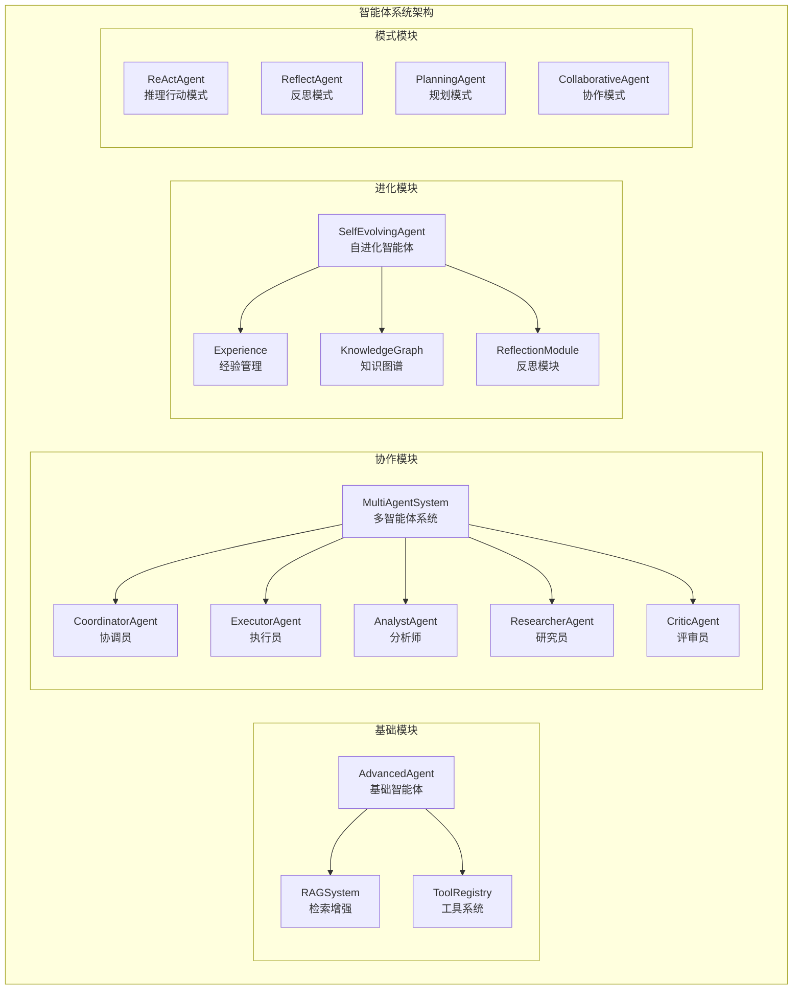
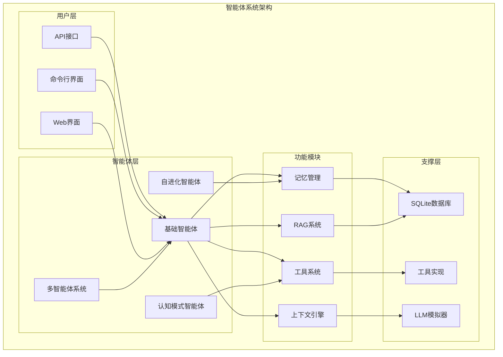

# 智能体系统

<cite>
**本文档引用的文件**
- [AdvancedAgent.java](file://tinyai-agent-base/src/main/java/io/leavesfly/tinyai/agent/AdvancedAgent.java)
- [RAGSystem.java](file://tinyai-agent-base/src/main/java/io/leavesfly/tinyai/agent/RAGSystem.java)
- [MultiAgentSystem.java](file://tinyai-agent-multi/src/main/java/io/leavesfly/tinyai/agent/multi/MultiAgentSystem.java)
- [SelfEvolvingAgent.java](file://tinyai-agent-evol/src/main/java/io/leavesfly/tinyai/agent/evol/SelfEvolvingAgent.java)
- [ReActAgent.java](file://tinyai-agent-pattern/src/main/java/io/leavesfly/tinyai/agent/pattern/ReActAgent.java)
- [ReflectAgent.java](file://tinyai-agent-pattern/src/main/java/io/leavesfly/tinyai/agent/pattern/ReflectAgent.java)
- [README.md](file://tinyai-agent-base/README.md)
- [README_MultiAgent.md](file://tinyai-agent-multi/doc/README_MultiAgent.md)
- [README.md](file://tinyai-agent-evol/README.md)
- [RAG_Java实现总结.md](file://tinyai-agent-rag/doc/RAG_Java实现总结.md)
</cite>

## 目录
1. [简介](#简介)
2. [项目结构](#项目结构)
3. [基础智能体系统](#基础智能体系统)
4. [RAG增强系统](#rag增强系统)
5. [多智能体协作系统](#多智能体协作系统)
6. [自进化智能体](#自进化智能体)
7. [认知模式智能体](#认知模式智能体)
8. [架构概览](#架构概览)
9. [使用示例](#使用示例)
10. [性能考虑](#性能考虑)
11. [故障排除指南](#故障排除指南)
12. [结论](#结论)

## 简介

TinyAI智能体系统是一个完整的Java版本AI智能体实现框架，参考Python版本的agent_mem.py创建。该系统包含了多个专门的智能体模块，每个模块都专注于不同的智能体能力和应用场景。

系统的核心设计理念是模块化、可扩展和企业级可靠性。通过将智能体功能分解为独立的模块，每个模块都可以单独使用或组合使用，以满足不同场景的需求。

## 项目结构

TinyAI智能体系统采用模块化架构，每个模块都有明确的职责和功能边界：



**图表来源**
- [AdvancedAgent.java](file://tinyai-agent-base/src/main/java/io/leavesfly/tinyai/agent/AdvancedAgent.java#L1-L50)
- [MultiAgentSystem.java](file://tinyai-agent-multi/src/main/java/io/leavesfly/tinyai/agent/multi/MultiAgentSystem.java#L1-L50)
- [SelfEvolvingAgent.java](file://tinyai-agent-evol/src/main/java/io/leavesfly/tinyai/agent/evol/SelfEvolvingAgent.java#L1-L50)

**章节来源**
- [README.md](file://tinyai-agent-base/README.md#L1-L50)
- [README_MultiAgent.md](file://tinyai-agent-multi/doc/README_MultiAgent.md#L1-L50)

## 基础智能体系统

### AdvancedAgent 核心机制

AdvancedAgent是系统的核心智能体，集成了记忆管理、RAG检索、工具调用和上下文工程等核心功能。

#### 工作机制


**图表来源**
- [AdvancedAgent.java](file://tinyai-agent-base/src/main/java/io/leavesfly/tinyai/agent/AdvancedAgent.java#L60-L120)

#### 消息处理流程

AdvancedAgent的消息处理遵循严格的流程控制：

1. **输入验证**：检查用户输入的有效性
2. **记忆记录**：将用户输入记录到情节记忆中
3. **相关记忆检索**：从记忆库中检索相关记忆
4. **RAG上下文生成**：从知识库中检索相关信息
5. **工具信息整合**：获取可用工具列表
6. **上下文构建**：整合所有相关信息
7. **LLM响应生成**：调用语言模型生成回复
8. **响应记录**：将回复记录到工作记忆中
9. **记忆整合**：定期整合和优化记忆

#### 核心组件


**图表来源**
- [AdvancedAgent.java](file://tinyai-agent-base/src/main/java/io/leavesfly/tinyai/agent/AdvancedAgent.java#L20-L40)
- [RAGSystem.java](file://tinyai-agent-base/src/main/java/io/leavesfly/tinyai/agent/RAGSystem.java#L15-L35)

**章节来源**
- [AdvancedAgent.java](file://tinyai-agent-base/src/main/java/io/leavesfly/tinyai/agent/AdvancedAgent.java#L1-L311)
- [README.md](file://tinyai-agent-base/README.md#L20-L80)

## RAG增强系统

### RAGSystem 工作原理

RAGSystem实现了检索增强生成的核心功能，通过结合检索和生成来提升智能体的能力。

#### 检索机制


**图表来源**
- [RAGSystem.java](file://tinyai-agent-base/src/main/java/io/leavesfly/tinyai/agent/RAGSystem.java#L80-L120)

#### 上下文生成

RAGSystem能够根据查询自动生成相关的上下文信息：

1. **文档检索**：基于查询相似度检索相关文档
2. **内容截取**：根据最大长度限制截取文档内容
3. **格式化**：将检索结果格式化为可读的上下文文本
4. **优化**：优先保留最相关的内容片段

#### 核心功能


**图表来源**
- [RAGSystem.java](file://tinyai-agent-base/src/main/java/io/leavesfly/tinyai/agent/RAGSystem.java#L15-L50)

**章节来源**
- [RAGSystem.java](file://tinyai-agent-base/src/main/java/io/leavesfly/tinyai/agent/RAGSystem.java#L1-L211)
- [RAG_Java实现总结.md](file://tinyai-agent-rag/doc/RAG_Java实现总结.md#L1-L100)

## 多智能体协作系统

### MultiAgentSystem 架构

MultiAgentSystem实现了复杂的多智能体协作架构，支持多种类型的智能体协同工作。

#### 智能体类型


**图表来源**
- [MultiAgentSystem.java](file://tinyai-agent-multi/src/main/java/io/leavesfly/tinyai/agent/multi/MultiAgentSystem.java#L20-L60)
- [README_MultiAgent.md](file://tinyai-agent-multi/doc/README_MultiAgent.md#L50-L100)

#### 协作流程


**图表来源**
- [MultiAgentSystem.java](file://tinyai-agent-multi/src/main/java/io/leavesfly/tinyai/agent/multi/MultiAgentSystem.java#L100-L150)

#### 消息通信机制

MultiAgentSystem提供了完整的消息通信机制：

1. **点对点通信**：Agent之间的直接消息传递
2. **广播通信**：向所有Agent发送消息
3. **任务通信**：专门的任务分配和状态更新
4. **系统通信**：系统级别的状态同步

**章节来源**
- [MultiAgentSystem.java](file://tinyai-agent-multi/src/main/java/io/leavesfly/tinyai/agent/multi/MultiAgentSystem.java#L1-L379)
- [README_MultiAgent.md](file://tinyai-agent-multi/doc/README_MultiAgent.md#L1-L176)

## 自进化智能体

### SelfEvolvingAgent 自我进化机制

SelfEvolvingAgent是最先进的智能体模块，具备经验记忆、策略优化、反思改进和知识图谱构建等自进化能力。

#### 自进化循环


**图表来源**
- [SelfEvolvingAgent.java](file://tinyai-agent-evol/src/main/java/io/leavesfly/tinyai/agent/evol/SelfEvolvingAgent.java#L50-L100)

#### 经验积累过程

SelfEvolvingAgent通过以下机制实现经验积累：

1. **任务执行**：执行具体任务并记录结果
2. **经验记录**：将任务执行过程和结果记录为经验
3. **策略应用**：基于历史经验选择合适的策略
4. **反思分析**：分析成功和失败的原因
5. **策略优化**：根据反思结果优化执行策略
6. **知识扩展**：构建和扩展知识图谱

#### 核心组件


**图表来源**
- [SelfEvolvingAgent.java](file://tinyai-agent-evol/src/main/java/io/leavesfly/tinyai/agent/evol/SelfEvolvingAgent.java#L15-L80)

**章节来源**
- [SelfEvolvingAgent.java](file://tinyai-agent-evol/src/main/java/io/leavesfly/tinyai/agent/evol/SelfEvolvingAgent.java#L1-L199)
- [README.md](file://tinyai-agent-evol/README.md#L1-L58)

## 认知模式智能体

### AgentPattern 模式实现

AgentPattern模块实现了多种认知模式的智能体，包括ReAct、Reflect等经典AI模式。

#### ReAct模式

ReAct模式结合了推理(Reasoning)和行动(Acting)，通过观察结果来指导下一步行动。


**图表来源**
- [ReActAgent.java](file://tinyai-agent-pattern/src/main/java/io/leavesfly/tinyai/agent/pattern/ReActAgent.java#L200-L280)

#### Reflect模式

Reflect模式智能体在执行任务后进行深度反思，评估执行效果并改进策略。


**图表来源**
- [ReflectAgent.java](file://tinyai-agent-pattern/src/main/java/io/leavesfly/tinyai/agent/pattern/ReflectAgent.java#L150-L220)

#### 核心模式对比

| 模式 | 特点 | 适用场景 | 实现方式 |
|------|------|----------|----------|
| ReAct | 推理+行动 | 复杂问题解决 | Thought-Action-Observation循环 |
| Reflect | 自我反思 | 质量改进 | 执行后深度反思 |
| Planning | 规划导向 | 项目管理 | 步骤化任务分解 |
| Collaborative | 协作导向 | 团队工作 | 多Agent协作 |

**章节来源**
- [ReActAgent.java](file://tinyai-agent-pattern/src/main/java/io/leavesfly/tinyai/agent/pattern/ReActAgent.java#L1-L301)
- [ReflectAgent.java](file://tinyai-agent-pattern/src/main/java/io/leavesfly/tinyai/agent/pattern/ReflectAgent.java#L1-L262)

## 架构概览

### 系统整体架构



### 数据流架构


## 使用示例

### 基础智能体使用

```java
// 创建基础智能体
AdvancedAgent agent = new AdvancedAgent(
    "我的助手",
    "你是一个智能助手，能够帮助用户解决各种问题。"
);

// 添加知识库
agent.addKnowledge("Java是一种面向对象的编程语言", "java_info");

// 处理对话
String response = agent.processMessage("什么是Java？");
System.out.println(response);

// 使用工具
Map<String, Object> args = new HashMap<>();
args.put("operation", "add");
args.put("a", 10);
args.put("b", 5);

ToolCall result = agent.getToolRegistry().callTool("calculator", args);
System.out.println("计算结果: " + result.getResult());
```

### 多智能体系统使用

```java
// 创建多智能体系统
MultiAgentSystem system = new MultiAgentSystem();

// 添加智能体
CompletableFuture<String> analystId = system.addAgent(AnalystAgent.class);
CompletableFuture<String> researcherId = system.addAgent(ResearcherAgent.class);
CompletableFuture<String> executorId = system.addAgent(ExecutorAgent.class);

// 创建团队
List<String> teamMembers = Arrays.asList(analystId.get(), researcherId.get(), executorId.get());
system.createTeam("数据分析团队", teamMembers);

// 分配任务
AgentTask task = new AgentTask("分析销售数据", "sales_analysis");
system.assignTask(task, "数据分析团队", true);

// 获取系统状态
Map<String, Object> status = system.getSystemStatus();
```

### 自进化智能体使用

```java
// 创建自进化智能体
SelfEvolvingAgent agent = new SelfEvolvingAgent("进化智能体");

// 处理任务
TaskResult result = agent.processTask("搜索信息", null);
System.out.println("执行结果: " + result.isSuccess());

// 获取性能指标
Map<String, Object> metrics = agent.getPerformanceMetrics();
System.out.println("成功率: " + metrics.get("successRate"));
```

### 认知模式智能体使用

```java
// 创建ReAct智能体
ReActAgent reactAgent = new ReActAgent("ReAct智能体");

// 处理复杂查询
String response = reactAgent.process("如何解决内存泄漏问题？");
System.out.println(response);

// 创建Reflect智能体
ReflectAgent reflectAgent = new ReflectAgent("Reflect智能体");

// 处理分析任务
String analysis = reflectAgent.process("分析这段代码的性能瓶颈");
System.out.println(analysis);
```

## 性能考虑

### 内存管理

智能体系统采用了多种内存优化策略：

1. **记忆容量控制**：工作记忆限制为10条，防止内存溢出
2. **定期整合**：每10轮对话后整合记忆，优化存储空间
3. **向量维度配置**：可配置嵌入向量维度，平衡精度和性能
4. **数据库优化**：使用SQLite数据库，支持内存模式和文件模式

### 并发处理

系统支持异步并发处理：

1. **CompletableFuture**：所有Agent操作都支持异步执行
2. **线程池管理**：合理配置线程池大小
3. **消息总线异步**：消息传递采用异步模式
4. **工具调用并发**：多个工具可以并行执行

### 性能监控


## 故障排除指南

### 常见问题及解决方案

#### 1. 内存不足问题

**症状**：系统运行缓慢，出现OutOfMemoryError
**解决方案**：
- 调整记忆容量设置
- 定期清理过期记忆
- 使用数据库持久化存储

#### 2. 检索精度问题

**症状**：RAG检索结果不相关
**解决方案**：
- 增加知识库文档数量
- 优化文档分词和向量化
- 调整相似度阈值

#### 3. 多智能体通信问题

**症状**：智能体之间通信失败
**解决方案**：
- 检查消息总线配置
- 验证Agent状态同步
- 增加重试机制

#### 4. 工具调用失败

**症状**：工具执行异常或返回错误
**解决方案**：
- 检查工具注册状态
- 验证参数格式正确性
- 添加异常处理逻辑

### 调试技巧

1. **启用详细日志**：设置日志级别为DEBUG
2. **性能分析**：使用JProfiler等工具分析性能瓶颈
3. **内存分析**：使用VisualVM监控内存使用情况
4. **网络分析**：检查LLM API调用状态

**章节来源**
- [README.md](file://tinyai-agent-base/README.md#L200-L227)

## 结论

TinyAI智能体系统提供了一个完整、可扩展的Java版本AI智能体实现框架。通过模块化设计，系统支持从基础智能体到高级自进化智能体的各种应用场景。

### 主要优势

1. **模块化架构**：清晰的模块划分，易于理解和扩展
2. **企业级可靠性**：完善的异常处理和性能监控
3. **丰富的功能**：涵盖记忆管理、RAG检索、工具调用等多个方面
4. **多模式支持**：支持ReAct、Reflect等多种认知模式
5. **自进化能力**：具备自我学习和改进的能力

### 应用场景

- **客户服务**：智能客服机器人
- **数据分析**：自动化数据分析和报告生成
- **研发支持**：文献调研和实验设计辅助
- **项目管理**：任务分配和进度跟踪
- **教育培训**：个性化学习辅导

### 发展方向

1. **集成真实LLM**：与OpenAI、Claude等API集成
2. **多模态支持**：支持图像、音频等多模态输入
3. **云端部署**：支持容器化和微服务架构
4. **智能推荐**：基于用户行为的智能推荐系统
5. **跨平台支持**：支持Android、iOS等移动平台

TinyAI智能体系统为开发者提供了一个强大而灵活的AI智能体开发平台，可以快速构建各种智能应用场景。随着AI技术的不断发展，该系统也将持续演进，为用户提供更加强大和智能的解决方案。