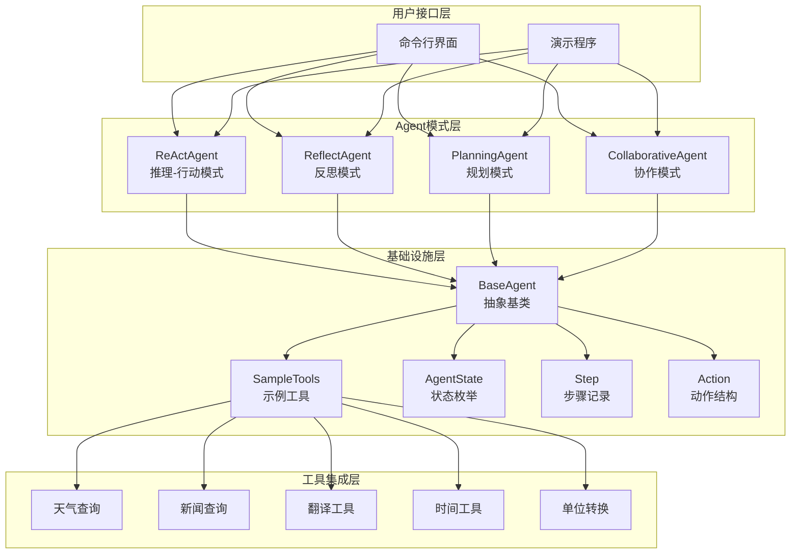
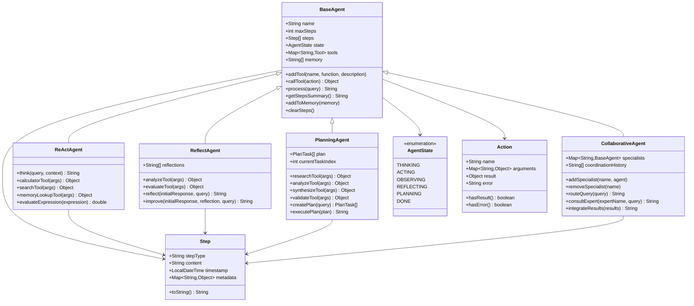
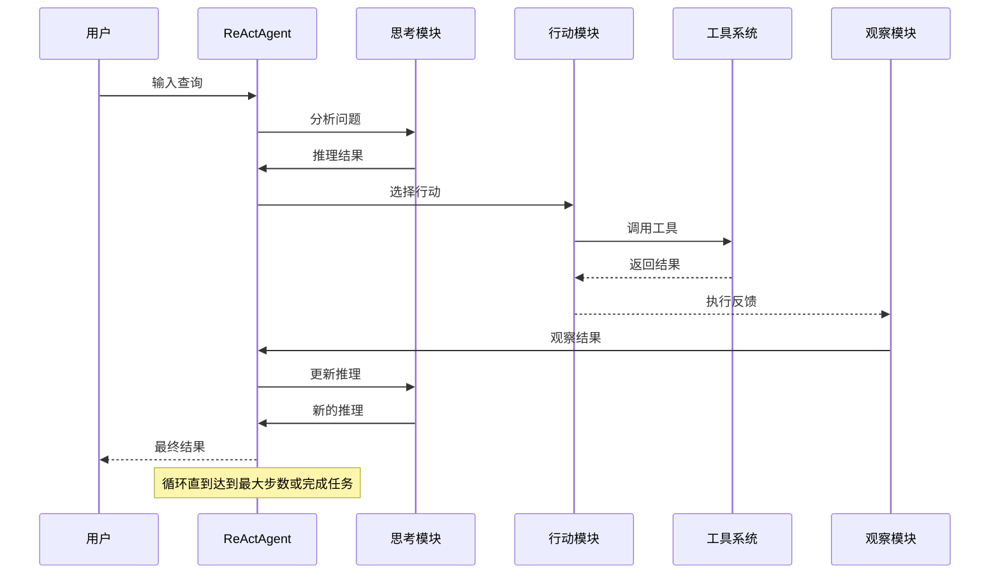
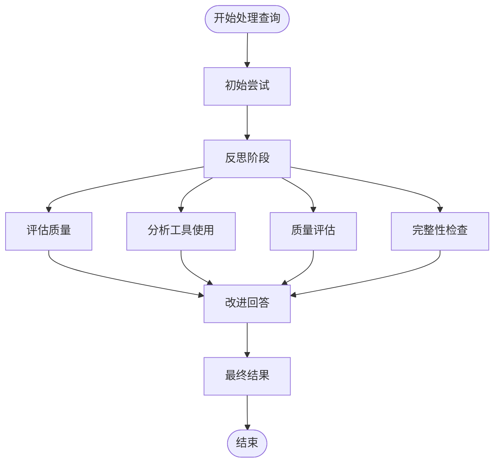
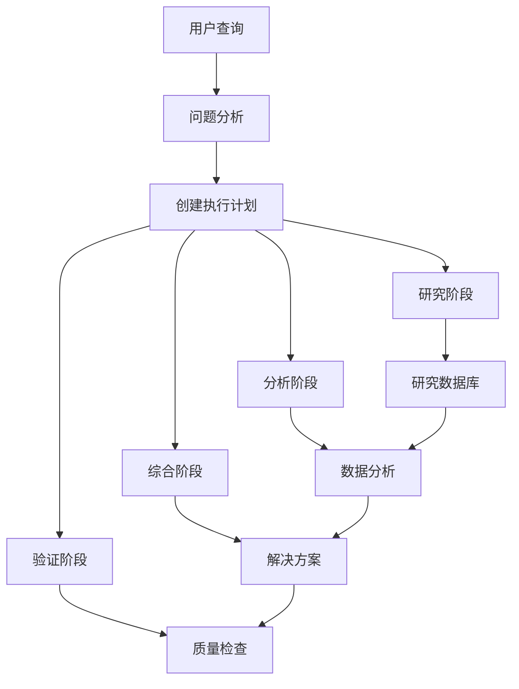
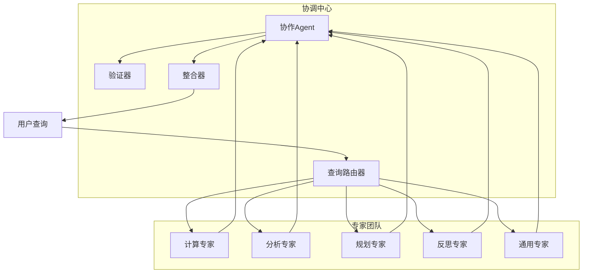
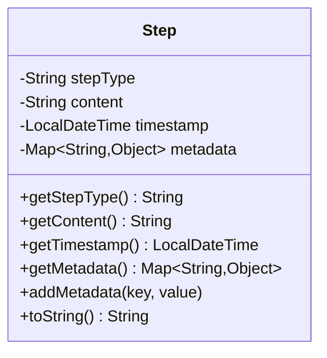
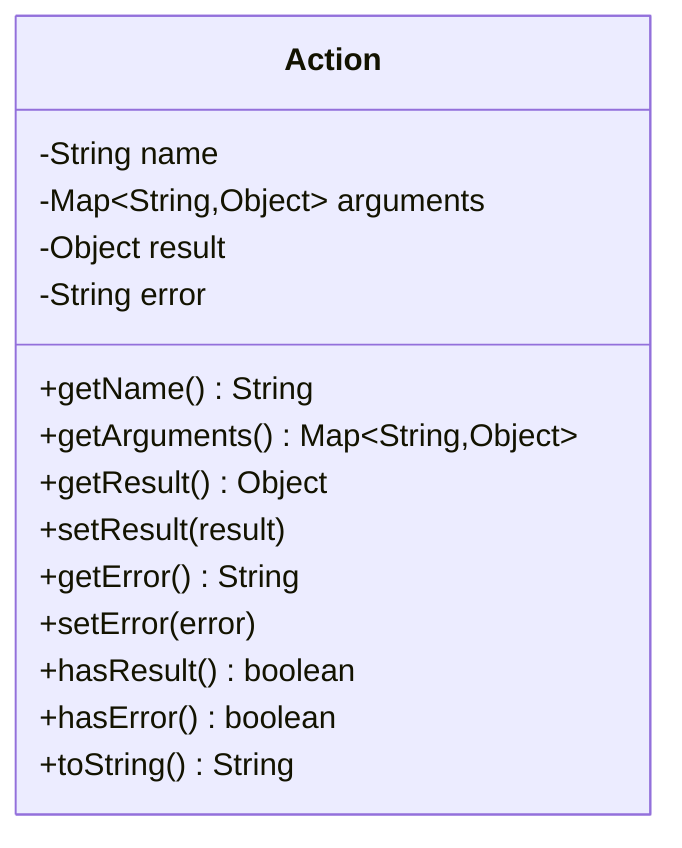
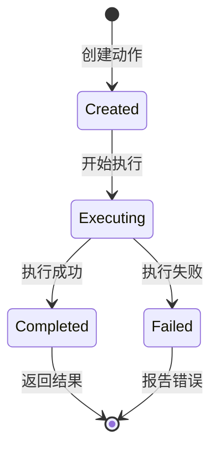
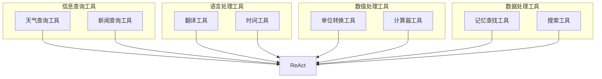

# 智能体认知模式

<cite>
**本文档引用的文件**
- [AgentPatternMain.java](file://tinyai-agent-pattern/src/main/java/io/leavesfly/tinyai/agent/pattern/AgentPatternMain.java)
- [ReActAgent.java](file://tinyai-agent-pattern/src/main/java/io/leavesfly/tinyai/agent/pattern/ReActAgent.java)
- [ReflectAgent.java](file://tinyai-agent-pattern/src/main/java/io/leavesfly/tinyai/agent/pattern/ReflectAgent.java)
- [PlanningAgent.java](file://tinyai-agent-pattern/src/main/java/io/leavesfly/tinyai/agent/pattern/PlanningAgent.java)
- [CollaborativeAgent.java](file://tinyai-agent-pattern/src/main/java/io/leavesfly/tinyai/agent/pattern/CollaborativeAgent.java)
- [BaseAgent.java](file://tinyai-agent-pattern/src/main/java/io/leavesfly/tinyai/agent/pattern/BaseAgent.java)
- [SampleTools.java](file://tinyai-agent-pattern/src/main/java/io/leavesfly/tinyai/agent/pattern/SampleTools.java)
- [AgentPatternDemo.java](file://tinyai-agent-pattern/src/main/java/io/leavesfly/tinyai/agent/pattern/AgentPatternDemo.java)
- [Step.java](file://tinyai-agent-pattern/src/main/java/io/leavesfly/tinyai/agent/pattern/Step.java)
- [Action.java](file://tinyai-agent-pattern/src/main/java/io/leavesfly/tinyai/agent/pattern/Action.java)
- [AgentState.java](file://tinyai-agent-pattern/src/main/java/io/leavesfly/tinyai/agent/pattern/AgentState.java)
- [README.md](file://tinyai-agent-pattern/doc/README.md)
</cite>

## 目录
1. [简介](#简介)
2. [核心架构](#核心架构)
3. [Agent模式详解](#agent模式详解)
4. [认知流程单元](#认知流程单元)
5. [工具集成系统](#工具集成系统)
6. [模式对比分析](#模式对比分析)
7. [最佳实践指南](#最佳实践指南)
8. [故障排除](#故障排除)
9. [总结](#总结)

## 简介

智能体认知模式模块是TinyAI框架中的核心组件，提供了多种先进的Agent模式实现。这些模式基于不同的认知理论和方法论，为解决复杂问题提供了多样化的解决方案。模块包含ReActAgent的推理-行动循环、ReflectAgent的自我反思机制、PlanningAgent的任务规划能力，以及CollaborativeAgent的协作模式。

该模块的设计理念是提供可扩展、可复用的认知架构，支持开发者根据具体任务需求选择合适的Agent模式。通过统一的接口设计和丰富的工具集，开发者可以轻松构建和部署各种类型的智能Agent。

## 核心架构

### 系统架构概览



**图表来源**
- [AgentPatternMain.java](file://tinyai-agent-pattern/src/main/java/io/leavesfly/tinyai/agent/pattern/AgentPatternMain.java#L1-L253)
- [BaseAgent.java](file://tinyai-agent-pattern/src/main/java/io/leavesfly/tinyai/agent/pattern/BaseAgent.java#L1-L195)

### 核心组件关系图



**图表来源**
- [BaseAgent.java](file://tinyai-agent-pattern/src/main/java/io/leavesfly/tinyai/agent/pattern/BaseAgent.java#L15-L195)
- [ReActAgent.java](file://tinyai-agent-pattern/src/main/java/io/leavesfly/tinyai/agent/pattern/ReActAgent.java#L15-L301)
- [ReflectAgent.java](file://tinyai-agent-pattern/src/main/java/io/leavesfly/tinyai/agent/pattern/ReflectAgent.java#L15-L262)
- [PlanningAgent.java](file://tinyai-agent-pattern/src/main/java/io/leavesfly/tinyai/agent/pattern/PlanningAgent.java#L15-L302)
- [CollaborativeAgent.java](file://tinyai-agent-pattern/src/main/java/io/leavesfly/tinyai/agent/pattern/CollaborativeAgent.java#L15-L267)

**章节来源**
- [AgentPatternMain.java](file://tinyai-agent-pattern/src/main/java/io/leavesfly/tinyai/agent/pattern/AgentPatternMain.java#L1-L253)
- [BaseAgent.java](file://tinyai-agent-pattern/src/main/java/io/leavesfly/tinyai/agent/pattern/BaseAgent.java#L1-L195)

## Agent模式详解

### ReActAgent：推理-行动循环

ReActAgent实现了"推理-行动"（Reasoning-Acting）的循环模式，这是目前最先进的Agent认知架构之一。该模式通过交替进行推理和行动来解决问题，每次行动后都会观察结果，并根据新的信息调整后续的推理和行动。

#### 核心工作机制



**图表来源**
- [ReActAgent.java](file://tinyai-agent-pattern/src/main/java/io/leavesfly/tinyai/agent/pattern/ReActAgent.java#L15-L301)

#### 实现特点

1. **智能路由决策**：根据查询内容自动选择合适的工具
2. **动态推理**：基于当前上下文和工具结果调整推理方向
3. **工具集成**：内置计算器、搜索引擎和记忆查找工具
4. **可扩展性**：支持添加自定义工具和行为

#### 应用场景

- **数学计算**：复杂的算术运算和公式求解
- **信息检索**：实时搜索和信息查询
- **知识问答**：基于现有知识库的问答系统
- **任务自动化**：需要多步骤操作的自动化任务

**章节来源**
- [ReActAgent.java](file://tinyai-agent-pattern/src/main/java/io/leavesfly/tinyai/agent/pattern/ReActAgent.java#L1-L301)

### ReflectAgent：自我反思机制

ReflectAgent引入了自我反思的能力，能够在执行任务后评估自己的表现，并根据反思结果改进未来的决策。这种机制类似于人类的元认知过程，使Agent能够不断优化自己的行为模式。

#### 反思流程



**图表来源**
- [ReflectAgent.java](file://tinyai-agent-pattern/src/main/java/io/leavesfly/tinyai/agent/pattern/ReflectAgent.java#L15-L262)

#### 反思维度

1. **完整性评估**：检查回答是否完整覆盖了问题的所有方面
2. **相关性分析**：评估回答内容与问题的相关程度
3. **工具使用效率**：分析是否合理使用了可用工具
4. **质量评分**：对回答的准确性、清晰度和专业性进行评分

#### 应用场景

- **内容创作**：文章、报告和创意写作的质量提升
- **客户服务**：提高回复质量和客户满意度
- **教育辅导**：个性化教学和学习指导
- **专业咨询**：法律、医疗等领域的咨询服务

**章节来源**
- [ReflectAgent.java](file://tinyai-agent-pattern/src/main/java/io/leavesfly/tinyai/agent/pattern/ReflectAgent.java#L1-L262)

### PlanningAgent：任务规划能力

PlanningAgent采用先规划后执行的策略，将复杂任务分解为可管理的子任务，并制定详细的执行计划。这种模式特别适合需要系统性思考和长期规划的任务。

#### 规划层次结构



**图表来源**
- [PlanningAgent.java](file://tinyai-agent-pattern/src/main/java/io/leavesfly/tinyai/agent/pattern/PlanningAgent.java#L15-L302)

#### 规划任务类型

1. **研究任务**：收集和整理相关信息
2. **分析任务**：深入分析收集的数据和信息
3. **综合任务**：整合分析结果形成完整解决方案
4. **验证任务**：检查解决方案的正确性和有效性

#### 应用场景

- **项目管理**：复杂项目的进度规划和资源分配
- **学术研究**：论文写作和研究课题的系统性开展
- **学习规划**：个人学习路径和技能发展的系统规划
- **战略制定**：企业战略和业务规划的制定

**章节来源**
- [PlanningAgent.java](file://tinyai-agent-pattern/src/main/java/io/leavesfly/tinyai/agent/pattern/PlanningAgent.java#L1-L302)

### CollaborativeAgent：协作模式

CollaborativeAgent实现了多Agent协作的架构，通过多个专家Agent的协同工作来解决复杂问题。这种模式利用专业化分工的优势，同时通过协调机制确保各个专家的输出能够有效整合。

#### 协作架构



**图表来源**
- [CollaborativeAgent.java](file://tinyai-agent-pattern/src/main/java/io/leavesfly/tinyai/agent/pattern/CollaborativeAgent.java#L15-L267)

#### 协作流程

1. **查询路由**：根据查询内容自动选择最适合的专家
2. **专家咨询**：调用选定的专家Agent处理特定任务
3. **结果验证**：通过其他专家验证主要专家的输出
4. **结果整合**：将多个专家的意见整合为统一的解决方案

#### 专家专业化

- **计算专家**：专注于数学计算和数值分析
- **分析专家**：擅长深度分析和模式识别
- **规划专家**：负责任务分解和计划制定
- **反思专家**：提供质量评估和改进建议
- **通用专家**：处理跨领域的综合性问题

**章节来源**
- [CollaborativeAgent.java](file://tinyai-agent-pattern/src/main/java/io/leavesfly/tinyai/agent/pattern/CollaborativeAgent.java#L1-L267)

## 认知流程单元

### Step：步骤记录

Step类是认知流程的基本单元，用于记录Agent执行过程中的每一步操作。它提供了完整的执行轨迹追踪，这对于调试、性能分析和结果解释都至关重要。

#### 步骤属性



**图表来源**
- [Step.java](file://tinyai-agent-pattern/src/main/java/io/leavesfly/tinyai/agent/pattern/Step.java#L10-L60)

#### 步骤类型

1. **thought**：推理思考阶段
2. **action**：执行具体行动
3. **observation**：观察行动结果
4. **reflection**：反思评估阶段
5. **plan**：制定执行计划
6. **integration**：整合多个结果

### Action：动作结构

Action类封装了Agent要执行的具体动作，包括动作名称、参数和执行结果。它是Agent与外部系统交互的标准接口。

#### 动作结构



**图表来源**
- [Action.java](file://tinyai-agent-pattern/src/main/java/io/leavesfly/tinyai/agent/pattern/Action.java#L10-L79)

#### 动作生命周期



**章节来源**
- [Step.java](file://tinyai-agent-pattern/src/main/java/io/leavesfly/tinyai/agent/pattern/Step.java#L1-L60)
- [Action.java](file://tinyai-agent-pattern/src/main/java/io/leavesfly/tinyai/agent/pattern/Action.java#L1-L79)

## 工具集成系统

### SampleTools：示例工具集

SampleTools提供了多种实用的工具函数，展示了如何为Agent添加自定义功能。这些工具涵盖了日常生活中的常见需求，同时也为开发者提供了扩展的参考。

#### 工具分类



**图表来源**
- [SampleTools.java](file://tinyai-agent-pattern/src/main/java/io/leavesfly/tinyai/agent/pattern/SampleTools.java#L1-L154)

#### 工具实现模式

所有工具都遵循相同的函数签名模式：

```java
public static Function<Map<String, Object>, Object> createToolName() {
    return args -> {
        // 参数提取
        String param1 = (String) args.get("param1");
        // 工具逻辑实现
        return "工具执行结果";
    };
}
```

这种设计使得工具可以：
- **参数化**：支持灵活的参数传递
- **类型安全**：编译时检查参数类型
- **易于扩展**：新增工具只需遵循相同模式
- **可测试**：独立测试每个工具的功能

**章节来源**
- [SampleTools.java](file://tinyai-agent-pattern/src/main/java/io/leavesfly/tinyai/agent/pattern/SampleTools.java#L1-L154)

## 模式对比分析

### 特性矩阵

| Agent模式 | 适用场景 | 优势 | 劣势 | 复杂度 |
|-----------|----------|------|------|--------|
| **ReAct** | 数学计算、信息查询 | 逻辑清晰、可解释性强 | 可能陷入局部循环 | 低 |
| **Reflect** | 内容生成、质量要求高的任务 | 自我改进、质量控制 | 计算开销较大 | 中 |
| **Planning** | 项目管理、研究任务 | 任务分解能力强 | 规划开销大、不够灵活 | 高 |
| **Collaborative** | 复杂问题、多领域任务 | 专业化分工、互补优势 | 协调复杂、资源消耗大 | 高 |

### 模式选择指南

#### 选择ReActAgent的场景

- **需要工具调用**：当任务涉及多个外部系统的交互时
- **简单推理**：问题可以通过直接的逻辑推理解决
- **实时响应**：需要快速给出初步答案
- **透明度要求高**：需要清楚了解Agent的决策过程

#### 选择ReflectAgent的场景

- **质量要求高**：对回答的准确性和完整性有严格要求
- **创造性任务**：需要反复打磨和完善的内容
- **专业咨询**：法律、医疗等领域的咨询服务
- **教育培训**：需要高质量的教学内容和指导

#### 选择PlanningAgent的场景

- **复杂项目**：需要系统性规划和执行的大型任务
- **研究任务**：学术研究和创新性工作的开展
- **长期规划**：个人发展和职业规划
- **战略制定**：企业战略和业务规划

#### 选择CollaborativeAgent的场景

- **复杂问题**：单一Agent难以解决的综合性问题
- **多领域任务**：需要跨学科知识和专业技能的任务
- **质量验证**：需要多方验证和确认的高质量输出
- **团队协作**：模拟多人协作解决问题的场景

**章节来源**
- [AgentPatternDemo.java](file://tinyai-agent-pattern/src/main/java/io/leavesfly/tinyai/agent/pattern/AgentPatternDemo.java#L100-L240)

## 最佳实践指南

### 开发最佳实践

#### 1. Agent设计原则

- **单一职责**：每个Agent专注于特定的任务领域
- **状态管理**：合理使用AgentState枚举管理Agent状态
- **内存限制**：控制记忆列表的大小，避免内存泄漏
- **异常处理**：完善的错误处理和恢复机制

#### 2. 工具开发规范

```java
// 推荐的工具开发模式
public static Function<Map<String, Object>, Object> createSpecializedTool() {
    return args -> {
        // 1. 参数验证
        if (args == null || args.isEmpty()) {
            return "错误：缺少必要参数";
        }
        
        // 2. 参数提取和类型检查
        String requiredParam = extractRequiredParam(args, "param_name");
        if (requiredParam == null) {
            return "错误：参数[param_name]缺失或格式错误";
        }
        
        // 3. 业务逻辑实现
        try {
            return performBusinessLogic(requiredParam);
        } catch (Exception e) {
            return "错误：" + e.getMessage();
        }
    };
}
```

#### 3. 性能优化建议

- **缓存机制**：对重复的计算和查询结果进行缓存
- **异步处理**：对于耗时的操作使用异步执行
- **资源池化**：对共享资源使用连接池或对象池
- **监控指标**：跟踪Agent的执行时间和资源使用情况

### 部署和运维

#### 1. 监控和日志

```java
// 建议的日志记录模式
public class MonitoredAgent extends BaseAgent {
    private static final Logger logger = LoggerFactory.getLogger(MonitoredAgent.class);
    
    @Override
    public String process(String query) {
        long startTime = System.currentTimeMillis();
        try {
            logger.info("开始处理查询: {}", query);
            String result = super.process(query);
            logger.info("处理完成，耗时: {}ms", System.currentTimeMillis() - startTime);
            return result;
        } catch (Exception e) {
            logger.error("处理查询失败: {}", query, e);
            throw e;
        }
    }
}
```

#### 2. 配置管理

- **参数化配置**：将Agent的行为参数化，便于调整
- **环境隔离**：不同环境使用不同的配置
- **热更新**：支持运行时修改Agent配置
- **回滚机制**：配置变更失败时能够快速回滚

**章节来源**
- [BaseAgent.java](file://tinyai-agent-pattern/src/main/java/io/leavesfly/tinyai/agent/pattern/BaseAgent.java#L1-L195)
- [README.md](file://tinyai-agent-pattern/doc/README.md#L1-L209)

## 故障排除

### 常见问题和解决方案

#### 1. Agent卡死或无限循环

**症状**：Agent长时间无响应，步骤不断增加但没有进展

**原因分析**：
- ReActAgent陷入工具调用循环
- ReflectAgent过度反思
- PlanningAgent规划过于复杂

**解决方案**：
```java
// 设置合理的最大步数
ReActAgent agent = new ReActAgent("Agent", 10); // 默认10步
// 或在运行时设置
agent.setMaxSteps(15);
```

#### 2. 工具调用失败

**症状**：Action显示错误信息，工具无法正常工作

**排查步骤**：
1. 检查工具是否正确注册
2. 验证参数格式和类型
3. 确认工具函数的实现

**调试代码**：
```java
// 检查工具注册状态
Map<String, Tool> tools = agent.getTools();
if (!tools.containsKey("tool_name")) {
    System.out.println("工具未注册");
}

// 测试工具调用
Action testAction = new Action("tool_name", Map.of("param", "value"));
Object result = agent.callTool(testAction);
System.out.println("工具结果: " + result);
System.out.println("错误信息: " + testAction.getError());
```

#### 3. 内存使用过高

**症状**：Agent运行一段时间后内存占用持续增加

**原因**：memory列表没有及时清理

**解决方案**：
```java
// 定期清理记忆
public void cleanupMemory(BaseAgent agent) {
    List<String> memory = agent.getMemory();
    if (memory.size() > 100) { // 保留最近的100条记忆
        agent.clearSteps();
        agent.addToMemory("记忆已清理，保留最近的100条记录");
    }
}
```

#### 4. 协作Agent专家冲突

**症状**：多个专家给出相互矛盾的答案

**解决方案**：
```java
// 实现专家投票机制
private String resolveConflicts(List<String> expertResponses) {
    Map<String, Integer> responseCounts = new HashMap<>();
    
    // 统计相同回答的数量
    for (String response : expertResponses) {
        responseCounts.merge(response, 1, Integer::sum);
    }
    
    // 返回出现次数最多的回答
    return Collections.max(responseCounts.entrySet(),
                          Map.Entry.comparingByValue()).getKey();
}
```

### 调试技巧

#### 1. 启用详细日志

```java
// 在Agent中启用详细步骤记录
public class DebuggableAgent extends BaseAgent {
    @Override
    public String process(String query) {
        System.out.println("=== 开始处理 ===");
        System.out.println("查询: " + query);
        
        String result = super.process(query);
        
        System.out.println("=== 执行步骤 ===");
        System.out.println(getStepsSummary());
        
        System.out.println("=== 最终结果 ===");
        System.out.println(result);
        
        return result;
    }
}
```

#### 2. 性能分析

```java
// 性能监控装饰器
public class PerformanceMonitor<T extends BaseAgent> {
    private T agent;
    
    public String processWithMonitoring(T agent, String query) {
        long startTime = System.nanoTime();
        int initialSteps = agent.getSteps().size();
        
        String result = agent.process(query);
        
        long endTime = System.nanoTime();
        int finalSteps = agent.getSteps().size();
        
        System.out.printf("处理时间: %.2f ms%n", (endTime - startTime) / 1_000_000.0);
        System.out.printf("执行步骤: %d%n", finalSteps - initialSteps);
        System.out.printf("平均步骤时间: %.2f μs%n", 
                         (endTime - startTime) / (double)(finalSteps - initialSteps));
        
        return result;
    }
}
```

**章节来源**
- [AgentPatternTest.java](file://tinyai-agent-pattern/src/test/java/io/leavesfly/tinyai/agent/pattern/AgentPatternTest.java#L1-L131)

## 总结

智能体认知模式模块为开发者提供了一套完整的Agent模式实现，涵盖了从简单的推理-行动循环到复杂的多Agent协作的各种认知架构。通过统一的接口设计和丰富的工具集，开发者可以根据具体任务需求选择最适合的Agent模式。

### 核心价值

1. **多样化解决方案**：提供多种Agent模式满足不同场景需求
2. **可扩展架构**：模块化设计支持功能扩展和定制
3. **透明执行过程**：完整的步骤记录便于理解和调试
4. **工具生态丰富**：内置多种实用工具，支持自定义扩展

### 发展方向

- **增强学习集成**：将强化学习算法融入Agent决策过程
- **多模态支持**：扩展对图像、音频等多模态数据的处理能力
- **分布式协作**：支持跨网络的多Agent分布式协作
- **自适应学习**：Agent能够根据经验自动调整行为策略

### 应用前景

智能体认知模式模块为构建下一代智能助手、自动化系统和决策支持工具奠定了坚实基础。随着人工智能技术的不断发展，这些认知模式将在更多领域发挥重要作用，推动智能化水平的持续提升。

通过本文档的详细介绍，开发者应该能够充分理解各种Agent模式的特点和应用场景，并能够根据具体需求选择合适的认知架构，构建高效、可靠的智能系统。