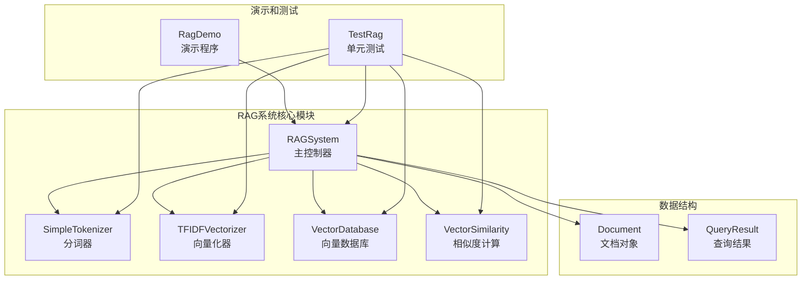
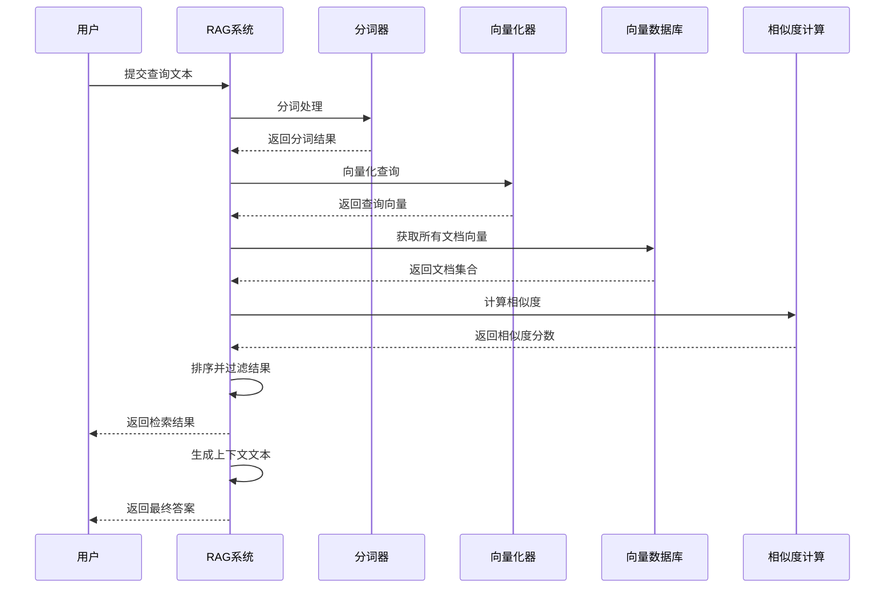
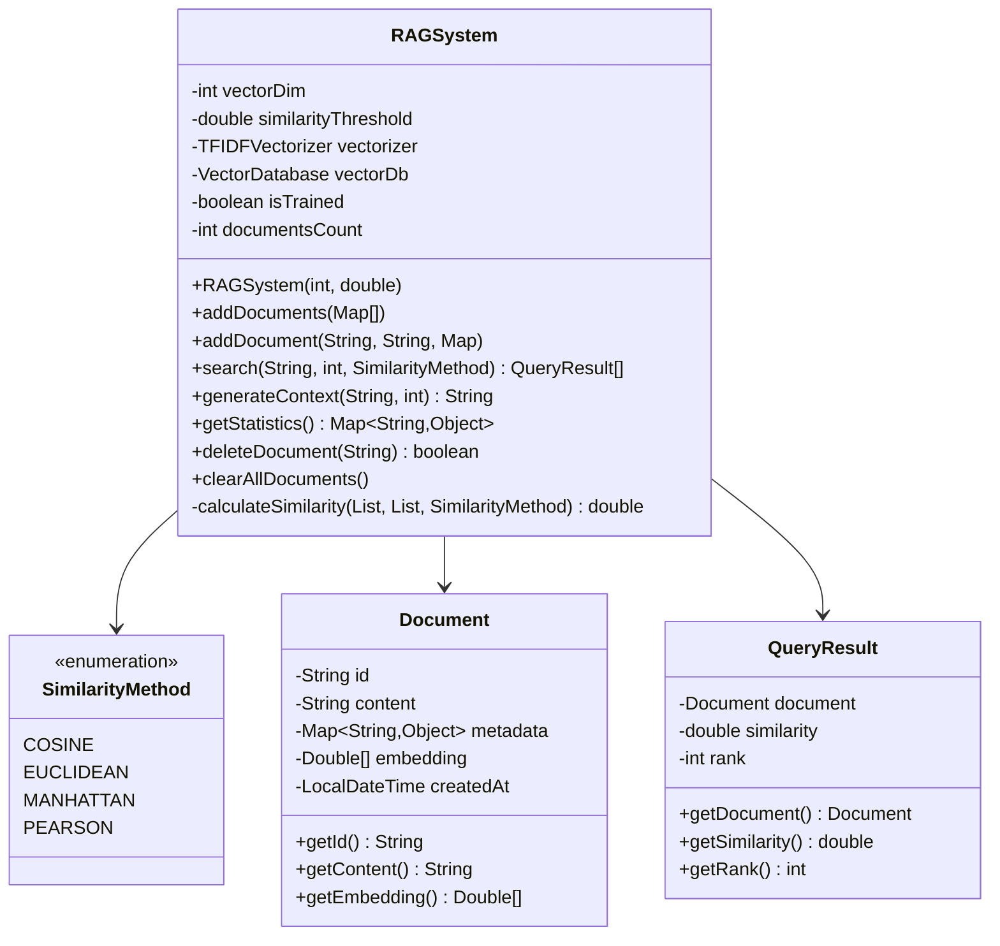
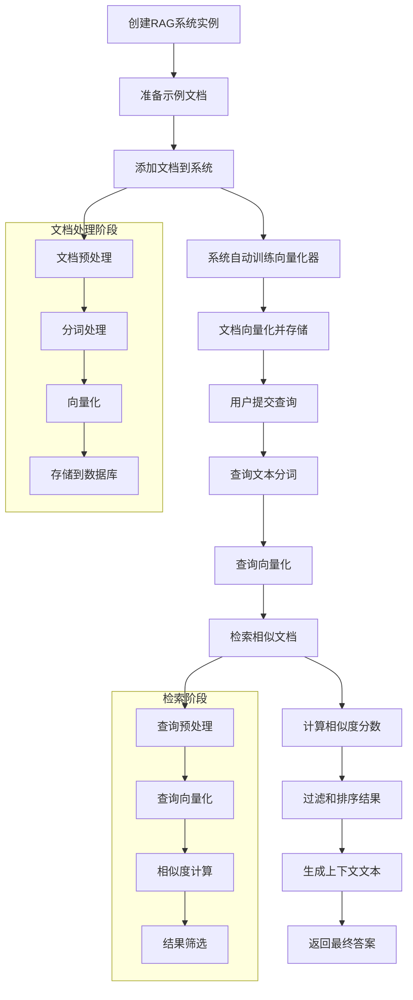

# 检索增强生成系统

<cite>
**本文档引用的文件**
- [RAGSystem.java](file://tinyai-agent-rag/src/main/java/io/leavesfly/tinyai/agent/rag/RAGSystem.java)
- [SimpleTokenizer.java](file://tinyai-agent-rag/src/main/java/io/leavesfly/tinyai/agent/rag/SimpleTokenizer.java)
- [TFIDFVectorizer.java](file://tinyai-agent-rag/src/main/java/io/leavesfly/tinyai/agent/rag/TFIDFVectorizer.java)
- [VectorDatabase.java](file://tinyai-agent-rag/src/main/java/io/leavesfly/tinyai/agent/rag/VectorDatabase.java)
- [VectorSimilarity.java](file://tinyai-agent-rag/src/main/java/io/leavesfly/tinyai/agent/rag/VectorSimilarity.java)
- [Document.java](file://tinyai-agent-rag/src/main/java/io/leavesfly/tinyai/agent/rag/Document.java)
- [QueryResult.java](file://tinyai-agent-rag/src/main/java/io/leavesfly/tinyai/agent/rag/QueryResult.java)
- [RagDemo.java](file://tinyai-agent-rag/src/main/java/io/leavesfly/tinyai/agent/rag/RagDemo.java)
- [TestRag.java](file://tinyai-agent-rag/src/test/java/io/leavesfly/tinyai/agent/rag/TestRag.java)
- [RAG_Java实现总结.md](file://tinyai-agent-rag/doc/RAG_Java实现总结.md)
- [rag.py](file://tinyai-agent-rag/doc/rag.py) - *由rag.txt重命名而来*
</cite>

## 更新摘要
**变更内容**
- 更新了文件引用，将`rag.txt`更新为`rag.py`
- 保持了文档的完整结构和内容
- 维护了所有代码文件的引用链接
- 确保了文档与代码库状态的一致性

## 目录
1. [简介](#简介)
2. [项目结构](#项目结构)
3. [核心组件](#核心组件)
4. [架构概览](#架构概览)
5. [详细组件分析](#详细组件分析)
6. [RAG系统工作流程](#rag系统工作流程)
7. [性能优化策略](#性能优化策略)
8. [故障排除指南](#故障排除指南)
9. [结论](#结论)

## 简介

RAG（Retrieval-Augmented Generation）系统是一种结合检索和生成的智能问答系统。本项目基于Java语言实现了一个完整的RAG系统，通过整合文本分词、向量化、检索和生成等功能，为用户提供准确且上下文相关的回答。

该系统的核心优势在于：
- **零第三方依赖**：完全基于Java标准库实现
- **中文友好**：专门优化的中文分词和处理
- **高性能设计**：批量处理和内存优化
- **灵活扩展**：模块化架构便于功能扩展

## 项目结构



**图表来源**
- [RAGSystem.java](file://tinyai-agent-rag/src/main/java/io/leavesfly/tinyai/agent/rag/RAGSystem.java#L1-L373)
- [SimpleTokenizer.java](file://tinyai-agent-rag/src/main/java/io/leavesfly/tinyai/agent/rag/SimpleTokenizer.java#L1-L161)
- [TFIDFVectorizer.java](file://tinyai-agent-rag/src/main/java/io/leavesfly/tinyai/agent/rag/TFIDFVectorizer.java#L1-L191)
- [VectorDatabase.java](file://tinyai-agent-rag/src/main/java/io/leavesfly/tinyai/agent/rag/VectorDatabase.java#L1-L146)

**章节来源**
- [RAG_Java实现总结.md](file://tinyai-agent-rag/doc/RAG_Java实现总结.md#L1-L50)

## 核心组件

### 文档处理模块

#### SimpleTokenizer - 智能分词器
SimpleTokenizer是系统的核心文本处理组件，专门设计用于处理中英文混合文本：

```java
// 中文按字符分词，英文按单词分词
public List<String> tokenize(String text) {
    // 转换为小写
    text = text.toLowerCase();
    
    // 移除标点符号，保留中英文字符和数字
    text = punctuationPattern.matcher(text).replaceAll(" ");
    
    // 按空格分割
    String[] words = text.split("\\s+");
    
    List<String> result = new ArrayList<>();
    
    for (String word : words) {
        if (word.trim().isEmpty()) {
            continue;
        }
        
        // 检查是否包含中文字符
        if (chinesePattern.matcher(word).find()) {
            // 包含中文，按字符分词
            for (char c : word.toCharArray()) {
                String charStr = String.valueOf(c);
                if (!charStr.trim().isEmpty()) {
                    result.add(charStr);
                }
            }
        } else {
            // 英文单词，直接添加
            result.add(word);
        }
    }
    
    return result;
}
```

#### TFIDFVectorizer - TF-IDF向量化器
TFIDFVectorizer负责将文本转换为数值化的向量表示：

```java
// 训练TF-IDF模型
public void fit(List<String> documents) {
    // 构建词汇表
    tokenizer.buildVocab(documents);
    
    // 计算文档频率
    Map<String, Integer> docFrequencies = new HashMap<>();
    int totalDocs = documents.size();
    
    for (String doc : documents) {
        List<String> tokens = tokenizer.tokenize(doc);
        Set<String> uniqueTokens = new HashSet<>(tokens); // 去重
        
        for (String token : uniqueTokens) {
            docFrequencies.put(token, docFrequencies.getOrDefault(token, 0) + 1);
        }
    }
    
    // 计算IDF分数
    idfScores.clear();
    for (Map.Entry<String, Integer> entry : docFrequencies.entrySet()) {
        String token = entry.getKey();
        int df = entry.getValue();
        double idf = Math.log((double) totalDocs / df);
        idfScores.put(token, idf);
    }
}
```

**章节来源**
- [SimpleTokenizer.java](file://tinyai-agent-rag/src/main/java/io/leavesfly/tinyai/agent/rag/SimpleTokenizer.java#L30-L80)
- [TFIDFVectorizer.java](file://tinyai-agent-rag/src/main/java/io/leavesfly/tinyai/agent/rag/TFIDFVectorizer.java#L30-L80)

## 架构概览



**图表来源**
- [RAGSystem.java](file://tinyai-agent-rag/src/main/java/io/leavesfly/tinyai/agent/rag/RAGSystem.java#L120-L180)
- [VectorSimilarity.java](file://tinyai-agent-rag/src/main/java/io/leavesfly/tinyai/agent/rag/VectorSimilarity.java#L15-L50)

## 详细组件分析

### RAGSystem - 主控制器

RAGSystem是整个系统的核心控制器，负责协调各个组件的工作：



**图表来源**
- [RAGSystem.java](file://tinyai-agent-rag/src/main/java/io/leavesfly/tinyai/agent/rag/RAGSystem.java#L15-L30)
- [Document.java](file://tinyai-agent-rag/src/main/java/io/leavesfly/tinyai/agent/rag/Document.java#L10-L30)
- [QueryResult.java](file://tinyai-agent-rag/src/main/java/io/leavesfly/tinyai/agent/rag/QueryResult.java#L8-L20)

#### 检索流程实现

```java
public List<QueryResult> search(String query, int topK, SimilarityMethod similarityMethod) {
    if (!isTrained) {
        System.out.println("RAG系统尚未训练，请先添加文档");
        return new ArrayList<>();
    }
    
    // 向量化查询
    List<Double> queryEmbedding = vectorizer.transform(query);
    
    // 获取所有文档
    List<Document> allDocuments = vectorDb.getAllDocuments();
    
    // 计算相似度
    List<DocumentSimilarity> similarities = new ArrayList<>();
    for (Document doc : allDocuments) {
        if (doc.getEmbedding() != null && !doc.getEmbedding().isEmpty()) {
            double similarity = calculateSimilarity(queryEmbedding, doc.getEmbedding(), similarityMethod);
            
            if (similarity >= similarityThreshold) {
                similarities.add(new DocumentSimilarity(doc, similarity));
            }
        }
    }
    
    // 按相似度排序
    similarities.sort((a, b) -> Double.compare(b.similarity, a.similarity));
    
    // 构建结果
    List<QueryResult> results = new ArrayList<>();
    int count = Math.min(topK, similarities.size());
    for (int i = 0; i < count; i++) {
        DocumentSimilarity docSim = similarities.get(i);
        results.add(new QueryResult(docSim.document, docSim.similarity, i + 1));
    }
    
    return results;
}
```

### VectorDatabase - 内存向量数据库

VectorDatabase采用内存存储方案，提供高效的文档管理和检索功能：

```java
public class VectorDatabase {
    private final Map<String, Document> documents;  // 内存存储文档映射

    public void addDocuments(List<Document> documentsList) {
        for (Document document : documentsList) {
            documents.put(document.getId(), document);
        }
    }

    public List<Document> getDocumentsByMetadata(String metadataKey, String metadataValue) {
        return documents.values().stream()
                .filter(doc -> {
                    Map<String, Object> metadata = doc.getMetadata();
                    return metadata != null && metadataValue.equals(metadata.get(metadataKey));
                })
                .collect(Collectors.toList());
    }
}
```

### VectorSimilarity - 多种相似度计算

系统支持多种相似度计算方法，满足不同的应用场景需求：

```mermaid
flowchart TD
A[输入向量对] --> B{选择相似度方法}
B --> |余弦相似度| C[计算点积和范数]
B --> |欧几里得距离| D[计算平方差和开方]
B --> |曼哈顿距离| E[计算绝对差和]
B --> |皮尔逊相关系数| F[计算协方差和标准差]
C --> G[归一化到[0,1]范围]
D --> H[距离转相似度]
E --> H
F --> I[取绝对值]
G --> J[返回相似度分数]
H --> J
I --> J
```

**图表来源**
- [VectorSimilarity.java](file://tinyai-agent-rag/src/main/java/io/leavesfly/tinyai/agent/rag/VectorSimilarity.java#L15-L100)

**章节来源**
- [RAGSystem.java](file://tinyai-agent-rag/src/main/java/io/leavesfly/tinyai/agent/rag/RAGSystem.java#L120-L180)
- [VectorDatabase.java](file://tinyai-agent-rag/src/main/java/io/leavesfly/tinyai/agent/rag/VectorDatabase.java#L30-L80)
- [VectorSimilarity.java](file://tinyai-agent-rag/src/main/java/io/leavesfly/tinyai/agent/rag/VectorSimilarity.java#L15-L100)

## RAG系统工作流程

### 端到端演示流程

RagDemo展示了完整的RAG系统使用流程：



**图表来源**
- [RagDemo.java](file://tinyai-agent-rag/src/main/java/io/leavesfly/tinyai/agent/rag/RagDemo.java#L100-L200)

### 上下文生成机制

RAG系统通过generateContext方法将检索结果注入到生成流程中：

```java
public String generateContext(String query, int maxContextLength) {
    List<QueryResult> searchResults = search(query, 5);
    
    if (searchResults.isEmpty()) {
        return "未找到相关内容。";
    }
    
    List<String> contextParts = new ArrayList<>();
    int currentLength = 0;
    
    for (QueryResult result : searchResults) {
        Document doc = result.getDocument();
        String content = doc.getContent();
        
        // 添加文档信息头
        String docHeader = String.format("[文档 %s, 相似度: %.3f]\n", doc.getId(), result.getSimilarity());
        
        if (currentLength + docHeader.length() + content.length() <= maxContextLength) {
            contextParts.add(docHeader + content);
            currentLength += docHeader.length() + content.length();
        } else {
            // 截断内容以适应长度限制
            int remainingSpace = maxContextLength - currentLength - docHeader.length();
            if (remainingSpace > 50) {
                String truncatedContent = content.substring(0, remainingSpace - 3) + "...";
                contextParts.add(docHeader + truncatedContent);
            }
            break;
        }
    }
    
    return String.join("\n\n", contextParts);
}
```

**章节来源**
- [RagDemo.java](file://tinyai-agent-rag/src/main/java/io/leavesfly/tinyai/agent/rag/RagDemo.java#L100-L200)
- [RAGSystem.java](file://tinyai-agent-rag/src/main/java/io/leavesfly/tinyai/agent/rag/RAGSystem.java#L200-L250)

## 性能优化策略

### 索引压缩技术

系统通过以下方式优化性能：

1. **特征维度控制**：通过maxFeatures参数控制向量维度
2. **相似度阈值过滤**：设置相似度阈值减少无效计算
3. **批量处理优化**：支持批量文档添加和检索

```java
// 性能优化配置
public RAGSystem(int vectorDim, double similarityThreshold) {
    this.vectorDim = vectorDim;
    this.similarityThreshold = similarityThreshold;
    
    // 限制特征维度以提高性能
    int maxFeatures = Math.min(vectorDim, 512);
    this.vectorizer = new TFIDFVectorizer(maxFeatures);
    this.vectorDb = new VectorDatabase();
    
    this.isTrained = false;
    this.documentsCount = 0;
}
```

### 缓存机制

系统采用内存缓存策略：

```java
// 使用ConcurrentHashMap提高并发性能
private final Map<String, Document> documents;

public VectorDatabase() {
    this.documents = new ConcurrentHashMap<>();
}

// 批量操作减少锁竞争
public void addDocuments(List<Document> documentsList) {
    for (Document document : documentsList) {
        documents.put(document.getId(), document);
    }
}
```

### 内存优化

1. **延迟加载**：仅在需要时才加载文档向量
2. **向量截断**：根据上下文长度动态调整内容长度
3. **垃圾回收友好**：及时释放不需要的对象引用

**章节来源**
- [RAGSystem.java](file://tinyai-agent-rag/src/main/java/io/leavesfly/tinyai/agent/rag/RAGSystem.java#L40-L60)
- [VectorDatabase.java](file://tinyai-agent-rag/src/main/java/io/leavesfly/tinyai/agent/rag/VectorDatabase.java#L20-L30)

## 故障排除指南

### 常见问题及解决方案

#### 1. 检索精度低

**问题症状**：检索结果与查询无关或相关度不高

**可能原因**：
- 向量维度设置过低
- 相似度阈值设置过高
- 文档内容质量不佳

**解决方案**：
```java
// 调整向量维度
RAGSystem rag = new RAGSystem(512, 0.05); // 增加维度

// 调整相似度阈值
rag.setSimilarityThreshold(0.1); // 降低阈值

// 检查文档质量
Map<String, Object> stats = rag.getStatistics();
System.out.println("当前词汇表大小: " + stats.get("vocabularySize"));
System.out.println("实际特征维度: " + stats.get("actualFeatureDimension"));
```

#### 2. 响应延迟高

**问题症状**：系统响应时间过长

**可能原因**：
- 文档数量过多
- 相似度计算方法选择不当
- 内存不足

**解决方案**：
```java
// 使用更高效的相似度方法
List<QueryResult> results = rag.search(query, 5, 
    RAGSystem.SimilarityMethod.COSINE);

// 限制返回结果数量
List<QueryResult> results = rag.search(query, 3);

// 清理不需要的文档
rag.clearAllDocuments(); // 重新构建索引
```

#### 3. 内存使用过高

**问题症状**：系统内存占用过大

**可能原因**：
- 文档内容过大
- 向量维度设置过高
- 缓存数据过多

**解决方案**：
```java
// 限制单个文档大小
String content = document.getContent();
if (content.length() > 10000) {
    content = content.substring(0, 10000) + "...";
}

// 减少向量维度
RAGSystem rag = new RAGSystem(256, 0.05); // 减少维度

// 及时清理不再需要的文档
boolean deleted = rag.deleteDocument("old_document_id");
```

### 调试和监控

系统提供了丰富的统计信息用于调试：

```java
// 获取系统状态
Map<String, Object> stats = rag.getStatistics();
stats.forEach((key, value) -> {
    System.out.println(key + ": " + value);
});

// 检查特定文档
Document doc = rag.getDocument("specific_doc_id");
if (doc != null) {
    System.out.println("文档向量维度: " + doc.getEmbedding().size());
}
```

**章节来源**
- [RAGSystem.java](file://tinyai-agent-rag/src/main/java/io/leavesfly/tinyai/agent/rag/RAGSystem.java#L280-L320)
- [TestRag.java](file://tinyai-agent-rag/src/test/java/io/leavesfly/tinyai/agent/rag/TestRag.java#L100-L150)

## 结论

本Java版RAG系统成功实现了完整的检索增强生成功能，具有以下特点：

### 技术优势

1. **零依赖架构**：完全基于Java标准库，部署简单
2. **中文优化**：专门针对中文文本处理进行了优化
3. **高性能设计**：内存数据库和批量处理提升性能
4. **模块化架构**：清晰的组件分离便于维护和扩展

### 应用价值

- **智能问答**：提供准确且上下文相关的回答
- **知识检索**：快速定位相关信息
- **文档分析**：支持大规模文档的语义检索
- **个性化推荐**：基于用户查询的个性化内容推荐

### 发展方向

1. **算法优化**：实现更高效的向量检索算法
2. **功能扩展**：支持更多文档格式和预处理选项
3. **性能提升**：添加分布式检索和缓存机制
4. **工程化改进**：实现RESTful API和监控功能

该系统为构建生产级RAG应用提供了坚实的基础，可根据具体需求进行定制和扩展，是企业级智能问答系统的理想选择。