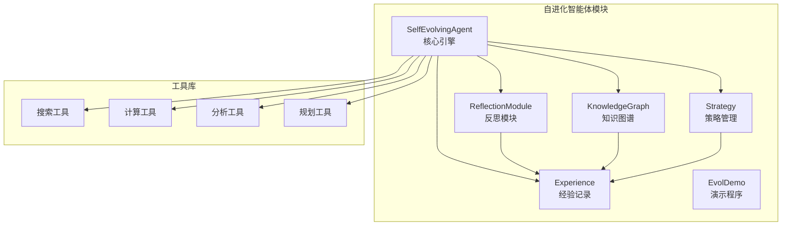
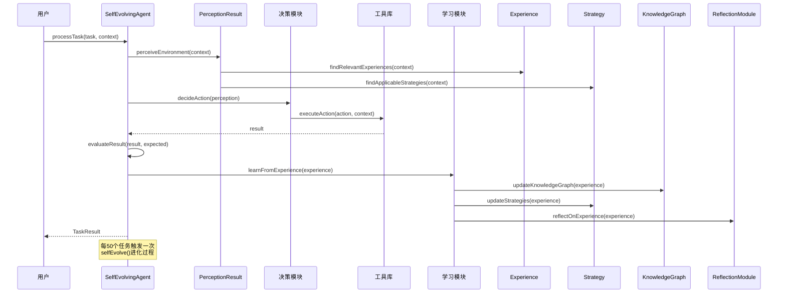
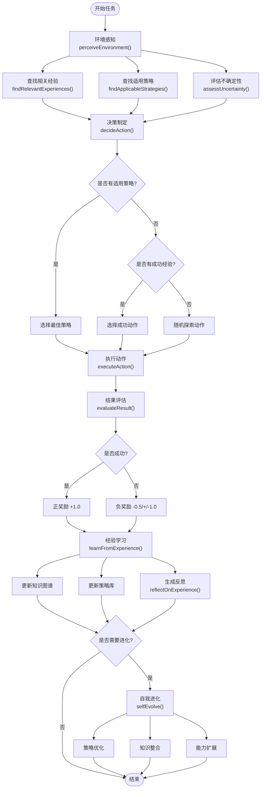
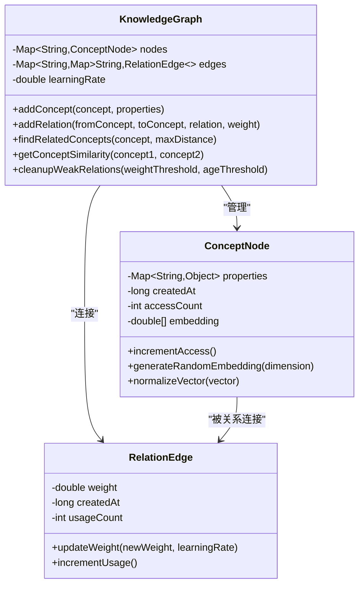
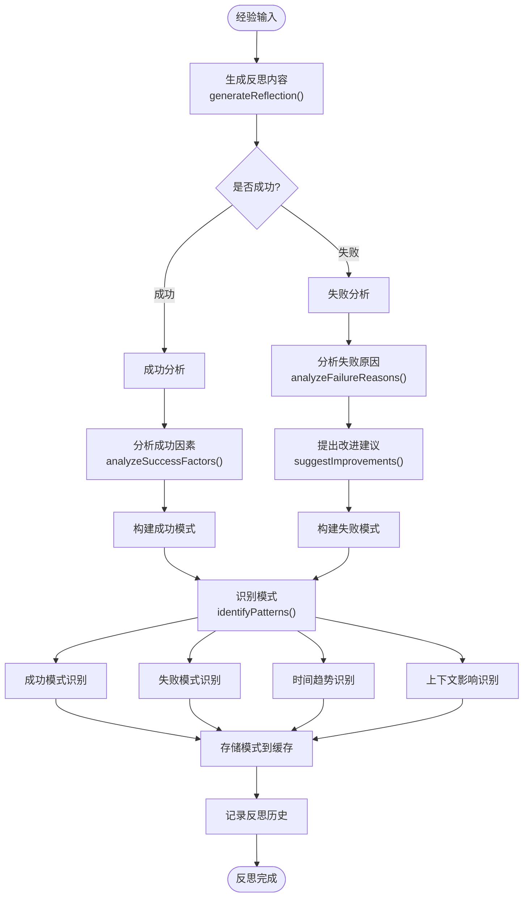
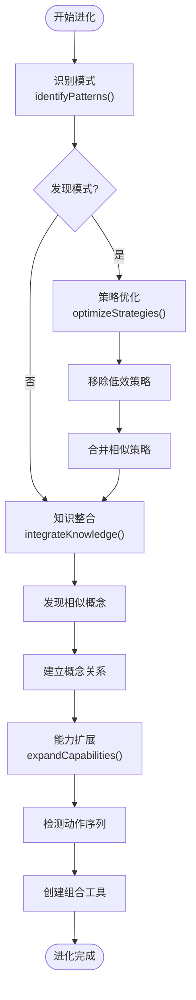

# 自进化智能体

<cite>
**本文档引用的文件**
- [SelfEvolvingAgent.java](file://tinyai-agent-evol/src/main/java/io/leavesfly/tinyai/agent/evol/SelfEvolvingAgent.java)
- [Experience.java](file://tinyai-agent-evol/src/main/java/io/leavesfly/tinyai/agent/evol/Experience.java)
- [KnowledgeGraph.java](file://tinyai-agent-evol/src/main/java/io/leavesfly/tinyai/agent/evol/KnowledgeGraph.java)
- [ReflectionModule.java](file://tinyai-agent-evol/src/main/java/io/leavesfly/tinyai/agent/evol/ReflectionModule.java)
- [Strategy.java](file://tinyai-agent-evol/src/main/java/io/leavesfly/tinyai/agent/evol/Strategy.java)
- [EvolDemo.java](file://tinyai-agent-evol/src/main/java/io/leavesfly/tinyai/agent/evol/EvolDemo.java)
- [README.md](file://tinyai-agent-evol/doc/README.md)
</cite>

## 目录
1. [简介](#简介)
2. [项目结构](#项目结构)
3. [核心组件](#核心组件)
4. [架构概览](#架构概览)
5. [详细组件分析](#详细组件分析)
6. [自我进化机制](#自我进化机制)
7. [性能考量](#性能考量)
8. [故障排除指南](#故障排除指南)
9. [结论](#结论)

## 简介

自进化智能体（SelfEvolvingAgent）是一个先进的自学习、自适应智能系统，具备经验记忆、策略优化、反思改进和知识图谱构建等核心自进化能力。该系统能够通过迭代学习不断提升任务完成质量，在多次任务执行中展现出明显的性能提升。

系统采用模块化设计，包含五个核心组件：Experience（经验记录）、Strategy（策略管理）、KnowledgeGraph（知识图谱）、ReflectionModule（反思模块）和SelfEvolvingAgent（自进化Agent）。每个组件都有明确的职责分工，共同构成了一个完整的自学习闭环。

## 项目结构



**图表来源**
- [SelfEvolvingAgent.java](file://tinyai-agent-evol/src/main/java/io/leavesfly/tinyai/agent/evol/SelfEvolvingAgent.java#L1-L50)
- [Experience.java](file://tinyai-agent-evol/src/main/java/io/leavesfly/tinyai/agent/evol/Experience.java#L1-L30)
- [Strategy.java](file://tinyai-agent-evol/src/main/java/io/leavesfly/tinyai/agent/evol/Strategy.java#L1-L30)

**章节来源**
- [README.md](file://tinyai-agent-evol/doc/README.md#L1-L50)

## 核心组件

### Experience类 - 经验记录

Experience类是系统的基础数据结构，用于存储Agent在执行任务过程中的完整经验数据。它包含了任务描述、上下文信息、执行动作、执行结果、成功状态、奖励值和时间戳等关键信息。

```java
public class Experience {
    private String task;
    private Map<String, Object> context;
    private String action;
    private Object result;
    private boolean success;
    private double reward;
    private long timestamp;
    private String reflection;
}
```

**核心特性：**
- **完整性**：记录任务执行的全过程
- **序列化支持**：支持Map格式转换，便于持久化
- **反思集成**：内置反思内容字段
- **时间追踪**：精确的时间戳记录

### Strategy类 - 策略管理

Strategy类负责管理Agent学习到的决策策略，包含策略名称、描述、适用条件、动作序列、成功率和使用次数等核心属性。

```java
public class Strategy {
    private String name;
    private String description;
    private Map<String, Object> conditions;
    private List<String> actions;
    private double successRate;
    private int usageCount;
}
```

**核心特性：**
- **动态更新**：基于成功率动态调整权重
- **智能匹配**：支持上下文条件匹配
- **不确定性推断**：根据上下文推断策略适用性
- **使用统计**：记录策略使用频次

### KnowledgeGraph类 - 知识图谱

KnowledgeGraph类构建和管理概念关系网络，采用图结构存储概念节点和关系边，支持概念相似度计算和相关概念发现。

```java
public class KnowledgeGraph {
    private Map<String, ConceptNode> nodes;
    private Map<String, Map<String, Map<String, RelationEdge>>> edges;
    private double learningRate;
}
```

**核心特性：**
- **概念嵌入**：每个概念节点包含128维嵌入向量
- **关系权重**：动态更新关系边的权重
- **相似度计算**：基于余弦相似度计算概念相似度
- **图搜索**：支持广度优先搜索发现相关概念

### ReflectionModule类 - 反思模块

ReflectionModule类负责分析经验、识别模式、生成学习洞察，是系统反思能力的核心组件。

```java
public class ReflectionModule {
    private List<ReflectionRecord> reflectionHistory;
    private Map<String, List<Pattern>> patternCache;
    private List<String> reflectionTemplates;
}
```

**核心特性：**
- **多维度分析**：成功/失败原因分析
- **模式识别**：识别行为模式和趋势
- **自动化反思**：基于模板生成反思内容
- **历史管理**：维护反思记录历史

**章节来源**
- [Experience.java](file://tinyai-agent-evol/src/main/java/io/leavesfly/tinyai/agent/evol/Experience.java#L1-L197)
- [Strategy.java](file://tinyai-agent-evol/src/main/java/io/leavesfly/tinyai/agent/evol/Strategy.java#L1-L287)
- [KnowledgeGraph.java](file://tinyai-agent-evol/src/main/java/io/leavesfly/tinyai/agent/evol/KnowledgeGraph.java#L1-L405)
- [ReflectionModule.java](file://tinyai-agent-evol/src/main/java/io/leavesfly/tinyai/agent/evol/ReflectionModule.java#L1-L579)

## 架构概览



**图表来源**
- [SelfEvolvingAgent.java](file://tinyai-agent-evol/src/main/java/io/leavesfly/tinyai/agent/evol/SelfEvolvingAgent.java#L600-L650)

## 详细组件分析

### SelfEvolvingAgent核心引擎

SelfEvolvingAgent是整个系统的核心控制器，负责协调各个组件的工作流程。它采用经典的感知-决策-执行-学习循环模式。



**图表来源**
- [SelfEvolvingAgent.java](file://tinyai-agent-evol/src/main/java/io/leavesfly/tinyai/agent/evol/SelfEvolvingAgent.java#L600-L729)

#### 环境感知机制

环境感知是Agent的第一步，通过分析当前上下文来决定后续行动。感知过程包括三个关键步骤：

1. **相关经验查找**：基于上下文相似度查找最近的相关经验
2. **适用策略识别**：根据条件匹配原则筛选适用策略
3. **不确定性评估**：评估任务复杂度和信息充分性

```java
public PerceptionResult perceiveEnvironment(Map<String, Object> context) {
    List<Experience> relevantExperiences = findRelevantExperiences(context);
    List<Strategy> applicableStrategies = findApplicableStrategies(context);
    double uncertaintyLevel = assessUncertainty(context);
    
    return new PerceptionResult(context, relevantExperiences, applicableStrategies, uncertaintyLevel);
}
```

#### 决策制定策略

Agent采用探索-利用平衡策略，在充分利用已知有效方法的同时保持适度的探索性。决策过程考虑以下因素：

- **策略成功率**：优先选择成功率高的策略
- **探索率**：控制探索与利用的比例
- **上下文匹配**：确保策略与当前情境匹配
- **经验借鉴**：参考成功经验选择动作

### KnowledgeGraph知识图谱

KnowledgeGraph采用图结构管理概念关系，支持高效的相似度计算和概念发现。



**图表来源**
- [KnowledgeGraph.java](file://tinyai-agent-evol/src/main/java/io/leavesfly/tinyai/agent/evol/KnowledgeGraph.java#L1-L100)

#### 概念相似度计算

系统使用余弦相似度计算概念间的语义相似度，基于128维嵌入向量进行比较：

```java
private double calculateCosineSimilarity(double[] vec1, double[] vec2) {
    if (vec1.length != vec2.length) {
        return 0.0;
    }
    
    double dotProduct = 0.0;
    double norm1 = 0.0;
    double norm2 = 0.0;
    
    for (int i = 0; i < vec1.length; i++) {
        dotProduct += vec1[i] * vec2[i];
        norm1 += vec1[i] * vec1[i];
        norm2 += vec2[i] * vec2[i];
    }
    
    norm1 = Math.sqrt(norm1);
    norm2 = Math.sqrt(norm2);
    
    return dotProduct / (norm1 * norm2);
}
```

#### 关系权重动态更新

关系边的权重采用指数移动平均法更新，结合学习率参数控制更新速度：

```java
public void updateWeight(double newWeight, double learningRate) {
    this.weight = (1 - learningRate) * this.weight + learningRate * newWeight;
    this.usageCount++;
}
```

### ReflectionModule反思模块

ReflectionModule负责深度分析Agent的经验，识别行为模式，生成学习洞察。



**图表来源**
- [ReflectionModule.java](file://tinyai-agent-evol/src/main/java/io/leavesfly/tinyai/agent/evol/ReflectionModule.java#L100-L200)

#### 模式识别算法

系统采用多种维度识别行为模式：

1. **成功模式**：识别高成功率的动作模式
2. **失败模式**：识别常见失败的任务-动作组合
3. **时间趋势**：分析性能随时间的变化趋势
4. **上下文影响**：识别特定上下文对成功率的影响

```java
private List<Pattern> identifySuccessPatterns(List<Experience> experiences) {
    Map<String, Integer> successfulActions = new HashMap<>();
    List<Experience> successfulExperiences = experiences.stream()
        .filter(Experience::isSuccess)
        .collect(Collectors.toList());
        
    for (Experience exp : successfulExperiences) {
        successfulActions.merge(exp.getAction(), 1, Integer::sum);
    }
    
    // 识别高成功率动作模式
    for (Map.Entry<String, Integer> entry : successfulActions.entrySet()) {
        String action = entry.getKey();
        int count = entry.getValue();
        
        if (count >= 3) {
            double successRate = calculateActionSuccessRate(action, experiences);
            if (successRate > 0.7) {
                Pattern pattern = new Pattern("success_action", 
                    String.format("高成功率动作模式：'%s'（成功率%.1f%%，成功%d次）", 
                                action, successRate * 100, count), 
                    successRate);
                patterns.add(pattern);
            }
        }
    }
    
    return patterns;
}
```

**章节来源**
- [SelfEvolvingAgent.java](file://tinyai-agent-evol/src/main/java/io/leavesfly/tinyai/agent/evol/SelfEvolvingAgent.java#L200-L400)
- [KnowledgeGraph.java](file://tinyai-agent-evol/src/main/java/io/leavesfly/tinyai/agent/evol/KnowledgeGraph.java#L200-L300)
- [ReflectionModule.java](file://tinyai-agent-evol/src/main/java/io/leavesfly/tinyai/agent/evol/ReflectionModule.java#L300-L450)

## 自我进化机制

### 进化周期触发

系统每处理50个任务后自动触发一次自我进化过程，确保Agent持续优化自身能力。

```java
public TaskResult processTask(String task, Map<String, Object> context) {
    // ... 任务处理逻辑 ...
    
    Experience experience = new Experience(task, context, action, result, success, reward);
    learnFromExperience(experience);
    
    // 每50个任务触发一次进化
    if (totalTasks % 50 == 0) {
        selfEvolve();
    }
    
    return new TaskResult(task, action, result, success, reward, experience.getReflection());
}
```

### 自我进化流程



**图表来源**
- [SelfEvolvingAgent.java](file://tinyai-agent-evol/src/main/java/io/leavesfly/tinyai/agent/evol/SelfEvolvingAgent.java#L650-L700)

#### 策略优化机制

策略优化通过移除低效策略和合并相似策略来提升整体性能：

```java
private void optimizeStrategies() {
    List<String> strategiesToRemove = strategies.entrySet().stream()
            .filter(entry -> {
                Strategy strategy = entry.getValue();
                return strategy.getUsageCount() > 10 && strategy.getSuccessRate() < 0.3;
            })
            .map(Map.Entry::getKey)
            .collect(Collectors.toList());
    
    strategiesToRemove.forEach(name -> {
        strategies.remove(name);
        logger.info("移除低效策略: " + name);
    });
}
```

#### 知识整合策略

知识整合通过发现概念间的潜在关联来丰富知识图谱：

```java
private void integrateKnowledge() {
    List<String> concepts = new ArrayList<>(knowledgeGraph.getNodes().keySet());
    
    for (int i = 0; i < concepts.size(); i++) {
        String concept1 = concepts.get(i);
        for (int j = i + 1; j < concepts.size(); j++) {
            String concept2 = concepts.get(j);
            double similarity = knowledgeGraph.getConceptSimilarity(concept1, concept2);
            
            if (similarity > 0.8) {
                knowledgeGraph.addRelation(concept1, concept2, "similar_to", similarity);
            }
        }
    }
}
```

#### 能力扩展机制

能力扩展基于成功模式创建新的工具组合：

```java
private void expandCapabilities() {
    List<Experience> successfulExperiences = experiences.stream()
            .skip(Math.max(0, experiences.size() - 50))
            .filter(Experience::isSuccess)
            .collect(Collectors.toList());
    
    Map<String, Integer> actionSequences = new HashMap<>();
    for (int i = 0; i < successfulExperiences.size() - 1; i++) {
        Experience current = successfulExperiences.get(i);
        Experience next = successfulExperiences.get(i + 1);
        
        if (current.getTimestamp() < next.getTimestamp()) {
            String sequence = current.getAction() + "->" + next.getAction();
            actionSequences.merge(sequence, 1, Integer::sum);
        }
    }
    
    actionSequences.entrySet().stream()
            .filter(entry -> entry.getValue() >= 3)
            .forEach(entry -> {
                String[] actions = entry.getKey().split("->");
                String comboName = "combo_" + actions[0] + "_" + actions[1];
                
                if (!availableTools.containsKey(comboName)) {
                    availableTools.put(comboName, createComboTool(actions[0], actions[1]));
                    logger.info("发现新的工具组合: " + comboName);
                }
            });
}
```

**章节来源**
- [SelfEvolvingAgent.java](file://tinyai-agent-evol/src/main/java/io/leavesfly/tinyai/agent/evol/SelfEvolvingAgent.java#L650-L729)

## 性能考量

### 内存管理策略

系统采用多种策略控制内存使用，确保长期运行的稳定性：

1. **经验库大小限制**：默认限制为1000条经验记录
2. **反思历史清理**：定期清理旧的反思记录
3. **知识图谱优化**：移除低权重关系边
4. **并发安全**：使用ConcurrentHashMap保证线程安全

```java
// 经验库大小限制
if (experiences.size() > memorySize) {
    experiences.remove(0);
}

// 反思历史清理
public void cleanupOldReflections(long ageThreshold) {
    long currentTime = System.currentTimeMillis();
    reflectionHistory.removeIf(record -> 
        (currentTime - record.getTimestamp()) > ageThreshold);
}

// 知识图谱清理
public void cleanupWeakRelations(double weightThreshold, long ageThreshold) {
    // 移除低权重或过期的关系
}
```

### 学习参数自适应调整

系统根据性能表现动态调整学习参数：

```java
private void adjustLearningParameters() {
    if (performanceHistory.size() >= 10) {
        List<PerformanceRecord> recent = performanceHistory.subList(
            performanceHistory.size() - 10, performanceHistory.size());
        double avgSuccessRate = recent.stream()
                .mapToDouble(PerformanceRecord::getSuccessRate)
                .average().orElse(0.0);
        
        if (avgSuccessRate < 0.6) {
            explorationRate = Math.min(0.5, explorationRate + 0.05);
        } else if (avgSuccessRate > 0.8) {
            explorationRate = Math.max(0.1, explorationRate - 0.02);
        }
    }
}
```

### 性能监控指标

系统提供全面的性能监控指标：

```java
public Map<String, Object> getPerformanceSummary() {
    PerformanceRecord latest = performanceHistory.get(performanceHistory.size() - 1);
    
    String trend = "insufficient_data";
    if (performanceHistory.size() >= 10) {
        double recentAvg = performanceHistory.stream()
                .skip(performanceHistory.size() - 10)
                .mapToDouble(PerformanceRecord::getSuccessRate)
                .average().orElse(0.0);
        double overallAvg = performanceHistory.stream()
                .mapToDouble(PerformanceRecord::getSuccessRate)
                .average().orElse(0.0);
        trend = recentAvg > overallAvg ? "improving" : "declining";
    }
    
    Map<String, Object> summary = new HashMap<>();
    summary.put("total_tasks", totalTasks);
    summary.put("successful_tasks", successfulTasks);
    summary.put("current_success_rate", latest.getSuccessRate());
    summary.put("trend", trend);
    summary.put("strategies_count", strategies.size());
    summary.put("experiences_count", experiences.size());
    summary.put("exploration_rate", explorationRate);
    summary.put("knowledge_concepts", knowledgeGraph.getNodes().size());
    
    return summary;
}
```

## 故障排除指南

### 常见问题及解决方案

#### 1. 学习效果不佳

**症状**：Agent成功率持续低于预期水平

**可能原因**：
- 探索率设置过低
- 知识图谱更新不及时
- 反思模块未能识别有效模式

**解决方案**：
```java
// 调整探索率
agent.getExplorationRate(); // 默认0.2，可适当提高至0.3-0.4

// 手动触发进化
agent.selfEvolve();

// 检查反思记录
ReflectionModule reflection = agent.getReflectionModule();
List<ReflectionRecord> recent = reflection.getReflectionSummary(10);
```

#### 2. 内存使用过高

**症状**：长时间运行后内存占用持续增长

**可能原因**：
- 经验库未及时清理
- 反思历史记录过多
- 知识图谱关系边未清理

**解决方案**：
```java
// 设置合理的内存限制
SelfEvolvingAgent agent = new SelfEvolvingAgent("Agent");
agent.setMemorySize(500); // 减少经验库大小

// 定期清理知识图谱
KnowledgeGraph kg = agent.getKnowledgeGraph();
kg.cleanupWeakRelations(0.1, 30 * 24 * 60 * 60 * 1000); // 清理弱关系和过期关系
```

#### 3. 策略选择偏差

**症状**：Agent总是选择相同的策略，缺乏多样性

**可能原因**：
- 策略成功率计算偏差
- 探索率设置过低
- 上下文匹配过于严格

**解决方案**：
```java
// 增加探索率
agent.setExplorationRate(0.3);

// 检查策略匹配条件
Map<String, Strategy> strategies = agent.getStrategies();
strategies.values().forEach(strategy -> {
    System.out.println("策略: " + strategy.getName() + 
                      ", 匹配条件: " + strategy.getConditions());
});
```

### 最佳实践建议

#### 1. 经验数据管理

- **定期清理**：设置合理的经验库大小限制
- **重要性排序**：基于奖励值对经验进行优先级排序
- **长期保存**：对于重要的成功经验应长期保存

#### 2. 知识图谱更新策略

- **动态权重**：根据使用频率动态调整关系权重
- **相似度阈值**：合理设置概念相似度阈值
- **关系清理**：定期清理低权重关系边

#### 3. 反射频率配置

- **任务间隔**：每50个任务触发一次进化
- **性能阈值**：当成功率低于60%时增加反射频率
- **手动触发**：在关键任务完成后手动触发进化

#### 4. 防止过度拟合

- **探索平衡**：保持适当的探索率
- **多样化策略**：鼓励策略多样性
- **交叉验证**：在不同任务上验证策略有效性

**章节来源**
- [SelfEvolvingAgent.java](file://tinyai-agent-evol/src/main/java/io/leavesfly/tinyai/agent/evol/SelfEvolvingAgent.java#L500-L600)
- [KnowledgeGraph.java](file://tinyai-agent-evol/src/main/java/io/leavesfly/tinyai/agent/evol/KnowledgeGraph.java#L300-L405)

## 结论

自进化智能体（SelfEvolvingAgent）是一个功能完整、设计精良的自学习系统，成功实现了Python参考实现的所有核心功能，并针对Java生态系统进行了优化。系统具备以下主要优势：

### 技术创新点

1. **完整的自学习闭环**：从经验积累到策略优化再到知识整合，形成了完整的自学习循环
2. **模块化设计**：清晰的职责分离，便于维护和扩展
3. **内存高效实现**：减少第三方依赖，使用基础Java数据结构
4. **实时学习能力**：每任务执行后立即学习，支持在线优化

### 核心能力总结

- **经验记忆**：完整记录任务执行的全过程
- **策略优化**：基于成功率动态调整策略权重
- **反思改进**：深度分析成功失败原因，识别行为模式
- **知识图谱**：构建概念关系网络，支持语义推理
- **自我进化**：定期优化策略、整合知识、扩展能力

### 应用价值

该系统为智能Agent的发展提供了宝贵的参考实现，展示了Java在AI领域的应用潜力。其模块化的设计使得开发者可以根据具体需求定制和扩展功能，为复杂智能系统的开发奠定了坚实基础。

### 发展方向

未来可以考虑以下发展方向：
- **工具库扩展**：添加更多专业工具和外部API集成
- **学习算法优化**：引入更先进的强化学习算法
- **知识图谱增强**：支持更复杂的关系类型和推理能力
- **持久化支持**：实现Agent状态的保存和加载
- **分布式架构**：支持多Agent协同学习和知识共享

通过持续的优化和扩展，自进化智能体将成为一个更加成熟和强大的智能系统平台。