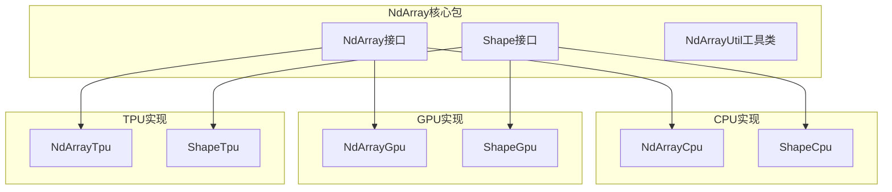
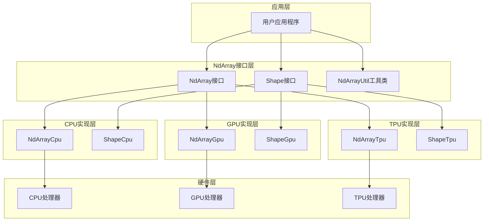
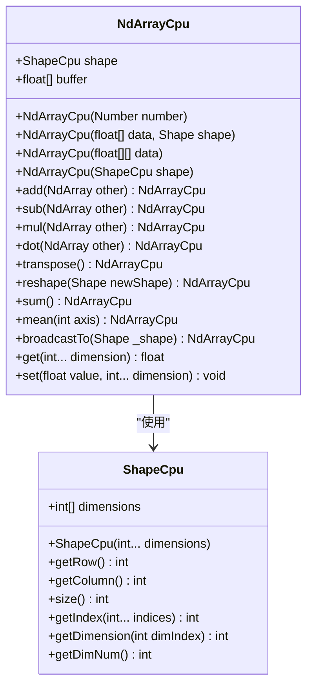
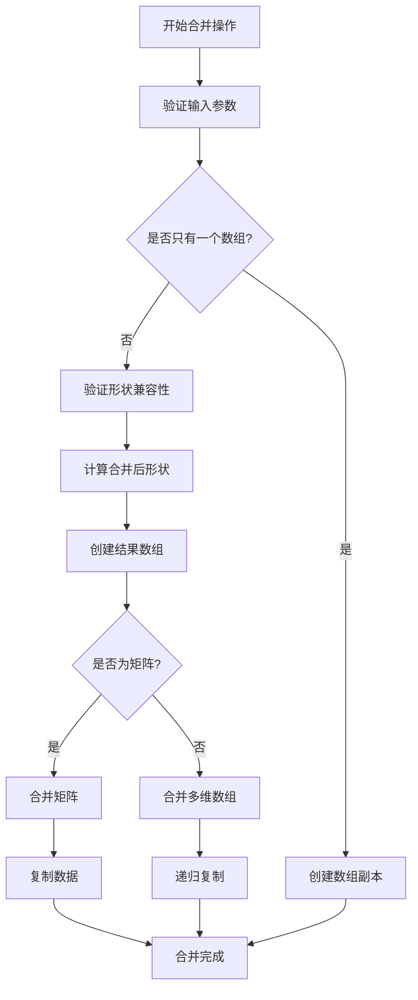
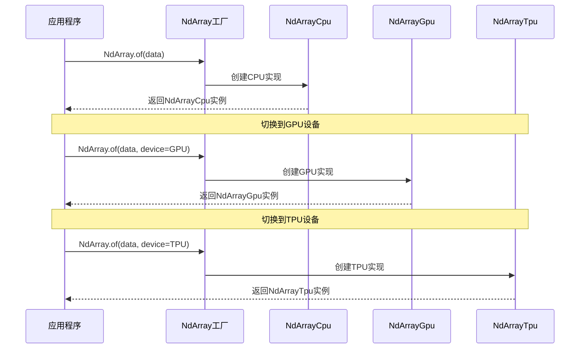
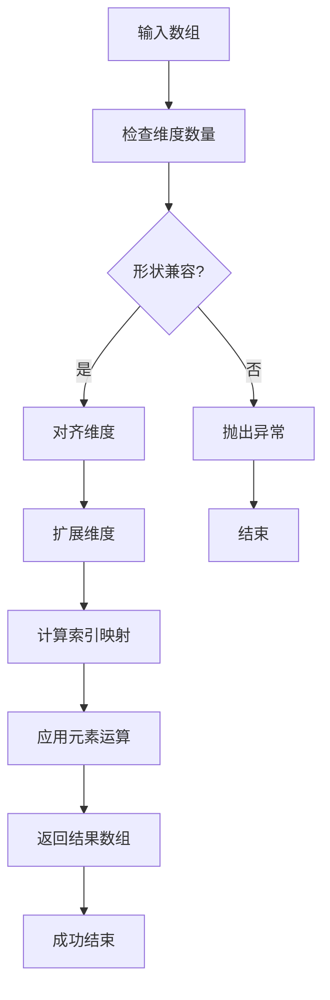
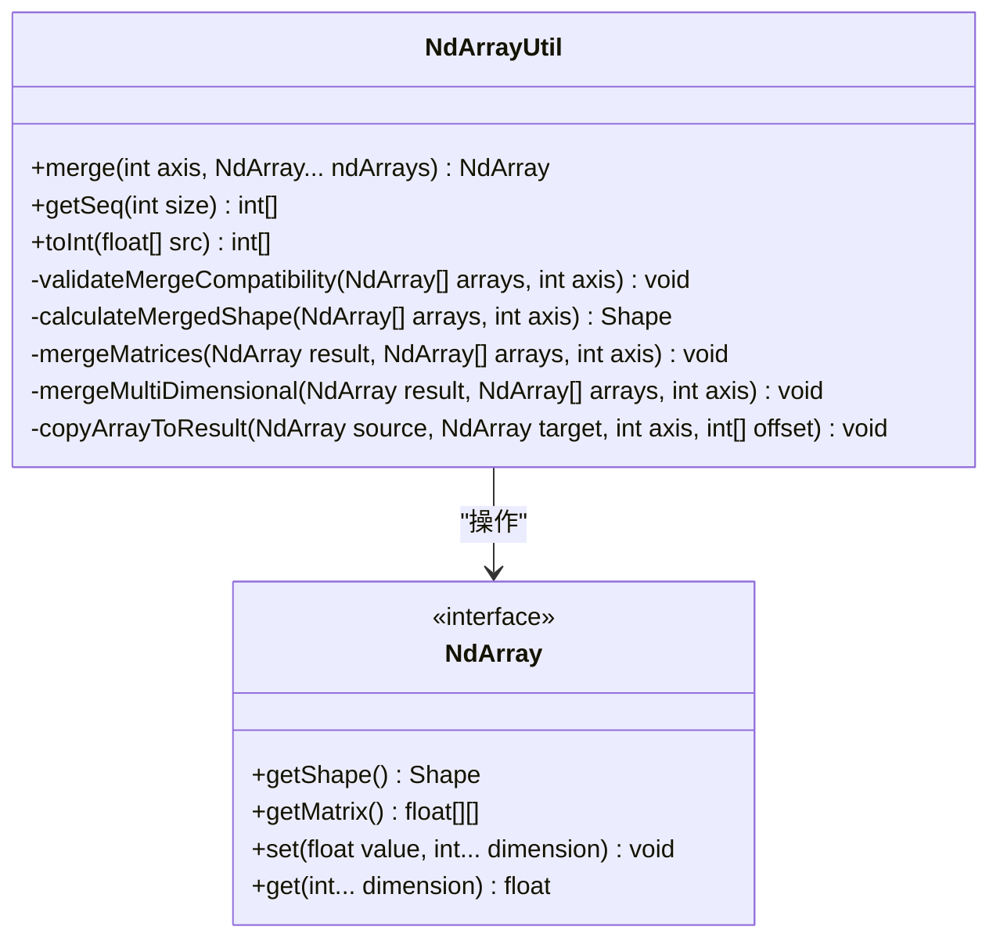

# NdArray多维数组库

<cite>
**本文档中引用的文件**
- [NdArray.java](file://tinyai-dl-ndarr/src/main/java/io/leavesfly/tinyai/ndarr/NdArray.java)
- [Shape.java](file://tinyai-dl-ndarr/src/main/java/io/leavesfly/tinyai/ndarr/Shape.java)
- [NdArrayUtil.java](file://tinyai-dl-ndarr/src/main/java/io/leavesfly/tinyai/ndarr/NdArrayUtil.java)
- [NdArrayCpu.java](file://tinyai-dl-ndarr/src/main/java/io/leavesfly/tinyai/ndarr/cpu/NdArrayCpu.java)
- [NdArrayGpu.java](file://tinyai-dl-ndarr/src/main/java/io/leavesfly/tinyai/ndarr/gpu/NdArrayGpu.java)
- [NdArrayTpu.java](file://tinyai-dl-ndarr/src/main/java/io/leavesfly/tinyai/ndarr/tpu/NdArrayTpu.java)
- [ShapeCpu.java](file://tinyai-dl-ndarr/src/main/java/io/leavesfly/tinyai/ndarr/cpu/ShapeCpu.java)
- [ShapeGpu.java](file://tinyai-dl-ndarr/src/main/java/io/leavesfly/tinyai/ndarr/gpu/ShapeGpu.java)
- [ShapeTpu.java](file://tinyai-dl-ndarr/src/main/java/io/leavesfly/tinyai/ndarr/tpu/ShapeTpu.java)
- [NdArrayTest.java](file://tinyai-dl-ndarr/src/test/java/io/leavesfly/tinyai/ndarr/NdArrayTest.java)
- [TestBroadcast.java](file://tinyai-dl-ndarr/src/test/java/io/leavesfly/tinyai/ndarr/TestBroadcast.java)
- [TestBroadcastTo.java](file://tinyai-dl-ndarr/src/test/java/io/leavesfly/tinyai/ndarr/TestBroadcastTo.java)
</cite>

## 目录
1. [简介](#简介)
2. [项目结构](#项目结构)
3. [核心组件](#核心组件)
4. [架构概览](#架构概览)
5. [详细组件分析](#详细组件分析)
6. [跨设备实现机制](#跨设备实现机制)
7. [广播机制详解](#广播机制详解)
8. [NdArrayUtil工具类](#ndarrayutil工具类)
9. [性能考虑](#性能考虑)
10. [故障排除指南](#故障排除指南)
11. [结论](#结论)

## 简介

NdArray多维数组库是TinyAI深度学习框架的核心数据结构，专门设计用于支持CPU、GPU和TPU三种不同的计算设备。该库提供了完整的多维数组操作功能，包括基础数学运算、矩阵操作、广播机制以及高效的内存管理。

NdArray库采用接口驱动的设计模式，通过统一的NdArray接口定义了所有数组操作，同时为不同硬件平台提供了专门的实现类。这种设计使得应用程序可以在不同的计算设备之间无缝切换，而无需修改业务逻辑代码。

## 项目结构

NdArray库位于`tinyai-dl-ndarr`模块中，具有清晰的分层架构：



**图表来源**
- [NdArray.java](file://tinyai-dl-ndarr/src/main/java/io/leavesfly/tinyai/ndarr/NdArray.java#L1-L10)
- [Shape.java](file://tinyai-dl-ndarr/src/main/java/io/leavesfly/tinyai/ndarr/Shape.java#L1-L10)

**章节来源**
- [NdArray.java](file://tinyai-dl-ndarr/src/main/java/io/leavesfly/tinyai/ndarr/NdArray.java#L1-L50)
- [Shape.java](file://tinyai-dl-ndarr/src/main/java/io/leavesfly/tinyai/ndarr/Shape.java#L1-L50)

## 核心组件

### NdArray接口

NdArray接口定义了多维数组的所有核心操作，包括创建、数学运算、矩阵操作和统计功能。该接口采用静态工厂方法模式，提供了多种便捷的数组创建方式。

主要功能分类：
- **创建函数**：支持标量、向量、矩阵等多种数据类型的创建
- **静态工厂方法**：提供zeros、ones、eye等常用数组创建方法
- **基础四则运算**：add、sub、mul、div等元素级运算
- **逻辑运算**：eq、gt、lt等比较运算
- **数学函数**：pow、sqrt、exp、sin等数学运算
- **张量变形**：transpose、reshape、flatten等形状变换
- **统计聚合**：sum、mean、var等统计运算
- **广播机制**：broadcastTo、sumTo等广播操作

### Shape接口

Shape接口负责管理多维数组的维度信息，提供了维度查询、索引计算和形状验证等功能。它支持任意维度的数组，并提供了高效的索引计算算法。

关键特性：
- 支持任意维度的数组形状管理
- 提供维度大小查询和验证
- 实现多维索引到一维索引的高效转换
- 支持形状兼容性检查

### NdArrayUtil工具类

NdArrayUtil提供了静态的辅助方法，主要用于数组操作的高级功能，如数组合并、类型转换等。

**章节来源**
- [NdArray.java](file://tinyai-dl-ndarr/src/main/java/io/leavesfly/tinyai/ndarr/NdArray.java#L1-L100)
- [Shape.java](file://tinyai-dl-ndarr/src/main/java/io/leavesfly/tinyai/ndarr/Shape.java#L1-L89)
- [NdArrayUtil.java](file://tinyai-dl-ndarr/src/main/java/io/leavesfly/tinyai/ndarr/NdArrayUtil.java#L1-L50)

## 架构概览

NdArray库采用了分层架构设计，通过接口抽象和具体实现分离的方式，实现了跨设备的统一操作接口：



**图表来源**
- [NdArray.java](file://tinyai-dl-ndarr/src/main/java/io/leavesfly/tinyai/ndarr/NdArray.java#L1-L20)
- [NdArrayCpu.java](file://tinyai-dl-ndarr/src/main/java/io/leavesfly/tinyai/ndarr/cpu/NdArrayCpu.java#L1-L30)

## 详细组件分析

### NdArrayCpu实现

NdArrayCpu是NdArray接口的主要实现类，专为CPU计算优化。它采用了扁平化的内存布局，使用一维float数组存储多维数据，这种设计大大提高了缓存局部性和计算效率。



**图表来源**
- [NdArrayCpu.java](file://tinyai-dl-ndarr/src/main/java/io/leavesfly/tinyai/ndarr/cpu/NdArrayCpu.java#L20-L100)
- [ShapeCpu.java](file://tinyai-dl-ndarr/src/main/java/io/leavesfly/tinyai/ndarr/cpu/ShapeCpu.java#L1-L50)

#### 内存布局优化

NdArrayCpu采用了C语言风格的行优先内存布局，这种布局方式具有以下优势：

1. **缓存友好**：相邻元素在内存中连续存储，提高缓存命中率
2. **向量化支持**：便于利用SIMD指令集进行向量化计算
3. **索引计算简单**：通过简单的数学运算即可计算多维索引

#### 性能优化策略

- **批量操作**：支持批量元素访问和修改，减少方法调用开销
- **就地操作**：部分操作支持就地修改，避免额外的内存分配
- **循环展开**：在关键路径上使用循环展开技术提高性能

**章节来源**
- [NdArrayCpu.java](file://tinyai-dl-ndarr/src/main/java/io/leavesfly/tinyai/ndarr/cpu/NdArrayCpu.java#L1-L200)

### NdArrayUtil工具类分析

NdArrayUtil提供了丰富的辅助功能，特别是数组合并操作，这是深度学习中常见的需求。



**图表来源**
- [NdArrayUtil.java](file://tinyai-dl-ndarr/src/main/java/io/leavesfly/tinyai/ndarr/NdArrayUtil.java#L15-L100)

#### 合并算法实现

NdArrayUtil的merge方法支持任意维度的数组合并，具有以下特点：

1. **动态形状计算**：根据输入数组动态计算合并后的形状
2. **递归处理**：对于多维数组使用递归算法处理
3. **内存优化**：避免不必要的内存拷贝，直接在目标数组上操作
4. **错误处理**：完善的参数验证和错误处理机制

**章节来源**
- [NdArrayUtil.java](file://tinyai-dl-ndarr/src/main/java/io/leavesfly/tinyai/ndarr/NdArrayUtil.java#L1-L247)

## 跨设备实现机制

### 设备抽象设计

NdArray库通过接口抽象实现了跨设备的统一操作。虽然目前GPU和TPU的实现尚未完全完成，但架构设计已经预留了扩展空间。



**图表来源**
- [NdArray.java](file://tinyai-dl-ndarr/src/main/java/io/leavesfly/tinyai/ndarr/NdArray.java#L10-L50)
- [NdArrayCpu.java](file://tinyai-dl-ndarr/src/main/java/io/leavesfly/tinyai/ndarr/cpu/NdArrayCpu.java#L1-L30)

### 设备特定优化

#### CPU优化策略
- **SIMD指令**：利用现代CPU的向量指令集加速计算
- **内存对齐**：确保数据在内存中的正确对齐，提高缓存效率
- **分支预测**：优化条件判断，减少分支预测失败

#### GPU优化策略（待实现）
- **并行计算**：利用GPU的海量并行计算能力
- **内存带宽**：优化GPU内存访问模式，最大化内存带宽利用率
- **核函数设计**：设计高效的CUDA核函数

#### TPU优化策略（待实现）
- **专用指令**：利用TPU的专用神经网络指令
- **混合精度**：支持FP16/BF16等低精度计算
- **流水线处理**：实现高效的流水线并行计算

**章节来源**
- [NdArrayCpu.java](file://tinyai-dl-ndarr/src/main/java/io/leavesfly/tinyai/ndarr/cpu/NdArrayCpu.java#L1-L100)
- [NdArrayGpu.java](file://tinyai-dl-ndarr/src/main/java/io/leavesfly/tinyai/ndarr/gpu/NdArrayGpu.java#L1-L50)
- [NdArrayTpu.java](file://tinyai-dl-ndarr/src/main/java/io/leavesfly/tinyai/ndarr/tpu/NdArrayTpu.java#L1-L50)

## 广播机制详解

广播机制是NdArray库的重要特性之一，它允许不同形状的数组进行元素级运算。广播机制遵循以下规则：

### 广播规则

1. **维度对齐**：从末尾维度开始向前对齐
2. **兼容性检查**：如果两个维度的大小相同，或者其中一个维度大小为1，则兼容
3. **广播扩展**：将大小为1的维度扩展到匹配的大小



**图表来源**
- [NdArrayCpu.java](file://tinyai-dl-ndarr/src/main/java/io/leavesfly/tinyai/ndarr/cpu/NdArrayCpu.java#L1139-L1200)

### 广播实现细节

广播机制的核心在于索引映射算法，它需要将源数组的索引映射到目标数组的相应位置：

```java
// 广播兼容性检查示例
for (int i = 0; i < this.shape.getDimNum(); i++) {
    int srcDimIndex = this.shape.getDimNum() - 1 - i;
    int dstDimIndex = _shape.getDimNum() - 1 - i;
    
    int srcDim = this.shape.getDimension(srcDimIndex);
    int dstDim = _shape.getDimension(dstDimIndex);
    
    // 检查广播兼容性
    if (!(srcDim == dstDim || srcDim == 1 || dstDim == 1)) {
        throw new IllegalArgumentException("形状不兼容");
    }
}
```

### 广播应用场景

1. **标量运算**：将标量与数组进行运算
2. **向量运算**：将向量与矩阵进行运算
3. **批处理**：在批次维度上进行广播
4. **激活函数**：在神经网络中应用激活函数

**章节来源**
- [NdArrayCpu.java](file://tinyai-dl-ndarr/src/main/java/io/leavesfly/tinyai/ndarr/cpu/NdArrayCpu.java#L1139-L1250)
- [TestBroadcast.java](file://tinyai-dl-ndarr/src/test/java/io/leavesfly/tinyai/ndarr/TestBroadcast.java#L1-L33)
- [TestBroadcastTo.java](file://tinyai-dl-ndarr/src/test/java/io/leavesfly/tinyai/ndarr/TestBroadcastTo.java#L1-L32)

## NdArrayUtil工具类

NdArrayUtil提供了许多实用的辅助功能，特别是在数组操作方面。以下是几个重要的功能模块：

### 数组合并功能



**图表来源**
- [NdArrayUtil.java](file://tinyai-dl-ndarr/src/main/java/io/leavesfly/tinyai/ndarr/NdArrayUtil.java#L10-L50)

### 辅助功能

1. **序列生成**：`getSeq(int size)`生成从0开始的连续整数序列
2. **类型转换**：`toInt(float[] src)`将浮点数组转换为整型数组
3. **索引计算**：提供多维索引到一维索引的转换功能

**章节来源**
- [NdArrayUtil.java](file://tinyai-dl-ndarr/src/main/java/io/leavesfly/tinyai/ndarr/NdArrayUtil.java#L1-L247)

## 性能考虑

### 内存布局优化

NdArray库采用了扁平化的内存布局，这种设计带来了以下性能优势：

1. **缓存局部性**：相邻元素在内存中连续存储，提高缓存命中率
2. **内存预取**：CPU可以更有效地预取数据
3. **向量化计算**：便于利用SIMD指令集进行向量化操作

### 计算优化策略

1. **就地操作**：部分操作支持就地修改，避免额外的内存分配
2. **批量处理**：支持批量元素访问和修改，减少方法调用开销
3. **循环优化**：在关键路径上使用循环展开和向量化技术

### 内存管理

1. **引用计数**：跟踪数组的引用次数，及时释放不再使用的内存
2. **内存池**：使用内存池技术减少频繁的内存分配和释放
3. **垃圾回收**：合理利用Java的垃圾回收机制

## 故障排除指南

### 常见错误类型

1. **形状不匹配错误**
   - 错误信息：`IllegalArgumentException: 形状不匹配`
   - 解决方案：检查数组的维度和大小是否符合运算要求

2. **维度越界错误**
   - 错误信息：`IndexOutOfBoundsException: 索引超出范围`
   - 解决方案：验证索引值是否在有效范围内

3. **设备不兼容错误**
   - 错误信息：`UnsupportedOperationException: 设备不支持`
   - 解决方案：确认目标设备是否已实现相应的功能

### 调试技巧

1. **形状验证**：使用`getShape()`方法检查数组的形状
2. **数据检查**：使用`getMatrix()`或`get()`方法检查数据内容
3. **逐步调试**：将复杂操作分解为多个简单步骤进行调试

**章节来源**
- [NdArrayTest.java](file://tinyai-dl-ndarr/src/test/java/io/leavesfly/tinyai/ndarr/NdArrayTest.java#L1-L100)

## 结论

NdArray多维数组库是TinyAI框架的核心组件，它通过精心设计的架构实现了跨设备的统一操作接口。库的主要优势包括：

1. **统一接口**：通过接口抽象实现了跨设备的统一操作
2. **高性能**：采用扁平化内存布局和多种优化策略
3. **功能完整**：提供了丰富的数学运算和矩阵操作功能
4. **易于使用**：提供了简洁的API和便捷的工厂方法

虽然目前GPU和TPU的实现还在开发中，但架构设计已经为未来的扩展做好了准备。随着这些实现的完成，NdArray库将能够充分发挥各种计算设备的优势，为深度学习应用提供强大的计算基础。

对于开发者而言，NdArray库提供了简单易用的API，同时保持了高性能和灵活性。无论是进行科学计算、机器学习还是深度学习，NdArray库都能满足各种需求，是一个值得信赖的多维数组解决方案。