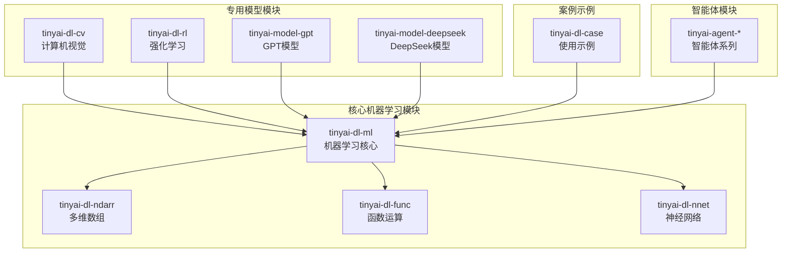
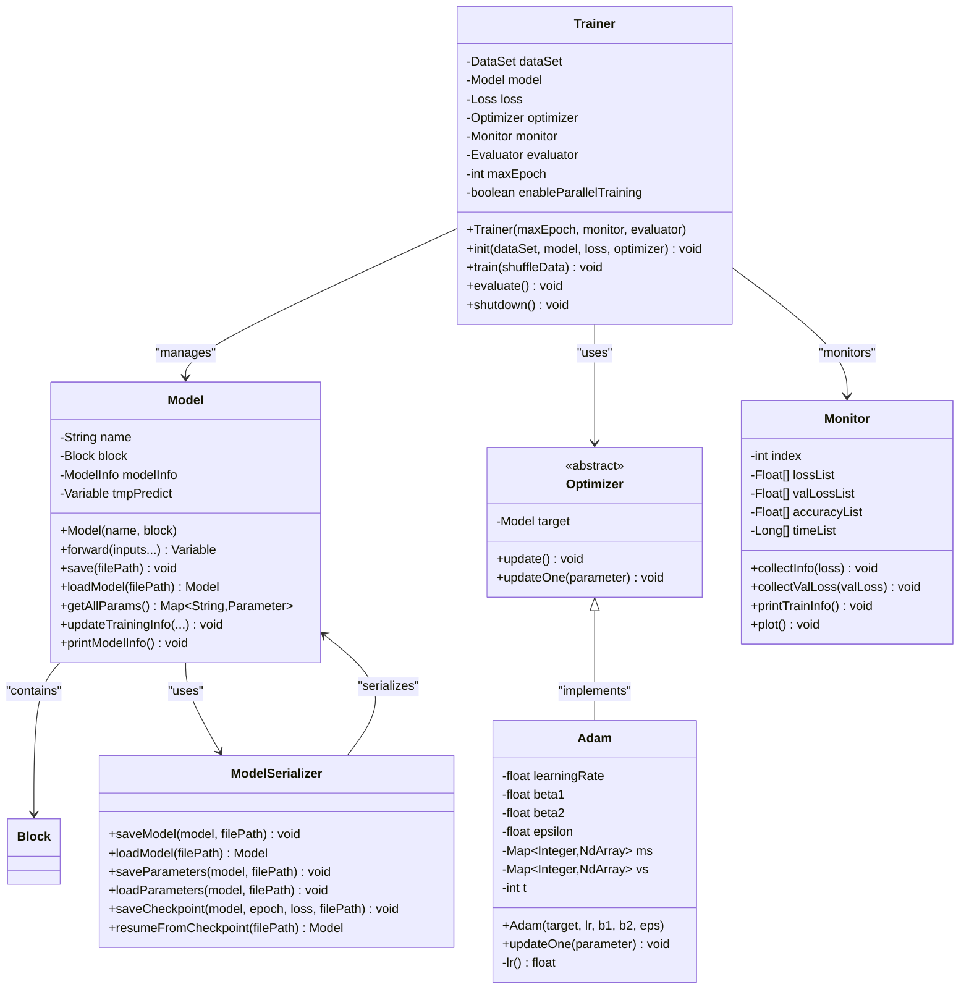
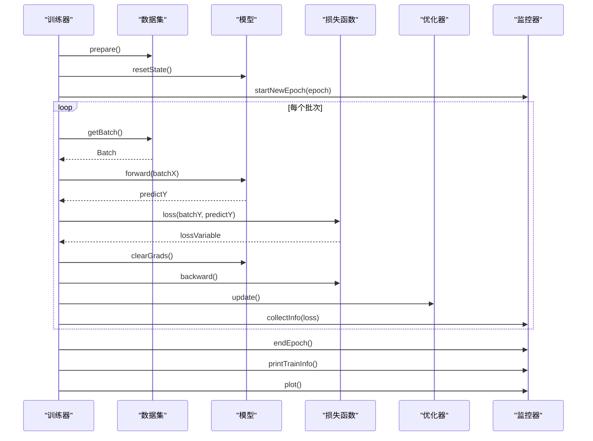
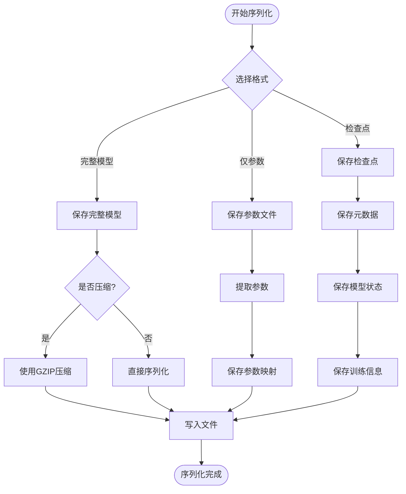
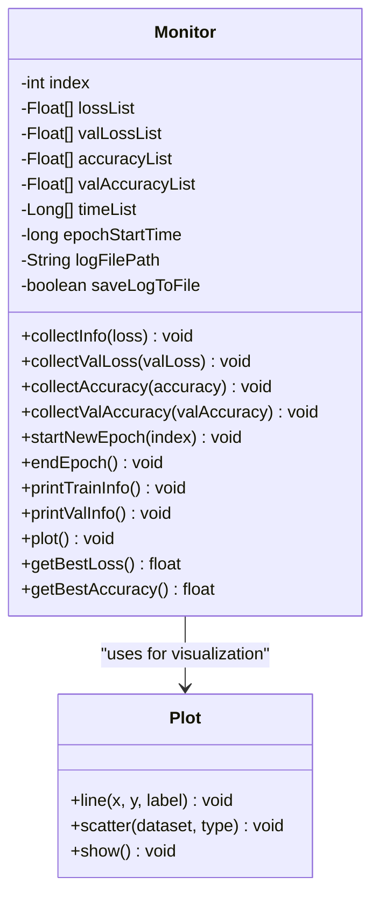
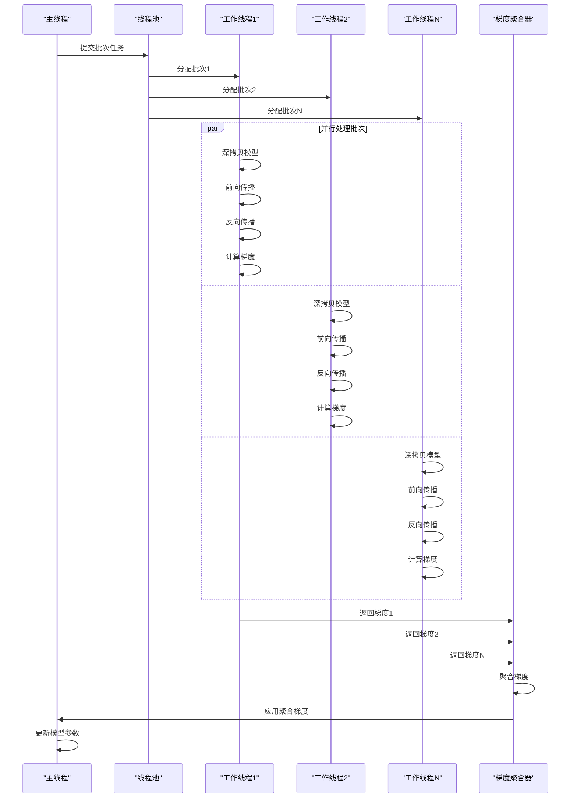

# 机器学习核心系统

<cite>
**本文档引用的文件**
- [Model.java](file://tinyai-dl-ml/src/main/java/io/leavesfly/tinyai/ml/Model.java)
- [Trainer.java](file://tinyai-dl-ml/src/main/java/io/leavesfly/tinyai/ml/Trainer.java)
- [Adam.java](file://tinyai-dl-ml/src/main/java/io/leavesfly/tinyai/ml/optimize/Adam.java)
- [ModelSerializer.java](file://tinyai-dl-ml/src/main/java/io/leavesfly/tinyai/ml/ModelSerializer.java)
- [Monitor.java](file://tinyai-dl-ml/src/main/java/io/leavesfly/tinyai/ml/Monitor.java)
- [ModelSerializationExample.java](file://tinyai-dl-case/src/main/java/io/leavesfly/tinyai/example/ModelSerializationExample.java)
- [MonitorExample.java](file://tinyai-dl-case/src/main/java/io/leavesfly/tinyai/example/MonitorExample.java)
- [SpiralMlpExam.java](file://tinyai-dl-case/src/main/java/io/leavesfly/tinyai/example/classify/SpiralMlpExam.java)
- [ParallelTrainingUtils.java](file://tinyai-dl-ml/src/main/java/io/leavesfly/tinyai/ml/parallel/ParallelTrainingUtils.java)
</cite>

## 目录
1. [简介](#简介)
2. [项目结构概览](#项目结构概览)
3. [核心组件架构](#核心组件架构)
4. [Model类详解](#model类详解)
5. [Trainer类训练循环](#trainer类训练循环)
6. [优化器实现机制](#优化器实现机制)
7. [模型序列化系统](#模型序列化系统)
8. [训练监控系统](#训练监控系统)
9. [并行训练架构](#并行训练架构)
10. [完整使用示例](#完整使用示例)
11. [性能调优指南](#性能调优指南)
12. [故障排查手册](#故障排查手册)
13. [总结](#总结)

## 简介

TinyAI机器学习核心系统是一个完整的深度学习框架，提供了从模型定义到训练评估的全套功能。该系统采用模块化设计，将模型参数管理、训练流程控制、优化算法实现、序列化存储等功能分离到不同的组件中，形成了一个高度可扩展和易于使用的机器学习平台。

系统的核心设计理念是简洁性和易用性，通过统一的接口和清晰的抽象层次，让开发者能够专注于模型的设计和训练，而无需关心底层的实现细节。同时，系统还提供了丰富的工具和实用程序，支持从简单的线性回归到复杂的深度神经网络的各种应用场景。

## 项目结构概览



**图表来源**
- [Model.java](file://tinyai-dl-ml/src/main/java/io/leavesfly/tinyai/ml/Model.java#L1-L361)
- [Trainer.java](file://tinyai-dl-ml/src/main/java/io/leavesfly/tinyai/ml/Trainer.java#L1-L495)

**章节来源**
- [Model.java](file://tinyai-dl-ml/src/main/java/io/leavesfly/tinyai/ml/Model.java#L1-L50)
- [Trainer.java](file://tinyai-dl-ml/src/main/java/io/leavesfly/tinyai/ml/Trainer.java#L1-L50)

## 核心组件架构



**图表来源**
- [Model.java](file://tinyai-dl-ml/src/main/java/io/leavesfly/tinyai/ml/Model.java#L25-L100)
- [Trainer.java](file://tinyai-dl-ml/src/main/java/io/leavesfly/tinyai/ml/Trainer.java#L35-L80)
- [Adam.java](file://tinyai-dl-ml/src/main/java/io/leavesfly/tinyai/ml/optimize/Adam.java#L15-L50)
- [ModelSerializer.java](file://tinyai-dl-ml/src/main/java/io/leavesfly/tinyai/ml/ModelSerializer.java#L15-L50)
- [Monitor.java](file://tinyai-dl-ml/src/main/java/io/leavesfly/tinyai/ml/Monitor.java#L20-L60)

## Model类详解

Model类是TinyDL框架中模型的核心表示，它封装了神经网络的完整生命周期管理功能。该类不仅负责模型的结构定义，还提供了模型的序列化、参数管理和推理功能。

### 模型结构封装

Model类通过Block对象来封装神经网络的架构。Block是神经网络的基本构建单元，可以是简单的全连接层、卷积层，也可以是复杂的序列到序列模型或Transformer架构。这种设计使得模型的定义变得非常灵活和模块化。

```java
// 创建模型时指定名称和架构
Block block = new MlpBlock("MlpBlock", batchSize, null, inputSize, hiddenSize, outputSize);
Model model = new Model("ClassificationModel", block);
```

### 模型信息管理

Model类内部维护了一个ModelInfo对象，用于跟踪模型的元数据信息。这些信息包括输入输出形状、参数数量、架构类型、训练历史等重要信息。

```java
private void initializeModelInfo() {
    if (block != null) {
        modelInfo.setInputShape(block.getInputShape());
        modelInfo.setOutputShape(block.getOutputShape());

        // 统计参数数量
        Map<String, Parameter> params = block.getAllParams();
        long totalParams = 0;
        for (Parameter param : params.values()) {
            totalParams += param.getValue().getShape().size();
        }
        modelInfo.setTotalParameters(totalParams);

        // 设置架构类型
        String blockClassName = block.getClass().getSimpleName();
        modelInfo.setArchitectureType(blockClassName);
    }
}
```

### 序列化机制

Model类提供了多种序列化方式，支持完整模型保存、参数单独保存、压缩保存和检查点保存等功能。这些功能通过ModelSerializer类实现，确保了模型的跨平台兼容性和持久化存储能力。

**章节来源**
- [Model.java](file://tinyai-dl-ml/src/main/java/io/leavesfly/tinyai/ml/Model.java#L40-L120)
- [Model.java](file://tinyai-dl-ml/src/main/java/io/leavesfly/tinyai/ml/Model.java#L150-L200)

## Trainer类训练循环

Trainer类是TinyDL框架中模型训练的核心控制器，它协调数据加载、前向传播、损失计算、反向传播和参数更新的完整训练循环。该类支持单线程和并行训练两种模式，能够适应不同的硬件环境和性能需求。

### 训练流程管理



**图表来源**
- [Trainer.java](file://tinyai-dl-ml/src/main/java/io/leavesfly/tinyai/ml/Trainer.java#L130-L180)
- [Trainer.java](file://tinyai-dl-ml/src/main/java/io/leavesfly/tinyai/ml/Trainer.java#L200-L250)

### 单线程训练实现

单线程训练是最基础的训练模式，它按照批次顺序依次处理数据，确保训练过程的确定性和可重现性。这种模式适合小规模数据集和调试阶段。

```java
public void singleThreadTrain(boolean shuffleData) {
    DataSet trainDataSet = dataSet.getTrainDataSet();
    if (shuffleData) {
        trainDataSet.shuffle();
    }

    for (int i = 0; i < maxEpoch; i++) {
        model.resetState();
        monitor.startNewEpoch(i);

        List<Batch> batches = trainDataSet.getBatches();
        float lossSum = 0f;
        float accSum = 0f;

        for (Batch batch : batches) {
            Variable variableX = batch.toVariableX().setName("x").setRequireGrad(false);
            Variable variableY = batch.toVariableY().setName("y").setRequireGrad(false);

            Variable predictY = model.forward(variableX);
            Variable lossVariable = loss.loss(variableY, predictY);
            lossVariable.setName("loss");

            model.clearGrads();
            lossSum += lossVariable.getValue().getNumber().floatValue();

            lossVariable.backward();
            optimizer.update();
            lossVariable.unChainBackward();

            model.tmpPredict = predictY;
        }
        monitor.collectInfo(lossSum / batches.size());
        monitor.endEpoch();
        monitor.printTrainInfo();
    }
    monitor.plot();
}
```

### 并行训练架构

并行训练通过多线程技术显著提升训练效率，特别适用于大规模数据集和复杂模型。系统会自动检测模型的并行兼容性，并根据可用的CPU核心数和数据批次数量动态调整线程数。

```java
public void parallelTrain(boolean shuffleData) {
    if (!enableParallelTraining || executorService == null) {
        System.err.println("警告: 并行训练未启用，回退到单线程模式");
        singleThreadTrain(shuffleData);
        return;
    }

    DataSet trainDataSet = dataSet.getTrainDataSet();
    if (shuffleData) {
        trainDataSet.shuffle();
    }

    // 分配批次到不同线程
    List<Batch> batches = trainDataSet.getBatches();
    int batchSize = batches.size();
    
    // 创建任务列表
    List<Future<float[]>> futures = new ArrayList<>();
    
    for (int i = 0; i < batchSize; i++) {
        final int batchIndex = i;
        Future<float[]> future = executorService.submit(() -> {
            Batch batch = batches.get(batchIndex);
            return processBatchParallel(batch, batchIndex);
        });
        futures.add(future);
    }
    
    // 收集结果并聚合梯度
    aggregateResultsAndUpdate(futures);
}
```

**章节来源**
- [Trainer.java](file://tinyai-dl-ml/src/main/java/io/leavesfly/tinyai/ml/Trainer.java#L130-L200)
- [Trainer.java](file://tinyai-dl-ml/src/main/java/io/leavesfly/tinyai/ml/Trainer.java#L250-L350)
- [ParallelTrainingUtils.java](file://tinyai-dl-ml/src/main/java/io/leavesfly/tinyai/ml/parallel/ParallelTrainingUtils.java#L20-L60)

## 优化器实现机制

TinyDL框架提供了多种优化算法的实现，其中Adam优化器是最常用的优化算法之一。Adam结合了Momentum和AdaGrad的优点，通过计算梯度的一阶矩估计和二阶矩估计来动态调整学习率。

### Adam优化器原理

Adam优化器的核心思想是通过两个指数移动平均来估计梯度的一阶矩（均值）和二阶矩（方差），然后使用这些估计值来调整参数更新。

```java
public void updateOne(Parameter parameter) {
    int key = parameter.hashCode();
    if (!ms.containsKey(key)) {
        ms.put(key, NdArray.zeros(parameter.getValue().getShape()));
        vs.put(key, NdArray.zeros(parameter.getValue().getShape()));
    }
    NdArray m = ms.get(key);
    NdArray v = vs.get(key);

    NdArray grad = parameter.getGrad();

    // 更新一阶矩估计
    m = m.add(grad.sub(m).mulNum(1 - beta1));
    // 更新二阶矩估计
    v = v.add(grad.mul(grad).sub(v).mulNum(1 - beta2));
    ms.put(key, m);
    vs.put(key, v);

    // 计算偏差修正的学习率
    NdArray delta = m.mulNum(lr()).div(v.pow(0.5f).add(NdArray.like(v.getShape(), epsilon)));
    parameter.setValue(parameter.getValue().sub(delta));
}
```

### 超参数配置

Adam优化器的关键超参数包括学习率、一阶矩衰减率β₁、二阶矩衰减率β₂和防止除零的小常数ε。这些参数的合理配置对训练效果有重要影响。

```java
// 默认Adam参数配置
private float learningRate = 0.001f;  // 学习率
private float beta1 = 0.9f;           // 一阶矩衰减率
private float beta2 = 0.999f;         // 二阶矩衰减率
private float epsilon = 1e-8f;        // 防止除零的小常数

// 动态学习率调整
private float lr() {
    float fix1 = (float) (1. - Math.pow(beta1, t));
    float fix2 = (float) (1. - Math.pow(beta2, t));
    return (float) (learningRate * Math.sqrt(fix2) / fix1);
}
```

### 优化器使用示例

```java
// 创建Adam优化器
Adam adam = new Adam(model, 0.001f, 0.9f, 0.999f, 1e-8f);

// 或者使用默认参数
Adam adamDefault = new Adam(model);

// 在训练循环中更新参数
for (Batch batch : batches) {
    // 前向传播和损失计算...
    
    model.clearGrads();
    lossVariable.backward();
    optimizer.update();  // 使用Adam优化器更新参数
}
```

**章节来源**
- [Adam.java](file://tinyai-dl-ml/src/main/java/io/leavesfly/tinyai/ml/optimize/Adam.java#L40-L80)
- [Adam.java](file://tinyai-dl-ml/src/main/java/io/leavesfly/tinyai/ml/optimize/Adam.java#L80-L102)

## 模型序列化系统

ModelSerializer类提供了完整的模型保存和加载功能，支持多种序列化格式和存储选项。该系统确保了模型的跨平台兼容性和持久化存储能力。

### 序列化协议设计



**图表来源**
- [ModelSerializer.java](file://tinyai-dl-ml/src/main/java/io/leavesfly/tinyai/ml/ModelSerializer.java#L30-L80)
- [ModelSerializer.java](file://tinyai-dl-ml/src/main/java/io/leavesfly/tinyai/ml/ModelSerializer.java#L150-L200)

### 跨平台兼容性设计

ModelSerializer采用了Java标准的序列化机制，确保了模型在不同平台间的兼容性。同时，系统还提供了压缩选项来减少存储空间占用。

```java
public static void saveModel(Model model, String filePath, boolean compress) {
    try {
        File file = new File(filePath);
        createDirectoryIfNotExists(file.getParentFile());

        if (compress) {
            try (FileOutputStream fos = new FileOutputStream(file);
                 GZIPOutputStream gzos = new GZIPOutputStream(fos);
                 ObjectOutputStream oos = new ObjectOutputStream(gzos)) {
                oos.writeObject(model);
            }
        } else {
            try (FileOutputStream fos = new FileOutputStream(file);
                 ObjectOutputStream oos = new ObjectOutputStream(fos)) {
                oos.writeObject(model);
            }
        }
    } catch (IOException e) {
        throw new RuntimeException("Failed to save model: " + e.getMessage(), e);
    }
}
```

### 参数加载和迁移

系统提供了灵活的参数加载机制，支持参数形状匹配检查和部分参数加载。这对于模型微调和迁移学习场景非常重要。

```java
@SuppressWarnings("unchecked")
public static void loadParameters(Model model, String filePath) {
    try {
        Map<String, Parameter> loadedParams;
        try (FileInputStream fis = new FileInputStream(filePath);
             ObjectInputStream ois = new ObjectInputStream(fis)) {
            loadedParams = (Map<String, Parameter>) ois.readObject();
        }

        Map<String, Parameter> modelParams = model.getAllParams();
        int loadedCount = 0;

        for (Map.Entry<String, Parameter> entry : loadedParams.entrySet()) {
            String paramName = entry.getKey();
            Parameter loadedParam = entry.getValue();

            if (modelParams.containsKey(paramName)) {
                Parameter modelParam = modelParams.get(paramName);
                
                // 检查形状是否匹配
                if (modelParam.getValue().getShape().equals(loadedParam.getValue().getShape())) {
                    // 复制参数值
                    copyParameterValue(modelParam, loadedParam);
                    loadedCount++;
                } else {
                    System.out.println("警告: 参数 " + paramName + " 形状不匹配，跳过加载");
                }
            }
        }
        System.out.println("成功加载 " + loadedCount + " 个参数");
    } catch (IOException | ClassNotFoundException e) {
        throw new RuntimeException("Failed to load parameters: " + e.getMessage(), e);
    }
}
```

**章节来源**
- [ModelSerializer.java](file://tinyai-dl-ml/src/main/java/io/leavesfly/tinyai/ml/ModelSerializer.java#L30-L100)
- [ModelSerializer.java](file://tinyai-dl-ml/src/main/java/io/leavesfly/tinyai/ml/ModelSerializer.java#L150-L250)

## 训练监控系统

Monitor类负责收集和可视化模型训练过程中的关键信息，包括损失值、准确率、训练时间和性能指标等。该系统提供了丰富的监控功能和可视化选项。

### 监控数据收集



**图表来源**
- [Monitor.java](file://tinyai-dl-ml/src/main/java/io/leavesfly/tinyai/ml/Monitor.java#L20-L80)
- [Monitor.java](file://tinyai-dl-ml/src/main/java/io/leavesfly/tinyai/ml/Monitor.java#L150-L200)

### 可视化实现

Monitor类集成了Plot类来实现训练过程的可视化。系统支持多种图表类型，包括折线图、散点图等，能够直观地展示训练进度和模型性能。

```java
public void plot() {
    Plot plot = new Plot();
    int size = lossList.size();
    if (size > 0) {
        Float[] loss = lossList.toArray(new Float[0]);
        plot.line(Util.toFloat(Util.getSeq(size)), Util.toFloat(loss), "train_loss");
    }
    
    if (valLossList.size() > 0) {
        Float[] valLoss = valLossList.toArray(new Float[0]);
        plot.line(Util.toFloat(Util.getSeq(valLoss.length)), Util.toFloat(valLoss), "val_loss");
    }
    
    if (accuracyList.size() > 0) {
        Float[] acc = accuracyList.toArray(new Float[0]);
        plot.line(Util.toFloat(Util.getSeq(accuracyList.size())), Util.toFloat(acc), "train_acc");
    }
    
    if (valAccuracyList.size() > 0) {
        Float[] valAcc = valAccuracyList.toArray(new Float[0]);
        plot.line(Util.toFloat(Util.getSeq(valAccuracyList.size())), Util.toFloat(valAcc), "val_acc");
    }
    
    plot.show();
}
```

### 日志记录和分析

Monitor类还提供了完整的日志记录功能，支持将训练信息保存到文件中，便于后续分析和调试。

```java
public void printTrainInfo() {
    StringBuilder sb = new StringBuilder();
    sb.append("epoch = ").append(index);
    
    if (lossList.size() > index) {
        sb.append(", loss: ").append(String.format("%.6f", lossList.get(index)));
    }
    
    if (accuracyList.size() > index) {
        sb.append(", acc: ").append(String.format("%.4f", accuracyList.get(index)));
    }
    
    if (timeList.size() > index) {
        sb.append(", time: ").append(timeList.get(index)).append("ms");
    }
    
    System.out.println(sb.toString());
    
    // 保存日志到文件
    if (saveLogToFile) {
        saveLogToFile(sb.toString());
    }
}
```

**章节来源**
- [Monitor.java](file://tinyai-dl-ml/src/main/java/io/leavesfly/tinyai/ml/Monitor.java#L100-L150)
- [Monitor.java](file://tinyai-dl-ml/src/main/java/io/leavesfly/tinyai/ml/Monitor.java#L150-L200)

## 并行训练架构

TinyDL框架提供了完整的并行训练支持，通过多线程技术显著提升大规模数据集和复杂模型的训练效率。并行训练系统具有自动检测、动态调整和错误处理等特性。

### 并行训练流程



**图表来源**
- [Trainer.java](file://tinyai-dl-ml/src/main/java/io/leavesfly/tinyai/ml/Trainer.java#L250-L350)
- [ParallelTrainingUtils.java](file://tinyai-dl-ml/src/main/java/io/leavesfly/tinyai/ml/parallel/ParallelTrainingUtils.java#L20-L60)

### 模型深拷贝机制

并行训练要求每个线程拥有独立的模型实例，以避免参数冲突。系统通过序列化和反序列化实现模型的深拷贝。

```java
public static Model deepCopyModel(Model originalModel) {
    try {
        // 使用序列化进行深拷贝
        ByteArrayOutputStream baos = new ByteArrayOutputStream();
        ObjectOutputStream oos = new ObjectOutputStream(baos);
        oos.writeObject(originalModel);
        oos.close();

        ByteArrayInputStream bais = new ByteArrayInputStream(baos.toByteArray());
        ObjectInputStream ois = new ObjectInputStream(bais);
        Model copiedModel = (Model) ois.readObject();
        ois.close();

        return copiedModel;
    } catch (Exception e) {
        throw new RuntimeException("模型深拷贝失败: " + e.getMessage(), e);
    }
}
```

### 线程数优化策略

系统会根据可用的CPU核心数和数据批次数量动态计算推荐的线程数，确保充分利用硬件资源而不造成过度竞争。

```java
public static int getRecommendedThreadCount(int batchCount) {
    int availableCores = Runtime.getRuntime().availableProcessors();

    // 线程数不应超过可用核心数的75%，也不应超过批次数量
    int maxThreads = Math.max(1, (int) (availableCores * 0.75));
    return Math.min(maxThreads, batchCount);
}
```

**章节来源**
- [ParallelTrainingUtils.java](file://tinyai-dl-ml/src/main/java/io/leavesfly/tinyai/ml/parallel/ParallelTrainingUtils.java#L20-L80)
- [ParallelTrainingUtils.java](file://tinyai-dl-ml/src/main/java/io/leavesfly/tinyai/ml/parallel/ParallelTrainingUtils.java#L80-L122)

## 完整使用示例

以下是一个完整的机器学习工作流程示例，展示了从数据准备到模型评估的全过程。

### 示例1：螺旋数据分类训练

```java
public class SpiralClassificationExample {
    public static void main(String[] args) {
        // 1. 定义超参数
        int maxEpoch = 300;
        int batchSize = 10;
        float learningRate = 1.0f;
        int inputSize = 2;
        int hiddenSize = 30;
        int outputSize = 3;

        // 2. 创建模型架构
        Block block = new MlpBlock("MlpBlock", batchSize, null, inputSize, hiddenSize, hiddenSize, outputSize);
        Model model = new Model("SpiralClassification", block);

        // 3. 准备数据集
        ArrayDataset dataSet = new SpiralDateSet(batchSize);

        // 4. 创建训练组件
        Optimizer optimizer = new SGD(model, learningRate);
        Loss loss = new SoftmaxCrossEntropy();
        Evaluator evaluator = new AccuracyEval(new Classify(), model, dataSet);
        Monitor monitor = new Monitor();

        // 5. 创建并初始化训练器
        Trainer trainer = new Trainer(maxEpoch, monitor, evaluator);
        trainer.init(dataSet, model, loss, optimizer);

        // 6. 开始训练
        System.out.println("开始训练...");
        trainer.train(true);

        // 7. 模型评估
        System.out.println("\n模型评估:");
        trainer.evaluate();

        // 8. 可视化训练结果
        monitor.plot();

        // 9. 保存模型
        model.saveModel("models/spiral_model.model");
        model.saveParameters("models/spiral_params.params");
    }
}
```

### 示例2：模型序列化和加载

```java
public class ModelSerializationDemo {
    public static void main(String[] args) {
        // 创建示例模型
        Model originalModel = createSampleModel();
        
        // 保存模型
        originalModel.saveModel("models/demo_model.model");
        originalModel.saveParameters("models/demo_params.params");
        originalModel.saveCheckpoint("models/demo_checkpoint.ckpt", 100, 0.025);
        
        // 加载模型
        Model loadedModel = Model.loadModel("models/demo_model.model");
        loadedModel.loadParameters("models/demo_params.params");
        
        // 从检查点恢复
        Model resumedModel = Model.resumeFromCheckpoint("models/demo_checkpoint.ckpt");
        
        // 比较模型参数
        boolean paramsEqual = ParameterManager.compareParameters(originalModel, loadedModel);
        System.out.println("模型参数是否相同: " + paramsEqual);
    }
}
```

### 示例3：并行训练配置

```java
public class ParallelTrainingDemo {
    public static void main(String[] args) {
        // 创建数据集和模型
        ArrayDataset dataSet = new SpiralDateSet(batchSize);
        Model model = createModel();
        
        // 启用并行训练
        Trainer trainer = new Trainer(maxEpoch, monitor, evaluator, true, 4);
        
        // 初始化并开始训练
        trainer.init(dataSet, model, loss, optimizer);
        trainer.train(true);
        
        // 获取并行训练统计信息
        System.out.println("并行训练完成，处理了 " + trainer.getProcessedBatchCount() + " 个批次");
    }
}
```

**章节来源**
- [SpiralMlpExam.java](file://tinyai-dl-case/src/main/java/io/leavesfly/tinyai/example/classify/SpiralMlpExam.java#L40-L80)
- [ModelSerializationExample.java](file://tinyai-dl-case/src/main/java/io/leavesfly/tinyai/example/ModelSerializationExample.java#L30-L80)
- [MonitorExample.java](file://tinyai-dl-case/src/main/java/io/leavesfly/tinyai/example/MonitorExample.java#L30-L70)

## 性能调优指南

### 训练速度优化

1. **并行训练配置**
   - 根据CPU核心数调整线程数
   - 确保数据批次数量足够多
   - 使用GPU加速（如果可用）

2. **内存优化**
   - 合理设置批次大小
   - 及时释放不需要的变量
   - 使用梯度累积减少内存压力

3. **算法优化**
   - 选择合适的优化器
   - 调整学习率调度策略
   - 使用混合精度训练

### 模型性能优化

1. **架构设计**
   - 避免过深或过宽的网络
   - 合理使用正则化技术
   - 选择适当的激活函数

2. **参数初始化**
   - 使用合适的初始化方法
   - 避免梯度消失和爆炸
   - 考虑预训练权重

3. **训练策略**
   - 使用早停机制
   - 实施学习率衰减
   - 监控过拟合现象

## 故障排查手册

### 常见问题及解决方案

1. **内存不足错误**
   ```java
   // 解决方案：减小批次大小或启用梯度累积
   int reducedBatchSize = originalBatchSize / 2;
   ```

2. **训练不收敛**
   ```java
   // 解决方案：调整学习率或更换优化器
   float adjustedLearningRate = currentLearningRate * 0.1f;
   ```

3. **序列化失败**
   ```java
   // 解决方案：检查模型是否包含不可序列化的组件
   // 确保所有Block和Parameter都是可序列化的
   ```

4. **并行训练异常**
   ```java
   // 解决方案：检查模型是否支持并行训练
   if (!ParallelTrainingUtils.isModelParallelizable(model)) {
       System.out.println("模型不支持并行训练，将回退到单线程模式");
   }
   ```

### 调试技巧

1. **启用详细日志**
   ```java
   Monitor monitor = new Monitor("training_debug.log");
   ```

2. **参数检查**
   ```java
   // 检查参数梯度是否正常
   Map<String, Parameter> params = model.getAllParams();
   for (Parameter param : params.values()) {
       if (param.getGrad() != null) {
           System.out.println("参数 " + param.getName() + " 梯度范数: " + 
               param.getGrad().norm());
       }
   }
   ```

3. **中间结果验证**
   ```java
   // 在关键节点打印中间结果
   Variable intermediate = model.forward(input);
   System.out.println("中间输出形状: " + intermediate.getValue().getShape());
   ```

## 总结

TinyAI机器学习核心系统提供了一个完整、灵活且高效的深度学习开发平台。通过Model、Trainer、Optimizer、ModelSerializer和Monitor等核心组件的协同工作，开发者可以轻松构建、训练和部署各种类型的机器学习模型。

系统的主要优势包括：

1. **模块化设计**：清晰的组件分离和接口定义，便于理解和扩展
2. **性能优化**：支持并行训练和多种优化策略，满足不同性能需求
3. **易用性**：简洁的API设计和丰富的示例代码，降低学习成本
4. **可靠性**：完善的错误处理和调试支持，提高开发效率
5. **可移植性**：跨平台兼容性和标准化的序列化协议

通过本文档的详细介绍，开发者应该能够充分理解和利用TinyAI系统的核心功能，构建高质量的机器学习应用程序。随着系统的不断发展和完善，相信它将在机器学习领域发挥越来越重要的作用。