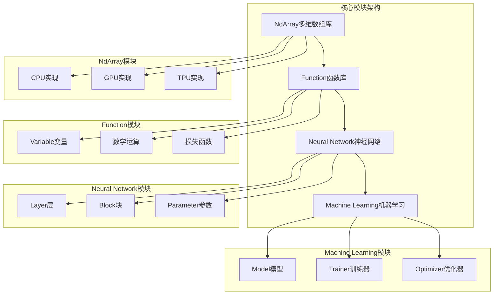
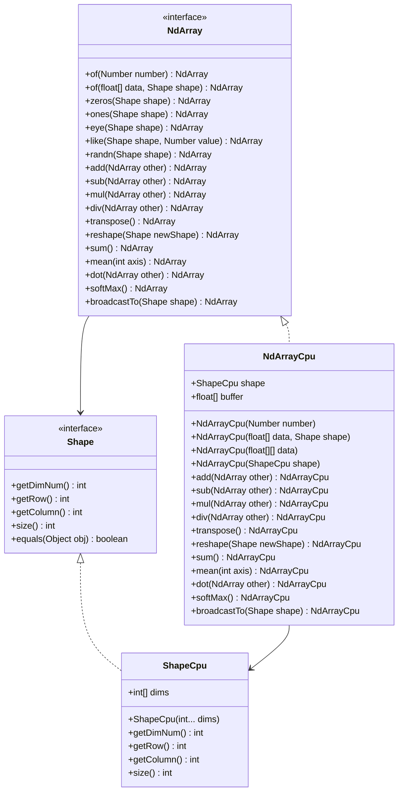
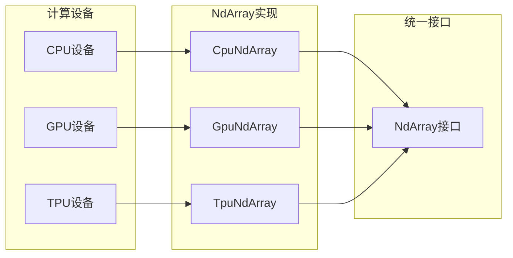
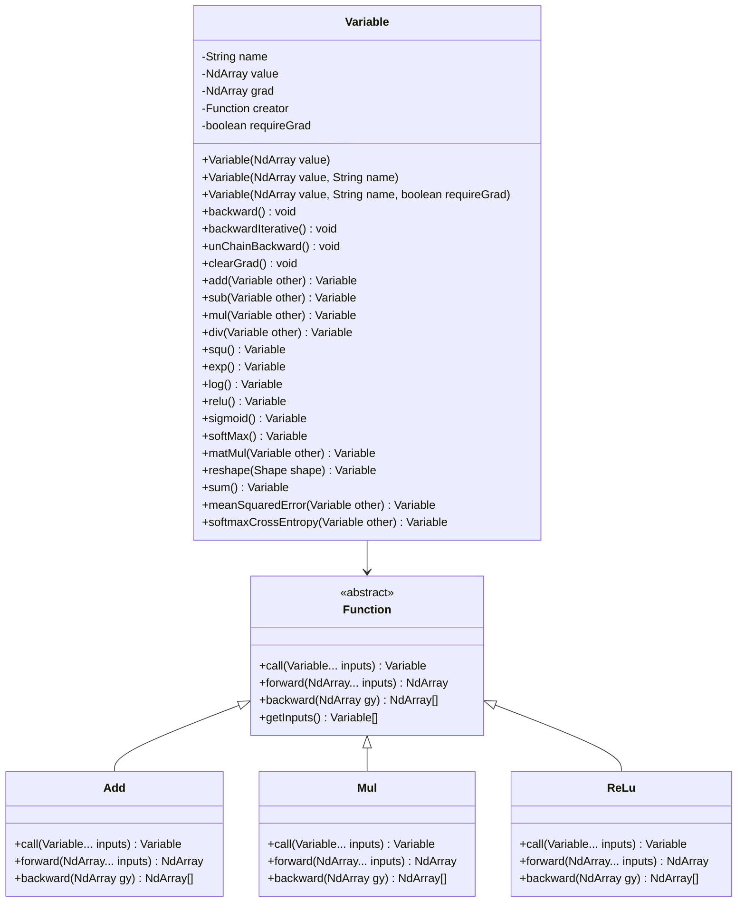
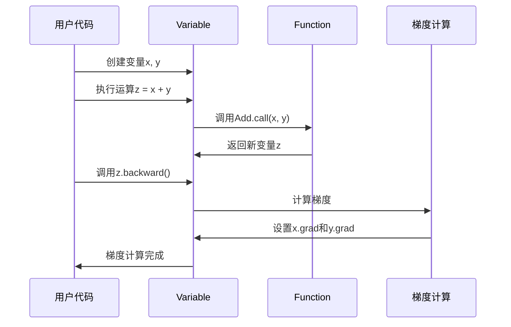
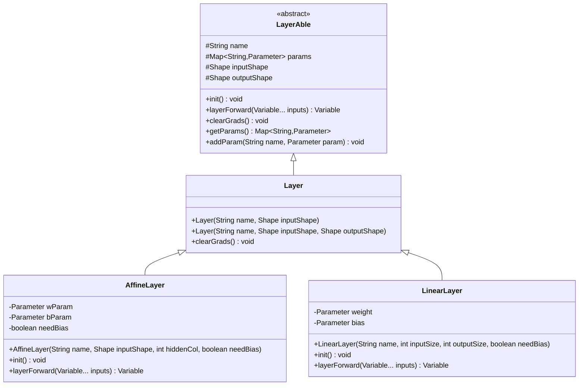
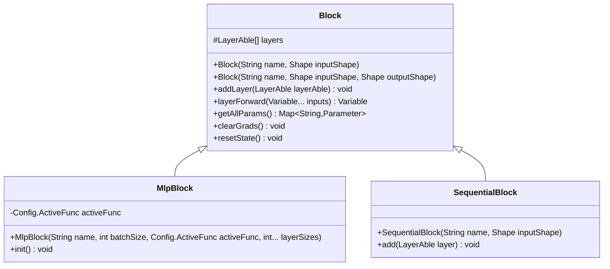
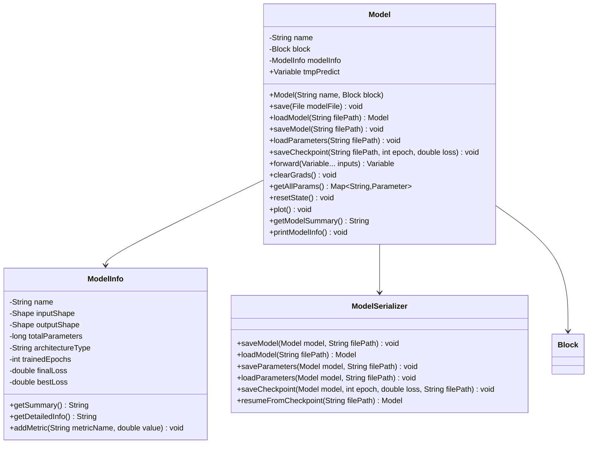
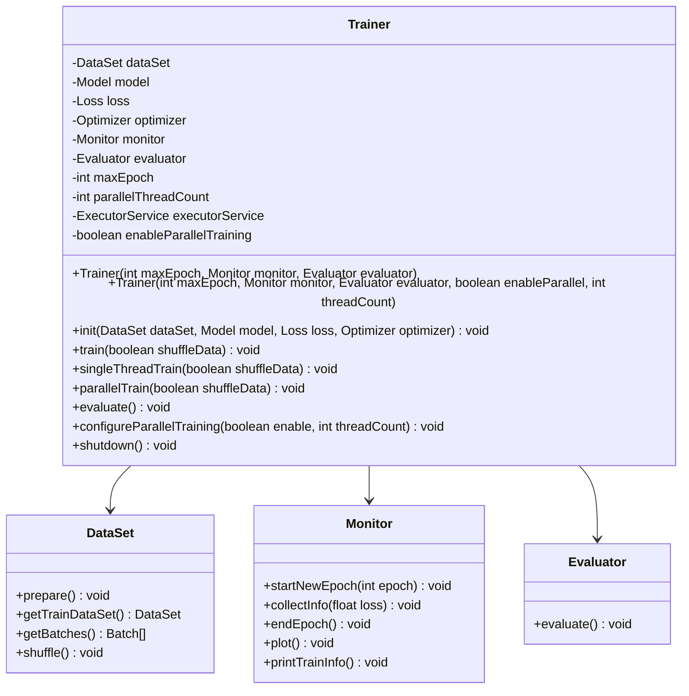
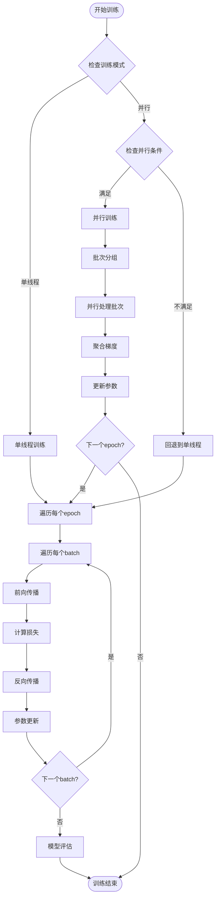

# 核心模块

<cite>
**本文档中引用的文件**
- [NdArray.java](file://tinyai-dl-ndarr/src/main/java/io/leavesfly/tinyai/ndarr/NdArray.java)
- [NdArrayCpu.java](file://tinyai-dl-ndarr/src/main/java/io/leavesfly/tinyai/ndarr/cpu/NdArrayCpu.java)
- [Variable.java](file://tinyai-dl-func/src/main/java/io/leavesfly/tinyai/func/Variable.java)
- [Layer.java](file://tinyai-dl-nnet/src/main/java/io/leavesfly/tinyai/nnet/Layer.java)
- [Block.java](file://tinyai-dl-nnet/src/main/java/io/leavesfly/tinyai/nnet/Block.java)
- [AffineLayer.java](file://tinyai-dl-nnet/src/main/java/io/leavesfly/tinyai/nnet/layer/dnn/AffineLayer.java)
- [MlpBlock.java](file://tinyai-dl-nnet/src/main/java/io/leavesfly/tinyai/nnet/block/MlpBlock.java)
- [Model.java](file://tinyai-dl-ml/src/main/java/io/leavesfly/tinyai/ml/Model.java)
- [Trainer.java](file://tinyai-dl-ml/src/main/java/io/leavesfly/tinyai/ml/Trainer.java)
- [TestBroadcast.java](file://tinyai-dl-ndarr/src/test/java/io/leavesfly/tinyai/ndarr/TestBroadcast.java)
- [VariableTest.java](file://tinyai-dl-func/src/test/java/io/leavesfly/tinyai/func/VariableTest.java)
- [MnistMlpExam.java](file://tinyai-dl-case/src/main/java/io/leavesfly/tinyai/example/classify/MnistMlpExam.java)
</cite>

## 目录
1. [简介](#简介)
2. [项目结构概览](#项目结构概览)
3. [NdArray多维数组库](#ndarray多维数组库)
4. [Variable类与自动微分](#variable类与自动微分)
5. [Layer接口与Block组合模式](#layer接口与block组合模式)
6. [Model类的模型管理](#model类的模型管理)
7. [Trainer类的训练循环](#trainer类的训练循环)
8. [性能优化与最佳实践](#性能优化与最佳实践)
9. [故障排除指南](#故障排除指南)
10. [总结](#总结)

## 简介

TinyAI框架的核心模块构成了一个完整的深度学习系统，包括NdArray多维数组库、Variable类实现自动微分、Layer接口和Block组合模式构建神经网络、Model类管理模型参数和结构，以及Trainer类提供训练循环和优化器集成。这些模块协同工作，为开发者提供了强大而灵活的深度学习工具。

## 项目结构概览



**图表来源**
- [NdArray.java](file://tinyai-dl-ndarr/src/main/java/io/leavesfly/tinyai/ndarr/NdArray.java#L1-L50)
- [Variable.java](file://tinyai-dl-func/src/main/java/io/leavesfly/tinyai/func/Variable.java#L1-L50)
- [Layer.java](file://tinyai-dl-nnet/src/main/java/io/leavesfly/tinyai/nnet/Layer.java#L1-L50)
- [Model.java](file://tinyai-dl-ml/src/main/java/io/leavesfly/tinyai/ml/Model.java#L1-L50)

## NdArray多维数组库

NdArray是TinyAI框架的核心数据结构，支持任意维度的数组操作，提供了高效的内存管理和丰富的数学运算功能。

### NdArray接口设计



**图表来源**
- [NdArray.java](file://tinyai-dl-ndarr/src/main/java/io/leavesfly/tinyai/ndarr/NdArray.java#L1-L100)
- [NdArrayCpu.java](file://tinyai-dl-ndarr/src/main/java/io/leavesfly/tinyai/ndarr/cpu/NdArrayCpu.java#L1-L100)

### 广播机制详解

广播机制是NdArray的一个重要特性，允许不同形状的数组进行运算。当两个数组形状不兼容时，较小的数组会被广播到较大的形状。

```java
// 广播示例
float[][] matrix = {{1, 2, 3}, {4, 5, 6}};
float[] vector = {10, 20, 30};

NdArray matrixNd = NdArray.of(matrix);
NdArray vectorNd = NdArray.of(vector);

// 向量会被广播到矩阵形状
NdArray result = matrixNd.add(vectorNd.broadcastTo(matrixNd.getShape()));
```

**章节来源**
- [NdArray.java](file://tinyai-dl-ndarr/src/main/java/io/leavesfly/tinyai/ndarr/NdArray.java#L400-L450)
- [TestBroadcast.java](file://tinyai-dl-ndarr/src/test/java/io/leavesfly/tinyai/ndarr/TestBroadcast.java#L1-L34)

### 多设备支持

NdArray支持CPU、GPU和TPU三种计算设备，通过统一的接口提供不同的实现：



**图表来源**
- [NdArray.java](file://tinyai-dl-ndarr/src/main/java/io/leavesfly/tinyai/ndarr/NdArray.java#L1-L50)

## Variable类与自动微分

Variable类是TinyAI框架中自动微分系统的核心组件，负责构建和维护计算图，实现梯度计算。

### Variable类架构



**图表来源**
- [Variable.java](file://tinyai-dl-func/src/main/java/io/leavesfly/tinyai/func/Variable.java#L1-L100)

### 自动微分流程



**图表来源**
- [Variable.java](file://tinyai-dl-func/src/main/java/io/leavesfly/tinyai/func/Variable.java#L100-L150)

### 计算图构建与反向传播

Variable类通过记录创建自己的Function来构建计算图：

```java
// 创建简单的计算图: z = x^2 + y
Variable x = new Variable(NdArray.of(3.0f), "x");
Variable y = new Variable(NdArray.of(2.0f), "y");

Variable x_squared = x.squ(); // x^2
Variable z = x_squared.add(y); // z = x^2 + y

// 执行反向传播
z.backward();

// 验证梯度
// dz/dx = 2x = 2*3 = 6
assertEquals(6f, x.getGrad().getNumber().floatValue(), 1e-6);
// dz/dy = 1
assertEquals(1f, y.getGrad().getNumber().floatValue(), 1e-6);
```

**章节来源**
- [Variable.java](file://tinyai-dl-func/src/main/java/io/leavesfly/tinyai/func/Variable.java#L100-L200)
- [VariableTest.java](file://tinyai-dl-func/src/test/java/io/leavesfly/tinyai/func/VariableTest.java#L273-L313)

## Layer接口与Block组合模式

Layer和Block是构建神经网络的两个核心抽象，Layer代表单个神经网络层，Block代表多个Layer的组合。

### Layer接口设计



**图表来源**
- [Layer.java](file://tinyai-dl-nnet/src/main/java/io/leavesfly/tinyai/nnet/Layer.java#L1-L52)
- [AffineLayer.java](file://tinyai-dl-nnet/src/main/java/io/leavesfly/tinyai/nnet/layer/dnn/AffineLayer.java#L1-L50)

### Block组合模式



**图表来源**
- [Block.java](file://tinyai-dl-nnet/src/main/java/io/leavesfly/tinyai/nnet/Block.java#L1-L100)
- [MlpBlock.java](file://tinyai-dl-nnet/src/main/java/io/leavesfly/tinyai/nnet/block/MlpBlock.java#L1-L61)

### 参数管理系统

Layer和Block都实现了参数管理功能，支持参数的初始化、访问和梯度清零：

```java
// 创建仿射层并初始化参数
AffineLayer affine = new AffineLayer("affine", Shape.of(1, 10), 20, true);
affine.init();

// 访问参数
Map<String, Parameter> params = affine.getParams();
Parameter weight = params.get("w");
Parameter bias = params.get("b");

// 清除梯度
affine.clearGrads();
```

**章节来源**
- [AffineLayer.java](file://tinyai-dl-nnet/src/main/java/io/leavesfly/tinyai/nnet/layer/dnn/AffineLayer.java#L40-L89)
- [Block.java](file://tinyai-dl-nnet/src/main/java/io/leavesfly/tinyai/nnet/Block.java#L50-L100)

## Model类的模型管理

Model类是TinyAI框架中模型的核心表示，提供了模型的完整生命周期管理功能。

### Model类架构



**图表来源**
- [Model.java](file://tinyai-dl-ml/src/main/java/io/leavesfly/tinyai/ml/Model.java#L1-L100)

### 模型序列化与持久化

Model类支持多种序列化方式，包括完整模型保存、参数保存和检查点保存：

```java
// 创建模型
Block block = new MlpBlock("MlpBlock", batchSize, Config.ActiveFunc.ReLU, inputSize, hiddenSize, outputSize);
Model model = new Model("MyModel", block);

// 保存完整模型
model.saveModel("model.bin");

// 仅保存参数
model.saveParameters("params.bin");

// 保存训练检查点
model.saveCheckpoint("checkpoint.bin", epoch, loss);

// 加载模型
Model loadedModel = Model.loadModel("model.bin");
loadedModel.loadParameters("params.bin");
```

**章节来源**
- [Model.java](file://tinyai-dl-ml/src/main/java/io/leavesfly/tinyai/ml/Model.java#L80-L150)

## Trainer类的训练循环

Trainer类是TinyAI框架中模型训练的核心组件，提供了完整的训练流程管理功能。

### Trainer类设计



**图表来源**
- [Trainer.java](file://tinyai-dl-ml/src/main/java/io/leavesfly/tinyai/ml/Trainer.java#L1-L100)

### 单线程与并行训练

Trainer类支持两种训练模式：单线程训练和并行训练。



**图表来源**
- [Trainer.java](file://tinyai-dl-ml/src/main/java/io/leavesfly/tinyai/ml/Trainer.java#L100-L200)

### 训练示例

```java
// 定义超参数
int maxEpoch = 50;
int batchSize = 100;
float learningRate = 0.1f;

// 创建模型
Block block = new MlpBlock("MlpBlock", batchSize, Config.ActiveFunc.Sigmoid, inputSize, hiddenSize1, hiddenSize2, outputSize);
Model model = new Model("MnistMlpExam", block);

// 准备数据集
DataSet mnistDataSet = new MnistDataSet(batchSize);

// 配置评估器和优化器
Evaluator evaluator = new AccuracyEval(new Classify(), model, mnistDataSet);
Optimizer optimizer = new SGD(model, learningRate);

// 创建训练器
Trainer trainer = new Trainer(maxEpoch, new Monitor(), evaluator);

// 初始化并开始训练
trainer.init(mnistDataSet, model, new SoftmaxCrossEntropy(), optimizer);
trainer.train(true); // 启用数据打乱
```

**章节来源**
- [Trainer.java](file://tinyai-dl-ml/src/main/java/io/leavesfly/tinyai/ml/Trainer.java#L150-L250)
- [MnistMlpExam.java](file://tinyai-dl-case/src/main/java/io/leavesfly/tinyai/example/classify/MnistMlpExam.java#L30-L85)

## 性能优化与最佳实践

### 内存管理优化

1. **及时清理梯度**：在每次反向传播后调用`clearGrad()`方法
2. **合理设置批处理大小**：平衡内存使用和训练效率
3. **使用适当的精度**：Float32相比Float64更节省内存

### 计算优化

1. **并行训练**：对于大规模数据集，启用并行训练模式
2. **梯度累积**：在内存受限的情况下使用梯度累积
3. **模型并行**：对于大型模型，考虑模型并行策略

### 代码示例：性能优化

```java
// 优化的训练循环
public void optimizedTraining() {
    // 设置合适的批处理大小
    int batchSize = 128;
    
    // 启用并行训练
    Trainer trainer = new Trainer(maxEpoch, monitor, evaluator, true, 4);
    
    // 在每个epoch开始前重置状态
    model.resetState();
    
    // 及时清理梯度
    model.clearGrads();
    
    // 执行训练
    trainer.train(true);
}
```

## 故障排除指南

### 常见问题与解决方案

1. **内存不足错误**
   - 减少批处理大小
   - 使用梯度累积
   - 启用并行训练减少单次内存占用

2. **梯度爆炸/消失**
   - 使用梯度裁剪
   - 调整学习率
   - 使用合适的参数初始化方法

3. **计算图构建错误**
   - 确保在训练模式下构建计算图
   - 检查Variable的requireGrad设置

### 调试技巧

```java
// 启用调试模式
Config.train = true;

// 检查计算图
Variable x = new Variable(NdArray.of(1.0f), "x");
Variable y = x.squ();
System.out.println("Creator: " + y.getCreator()); // 应该不为null

// 检查梯度
y.backward();
System.out.println("Gradient: " + x.getGrad());
```

**章节来源**
- [VariableTest.java](file://tinyai-dl-func/src/test/java/io/leavesfly/tinyai/func/VariableTest.java#L360-L400)

## 总结

TinyAI框架的核心模块提供了一个完整而强大的深度学习平台。通过NdArray多维数组库的高效实现、Variable类的自动微分机制、Layer和Block的组合模式、Model类的完整生命周期管理，以及Trainer类的智能训练循环，开发者可以轻松构建和训练复杂的神经网络模型。

这些模块的设计遵循了良好的软件工程原则，具有高度的可扩展性和可维护性。无论是研究还是生产环境，TinyAI都能提供可靠的深度学习解决方案。