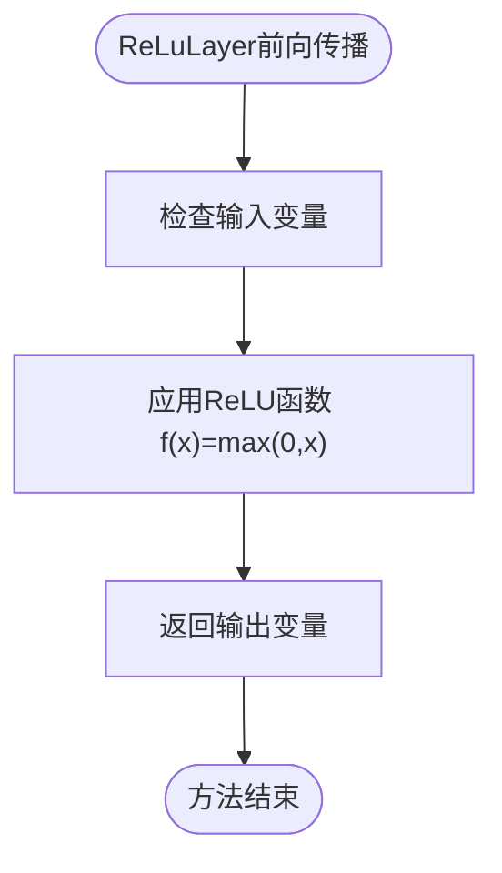
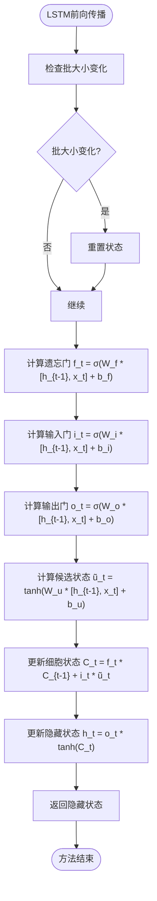

# 神经网络层与块

<cite>
**本文档引用的文件**
- [Layer.java](file://tinyai-dl-nnet/src/main/java/io/leavesfly/tinyai/nnet/Layer.java)
- [Block.java](file://tinyai-dl-nnet/src/main/java/io/leavesfly/tinyai/nnet/Block.java)
- [ReLuLayer.java](file://tinyai-dl-nnet/src/main/java/io/leavesfly/tinyai/nnet/layer/activate/ReLuLayer.java)
- [AffineLayer.java](file://tinyai-dl-nnet/src/main/java/io/leavesfly/tinyai/nnet/layer/dnn/AffineLayer.java)
- [ConvLayer.java](file://tinyai-dl-nnet/src/main/java/io/leavesfly/tinyai/nnet/layer/cnn/ConvLayer.java)
- [LstmLayer.java](file://tinyai-dl-nnet/src/main/java/io/leavesfly/tinyai/nnet/layer/rnn/LstmLayer.java)
- [MlpBlock.java](file://tinyai-dl-nnet/src/main/java/io/leavesfly/tinyai/nnet/block/MlpBlock.java)
- [SequentialBlock.java](file://tinyai-dl-nnet/src/main/java/io/leavesfly/tinyai/nnet/block/SequentialBlock.java)
- [TransformerEncoder.java](file://tinyai-dl-nnet/src/main/java/io/leavesfly/tinyai/nnet/block/transformer/TransformerEncoder.java)
- [MultiHeadAttention.java](file://tinyai-dl-nnet/src/main/java/io/leavesfly/tinyai/nnet/layer/transformer/MultiHeadAttention.java)
- [LayerAble.java](file://tinyai-dl-nnet/src/main/java/io/leavesfly/tinyai/nnet/LayerAble.java)
- [Parameter.java](file://tinyai-dl-nnet/src/main/java/io/leavesfly/tinyai/nnet/Parameter.java)
- [RnnLayer.java](file://tinyai-dl-nnet/src/main/java/io/leavesfly/tinyai/nnet/RnnLayer.java)
</cite>

## 目录
1. [引言](#引言)
2. [核心架构设计](#核心架构设计)
3. [基础层实现](#基础层实现)
4. [循环层状态管理](#循环层状态管理)
5. [复合块结构](#复合块结构)
6. [最佳实践](#最佳实践)
7. [结论](#结论)

## 引言
本文档全面阐述TinyAI框架中神经网络层（Layer）与块（Block）的设计哲学与实现细节。通过分析Layer接口与Block组合模式，详细说明ReLuLayer、ConvLayer、AffineLayer等基础层的实现及其参数初始化策略，解析LstmLayer等循环层的状态管理机制，并介绍MlpBlock、TransformerEncoder等复合块如何通过组合基础层实现高级架构。

## 核心架构设计

**图示来源**
- [Layer.java](file://tinyai-dl-nnet/src/main/java/io/leavesfly/tinyai/nnet/Layer.java)
- [Block.java](file://tinyai-dl-nnet/src/main/java/io/leavesfly/tinyai/nnet/Block.java)
- [LayerAble.java](file://tinyai-dl-nnet/src/main/java/io/leavesfly/tinyai/nnet/LayerAble.java)
- [Parameter.java](file://tinyai-dl-nnet/src/main/java/io/leavesfly/tinyai/nnet/Parameter.java)
- [RnnLayer.java](file://tinyai-dl-nnet/src/main/java/io/leavesfly/tinyai/nnet/RnnLayer.java)

**本节来源**
- [Layer.java](file://tinyai-dl-nnet/src/main/java/io/leavesfly/tinyai/nnet/Layer.java#L1-L51)
- [Block.java](file://tinyai-dl-nnet/src/main/java/io/leavesfly/tinyai/nnet/Block.java#L1-L135)
- [LayerAble.java](file://tinyai-dl-nnet/src/main/java/io/leavesfly/tinyai/nnet/LayerAble.java#L1-L62)

## 基础层实现

### Layer接口设计
Layer接口继承自LayerAble抽象类，作为神经网络的基本组成单元。每个Layer实现特定的数学变换功能，通过`layerForward`方法实现前向传播，`init`方法进行参数初始化，`clearGrads`方法清零梯度。

### 激活层实现
激活层如ReLuLayer、SigmoidLayer等实现了非线性变换功能。以ReLuLayer为例，其核心实现如下：

**图示来源**
- [ReLuLayer.java](file://tinyai-dl-nnet/src/main/java/io/leavesfly/tinyai/nnet/layer/activate/ReLuLayer.java)

**本节来源**
- [ReLuLayer.java](file://tinyai-dl-nnet/src/main/java/io/leavesfly/tinyai/nnet/layer/activate/ReLuLayer.java#L1-L78)

### 全连接层实现
AffineLayer（仿射层）实现了全连接层的功能，执行y = x * W + b的计算。其参数初始化采用Xavier初始化方法，确保权重矩阵的方差适中。

**图示来源**
- [AffineLayer.java](file://tinyai-dl-nnet/src/main/java/io/leavesfly/tinyai/nnet/layer/dnn/AffineLayer.java)

**本节来源**
- [AffineLayer.java](file://tinyai-dl-nnet/src/main/java/io/leavesfly/tinyai/nnet/layer/dnn/AffineLayer.java#L1-L88)

### 卷积层实现
ConvLayer实现了标准的卷积操作，支持步长、填充、偏置等参数，并使用Im2Col技术将卷积操作转换为矩阵乘法以提高计算效率。

**图示来源**
- [ConvLayer.java](file://tinyai-dl-nnet/src/main/java/io/leavesfly/tinyai/nnet/layer/cnn/ConvLayer.java)

**本节来源**
- [ConvLayer.java](file://tinyai-dl-nnet/src/main/java/io/leavesfly/tinyai/nnet/layer/cnn/ConvLayer.java#L1-L199)

## 循环层状态管理

### LSTM层设计
LstmLayer实现了长短期记忆网络，通过遗忘门、输入门和输出门三个门控机制来控制信息流动，有效缓解梯度消失问题。

**图示来源**
- [LstmLayer.java](file://tinyai-dl-nnet/src/main/java/io/leavesfly/tinyai/nnet/layer/rnn/LstmLayer.java)

**本节来源**
- [LstmLayer.java](file://tinyai-dl-nnet/src/main/java/io/leavesfly/tinyai/nnet/layer/rnn/LstmLayer.java#L1-L199)

### 状态管理机制
LstmLayer通过`resetState`方法重置内部状态，在处理新序列之前调用。同时实现了动态批大小处理，当检测到批大小变化时自动重置状态。

**本节来源**
- [LstmLayer.java](file://tinyai-dl-nnet/src/main/java/io/leavesfly/tinyai/nnet/layer/rnn/LstmLayer.java#L1-L199)

## 复合块结构

### MlpBlock实现
MlpBlock是一个多层感知机块，由多个全连接层和激活函数层组成，可以构建任意深度的前馈神经网络。

**图示来源**
- [MlpBlock.java](file://tinyai-dl-nnet/src/main/java/io/leavesfly/tinyai/nnet/block/MlpBlock.java)

**本节来源**
- [MlpBlock.java](file://tinyai-dl-nnet/src/main/java/io/leavesfly/tinyai/nnet/block/MlpBlock.java#L1-L60)

### TransformerEncoder实现
TransformerEncoder实现了完整的Transformer编码器，包含位置编码和多个Transformer编码器层。

**图示来源**
- [TransformerEncoder.java](file://tinyai-dl-nnet/src/main/java/io/leavesfly/tinyai/nnet/block/transformer/TransformerEncoder.java)

**本节来源**
- [TransformerEncoder.java](file://tinyai-dl-nnet/src/main/java/io/leavesfly/tinyai/nnet/block/transformer/TransformerEncoder.java#L1-L175)

### 多头注意力机制
MultiHeadAttention是Transformer的核心组件，通过并行计算多个注意力头来捕获不同子空间的信息。

**图示来源**
- [MultiHeadAttention.java](file://tinyai-dl-nnet/src/main/java/io/leavesfly/tinyai/nnet/layer/transformer/MultiHeadAttention.java)

**本节来源**
- [MultiHeadAttention.java](file://tinyai-dl-nnet/src/main/java/io/leavesfly/tinyai/nnet/layer/transformer/MultiHeadAttention.java#L1-L199)

## 最佳实践

### 层间连接
通过Block的`addLayer`方法可以按顺序添加层，实现层间的连接。SequentialBlock提供了简单的顺序连接模式。

**本节来源**
- [SequentialBlock.java](file://tinyai-dl-nnet/src/main/java/io/leavesfly/tinyai/nnet/block/SequentialBlock.java#L1-L32)

### 参数共享
通过Parameter类实现参数管理，同一参数可以在多个层之间共享。每个Layer通过`addParam`方法添加参数，`getParams`方法获取参数。

### 模块复用
Block作为容器可以包含其他Layer或Block，支持嵌套结构，便于构建复杂的神经网络架构。

**本节来源**
- [Block.java](file://tinyai-dl-nnet/src/main/java/io/leavesfly/tinyai/nnet/Block.java#L1-L135)

## 结论
TinyAI框架通过Layer接口与Block组合模式实现了灵活的神经网络构建系统。Layer作为基本单元实现特定的数学变换，Block作为容器组合多个Layer形成复杂的网络结构。这种设计模式既保证了组件的可复用性，又提供了构建高级架构的灵活性。