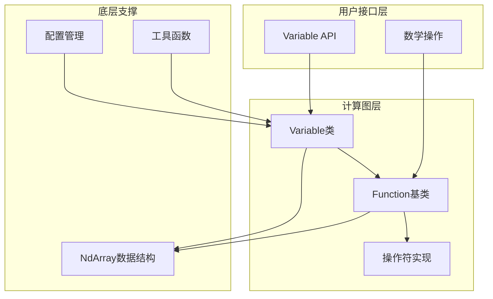
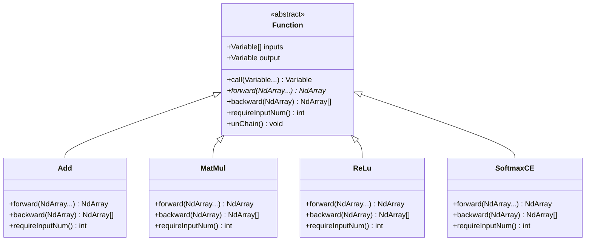
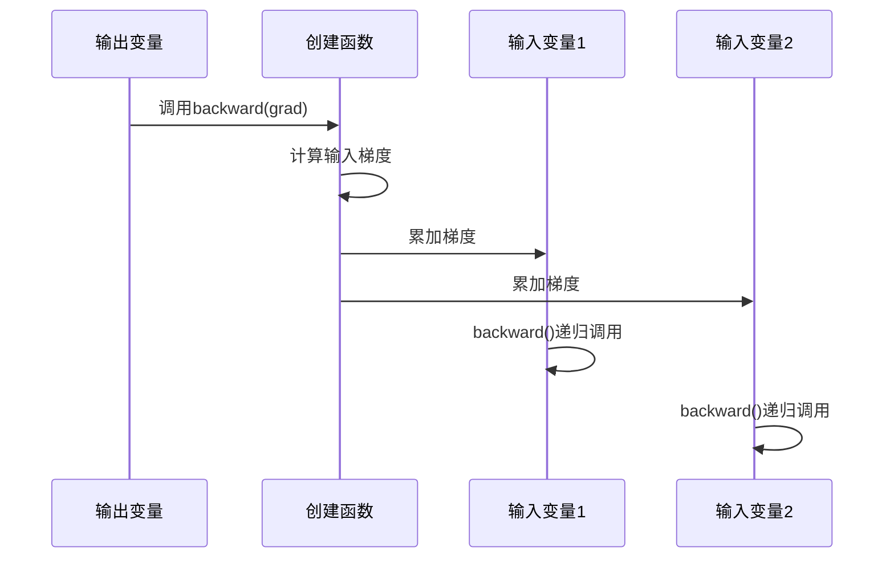
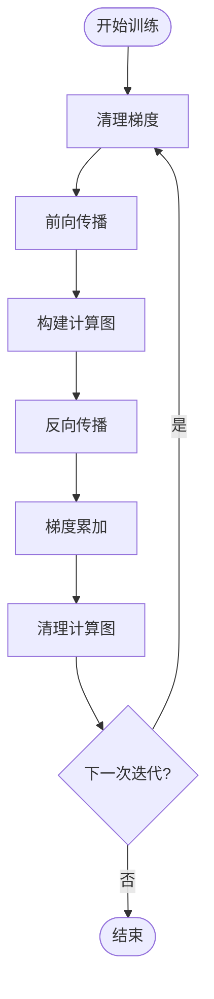

# 自动微分引擎

<cite>
**本文档中引用的文件**
- [Variable.java](file://tinyai-dl-func/src/main/java/io/leavesfly/tinyai/func/Variable.java)
- [Function.java](file://tinyai-dl-func/src/main/java/io/leavesfly/tinyai/func/Function.java)
- [Add.java](file://tinyai-dl-func/src/main/java/io/leavesfly/tinyai/func/base/Add.java)
- [MatMul.java](file://tinyai-dl-func/src/main/java/io/leavesfly/tinyai/func/matrix/MatMul.java)
- [ReLu.java](file://tinyai-dl-func/src/main/java/io/leavesfly/tinyai/func/math/ReLu.java)
- [SoftmaxCE.java](file://tinyai-dl-func/src/main/java/io/leavesfly/tinyai/func/loss/SoftmaxCE.java)
- [Sigmoid.java](file://tinyai-dl-func/src/main/java/io/leavesfly/tinyai/func/math/Sigmoid.java)
- [Reshape.java](file://tinyai-dl-func/src/main/java/io/leavesfly/tinyai/func/matrix/Reshape.java)
- [Util.java](file://tinyai-dl-func/src/main/java/io/leavesfly/tinyai/func/Util.java)
- [Config.java](file://tinyai-dl-func/src/main/java/io/leavesfly/tinyai/util/Config.java)
</cite>

## 目录
1. [简介](#简介)
2. [核心架构](#核心架构)
3. [Variable类设计](#variable类设计)
4. [Function基类设计](#function基类设计)
5. [基本操作实现](#基本操作实现)
6. [损失函数实现](#损失函数实现)
7. [反向传播机制](#反向传播机制)
8. [内存管理策略](#内存管理策略)
9. [性能优化](#性能优化)
10. [最佳实践](#最佳实践)
11. [总结](#总结)

## 简介

TinyAI的自动微分引擎是一个高度优化的深度学习框架核心组件，它实现了动态计算图构建和自动微分机制。该引擎通过Variable类和Function基类的协作，为神经网络训练提供了强大的梯度计算能力。

自动微分引擎的核心设计理念是基于函数式编程范式，通过前向传播构建计算图，在反向传播阶段自动计算梯度。这种设计使得用户可以专注于模型构建，而无需手动推导复杂的梯度公式。

## 核心架构

自动微分引擎采用分层架构设计，主要包含以下几个层次：



**图表来源**
- [Variable.java](file://tinyai-dl-func/src/main/java/io/leavesfly/tinyai/func/Variable.java#L1-L50)
- [Function.java](file://tinyai-dl-func/src/main/java/io/leavesfly/tinyai/func/Function.java#L1-L50)

## Variable类设计

Variable类是自动微分引擎的核心组件，它封装了数学变量的概念，不仅包含变量的值，还包含了梯度信息和计算图构建所需的信息。

### 核心属性

```java
public class Variable implements Serializable {
    private String name;              // 变量名称，用于调试和可视化
    private NdArray value;            // 变量的实际数值
    private NdArray grad;             // 变量的梯度
    private transient Function creator; // 生成该变量的函数
    private boolean requireGrad = true; // 是否需要计算梯度
}
```

### 构造函数设计

Variable类提供了多种构造函数，支持不同的使用场景：

```java
// 基本构造函数
public Variable(NdArray _value)

// 带名称的构造函数
public Variable(NdArray _value, String _name)

// 带梯度需求标志的构造函数
public Variable(NdArray _value, String _name, boolean _requireGrad)
```

### 操作符重载

Variable类实现了丰富的操作符重载，支持链式调用：

```java
// 四则运算
public Variable add(Variable other)
public Variable sub(Variable other)
public Variable mul(Variable other)
public Variable div(Variable other)
public Variable neg()

// 基本数学函数
public Variable squ()
public Variable pow(float pow)
public Variable exp()
public Variable sin()
public Variable cos()
public Variable log()
public Variable tanh()
public Variable sigmoid()
public Variable relu()

// 张量变形操作
public Variable matMul(Variable other)
public Variable reshape(Shape shape)
public Variable transpose()
public Variable linear(Variable w, Variable b)
```

**章节来源**
- [Variable.java](file://tinyai-dl-func/src/main/java/io/leavesfly/tinyai/func/Variable.java#L30-L100)

## Function基类设计

Function基类是所有数学函数操作的抽象基类，它定义了前向传播和反向传播的标准接口，并负责构建计算图。

### 核心接口

```java
public abstract class Function {
    protected Variable[] inputs;    // 输入变量数组
    protected Variable output;      // 输出变量
    
    public abstract NdArray forward(NdArray... inputs);
    public abstract List<NdArray> backward(NdArray yGrad);
    public abstract int requireInputNum();
}
```

### call方法实现

call方法是Function类的核心方法，它负责执行前向传播并构建计算图：

```java
public Variable call(Variable... _inputs) {
    // 输入验证
    if (_inputs.length != requireInputNum() && requireInputNum() > 0) {
        throw new RuntimeException("Function call inputs Variable requireInputNum error!");
    }

    // 提取NdArray值
    NdArray[] ndArrayInputs = Arrays.stream(_inputs)
            .filter(Objects::nonNull)
            .map(Variable::getValue)
            .toArray(NdArray[]::new);

    // 执行前向传播
    NdArray ndArrayOutput = forward(ndArrayInputs);

    // 创建输出变量
    Variable _output = new Variable(ndArrayOutput);

    // 只在训练模式下构建计算图
    if (Config.train) {
        this.inputs = _inputs;
        this.output = _output;
        _output.setCreator(this);
    }

    return _output;
}
```

### 设计模式应用

Function基类采用了模板方法模式和工厂模式的组合：



**图表来源**
- [Function.java](file://tinyai-dl-func/src/main/java/io/leavesfly/tinyai/func/Function.java#L15-L80)
- [Add.java](file://tinyai-dl-func/src/main/java/io/leavesfly/tinyai/func/base/Add.java#L15-L30)
- [MatMul.java](file://tinyai-dl-func/src/main/java/io/leavesfly/tinyai/func/matrix/MatMul.java#L15-L30)

**章节来源**
- [Function.java](file://tinyai-dl-func/src/main/java/io/leavesfly/tinyai/func/Function.java#L1-L152)

## 基本操作实现

### Add操作符实现

Add类展示了如何实现基本的加法操作：

```java
@Override
public NdArray forward(NdArray... inputs) {
    x0Shape = inputs[0].getShape();
    x1Shape = inputs[1].getShape();
    
    if (x0Shape.equals(x1Shape)) {
        return inputs[0].add(inputs[1]);
    } else {
        // 广播处理逻辑
        if (isBroadcastable(x1Shape, x0Shape)) {
            return inputs[0].add(inputs[1].broadcastTo(x0Shape));
        } else if (isBroadcastable(x0Shape, x1Shape)) {
            return inputs[0].broadcastTo(x1Shape).add(inputs[1]);
        }
    }
}

@Override
public List<NdArray> backward(NdArray yGrad) {
    NdArray gx0 = yGrad;
    NdArray gx1 = x1Shape.equals(x0Shape) ? yGrad : yGrad.sumTo(x1Shape);
    return Arrays.asList(gx0, gx1);
}
```

### MatMul操作符实现

MatMul类展示了矩阵乘法的梯度计算：

```java
@Override
public List<NdArray> backward(NdArray yGrad) {
    NdArray x = inputs[0].getValue();
    NdArray w = inputs[1].getValue();

    return Arrays.asList(yGrad.dot(w.transpose()), x.transpose().dot(yGrad));
}
```

### ReLU激活函数实现

ReLU类展示了非线性激活函数的实现：

```java
@Override
public List<NdArray> backward(NdArray yGrad) {
    return Collections.singletonList(inputs[0].getValue().mask(0).mul(yGrad));
}
```

**章节来源**
- [Add.java](file://tinyai-dl-func/src/main/java/io/leavesfly/tinyai/func/base/Add.java#L25-L80)
- [MatMul.java](file://tinyai-dl-func/src/main/java/io/leavesfly/tinyai/func/matrix/MatMul.java#L30-L50)
- [ReLu.java](file://tinyai-dl-func/src/main/java/io/leavesfly/tinyai/func/math/ReLu.java#L30-L50)

## 损失函数实现

### SoftmaxCE损失函数

SoftmaxCE类展示了多分类问题的损失函数实现：

```java
@Override
public NdArray forward(NdArray... inputs) {
    NdArray predict = inputs[0];
    NdArray labelY = inputs[1];

    int row = predict.getShape().getRow();
    NdArray max = predict.max(1);
    NdArray max2PredictShape = max.broadcastTo(predict.getShape());
    max = max.add(predict.sub(max2PredictShape).exp().sumTo(Shape.of(row, 1)).log());

    int[] colSlices = NdArrayUtil.toInt(labelY.transpose().getMatrix()[0]);
    predict = predict.sub(max.broadcastTo(predict.getShape()));
    predict = predict.getItem(NdArrayUtil.getSeq(row), colSlices);

    float sum = predict.sum().getNumber().floatValue();
    return NdArray.of(-sum / (float) row);
}

@Override
public List<NdArray> backward(NdArray yGrad) {
    NdArray predict = inputs[0].getValue();
    NdArray label = inputs[1].getValue();

    int row = predict.getShape().getRow();
    int column = predict.getShape().getColumn();

    NdArray gy = yGrad.mulNum(1 / (float) row);
    NdArray y = predict.softMax();
    NdArray oneHot = NdArray.eye(Shape.of(column, column)).getItem(
            NdArrayUtil.toInt(label.transpose().getMatrix()[0]), null);

    y = y.sub(oneHot).mulNum(gy.getNumber());
    return Arrays.asList(y, label.like(1));
}
```

### 梯度计算原理

SoftmaxCE损失函数的梯度计算遵循以下公式：

```
∂Loss/∂x = (σ(x) - y) / n
```

其中：
- σ(x) 是Softmax函数
- y 是真实标签（one-hot编码）
- n 是批次大小

**章节来源**
- [SoftmaxCE.java](file://tinyai-dl-func/src/main/java/io/leavesfly/tinyai/func/loss/SoftmaxCE.java#L25-L80)

## 反向传播机制

### 递归反向传播

Variable类提供了两种反向传播实现：递归和迭代版本。

```java
public void backward() {
    if (!requireGrad) {
        this.grad = null;
        return;
    }
    
    // 初始化梯度为1
    if (Objects.isNull(grad)) {
        setGrad(NdArray.ones(this.getValue().getShape()));
    }
    
    Function _creator = creator;
    if (!Objects.isNull(_creator)) {
        Variable[] _inputs = _creator.getInputs();
        List<NdArray> grads = _creator.backward(grad);
        
        if (_inputs.length != grads.size()) {
            throw new RuntimeException("Variable backward grads size error!");
        }
        
        int index = 0;
        for (Variable input : _inputs) {
            // 累加梯度而不是直接设置，支持梯度复用
            if (input.getGrad() != null) {
                input.setGrad(input.getGrad().add(grads.get(index)));
            } else {
                input.setGrad(grads.get(index));
            }
            input.backward();
            index++;
        }
    }
}
```

### 迭代反向传播

为了提高性能和避免栈溢出，还提供了迭代版本的反向传播：

```java
public void backwardIterative() {
    if (!requireGrad) {
        this.grad = null;
        return;
    }

    // 初始化梯度为1
    if (Objects.isNull(grad)) {
        setGrad(NdArray.ones(this.getValue().getShape()));
    }

    // 使用栈来模拟递归过程
    Stack<Variable> stack = new Stack<>();
    stack.push(this);

    while (!stack.isEmpty()) {
        Variable currentVar = stack.pop();
        Function currentCreator = currentVar.getCreator();
        
        if (Objects.isNull(currentCreator)) {
            continue;
        }

        Variable[] inputs = currentCreator.getInputs();
        List<NdArray> grads = currentCreator.backward(currentVar.getGrad());

        if (inputs.length != grads.size()) {
            throw new RuntimeException("Variable backward grads size error!");
        }

        for (int i = 0; i < inputs.length; i++) {
            Variable input = inputs[i];
            NdArray grad = grads.get(i);

            // 累加梯度而不是直接设置
            if (input.getGrad() != null) {
                input.setGrad(input.getGrad().add(grad));
            } else {
                input.setGrad(grad);
            }

            // 如果输入变量有创建者函数，将其加入栈中继续处理
            if (input.getCreator() != null) {
                stack.push(input);
            }
        }
    }
}
```

### 梯度累积机制

自动微分引擎采用梯度累加机制，支持多次反向传播：



**图表来源**
- [Variable.java](file://tinyai-dl-func/src/main/java/io/leavesfly/tinyai/func/Variable.java#L111-L148)

**章节来源**
- [Variable.java](file://tinyai-dl-func/src/main/java/io/leavesfly/tinyai/func/Variable.java#L111-L180)

## 内存管理策略

### 计算图清理

为了避免内存泄漏，自动微分引擎提供了计算图清理机制：

```java
public void unChainBackward() {
    Function creatorFunc = creator;
    if (!Objects.isNull(creatorFunc)) {
        Variable[] xs = creatorFunc.getInputs();
        unChain();
        for (Variable x : xs) {
            x.unChainBackward();
        }
    }
}

private void unChain() {
    creator = null;
}
```

### 梯度清理

每次训练迭代开始前，需要清理梯度以避免梯度累积：

```java
public void clearGrad() {
    grad = null;
}
```

### 内存优化策略



**章节来源**
- [Variable.java](file://tinyai-dl-func/src/main/java/io/leavesfly/tinyai/func/Variable.java#L180-L220)

## 性能优化

### 梯度复用

自动微分引擎通过梯度累加机制支持梯度复用，避免重复计算：

```java
// 累加梯度而不是直接设置，支持梯度复用
if (input.getGrad() != null) {
    input.setGrad(input.getGrad().add(grads.get(index)));
} else {
    input.setGrad(grads.get(index));
}
```

### 广播优化

Add操作符实现了高效的广播机制：

```java
private boolean isBroadcastable(Shape srcShape, Shape dstShape) {
    if (srcShape.getDimNum() <= dstShape.getDimNum()) {
        boolean compatible = true;
        for (int i = 0; i < srcShape.getDimNum(); i++) {
            int srcDimIndex = srcShape.getDimNum() - 1 - i;
            int dstDimIndex = dstShape.getDimNum() - 1 - i;
            
            int srcDim = srcShape.getDimension(srcDimIndex);
            int dstDim = dstShape.getDimension(dstDimIndex);
            
            if (srcDim != dstDim && srcDim != 1) {
                compatible = false;
                break;
            }
        }
        if (compatible) {
            return true;
        }
    }
    return false;
}
```

### 迭代替代递归

对于深层网络，使用迭代版本的反向传播避免栈溢出：

```java
public void backwardIterative() {
    // 使用栈来模拟递归过程
    Stack<Variable> stack = new Stack<>();
    stack.push(this);
    
    while (!stack.isEmpty()) {
        Variable currentVar = stack.pop();
        // 处理逻辑...
    }
}
```

## 最佳实践

### 计算图构建示例

```java
// 创建简单的计算图: z = (x + y) * (x - y) = x^2 - y^2
Variable x = new Variable(NdArray.of(5.0f), "x");
Variable y = new Variable(NdArray.of(3.0f), "y");

Variable sum = x.add(y);     // x + y = 8
Variable diff = x.sub(y);    // x - y = 2
Variable z = sum.mul(diff);  // z = 8 * 2 = 16

// 执行反向传播
z.backward();

// 验证梯度
// dz/dx = 2x = 10
assertEquals(10f, x.getGrad().getNumber().floatValue(), 1e-6);
// dz/dy = -2y = -6
assertEquals(-6f, y.getGrad().getNumber().floatValue(), 1e-6);
```

### 梯度检查

使用数值微分进行梯度检查：

```java
public static NdArray numericalDiff(Function func, NdArray input, float eps) {
    if (eps == 0) {
        eps = 0.00001F;
    }

    NdArray x1 = input.add(NdArray.of(eps));
    NdArray x0 = input.sub(NdArray.of(eps));

    NdArray y1 = func.forward(x1);
    NdArray y0 = func.forward(x0);

    return y1.sub(y0).divNum(eps * 2);
}
```

### 内存管理最佳实践

```java
// 每次训练迭代前清理梯度
void trainIteration() {
    // 清理所有变量的梯度
    for (Variable var : variables) {
        var.clearGrad();
    }
    
    // 执行前向传播和反向传播
    // ...
    
    // 清理计算图
    output.unChainBackward();
}
```

### 错误处理

```java
// 检查梯度形状一致性
if (!_grad.getShape().equals(value.getShape())) {
    throw new RuntimeException("_grad shape must equal value shape!");
}

// 检查反向传播梯度数量
if (_inputs.length != grads.size()) {
    throw new RuntimeException("Variable backward grads size error!");
}
```

## 总结

TinyAI的自动微分引擎通过精心设计的架构和实现，为深度学习模型训练提供了强大而高效的梯度计算能力。其主要特点包括：

1. **模块化设计**：Variable和Function类的清晰分离，使得扩展新的操作变得简单
2. **高效实现**：支持递归和迭代两种反向传播方式，适应不同场景需求
3. **内存优化**：提供完整的内存管理机制，避免内存泄漏
4. **梯度累加**：支持梯度复用和多次反向传播
5. **广播支持**：内置高效的广播机制，简化张量操作
6. **类型安全**：严格的类型检查和错误处理

通过这些设计，自动微分引擎不仅保证了计算的准确性，还提供了良好的性能和易用性，为构建复杂的深度学习模型奠定了坚实的基础。