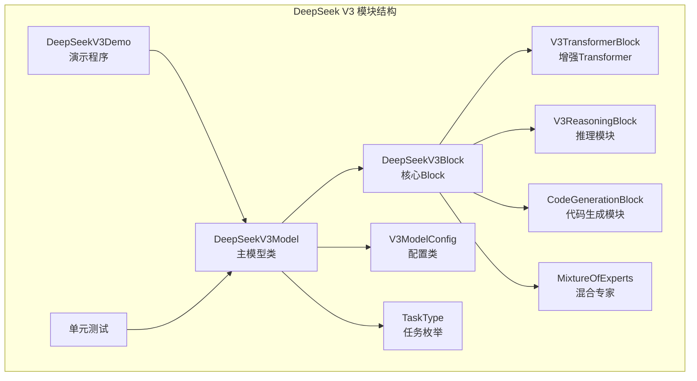
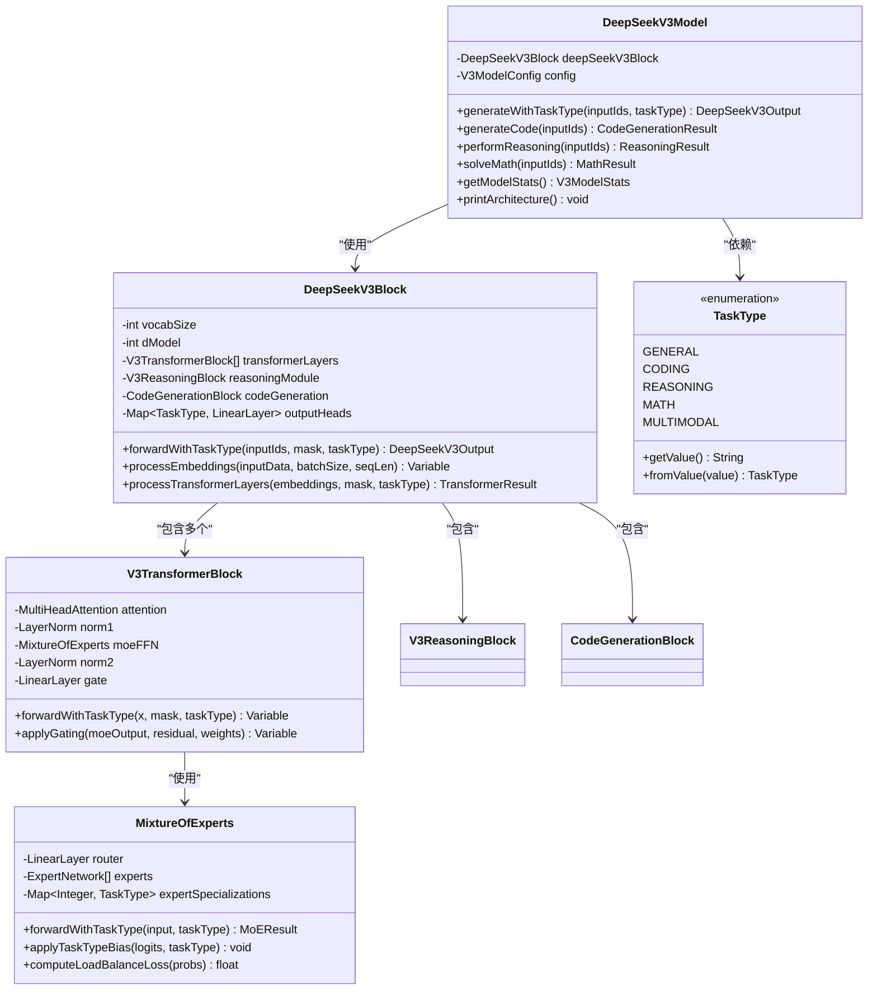
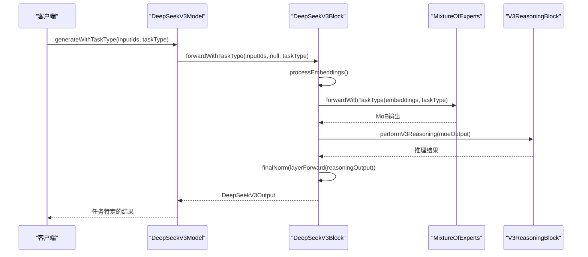
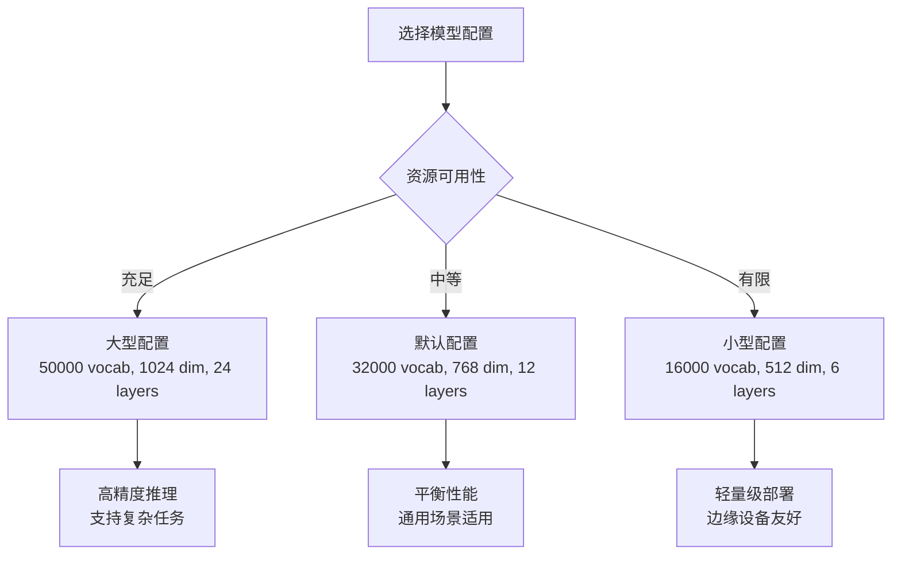
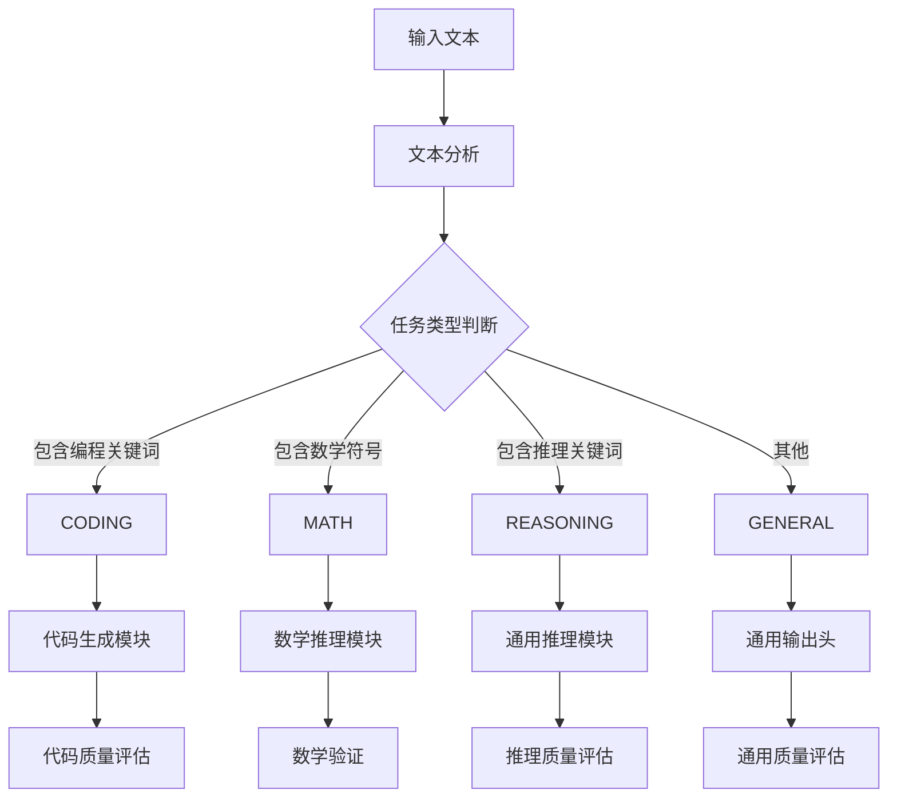
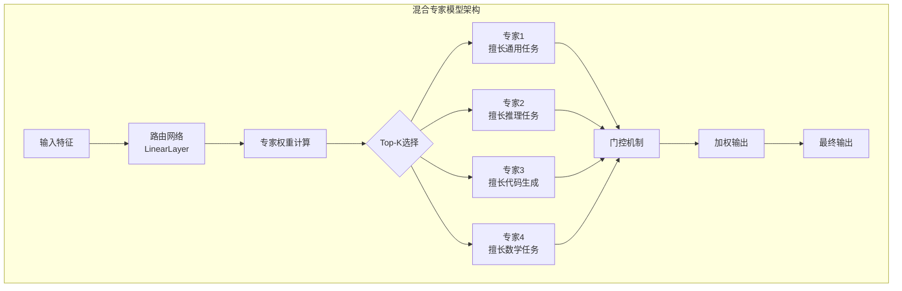
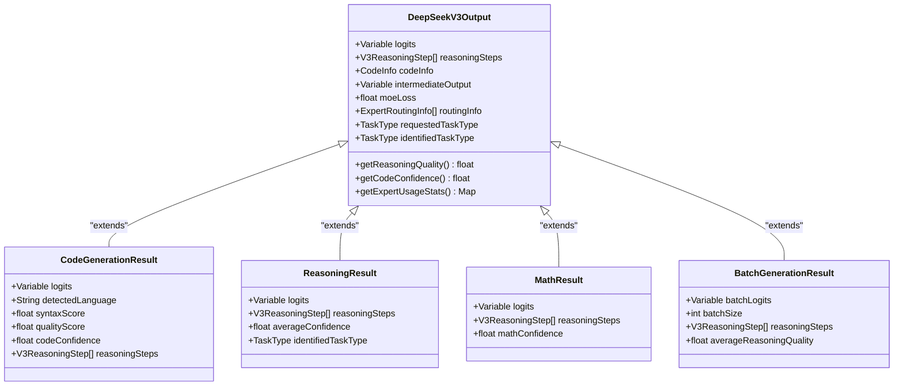

# DeepSeek V3模型详细文档

<cite>
**本文档引用的文件**
- [DeepSeekV3Model.java](file://tinyai-model-deepseek/src/main/java/io/leavesfly/tinyai/deepseek/v3/DeepSeekV3Model.java)
- [DeepSeekV3Block.java](file://tinyai-model-deepseek/src/main/java/io/leavesfly/tinyai/deepseek/v3/DeepSeekV3Block.java)
- [TaskType.java](file://tinyai-model-deepseek/src/main/java/io/leavesfly/tinyai/deepseek/v3/TaskType.java)
- [V3TransformerBlock.java](file://tinyai-model-deepseek/src/main/java/io/leavesfly/tinyai/deepseek/v3/V3TransformerBlock.java)
- [MixtureOfExperts.java](file://tinyai-model-deepseek/src/main/java/io/leavesfly/tinyai/deepseek/v3/MixtureOfExperts.java)
- [DeepSeekV3Demo.java](file://tinyai-model-deepseek/src/main/java/io/leavesfly/tinyai/deepseek/v3/DeepSeekV3Demo.java)
- [README_v3.md](file://tinyai-model-deepseek/doc/README_v3.md)
</cite>

## 目录
1. [简介](#简介)
2. [项目结构](#项目结构)
3. [核心架构](#核心架构)
4. [DeepSeekV3Model详细分析](#deepseekv3model详细分析)
5. [V3ModelConfig配置系统](#v3modelconfig配置系统)
6. [任务感知推理机制](#任务感知推理机制)
7. [专家路由系统](#专家路由系统)
8. [输出接口和结果类](#输出接口和结果类)
9. [模型统计和监控](#模型统计和监控)
10. [使用示例](#使用示例)
11. [性能考虑](#性能考虑)
12. [故障排除指南](#故障排除指南)
13. [结论](#结论)

## 简介

DeepSeek V3是一个基于混合专家模型(MoE)架构的先进大语言模型，专为增强推理能力和代码生成而设计。该模型继承自TinyAI框架的Model类，集成了深度优化的Transformer架构和专门化的任务处理模块。

DeepSeek V3的核心创新在于其任务感知的推理能力，通过不同的TaskType枚举值（GENERAL、CODING、REASONING、MATH）实现对不同类型任务的专门化处理。模型采用8个专家网络的混合专家架构，支持动态专家选择和负载均衡，确保在各种任务场景下的最佳性能表现。

## 项目结构

DeepSeek V3模型位于`tinyai-model-deepseek`模块的`v3`包中，包含以下核心组件：



**图表来源**
- [DeepSeekV3Model.java](file://tinyai-model-deepseek/src/main/java/io/leavesfly/tinyai/deepseek/v3/DeepSeekV3Model.java#L1-L50)
- [DeepSeekV3Block.java](file://tinyai-model-deepseek/src/main/java/io/leavesfly/tinyai/deepseek/v3/DeepSeekV3Block.java#L1-L50)

**章节来源**
- [DeepSeekV3Model.java](file://tinyai-model-deepseek/src/main/java/io/leavesfly/tinyai/deepseek/v3/DeepSeekV3Model.java#L1-L437)
- [README_v3.md](file://tinyai-model-deepseek/doc/README_v3.md#L1-L200)

## 核心架构

DeepSeek V3采用了分层的架构设计，从底层的混合专家模型到顶层的任务感知推理系统：



**图表来源**
- [DeepSeekV3Model.java](file://tinyai-model-deepseek/src/main/java/io/leavesfly/tinyai/deepseek/v3/DeepSeekV3Model.java#L25-L50)
- [DeepSeekV3Block.java](file://tinyai-model-deepseek/src/main/java/io/leavesfly/tinyai/deepseek/v3/DeepSeekV3Block.java#L25-L80)
- [TaskType.java](file://tinyai-model-deepseek/src/main/java/io/leavesfly/tinyai/deepseek/v3/TaskType.java#L1-L60)

**章节来源**
- [DeepSeekV3Model.java](file://tinyai-model-deepseek/src/main/java/io/leavesfly/tinyai/deepseek/v3/DeepSeekV3Model.java#L1-L100)
- [DeepSeekV3Block.java](file://tinyai-model-deepseek/src/main/java/io/leavesfly/tinyai/deepseek/v3/DeepSeekV3Block.java#L1-L100)

## DeepSeekV3Model详细分析

DeepSeekV3Model是整个系统的核心类，继承自TinyAI的Model基类，提供了完整的V3模型功能：

### 核心属性和初始化

```java
private final DeepSeekV3Block deepSeekV3Block;
private final V3ModelConfig config;

public DeepSeekV3Model(String name, V3ModelConfig config) {
    super(name, createDeepSeekV3Block(name, config));
    this.config = config;
    this.deepSeekV3Block = (DeepSeekV3Block) getBlock();
    
    // 设置模型描述
    setDescription("DeepSeek V3 - 混合专家大语言模型，具备增强推理和代码生成能力");
    
    // 更新模型信息
    updateModelInfo();
}
```

### 任务感知生成方法

DeepSeekV3Model提供了多种专门化的生成接口：



**图表来源**
- [DeepSeekV3Model.java](file://tinyai-model-deepseek/src/main/java/io/leavesfly/tinyai/deepseek/v3/DeepSeekV3Model.java#L75-L85)
- [DeepSeekV3Block.java](file://tinyai-model-deepseek/src/main/java/io/leavesfly/tinyai/deepseek/v3/DeepSeekV3Block.java#L184-L250)

**章节来源**
- [DeepSeekV3Model.java](file://tinyai-model-deepseek/src/main/java/io/leavesfly/tinyai/deepseek/v3/DeepSeekV3Model.java#L40-L100)

## V3ModelConfig配置系统

V3ModelConfig提供了灵活的模型配置选项，支持不同规模的模型部署：

### 配置参数详解

```java
public static class V3ModelConfig {
    public final int vocabSize;      // 词汇表大小
    public final int dModel;         // 模型维度
    public final int numLayers;      // Transformer层数
    public final int numHeads;       // 注意力头数
    public final int dFF;            // 前馈网络维度
    public final int numExperts;     // 专家数量
    public final int maxSeqLen;      // 最大序列长度
    public final float dropout;      // Dropout概率
}
```

### 预定义配置

系统提供了三种预定义配置：

```java
// 默认配置 - 适合大多数应用场景
public static V3ModelConfig getDefaultConfig() {
    return new V3ModelConfig(32000, 768, 12, 12, 3072, 8, 8192, 0.1f);
}

// 大型配置 - 更高的性能但更大的资源需求
public static V3ModelConfig getLargeConfig() {
    return new V3ModelConfig(50000, 1024, 24, 16, 4096, 16, 16384, 0.1f);
}

// 小型配置 - 资源受限环境下的优化版本
public static V3ModelConfig getSmallConfig() {
    return new V3ModelConfig(16000, 512, 6, 8, 2048, 4, 4096, 0.1f);
}
```

### 配置选择指南



**图表来源**
- [DeepSeekV3Model.java](file://tinyai-model-deepseek/src/main/java/io/leavesfly/tinyai/deepseek/v3/DeepSeekV3Model.java#L380-L400)

**章节来源**
- [DeepSeekV3Model.java](file://tinyai-model-deepseek/src/main/java/io/leavesfly/tinyai/deepseek/v3/DeepSeekV3Model.java#L380-L437)

## 任务感知推理机制

DeepSeek V3的核心优势在于其任务感知的推理能力，通过TaskType枚举实现不同任务的专门化处理：

### TaskType枚举定义

```java
public enum TaskType {
    REASONING("reasoning"),    // 推理任务 - 逻辑推理、数学推理等
    CODING("coding"),         // 代码生成任务 - 编程、代码补全等
    MATH("math"),            // 数学计算任务 - 数学公式、计算等
    GENERAL("general"),       // 通用任务 - 一般对话、文本生成等
    MULTIMODAL("multimodal"); // 多模态任务 - 图文理解、多模态生成等
}
```

### 任务类型识别流程



**图表来源**
- [TaskType.java](file://tinyai-model-deepseek/src/main/java/io/leavesfly/tinyai/deepseek/v3/TaskType.java#L1-L60)

### 任务特定的处理管道

每个任务类型都有专门的处理管道：

1. **CODING任务**：激活代码生成模块，进行语言识别和语法验证
2. **MATH任务**：启用数学推理模块，进行公式解析和计算验证
3. **REASONING任务**：使用专门的推理模块，进行多步逻辑推理
4. **GENERAL任务**：使用通用推理流程，适用于一般对话和文本生成

**章节来源**
- [TaskType.java](file://tinyai-model-deepseek/src/main/java/io/leavesfly/tinyai/deepseek/v3/TaskType.java#L1-L60)
- [DeepSeekV3Model.java](file://tinyai-model-deepseek/src/main/java/io/leavesfly/tinyai/deepseek/v3/DeepSeekV3Model.java#L85-L120)

## 专家路由系统

DeepSeek V3采用先进的混合专家模型(MoE)架构，通过智能路由机制实现高效的计算资源利用：

### MoE架构概览



**图表来源**
- [MixtureOfExperts.java](file://tinyai-model-deepseek/src/main/java/io/leavesfly/tinyai/deepseek/v3/MixtureOfExperts.java#L1-L100)
- [V3TransformerBlock.java](file://tinyai-model-deepseek/src/main/java/io/leavesfly/tinyai/deepseek/v3/V3TransformerBlock.java#L1-L100)

### 专家特化机制

每个专家都有特定的任务专长：

```java
private void initializeExpertSpecializations() {
    expertSpecializations = new HashMap<>();
    TaskType[] taskTypes = TaskType.values();
    
    for (int i = 0; i < numExperts; i++) {
        // 将专家分配给不同任务类型，如果专家数量多于任务类型，则重复分配
        TaskType taskType = taskTypes[i % taskTypes.length];
        expertSpecializations.put(i, taskType);
    }
}
```

### 路由偏置机制

为了提高任务特定的专家选择准确性，系统实现了任务类型偏置：

```java
private void applyTaskTypeBias(NdArray routerLogits, TaskType taskType) {
    float biasValue = 0.5f; // 偏置强度
    
    for (int i = 0; i < numExperts; i++) {
        TaskType expertType = expertSpecializations.get(i);
        if (expertType == taskType) {
            // 为相关专家添加正偏置
            for (int j = 0; j < routerLogits.getShape().getDimension(0); j++) {
                routerLogits.set(routerLogits.get(j, i) + biasValue, j, i);
            }
        } else {
            // 为不相关专家添加负偏置
            for (int j = 0; j < routerLogits.getShape().getDimension(0); j++) {
                routerLogits.set(routerLogits.get(j, i) - biasValue, j, i);
            }
        }
    }
}
```

### 负载均衡损失

为了防止专家过度集中使用，系统引入了负载均衡机制：

```java
private float computeLoadBalanceLoss(NdArray routerProbs) {
    // 计算专家使用分布的熵
    float entropy = 0.0f;
    for (int i = 0; i < numExperts; i++) {
        float probSum = 0.0f;
        for (int j = 0; j < routerProbs.getShape().getDimension(0); j++) {
            probSum += routerProbs.get(j, i);
        }
        float avgProb = probSum / routerProbs.getShape().getDimension(0);
        entropy -= avgProb * Math.log(avgProb + 1e-8);
    }
    
    // 返回标准化的熵值作为负载均衡损失
    return entropy / (float) Math.log(numExperts);
}
```

**章节来源**
- [MixtureOfExperts.java](file://tinyai-model-deepseek/src/main/java/io/leavesfly/tinyai/deepseek/v3/MixtureOfExperts.java#L1-L200)
- [V3TransformerBlock.java](file://tinyai-model-deepseek/src/main/java/io/leavesfly/tinyai/deepseek/v3/V3TransformerBlock.java#L1-L200)

## 输出接口和结果类

DeepSeek V3提供了丰富的输出接口，针对不同任务类型返回专门化的结果类：

### 主要输出接口

```java
// 通用推理接口
public DeepSeekV3Block.DeepSeekV3Output generate(NdArray inputIds)

// 任务类型感知推理接口
public DeepSeekV3Block.DeepSeekV3Output generateWithTaskType(NdArray inputIds, TaskType taskType)

// 专门化代码生成接口
public CodeGenerationResult generateCode(NdArray inputIds)

// 专门化推理接口
public ReasoningResult performReasoning(NdArray inputIds)

// 专门化数学计算接口
public MathResult solveMath(NdArray inputIds)
```

### 结果类层次结构



**图表来源**
- [DeepSeekV3Model.java](file://tinyai-model-deepseek/src/main/java/io/leavesfly/tinyai/deepseek/v3/DeepSeekV3Model.java#L220-L300)

### 代码生成结果详解

CodeGenerationResult包含了丰富的代码生成相关信息：

```java
public static class CodeGenerationResult {
    public final Variable logits;              // 模型输出logits
    public final String detectedLanguage;      // 检测到的编程语言
    public final float syntaxScore;           // 语法质量评分
    public final float qualityScore;          // 整体代码质量评分
    public final float codeConfidence;        // 代码生成置信度
    public final List<V3ReasoningStep> reasoningSteps; // 推理步骤
    
    // 代码质量评估指标
    public float getSyntaxScore() { return syntaxScore; }
    public float getQualityScore() { return qualityScore; }
    public float getCodeConfidence() { return codeConfidence; }
    public String getDetectedLanguage() { return detectedLanguage; }
}
```

### 推理结果详解

ReasoningResult提供了推理过程的详细分析：

```java
public static class ReasoningResult {
    public final Variable logits;              // 模型输出logits
    public final List<V3ReasoningStep> reasoningSteps; // 推理步骤
    public final float averageConfidence;     // 平均置信度
    public final TaskType identifiedTaskType; // 识别的任务类型
    
    // 推理质量评估
    public float getAverageConfidence() { return averageConfidence; }
    public TaskType getIdentifiedTaskType() { return identifiedTaskType; }
}
```

**章节来源**
- [DeepSeekV3Model.java](file://tinyai-model-deepseek/src/main/java/io/leavesfly/tinyai/deepseek/v3/DeepSeekV3Model.java#L220-L350)

## 模型统计和监控

DeepSeek V3提供了全面的统计信息收集和监控功能，帮助开发者理解和优化模型性能：

### V3ModelStats统计类

```java
public static class V3ModelStats {
    public long totalParameters;               // 总参数量
    public int vocabSize;                      // 词汇表大小
    public int dModel;                         // 模型维度
    public int numLayers;                      // Transformer层数
    public int numExperts;                     // 专家数量
    public int maxSeqLen;                      // 最大序列长度
    public float lastMoeLoss;                  // 最近的MoE损失
    public float lastReasoningQuality;         // 最近推理质量
    public float lastCodeConfidence;           // 最近代码置信度
    public Map<String, Integer> expertUsageStats; // 专家使用统计
    
    @Override
    public String toString() {
        return String.format("V3ModelStats{params=%d, experts=%d, moeLoss=%.4f, reasoning=%.3f}", 
                           totalParameters, numExperts, lastMoeLoss, lastReasoningQuality);
    }
}
```

### 详细推理信息

```java
public static class DetailedInferenceInfo {
    public final TaskType requestedTaskType;    // 请求的任务类型
    public final TaskType identifiedTaskType;   // 识别的任务类型
    public final List<V3ReasoningStep> reasoningSteps; // 推理步骤
    public final float moeLoss;                 // MoE损失
    public final float reasoningQuality;        // 推理质量
    public final float codeConfidence;          // 代码置信度
    public final Map<String, Integer> expertUsage; // 专家使用统计
    
    public void printSummary() {
        System.out.println("=== 推理详情 ===");
        System.out.println("请求任务类型: " + requestedTaskType);
        System.out.println("识别任务类型: " + identifiedTaskType);
        System.out.println("推理步骤数: " + reasoningSteps.size());
        System.out.println("推理质量: " + String.format("%.3f", reasoningQuality));
        System.out.println("MoE损失: " + String.format("%.4f", moeLoss));
        if (codeConfidence > 0) {
            System.out.println("代码置信度: " + String.format("%.3f", codeConfidence));
        }
        System.out.println("专家使用统计: " + expertUsage);
        System.out.println("===============");
    }
}
```

### 模型架构信息打印

```java
public void printArchitecture() {
    System.out.println("=== DeepSeek V3 模型架构 ===");
    System.out.println("模型名称: " + getName());
    System.out.println("词汇表大小: " + config.vocabSize);
    System.out.println("模型维度: " + config.dModel);
    System.out.println("Transformer层数: " + config.numLayers);
    System.out.println("注意力头数: " + config.numHeads);
    System.out.println("专家数量: " + config.numExperts);
    System.out.println("最大序列长度: " + config.maxSeqLen);
    System.out.println("前馈网络维度: " + config.dFF);
    System.out.println("Dropout概率: " + config.dropout);
    
    long totalParams = 0;
    for (Parameter param : getAllParams().values()) {
        totalParams += param.getValue().getShape().size();
    }
    System.out.println("总参数量: " + formatParameterCount(totalParams));
    System.out.println("========================");
}
```

**章节来源**
- [DeepSeekV3Model.java](file://tinyai-model-deepseek/src/main/java/io/leavesfly/tinyai/deepseek/v3/DeepSeekV3Model.java#L170-L220)
- [DeepSeekV3Model.java](file://tinyai-model-deepseek/src/main/java/io/leavesfly/tinyai/deepseek/v3/DeepSeekV3Model.java#L350-L437)

## 使用示例

以下是DeepSeek V3模型的典型使用示例：

### 基础模型初始化和推理

```java
// 1. 创建模型实例
DeepSeekV3Model model = new DeepSeekV3Model("DeepSeek-V3");

// 2. 准备输入数据
NdArray inputIds = NdArray.of(Shape.of(1, 10)); // [batch_size, seq_len]
// 填充token IDs...

// 3. 执行基础推理
DeepSeekV3Block.DeepSeekV3Output output = model.generate(inputIds);

// 4. 分析结果
System.out.println("推理质量: " + output.getReasoningQuality());
System.out.println("MoE损失: " + output.moeLoss);
System.out.println("识别任务类型: " + output.identifiedTaskType);
```

### 任务类型感知推理

```java
// 代码生成任务
DeepSeekV3Model.CodeGenerationResult codeResult = model.generateCode(inputIds);
System.out.println("检测语言: " + codeResult.detectedLanguage);
System.out.println("代码置信度: " + codeResult.codeConfidence);
System.out.println("语法质量: " + codeResult.syntaxScore);

// 推理任务
DeepSeekV3Model.ReasoningResult reasoningResult = model.performReasoning(inputIds);
System.out.println("平均置信度: " + reasoningResult.averageConfidence);
System.out.println("推理步骤数: " + reasoningResult.reasoningSteps.size());

// 数学任务
DeepSeekV3Model.MathResult mathResult = model.solveMath(inputIds);
System.out.println("数学置信度: " + mathResult.mathConfidence);
```

### 批量推理处理

```java
// 创建批量输入
NdArray batchInput = NdArray.of(Shape.of(4, 15)); // 4个样本，序列长度15

// 执行批量推理
DeepSeekV3Model.BatchGenerationResult batchResult = 
    model.generateBatch(batchInput, TaskType.CODING);

System.out.println("批量大小: " + batchResult.batchSize);
System.out.println("平均推理质量: " + batchResult.averageReasoningQuality);
System.out.println("批量logits形状: " + batchResult.batchLogits.getValue().getShape());
```

### 自定义配置模型

```java
// 使用小型配置节省资源
DeepSeekV3Model.V3ModelConfig smallConfig = DeepSeekV3Model.V3ModelConfig.getSmallConfig();

// 或者创建自定义配置
DeepSeekV3Model.V3ModelConfig customConfig = new DeepSeekV3Model.V3ModelConfig(
    32000,  // 词汇表大小
    768,    // 模型维度
    12,     // 层数
    12,     // 注意力头数
    3072,   // 前馈网络维度
    8,      // 专家数量
    8192,   // 最大序列长度
    0.1f    // Dropout概率
);

DeepSeekV3Model model = new DeepSeekV3Model("Custom-V3", customConfig);
```

### 模型监控和统计

```java
// 执行多次推理收集统计信息
for (int i = 0; i < 5; i++) {
    NdArray input = createSampleInput(1, 8 + i * 2);
    TaskType taskType = TaskType.values()[i % TaskType.values().length];
    model.generateWithTaskType(input, taskType);
}

// 获取模型统计信息
DeepSeekV3Model.V3ModelStats stats = model.getModelStats();
System.out.println("总参数量: " + stats.totalParameters);
System.out.println("最近MoE损失: " + stats.lastMoeLoss);
System.out.println("最近推理质量: " + stats.lastReasoningQuality);
System.out.println("专家使用统计: " + stats.expertUsageStats);

// 查看详细推理信息
DeepSeekV3Model.DetailedInferenceInfo detailInfo = model.getLastInferenceDetails();
if (detailInfo != null) {
    detailInfo.printSummary();
}
```

**章节来源**
- [DeepSeekV3Demo.java](file://tinyai-model-deepseek/src/main/java/io/leavesfly/tinyai/deepseek/v3/DeepSeekV3Demo.java#L1-L200)
- [DeepSeekV3Demo.java](file://tinyai-model-deepseek/src/main/java/io/leavesfly/tinyai/deepseek/v3/DeepSeekV3Demo.java#L200-L400)

## 性能考虑

DeepSeek V3在设计时充分考虑了性能优化，采用了多种技术来提升推理速度和资源利用率：

### 计算复杂度分析

1. **MoE层复杂度**: O(batch_size × seq_len × d_model × num_experts)
2. **注意力机制**: O(batch_size × seq_len² × d_model)
3. **前馈网络**: O(batch_size × seq_len × d_model × dFF)

### 内存优化策略

1. **梯度检查点**: 在训练时使用梯度检查点减少内存占用
2. **专家缓存**: 缓存常用的专家计算结果
3. **批处理优化**: 合理的批处理大小平衡吞吐量和内存使用

### 推荐配置

- **生产环境**: 使用默认配置或大型配置，确保最佳性能
- **开发测试**: 使用小型配置快速迭代
- **资源受限**: 调整专家数量和模型维度

## 故障排除指南

### 常见问题和解决方案

1. **内存不足错误**
   - 减少批处理大小
   - 使用小型配置
   - 启用梯度检查点

2. **推理速度慢**
   - 检查专家使用是否均衡
   - 调整专家数量
   - 优化序列长度

3. **MoE损失异常**
   - 检查专家特化配置
   - 调整负载均衡系数
   - 验证输入数据质量

### 调试技巧

```java
// 启用详细日志
model.printArchitecture();

// 检查模型状态
DeepSeekV3Model.DetailedInferenceInfo info = model.getLastInferenceDetails();
if (info != null) {
    info.printSummary();
}

// 监控专家使用情况
Map<String, Integer> expertUsage = model.getModelStats().expertUsageStats;
System.out.println("专家使用统计: " + expertUsage);
```

**章节来源**
- [DeepSeekV3Model.java](file://tinyai-model-deepseek/src/main/java/io/leavesfly/tinyai/deepseek/v3/DeepSeekV3Model.java#L170-L220)

## 结论

DeepSeek V3模型代表了混合专家架构在大语言模型领域的最新进展。通过其独特的任务感知推理机制、智能的专家路由系统和丰富的输出接口，DeepSeek V3能够为不同类型的AI应用提供卓越的性能表现。

### 主要优势

1. **任务专业化**: 通过TaskType枚举实现不同任务的专门化处理
2. **高效计算**: MoE架构确保计算资源的最优利用
3. **灵活配置**: 支持多种模型规模和配置选项
4. **全面监控**: 提供详细的统计信息和调试工具
5. **易于使用**: 清晰的API设计和丰富的示例代码

### 应用场景

- **代码生成**: 高质量的多语言代码生成
- **数学推理**: 复杂数学问题的逐步求解
- **逻辑推理**: 多步逻辑推理和问题解决
- **通用对话**: 自然语言理解和生成
- **多模态任务**: 文本与其他模态的融合处理

DeepSeek V3模型为开发者提供了一个强大而灵活的工具，能够在各种AI应用场景中发挥重要作用。随着技术的不断发展，DeepSeek V3将继续演进，为用户提供更加智能和高效的AI解决方案。